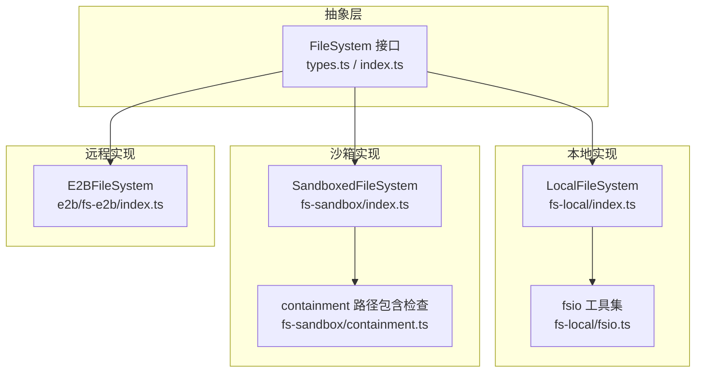
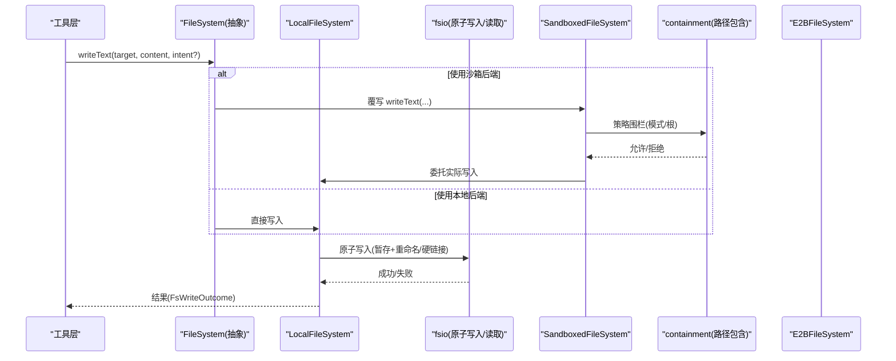
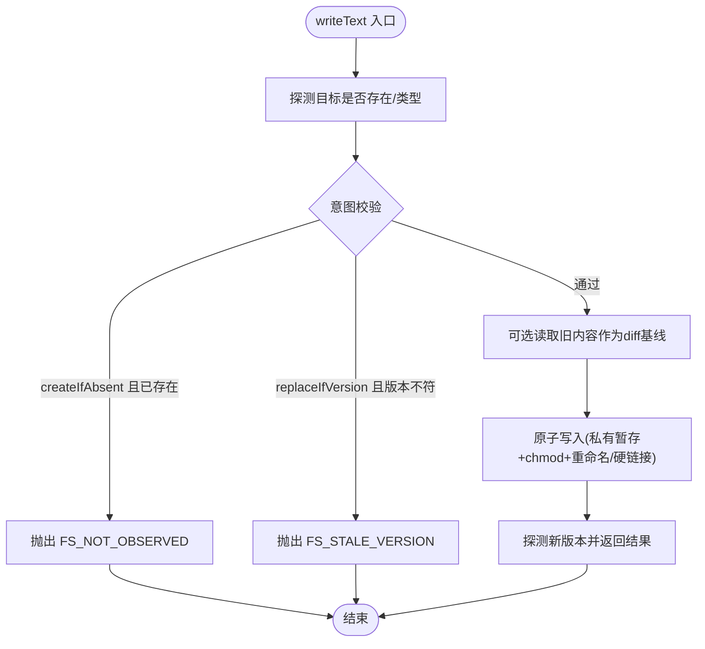
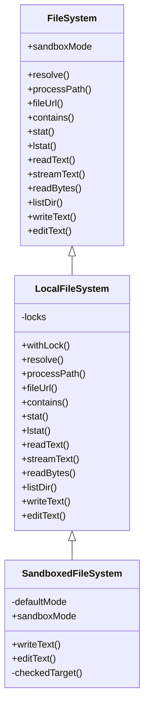
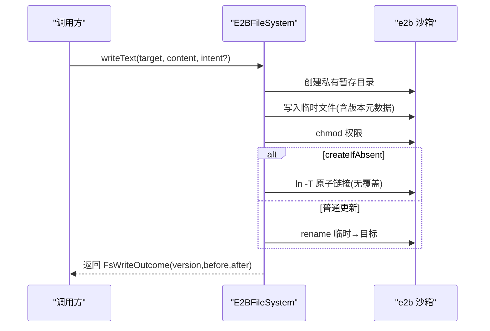
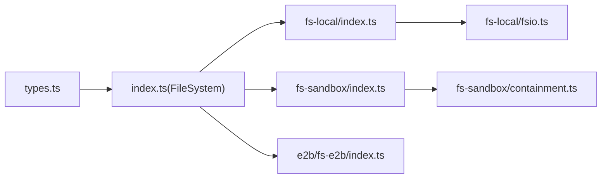

# 文件系统提供商实现示例

<cite>
**本文引用的文件**
- [packages/fs/fs/src/types.ts](file://packages/fs/fs/src/types.ts)
- [packages/fs/fs/src/index.ts](file://packages/fs/fs/src/index.ts)
- [packages/fs/fs-local/src/index.ts](file://packages/fs/fs-local/src/index.ts)
- [packages/fs/fs-local/src/fsio.ts](file://packages/fs/fs-local/src/fsio.ts)
- [packages/fs/fs-sandbox/src/index.ts](file://packages/fs/fs-sandbox/src/index.ts)
- [packages/fs/fs-sandbox/src/containment.ts](file://packages/fs/fs-sandbox/src/containment.ts)
- [packages/e2b/fs-e2b/src/index.ts](file://packages/e2b/fs-e2b/src/index.ts)
</cite>

## 目录
1. [简介](#简介)
2. [项目结构](#项目结构)
3. [核心组件](#核心组件)
4. [架构总览](#架构总览)
5. [详细组件分析](#详细组件分析)
6. [依赖关系分析](#依赖关系分析)
7. [性能考量](#性能考量)
8. [故障排查指南](#故障排查指南)
9. [结论](#结论)
10. [附录](#附录)

## 简介
本文件面向 DeepSeek Harness 的文件系统能力，提供三种文件系统提供商的实现示例与最佳实践：本地文件系统（fs-local）、沙箱文件系统（fs-sandbox）与远程文件系统（fs-e2b）。文档以接口契约为核心，逐步展开到具体实现、错误处理、并发安全、数据一致性与事务性保障，并说明工具层如何与文件系统提供商交互。

## 项目结构
围绕文件系统能力，仓库按“抽象接口 + 多后端实现”的方式组织：
- 抽象接口与类型定义位于 fs 包，定义了 FileSystem 服务、目标标识、版本令牌、读写意图、编辑请求与结构化错误等。
- 本地实现 fs-local 基于宿主文件系统，提供原子写入、流式读取、目录遍历、路径解析与包含性检查等。
- 沙箱实现 fs-sandbox 继承本地实现，在写操作前进行策略围栏（只读/工作区可写/危险全开），确保受控访问。
- 远程实现 fs-e2b 将文件操作映射到远程 e2b 沙箱，通过命令与文件 API 完成元数据、内容读写与原子发布。

图表来源
- [packages/fs/fs/src/index.ts:86-250](file://packages/fs/fs/src/index.ts#L86-L250)
- [packages/fs/fs/src/types.ts:11-204](file://packages/fs/fs/src/types.ts#L11-L204)
- [packages/fs/fs-local/src/index.ts:64-263](file://packages/fs/fs-local/src/index.ts#L64-L263)
- [packages/fs/fs-local/src/fsio.ts:518-615](file://packages/fs/fs-local/src/fsio.ts#L518-L615)
- [packages/fs/fs-sandbox/src/index.ts:59-148](file://packages/fs/fs-sandbox/src/index.ts#L59-L148)
- [packages/fs/fs-sandbox/src/containment.ts:46-77](file://packages/fs/fs-sandbox/src/containment.ts#L46-L77)
- [packages/e2b/fs-e2b/src/index.ts:170-583](file://packages/e2b/fs-e2b/src/index.ts#L170-L583)

章节来源
- [packages/fs/fs/src/index.ts:86-250](file://packages/fs/fs/src/index.ts#L86-L250)
- [packages/fs/fs/src/types.ts:11-204](file://packages/fs/fs/src/types.ts#L11-L204)

## 核心组件
- FileSystem 抽象服务：定义 resolve、processPath、fileUrl、contains、stat、lstat、readText、streamText、readBytes、listDir、writeText、editText 等统一接口；暴露 sandboxMode 能力事实；通过事件机制支持意图拦截与观察记录。
- 类型与错误体系：FsTargetKey、FsVersion、FsObservation、FsInfo、FsPathInfo、FsDirEntry、FsWriteIntent、FsEditRequest、FsWriteOutcome、FsEditOutcome 以及 FsError/FsErrorCode 分类。
- 本地实现 LocalFileSystem：基于 realpath 的目标稳定性、原子写入（私有暂存目录+重命名/硬链接）、行尾归一化与恢复、流式读取、目录遍历、并发锁（每 targetKey 串行化写/编辑）。
- 沙箱实现 SandboxedFileSystem：继承本地实现，重写 writeText/editText，在调用前依据 per-call 策略（read-only/workspace-write/danger-full-access）进行围栏，拒绝越权写入并抛出 FS_SANDBOX_DENIED。
- 远程实现 E2BFileSystem：通过 e2b SDK 执行命令与文件 API，实现统计、流式读取、二进制检测、UTF-8 校验、目录列出、原子发布（临时目录+chmod+rename/ln -T）与版本令牌生成。

章节来源
- [packages/fs/fs/src/index.ts:86-250](file://packages/fs/fs/src/index.ts#L86-L250)
- [packages/fs/fs/src/types.ts:11-204](file://packages/fs/fs/src/types.ts#L11-L204)
- [packages/fs/fs-local/src/index.ts:64-263](file://packages/fs/fs-local/src/index.ts#L64-L263)
- [packages/fs/fs-sandbox/src/index.ts:59-148](file://packages/fs/fs-sandbox/src/index.ts#L59-L148)
- [packages/e2b/fs-e2b/src/index.ts:170-583](file://packages/e2b/fs-e2b/src/index.ts#L170-L583)

## 架构总览
下图展示了从工具层到不同文件系统后端的调用链与职责边界：

图表来源
- [packages/fs/fs-sandbox/src/index.ts:84-113](file://packages/fs/fs-sandbox/src/index.ts#L84-L113)
- [packages/fs/fs-sandbox/src/containment.ts:46-77](file://packages/fs/fs-sandbox/src/containment.ts#L46-L77)
- [packages/fs/fs-local/src/index.ts:166-218](file://packages/fs/fs-local/src/index.ts#L166-L218)
- [packages/fs/fs-local/src/fsio.ts:518-615](file://packages/fs/fs-local/src/fsio.ts#L518-L615)

## 详细组件分析

### 抽象接口与类型契约
- 目标与版本：FsTargetKey/FsVersion 为不透明标识，避免消费者解析内部细节；FsObservation 用于记录存在/不存在观测。
- 元数据与列举：FsInfo/FsPathInfo/FsDirEntry 描述文件/目录/符号链接及大小、版本等轻量信息，列举不读取内容。
- 写入与编辑：FsWriteIntent 支持 createIfAbsent/replaceIfVersion；FsEditRequest 支持字面量替换与全局替换；FsWriteOutcome/FsEditOutcome 返回 before/after/version 以便计算差异。
- 错误体系：FsError/FsErrorCode 提供稳定错误码（如 FS_NOT_FOUND、FS_STALE_VERSION、FS_AMBIGUOUS_EDIT、FS_SANDBOX_DENIED 等），便于重试、权限提示与 UI 分支。

章节来源
- [packages/fs/fs/src/types.ts:11-204](file://packages/fs/fs/src/types.ts#L11-L204)
- [packages/fs/fs/src/index.ts:86-250](file://packages/fs/fs/src/index.ts#L86-L250)

### 本地文件系统（fs-local）
- 目标解析与包含性：resolve 将相对路径解析为绝对显示路径与 realpath 稳定的 targetKey；contains 基于相对路径与平台分隔符判断子目录关系。
- 元数据与列举：stat/lstat 返回类型、大小与版本；listDir 按名称排序返回子项与目标，不读取内容。
- 读取：readText/streamText/readBytes 分别提供文本读取、流式文本与受限字节读取；二进制检测与 UTF-8 校验由底层实现负责。
- 原子写入与编辑：writeText 先探测目标、校验写入意图、可选读取 diff 基线、原子写入（私有暂存目录+chmod+重命名/硬链接）；editText 在锁定窗口内读取→匹配→写入，保持行尾风格。
- 并发安全：每个 targetKey 维护尾部 Promise 链，串行化写/编辑，避免竞态；版本令牌用于 stale 保护。

图表来源
- [packages/fs/fs-local/src/index.ts:166-218](file://packages/fs/fs-local/src/index.ts#L166-L218)
- [packages/fs/fs-local/src/fsio.ts:518-615](file://packages/fs/fs-local/src/fsio.ts#L518-L615)

章节来源
- [packages/fs/fs-local/src/index.ts:64-263](file://packages/fs/fs-local/src/index.ts#L64-L263)
- [packages/fs/fs-local/src/fsio.ts:146-194](file://packages/fs/fs-local/src/fsio.ts#L146-L194)
- [packages/fs/fs-local/src/fsio.ts:230-321](file://packages/fs/fs-local/src/fsio.ts#L230-L321)
- [packages/fs/fs-local/src/fsio.ts:375-463](file://packages/fs/fs-local/src/fsio.ts#L375-L463)
- [packages/fs/fs-local/src/fsio.ts:518-615](file://packages/fs/fs-local/src/fsio.ts#L518-L615)

### 沙箱文件系统（fs-sandbox）
- 继承本地实现：复用所有 I/O 与原子写入逻辑，仅在写操作前增加策略围栏。
- 策略模式：read-only 拒绝一切写入；workspace-write 要求目标规范化后位于可写根（工作区或平台临时区域）；danger-full-access 放行。
- 路径包含检查：isPathUnder 采用“快速词法比较 + 保守身份比较”的策略，兼容 Windows 长名/8.3 别名与大小写差异。
- 错误语义：拒绝时抛出 FS_SANDBOX_DENIED，工具层据此提示升级或回退。

图表来源
- [packages/fs/fs/src/index.ts:86-250](file://packages/fs/fs/src/index.ts#L86-L250)
- [packages/fs/fs-local/src/index.ts:64-263](file://packages/fs/fs-local/src/index.ts#L64-L263)
- [packages/fs/fs-sandbox/src/index.ts:59-148](file://packages/fs/fs-sandbox/src/index.ts#L59-L148)

章节来源
- [packages/fs/fs-sandbox/src/index.ts:59-148](file://packages/fs/fs-sandbox/src/index.ts#L59-L148)
- [packages/fs/fs-sandbox/src/containment.ts:46-77](file://packages/fs/fs-sandbox/src/containment.ts#L46-L77)

### 远程文件系统（fs-e2b）
- 目标解析与 URI：resolve 将路径解析为 e2b 沙箱内的绝对路径，并通过命令获取规范路径；fileUrl 编码为 file:// URI。
- 元数据与列举：stat/lstat 通过 getInfo 获取条目信息；listDir 列出子项并按名称排序，对符号链接进行解析。
- 读取：readText 读取字节并检测二进制与 UTF-8；streamText 流式解码并在首段采样中检测二进制；readBytes 限制最大字节数并流式聚合。
- 原子写入：创建私有暂存目录，写入内容并设置元数据版本 ID，chmod 权限，然后 rename 或 ln -T 发布；失败时清理暂存目录并映射为标准 FsError。
- 并发安全：同本地实现，使用 per-targetKey 的尾部 Promise 锁串行化写/编辑。

图表来源
- [packages/e2b/fs-e2b/src/index.ts:376-429](file://packages/e2b/fs-e2b/src/index.ts#L376-L429)
- [packages/e2b/fs-e2b/src/index.ts:510-579](file://packages/e2b/fs-e2b/src/index.ts#L510-L579)

章节来源
- [packages/e2b/fs-e2b/src/index.ts:170-583](file://packages/e2b/fs-e2b/src/index.ts#L170-L583)

## 依赖关系分析
- 抽象层依赖：FileSystem 仅依赖类型与 Cordis 上下文；不耦合任何具体后端。
- 本地实现依赖：fsio 提供跨平台的原子写入、读取、列举与编辑工具；win32 模块处理 Windows 特殊行为（DACL 复制与替换）。
- 沙箱实现依赖：fs-sandbox 依赖 fs-local 与 containment 模块，以及 sandboxPolicy 提供的默认模式与工作区根集合。
- 远程实现依赖：e2b 包提供命令执行与文件 API；fs-e2b 将错误映射为 FsError，保证上层一致性。

图表来源
- [packages/fs/fs/src/types.ts:11-204](file://packages/fs/fs/src/types.ts#L11-L204)
- [packages/fs/fs/src/index.ts:86-250](file://packages/fs/fs/src/index.ts#L86-L250)
- [packages/fs/fs-local/src/index.ts:64-263](file://packages/fs/fs-local/src/index.ts#L64-L263)
- [packages/fs/fs-local/src/fsio.ts:518-615](file://packages/fs/fs-local/src/fsio.ts#L518-L615)
- [packages/fs/fs-sandbox/src/index.ts:59-148](file://packages/fs/fs-sandbox/src/index.ts#L59-L148)
- [packages/fs/fs-sandbox/src/containment.ts:46-77](file://packages/fs/fs-sandbox/src/containment.ts#L46-L77)
- [packages/e2b/fs-e2b/src/index.ts:170-583](file://packages/e2b/fs-e2b/src/index.ts#L170-L583)

章节来源
- [packages/fs/fs/src/index.ts:86-250](file://packages/fs/fs/src/index.ts#L86-L250)
- [packages/fs/fs-local/src/fsio.ts:518-615](file://packages/fs/fs-local/src/fsio.ts#L518-L615)
- [packages/fs/fs-sandbox/src/index.ts:59-148](file://packages/fs/fs-sandbox/src/index.ts#L59-L148)
- [packages/e2b/fs-e2b/src/index.ts:170-583](file://packages/e2b/fs-e2b/src/index.ts#L170-L583)

## 性能考量
- 流式读取：streamText/readBytes 使用流式 I/O，避免大文件一次性加载内存；readBytes 在 stat 预检与流式读取阶段双重限制 maxBytes，防止增长型文件导致溢出。
- 二进制检测：在首段采样中检测 NUL 字节，尽早拒绝二进制文件，减少无效解码成本。
- 原子写入：私有暂存目录+chmod+重命名/硬链接，最小化竞争窗口；Windows 下保留 DACL，提升安全性与兼容性。
- 并发控制：per-targetKey 的尾部 Promise 锁串行化写/编辑，保证版本令牌有效性与结果确定性。
- 远程优化：e2b 端通过命令与文件 API 组合实现原子发布，减少网络往返；流式读取分块聚合，及时释放资源。

[本节为通用性能建议，不直接分析具体文件]

## 故障排查指南
- 常见错误码与场景：
  - FS_NOT_FOUND：路径不存在或父段不是目录。
  - FS_NOT_DIRECTORY：对非目录执行 listDir。
  - FS_NOT_TEXT：二进制文件或非法 UTF-8。
  - FS_TOO_LARGE：超出 readBytes 限制。
  - FS_PERMISSION_DENIED：权限不足。
  - FS_SANDBOX_DENIED：沙箱策略拒绝写入。
  - FS_IO_ERROR：底层 I/O 异常。
  - FS_STALE_VERSION：版本不一致，读后内容被修改。
  - FS_NOT_OBSERVED：未读取就尝试覆盖。
  - FS_AMBIGUOUS_EDIT：字面量匹配多次但未启用 replaceAll。
  - FS_EDIT_NOT_FOUND：old_string 为空或未找到。
  - FS_ABORTED：操作被中止信号取消。
- 定位步骤：
  - 确认目标是否已被 resolve 并 contains 于预期根。
  - 检查沙箱模式与可写根集合，必要时调整策略。
  - 查看版本令牌是否过期，必要时重新读取。
  - 对于远程实现，检查 e2b 命令输出与错误映射。

章节来源
- [packages/fs/fs/src/types.ts:170-204](file://packages/fs/fs/src/types.ts#L170-L204)
- [packages/fs/fs-local/src/fsio.ts:230-321](file://packages/fs/fs-local/src/fsio.ts#L230-L321)
- [packages/fs/fs-local/src/fsio.ts:375-463](file://packages/fs/fs-local/src/fsio.ts#L375-L463)
- [packages/fs/fs-local/src/fsio.ts:518-615](file://packages/fs/fs-local/src/fsio.ts#L518-L615)
- [packages/fs/fs-sandbox/src/index.ts:126-148](file://packages/fs/fs-sandbox/src/index.ts#L126-L148)
- [packages/e2b/fs-e2b/src/index.ts:135-147](file://packages/e2b/fs-e2b/src/index.ts#L135-L147)

## 结论
通过统一的 FileSystem 抽象与三类后端实现，DeepSeek Harness 提供了可扩展、安全且高性能的文件系统能力：
- 本地实现满足常规开发与调试需求，具备原子写入与并发安全。
- 沙箱实现提供细粒度策略围栏，确保模型可控路径下的安全写入。
- 远程实现将文件系统迁移至 e2b 沙箱，保持接口一致性与事务性。
结合稳定的错误码与版本令牌，工具层可以可靠地处理重试、权限提示与用户交互，同时保证数据一致性与可观测性。

[本节为总结性内容，不直接分析具体文件]

## 附录
- 工具层交互要点：
  - 通过 ctx.fs 调用统一接口，无需关心后端差异。
  - 利用 FsWriteIntent 与版本令牌实现乐观锁式写入。
  - 借助 FsError.code 进行分支处理（重试、降级、提示升级）。
- 扩展新后端建议：
  - 实现 FileSystem 全部抽象方法，遵循类型与错误约定。
  - 在写/编辑路径中实现原子发布与并发锁。
  - 若需策略围栏，参考 fs-sandbox 的模式与 isPathUnder 实现。

[本节为补充说明，不直接分析具体文件]