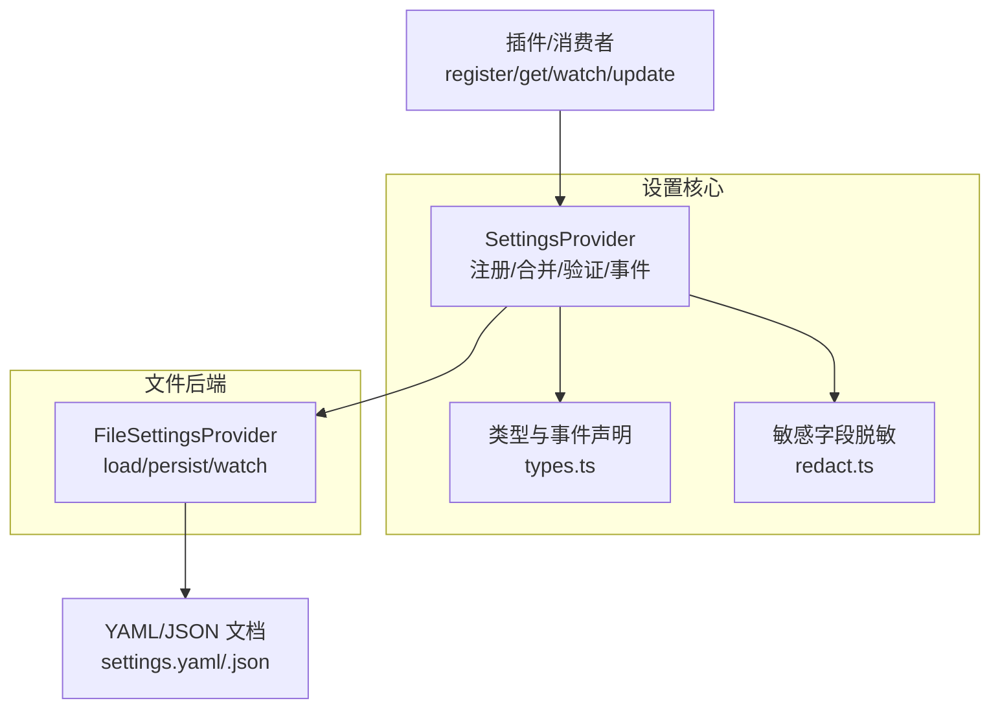
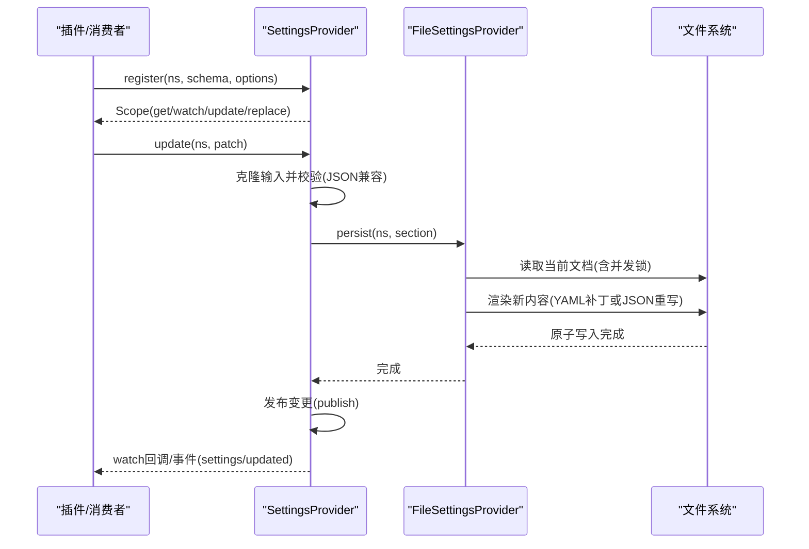
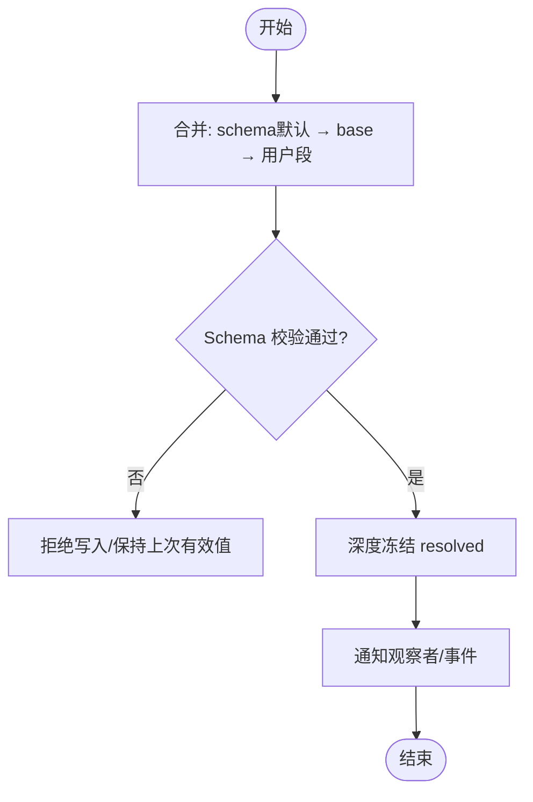
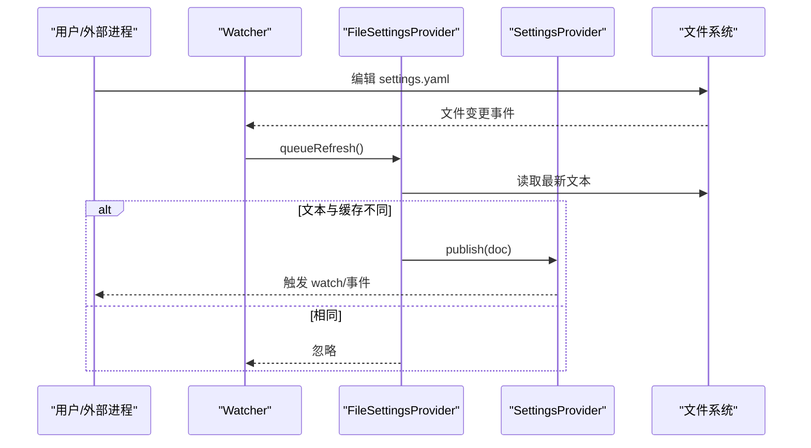
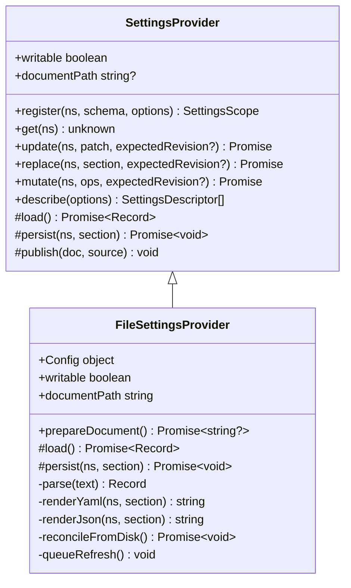
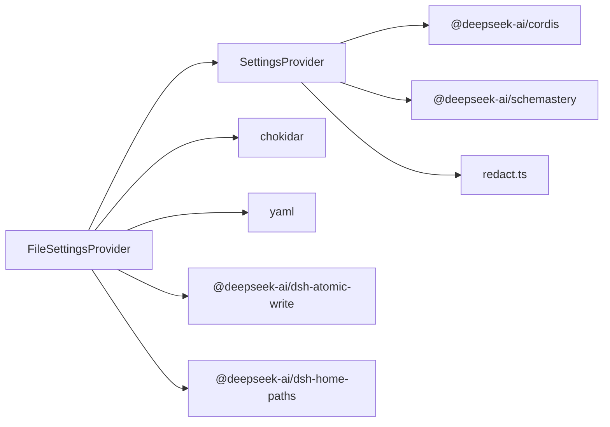

# 设置管理器实现示例

<cite>
**本文引用的文件**
- [packages/settings/settings/src/index.ts](file://packages/settings/settings/src/index.ts)
- [packages/settings/settings/src/types.ts](file://packages/settings/settings/src/types.ts)
- [packages/settings/settings/src/redact.ts](file://packages/settings/settings/src/redact.ts)
- [packages/settings/settings-file/src/index.ts](file://packages/settings/settings-file/src/index.ts)
- [packages/settings/settings-file/README.md](file://packages/settings/settings-file/README.md)
- [packages/settings/settings/tests/settings.spec.ts](file://packages/settings/settings/tests/settings.spec.ts)
- [packages/settings/settings-file/tests/local.spec.ts](file://packages/settings/settings-file/tests/local.spec.ts)
</cite>

## 目录
1. [简介](#简介)
2. [项目结构](#项目结构)
3. [核心组件](#核心组件)
4. [架构总览](#架构总览)
5. [详细组件分析](#详细组件分析)
6. [依赖关系分析](#依赖关系分析)
7. [性能考量](#性能考量)
8. [故障排查指南](#故障排查指南)
9. [结论](#结论)
10. [附录](#附录)

## 简介
本文件面向 DeepSeek Harness 的设置系统，聚焦“分层设置 + 可插拔存储后端”的设计与实现。重点说明：
- 设置的分层合并机制：Schema 默认值 → 插件 base → 用户文档段
- 基于 YAML/JSON 的 settings-file 后端：解析、验证、热重载、原子写入与注释保留
- 命名空间注册与 Schema 定义、变更通知与生命周期管理
- 最佳实践与常见问题解决方案

## 项目结构
- settings（核心）：提供 SettingsProvider 抽象、命名空间注册、合并与验证、事件与观察者、敏感字段脱敏等
- settings-file（实现）：基于本地文件的提供者，支持 YAML/JSON、热重载、跨进程写锁、原子写入与注释保留
- tests：覆盖核心行为与文件后端的边界条件、并发、热重载等

图表来源
- [packages/settings/settings/src/index.ts:350-800](file://packages/settings/settings/src/index.ts#L350-L800)
- [packages/settings/settings-file/src/index.ts:105-368](file://packages/settings/settings-file/src/index.ts#L105-L368)

章节来源
- [packages/settings/settings/src/index.ts:1-157](file://packages/settings/settings/src/index.ts#L1-L157)
- [packages/settings/settings-file/src/index.ts:1-67](file://packages/settings/settings-file/src/index.ts#L1-L67)

## 核心组件
- SettingsProvider（抽象服务）
  - 负责命名空间注册、值解析（schema→base→user）、变更检测、持久化钩子、观察者通知与事件广播
  - 提供 update/replace/mutate 三种写入模式，序列化同一命名空间的写操作队列
  - 暴露 describe() 用于配置界面展示 schema、当前值、用户覆盖层与生效时机
- FileSettingsProvider（文件后端）
  - 实现 load/persist，支持 YAML/JSON；watcher 监听外部编辑并热重载
  - 使用原子写入与跨进程写锁，保证并发安全与一致性
  - YAML 场景下以最小差异 patch 保留注释、锚点与格式

章节来源
- [packages/settings/settings/src/index.ts:350-800](file://packages/settings/settings/src/index.ts#L350-L800)
- [packages/settings/settings-file/src/index.ts:105-368](file://packages/settings/settings-file/src/index.ts#L105-L368)

## 架构总览
设置系统采用“抽象服务 + 具体后端”的分层设计：
- 上层（插件/消费者）通过 ctx.settings.register 注册命名空间与 Schema，获得 Scope 进行读、观察与写
- 中间层（SettingsProvider）负责合并策略、校验、事件与观察者
- 底层（FileSettingsProvider）负责文档 I/O、热重载与并发控制

图表来源
- [packages/settings/settings/src/index.ts:577-648](file://packages/settings/settings/src/index.ts#L577-L648)
- [packages/settings/settings-file/src/index.ts:184-230](file://packages/settings/settings-file/src/index.ts#L184-L230)

## 详细组件分析

### 设置分层与合并机制
- 三层合并顺序：Schema 默认值 → 插件 base → 用户文档段
- 合并规则：对象递归合并，数组与其他值整体替换
- 不可变快照：resolved 值深度冻结，避免外部修改
- 路径级更新：mutate 支持 set/unset 路径操作，适合持有部分视图的场景

图表来源
- [packages/settings/settings/src/index.ts:290-312](file://packages/settings/settings/src/index.ts#L290-L312)
- [packages/settings/settings/src/index.ts:696-710](file://packages/settings/settings/src/index.ts#L696-L710)

章节来源
- [packages/settings/settings/src/index.ts:290-312](file://packages/settings/settings/src/index.ts#L290-L312)
- [packages/settings/settings/src/index.ts:696-710](file://packages/settings/settings/src/index.ts#L696-L710)

### 命名空间注册与 Schema 定义
- 命名空间标识：小写短横线命名，带品牌类型保护
- 注册选项：
  - base：插件提供的基线值，位于 schema 默认值之上、用户段之下
  - applies：生效时机 live 或 restart
  - validate：跨字段约束校验，失败时拒绝写入或阻止注册
- 描述能力：describe() 返回 schema JSON、当前值、用户覆盖层与生效时机，供 UI 渲染

章节来源
- [packages/settings/settings/src/index.ts:19-31](file://packages/settings/settings/src/index.ts#L19-L31)
- [packages/settings/settings/src/index.ts:36-90](file://packages/settings/settings/src/index.ts#L36-L90)
- [packages/settings/settings/src/index.ts:435-512](file://packages/settings/settings/src/index.ts#L435-L512)

### settings-file 后端：YAML/JSON 存储与热重载
- 配置文件位置与格式
  - 默认路径：<harness home>/settings.yaml；可通过 path/dshHome 指定
  - 支持 .yaml/.yml/.json；扩展名决定解析器
- 解析与验证
  - 启动时若存在但无效则失败；运行中外部编辑无效则告警并保留上次有效文档
  - 根必须为映射（namespace → 段），否则报错
- 热重载
  - 使用 chokidar 监听文件变化，去抖窗口 debounceMs
  - ready 时做一次 reconcile，关闭启动竞态
  - 自身写入通过内容缓存自抑制，避免重复发布
- 写入策略
  - 每次写入先重新读取磁盘，合并未观测到的变更，再渲染新内容
  - YAML 使用最小差异 patch 保留注释与格式；JSON 直接重写
  - 原子写入：临时文件 + 重命名，权限 0600，父目录 0700
  - 跨进程写锁：独占创建 <file>.lock，指数退避与超时，避免损坏用户编辑
- 文档路径与准备
  - documentPath 暴露绝对路径；prepareDocument 可为空文件并赋予仅所有者权限

图表来源
- [packages/settings/settings-file/src/index.ts:232-269](file://packages/settings/settings-file/src/index.ts#L232-L269)
- [packages/settings/settings-file/src/index.ts:304-338](file://packages/settings/settings-file/src/index.ts#L304-L338)

章节来源
- [packages/settings/settings-file/src/index.ts:20-67](file://packages/settings/settings-file/src/index.ts#L20-L67)
- [packages/settings/settings-file/src/index.ts:170-230](file://packages/settings/settings-file/src/index.ts#L170-L230)
- [packages/settings/settings-file/src/index.ts:271-367](file://packages/settings/settings-file/src/index.ts#L271-L367)
- [packages/settings/settings-file/README.md:18-31](file://packages/settings/settings-file/README.md#L18-L31)

### 变更通知与生命周期管理
- 观察者模型
  - watch(next, prev) 串行执行，按提交顺序调用，异常被隔离并记录
  - 释放后不再调度新的调用，已排队的调用在 disposed 前会检查 active
- 事件模型
  - settings/updated：当 resolved 值发生深相等比较后的变化时触发，source 区分 update/provider
  - settings/document-updated：当原始用户段发生变化时触发（即使 resolved 未变），携带 revision
- 冲突与版本
  - 可选 expectedRevision 防止基于过期快照的写入冲突
- 服务销毁
  - 停止接受新写，等待所有写链与观察者尾任务完成，确保资源清理有序

章节来源
- [packages/settings/settings/src/index.ts:102-129](file://packages/settings/settings/src/index.ts#L102-L129)
- [packages/settings/settings/src/index.ts:657-799](file://packages/settings/settings/src/index.ts#L657-L799)
- [packages/settings/settings/src/types.ts:18-49](file://packages/settings/settings/src/types.ts#L18-L49)

### 敏感字段脱敏
- 通过 Schema 标记 role('secret') 的字段，在跨进程/网络传输前移除
- 同时输出 secrets 清单，告知 UI 哪些位置存在敏感字段及其是否被设置
- 脱敏不影响本地内存中的完整值，仅在 describe(redactSecrets=true) 时应用

章节来源
- [packages/settings/settings/src/redact.ts:1-110](file://packages/settings/settings/src/redact.ts#L1-L110)
- [packages/settings/settings/src/index.ts:92-100](file://packages/settings/settings/src/index.ts#L92-L100)
- [packages/settings/settings/src/index.ts:479-512](file://packages/settings/settings/src/index.ts#L479-L512)

### 代码级类图（SettingsProvider 与 FileSettingsProvider）

图表来源
- [packages/settings/settings/src/index.ts:350-800](file://packages/settings/settings/src/index.ts#L350-L800)
- [packages/settings/settings-file/src/index.ts:105-368](file://packages/settings/settings-file/src/index.ts#L105-L368)

## 依赖关系分析
- 核心依赖
  - @deepseek-ai/cordis：Context/Service/Events 框架
  - @deepseek-ai/schemastery：Schema 定义与运行时校验
  - chokidar：文件监听
  - yaml：YAML 解析与注释保留
  - @deepseek-ai/dsh-atomic-write：原子写入与写锁
  - @deepseek-ai/dsh-home-paths：harness home 解析与路径规范化
- 耦合与内聚
  - SettingsProvider 与 FileSettingsProvider 通过抽象方法解耦 I/O
  - 事件与观察者通过 Context 解耦订阅方
  - 脱敏逻辑独立模块，便于在不同出口复用

图表来源
- [packages/settings/settings/src/index.ts:9-17](file://packages/settings/settings/src/index.ts#L9-L17)
- [packages/settings/settings-file/src/index.ts:10-18](file://packages/settings/settings-file/src/index.ts#L10-L18)

章节来源
- [packages/settings/settings/src/index.ts:9-17](file://packages/settings/settings/src/index.ts#L9-L17)
- [packages/settings/settings-file/src/index.ts:10-18](file://packages/settings/settings-file/src/index.ts#L10-L18)

## 性能考量
- 写操作串行化：同一命名空间写队列避免并发竞争，失败不污染后续写入
- 观察者串行化：每个观察者的回调按提交顺序串行执行，避免竞态
- 文档热重载去抖：debounceMs 减少频繁写入导致的抖动
- 最小差异渲染：YAML 仅变更节点，保留注释与格式，降低 I/O 与可读性损失
- 原子写入与锁：避免部分写入导致的不一致，提升可靠性

[本节为通用指导，无需特定文件引用]

## 故障排查指南
- 启动失败
  - 文档存在但不可读或无法解析：启动阶段会失败，需修复文档后再启动
  - 根不是映射：需将顶层改为 namespace → 段的对象结构
- 运行期外部编辑无效
  - 无效文档会被忽略并告警，保留上次有效值；修复后下次 reload 自动恢复
- 写入冲突
  - 使用 expectedRevision 检测基于过期快照的写入，抛出冲突错误
- 观察者异常
  - 单个观察者抛错不会阻塞其他观察者或后续提交；异步拒绝也会被捕获
- 文件权限问题
  - 文档与目录权限分别为 0600/0700；如遇权限错误，检查宿主环境权限设置

章节来源
- [packages/settings/settings-file/README.md:18-31](file://packages/settings/settings-file/README.md#L18-L31)
- [packages/settings/settings/tests/settings.spec.ts:322-367](file://packages/settings/settings/tests/settings.spec.ts#L322-L367)
- [packages/settings/settings-file/tests/local.spec.ts:131-165](file://packages/settings/settings-file/tests/local.spec.ts#L131-L165)

## 结论
DeepSeek Harness 的设置系统通过清晰的层次划分与可扩展的后端接口，实现了：
- 强类型的 Schema 驱动配置
- 稳定的分层合并与不可变值
- 可靠的热重载与并发安全
- 完善的变更通知与生命周期管理
- 对 YAML 友好的注释保留与人类可读性

建议在生产环境中结合 expectedRevision 与 validate 增强一致性，利用 describe 构建安全的配置界面，并通过 settings-file 的原子写入与写锁保障多进程安全。

[本节为总结性内容，无需特定文件引用]

## 附录

### 配置项参考（settings-file）
- path：设置文档路径；扩展名决定格式（.yaml/.yml/.json）
- dshHome：当省略 path 时的 harness home；默认 $DSH_HOME 或 ~/.dsh
- watch：是否监听文件并热重载；默认 true
- debounceMs：写去抖窗口（毫秒）；默认 100

章节来源
- [packages/settings/settings-file/README.md:7-16](file://packages/settings/settings-file/README.md#L7-L16)

### 常见用法要点
- 注册命名空间与 Schema，并提供 base 作为插件默认
- 使用 update/replace/mutate 进行增量、全量与路径级更新
- 通过 watch 监听变更，处理副作用（如刷新连接、重建索引）
- 通过 describe 获取 schema 与当前值，构建配置界面；必要时开启 redactSecrets
- 在跨进程场景中，使用 expectedRevision 避免脏写

章节来源
- [packages/settings/settings/src/index.ts:102-129](file://packages/settings/settings/src/index.ts#L102-L129)
- [packages/settings/settings/src/index.ts:435-512](file://packages/settings/settings/src/index.ts#L435-L512)
- [packages/settings/settings/src/index.ts:577-648](file://packages/settings/settings/src/index.ts#L577-L648)