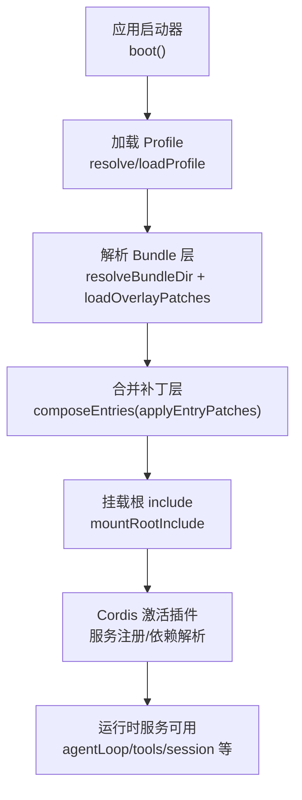
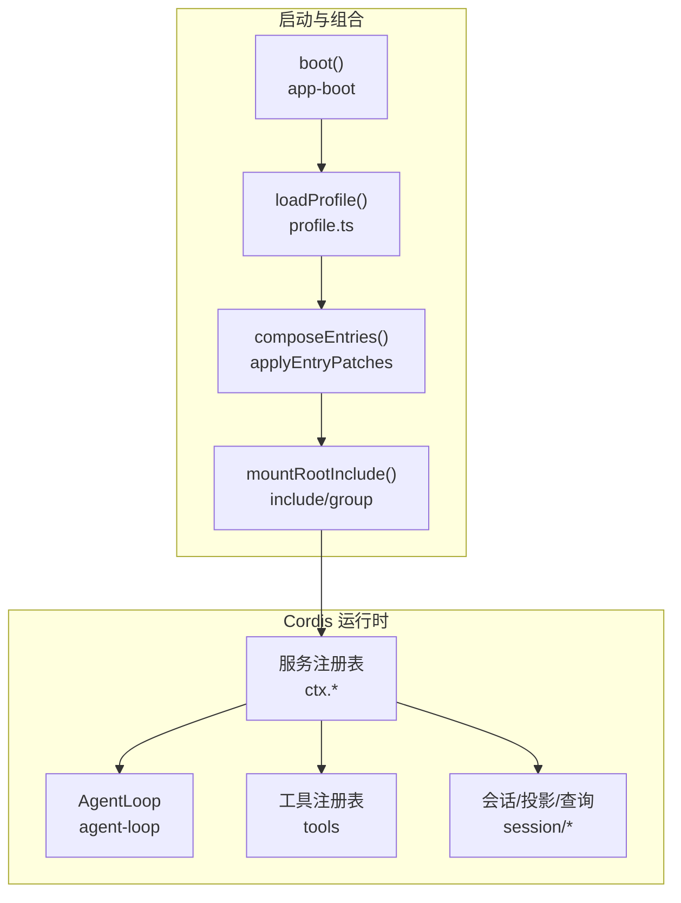
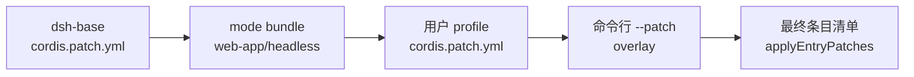

# 捆绑组合点

<cite>
**本文引用的文件**
- [packages/bundle/base/cordis.patch.yml](file://packages/bundle/base/cordis.patch.yml)
- [apps/cli/composition.md](file://apps/cli/composition.md)
- [examples/headless-agent/cordis.yml](file://examples/headless-agent/cordis.yml)
- [examples/acp-agent/cordis.yml](file://examples/acp-agent/cordis.yml)
- [packages/core/agent-loop/README.zh.md](file://packages/core/agent-loop/README.zh.md)
- [packages/core/agent-loop/src/index.ts](file://packages/core/agent-loop/src/index.ts)
- [packages/core/agent-loop/src/agent.ts](file://packages/core/agent-loop/src/agent.ts)
- [packages/boot/app-boot/README.zh.md](file://packages/boot/app-boot/README.zh.md)
- [packages/boot/app-boot/src/profile.ts](file://packages/boot/app-boot/src/profile.ts)
- [packages/boot/app-boot/tests/config-reload.spec.ts](file://packages/boot/app-boot/tests/config-reload.spec.ts)
- [packages/boot/app-boot/tests/profile.spec.ts](file://packages/boot/app-boot/tests/profile.spec.ts)
</cite>

## 目录
1. [简介](#简介)
2. [项目结构](#项目结构)
3. [核心组件](#核心组件)
4. [架构总览](#架构总览)
5. [详细组件分析](#详细组件分析)
6. [依赖关系分析](#依赖关系分析)
7. [性能考量](#性能考量)
8. [故障排查指南](#故障排查指南)
9. [结论](#结论)
10. [附录：开发指南与示例](#附录：开发指南与示例)

## 简介
本文件系统化阐述 DeepSeek Harness 的“捆绑组合点”设计：以可插拔、可叠加的配置层为核心，将多个相关服务与插件聚合为完整解决方案。重点覆盖 agent-loop、headless bundle 等关键组合点，说明它们如何协调服务与接缝（seams），并给出生命周期管理、资源清理机制以及创建新捆绑组合点的实践指南。

## 项目结构
Harness 通过“Profile + Bundle + Patch Layer”的分层组合模型组织配置：
- Profile：用户或发行版提供的运行环境模板，声明 bundles 列表与用户补丁层。
- Bundle：以 npm 包形式提供一组 patch 层，描述要插入/覆盖的 Cordis 条目。
- Patch Layer：按顺序应用，后者优先覆盖前者，最终生成待挂载的插件清单。



图表来源
- [packages/boot/app-boot/src/profile.ts:371-420](file://packages/boot/app-boot/src/profile.ts#L371-L420)
- [packages/boot/app-boot/README.zh.md:36-38](file://packages/boot/app-boot/README.zh.md#L36-L38)

章节来源
- [packages/boot/app-boot/src/profile.ts:1-421](file://packages/boot/app-boot/src/profile.ts#L1-L421)
- [packages/boot/app-boot/README.zh.md:36-38](file://packages/boot/app-boot/README.zh.md#L36-L38)

## 核心组件
- 基础捆绑（dsh-base）：提供所有模式共享的核心服务与工具，如 LLM、会话、权限、沙箱、工具注册、子代理、工作流、压缩、遥测等。
- Agent Loop：唯一包含具体循环逻辑的组件，负责会话/轮次/步骤的生命周期驱动，并通过注册表发布 agent。
- Headless Bundle：面向无头场景的组合，聚焦持久化、子代理、工作流、文件系统工具等能力。
- ACP 自动化组合：面向 JSON-RPC 自动化的组合，强调沙箱策略、审批、hooks 桥接与最小 UI 暴露。

章节来源
- [packages/bundle/base/cordis.patch.yml:1-452](file://packages/bundle/base/cordis.patch.yml#L1-L452)
- [packages/core/agent-loop/README.zh.md:1-19](file://packages/core/agent-loop/README.zh.md#L1-L19)
- [examples/headless-agent/cordis.yml:1-166](file://examples/headless-agent/cordis.yml#L1-L166)
- [examples/acp-agent/cordis.yml:1-193](file://examples/acp-agent/cordis.yml#L1-L193)

## 架构总览
下图展示从启动到服务可用的整体流程，以及各组合点在其中的角色。



图表来源
- [packages/boot/app-boot/src/profile.ts:371-420](file://packages/boot/app-boot/src/profile.ts#L371-L420)
- [packages/core/agent-loop/src/index.ts:1-37](file://packages/core/agent-loop/src/index.ts#L1-L37)

章节来源
- [packages/boot/app-boot/src/profile.ts:371-420](file://packages/boot/app-boot/src/profile.ts#L371-L420)
- [packages/core/agent-loop/src/index.ts:1-37](file://packages/core/agent-loop/src/index.ts#L1-L37)

## 详细组件分析

### 基础捆绑（dsh-base）
- 职责：提供跨模式共享的基础能力，包括计时/HMR、LLM、会话、类型系统、权限/沙箱、工具、命令、目标、子代理、工作流、压缩、溢出、检查点、Web 搜索、系统提示、Agent Loop、FS 沙箱、DeepSeek 适配器等。
- 组合方式：作为首个 insert 层注入空根；后续 bundle 与用户 profile 补丁按 id 定位逐行覆盖或禁用。
- 关键点：
  - 每行 config 是整段替换而非深合并，因此模式差异应放在各自 bundle 层。
  - 平台开关（如 bash/pwsh 沙箱）与环境变量（如 DSH_PERMISSION_MODE）决定默认行为。
  - 遥测默认关闭，可通过环境变量开启。

章节来源
- [packages/bundle/base/cordis.patch.yml:1-452](file://packages/bundle/base/cordis.patch.yml#L1-L452)
- [apps/cli/composition.md:1-253](file://apps/cli/composition.md#L1-L253)

### Agent Loop（agent-loop）
- 职责：唯一包含具体循环逻辑的组件，驱动会话/轮次/步骤生命周期，维护 agent 与 session 的创建、恢复、事件发布与停稳边界。
- 公开 API：create/resume 构成受回滚保护的事务；setup 阶段接收完整作用域上下文；进入注册表并发布事件后才启动驱动器。
- 所有权与停稳：调用方 fiber 与提供方共同拥有 agent；卸载、handle dispose 或提供方卸载收敛到同一记忆化停稳边界；提供者关闭等待资源 teardown 与已观测停用的包装层，确保依赖消失后不再继续发布。
- 并发与 ID：每个 agent 与 session 共享调用方选择的 sessionId；并发同 id 操作会仲裁最终 enter()，失败者回滚私有资源；detach 绑定精确对象，避免陈旧释放。

```mermaid
sequenceDiagram
participant App as "调用方 Fiber"
participant Loop as "AgentLoop"
participant Reg as "注册表"
participant Sess as "Session"
participant Agent as "Agent"
App->>Loop : create(id, options, meta?)
Loop->>Sess : 构造私有会话
Loop->>Agent : 构造具体 Agent
Loop->>Reg : 进入会话/Agent 注册表
Loop-->>App : 返回 handle可见前分离 AbortSignal
Note over Loop,Agent : 发布 session/created → agent/created → agent/session-start
Agent->>Agent : 启动驱动器
App-->>Loop : 卸载/释放
Loop->>Agent : stop/drain
Loop->>Sess : 解绑/释放
```

图表来源
- [packages/core/agent-loop/README.zh.md:9-19](file://packages/core/agent-loop/README.zh.md#L9-L19)
- [packages/core/agent-loop/src/index.ts:1-37](file://packages/core/agent-loop/src/index.ts#L1-L37)
- [packages/core/agent-loop/src/agent.ts:73-101](file://packages/core/agent-loop/src/agent.ts#L73-L101)

章节来源
- [packages/core/agent-loop/README.zh.md:1-19](file://packages/core/agent-loop/README.zh.md#L1-L19)
- [packages/core/agent-loop/src/index.ts:1-37](file://packages/core/agent-loop/src/index.ts#L1-L37)
- [packages/core/agent-loop/src/agent.ts:73-101](file://packages/core/agent-loop/src/agent.ts#L73-L101)

### Headless Bundle（无头组合）
- 特点：聚焦真实 DeepSeek 适配器与编码能力，预创建顶层 agent，JSONL 驱动仅用于测试；启用持久化、检查点、token 计量、压缩、会话投影、子代理与工作流。
- 典型配置要点：
  - 设置 settings/credentials/llm-deepseek。
  - 使用 subprocess/bash 执行器。
  - 预创建 main agent，指定 provider/model/cwd/persona。
  - 配置 persistence/checkpoint-policy/token-meter/compaction-basic。
  - 暴露 spawn/fork 子代理与工作流线程。
  - 挂载 fs-local 与 tool-fs，配合观察策略。

章节来源
- [examples/headless-agent/cordis.yml:1-166](file://examples/headless-agent/cordis.yml#L1-L166)

### ACP 自动化组合
- 特点：面向 JSON-RPC stdio 的自动化后端，无 stdout 日志与人类 UI；强调沙箱策略、审批、hooks 桥接与最小暴露面。
- 典型配置要点：
  - llm-deepseek 配置模型与思考策略。
  - sandbox/sandbox-policy 根据环境变量选择权限模式。
  - approval 策略与 bash-sandbox 集成。
  - acp-agent 组合 agent-spine + JSONL 持久化 + 协议桥。
  - 子代理控制、报告、工作流、重复提醒、fs-sandbox、工具链与 hooks。

章节来源
- [examples/acp-agent/cordis.yml:1-193](file://examples/acp-agent/cordis.yml#L1-L193)

## 依赖关系分析
- 组合顺序：base 最先注入，随后是 mode bundle（web-app/headless），最后是用户 profile 补丁层；patch 不跨越 include 边界，后层可覆盖前层插入的行。
- 模块解析：双锚点解析（安装目录优先，其次 profile 目录），保证 bundled 来自安装目录；profiles/node_modules 扁平符号链接使任意 profile 均可解析内置插件。
- 补丁合并：applyEntryPatches 在空条目上依次应用各层，确保 dump/标志推导与实际挂载一致。



图表来源
- [packages/boot/app-boot/src/profile.ts:371-420](file://packages/boot/app-boot/src/profile.ts#L371-L420)
- [packages/boot/app-boot/tests/config-reload.spec.ts:342-369](file://packages/boot/app-boot/tests/config-reload.spec.ts#L342-L369)

章节来源
- [packages/boot/app-boot/src/profile.ts:371-420](file://packages/boot/app-boot/src/profile.ts#L371-L420)
- [packages/boot/app-boot/tests/config-reload.spec.ts:342-369](file://packages/boot/app-boot/tests/config-reload.spec.ts#L342-L369)

## 性能考量
- 遥测导出：默认关闭，开启时注意 exporter.timeoutMillis、maxExportBatchSize、shutdownTimeoutMillis 对退出时延的影响。
- 压缩与溢出：compaction-basic 与 spill-policy 控制 token 预算与结果裁剪，避免请求过大。
- 子代理与工作流：spawn/fork 与 worker-thread 需结合 maxDepth、backgroundMode 限制深度与并行度。
- 文件系统：fs-observation-policy 要求读前写，减少不必要写入；sandbox 策略影响 I/O 路径。

[本节为通用指导，无需特定文件引用]

## 故障排查指南
- 未解析的插件或服务：使用 boot 断言（assertEntriesLoaded/assertEntriesActivated）捕获未激活项；检查 bundle 是否声明 dsh.bundle.patch。
- 补丁未生效：确认 patch 层顺序与 id 匹配；patch 不跨越 include 边界，后层才能覆盖前层插入的行。
- 权限与沙箱：DSH_PERMISSION_MODE 控制 sandbox 与 approval 策略；快照模式可能切换为 danger-full-access。
- 遥测与导出：DSH_TELEMETRY_MODE/DSH_TELEMETRY_OTLP_URL 控制上报；非空 DSH_TELEMETRY_DISABLED 会禁用。
- 模块解析失败：确保 profiles/node_modules 已修复；bundle 名称解析遵循安装目录优先。

章节来源
- [packages/boot/app-boot/README.zh.md:55-59](file://packages/boot/app-boot/README.zh.md#L55-L59)
- [packages/boot/app-boot/tests/config-reload.spec.ts:342-369](file://packages/boot/app-boot/tests/config-reload.spec.ts#L342-L369)
- [packages/boot/app-boot/src/profile.ts:344-355](file://packages/boot/app-boot/src/profile.ts#L344-L355)

## 结论
捆绑组合点是 Harness 实现“可插拔、可叠加、可验证”的关键：通过 Profile/Bundles/Patch Layers 的清晰分层，将分散的服务与插件聚合成稳定、可配置的解决方案。Agent Loop 提供唯一的循环驱动与生命周期保障；Headless/ACP 等组合点展示了不同运行形态下的能力装配。借助严格的补丁合并与模块解析契约，开发者可以安全地扩展与定制系统行为。

[本节为总结性内容，无需特定文件引用]

## 附录：开发指南与示例

### 如何创建新的捆绑组合点
- 定义 bundle 包：在 package.json 中声明 dsh.bundle.patch 指向你的 cordis.patch.yml。
- 编写补丁层：使用 insert 列表添加插件条目，或通过 id 覆盖/禁用已有行；注意 config 整段替换语义。
- 加入 Profile：在 dsh.profile.bundles 中按序列出 bundle；用户 cordis.patch.yml 最后应用。
- 验证组合：使用 --dump-default-config/--dump-config 输出最终条目，确认补丁顺序与覆盖符合预期。

章节来源
- [packages/boot/app-boot/src/profile.ts:1-421](file://packages/boot/app-boot/src/profile.ts#L1-L421)
- [packages/boot/app-boot/tests/profile.spec.ts:164-189](file://packages/boot/app-boot/tests/profile.spec.ts#L164-L189)

### 正确配置与使用示例
- Headless 示例：在 examples/headless-agent/cordis.yml 中，组合 settings/credentials/llm-deepseek、subprocess/bash、agent-spine、persistence/checkpoint-policy、token-meter/compaction-basic、session-projection、subagent/workflow/tool-*、fs-local/tool-fs 等。
- ACP 示例：在 examples/acp-agent/cordis.yml 中，组合 llm-deepseek、sandbox/sandbox-policy、approval、acp-agent、token-meter/compaction-basic、session-projection、subagent/workflow/tool-*、repeat-tool-reminder、fs-sandbox/tool-fs、hooks 等。

章节来源
- [examples/headless-agent/cordis.yml:1-166](file://examples/headless-agent/cordis.yml#L1-L166)
- [examples/acp-agent/cordis.yml:1-193](file://examples/acp-agent/cordis.yml#L1-L193)

### 生命周期管理与资源清理
- Agent Loop 生命周期：create/resume 事务化；setup 完成后进入注册表并发布事件；stop/drain → 解绑 scope → detach agent → detach session；id 在私有范围清理后可复用。
- 停稳边界：调用方卸载、handle dispose 或提供方卸载收敛到同一记忆化停稳边界；提供者关闭等待资源 teardown 与已观测停用的包装层，防止依赖消失后继续发布。
- 进程级清理：boot/installFailLoud 提供统一错误处理与释放钩子；SIGINT/SIGTERM 触发根上下文 dispose，确保导出器/子进程等资源被回收。

章节来源
- [packages/core/agent-loop/README.zh.md:9-19](file://packages/core/agent-loop/README.zh.md#L9-L19)
- [packages/boot/app-boot/README.zh.md:5-24](file://packages/boot/app-boot/README.zh.md#L5-L24)