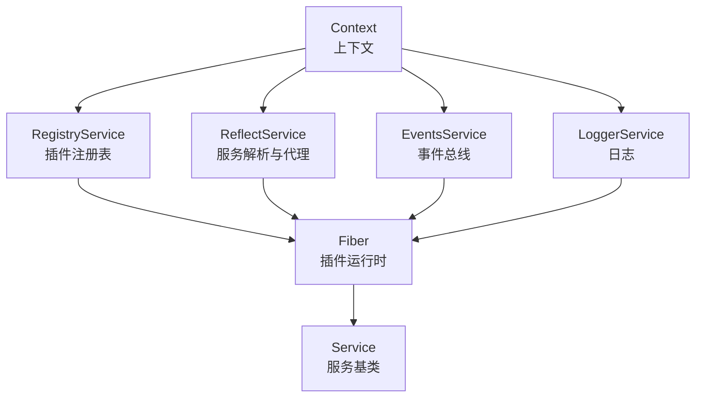
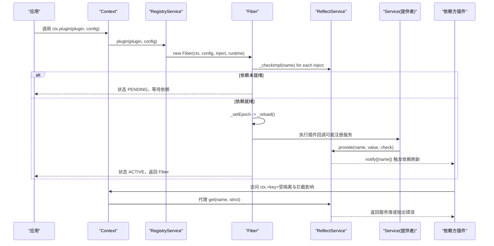
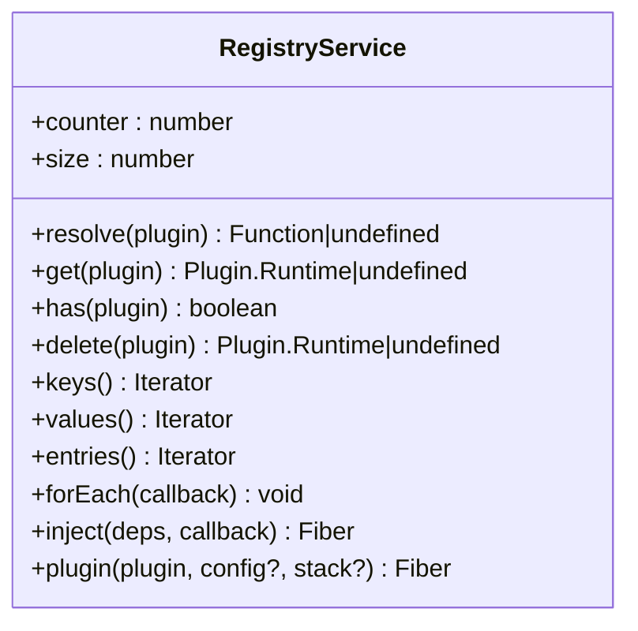
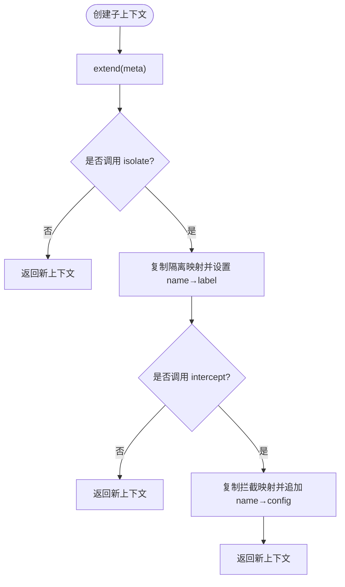
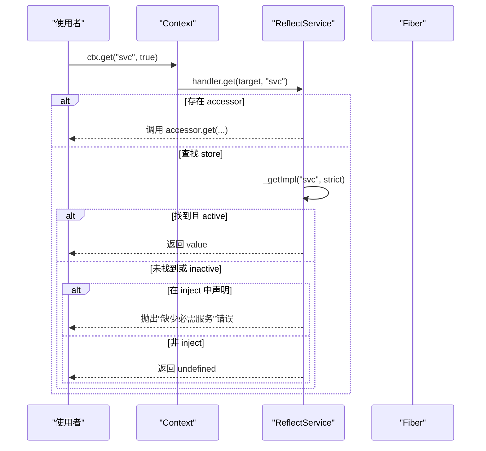
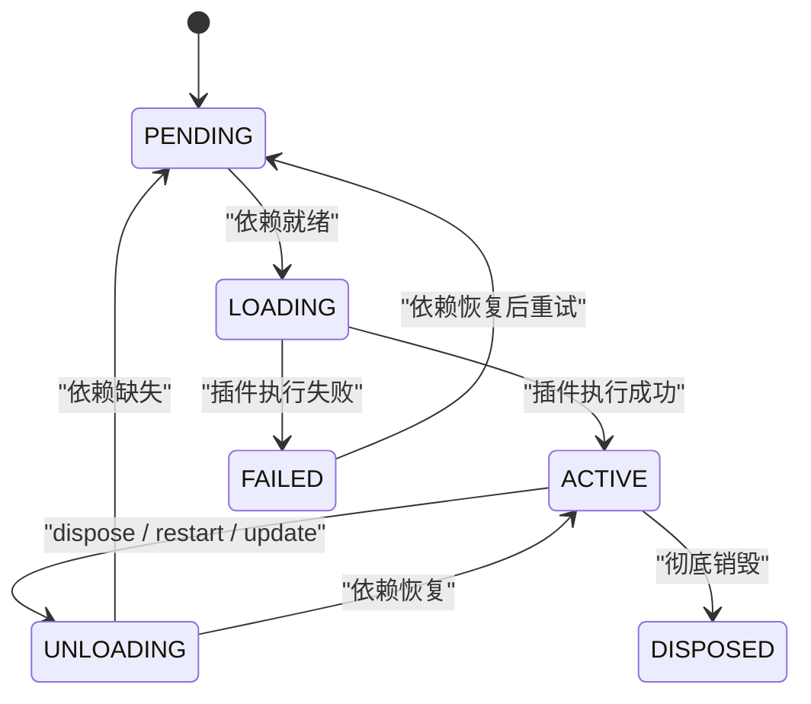
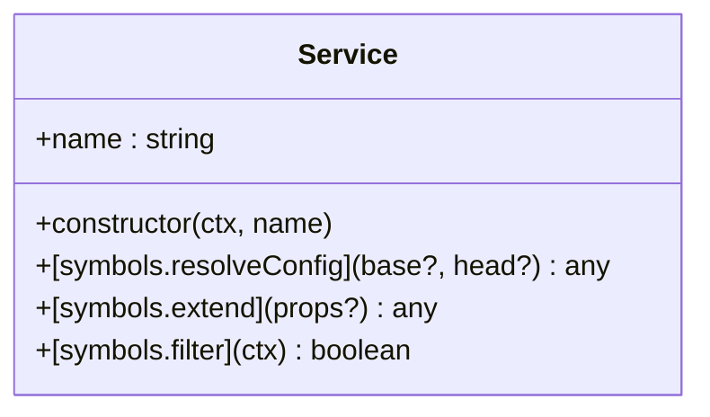
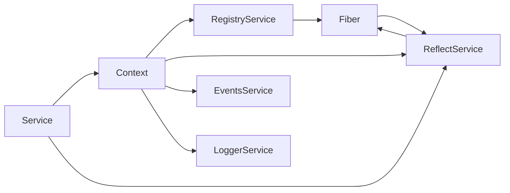

# 服务注册表

<cite>
**本文引用的文件**
- [vendor/cordis/src/registry.ts](file://vendor/cordis/src/registry.ts)
- [vendor/cordis/src/context.ts](file://vendor/cordis/src/context.ts)
- [vendor/cordis/src/reflect.ts](file://vendor/cordis/src/reflect.ts)
- [vendor/cordis/src/fiber.ts](file://vendor/cordis/src/fiber.ts)
- [vendor/cordis/src/service.ts](file://vendor/cordis/src/service.ts)
- [docs/cordis-api/registry.md](file://docs/cordis-api/registry.md)
- [docs/cordis-api/context.md](file://docs/cordis-api/context.md)
- [docs/cordis-api/service.md](file://docs/cordis-api/service.md)
</cite>

## 目录
1. [简介](#简介)
2. [项目结构](#项目结构)
3. [核心组件](#核心组件)
4. [架构总览](#架构总览)
5. [详细组件分析](#详细组件分析)
6. [依赖关系分析](#依赖关系分析)
7. [性能考量](#性能考量)
8. [故障排查指南](#故障排查指南)
9. [结论](#结论)
10. [附录：使用示例与最佳实践](#附录：使用示例与最佳实践)

## 简介
本文件系统化阐述 DeepSeek Harness 中基于 Cordis 的服务注册表设计与实现。其核心理念是通过统一的上下文键（ctx.*）管理服务发现与依赖注入，将“声明式依赖”和“作用域隔离”作为一等公民，使插件化服务在生命周期、配置拦截、可观测性与错误处理方面具备一致的行为模型。

关键要点：
- 统一访问入口：通过 ctx 代理进行服务读取与提供，所有服务以稳定键名暴露（如 ctx.tools、ctx.llm）。
- 声明式依赖：插件通过 inject 声明所需服务，框架保证依赖就绪后再执行，避免手动启动顺序编排。
- 作用域隔离：通过 isolate 为特定服务建立独立作用域，支持多实现共存与动态切换。
- 配置拦截：通过 intercept 为不同作用域下的服务提供差异化配置，并支持合并策略。
- 生命周期管理：Fiber 驱动插件加载、热重载与卸载，配合 effect 机制确保资源释放有序。
- 事件总线：内部事件用于状态变更通知、诊断与扩展点。

## 项目结构
围绕服务注册表的核心代码位于 vendor/cordis/src 下，包含以下关键模块：
- registry.ts：插件注册表与依赖注入入口（ctx.plugin、ctx.inject），以及插件元数据解析。
- context.ts：上下文对象 Context，维护隔离映射、拦截映射，并提供 extend/isolate/intercept 等能力。
- reflect.ts：反射与服务解析层，实现 ctx.get/set/provide/accessor/mixin 及属性代理。
- fiber.ts：插件运行时 Fiber，负责生命周期状态机、依赖检查、配置校验、效果收集与清理。
- service.ts：服务基类 Service，封装服务注册、可调用包装、配置合并等通用行为。

图表来源
- [vendor/cordis/src/context.ts:70-84](file://vendor/cordis/src/context.ts#L70-L84)
- [vendor/cordis/src/registry.ts:195-337](file://vendor/cordis/src/registry.ts#L195-L337)
- [vendor/cordis/src/reflect.ts:133-223](file://vendor/cordis/src/reflect.ts#L133-L223)
- [vendor/cordis/src/fiber.ts:184-333](file://vendor/cordis/src/fiber.ts#L184-L333)
- [vendor/cordis/src/service.ts:11-59](file://vendor/cordis/src/service.ts#L11-L59)

章节来源
- [vendor/cordis/src/context.ts:70-84](file://vendor/cordis/src/context.ts#L70-L84)
- [vendor/cordis/src/registry.ts:195-337](file://vendor/cordis/src/registry.ts#L195-L337)
- [vendor/cordis/src/reflect.ts:133-223](file://vendor/cordis/src/reflect.ts#L133-L223)
- [vendor/cordis/src/fiber.ts:184-333](file://vendor/cordis/src/fiber.ts#L184-L333)
- [vendor/cordis/src/service.ts:11-59](file://vendor/cordis/src/service.ts#L11-L59)

## 核心组件
- RegistryService（插件注册表）
  - 职责：规范化插件形状、跟踪运行期记录、创建 Fiber、暴露 inject/plugin API。
  - 关键点：resolve/get/has/delete/keys/values/entries/forEach；inject 是 plugin 的便捷封装。
- Context（上下文）
  - 职责：维护隔离映射 symbols.isolate 与拦截映射 symbols.intercept；提供 extend/isolate/intercept 构建子上下文。
  - 关键点：根上下文构造时内置 events/logger/reflect/registry，并通过 Proxy 暴露服务访问。
- ReflectService（反射与服务解析）
  - 职责：实现 ctx.get/set/provide/accessor/mixin；维护 store（按隔离标签索引 Impl）、props（服务/访问器声明）；通知依赖方刷新。
  - 关键点：Proxy handler 实现按需解析、严格模式、错误增强；notify 触发依赖 Fiber 刷新。
- Fiber（插件运行时）
  - 职责：管理插件生命周期状态（PENDING/LOADING/ACTIVE/FAILED/UNLOADING/DISPOSED）、依赖快照、配置校验、effect 收集与清理、重启与更新。
  - 关键点：_checkImpl/_refresh/_reload/_unload；await/restart/update；内部事件 internal/status 与 internal/plugin。
- Service（服务基类）
  - 职责：统一服务注册、可调用包装、配置合并 resolveConfig、过滤隔离范围。
  - 关键点：构造函数内调用 ctx.reflect.provide；[symbols.resolveConfig] 合并祖先拦截配置。

章节来源
- [vendor/cordis/src/registry.ts:195-337](file://vendor/cordis/src/registry.ts#L195-L337)
- [vendor/cordis/src/context.ts:70-146](file://vendor/cordis/src/context.ts#L70-L146)
- [vendor/cordis/src/reflect.ts:133-419](file://vendor/cordis/src/reflect.ts#L133-L419)
- [vendor/cordis/src/fiber.ts:184-755](file://vendor/cordis/src/fiber.ts#L184-L755)
- [vendor/cordis/src/service.ts:11-116](file://vendor/cordis/src/service.ts#L11-L116)

## 架构总览
下图展示从插件加载到服务可用再到依赖消费的关键流程，包括依赖声明、作用域隔离、配置拦截与生命周期管理。

图表来源
- [vendor/cordis/src/registry.ts:316-337](file://vendor/cordis/src/registry.ts#L316-L337)
- [vendor/cordis/src/fiber.ts:222-333](file://vendor/cordis/src/fiber.ts#L222-L333)
- [vendor/cordis/src/fiber.ts:597-696](file://vendor/cordis/src/fiber.ts#L597-L696)
- [vendor/cordis/src/reflect.ts:277-336](file://vendor/cordis/src/reflect.ts#L277-L336)
- [vendor/cordis/src/context.ts:70-84](file://vendor/cordis/src/context.ts#L70-L84)

## 详细组件分析

### 插件注册表（RegistryService）
- 设计要点
  - 统一插件形状：函数、类、对象 { apply }，均归一化为可执行回调。
  - 运行时记录：每个唯一回调对应一个 Runtime，持有 name、fibers、callback、Config。
  - 依赖注入：inject 支持数组或对象形式，对象形式可为每个依赖指定拦截配置。
  - 生命周期：plugin 创建 Fiber，Fiber 负责加载、卸载、重启与清理。
- 关键方法
  - resolve：识别插件回调，异常安全。
  - get/has/delete：查询与销毁插件运行态。
  - inject：快捷方式，等价于 ctx.plugin({ inject, apply })。
  - plugin：创建/复用 Runtime，构造 Fiber，返回可 await 的 Fiber。

图表来源
- [vendor/cordis/src/registry.ts:195-337](file://vendor/cordis/src/registry.ts#L195-L337)

章节来源
- [vendor/cordis/src/registry.ts:195-337](file://vendor/cordis/src/registry.ts#L195-L337)
- [docs/cordis-api/registry.md:8-56](file://docs/cordis-api/registry.md#L8-L56)

### 上下文与作用域（Context）
- 设计要点
  - 隔离映射 symbols.isolate：service name → label，决定服务解析的作用域。
  - 拦截映射 symbols.intercept：service name → config，供下游插件合并使用。
  - 子上下文：extend/isolate/intercept 不修改父上下文，仅叠加元信息。
- 关键能力
  - isolate(name, label?)：为某服务创建独立作用域，支持跨上下文共享 label。
  - intercept(name, config)：为后续插件提供该服务的额外配置。
  - 根上下文构造时注入 events/logger/reflect/registry。

图表来源
- [vendor/cordis/src/context.ts:99-145](file://vendor/cordis/src/context.ts#L99-L145)

章节来源
- [vendor/cordis/src/context.ts:70-146](file://vendor/cordis/src/context.ts#L70-L146)
- [docs/cordis-api/context.md:39-65](file://docs/cordis-api/context.md#L39-L65)

### 服务解析与存储（ReflectService）
- 设计要点
  - 代理拦截：ctx 的属性访问经 Proxy 路由至 ReflectService.handler，实现延迟解析与错误增强。
  - 存储结构：store 以隔离标签为键保存 Impl（name、fiber、value、check）。
  - 提供与覆盖：provide 注册服务，set 仅允许提供方 fiber 覆盖。
  - 通知机制：notify 遍历所有插件 Fiber，对声明了依赖且处于同一隔离范围的 Fiber 触发刷新。
- 关键路径
  - ctx.get：优先走 accessor，否则查找 store，若命中 required 但未就绪则抛错。
  - ctx.provide：注册 Impl，加入当前 fiber.store，必要时立即 notify。
  - ctx.accessor：定义计算属性，随 fiber 生命周期移除。
  - ctx.mixin：将服务方法混入 ctx，便于直接调用（如 ctx.on）。

图表来源
- [vendor/cordis/src/reflect.ts:135-171](file://vendor/cordis/src/reflect.ts#L135-L171)
- [vendor/cordis/src/reflect.ts:233-243](file://vendor/cordis/src/reflect.ts#L233-L243)

章节来源
- [vendor/cordis/src/reflect.ts:133-419](file://vendor/cordis/src/reflect.ts#L133-L419)
- [docs/cordis-api/context.md:235-333](file://docs/cordis-api/context.md#L235-L333)

### 插件生命周期（Fiber）
- 设计要点
  - 状态机：PENDING → LOADING → ACTIVE → UNLOADING → DISPOSED；失败进入 FAILED。
  - 依赖检查：_checkImpl 获取当前活跃实现，_refresh 汇总依赖 epoch，驱动 _reload/_unload。
  - 配置校验：resolveConfig 使用 StandardSchemaV1 校验，失败抛出 ValidationError。
  - 效果收集：effect 收集 disposer，卸载时逆序执行；支持同步/异步/迭代器。
  - 重启与更新：restart 立即失效并重新激活；update 先校验再 waterfall 后重启。
- 关键路径
  - constructor：创建子上下文、注入拦截配置、发布 internal/plugin、初始依赖检查与刷新。
  - _reload：拷贝 store、执行插件回调、清除错误、状态回退。
  - _unload：清理 effect 收集到的 disposer、清空 store、状态回退或再次加载。
  - await/restart/update：对外暴露的稳定接口。

图表来源
- [vendor/cordis/src/fiber.ts:147-154](file://vendor/cordis/src/fiber.ts#L147-L154)
- [vendor/cordis/src/fiber.ts:597-696](file://vendor/cordis/src/fiber.ts#L597-L696)
- [vendor/cordis/src/fiber.ts:704-753](file://vendor/cordis/src/fiber.ts#L704-L753)

章节来源
- [vendor/cordis/src/fiber.ts:184-755](file://vendor/cordis/src/fiber.ts#L184-L755)

### 服务基类（Service）
- 设计要点
  - 自动注册：构造函数调用 ctx.reflect.provide，名称来自参数或静态 provide。
  - 可调用包装：若实现 [symbols.invoke]，实例将被包装为可调用对象。
  - 配置合并：[symbols.resolveConfig] 自底向上合并祖先拦截配置，支持自定义 merge。
  - 作用域过滤：[symbols.filter] 确保仅在相同隔离作用域内可见。
- 关键能力
  - name：服务注册名。
  - resolveConfig(base?, head?)：合并配置。
  - extend(props?)：派生实例。

图表来源
- [vendor/cordis/src/service.ts:11-116](file://vendor/cordis/src/service.ts#L11-L116)

章节来源
- [vendor/cordis/src/service.ts:11-116](file://vendor/cordis/src/service.ts#L11-L116)
- [docs/cordis-api/service.md:1-103](file://docs/cordis-api/service.md#L1-L103)

## 依赖关系分析
- 组件耦合
  - Context 组合 RegistryService、ReflectService、EventsService、LoggerService。
  - RegistryService 依赖 Context 与 Fiber，管理插件运行态。
  - ReflectService 依赖 Context、Fiber，实现服务存取与通知。
  - Fiber 依赖 Context、RegistryService、ReflectService，协调生命周期。
  - Service 依赖 Context 与 ReflectService，完成注册与配置合并。
- 外部依赖
  - @deepseek-ai/cosmokit：defineProperty、工具函数。
  - @standard-schema/spec：配置校验。
- 循环依赖检测
  - 框架未显式实现循环依赖检测；但通过“依赖就绪才加载”的策略，结合严格模式与错误增强，可在开发阶段暴露缺失依赖问题。
  - 建议：合理拆分服务边界，避免强耦合；使用可选依赖（ctx.get）降低环风险。

图表来源
- [vendor/cordis/src/context.ts:70-84](file://vendor/cordis/src/context.ts#L70-L84)
- [vendor/cordis/src/registry.ts:195-337](file://vendor/cordis/src/registry.ts#L195-L337)
- [vendor/cordis/src/reflect.ts:133-223](file://vendor/cordis/src/reflect.ts#L133-L223)
- [vendor/cordis/src/fiber.ts:184-333](file://vendor/cordis/src/fiber.ts#L184-L333)
- [vendor/cordis/src/service.ts:11-59](file://vendor/cordis/src/service.ts#L11-L59)

章节来源
- [vendor/cordis/src/context.ts:70-84](file://vendor/cordis/src/context.ts#L70-L84)
- [vendor/cordis/src/registry.ts:195-337](file://vendor/cordis/src/registry.ts#L195-L337)
- [vendor/cordis/src/reflect.ts:133-223](file://vendor/cordis/src/reflect.ts#L133-L223)
- [vendor/cordis/src/fiber.ts:184-333](file://vendor/cordis/src/fiber.ts#L184-L333)
- [vendor/cordis/src/service.ts:11-59](file://vendor/cordis/src/service.ts#L11-L59)

## 性能考量
- 懒加载与按需解析
  - 服务通过 ctx 代理延迟解析，减少不必要的初始化开销。
  - 严格模式下仅返回当前活跃的提供方实现，避免无效引用。
- 作用域与隔离
  - 通过隔离标签索引 store，缩小查找范围，提升解析效率。
  - isolate 支持多实现共存，避免全局替换带来的缓存失效。
- 通知与刷新
  - 服务变更后仅通知声明了依赖的 Fiber，并按隔离范围过滤，减少不必要重算。
  - 依赖 epoch 机制聚合多个依赖变化，批量触发刷新。
- 配置校验
  - 使用 StandardSchemaV1 在加载前校验配置，尽早失败，避免运行时错误扩散。
- 内存与清理
  - effect 收集的 disposer 在卸载时逆序清理，避免悬挂引用。
  - Fiber 在 UNLOADING/DISPOSED 状态下阻止新增 effect，防止泄漏。

[本节为一般性指导，无需具体文件引用]

## 故障排查指南
- 常见错误与定位
  - “无法获取必需服务”：当在 inject 中声明的服务尚未提供或提供方 fiber 不活跃时抛出。可通过检查依赖提供方的 provide 时机与作用域。
  - “无法设置未提供的属性”：尝试 set 未提供或不属于当前 fiber 的服务会抛错。确认提供方 fiber 与隔离作用域。
  - “服务已在其他 fiber 注册”：重复 provide 同名服务在同一隔离作用域会抛错。检查是否存在多实现冲突或作用域误用。
  - “无效插件形状”：传入非函数或非 { apply } 的对象会被拒绝。确保插件符合规范。
- 诊断与可观测性
  - 内部事件：internal/plugin、internal/status、internal/service 可用于监控插件状态与服务变更。
  - 错误堆栈增强：ReflectService 在代理捕获的错误上附加调用栈，便于定位。
  - 效果树：Fiber.getEffects 可输出当前注册的 effect 树，辅助调试复杂生命周期。
- 处理策略
  - 使用 ctx.get 做可选依赖，避免强依赖导致的启动阻塞。
  - 使用 isolate 隔离易冲突服务，避免全局覆盖。
  - 使用 intercept 精细化配置，避免硬编码分支。

章节来源
- [vendor/cordis/src/reflect.ts:135-171](file://vendor/cordis/src/reflect.ts#L135-L171)
- [vendor/cordis/src/reflect.ts:254-265](file://vendor/cordis/src/reflect.ts#L254-L265)
- [vendor/cordis/src/reflect.ts:277-305](file://vendor/cordis/src/reflect.ts#L277-L305)
- [vendor/cordis/src/fiber.ts:597-696](file://vendor/cordis/src/fiber.ts#L597-L696)
- [vendor/cordis/src/fiber.ts:704-753](file://vendor/cordis/src/fiber.ts#L704-L753)

## 结论
DeepSeek Harness 的服务注册表以 Cordis 为核心，通过统一的 ctx 访问面、声明式依赖与作用域隔离，实现了高内聚、低耦合的插件化服务管理。Fiber 驱动的生命周期与 effect 机制确保了资源的可靠管理与热重载能力；ReflectService 的代理与通知机制提供了高效的依赖解析与变更传播。整体设计兼顾了易用性、可扩展性与可观测性，适合大规模插件生态。

[本节为总结性内容，无需具体文件引用]

## 附录：使用示例与最佳实践

- 注册服务（提供者）
  - 通过 Service 子类或 ctx.reflect.provide 在服务提供方 fiber 中注册服务。
  - 建议使用 Service 基类以获得可调用包装与配置合并能力。
  - 参考路径：[service.ts:11-59](file://vendor/cordis/src/service.ts#L11-L59)、[reflect.ts:277-305](file://vendor/cordis/src/reflect.ts#L277-L305)

- 声明依赖（消费者）
  - 使用 ctx.inject 或插件的 inject 字段声明所需服务，框架会在依赖就绪后执行。
  - 对于可选依赖，使用 ctx.get 并在调用前判空。
  - 参考路径：[registry.ts:300-302](file://vendor/cordis/src/registry.ts#L300-L302)、[context.md:235-259](file://docs/cordis-api/context.md#L235-L259)

- 作用域隔离
  - 使用 ctx.isolate 为特定服务创建独立作用域，避免全局覆盖。
  - 通过共享 label 将多个上下文加入同一作用域。
  - 参考路径：[context.ts:121-125](file://vendor/cordis/src/context.ts#L121-L125)

- 配置拦截
  - 使用 ctx.intercept 为下游插件提供差异化配置，支持多层合并。
  - 在服务中使用 resolveConfig 获取最终配置。
  - 参考路径：[context.ts:139-145](file://vendor/cordis/src/context.ts#L139-L145)、[service.ts:86-102](file://vendor/cordis/src/service.ts#L86-L102)

- 生命周期与清理
  - 使用 ctx.effect 注册清理逻辑，确保资源释放有序。
  - 通过 Fiber.await 等待插件加载完成，或在测试中捕获错误。
  - 参考路径：[fiber.ts:415-561](file://vendor/cordis/src/fiber.ts#L415-L561)、[fiber.ts:704-753](file://vendor/cordis/src/fiber.ts#L704-L753)

- 最佳实践
  - 明确服务边界，避免强耦合；优先使用可选依赖降低启动风险。
  - 合理使用 isolate 与 intercept，避免隐式全局状态。
  - 利用内部事件与 effect 树进行诊断与监控。
  - 在 HMR/热重载场景下，确保 effect 能正确清理并重载。

[本节为实践指导，无需具体文件引用]