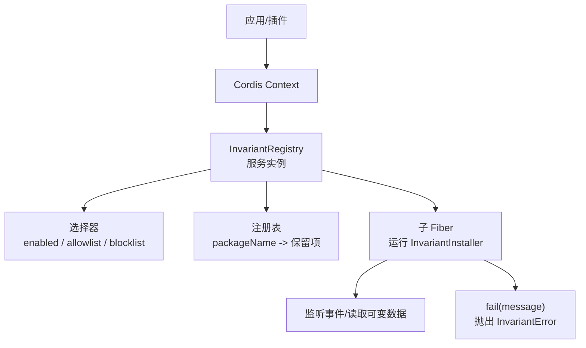
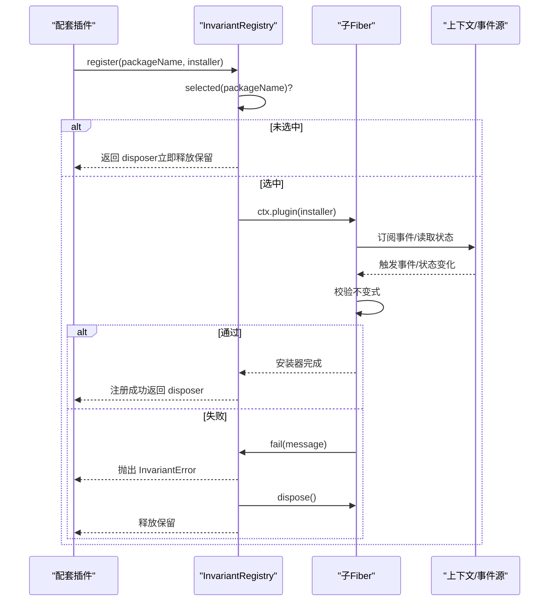
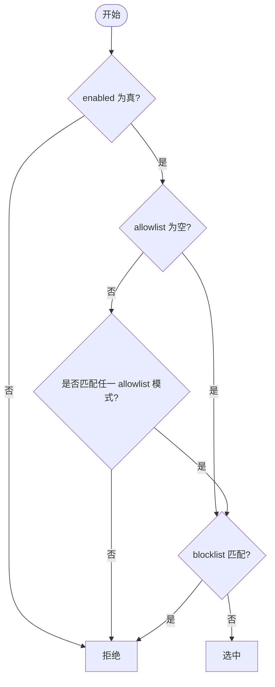
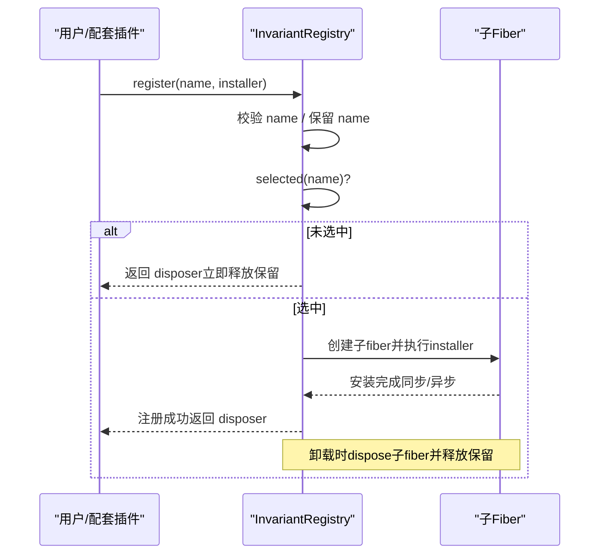
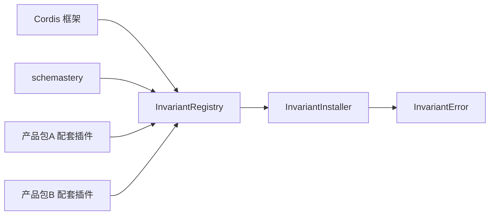

# 不变量服务

<cite>
**本文引用的文件**
- [packages/runtime-diagnostics/invariants/src/index.ts](file://packages/runtime-diagnostics/invariants/src/index.ts)
- [packages/runtime-diagnostics/invariants/src/invariant.ts](file://packages/runtime-diagnostics/invariants/src/invariant.ts)
- [packages/runtime-diagnostics/invariants/README.md](file://packages/runtime-diagnostics/invariants/README.md)
- [docs/subsystems/invariants.zh.md](file://docs/subsystems/invariants.zh.md)
- [packages/runtime-diagnostics/invariants/tests/service.spec.ts](file://packages/runtime-diagnostics/invariants/tests/service.spec.ts)
- [scripts/verify-package-invariants.ts](file://scripts/verify-package-invariants.ts)
- [.agents/notes/implemented/architecture/2026-07-19-package-owned-invariant-service.md](file://.agents/notes/implemented/architecture/2026-07-19-package-owned-invariant-service.md)
- [.agents/notes/implemented/architecture/2026-07-19-package-invariant-runtime-contracts.zh.md](file://.agents/notes/implemented/architecture/2026-07-19-package-invariant-runtime-contracts.zh.md)
</cite>

## 目录
1. [简介](#简介)
2. [项目结构](#项目结构)
3. [核心组件](#核心组件)
4. [架构总览](#架构总览)
5. [详细组件分析](#详细组件分析)
6. [依赖关系分析](#依赖关系分析)
7. [性能考量](#性能考量)
8. [故障排查指南](#故障排查指南)
9. [结论](#结论)
10. [附录](#附录)

## 简介
本文件系统化说明 DeepSeek Harness 的“不变量服务”（`ctx.invariants`）的设计与实现。不变量检查的核心目标是：在运行时持续验证系统状态的一致性、正确性与契约遵守情况，确保关键业务域（会话、Agent、作用域、工具链等）的状态转换和事件流满足预期约束。该服务采用“包级注册 + 子 fiber 执行 + 失败归因到包”的模式，将诊断能力与产品代码解耦，同时通过配套插件约定让每个包自主声明并维护其运行时不变式。

## 项目结构
不变量服务位于 `packages/runtime-diagnostics/invariants`，由以下关键部分组成：
- 服务实现：`src/index.ts`，提供 `InvariantRegistry`、配置校验、选择器、注册表、错误类型等。
- 配套插件入口：`src/invariant.ts`，为自身包注册一个空安装器，体现“配套插件”模式。
- 文档与 README：`README.md` 与 `docs/subsystems/invariants.zh.md`，描述 API、选择策略、生命周期、组合方式与已知限制。
- 测试：`tests/service.spec.ts`，覆盖选择、验证、生命周期、失败回滚、HMR 重注册等场景。
- 仓库门禁：`scripts/verify-package-invariants.ts`，用于静态校验各包的配套插件是否符合规范。

图表来源
- [packages/runtime-diagnostics/invariants/src/index.ts:94-197](file://packages/runtime-diagnostics/invariants/src/index.ts#L94-L197)
- [packages/runtime-diagnostics/invariants/src/invariant.ts:10-30](file://packages/runtime-diagnostics/invariants/src/invariant.ts#L10-L30)

章节来源
- [packages/runtime-diagnostics/invariants/src/index.ts:1-201](file://packages/runtime-diagnostics/invariants/src/index.ts#L1-L201)
- [packages/runtime-diagnostics/invariants/src/invariant.ts:1-31](file://packages/runtime-diagnostics/invariants/src/invariant.ts#L1-L31)
- [packages/runtime-diagnostics/invariants/README.md:1-86](file://packages/runtime-diagnostics/invariants/README.md#L1-L86)
- [docs/subsystems/invariants.zh.md:1-89](file://docs/subsystems/invariants.zh.md#L1-L89)

## 核心组件
- InvariantRegistry（服务）
  - 职责：提供全局开关与基于正则的选择策略；为每个包名保留唯一注册；在子 fiber 中运行安装器；管理注册生命周期与资源释放；统一抛出带包名的不变量错误。
  - 关键方法：`register(packageName, installer)`。
- InvariantInstaller（安装器）
  - 职责：在子上下文中订阅权威事件或观测可变数据；使用 `fail(message)` 报告违规；可声明依赖服务 `inject`。
- InvariantFailure（失败报告器）
  - 行为：调用即抛出 `InvariantError`，包含稳定 `code: 'INVARIANT'` 与 `packageName`。
- InvariantError（异常类型）
  - 字段：`code`、`packageName`、`message`（前缀已标准化）。
- 配套插件约定
  - 每个包导出 `./invariant` 配套插件，以精确 npm 包名注册；若无可检查项，则导出空安装器并附解释注释。

章节来源
- [packages/runtime-diagnostics/invariants/src/index.ts:14-66](file://packages/runtime-diagnostics/invariants/src/index.ts#L14-L66)
- [packages/runtime-diagnostics/invariants/src/index.ts:94-197](file://packages/runtime-diagnostics/invariants/src/index.ts#L94-L197)
- [packages/runtime-diagnostics/invariants/src/invariant.ts:10-30](file://packages/runtime-diagnostics/invariants/src/invariant.ts#L10-L30)
- [packages/runtime-diagnostics/invariants/README.md:21-33](file://packages/runtime-diagnostics/invariants/README.md#L21-L33)

## 架构总览
不变量服务不直接导入产品包，避免耦合；所有断言由各自包的配套插件完成。服务负责：
- 选择：根据 `enabled`、`package_allowlist`、`package_blocklist` 决定是否启用某包的安装器。
- 注册：为包名保留唯一注册，即使被过滤禁用也保留所有权，防止重复认领。
- 执行：在独立子 fiber 中运行安装器，等待同步/异步初始化完成后再认为注册成功。
- 生命周期：服务拥有注册 fiber；返回的 disposer 绑定到配套插件 fiber；卸载任一侧都会清理监听、trace 与保留项。
- 失败处理：安装器失败会原子地 dispose 子 fiber 并释放保留；`fail()` 抛出的错误携带包名以便定位。

图表来源
- [packages/runtime-diagnostics/invariants/src/index.ts:120-197](file://packages/runtime-diagnostics/invariants/src/index.ts#L120-L197)
- [packages/runtime-diagnostics/invariants/tests/service.spec.ts:168-187](file://packages/runtime-diagnostics/invariants/tests/service.spec.ts#L168-L187)

## 详细组件分析

### 选择机制与配置
- 全局开关：`enabled` 默认开启。
- 允许列表：空表示全部允许；非空时至少一个正则匹配完整 npm 包名才允许。
- 阻止列表：匹配后优先于允许列表，直接拒绝。
- 正则规则：按 JavaScript 源码编译，大小写敏感；除非显式锚定，否则匹配不锚定；不支持 `/pattern/flags` 语法。
- 启动期校验：空白、首尾空白、重复、无效的正则会直接报错，不会静默跳过。
- 确定性：允许零匹配模式，后续加载与 HMR 仍保持确定性。

章节来源
- [packages/runtime-diagnostics/invariants/src/index.ts:74-126](file://packages/runtime-diagnostics/invariants/src/index.ts#L74-L126)
- [packages/runtime-diagnostics/invariants/README.md:17-23](file://packages/runtime-diagnostics/invariants/README.md#L17-L23)
- [docs/subsystems/invariants.zh.md:9-23](file://docs/subsystems/invariants.zh.md#L9-L23)

### 注册与唯一性保证
- 包名校验：禁止空串、空白字符、含空格名称。
- 唯一保留：同一包名仅能注册一次；即使过滤器禁用也会保留所有权，避免并发/重载冲突。
- 原子回滚：注册过程中任何失败（包括子 fiber 发布失败）都会移除监听、trace 与保留项。

章节来源
- [packages/runtime-diagnostics/invariants/src/index.ts:136-197](file://packages/runtime-diagnostics/invariants/src/index.ts#L136-L197)
- [packages/runtime-diagnostics/invariants/tests/service.spec.ts:226-283](file://packages/runtime-diagnostics/invariants/tests/service.spec.ts#L226-L283)

### 子纤维管理与生命周期
- 子 fiber：每个启用的安装器在专属 Cordis 子 fiber 中运行，可声明所需服务 `inject`。
- 装配等待：同步或异步安装完成后才认为注册成功。
- 资源释放：服务拥有注册 fiber；disposer 属于配套插件 fiber；卸载任一侧均会清理。
- HMR 友好：支持重载后重新注册同一包名，无残留状态。

章节来源
- [packages/runtime-diagnostics/invariants/src/index.ts:144-197](file://packages/runtime-diagnostics/invariants/src/index.ts#L144-L197)
- [packages/runtime-diagnostics/invariants/tests/service.spec.ts:168-187](file://packages/runtime-diagnostics/invariants/tests/service.spec.ts#L168-L187)
- [packages/runtime-diagnostics/invariants/tests/service.spec.ts:210-224](file://packages/runtime-diagnostics/invariants/tests/service.spec.ts#L210-L224)

### 失败报告与诊断信息
- 失败报告器：`fail(message)` 抛出 `InvariantError`，包含稳定 `code: 'INVARIANT'` 与 `packageName`。
- 消息格式：自动添加标准前缀，便于日志聚合与告警。
- 诊断建议：在配套插件中记录上下文快照、事件序列片段、时间戳等，配合错误消息快速定位。

章节来源
- [packages/runtime-diagnostics/invariants/src/index.ts:49-66](file://packages/runtime-diagnostics/invariants/src/index.ts#L49-L66)
- [packages/runtime-diagnostics/invariants/tests/service.spec.ts:189-208](file://packages/runtime-diagnostics/invariants/tests/service.spec.ts#L189-L208)

### 与其他核心服务的集成
- 会话（Session）：不变量检查关注会话封装、调用/结果追踪、持久化事件一致性等；服务本身不持有会话状态，而是通过事件与只读快照进行验证。
- Agent：检查 Agent 状态迁移、收件箱 FIFO 守恒、模型请求重建等契约。
- 作用域（Scope）：验证作用域主题与边界一致性。
- 工具链与 LLM：检查流语法、重试位置与边界、工具管道阶段与冻结结果、权威提示组装数据等。
- 文件系统、子代理与工作流：检查事件标识、提供者/子代理配对、工作流/代理生命周期身份等。

章节来源
- [packages/runtime-diagnostics/invariants/README.md:35-48](file://packages/runtime-diagnostics/invariants/README.md#L35-L48)
- [docs/subsystems/invariants.zh.md:5-6](file://docs/subsystems/invariants.zh.md#L5-L6)

### 自定义不变量的定义与注册示例
- 步骤概览：
  1) 在工作区包内创建 `./invariant` 配套插件。
  2) 在配套插件中导出 `name`、`inject`（可选）、`apply(ctx)`。
  3) 在 `apply` 中调用 `ctx.invariants.register(包名, installer)`。
  4) 在 `installer` 中订阅权威事件或读取可变数据，必要时使用 `fail(message)` 报告违规。
  5) 若无可检查项，导出空安装器并在开头注释说明原因。
- 参考路径：
  - 配套插件模板与自注册：[packages/runtime-diagnostics/invariants/src/invariant.ts:10-30](file://packages/runtime-diagnostics/invariants/src/invariant.ts#L10-L30)
  - 选择与注册流程：[packages/runtime-diagnostics/invariants/src/index.ts:120-197](file://packages/runtime-diagnostics/invariants/src/index.ts#L120-L197)
  - 测试中的注册与依赖注入示例：[packages/runtime-diagnostics/invariants/tests/service.spec.ts:168-187](file://packages/runtime-diagnostics/invariants/tests/service.spec.ts#L168-L187)

章节来源
- [packages/runtime-diagnostics/invariants/src/invariant.ts:10-30](file://packages/runtime-diagnostics/invariants/src/invariant.ts#L10-L30)
- [packages/runtime-diagnostics/invariants/src/index.ts:120-197](file://packages/runtime-diagnostics/invariants/src/index.ts#L120-L197)
- [packages/runtime-diagnostics/invariants/tests/service.spec.ts:168-187](file://packages/runtime-diagnostics/invariants/tests/service.spec.ts#L168-L187)

### 算法与流程可视化

#### 选择流程图

图表来源
- [packages/runtime-diagnostics/invariants/src/index.ts:120-126](file://packages/runtime-diagnostics/invariants/src/index.ts#L120-L126)

#### 注册与生命周期时序图

图表来源
- [packages/runtime-diagnostics/invariants/src/index.ts:136-197](file://packages/runtime-diagnostics/invariants/src/index.ts#L136-L197)

## 依赖关系分析
- 内部依赖
  - Cordis 框架：Context、Service、Effect、Plugin 等基础能力。
  - Schema 校验：使用 schemastery 对 Config 进行默认值与类型校验。
- 外部依赖
  - 各产品包通过配套插件反向注册不变式，服务不反向依赖产品包，保持低耦合。
- 耦合与内聚
  - 高内聚：选择、注册、生命周期、错误类型集中在服务内。
  - 低耦合：产品逻辑仅在配套插件中实现，服务不感知具体业务。

图表来源
- [packages/runtime-diagnostics/invariants/src/index.ts:9-13](file://packages/runtime-diagnostics/invariants/src/index.ts#L9-L13)
- [packages/runtime-diagnostics/invariants/src/index.ts:94-197](file://packages/runtime-diagnostics/invariants/src/index.ts#L94-L197)

章节来源
- [packages/runtime-diagnostics/invariants/src/index.ts:9-13](file://packages/runtime-diagnostics/invariants/src/index.ts#L9-L13)
- [packages/runtime-diagnostics/invariants/src/index.ts:94-197](file://packages/runtime-diagnostics/invariants/src/index.ts#L94-L197)

## 性能考量
- 选择器固定：正则列表在服务生命周期内固定，避免重复编译与动态分支开销。
- 子 fiber 隔离：每个安装器在独立 fiber 中运行，避免相互阻塞；异步安装完成后才认为注册成功。
- 最小侵入：服务不修改产品行为，仅观察事件与只读快照，降低对主路径的影响。
- 按需启用：可通过 allowlist/blocklist 精准控制哪些包参与检查，减少无关开销。
- HMR 友好：支持重载与热更新，不会累积残留监听或保留项。

章节来源
- [packages/runtime-diagnostics/invariants/README.md:17-23](file://packages/runtime-diagnostics/invariants/README.md#L17-L23)
- [packages/runtime-diagnostics/invariants/README.md:21-25](file://packages/runtime-diagnostics/invariants/README.md#L21-L25)
- [docs/subsystems/invariants.zh.md:23-24](file://docs/subsystems/invariants.zh.md#L23-L24)

## 故障排查指南
- 常见错误
  - 配置非法：空白、首尾空白、重复、无效的正则会在服务启动时报错。
  - 包名非法：空串、含空格、首尾空白会被拒绝。
  - 重复注册：同一包名二次注册会抛出“已注册”错误。
  - 安装器失败：子 fiber 安装失败会原子回滚，释放保留并移除监听。
- 定位技巧
  - 查看 `InvariantError.packageName` 与消息前缀，快速定位到具体包。
  - 在配套插件中记录上下文快照、事件序列片段、时间戳等辅助信息。
  - 使用测试拓扑挂载 `{ enabled: true }` 并聚焦相关包，复现问题。
- 参考用例
  - 选择与过滤：[packages/runtime-diagnostics/invariants/tests/service.spec.ts:56-143](file://packages/runtime-diagnostics/invariants/tests/service.spec.ts#L56-L143)
  - 配置校验：[packages/runtime-diagnostics/invariants/tests/service.spec.ts:145-166](file://packages/runtime-diagnostics/invariants/tests/service.spec.ts#L145-L166)
  - 生命周期与回滚：[packages/runtime-diagnostics/invariants/tests/service.spec.ts:210-302](file://packages/runtime-diagnostics/invariants/tests/service.spec.ts#L210-L302)

章节来源
- [packages/runtime-diagnostics/invariants/tests/service.spec.ts:56-166](file://packages/runtime-diagnostics/invariants/tests/service.spec.ts#L56-L166)
- [packages/runtime-diagnostics/invariants/tests/service.spec.ts:210-302](file://packages/runtime-diagnostics/invariants/tests/service.spec.ts#L210-L302)

## 结论
不变量服务以“包级注册 + 子 fiber 执行 + 失败归因”为核心设计，既保证了运行时状态的一致性与契约遵守，又保持了与服务与产品代码的低耦合。通过选择器、唯一性保留、严格的生命周期管理与标准化的错误类型，开发者可以安全地为任意包添加运行时不变式检查，并在出现违规时快速定位到责任方。结合仓库门禁与测试拓扑，可在开发与发布阶段提前发现不一致问题，提升整体系统的健壮性。

## 附录

### 最佳实践
- 明确“可检查项”：只断言权威事件流或可变数据关系；方法存在性、纯函数结果等应由类型、加载或单元测试覆盖。
- 使用选择器：通过 allowlist/blocklist 控制范围，避免不必要的检查开销。
- 提供丰富诊断：在 `fail` 消息中包含上下文快照、事件片段、时间戳等，便于定位。
- 遵循配套约定：每个包导出 `./invariant`；若无可检查项，导出空安装器并附解释注释。
- 利用测试：为每个可执行 companion 编写有效与无效观测的测试；使用穷举拓扑验证注册与释放。

章节来源
- [packages/runtime-diagnostics/invariants/README.md:29-50](file://packages/runtime-diagnostics/invariants/README.md#L29-L50)
- [.agents/notes/implemented/architecture/2026-07-19-package-invariant-runtime-contracts.zh.md:56-62](file://.agents/notes/implemented/architecture/2026-07-19-package-invariant-runtime-contracts.zh.md#L56-L62)

### 常见陷阱
- 误用选择器：正则未锚定导致意外匹配；大小写敏感导致漏匹配。
- 忽略阻止列表优先级：阻止列表会覆盖允许列表匹配。
- 忘记声明依赖：子 fiber 访问的服务需在 `inject` 中声明。
- 未处理异步安装：需等待安装器完成再认为注册成功。
- 未释放资源：确保 disposer 被调用，避免监听泄漏。

章节来源
- [packages/runtime-diagnostics/invariants/src/index.ts:74-126](file://packages/runtime-diagnostics/invariants/src/index.ts#L74-L126)
- [packages/runtime-diagnostics/invariants/tests/service.spec.ts:168-187](file://packages/runtime-diagnostics/invariants/tests/service.spec.ts#L168-L187)

### 与仓库门禁的关系
- 门禁脚本会扫描工作区包，强制配套插件源文件、名称注册、Loader 形状、导出、发布、依赖、TypeScript 引用与 bundle entry 完整。
- 拒绝生成标记、默认导出、无解释的空安装器；非空安装器必须接收并使用失败报告器。
- 通过构建产物自引用与 plain Node 导入，再次验证 companion 的可执行性与依赖完整性。

章节来源
- [scripts/verify-package-invariants.ts:1-21](file://scripts/verify-package-invariants.ts#L1-L21)
- [.agents/notes/implemented/architecture/2026-07-19-package-invariant-runtime-contracts.zh.md:56-62](file://.agents/notes/implemented/architecture/2026-07-19-package-invariant-runtime-contracts.zh.md#L56-L62)

### 设计取舍与替代方案
- 不在服务内集中所有检查：避免服务引入产品包、变更成本高、测试与契约脱节。
- 不隐式注册：避免依赖组合顺序与可选服务存在性，使诊断可独立选择。
- 不运行时发现文件：文件系统/包发现不是运行时所有权契约，无法表达显式加载顺序。
- 不以当前加载包集校验正则：允许零匹配模式，保证后续加载与 HMR 的确定性。

章节来源
- [.agents/notes/implemented/architecture/2026-07-19-package-owned-invariant-service.md:89-94](file://.agents/notes/implemented/architecture/2026-07-19-package-owned-invariant-service.md#L89-L94)