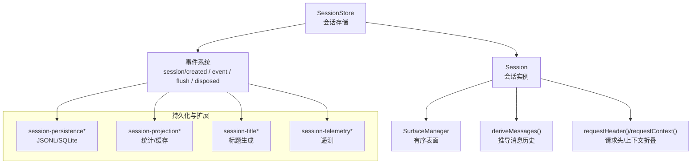
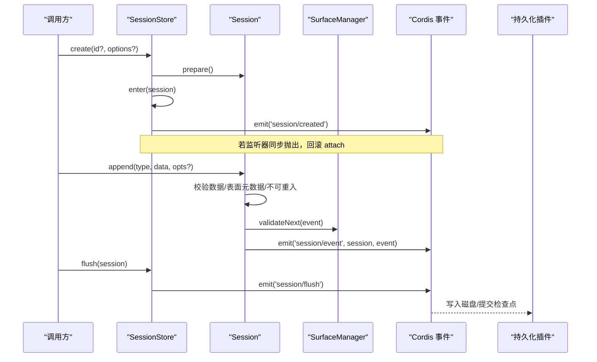
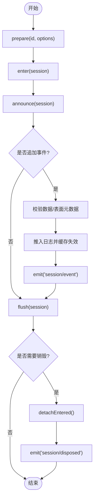
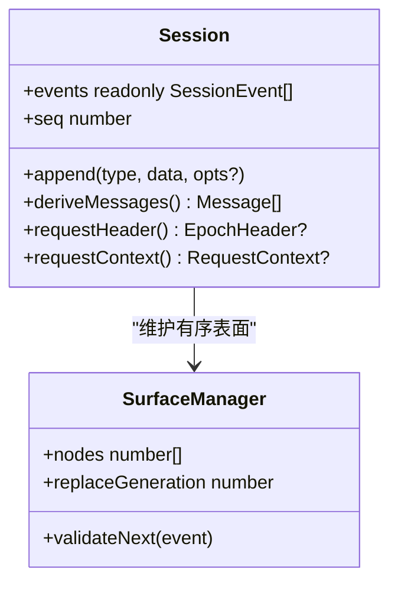
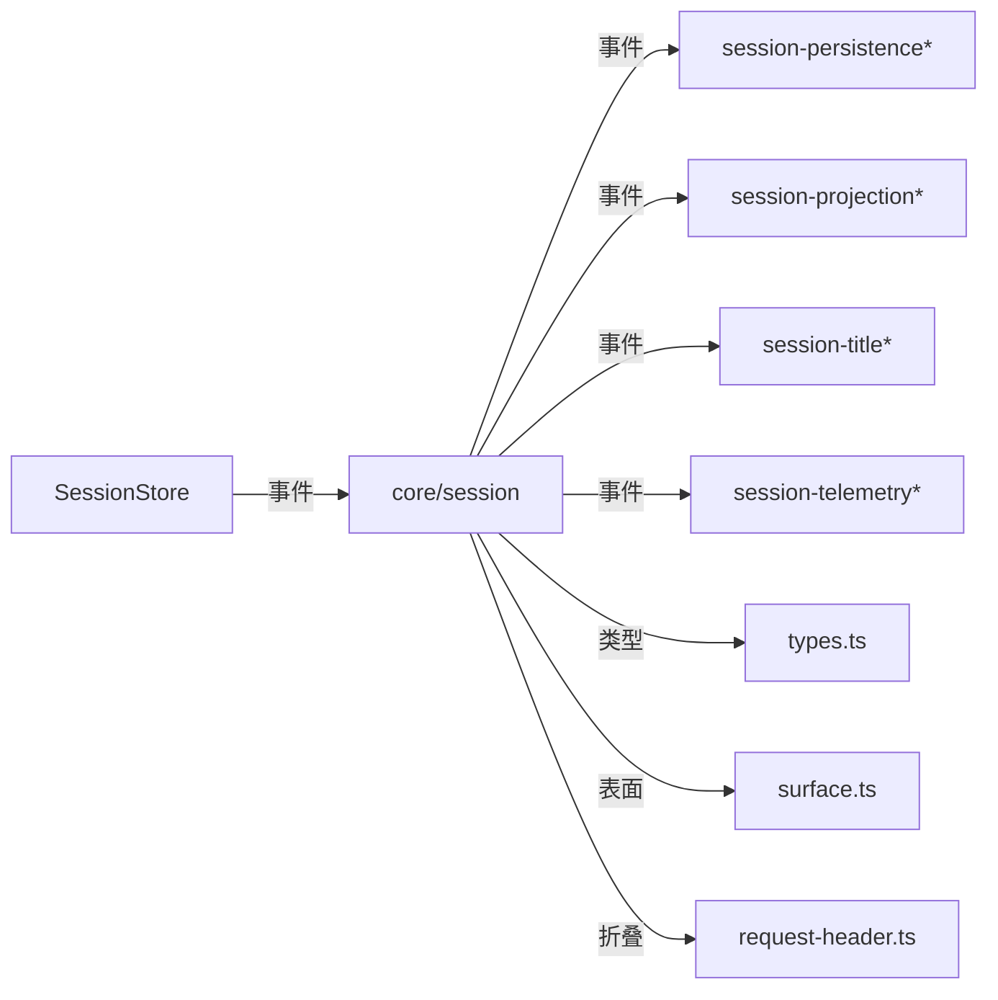

# 会话管理服务

<cite>
**本文引用的文件**
- [packages/core/session/src/index.ts](file://packages/core/session/src/index.ts)
- [packages/core/session/src/types.ts](file://packages/core/session/src/types.ts)
- [packages/core/session/src/surface.ts](file://packages/core/session/src/surface.ts)
- [packages/core/session/src/request-header.ts](file://packages/core/session/src/request-header.ts)
- [packages/session/README.md](file://packages/session/README.md)
- [docs/subsystems/session.zh.md](file://docs/subsystems/session.zh.md)
</cite>

## 目录
1. [简介](#简介)
2. [项目结构](#项目结构)
3. [核心组件](#核心组件)
4. [架构总览](#架构总览)
5. [详细组件分析](#详细组件分析)
6. [依赖关系分析](#依赖关系分析)
7. [性能考量](#性能考量)
8. [故障排查指南](#故障排查指南)
9. [结论](#结论)
10. [附录：使用示例与最佳实践](#附录使用示例与最佳实践)

## 简介
本文件系统性说明 DeepSeek Harness 的“会话管理服务”，聚焦于 ctx.sessions 的设计与实现。其核心职责包括：
- 维护会话生命周期：创建、进入、公告、销毁，以及子会话派生（fork）。
- 事件溯源与状态持久化：以追加式事件日志为唯一事实来源，通过插件订阅 session/event 并在 session/flush 时落盘。
- 事件日志与派生视图：维护有序表面（surface）并推导 LLM 消息历史；提供请求头折叠、上下文查询等能力。
- 并发安全与错误隔离：append 路径不可重入，监听器失败被隔离记录，不污染主流程。
- 与 Agent、工具执行、LLM 调用的协作：通过 turn/step 边界、tool/call 与 tool/result、assistant/message 等事件串联完整调用链。

## 项目结构
会话管理位于 core/session 包，围绕 Session 与 SessionStore 构建，配合 surface 管理器、请求头折叠、类型定义等模块。持久化、投影、标题、遥测等作为独立子系统在 packages/session 下提供可插拔后端与能力。

图表来源
- [packages/core/session/src/index.ts:792-1158](file://packages/core/session/src/index.ts#L792-L1158)
- [packages/core/session/src/surface.ts](file://packages/core/session/src/surface.ts)
- [packages/core/session/src/request-header.ts](file://packages/core/session/src/request-header.ts)
- [packages/session/README.md:1-53](file://packages/session/README.md#L1-L53)

章节来源
- [packages/core/session/src/index.ts:792-1158](file://packages/core/session/src/index.ts#L792-L1158)
- [packages/session/README.md:1-53](file://packages/session/README.md#L1-L53)

## 核心组件
- SessionStore（ctx.sessions）
  - 负责会话的创建、准备、进入、公告、派生、查找、列出与刷新持久化。
  - 通过 Cordis 事件总线发布 session/created、session/event、session/flush、session/disposed。
- Session
  - 追加式事件日志载体，维护有序表面（surface），提供消息历史推导、请求头/上下文折叠。
  - 严格校验事件形状、JSON 可序列化、序列连续性，保证可回放与可恢复。
- SurfaceManager
  - 维护按 surfaceOp 组织的有序节点序列，支持 append 与 replace，驱动 deriveMessages。
- 事件模型
  - 统一的 SessionEventMap，包含 turn/step 边界、用户/助手消息、工具调用/结果、请求头/上下文、种子结束标记等。

章节来源
- [packages/core/session/src/index.ts:425-758](file://packages/core/session/src/index.ts#L425-L758)
- [packages/core/session/src/types.ts:230-437](file://packages/core/session/src/types.ts#L230-L437)
- [packages/core/session/src/surface.ts](file://packages/core/session/src/surface.ts)

## 架构总览
会话服务采用事件溯源架构：所有变更以不可变事件追加到日志中，派生状态（如消息历史、请求头）按需计算并缓存。持久化通过订阅事件并在 flush 时批量落盘，解耦了热路径与 I/O。

图表来源
- [packages/core/session/src/index.ts:830-841](file://packages/core/session/src/index.ts#L830-L841)
- [packages/core/session/src/index.ts:913-947](file://packages/core/session/src/index.ts#L913-L947)
- [packages/core/session/src/index.ts:968-996](file://packages/core/session/src/index.ts#L968-L996)
- [packages/core/session/src/index.ts:604-655](file://packages/core/session/src/index.ts#L604-L655)
- [packages/core/session/src/index.ts:1022-1039](file://packages/core/session/src/index.ts#L1022-L1039)

## 详细组件分析

### 会话数据结构与事件模型
- 会话标识与版本
  - SessionId：带品牌类型的字符串标识。
  - SESSION_FORMAT_VERSION：磁盘格式版本，写端与读端统一读取，确保兼容性。
- 会话头 SessionHeader
  - 包含 version、id、createdAt、cwd、parentSession、seedLength、origin、delegationDepth、agentPreset 等元数据，用于跨进程/重启后的恢复与派生。
- 事件 SessionEventMap
  - 覆盖 turn/start、turn/end、step/start、step/end、user/message、assistant/chunk、assistant/message、tool/call、tool/result、todo/write、request/header、request/context、session/end-seed 等。
  - 对消息类事件（user/message、assistant/message、tool/result）要求携带 surfaceOp 与 sourceEventSeqs，以参与有序表面与消息推导。
- 表面操作 SurfaceOp
  - append：追加到尾部；replace：替换一段连续节点，需完整覆盖被阴影节点。

章节来源
- [packages/core/session/src/types.ts:21-99](file://packages/core/session/src/types.ts#L21-L99)
- [packages/core/session/src/types.ts:230-437](file://packages/core/session/src/types.ts#L230-L437)
- [docs/subsystems/session.zh.md:247-267](file://docs/subsystems/session.zh.md#L247-L267)

### 会话生命周期与并发控制
- 创建与进入
  - prepare：构造 Session，校验 id/cwd，支持从持久化恢复或注入 seed。
  - enter：将会话加入 store，安装私有发布钩子，返回 detach 处置器。
  - announce：仅一次地发出 session/created；同步异常会触发回滚，异步拒绝会被记录但不影响回滚。
- 追加事件
  - append：严格校验 JSON 可序列化、表面元数据合法性、不可重入保护；成功后立即推送至日志并通知观察者。
  - 观察者失败被隔离记录，不影响后续监听器与返回值。
- 刷新与销毁
  - flush：并行派发 session/flush，等待所有监听器完成，首个失败将被抛出。
  - 析构：detachEntered 移除条目并发送 session/disposed；若在 announcing/appending 期间请求 detach，则延后到当前阶段结束后再执行。

图表来源
- [packages/core/session/src/index.ts:863-889](file://packages/core/session/src/index.ts#L863-L889)
- [packages/core/session/src/index.ts:913-947](file://packages/core/session/src/index.ts#L913-L947)
- [packages/core/session/src/index.ts:968-996](file://packages/core/session/src/index.ts#L968-L996)
- [packages/core/session/src/index.ts:604-655](file://packages/core/session/src/index.ts#L604-L655)
- [packages/core/session/src/index.ts:1022-1039](file://packages/core/session/src/index.ts#L1022-L1039)
- [packages/core/session/src/index.ts:949-959](file://packages/core/session/src/index.ts#L949-L959)

章节来源
- [packages/core/session/src/index.ts:830-841](file://packages/core/session/src/index.ts#L830-L841)
- [packages/core/session/src/index.ts:913-947](file://packages/core/session/src/index.ts#L913-L947)
- [packages/core/session/src/index.ts:968-996](file://packages/core/session/src/index.ts#L968-L996)
- [packages/core/session/src/index.ts:604-655](file://packages/core/session/src/index.ts#L604-L655)
- [packages/core/session/src/index.ts:1022-1039](file://packages/core/session/src/index.ts#L1022-L1039)

### 派生消息与表面机制
- 有序表面
  - SurfaceManager 维护由 surfaceOp 控制的节点序列，支持 append 与 replace。
  - 消息类事件必须声明如何加入表面，确保消息历史与日志一致。
- 消息推导
  - deriveMessages 基于 surface.nodes 顺序遍历，调用 deriveEventMessage 将事件映射为 Message，空内容助手消息会被过滤。
  - 结果数组每次调用返回新快照，内部 Message 对象共享且深冻结，避免重复拷贝与意外修改。
- 请求头与上下文
  - requestHeader 增量折叠 request/header 事件，返回最新 EpochHeader。
  - requestContext 折叠 request/context 事件，返回最新路由元信息。

图表来源
- [packages/core/session/src/index.ts:701-747](file://packages/core/session/src/index.ts#L701-L747)
- [packages/core/session/src/index.ts:662-699](file://packages/core/session/src/index.ts#L662-L699)
- [packages/core/session/src/surface.ts](file://packages/core/session/src/surface.ts)

章节来源
- [packages/core/session/src/index.ts:701-747](file://packages/core/session/src/index.ts#L701-L747)
- [packages/core/session/src/index.ts:662-699](file://packages/core/session/src/index.ts#L662-L699)
- [packages/core/session/src/surface.ts](file://packages/core/session/src/surface.ts)

### 持久化策略与事件流
- 设计原则
  - 热路径不阻塞 I/O：append 仅做内存追加与事件分发；持久化插件订阅 session/event 并在 session/flush 时落盘。
  - 语义检查点：checkpoint policy 在关键边界（如 per-request）触发 flush，确保一致性。
- 存储后端
  - JSONL 与 SQLite 两种后端注册到 ctx.sessionPersistence，分别以文件行与数据库形式持久化会话日志。
- 恢复与分叉
  - Session.fromRestore 接收新鲜 detached 的事件与头部，进行严格校验与冻结；fork 基于稳定前缀创建子会话，保留 lineage 与 seedLength。

章节来源
- [packages/session/README.md:7-18](file://packages/session/README.md#L7-L18)
- [packages/core/session/src/index.ts:482-497](file://packages/core/session/src/index.ts#L482-L497)
- [packages/core/session/src/index.ts:1081-1138](file://packages/core/session/src/index.ts#L1081-L1138)

### 与 Agent、工具执行、LLM 调用的关系
- Agent 循环通过 turn/step 边界组织工作单元，每个 step 对应一次 LLM 调用及其工具执行。
- 工具调用链路
  - tool/call：记录模型发起的工具调用（名称、参数）。
  - tool/result：记录工具执行结果及可选 meta，形成 ToolResultMessage。
- LLM 调用
  - assistant/chunk：流式块，保持 token 级回放保真。
  - assistant/message：组装后的助手消息，附带 usage（若有）。
- 请求头与会话上下文
  - request/header：记录 provider/model、system prompt、tools 等，支持 resume/change 原因。
  - request/context：记录路由元信息（provider/model、contextWindow）。

章节来源
- [packages/core/session/src/types.ts:230-333](file://packages/core/session/src/types.ts#L230-L333)
- [packages/core/session/src/types.ts:201-220](file://packages/core/session/src/types.ts#L201-L220)

## 依赖关系分析
- 内部依赖
  - Session 依赖 SurfaceManager 维护有序表面；依赖 deriveEventMessage 进行消息映射。
  - SessionStore 依赖 Cordis 事件系统发布生命周期与事件流；依赖 Typert 注册 session 类型解析。
- 外部集成
  - 持久化插件通过 session/event 与 session/flush 接入；checkpoint policy 包装 llm/tools 以触发检查点。
  - 投影、标题、遥测等子系统订阅事件，提供统计、标题生成与上报能力。

图表来源
- [packages/core/session/src/index.ts:792-807](file://packages/core/session/src/index.ts#L792-L807)
- [packages/core/session/src/index.ts:604-655](file://packages/core/session/src/index.ts#L604-L655)
- [packages/session/README.md:20-53](file://packages/session/README.md#L20-L53)

章节来源
- [packages/core/session/src/index.ts:792-807](file://packages/core/session/src/index.ts#L792-L807)
- [packages/session/README.md:20-53](file://packages/session/README.md#L20-L53)

## 性能考量
- 追加路径零 I/O：append 只做内存操作与事件分发，I/O 由 flush 批处理。
- 表面与消息推导缓存：
  - events 快照复用直到下次 append；derived 消息缓存按 surface 节点增量更新。
  - requestHeader/requestContext 增量折叠，避免全量扫描。
- 深冻结与共享对象：
  - 事件数据与消息对象深冻结，减少拷贝成本并防止意外修改。
- 并发安全：
  - append 不可重入，避免竞争条件；监听器失败隔离，不阻塞主流程。
- 建议
  - 合理设置 checkpoint 频率，平衡一致性与吞吐。
  - 避免在 session/event 监听器中进行重型 I/O，必要时异步缓冲。
  - 对大消息使用流式 chunk 记录，降低单次事件体积。

[本节为通用指导，无需特定文件引用]

## 故障排查指南
- 常见错误
  - 非 JSON 可序列化数据：append 会在数据快照阶段拒绝。
  - 表面元数据非法：surfaceOp/sourceEventSeqs 不符合契约时拒绝。
  - 会话已存在/非活动：enter/announce/get 等对重复或不在 store 中的会话报错。
  - fork 边界无效：boundary 越界、非安全整数、处于未闭合 turn 内。
- 诊断要点
  - 检查事件类型与 data 形状是否符合 SessionEventMap。
  - 确认 surface 事件携带正确的 surfaceOp 与 sourceEventSeqs。
  - 查看 session/created 监听器是否抛出同步异常导致回滚。
  - 检查 session/flush 监听器是否抛出异常，第一个失败会被传播。

章节来源
- [packages/core/session/src/index.ts:96-136](file://packages/core/session/src/index.ts#L96-L136)
- [packages/core/session/src/index.ts:212-352](file://packages/core/session/src/index.ts#L212-L352)
- [packages/core/session/src/index.ts:863-889](file://packages/core/session/src/index.ts#L863-L889)
- [packages/core/session/src/index.ts:1081-1138](file://packages/core/session/src/index.ts#L1081-L1138)
- [packages/core/session/src/index.ts:1022-1039](file://packages/core/session/src/index.ts#L1022-L1039)

## 结论
DeepSeek Harness 的会话管理服务以事件溯源为核心，通过严格的类型与不变式保障，实现了高可靠、可回放、可扩展的会话生命周期管理。SessionStore 与 Session 的职责清晰分离，持久化与投影等能力通过事件解耦，便于在不同部署中组合与定制。遵循本文的最佳实践与性能建议，可在保证一致性的同时获得良好的吞吐与可观测性。

[本节为总结性内容，无需特定文件引用]

## 附录：使用示例与最佳实践

- 在插件中操作会话数据
  - 创建会话：通过 ctx.sessions.create(id?, options?) 创建并自动进入与公告。
  - 追加事件：调用 session.append(type, data, opts?)，对消息类事件传入 surfaceOp 与 sourceEventSeqs。
  - 刷新持久化：调用 ctx.sessions.flush(session) 触发持久化插件落盘。
  - 查询会话：使用 ctx.sessions.get(id) 获取活动会话，ctx.sessions.list() 列出全部。
  - 派生子会话：使用 ctx.sessions.fork(source, boundary?, childSessionId?) 基于稳定前缀创建子会话。
- 最佳实践
  - 始终使用 surface 事件的正确元数据，确保消息历史一致。
  - 在 checkpoint policy 的关键边界触发 flush，避免丢失关键状态。
  - 避免在事件监听器中进行阻塞 I/O，采用异步缓冲与批处理。
  - 对大响应使用 assistant/chunk 流式记录，减少单次事件大小。
  - 谨慎设置 fork boundary，确保不在未闭合 turn 内。

章节来源
- [packages/core/session/src/index.ts:830-841](file://packages/core/session/src/index.ts#L830-L841)
- [packages/core/session/src/index.ts:604-655](file://packages/core/session/src/index.ts#L604-L655)
- [packages/core/session/src/index.ts:1022-1039](file://packages/core/session/src/index.ts#L1022-L1039)
- [packages/core/session/src/index.ts:1055-1065](file://packages/core/session/src/index.ts#L1055-L1065)
- [packages/core/session/src/index.ts:1081-1138](file://packages/core/session/src/index.ts#L1081-L1138)