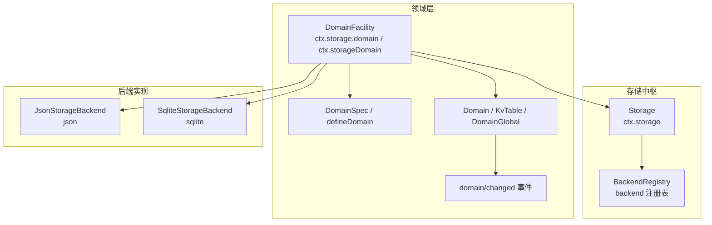
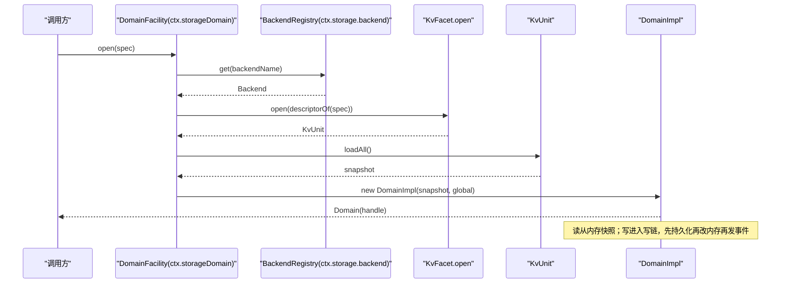
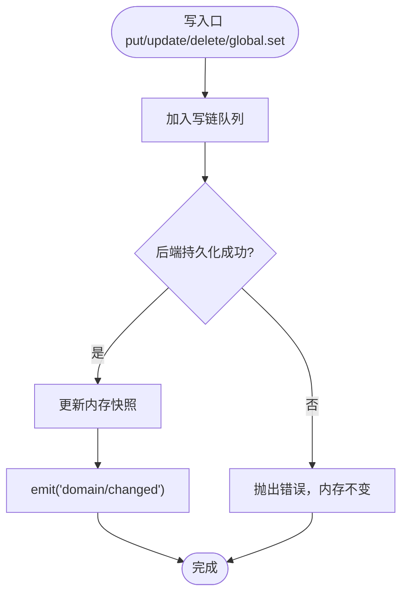
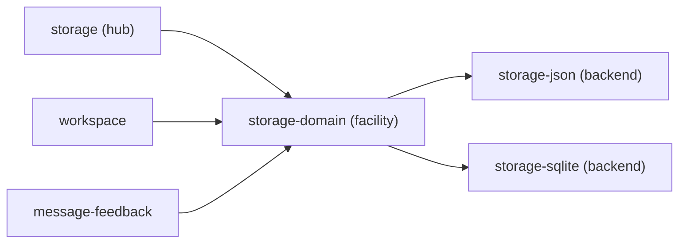

# 存储中心

<cite>
**本文引用的文件**
- [packages/storage/storage/src/index.ts](file://packages/storage/storage/src/index.ts)
- [packages/storage/storage/src/backend.ts](file://packages/storage/storage/src/backend.ts)
- [packages/storage/storage/src/registry.ts](file://packages/storage/storage/src/registry.ts)
- [packages/storage/storage-domain/src/index.ts](file://packages/storage/storage-domain/src/index.ts)
- [packages/storage/storage-domain/src/domain.ts](file://packages/storage/storage-domain/src/domain.ts)
- [packages/storage/storage-domain/src/spec.ts](file://packages/storage/storage-domain/src/spec.ts)
- [packages/storage/storage-domain/src/events.ts](file://packages/storage/storage-domain/src/events.ts)
- [packages/storage/storage-json/src/index.ts](file://packages/storage/storage-json/src/index.ts)
- [packages/storage/storage-sqlite/src/index.ts](file://packages/storage/storage-sqlite/src/index.ts)
- [docs/subsystems/storage.md](file://docs/subsystems/storage.md)
- [docs/subsystems/workspace.md](file://docs/subsystems/workspace.md)
- [packages/feedback/message-feedback/src/index.ts](file://packages/feedback/message-feedback/src/index.ts)
</cite>

## 目录
1. [简介](#简介)
2. [项目结构](#项目结构)
3. [核心组件](#核心组件)
4. [架构总览](#架构总览)
5. [详细组件分析](#详细组件分析)
6. [依赖关系分析](#依赖关系分析)
7. [性能考量](#性能考量)
8. [故障排查指南](#故障排查指南)
9. [结论](#结论)
10. [附录：领域 API 使用示例与最佳实践](#附录：领域-api-使用示例与最佳实践)

## 简介
本文件系统性说明 DeepSeek Harness 的“存储中心”设计，围绕统一的存储抽象、领域数据管理与后端选择机制展开。重点解释 ctx.storage（存储中枢）与 ctx.storageDomain（领域设施）的职责边界、数据形式转换、后端注册与路由、以及变更事件模型；并覆盖 JSON 与 SQLite 两种持久化方案的特点与适用场景。同时给出与工作区、消息反馈等服务的集成方式，提供领域 API 的使用示例、性能优化策略（事务、索引、缓存）、以及迁移与最佳实践建议。

## 项目结构
存储子系统由多个包组成，职责清晰分层：
- storage：定义存储中枢 Storage、后端契约 StorageBackend/KvFacet/KvUnit、名称解析与错误类型。
- storage-domain：领域层，声明 DomainSpec、打开 Domain、表句柄 KvTable、全局单例 DomainGlobal、变更事件 domain/changed。
- storage-json：JSON 后端实现，按单元生成可读 JSON 文件，原子写入。
- storage-sqlite：SQLite 后端实现，单库多单元，文档按行存储。
- 其他服务通过 ctx.storageDomain 访问领域能力，不直接耦合后端。



图表来源
- [packages/storage/storage/src/index.ts:47-93](file://packages/storage/storage/src/index.ts#L47-L93)
- [packages/storage/storage-domain/src/index.ts:69-221](file://packages/storage/storage-domain/src/index.ts#L69-L221)
- [packages/storage/storage-json/src/index.ts:37-115](file://packages/storage/storage-json/src/index.ts#L37-L115)
- [packages/storage/storage-sqlite/src/index.ts:55-169](file://packages/storage/storage-sqlite/src/index.ts#L55-L169)

章节来源
- [docs/subsystems/storage.md:1-230](file://docs/subsystems/storage.md#L1-L230)

## 核心组件
- ctx.storage（Storage）：存储中枢，负责后端注册表 backend 与数据形式挂载 forms。自身不做 IO，仅做路由与装配。
- ctx.storageDomain（DomainFacility）：领域设施，基于 DomainSpec 打开领域，将后端 KV 操作封装为领域语义（表、全局、变更事件）。
- 后端契约（StorageBackend/KvFacet/KvUnit）：统一 KV 接口，支持 loadAll、putRecord、deleteRecord、setGlobal、close。
- 领域声明（DomainSpec）：以 zod 描述记录 schema，defineDomain 在模块加载时校验命名与版本，descriptorOf 投影到后端单元描述符。
- 领域运行时（Domain/KvTable/DomainGlobal）：读同步于内存快照；写串行化到单条写链，先落盘再改内存再发事件。
- 变更事件（domain/changed）：每次持久化成功后发出，包含 domain/table/key/operation/value。

章节来源
- [packages/storage/storage/src/index.ts:47-93](file://packages/storage/storage/src/index.ts#L47-L93)
- [packages/storage/storage/src/backend.ts:17-104](file://packages/storage/storage/src/backend.ts#L17-L104)
- [packages/storage/storage-domain/src/index.ts:69-221](file://packages/storage/storage-domain/src/index.ts#L69-L221)
- [packages/storage/storage-domain/src/spec.ts:34-113](file://packages/storage/storage-domain/src/spec.ts#L34-L113)
- [packages/storage/storage-domain/src/domain.ts:18-119](file://packages/storage/storage-domain/src/domain.ts#L18-L119)
- [packages/storage/storage-domain/src/events.ts:108-126](file://packages/storage/storage-domain/src/events.ts#L108-L126)

## 架构总览
存储中心采用“中枢 + 领域 + 后端”的分层架构：
- 中枢只负责注册与挂载，不感知数据语义。
- 领域层定义数据形态、校验与一致性保证（写串行、事件顺序）。
- 后端实现具体介质（文件系统或数据库），遵循统一 KV 契约。



图表来源
- [packages/storage/storage-domain/src/index.ts:100-156](file://packages/storage/storage-domain/src/index.ts#L100-L156)
- [packages/storage/storage-domain/src/domain.ts:168-201](file://packages/storage/storage-domain/src/domain.ts#L168-L201)
- [packages/storage/storage/src/backend.ts:30-104](file://packages/storage/storage/src/backend.ts#L30-L104)

## 详细组件分析

### 存储中枢：ctx.storage
- 功能：维护后端注册表 backend；挂载数据形式 forms；暴露 form(name) 解析已挂载设施。
- 关键行为：
  - mount(form, facility)：效果式挂载，返回卸载器；重复挂载抛错。
  - form(form)：解析已挂载设施，未挂载抛错。
  - domain：便捷访问已挂载的领域设施。
- 生命周期：插件通过 effect 注册后端并在卸载时注销与关闭。

章节来源
- [packages/storage/storage/src/index.ts:47-93](file://packages/storage/storage/src/index.ts#L47-L93)
- [packages/storage/storage/src/registry.ts:1-200](file://packages/storage/storage/src/registry.ts#L1-L200)

### 后端契约与实现
- 契约：StorageBackend 拥有单一介质，暴露可选 facet（当前 kv）；KvFacet.open 打开 KvUnit；KvUnit 提供 loadAll、putRecord、deleteRecord、setGlobal、close。
- JSON 后端：
  - 每个单元一个 JSON 文件，原子重写保证一致性。
  - 配置 root 目录，apply 中注册为 'json' 后端。
- SQLite 后端：
  - 单库多单元，units 表管理版本，记录表 key/value 文本存储。
  - 配置 path 与 journal_mode，apply 中注册为 'sqlite' 后端。

```mermaid
classDiagram
class StorageBackend {
+kv? : KvFacet
+close() Promise~void~
}
class KvFacet {
+open(descriptor) Promise~KvUnit~
}
class KvUnit {
+loadAll() Promise~{tables,global}~
+putRecord(table,key,value) Promise~void~
+deleteRecord(table,key) Promise~void~
+setGlobal(value) Promise~void~
+close() Promise~void~
}
class JsonStorageBackend
class SqliteStorageBackend
StorageBackend <|.. JsonStorageBackend
StorageBackend <|.. SqliteStorageBackend
KvFacet ..> KvUnit : "open ->"
```

图表来源
- [packages/storage/storage/src/backend.ts:17-104](file://packages/storage/storage/src/backend.ts#L17-L104)
- [packages/storage/storage-json/src/index.ts:37-115](file://packages/storage/storage-json/src/index.ts#L37-L115)
- [packages/storage/storage-sqlite/src/index.ts:55-169](file://packages/storage/storage-sqlite/src/index.ts#L55-L169)

章节来源
- [packages/storage/storage/src/backend.ts:17-104](file://packages/storage/storage/src/backend.ts#L17-L104)
- [packages/storage/storage-json/src/index.ts:37-115](file://packages/storage/storage-json/src/index.ts#L37-L115)
- [packages/storage/storage-sqlite/src/index.ts:55-169](file://packages/storage/storage-sqlite/src/index.ts#L55-L169)

### 领域层：ctx.storageDomain
- 作用：将后端 KV 操作封装为领域语义（表、全局、事件），并提供 typed API。
- 关键流程：
  - open(spec)：校验名称/版本，解析路由后端，要求 kv facet，打开单元，加载快照并按 spec 校验记录，构造 Domain。
  - table(name)：返回稳定表句柄；get/entries/keys/size 同步读取内存快照。
  - put/update/delete/global.set：进入写链，先持久化，再改内存，再 emit domain/changed。
  - close()：拒绝新写，排空写链，释放单元，释放名称以便重开。
- 事件：domain/changed 在持久化成功后严格顺序发出，携带新值或删除标记。



图表来源
- [packages/storage/storage-domain/src/domain.ts:263-356](file://packages/storage/storage-domain/src/domain.ts#L263-L356)
- [packages/storage/storage-domain/src/events.ts:108-126](file://packages/storage/storage-domain/src/events.ts#L108-L126)

章节来源
- [packages/storage/storage-domain/src/index.ts:69-221](file://packages/storage/storage-domain/src/index.ts#L69-L221)
- [packages/storage/storage-domain/src/domain.ts:18-119](file://packages/storage/storage-domain/src/domain.ts#L18-L119)
- [packages/storage/storage-domain/src/events.ts:108-126](file://packages/storage/storage-domain/src/events.ts#L108-L126)

### 后端选择机制与路由
- 路由配置：DomainFacility.Config.backend 为默认后端；routes 可按域名覆盖。
- 解析失败：未注册后端抛 backend-not-found；无 kv facet 抛 facet-unsupported。
- 版本与格式：后端 open 时进行版本检查与格式校验，不兼容则抛 version-mismatch/malformed-medium。

章节来源
- [packages/storage/storage-domain/src/index.ts:46-62](file://packages/storage/storage-domain/src/index.ts#L46-L62)
- [packages/storage/storage-domain/src/index.ts:100-114](file://packages/storage/storage-domain/src/index.ts#L100-L114)
- [packages/storage/storage/src/backend.ts:30-43](file://packages/storage/storage/src/backend.ts#L30-L43)

### 工作区与存储中心的集成
- 工作区子系统通过 storageDomain 持久化工作区实体与会话归属关系。
- 启动时依赖 sessionPersistence，构建历史并一次性引导；之后通过 attachSession/detachSession 等更新工作区记录。
- 工作区对存储的依赖是强制的，避免误判为空历史。

章节来源
- [docs/subsystems/workspace.md:1-229](file://docs/subsystems/workspace.md#L1-L229)

### 消息反馈与存储中心的集成
- 消息反馈服务作为存储领域的侧车服务，基于 storageDomain 读写反馈项。
- 测试环境通过加载 Storage、StorageJson、StorageDomain 并注入 MessageFeedbackService 完成端到端验证。

章节来源
- [packages/feedback/message-feedback/src/index.ts:37-83](file://packages/feedback/message-feedback/src/index.ts#L37-L83)

## 依赖关系分析
- 低耦合：领域层不直接依赖后端实现，仅依赖 KV 契约；后端可替换。
- 强内聚：DomainImpl 集中处理写链、事件、状态一致性；KvTableImpl 专注表级操作。
- 外部依赖：Cordis 上下文用于事件发射与服务装配；zod/schemastery 用于校验。



图表来源
- [packages/storage/storage/src/index.ts:47-93](file://packages/storage/storage/src/index.ts#L47-L93)
- [packages/storage/storage-domain/src/index.ts:69-221](file://packages/storage/storage-domain/src/index.ts#L69-L221)
- [packages/storage/storage-json/src/index.ts:37-115](file://packages/storage/storage-json/src/index.ts#L37-L115)
- [packages/storage/storage-sqlite/src/index.ts:55-169](file://packages/storage/storage-sqlite/src/index.ts#L55-L169)

章节来源
- [packages/storage/storage/src/backend.ts:17-104](file://packages/storage/storage/src/backend.ts#L17-L104)
- [packages/storage/storage-domain/src/domain.ts:140-277](file://packages/storage/storage-domain/src/domain.ts#L140-L277)

## 性能考量
- 写串行化：每域一条写链，避免并发写竞争，确保事件顺序与内存一致。
- 读路径优化：读完全同步于内存快照，迭代器为快照视图，不受排队写影响。
- 持久化策略：
  - JSON：整文件原子重写，适合小体量、人类可读、调试友好。
  - SQLite：单库多单元，文档按行存储，适合高频更新与查询。
- 索引设计（SQLite）：记录表以 key 为主键，天然索引；必要时可在应用层建立复合查询索引。
- 缓存机制：内存快照即缓存；Domain.close 前仍保持有效，关闭后读抛错。
- 事务处理：
  - 领域层：写链保证单写原子性；跨多条记录的复合操作应在调用方编排。
  - 后端层：SQLite 可通过事务包裹批量写以提升吞吐（由后端内部实现）。
- 事件消费：domain/changed 为进程内通知，监听器异常被捕获并记录，不影响已提交写。

[本节为通用性能指导，无需特定文件引用]

## 故障排查指南
- already-open：尝试重复打开同一域名。解决：等待上一个关闭完成或复用已有 handle。
- backend-not-found：路由指向的后端未注册。解决：确保对应后端插件已加载。
- facet-unsupported：后端未实现 kv facet。解决：更换支持 kv 的后端。
- version-mismatch：介质版本与 spec.version 不一致。解决：升级/降级 spec 或迁移介质。
- malformed-medium：介质无法解析为目标单元。解决：清理损坏介质或回退版本。
- invalid-record：存储记录不符合 zod schema。解决：修复数据或调整 schema。
- missing-key：update 目标键不存在。解决：先 put 或使用条件更新。
- closed：域或后端已关闭。解决：检查生命周期与资源释放顺序。

章节来源
- [packages/storage/storage-domain/src/index.ts:100-156](file://packages/storage/storage-domain/src/index.ts#L100-L156)
- [packages/storage/storage-domain/src/domain.ts:231-277](file://packages/storage/storage-domain/src/domain.ts#L231-L277)
- [packages/storage/storage-json/src/index.ts:77-85](file://packages/storage/storage-json/src/index.ts#L77-L85)
- [packages/storage/storage-sqlite/src/index.ts:130-149](file://packages/storage/storage-sqlite/src/index.ts#L130-L149)

## 结论
存储中心通过“中枢—领域—后端”的清晰分层，提供了统一、类型安全、可扩展的 KV 存储抽象。领域层保证了写串行、事件顺序与内存一致性；后端可插拔适配不同介质。结合工作区与消息反馈等服务，形成稳定的数据基础设施。推荐在生产环境中根据数据规模与访问模式选择合适的后端，并通过路由配置灵活切换。

[本节为总结性内容，无需特定文件引用]

## 附录：领域 API 使用示例与最佳实践

### 使用领域 API 进行数据操作（示例步骤）
- 定义领域：
  - 使用 defineDomain 声明 name/version/tables/global。
  - 使用 domainTable(schema) 声明表及记录 schema。
- 打开领域：
  - 通过 ctx.storageDomain.open(spec) 获取 Domain。
  - 通过 domain.table('xxx') 获取表句柄。
- 读写数据：
  - 读：table.get(key)、table.entries()、table.keys()、table.size。
  - 写：table.put(key, value)、table.update(key, fn)、table.delete(key)。
  - 全局：domain.global.get()/set(value)。
- 监听变更：
  - 订阅 ctx.emit('domain/changed', ...) 处理持久化后的变更。
- 关闭资源：
  - 在 effect 卸载时调用 domain.close()，确保写链排空并释放后端单元。

章节来源
- [packages/storage/storage-domain/src/spec.ts:34-113](file://packages/storage/storage-domain/src/spec.ts#L34-L113)
- [packages/storage/storage-domain/src/index.ts:100-156](file://packages/storage/storage-domain/src/index.ts#L100-L156)
- [packages/storage/storage-domain/src/domain.ts:18-119](file://packages/storage/storage-domain/src/domain.ts#L18-L119)
- [packages/storage/storage-domain/src/events.ts:108-126](file://packages/storage/storage-domain/src/events.ts#L108-L126)

### 后端选择与适用场景
- JSON 后端：
  - 特点：每单元一文件，人类可读，原子重写。
  - 适用：小规模数据、调试与可视化需求高、部署简单。
- SQLite 后端：
  - 特点：单库多单元，行级文档存储，WAL 默认。
  - 适用：频繁更新、需要事务与索引的场景。

章节来源
- [packages/storage/storage-json/src/index.ts:1-115](file://packages/storage/storage-json/src/index.ts#L1-L115)
- [packages/storage/storage-sqlite/src/index.ts:1-169](file://packages/storage/storage-sqlite/src/index.ts#L1-L169)

### 数据迁移指南
- 版本控制：通过 DomainSpec.version 标识介质版本；后端在 open 时校验版本。
- 迁移策略：
  - 升级版本：修改 spec.version，并在首次 open 时执行迁移逻辑（如重建表、转换记录）。
  - 回滚：恢复旧版本 spec 与介质，确保兼容性。
- 校验保障：所有记录在加载时经 zod schema 校验，非法数据会触发 invalid-record 错误。

章节来源
- [packages/storage/storage-domain/src/spec.ts:34-113](file://packages/storage/storage-domain/src/spec.ts#L34-L113)
- [packages/storage/storage-domain/src/index.ts:100-156](file://packages/storage/storage-domain/src/index.ts#L100-L156)

### 最佳实践
- 始终通过 ctx.storageDomain 访问领域能力，不要直接调用后端。
- 使用 defineDomain 集中声明领域元数据，避免分散配置。
- 写操作尽量合并为 update(key, fn) 以保证原子性。
- 合理设置 journal_mode（SQLite）以匹配文件系统特性。
- 在 effect 中管理领域生命周期，确保 close 被调用。
- 监听 domain/changed 时注意异常隔离，避免阻塞写链。

[本节为通用最佳实践，无需特定文件引用]