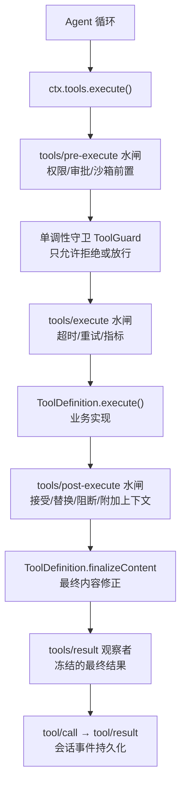
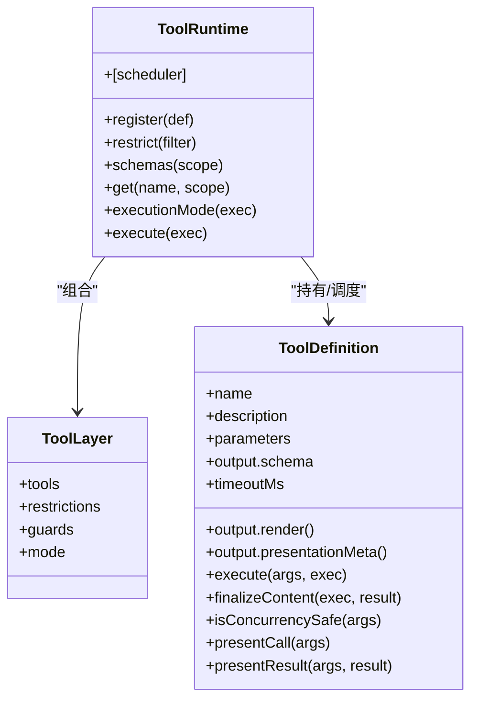
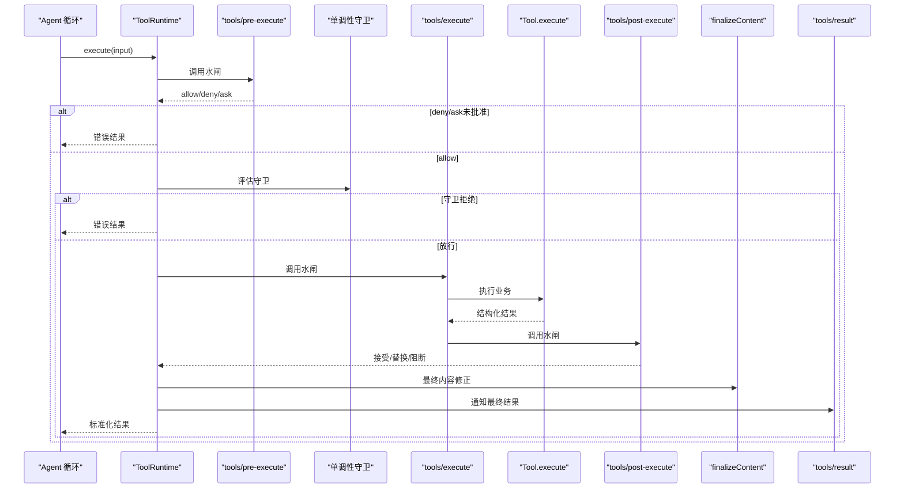
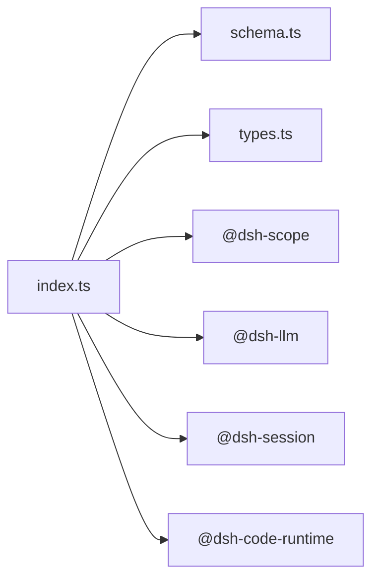

# 工具注册中心

<cite>
**本文引用的文件**
- [packages/core/tools/src/index.ts](file://packages/core/tools/src/index.ts)
- [packages/core/tools/src/schema.ts](file://packages/core/tools/src/schema.ts)
- [packages/core/tools/src/types.ts](file://packages/core/tools/src/types.ts)
- [docs/subsystems/tools.md](file://docs/subsystems/tools.md)
- [docs/tool-execution-pipeline.md](file://docs/tool-execution-pipeline.md)
- [docs/tool-catalog.md](file://docs/tool-catalog.md)
</cite>

## 目录
1. [简介](#简介)
2. [项目结构](#项目结构)
3. [核心组件](#核心组件)
4. [架构总览](#架构总览)
5. [详细组件分析](#详细组件分析)
6. [依赖关系分析](#依赖关系分析)
7. [性能与并发](#性能与并发)
8. [故障排查指南](#故障排查指南)
9. [结论](#结论)
10. [附录：示例与最佳实践](#附录示例与最佳实践)

## 简介
本文件系统性说明 DeepSeek Harness 的工具系统，围绕“工具注册、发现、验证、执行”的完整生命周期展开。重点解释 ctx.tools 服务的能力边界与扩展点，包括工具的声明式定义、参数校验、权限控制与安全沙箱集成；并详述工具执行管道（预策略检查、单调性守卫、调度器、后策略、结果观察）如何与 Agent 循环、系统提示、用户问题协同工作。文末提供自定义工具开发步骤、错误处理与重试机制、性能监控与调试技巧，以及最佳实践。

## 项目结构
工具系统的核心位于 packages/core/tools，对外暴露统一的 API 与事件模型，并通过 Cordis 服务注入到 ctx.tools。配套文档在 docs/subsystems/tools.md 与 docs/tool-execution-pipeline.md 中给出端到端流程与事件契约。

图表来源
- [docs/tool-execution-pipeline.md:8-58](file://docs/tool-execution-pipeline.md#L8-L58)
- [packages/core/tools/src/index.ts:137-208](file://packages/core/tools/src/index.ts#L137-L208)

章节来源
- [docs/subsystems/tools.md:1-12](file://docs/subsystems/tools.md#L1-L12)
- [docs/tool-execution-pipeline.md:1-63](file://docs/tool-execution-pipeline.md#L1-L63)

## 核心组件
- 工具定义与 DSL
  - defineTool：声明式定义工具，自动编译参数 schema、输出 schema、类型推断与运行时校验。
  - ValueSchemaSpec/ParameterSchemaSpec：统一 JSON 值 schema 与参数映射，支持 string/number/integer/boolean/null/array/object/json/oneOf。
- 工具运行时与注册表
  - ToolRuntime：注册、限制、查询、模式切换、执行入口 execute()、调度视图 scheduler。
  - ToolLayer：作用域层聚合工具、限制、守卫与呈现模式覆盖。
- 执行管道与水闸
  - tools/pre-execute：允许/拒绝/询问（审批）。
  - 单调性守卫 ToolGuard：仅能拒绝，不可恢复已拒绝的调用。
  - tools/execute：around-dispatch，用于超时、重试、指标等。
  - tools/post-execute：接受/替换内容或值、附加上下文、阻断为错误。
  - finalizeContent：定义级最后的内容修正。
  - tools/result：最终结果的同步观察者，接收冻结的不可变结果。
- 事件与可观测性
  - tools/change：工具集合变更通知。
  - tools/code-dispatch-log：Code Mode 子调用的日志内容替换。
  - tool/code-dispatch-start / tool/code-dispatch：Code Mode 子调用的开始与结束事件。
- 错误与失败语义
  - ToolNotFoundError（UNKNOWN_TOOL）、ToolArgsError（INVALID_ARGS）、ToolOutputError（INVALID_TOOL_OUTPUT）。
  - ABORTED_BEFORE_DISPATCH / ABORTED：取消在不同阶段的语义。

章节来源
- [packages/core/tools/src/schema.ts:482-618](file://packages/core/tools/src/schema.ts#L482-L618)
- [packages/core/tools/src/index.ts:211-460](file://packages/core/tools/src/index.ts#L211-L460)
- [packages/core/tools/src/index.ts:787-800](file://packages/core/tools/src/index.ts#L787-L800)
- [packages/core/tools/src/types.ts:10-57](file://packages/core/tools/src/types.ts#L10-L57)

## 架构总览
工具系统以“声明式定义 + 强约束 schema + 可扩展水闸”为核心设计。所有工具通过 ctx.tools.register 注册，按作用域叠加可见性与限制；执行时由 ToolRuntime 统一编排，贯穿 pre/guard/around/post/finalize/result 阶段，确保可审计、可观测、可回滚（通过阻断/替换）且对 UI 友好（presentCall/presentResult）。

图表来源
- [packages/core/tools/src/index.ts:714-754](file://packages/core/tools/src/index.ts#L714-L754)
- [packages/core/tools/src/index.ts:787-800](file://packages/core/tools/src/index.ts#L787-L800)
- [packages/core/tools/src/index.ts:221-288](file://packages/core/tools/src/index.ts#L221-L288)

章节来源
- [docs/subsystems/tools.md:478-574](file://docs/subsystems/tools.md#L478-L574)

## 详细组件分析

### 工具注册与发现
- 注册：ToolRuntime.register(definition) 将工具加入当前作用域层；同名冲突会报错。
- 作用域与限制：ToolLayer.restrictions 支持 allow/deny 过滤全局工具；scoped 注册不受影响。
- 可见性：ToolRuntime.schemas(scope) 仅暴露模型可见字段（名称、描述、参数），不泄露执行回调。
- 查询：ToolRuntime.get(name, scope) 返回该作用域下可见的定义。

章节来源
- [packages/core/tools/src/index.ts:714-754](file://packages/core/tools/src/index.ts#L714-L754)
- [packages/core/tools/src/index.ts:787-800](file://packages/core/tools/src/index.ts#L787-L800)
- [docs/subsystems/tools.md:498-544](file://docs/subsystems/tools.md#L498-L544)

### 声明式定义与参数验证
- defineTool 将参数 schema 编译为 raw JSON Schema，并在执行前严格校验，非法参数抛出 ToolArgsError（INVALID_ARGS）。
- 输出 schema 同样被强制校验，非法返回值抛出 ToolOutputError（INVALID_TOOL_OUTPUT）。
- presentCall/presentResult 在回放场景下软校验，避免历史参数导致崩溃。

章节来源
- [packages/core/tools/src/schema.ts:432-458](file://packages/core/tools/src/schema.ts#L432-L458)
- [packages/core/tools/src/schema.ts:472-480](file://packages/core/tools/src/schema.ts#L472-L480)
- [packages/core/tools/src/schema.ts:545-618](file://packages/core/tools/src/schema.ts#L545-L618)

### 权限控制与安全沙箱集成
- 预策略水闸 tools/pre-execute：可接入审批、沙箱准入、权限策略等。ask 需经审批通道返回 allowed-once 才放行。
- 单调性守卫 ToolGuard：在 pre 之后、body 之前运行，只能拒绝，不能恢复已拒绝的调用，保证安全策略不可逆。
- Code Mode 子调用：通过 parent token 标记为传输子调用，受同一管道保护，并可替换日志内容（tools/code-dispatch-log）。

章节来源
- [packages/core/tools/src/index.ts:137-208](file://packages/core/tools/src/index.ts#L137-L208)
- [packages/core/tools/src/index.ts:703-711](file://packages/core/tools/src/index.ts#L703-L711)
- [docs/tool-execution-pipeline.md:8-58](file://docs/tool-execution-pipeline.md#L8-L58)

### 执行管道与调度
- 准备阶段：prepare 完成输入物化、pre-execute、monotonic guards，决定后续阶段。
- 调度阶段：dispatch 进入 around-dispatch 与工具体。
- 收尾阶段：finalize 执行 post-execute、定义级 finalizeContent、materialize 并通知 tools/result。
- 模式：parallel/exclusive 由 executionMode 判定，Agent 循环据此形成并行池与独占屏障。

图表来源
- [packages/core/tools/src/index.ts:787-800](file://packages/core/tools/src/index.ts#L787-L800)
- [docs/tool-execution-pipeline.md:8-58](file://docs/tool-execution-pipeline.md#L8-L58)

章节来源
- [packages/core/tools/src/index.ts:423-460](file://packages/core/tools/src/index.ts#L423-L460)
- [docs/subsystems/tools.md:170-255](file://docs/subsystems/tools.md#L170-L255)

### 结果观察与 UI 呈现
- finalizeContent：最后一次内容修正机会，必须幂等且不抛异常。
- presentCall/presentResult：纯函数，用于 UI 卡片渲染，回放兼容。
- tools/result：最终冻结结果的观察者，适合指标、审计、追踪。

章节来源
- [packages/core/tools/src/index.ts:221-288](file://packages/core/tools/src/index.ts#L221-L288)
- [docs/subsystems/tools.md:459-468](file://docs/subsystems/tools.md#L459-L468)

### 与 Agent 循环、系统提示、用户问题的交互
- Agent 循环根据 executionMode 组织并发与顺序，保证 exclusive 调用形成屏障。
- 系统提示组装使用 schemas() 暴露给模型的可见能力集，不包含执行逻辑。
- 用户问题驱动 Agent 生成 tool-call，经由工具管道产出 tool/result 事件，UI 通过 present* 渲染。

章节来源
- [docs/subsystems/tools.md:243-255](file://docs/subsystems/tools.md#L243-L255)
- [docs/tool-catalog.md:1-42](file://docs/tool-catalog.md#L1-L42)

## 依赖关系分析
- 内部依赖
  - schema.ts：schema 编译与 validateArgs。
  - index.ts：ToolRuntime、事件、水闸、错误类型。
  - types.ts：Code Mode 子调用的事件载荷。
- 外部依赖
  - @deepseek-ai/cordis：Service 注入与事件框架。
  - @deepseek-ai/dsh-scope：作用域与可见性。
  - @deepseek-ai/dsh-llm：模型侧 ToolSchema、错误基类。
  - @deepseek-ai/dsh-session：快照与持久化。
  - @deepseek-ai/dsh-code-runtime：Code Mode 语言后端。

图表来源
- [packages/core/tools/src/index.ts:7-28](file://packages/core/tools/src/index.ts#L7-L28)

章节来源
- [packages/core/tools/src/index.ts:7-28](file://packages/core/tools/src/index.ts#L7-L28)

## 性能与并发
- 并发分类：isConcurrencySafe 声明可并发的工具；否则默认独占。
- 最大并行子调用：maxParallelSubCalls 控制 Code Mode 程序内子调用的并发上限。
- 超时预算：timeoutMs 配合 tools/execute 包装实现协作式超时。
- 结果物化：value/content/meta 在关键节点进行快照与冻结，避免后续修改引发不一致。

章节来源
- [packages/core/tools/src/index.ts:650-674](file://packages/core/tools/src/index.ts#L650-L674)
- [packages/core/tools/src/index.ts:248-269](file://packages/core/tools/src/index.ts#L248-L269)

## 故障排查指南
- 未知工具：ToolNotFoundError（UNKNOWN_TOOL），检查注册与作用域可见性。
- 参数错误：ToolArgsError（INVALID_ARGS），核对 parameters 与传入值。
- 输出错误：ToolOutputError（INVALID_TOOL_OUTPUT），核对 output.schema 与返回值。
- 取消语义：ABORTED_BEFORE_DISPATCH（未启动即取消）、ABORTED（已启动后被取消）。
- 审批失败：pre-execute ask 未被批准或被取消，视为拒绝。
- 代码模式子调用：通过 tool/code-dispatch-start 与 tool/code-dispatch 配对定位。

章节来源
- [packages/core/tools/src/index.ts:468-522](file://packages/core/tools/src/index.ts#L468-L522)
- [packages/core/tools/src/types.ts:10-57](file://packages/core/tools/src/types.ts#L10-L57)

## 结论
DeepSeek Harness 的工具系统以“强约束 schema + 可扩展水闸 + 作用域可见性”为核心，提供了从声明式定义到执行、审计、呈现的完整闭环。通过 pre/guard/around/post/finalize/result 的分阶段处理，既能满足复杂的安全与策略需求，又能保持对 UI 与可观测性的良好支持。开发者应优先使用 defineTool 与标准 schema，合理声明 isConcurrencySafe 与 timeoutMs，并通过 waterfalls 与 guards 实现权限、审批与监控。

## 附录：示例与最佳实践

### 开发自定义工具（步骤）
- 使用 defineTool 声明 name、description、parameters、output（schema/render/presentationMeta）、execute。
- 如需内容最终修正，实现 finalizeContent；如需 UI 定制，实现 presentCall/presentResult。
- 若可安全并发，实现 isConcurrencySafe；如需超时，设置 timeoutMs。
- 通过 ctx.tools.register 注册，必要时用 restrict 限制可见范围。
- 订阅 tools/result 做指标与审计；必要时在 tools/pre-execute 接入审批/沙箱。

章节来源
- [packages/core/tools/src/schema.ts:482-618](file://packages/core/tools/src/schema.ts#L482-L618)
- [docs/subsystems/tools.md:478-574](file://docs/subsystems/tools.md#L478-L574)

### 集成现有工具
- 查看工具目录 docs/tool-catalog.md，了解各工具的名称、参数与行为。
- 通过 ctx.tools.schemas() 获取当前作用域可见的工具列表，结合 system prompt 装配。
- 对于需要受限的场景，使用 ctx.tools.restrict 配置 allow/deny。

章节来源
- [docs/tool-catalog.md:1-42](file://docs/tool-catalog.md#L1-L42)

### 错误处理与重试
- 参数与输出错误通过 ToolArgsError/ToolOutputError 上报，可在 tools/post-execute 捕获并转换为业务友好的反馈。
- 使用 tools/execute 包装实现重试、退避与指标采集；注意保留并融合 caller signal。
- 区分取消阶段：ABORTED_BEFORE_DISPATCH 与 ABORTED，分别处理未启动与已启动的取消。

章节来源
- [packages/core/tools/src/index.ts:468-522](file://packages/core/tools/src/index.ts#L468-L522)
- [docs/tool-execution-pipeline.md:8-58](file://docs/tool-execution-pipeline.md#L8-L58)

### 性能监控与调试
- 订阅 tools/result 收集耗时、成功率、错误码分布。
- 使用 tool/code-dispatch-start 与 tool/code-dispatch 跟踪 Code Mode 子调用链路。
- 利用 presentCall/presentResult 提升 UI 可读性，便于快速定位问题。

章节来源
- [packages/core/tools/src/types.ts:10-57](file://packages/core/tools/src/types.ts#L10-L57)
- [docs/subsystems/tools.md:459-468](file://docs/subsystems/tools.md#L459-L468)