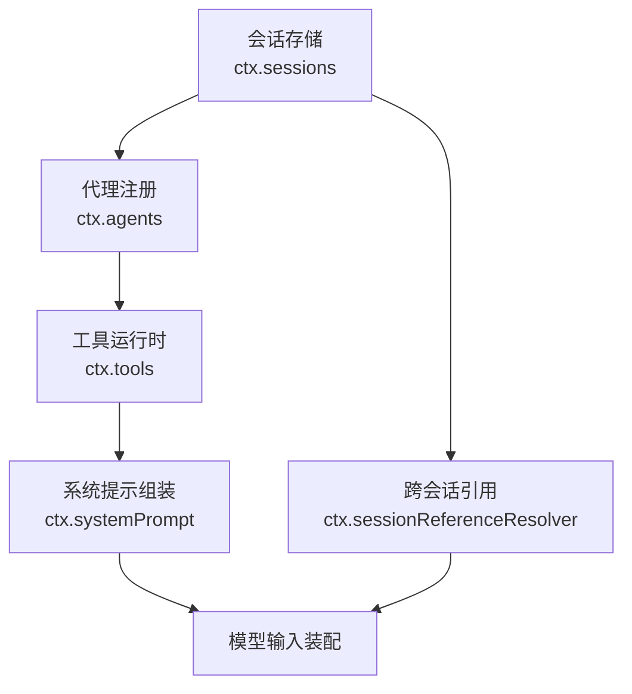
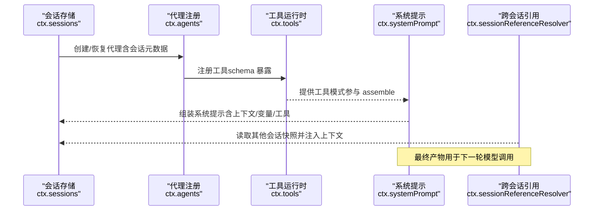
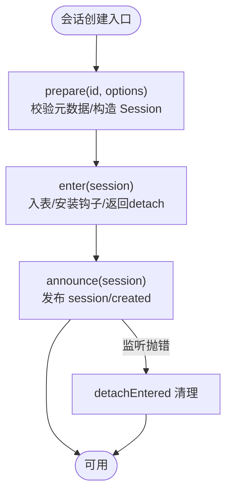
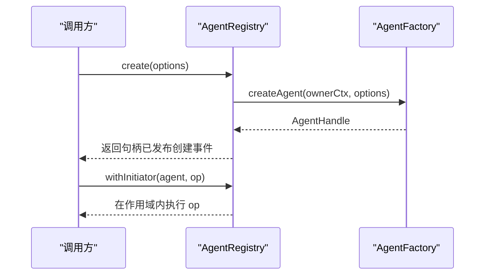
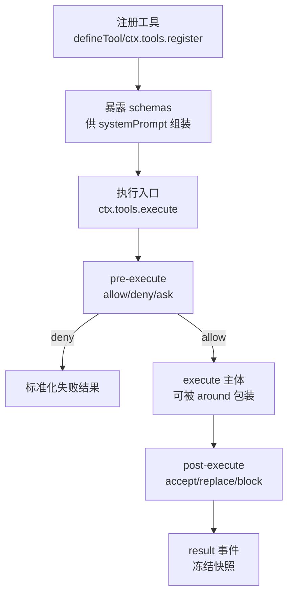
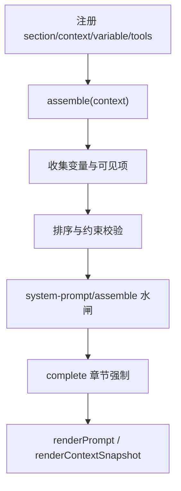
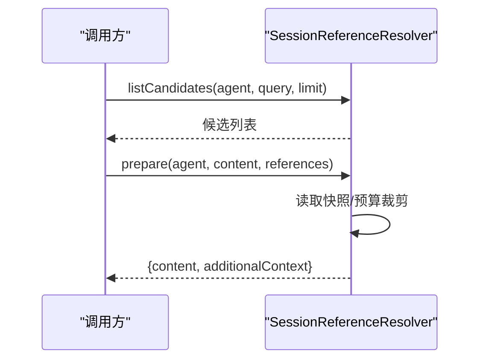
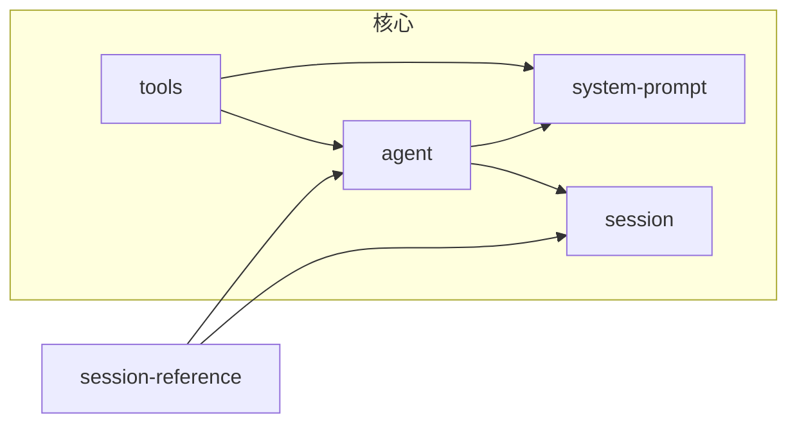

# 核心服务

<cite>
**本文引用的文件**
- [packages/core/agent/src/index.ts](file://packages/core/agent/src/index.ts)
- [packages/core/system-prompt/src/index.ts](file://packages/core/system-prompt/src/index.ts)
- [packages/core/tools/src/index.ts](file://packages/core/tools/src/index.ts)
- [packages/core/session/src/index.ts](file://packages/core/session/src/index.ts)
- [packages/context/session-reference/src/index.ts](file://packages/context/session-reference/src/index.ts)
- [docs/architecture.md](file://docs/architecture.md)
- [docs/module-graph.zh.md](file://docs/module-graph.zh.md)
</cite>

## 目录
1. [简介](#简介)
2. [项目结构](#项目结构)
3. [核心组件](#核心组件)
4. [架构总览](#架构总览)
5. [详细组件分析](#详细组件分析)
6. [依赖关系分析](#依赖关系分析)
7. [性能考量](#性能考量)
8. [故障排查指南](#故障排查指南)
9. [结论](#结论)
10. [附录：开发指南与使用示例](#附录开发指南与使用示例)

## 简介
本文件面向 DeepSeek Harness 的“核心服务”层，聚焦其作为系统基础设施的定位：提供不可替换的稳定能力，包括会话生命周期管理、状态持久化协作、事件驱动架构、工具注册与系统提示组装等。核心服务通过可组合的服务（Service）与上下文（Context）机制，为上层能力接缝（如工具、会话查询、跨会话引用、工作流等）提供一致且稳定的基础支持。

## 项目结构
核心服务由多个相互协作的包组成，围绕“会话—代理—工具—提示—引用”的主线展开：
- 会话存储与会话边界：SessionStore（ctx.sessions）负责会话创建、进入、公告与销毁的生命周期编排。
- 代理注册与发起者链路：AgentRegistry（ctx.agents）维护活跃代理、工厂委托、发起者作用域与生命周期。
- 工具注册与执行管线：ToolRuntime（ctx.tools）提供工具注册、可见性过滤、执行前/中/后钩子、结果规范化与事件分发。
- 系统提示组装：SystemPrompt（ctx.systemPrompt）聚合有序章节、动态上下文、工具模式与变量，产出模型输入。
- 跨会话引用：SessionReferenceResolver（ctx.sessionReferenceResolver）将其他会话快照安全地注入当前请求上下文。

图表来源
- [packages/core/session/src/index.ts:786-979](file://packages/core/session/src/index.ts#L786-L979)
- [packages/core/agent/src/index.ts:256-704](file://packages/core/agent/src/index.ts#L256-L704)
- [packages/core/tools/src/index.ts:787-979](file://packages/core/tools/src/index.ts#L787-L979)
- [packages/core/system-prompt/src/index.ts:338-546](file://packages/core/system-prompt/src/index.ts#L338-L546)
- [packages/context/session-reference/src/index.ts:70-233](file://packages/context/session-reference/src/index.ts#L70-L233)

章节来源
- [docs/architecture.md:104-127](file://docs/architecture.md#L104-L127)
- [docs/module-graph.zh.md:1475-1560](file://docs/module-graph.zh.md#L1475-L1560)

## 核心组件
- 会话管理（ctx.sessions）
  - 职责：会话创建、准备、进入、公告、销毁；与持久化插件协作（订阅 session/event，在 flush/dispose 时落盘）。
  - 关键点：prepare/enter/announce 三段式原子编排；错误回滚与发布顺序保证；类型查找注册（typert）。
- 代理注册与发起者链路（ctx.agents）
  - 职责：代理工厂委托（create/resume）、活跃代理注册、发起者作用域传播、生命周期事件。
  - 关键点：withInitiator/withoutInitiator 控制异步链归属；register/announce/emitDisposed 严格配对；类型查找注册。
- 工具注册与执行（ctx.tools）
  - 职责：工具定义与注册、可见性过滤、执行前/中/后流水线、结果规范化、事件分发（tools/*）。
  - 关键点：pre-execute/execute/post-execute 水闸；code/native/both 呈现模式；并发与安全策略；输出 schema 校验。
- 系统提示组装（ctx.systemPrompt）
  - 职责：有序章节、动态上下文、工具模式、变量插值；assemble 产出 PromptAssembly；waterfall 扩展。
  - 关键点：complete 章节独占；toolOrder 校验；runtime context 抑制；scope 分层合并。
- 跨会话引用（ctx.sessionReferenceResolver）
  - 职责：候选列表、快照读取、预算裁剪、安全注入；生成只读上下文片段。
  - 关键点：预算限制、取消信号、自引用拒绝、排序与去重。

章节来源
- [packages/core/session/src/index.ts:786-979](file://packages/core/session/src/index.ts#L786-L979)
- [packages/core/agent/src/index.ts:256-704](file://packages/core/agent/src/index.ts#L256-L704)
- [packages/core/tools/src/index.ts:787-979](file://packages/core/tools/src/index.ts#L787-L979)
- [packages/core/system-prompt/src/index.ts:338-546](file://packages/core/system-prompt/src/index.ts#L338-L546)
- [packages/context/session-reference/src/index.ts:70-233](file://packages/context/session-reference/src/index.ts#L70-L233)

## 架构总览
核心服务以“会话”为中心，贯穿“代理—工具—提示—引用”的全链路：
- 会话是状态载体，代理是运行主体，工具是能力扩展点，系统提示是模型输入装配器，跨会话引用是上下文增强。
- 所有服务均基于 Cordis 的 Service/Context 模型，具备作用域隔离、事件驱动、可组合与可卸载特性。

图表来源
- [packages/core/session/src/index.ts:830-979](file://packages/core/session/src/index.ts#L830-L979)
- [packages/core/agent/src/index.ts:405-430](file://packages/core/agent/src/index.ts#L405-L430)
- [packages/core/tools/src/index.ts:787-979](file://packages/core/tools/src/index.ts#L787-L979)
- [packages/core/system-prompt/src/index.ts:467-546](file://packages/core/system-prompt/src/index.ts#L467-L546)
- [packages/context/session-reference/src/index.ts:169-233](file://packages/context/session-reference/src/index.ts#L169-L233)

## 详细组件分析

### 会话管理（ctx.sessions）
- 设计要点
  - 三段式生命周期：prepare（构造/校验）→ enter（安装钩子/入表）→ announce（发布 created）。
  - 与持久化解耦：仅内存存储，持久化插件通过事件订阅与 flush/dispose 落盘。
  - 类型查找：向 typert 注册 session 查找，便于跨边界解析。
- 关键流程
  - create：封装 prepare + effect 包裹 enter/announce，确保异常回滚。
  - enter：防重复、记录 carrier、返回 detach 能力，延迟释放直到同步发布完成。
  - announce：标记 announced/announcing，避免重入；失败时仍保证成对 disposal。

图表来源
- [packages/core/session/src/index.ts:830-979](file://packages/core/session/src/index.ts#L830-L979)

章节来源
- [packages/core/session/src/index.ts:786-979](file://packages/core/session/src/index.ts#L786-L979)

### 代理注册与发起者链路（ctx.agents）
- 设计要点
  - 工厂委托：create/resume 统一转发给已注册的 AgentFactory，保持实现可替换。
  - 作用域传播：withInitiator/withoutInitiator 控制异步链中的发起者归属，便于审计与追踪。
  - 生命周期：register/announce/emitDisposed 严格配对，确保 agent/created 与 agent/disposed 成对出现。
- 关键流程
  - create/resume：获取工厂 → 反射调用 → 等待 setup/commit → 插入 session/agent → 发出创建事件 → 启动循环。
  - register：进入 store → 立即 announce → effect 内回收。
  - withInitiator：设置 AsyncLocalStorage 上下文，保证下游能读到发起者。

图表来源
- [packages/core/agent/src/index.ts:405-430](file://packages/core/agent/src/index.ts#L405-L430)
- [packages/core/agent/src/index.ts:341-358](file://packages/core/agent/src/index.ts#L341-L358)
- [packages/core/agent/src/index.ts:450-576](file://packages/core/agent/src/index.ts#L450-L576)

章节来源
- [packages/core/agent/src/index.ts:256-704](file://packages/core/agent/src/index.ts#L256-L704)

### 工具注册与执行（ctx.tools）
- 设计要点
  - 工具定义：包含 schema、output.render、可选 finalizeContent/presentCall/presentResult、timeoutMs/isConcurrencySafe。
  - 执行管线：pre-execute（允许/拒绝/询问）→ execute（around 包装，超时/重试/指标）→ post-execute（接受/替换/阻断）→ result（最终事件）。
  - 呈现模式：native/code/both，code 模式通过 run_code 与 SDK 提示引导模型间接调用工具。
- 关键流程
  - 注册：工具定义入表，schema 暴露给 systemPrompt.assemble。
  - 执行：参数冻结与校验 → 前置策略 → 调度执行 → 后置策略 → 结果规范化与事件通知。
  - 并发：isConcurrencySafe 决定是否可与兄弟调用重叠；run_code 子调用有并发上限配置。

图表来源
- [packages/core/tools/src/index.ts:787-979](file://packages/core/tools/src/index.ts#L787-L979)

章节来源
- [packages/core/tools/src/index.ts:221-288](file://packages/core/tools/src/index.ts#L221-L288)
- [packages/core/tools/src/index.ts:650-674](file://packages/core/tools/src/index.ts#L650-L674)
- [packages/core/tools/src/index.ts:787-979](file://packages/core/tools/src/index.ts#L787-L979)

### 系统提示组装（ctx.systemPrompt）
- 设计要点
  - 有序章节：section(name, order, text)，complete 章节独占。
  - 动态上下文：context(name, order, text)，可抑制 runtime context。
  - 工具模式：tools(provider) 贡献 schemas，按 toolOrder 或字典序排列。
  - 变量插值：variable(name, provider) 提供 {{name}} 占位符，严格校验。
- 关键流程
  - assemble：收集变量 → 合并 sections/context → 收集 schemas → 排序 → waterfall 扩展 → 强制 complete 章节。
  - renderPrompt/renderContextSnapshot：插值与拼接，空内容过滤。

图表来源
- [packages/core/system-prompt/src/index.ts:338-546](file://packages/core/system-prompt/src/index.ts#L338-L546)

章节来源
- [packages/core/system-prompt/src/index.ts:52-120](file://packages/core/system-prompt/src/index.ts#L52-L120)
- [packages/core/system-prompt/src/index.ts:212-255](file://packages/core/system-prompt/src/index.ts#L212-L255)
- [packages/core/system-prompt/src/index.ts:467-546](file://packages/core/system-prompt/src/index.ts#L467-L546)

### 跨会话引用（ctx.sessionReferenceResolver）
- 设计要点
  - 候选列表：基于 cwd 亲和度排序，支持查询与限制数量。
  - 快照读取：读取目标会话表面快照，进行预算裁剪与去重。
  - 安全注入：生成只读 JSON 片段，附带警告说明，防止指令/权限继承。
- 关键流程
  - listCandidates：查询会话列表 → 标题观察 → 过滤/排序 → 返回候选。
  - prepare：归一化引用 → 读取快照 → 渲染提示 → 附加 UserMessage。

图表来源
- [packages/context/session-reference/src/index.ts:111-159](file://packages/context/session-reference/src/index.ts#L111-L159)
- [packages/context/session-reference/src/index.ts:169-233](file://packages/context/session-reference/src/index.ts#L169-L233)

章节来源
- [packages/context/session-reference/src/index.ts:70-233](file://packages/context/session-reference/src/index.ts#L70-L233)

## 依赖关系分析
- 包级依赖
  - agent 依赖 session、system-prompt、typert-protocol。
  - tools 依赖 agent、session、system-prompt、code-runtime、user-approval（可选）。
  - system-prompt 依赖 scope、llm。
  - session-reference 依赖 agent、session、session-query、compaction、llm。
- 耦合与内聚
  - 会话与代理强耦合（会话是代理的运行容器），但通过工厂与事件解耦具体实现。
  - 工具与提示弱耦合（仅共享 schema），通过 waterfalls/events 松耦合扩展。
  - 跨会话引用依赖 session-query，不直接侵入会话内部结构。

图表来源
- [docs/module-graph.zh.md:1475-1560](file://docs/module-graph.zh.md#L1475-L1560)

章节来源
- [docs/module-graph.zh.md:1475-1560](file://docs/module-graph.zh.md#L1475-L1560)

## 性能考量
- 会话与代理
  - 使用 Map 存储活跃条目，O(1) 查找；避免在热路径上分配大对象。
  - 事件派发采用作用域过滤，减少无关回调开销。
- 工具执行
  - 参数冻结与 schema 校验在入口处集中进行，避免重复计算。
  - isConcurrencySafe 与 maxParallelSubCalls 控制并发，避免资源争用。
- 提示组装
  - 变量与章节按层合并，order 排序稳定；complete 章节尽早短路。
  - runtime context 抑制可减少不必要的快照渲染。
- 跨会话引用
  - 预算裁剪与去重降低注入体积；取消信号及时中断长耗时读取。

[本节为通用指导，无需特定文件来源]

## 故障排查指南
- 会话相关
  - 重复 ID：prepare/enter 阶段会抛出冲突错误；检查 create/prepare 调用路径与 id 生成策略。
  - 未配置持久化：若期望持久化但未加载对应插件，prepare/load 可能报错；确认 sessionPersistence 已注入。
- 代理相关
  - 无工厂：在未注册 AgentFactory 时调用 create/resume 会抛错；确认 agent-loop 插件已加载。
  - 发起者作用域：在关闭/销毁阶段访问 currentInitiator/requireInitiator 会抛错；注意 withInitiator 的作用域边界。
- 工具相关
  - 未知工具：UNKNOWN_TOOL；检查工具注册与作用域可见性。
  - 输出非法：INVALID_TOOL_OUTPUT；核对 output.schema 与返回值。
- 提示相关
  - 变量未注册/格式错误：interpolate 阶段抛错；检查 variable 注册与模板语法。
  - 多个 complete 章节：assemble 阶段抛错；确保至多一个 complete 章节生效。
- 跨会话引用
  - 预算超限/自引用/取消：SESSION_REFERENCE_* 错误码；检查配置与引用来源。

章节来源
- [packages/core/session/src/index.ts:830-979](file://packages/core/session/src/index.ts#L830-L979)
- [packages/core/agent/src/index.ts:216-219](file://packages/core/agent/src/index.ts#L216-L219)
- [packages/core/tools/src/index.ts:488-522](file://packages/core/tools/src/index.ts#L488-L522)
- [packages/core/system-prompt/src/index.ts:257-295](file://packages/core/system-prompt/src/index.ts#L257-L295)
- [packages/context/session-reference/src/index.ts:235-268](file://packages/context/session-reference/src/index.ts#L235-L268)

## 结论
DeepSeek Harness 的核心服务以会话为锚点，通过代理、工具、系统提示与跨会话引用形成稳固的基础设施层。其设计强调：
- 稳定性：严格的三段式生命周期与成对事件，确保状态一致性。
- 可扩展性：水闸与事件驱动的扩展点，使能力无缝接入。
- 可组合性：作用域分层与配置化，支持不同部署与场景定制。
- 可观测性：丰富的 events 与结构化错误，便于诊断与治理。

[本节为总结，无需特定文件来源]

## 附录：开发指南与使用示例

### 在插件中使用核心服务的典型模式
- 会话管理
  - 创建会话：使用 ctx.sessions.create 或 prepare+enter+announce 精细控制生命周期。
  - 与持久化协作：订阅 session/event，在 session/flush 或 fiber dispose 时触发落盘。
- 代理注册
  - 通过 ctx.agents.create/resume 创建/恢复代理；在 setup 中注册 scoped 工具与提示章节。
  - 使用 withInitiator 包裹需要归属发起者的异步任务。
- 工具注册
  - 使用 defineTool 或 ctx.tools.register 注册工具；声明 output.schema 与 render。
  - 通过 tools/pre-execute/execute/post-execute 添加策略（超时、重试、审批、指标）。
- 系统提示
  - 使用 ctx.systemPrompt.section/context/variable/tools 注册内容；按需 suppressRuntimeContext。
  - 通过 system-prompt/assemble 水闸扩展装配逻辑。
- 跨会话引用
  - 使用 ctx.sessionReferenceResolver.listCandidates/prepare 将其他会话快照安全注入当前请求。

章节来源
- [packages/core/session/src/index.ts:830-979](file://packages/core/session/src/index.ts#L830-L979)
- [packages/core/agent/src/index.ts:405-430](file://packages/core/agent/src/index.ts#L405-L430)
- [packages/core/tools/src/index.ts:787-979](file://packages/core/tools/src/index.ts#L787-L979)
- [packages/core/system-prompt/src/index.ts:338-546](file://packages/core/system-prompt/src/index.ts#L338-L546)
- [packages/context/session-reference/src/index.ts:111-233](file://packages/context/session-reference/src/index.ts#L111-L233)

### 版本兼容性与扩展机制
- 版本兼容
  - 会话格式版本：SessionHeader.version 标识，向后兼容读取旧格式。
  - 工具 schema：strict JSON Schema 校验，新增字段需保持向后兼容。
  - 提示变量：{{name}} 命名规范严格，新增变量需显式注册。
- 扩展机制
  - 水闸：system-prompt/assemble、tools/pre-execute/execute/post-execute 等扩展点。
  - 事件：session/event、agent/*、tools/result 等事件总线。
  - 作用域：ScopedLayers 支持全局与 per-agent 覆盖，避免污染。

章节来源
- [packages/core/session/src/index.ts:877-888](file://packages/core/session/src/index.ts#L877-L888)
- [packages/core/tools/src/index.ts:221-288](file://packages/core/tools/src/index.ts#L221-L288)
- [packages/core/system-prompt/src/index.ts:133-157](file://packages/core/system-prompt/src/index.ts#L133-L157)

### 最佳实践
- 始终使用 prepare/enter/announce 或 create 的 effect 包裹，确保异常回滚。
- 工具实现必须遵守 output.schema，并在超时/取消信号下尽快退让。
- 系统提示章节使用明确 order，避免隐式顺序依赖；complete 章节谨慎使用。
- 跨会话引用遵循预算限制，避免注入过大上下文。
- 通过事件与日志记录关键路径，便于问题定位。

[本节为通用指导，无需特定文件来源]