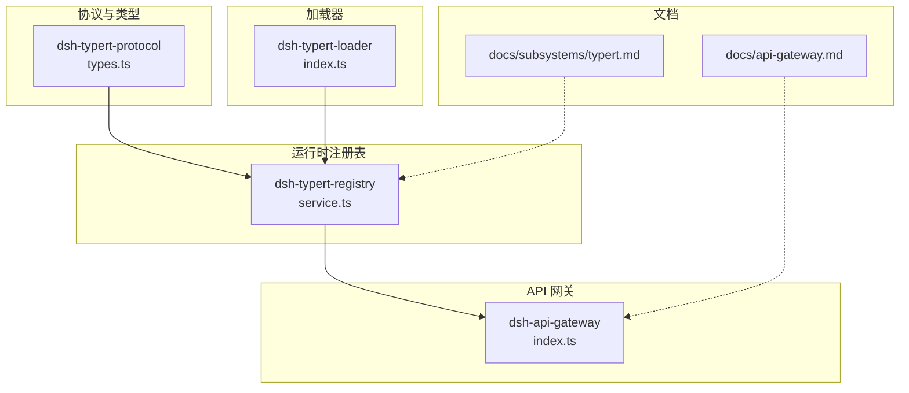
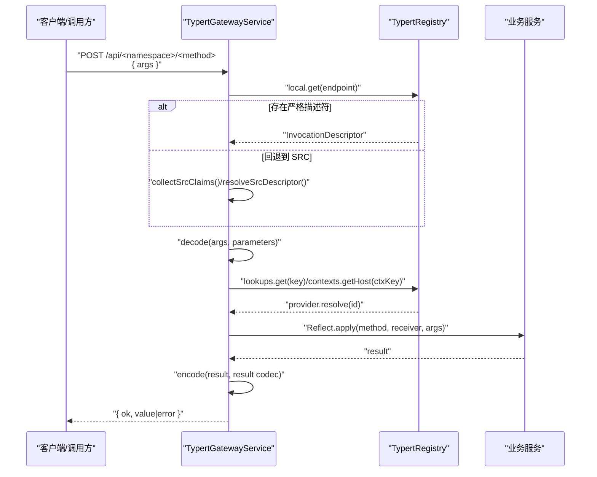
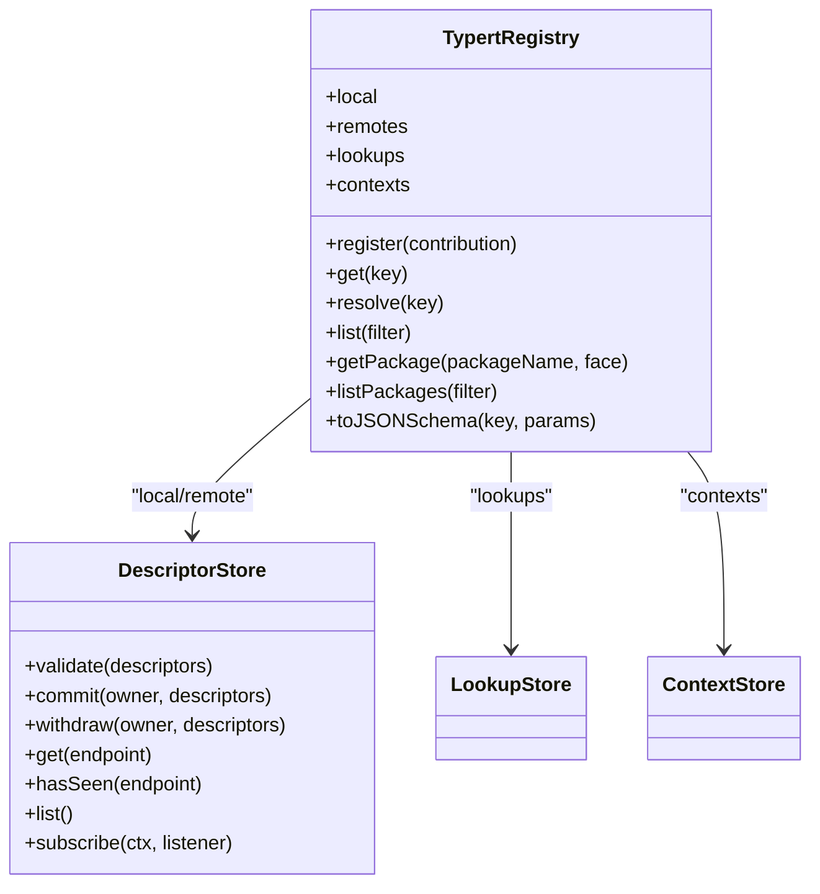
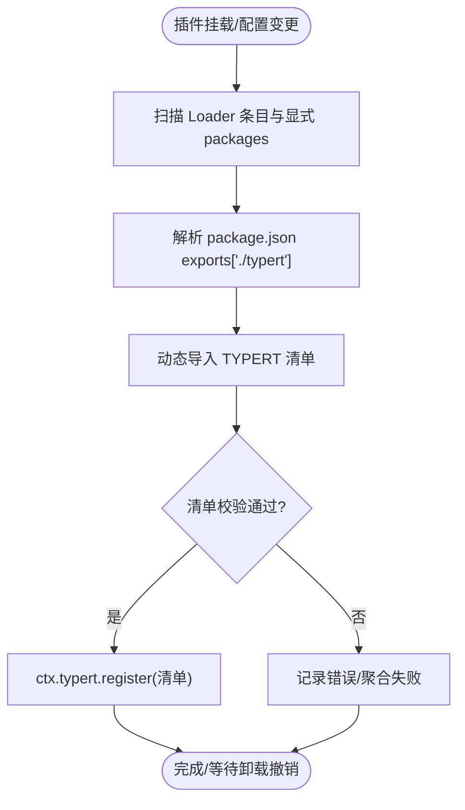
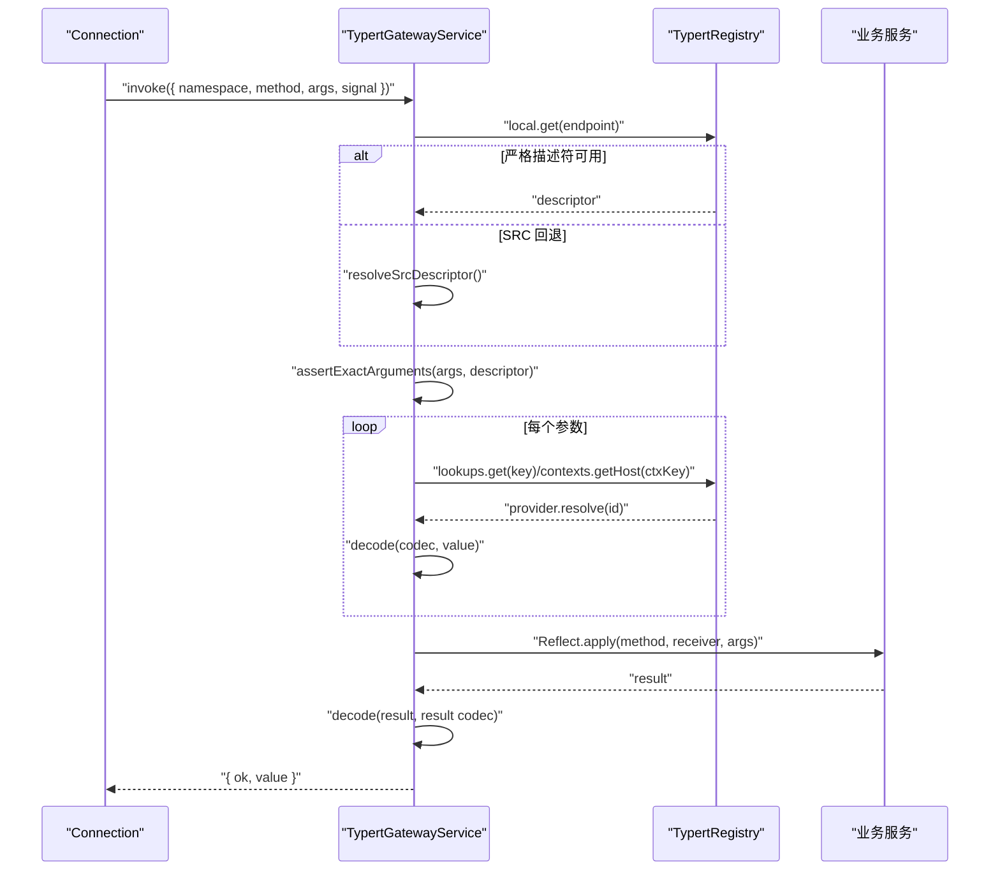
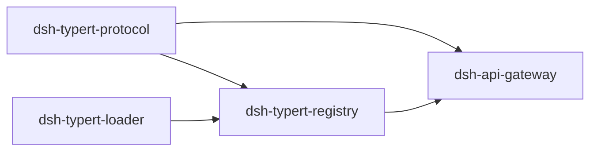

# 类型注册表

<cite>
**本文引用的文件**
- [packages/typert/registry/src/index.ts](file://packages/typert/registry/src/index.ts)
- [packages/typert/registry/src/service.ts](file://packages/typert/registry/src/service.ts)
- [packages/typert/loader/src/index.ts](file://packages/typert/loader/src/index.ts)
- [packages/api/gateway/src/index.ts](file://packages/api/gateway/src/index.ts)
- [packages/typert/protocol/src/types.ts](file://packages/typert/protocol/src/types.ts)
- [docs/subsystems/typert.md](file://docs/subsystems/typert.md)
- [docs/api-gateway.md](file://docs/api-gateway.md)
</cite>

## 目录
1. [简介](#简介)
2. [项目结构](#项目结构)
3. [核心组件](#核心组件)
4. [架构总览](#架构总览)
5. [详细组件分析](#详细组件分析)
6. [依赖关系分析](#依赖关系分析)
7. [性能考虑](#性能考虑)
8. [故障排查指南](#故障排查指南)
9. [结论](#结论)
10. [附录](#附录)

## 简介
本文件系统化说明 DeepSeek Harness 的类型注册表与运行时类型系统。其核心目标是：
- 提供运行时类型检查与 API 契约保证，确保跨进程、跨插件的远程调用在边界处进行严格校验。
- 通过 ctx.typert 服务集中管理 Zod 模式的动态注册、反射元数据收集与类型安全的 API 调用。
- 明确类型注册表与 API 网关、Typert 加载器的协作关系，支撑插件生态的跨进程类型安全通信与版本兼容性管理。
- 给出自定义类型注册与客户端代码生成的实践示例、性能与缓存策略，以及类型定义最佳实践与迁移指南。

## 项目结构
围绕类型系统的仓库关键位置如下：
- 协议与类型定义：packages/typert/protocol/src/types.ts
- 运行时注册表：packages/typert/registry/src/service.ts（导出 TypertRegistry）
- 加载器自动注册：packages/typert/loader/src/index.ts（扫描并注册 TYPERT 清单）
- API 网关调度：packages/api/gateway/src/index.ts（TypertGatewayService）
- 子系统文档：docs/subsystems/typert.md、docs/api-gateway.md

**图表来源**
- [packages/typert/protocol/src/types.ts:1-200](file://packages/typert/protocol/src/types.ts#L1-L200)
- [packages/typert/registry/src/service.ts:446-590](file://packages/typert/registry/src/service.ts#L446-L590)
- [packages/typert/loader/src/index.ts:284-437](file://packages/typert/loader/src/index.ts#L284-L437)
- [packages/api/gateway/src/index.ts:90-184](file://packages/api/gateway/src/index.ts#L90-L184)
- [docs/subsystems/typert.md:255-313](file://docs/subsystems/typert.md#L255-L313)
- [docs/api-gateway.md:115-121](file://docs/api-gateway.md#L115-L121)

**章节来源**
- [packages/typert/protocol/src/types.ts:1-200](file://packages/typert/protocol/src/types.ts#L1-L200)
- [packages/typert/registry/src/service.ts:446-590](file://packages/typert/registry/src/service.ts#L446-L590)
- [packages/typert/loader/src/index.ts:284-437](file://packages/typert/loader/src/index.ts#L284-L437)
- [packages/api/gateway/src/index.ts:90-184](file://packages/api/gateway/src/index.ts#L90-L184)
- [docs/subsystems/typert.md:255-313](file://docs/subsystems/typert.md#L255-L313)
- [docs/api-gateway.md:115-121](file://docs/api-gateway.md#L115-L121)

## 核心组件
- 协议层（dsh-typert-protocol）
  - 定义 InvocationDescriptor、InvocationParameterDescriptor、TypertCodec、RemoteResult、Lookup/Context 声明等跨进程共享类型。
  - 约束 strict codec 携带 schema，src-json codec 仅做 JSON 安全校验。
- 运行时注册表（dsh-typert-registry）
  - TypertRegistry 维护 schemas、packages、local/remote descriptors、lookup providers、context providers。
  - 提供 register/get/resolve/list/getPackage/listPackages/toJSONSchema 等能力；支持变更监听与 effect 生命周期。
- 加载器（dsh-typert-loader）
  - 扫描 Loader 条目与显式 packages，解析 package.json exports["./typert"]，导入并验证 TYPERT 清单后原子注册到 ctx.typert。
  - 增量脏集刷新、去重、失败隔离与日志上报。
- API 网关（dsh-api-gateway）
  - TypertGatewayService 拦截 /api 路由，解析 endpoint，查找严格或 SRC 描述符，解码参数、解析 lookup/context、调用业务方法并编码结果。
  - 统一错误分类 TypertGatewayError，保持 RPC 错误语义。

**章节来源**
- [packages/typert/protocol/src/types.ts:1-200](file://packages/typert/protocol/src/types.ts#L1-L200)
- [packages/typert/registry/src/service.ts:446-590](file://packages/typert/registry/src/service.ts#L446-L590)
- [packages/typert/loader/src/index.ts:83-142](file://packages/typert/loader/src/index.ts#L83-L142)
- [packages/api/gateway/src/index.ts:90-184](file://packages/api/gateway/src/index.ts#L90-L184)

## 架构总览
类型系统在运行时的职责边界清晰：
- 构建期：生成器产出 TYPERT 清单（包含 schemas、model、invocations）。
- 启动期：加载器发现并验证清单，原子注册到 ctx.typert。
- 运行期：API 网关根据 endpoint 选择严格或 SRC 描述符，执行参数解码、上下文/查找解析、业务调用与结果编码。

**图表来源**
- [packages/api/gateway/src/index.ts:145-184](file://packages/api/gateway/src/index.ts#L145-L184)
- [packages/api/gateway/src/index.ts:224-357](file://packages/api/gateway/src/index.ts#L224-L357)
- [packages/typert/registry/src/service.ts:466-490](file://packages/typert/registry/src/service.ts#L466-L490)

## 详细组件分析

### TypertRegistry（运行时类型注册表）
- 职责
  - 存储与查询 Zod schema 记录、包级反射模型、本地/远程调用描述符、Lookup/Context 提供者。
  - 提供原子注册贡献（schemas + invocations + package model），并在 effect 卸载时撤销。
  - 暴露 toJSONSchema 将运行时 schema 投影为 JSON Schema。
- 关键行为
  - 重复键检测：package-face、schema key、endpoint、invocation id 均唯一。
  - 变更通知：DescriptorStore/ContextStore/LookupStore 内部维护变更源，订阅者异常被捕获并上报。
  - 过滤枚举：list/filter 支持按包名与 face 筛选。

**图表来源**
- [packages/typert/registry/src/service.ts:107-180](file://packages/typert/registry/src/service.ts#L107-L180)
- [packages/typert/registry/src/service.ts:446-590](file://packages/typert/registry/src/service.ts#L446-L590)

**章节来源**
- [packages/typert/registry/src/service.ts:107-180](file://packages/typert/registry/src/service.ts#L107-L180)
- [packages/typert/registry/src/service.ts:446-590](file://packages/typert/registry/src/service.ts#L446-L590)

### TypertLoader（自动加载与注册）
- 职责
  - 基于 Loader 条目与显式 packages 配置，解析 package.json exports["./typert"]，导入模块并验证 TYPERT 清单。
  - 将有效清单原子注册到 ctx.typert.register，并在条目卸载时撤销。
- 关键行为
  - 增量脏集：internal/plugin 事件触发微任务批量处理，避免频繁 I/O。
  - 并发与幂等：pending 集合防止重复处理；manifests 缓存已导入清单。
  - 健壮性：单个包失败不影响其他包；激活阶段聚合失败抛出 AggregateError。

**图表来源**
- [packages/typert/loader/src/index.ts:284-437](file://packages/typert/loader/src/index.ts#L284-L437)
- [packages/typert/loader/src/index.ts:83-142](file://packages/typert/loader/src/index.ts#L83-L142)

**章节来源**
- [packages/typert/loader/src/index.ts:83-142](file://packages/typert/loader/src/index.ts#L83-L142)
- [packages/typert/loader/src/index.ts:284-437](file://packages/typert/loader/src/index.ts#L284-L437)

### TypertGatewayService（API 网关调度）
- 职责
  - 拦截 /api 路由，解析 endpoint，优先使用严格描述符，否则回退到 SRC 推导。
  - 解码参数、解析 Lookup/Context、调用业务方法、编码结果，统一错误分类。
- 关键行为
  - 参数校验：精确匹配 wire 字段，允许缺失字段仅在特定条件下。
  - 上下文/查找：通过 ctx.typert.contexts/lookups 获取 provider 并 resolve。
  - 取消传播：signal 注入到最后一个参数，业务异常与取消区分处理。

**图表来源**
- [packages/api/gateway/src/index.ts:145-184](file://packages/api/gateway/src/index.ts#L145-L184)
- [packages/api/gateway/src/index.ts:224-357](file://packages/api/gateway/src/index.ts#L224-L357)
- [packages/api/gateway/src/index.ts:407-468](file://packages/api/gateway/src/index.ts#L407-L468)

**章节来源**
- [packages/api/gateway/src/index.ts:90-184](file://packages/api/gateway/src/index.ts#L90-L184)
- [packages/api/gateway/src/index.ts:224-357](file://packages/api/gateway/src/index.ts#L224-L357)
- [packages/api/gateway/src/index.ts:407-468](file://packages/api/gateway/src/index.ts#L407-L468)

### 协议与类型契约
- InvocationDescriptor/Parameter/Codec：描述端点、参数顺序、wire 字段、source(json/lookup)、codec(strict/src-json)、cancellation、scope。
- RemoteResult：客户端侧统一成功/失败包装。
- Lookup/Context 声明：通过声明合并扩展空 map，运行时由 providers 提供解析逻辑。

**章节来源**
- [packages/typert/protocol/src/types.ts:1-200](file://packages/typert/protocol/src/types.ts#L1-L200)
- [docs/subsystems/typert.md:7-115](file://docs/subsystems/typert.md#L7-L115)

## 依赖关系分析
- dsh-typert-protocol 被 registry、loader、gateway、client 共同依赖，作为稳定契约层。
- dsh-typert-registry 依赖 protocol 与 Cordis Context/Service，实现运行时状态与生命周期。
- dsh-typert-loader 依赖 loader 服务与 registry，负责清单发现与注册。
- dsh-api-gateway 依赖 protocol 与 registry，实现请求分发与边界校验。

**图表来源**
- [packages/typert/protocol/src/types.ts:1-200](file://packages/typert/protocol/src/types.ts#L1-L200)
- [packages/typert/registry/src/service.ts:446-590](file://packages/typert/registry/src/service.ts#L446-L590)
- [packages/typert/loader/src/index.ts:284-437](file://packages/typert/loader/src/index.ts#L284-L437)
- [packages/api/gateway/src/index.ts:90-184](file://packages/api/gateway/src/index.ts#L90-L184)

**章节来源**
- [packages/typert/protocol/src/types.ts:1-200](file://packages/typert/protocol/src/types.ts#L1-L200)
- [packages/typert/registry/src/service.ts:446-590](file://packages/typert/registry/src/service.ts#L446-L590)
- [packages/typert/loader/src/index.ts:284-437](file://packages/typert/loader/src/index.ts#L284-L437)
- [packages/api/gateway/src/index.ts:90-184](file://packages/api/gateway/src/index.ts#L90-L184)

## 性能考虑
- 清单导入缓存：加载器对每个包的 manifest 仅导入一次，避免重复 I/O。
- 增量刷新：通过 internal/plugin 事件与微任务批量处理，减少高频回调开销。
- 注册表访问：schemas/packages/local descriptors 使用 Map 存储，O(1) 查找；list/filter 按需遍历。
- JSON Schema 投影：toJSONSchema 不缓存结果，避免内存膨胀；如需高频使用可在上层自行缓存。
- 网关解码：strict codec 走 schema.parse，src-json 仅做 JSON 安全校验，降低复杂对象序列化成本。

[本节为通用性能建议，无需具体文件引用]

## 故障排查指南
- 清单校验失败
  - 现象：加载器抛出错误，指出非 Zod v4 schema、缺少必填字段、invocation 参数重复等。
  - 定位：查看 validateTypertManifest 的错误信息，确认 TYPERT 清单结构与 schema 实例。
- 重复注册
  - 现象：endpoint、invocation id、package-face 重复导致注册失败。
  - 定位：检查同一 fiber 内多次 register 或不同包冲突。
- 网关调用失败
  - 现象：arguments-invalid、input-invalid、result-invalid、lookup-unavailable、context-unavailable 等。
  - 定位：核对 args 字段与 descriptor 的 wire 映射；确认 lookup/context provider 是否已注册且匹配。
- 取消与异常
  - 现象：RemoteInvocationCancelled 或业务异常。
  - 定位：检查 signal 注入与业务方法是否正确处理取消。

**章节来源**
- [packages/typert/loader/src/index.ts:83-142](file://packages/typert/loader/src/index.ts#L83-L142)
- [packages/typert/loader/src/index.ts:392-437](file://packages/typert/loader/src/index.ts#L392-L437)
- [packages/api/gateway/src/index.ts:145-184](file://packages/api/gateway/src/index.ts#L145-L184)
- [packages/api/gateway/src/index.ts:471-489](file://packages/api/gateway/src/index.ts#L471-L489)

## 结论
DeepSeek Harness 的类型注册表以协议为中心，通过加载器自动发现与注册、注册表集中管理与生命周期控制、网关严格/宽松双模式调度，实现了跨进程、跨插件的类型安全通信与 API 契约保证。配合变更监听、错误分类与性能优化，形成可演进、可观测、可扩展的类型基础设施。

[本节为总结性内容，无需具体文件引用]

## 附录

### 如何注册自定义类型与生成类型安全客户端
- 在服务提供方生成 TYPERT 清单（schemas、model.services/events/objects、invocations），并确保 schema 为 Zod v4 实例。
- 在插件入口导出 ./typert，供加载器发现；或在配置中显式声明 packages。
- 在消费方通过 ctx.remote.$mount 挂载远程贡献，获得类型安全的命名空间与方法。
- 若需手动注册，可直接调用 ctx.typert.register 提交贡献。

参考路径
- 清单结构与校验：[packages/typert/loader/src/index.ts:83-142](file://packages/typert/loader/src/index.ts#L83-L142)
- 注册接口与生命周期：[packages/typert/registry/src/service.ts:492-520](file://packages/typert/registry/src/service.ts#L492-L520)
- 客户端挂载与事件转发：[docs/subsystems/typert.md:191-226](file://docs/subsystems/typert.md#L191-L226)

**章节来源**
- [packages/typert/loader/src/index.ts:83-142](file://packages/typert/loader/src/index.ts#L83-L142)
- [packages/typert/registry/src/service.ts:492-520](file://packages/typert/registry/src/service.ts#L492-L520)
- [docs/subsystems/typert.md:191-226](file://docs/subsystems/typert.md#L191-L226)

### 类型系统与插件生态
- 跨进程通信：通过 InvocationDescriptor 与 strict codec 在边界处进行强校验，src-json 提供兼容模式。
- 版本兼容：Lookup/Context 的 wire 声明保留于注册表，即使 provider 卸载，SRC 发现仍可识别并报错，避免隐式降级。
- 插件生命周期：所有注册均为 Cordis effect，卸载时自动撤销，保证多插件共存稳定性。

**章节来源**
- [docs/subsystems/typert.md:7-115](file://docs/subsystems/typert.md#L7-L115)
- [packages/typert/registry/src/service.ts:107-180](file://packages/typert/registry/src/service.ts#L107-L180)

### 最佳实践与迁移指南
- 类型定义
  - 使用 strict codec 承载业务类型，确保 schema 与 TypeScript 类型一致。
  - 为复杂对象定义唯一 Lookup，避免隐式对象透传。
  - 明确 scope 与 context 的 wire 字段，避免冲突。
- 迁移建议
  - 从 src-json 迁移至 strict：逐步引入 schema，先覆盖关键路径，再全量切换。
  - 调整参数签名：确保方法参数为简单标识符，无解构/默认值/rest，便于 SRC 解析。
  - 清理废弃 endpoint：移除旧描述符，避免歧义。

**章节来源**
- [docs/api-gateway.md:115-121](file://docs/api-gateway.md#L115-L121)
- [packages/api/gateway/src/index.ts:542-584](file://packages/api/gateway/src/index.ts#L542-L584)