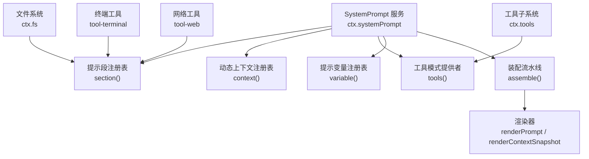
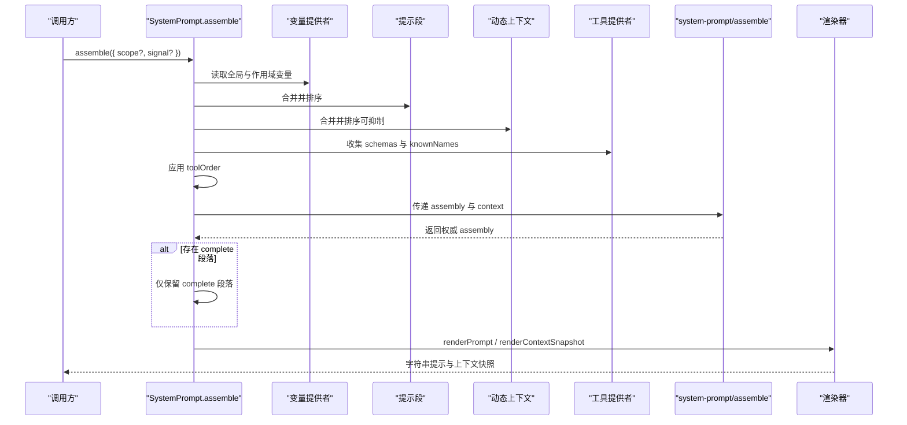
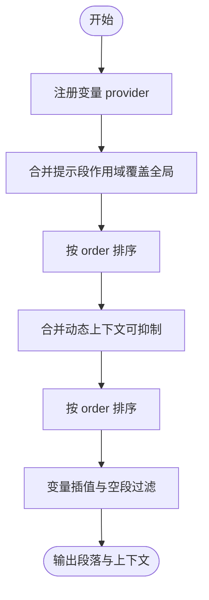
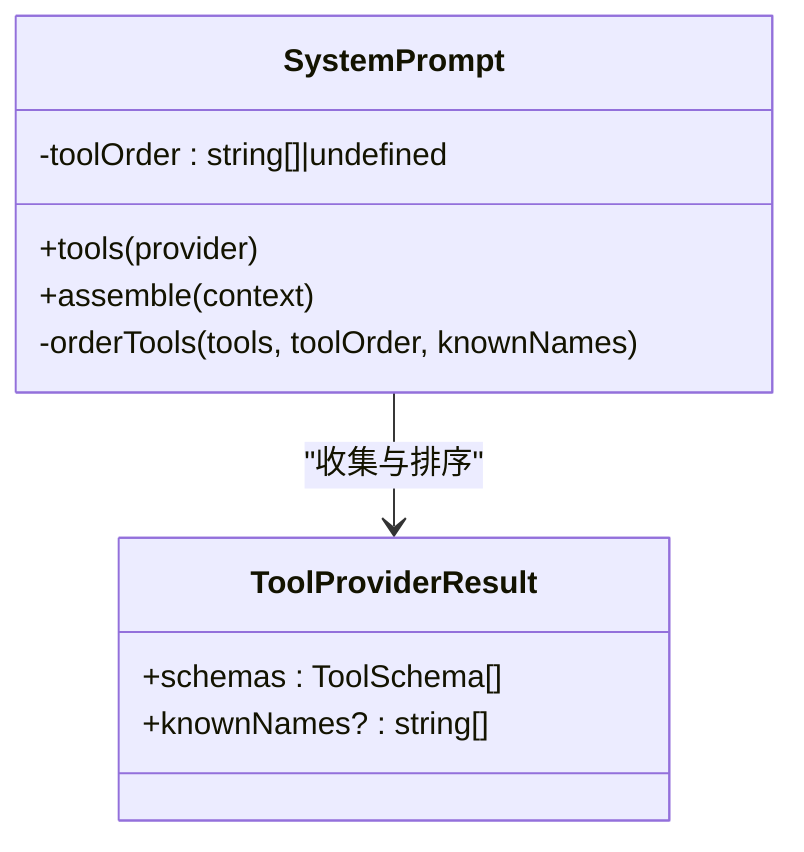
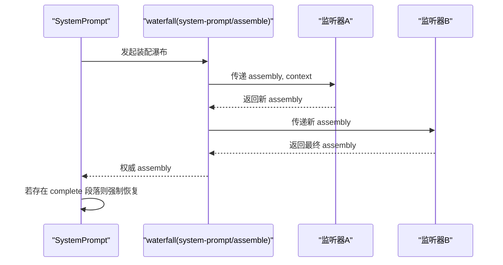
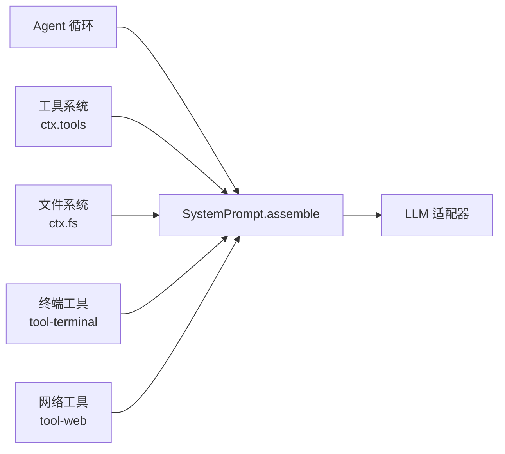
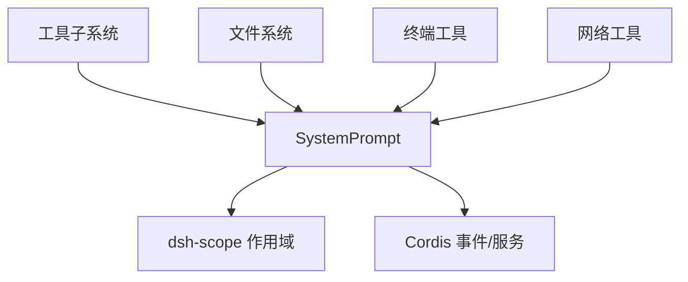

# 系统提示组装

<cite>
**本文引用的文件**
- [packages/core/system-prompt/src/index.ts](file://packages/core/system-prompt/src/index.ts)
- [packages/core/system-prompt/README.md](file://packages/core/system-prompt/README.md)
- [docs/subsystems/system-prompt.md](file://docs/subsystems/system-prompt.md)
- [packages/core/system-prompt/tests/system-prompt.spec.ts](file://packages/core/system-prompt/tests/system-prompt.spec.ts)
- [packages/terminal/tool-terminal/src/index.ts](file://packages/terminal/tool-terminal/src/index.ts)
- [packages/fs/fs/src/index.ts](file://packages/fs/fs/src/index.ts)
- [scripts/gen-tool-catalog.ts](file://scripts/gen-tool-catalog.ts)
- [docs/capability-seams.zh.md](file://docs/capability-seams.zh.md)
</cite>

## 目录
1. [简介](#简介)
2. [项目结构](#项目结构)
3. [核心组件](#核心组件)
4. [架构总览](#架构总览)
5. [详细组件分析](#详细组件分析)
6. [依赖关系分析](#依赖关系分析)
7. [性能与缓存](#性能与缓存)
8. [故障排查指南](#故障排查指南)
9. [结论](#结论)
10. [附录：扩展与最佳实践](#附录：扩展与最佳实践)

## 简介
本文件面向 DeepSeek Harness 的“系统提示组装”能力，解释其核心职责、数据流与协作方式。系统提示为 LLM 提供上下文信息与行为指导，由服务 ctx.systemPrompt 负责收集、合并并渲染各来源的提示段、动态上下文、工具模式与变量，并在每次模型调用前完成一次装配。该机制将工具系统、文件系统、终端、网络等能力的“可见性”和“使用指导”统一纳入模型可理解的输入中，同时支持按作用域（scope）覆盖、按请求信号中止、以及通过瀑布事件进行专家级干预。

## 项目结构
- 核心实现位于 packages/core/system-prompt，提供注册表与服务 SystemPrompt，以及渲染函数 renderPrompt/renderContextSnapshot。
- 文档在 docs/subsystems/system-prompt.md 描述跨包类型与 Cordis API 契约。
- 测试用例在 packages/core/system-prompt/tests 验证顺序、作用域、变量插值、工具排序、运行时上下文抑制等行为。
- 工具子系统通过 ctx.systemPrompt.section 注入工具使用指导，并通过 ctx.tools.register 暴露工具；工具模式最终汇聚到 system-prompt 的工具集合中。
- 文件系统、终端、网络等能力以“能力接缝”形式接入，既贡献工具模式，也贡献提示段或动态上下文。

图表来源
- [packages/core/system-prompt/src/index.ts:338-542](file://packages/core/system-prompt/src/index.ts#L338-L542)
- [packages/terminal/tool-terminal/src/index.ts:156-160](file://packages/terminal/tool-terminal/src/index.ts#L156-L160)
- [docs/capability-seams.zh.md:76-86](file://docs/capability-seams.zh.md#L76-L86)

章节来源
- [packages/core/system-prompt/src/index.ts:338-542](file://packages/core/system-prompt/src/index.ts#L338-L542)
- [docs/subsystems/system-prompt.md:9-208](file://docs/subsystems/system-prompt.md#L9-L208)

## 核心组件
- SystemPrompt 服务：维护全局与作用域两层注册表，负责收集提示段、动态上下文、工具模式和变量，执行装配与渲染。
- PromptSection/PromptContext：有序提示段与动态上下文，支持静态文本或基于 AssembleContext 的动态计算。
- ToolProviderResult：工具提供者返回当前装配可见的工具模式集合及已知名称全集，用于 toolOrder 校验与排序。
- PromptAssembly：一次装配结果，包含已解析但未插值的段落、动态上下文、工具模式与变量。
- 渲染器：renderPrompt 对段落进行严格变量插值并拼接；renderContextSnapshot 生成用户角色快照。

关键要点
- 顺序约定：harness 身份 -100，部署人格 0，工具指导 100–199。
- 完整段落 complete：若存在一个有效 complete 段落，则最终仅保留该段落作为系统提示主体。
- 变量插值：{{name}} 严格匹配已注册变量名，未知或未赋值会抛出错误。
- 工具排序：支持显式 toolOrder 与 <unlisted-tools> 占位符，未列出工具按字典序插入。

章节来源
- [packages/core/system-prompt/src/index.ts:52-120](file://packages/core/system-prompt/src/index.ts#L52-L120)
- [packages/core/system-prompt/src/index.ts:146-183](file://packages/core/system-prompt/src/index.ts#L146-L183)
- [packages/core/system-prompt/src/index.ts:212-295](file://packages/core/system-prompt/src/index.ts#L212-L295)
- [packages/core/system-prompt/src/index.ts:338-542](file://packages/core/system-prompt/src/index.ts#L338-L542)
- [packages/core/system-prompt/README.md:7-47](file://packages/core/system-prompt/README.md#L7-L47)

## 架构总览
系统提示装配流程如下：
1. 收集变量：先全局后作用域链，后者覆盖前者。
2. 合并提示段与上下文：同名作用域覆盖全局，按 order 排序。
3. 收集工具模式：遍历全局与作用域的 tools 提供者，剥离参数对象，记录 knownNames。
4. 应用 toolOrder：校验配置中的工具名是否在 knownNames 内，并按规则重排。
5. 运行瀑布事件 system-prompt/assemble：允许专家级修改 assembly。
6. 完整段落约束：若存在 complete 段落，则最终仅保留它作为系统提示主体。
7. 渲染：renderPrompt 对段落做变量插值并拼接；renderContextSnapshot 生成运行时上下文快照。

图表来源
- [packages/core/system-prompt/src/index.ts:467-542](file://packages/core/system-prompt/src/index.ts#L467-L542)
- [packages/core/system-prompt/src/index.ts:212-295](file://packages/core/system-prompt/src/index.ts#L212-L295)

章节来源
- [packages/core/system-prompt/src/index.ts:467-542](file://packages/core/system-prompt/src/index.ts#L467-L542)
- [docs/subsystems/system-prompt.md:9-208](file://docs/subsystems/system-prompt.md#L9-L208)

## 详细组件分析

### 提示段与动态上下文
- 提示段 section：每个插件贡献一段或多段，order 决定拼接顺序；text 可为函数，接收 AssembleContext。
- 动态上下文 context：用于生成“当前运行时上下文”快照，可在模型历史中以用户角色呈现；可通过 suppressRuntimeContext 抑制。
- 变量 variable：提供 {{name}} 插值源，命名需符合正则，重复或非法会抛错；provider 可返回 undefined 表示本次装配无值。

图表来源
- [packages/core/system-prompt/src/index.ts:381-455](file://packages/core/system-prompt/src/index.ts#L381-L455)
- [packages/core/system-prompt/src/index.ts:212-295](file://packages/core/system-prompt/src/index.ts#L212-L295)

章节来源
- [packages/core/system-prompt/src/index.ts:381-455](file://packages/core/system-prompt/src/index.ts#L381-L455)
- [packages/core/system-prompt/src/index.ts:212-295](file://packages/core/system-prompt/src/index.ts#L212-L295)
- [packages/core/system-prompt/tests/system-prompt.spec.ts:80-101](file://packages/core/system-prompt/tests/system-prompt.spec.ts#L80-L101)

### 工具模式与 toolOrder
- 工具提供者 tools：返回 schemas 与可选 knownNames；schemas 会被结构化克隆，避免外部引用泄漏。
- toolOrder：显式指定工具顺序，必须包含 <unlisted-tools> 占位符；未列出的工具按字典序插入；未知名称会报错。
- 工具与提示段分离：工具限制不影响独立注册的提示段，二者是独立的装配输入。

图表来源
- [packages/core/system-prompt/src/index.ts:103-120](file://packages/core/system-prompt/src/index.ts#L103-L120)
- [packages/core/system-prompt/src/index.ts:146-183](file://packages/core/system-prompt/src/index.ts#L146-L183)
- [packages/core/system-prompt/src/index.ts:487-529](file://packages/core/system-prompt/src/index.ts#L487-L529)

章节来源
- [packages/core/system-prompt/src/index.ts:146-183](file://packages/core/system-prompt/src/index.ts#L146-L183)
- [packages/core/system-prompt/src/index.ts:487-529](file://packages/core/system-prompt/src/index.ts#L487-L529)
- [packages/core/system-prompt/README.md:11-14](file://packages/core/system-prompt/README.md#L11-L14)

### 瀑布事件 system-prompt/assemble
- 作用域过滤：仅对应 scope 的监听器参与；返回值为权威结果。
- 完整段落保护：即使被替换，若存在 complete 段落，最终仍恢复为该段落作为唯一系统提示主体。
- 信号控制：传入的 AbortSignal 仅控制本次装配请求，不应被长期持有。

图表来源
- [packages/core/system-prompt/src/index.ts:532-542](file://packages/core/system-prompt/src/index.ts#L532-L542)
- [docs/subsystems/system-prompt.md:165-189](file://docs/subsystems/system-prompt.md#L165-L189)

章节来源
- [packages/core/system-prompt/src/index.ts:532-542](file://packages/core/system-prompt/src/index.ts#L532-L542)
- [docs/subsystems/system-prompt.md:165-189](file://docs/subsystems/system-prompt.md#L165-L189)

### 与 Agent 循环、工具系统、文件系统、终端、网络的协作
- Agent 循环：每轮调用前触发 assemble，将生成的系统提示与工具模式发送给 LLM；循环还负责日志与压缩策略。
- 工具系统：ToolRuntime 自动注册为工具提供者；工具模式经 system-prompt 收集与排序后进入模型输入。
- 文件系统：通过能力接缝 ctx.fs 暴露抽象接口；工具层 read/write/edit 等通过 system-prompt 注入使用指导。
- 终端：tool-terminal 注册 terminal_* 工具与最小使用指导，确保模型仅在必要时使用持久终端会话。
- 网络：web_search/web_fetch 等工具同样通过 system-prompt 注入使用指导，并受 toolOrder 与可见性控制。

图表来源
- [docs/capability-seams.zh.md:76-86](file://docs/capability-seams.zh.md#L76-L86)
- [packages/terminal/tool-terminal/src/index.ts:156-160](file://packages/terminal/tool-terminal/src/index.ts#L156-L160)
- [packages/fs/fs/src/index.ts:80-105](file://packages/fs/fs/src/index.ts#L80-L105)

章节来源
- [docs/capability-seams.zh.md:76-86](file://docs/capability-seams.zh.md#L76-L86)
- [packages/terminal/tool-terminal/src/index.ts:156-160](file://packages/terminal/tool-terminal/src/index.ts#L156-L160)
- [packages/fs/fs/src/index.ts:80-105](file://packages/fs/fs/src/index.ts#L80-L105)

## 依赖关系分析
- SystemPrompt 依赖 Cordis 框架的事件与生命周期管理，以及 dsh-scope 的作用域分层。
- 工具子系统通过 ctx.tools 暴露工具，而 system-prompt 通过 tools() 收集工具模式，形成“可见性—指导—执行”的闭环。
- 文件系统、终端、网络等能力以插件形式注册提示段与工具，遵循统一的装配协议。

图表来源
- [packages/core/system-prompt/src/index.ts:7-11](file://packages/core/system-prompt/src/index.ts#L7-L11)
- [docs/capability-seams.zh.md:76-86](file://docs/capability-seams.zh.md#L76-L86)

章节来源
- [packages/core/system-prompt/src/index.ts:7-11](file://packages/core/system-prompt/src/index.ts#L7-L11)
- [docs/capability-seams.zh.md:76-86](file://docs/capability-seams.zh.md#L76-L86)

## 性能与缓存
- KV 缓存友好：当 identity、persona、变量、段落内容与顺序保持不变时，前缀稳定有利于缓存复用；任何变化可能从首个变化的 token 起失效。
- 工具模式成本：工具模式在每次请求中重复发送；限制工具可减少 schema 成本；重排改变缓存形状但不一定改变语义内容。
- 运行时上下文抑制：includeRuntimeContext=false 或作用域抑制可避免评估上下文提供者，减少开销。
- 变量插值效率：段落与上下文在渲染阶段一次性插值，避免重复扫描；替换值不再二次扫描。

章节来源
- [packages/core/system-prompt/README.md:63-83](file://packages/core/system-prompt/README.md#L63-L83)
- [packages/core/system-prompt/src/index.ts:212-295](file://packages/core/system-prompt/src/index.ts#L212-L295)

## 故障排查指南
- 重复注册：同作用域内同名 section/context/variable 会抛错；跨作用域可通过 agent.ctx 覆盖。
- 非有限 order：section/context 的 order 必须为有限数字，否则抛错。
- 变量插值失败：未知变量名、未赋值变量、不完整 {{...}} 组都会抛错；请检查变量注册与值。
- toolOrder 配置错误：缺少 <unlisted-tools>、重复项、列出未注册工具名都会在装配时报错。
- 多个 complete 段落：同时存在多个 complete 段落会拒绝装配。
- 运行时上下文抑制：确认 includeRuntimeContext 与 suppressRuntimeContext 的使用范围与组合效果。

章节来源
- [packages/core/system-prompt/src/index.ts:381-455](file://packages/core/system-prompt/src/index.ts#L381-L455)
- [packages/core/system-prompt/src/index.ts:146-183](file://packages/core/system-prompt/src/index.ts#L146-L183)
- [packages/core/system-prompt/src/index.ts:505-542](file://packages/core/system-prompt/src/index.ts#L505-L542)
- [packages/core/system-prompt/tests/system-prompt.spec.ts:144-172](file://packages/core/system-prompt/tests/system-prompt.spec.ts#L144-L172)

## 结论
SystemPrompt 提供了可扩展、可作用域化、可干预的系统提示装配机制，将工具模式、动态上下文、变量与提示段统一组织为模型输入。通过严格的变量插值、工具排序与瀑布事件，既能保证确定性，又为高级定制留出空间。结合 Agent 循环与能力接缝，系统提示成为连接 LLM 与平台能力的桥梁。

## 附录：扩展与最佳实践
- 扩展提示内容
  - 新增提示段：使用 ctx.systemPrompt.section，合理设置 order 与 name，避免与内置冲突。
  - 新增动态上下文：使用 ctx.systemPrompt.context，按需返回当前状态或策略说明。
  - 新增变量：使用 ctx.systemPrompt.variable 提供 {{name}} 值，确保命名规范与值可用。
- 定制模型特定行为
  - 通过 toolOrder 精确控制工具可见性与顺序，提升模型选择工具的稳定性。
  - 使用 complete 段落接管系统提示主体，但需确保工具与上下文仍可解析。
  - 通过 system-prompt/assemble 瀑布事件进行专家级调整，注意不要破坏 Code Mode 或结构化输出协议。
- 示例路径
  - 终端工具提示段：[packages/terminal/tool-terminal/src/index.ts:156-160](file://packages/terminal/tool-terminal/src/index.ts#L156-L160)
  - 工具模式生成与目录：[scripts/gen-tool-catalog.ts:49-66](file://scripts/gen-tool-catalog.ts#L49-L66)
  - 文件系统能力接缝：[packages/fs/fs/src/index.ts:80-105](file://packages/fs/fs/src/index.ts#L80-L105)
- 最佳实践
  - 保持段落顺序稳定，避免频繁变更导致 KV 缓存失效。
  - 谨慎使用 complete 段落，确保与其他装配输入一致。
  - 合理使用作用域隔离，避免全局污染。
  - 在工具限制与提示段之间保持语义一致，避免误导模型。

章节来源
- [packages/core/system-prompt/README.md:16-47](file://packages/core/system-prompt/README.md#L16-L47)
- [packages/terminal/tool-terminal/src/index.ts:156-160](file://packages/terminal/tool-terminal/src/index.ts#L156-L160)
- [scripts/gen-tool-catalog.ts:49-66](file://scripts/gen-tool-catalog.ts#L49-L66)
- [packages/fs/fs/src/index.ts:80-105](file://packages/fs/fs/src/index.ts#L80-L105)