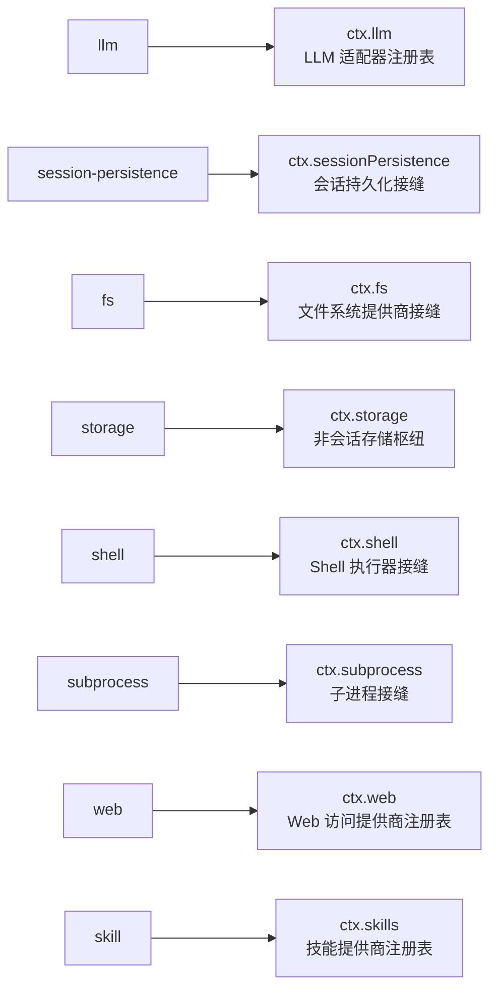
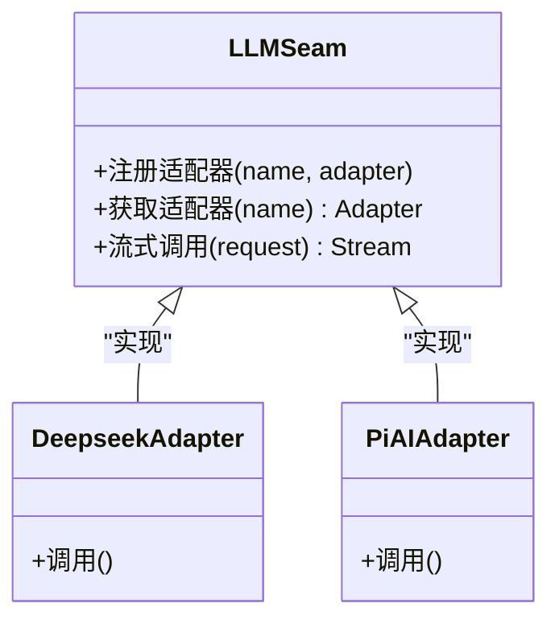
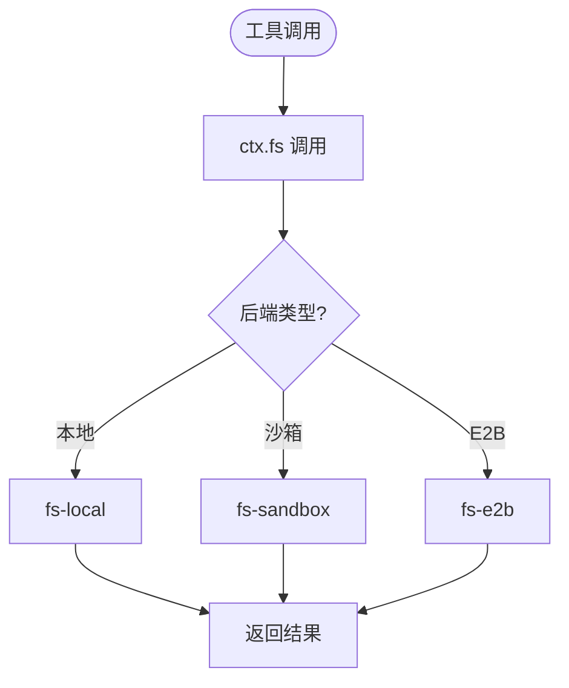
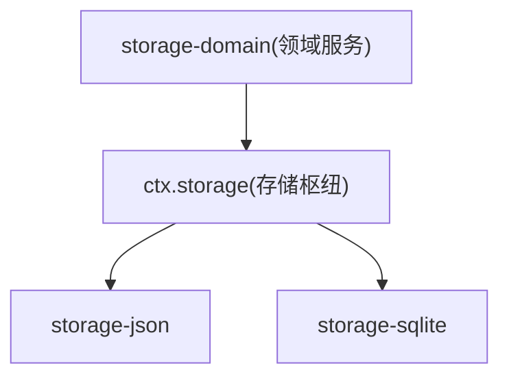
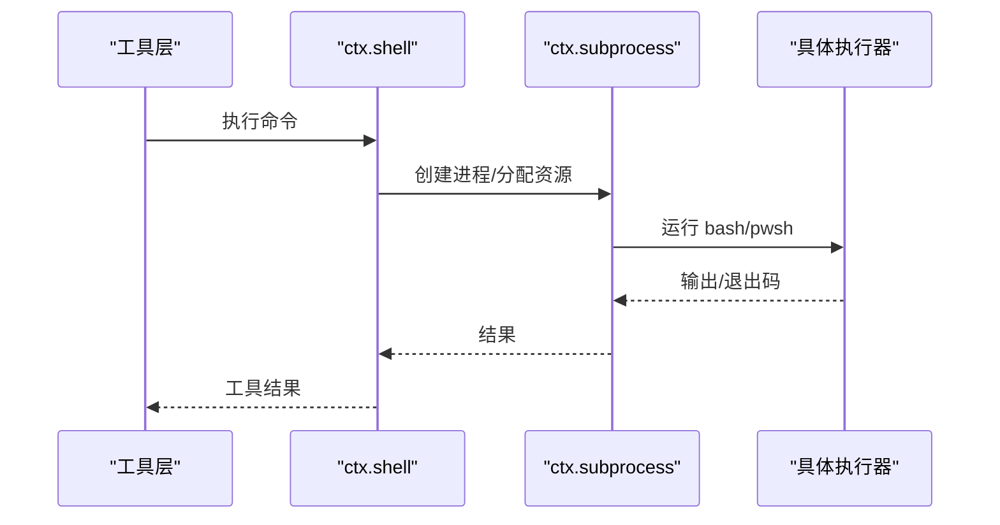
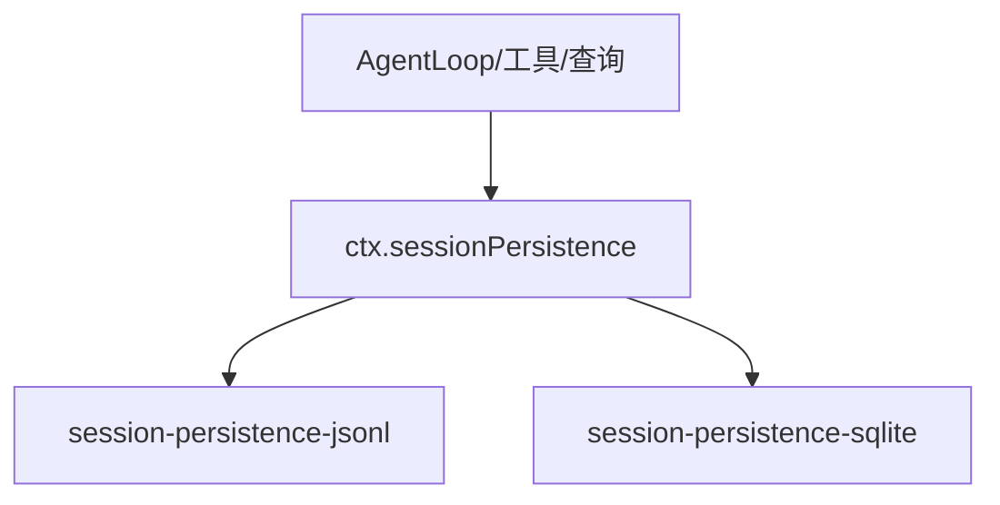
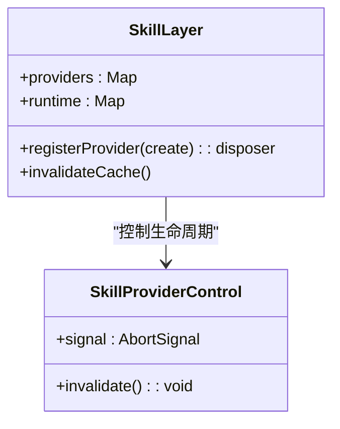
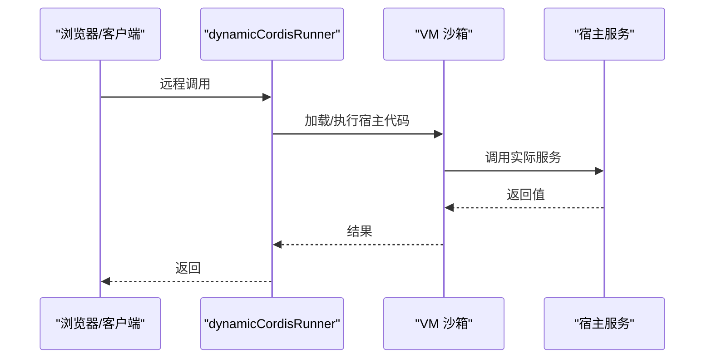
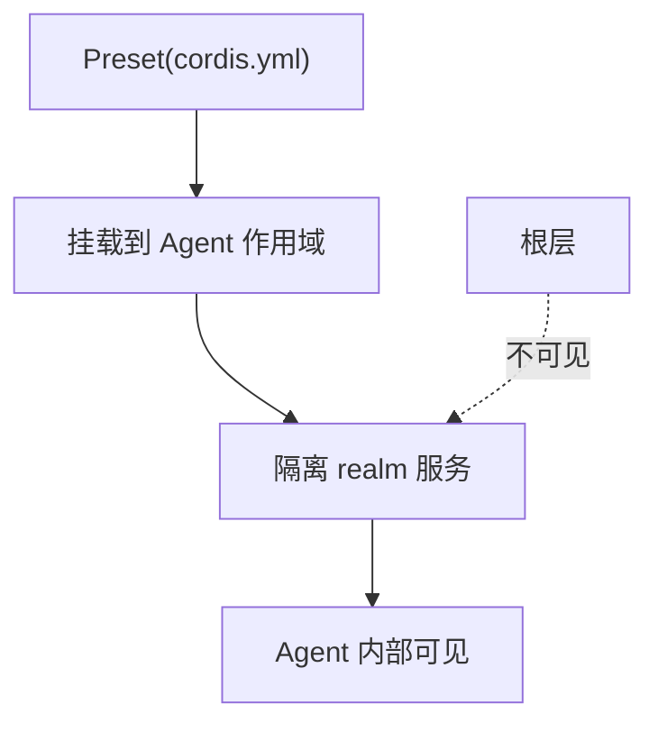
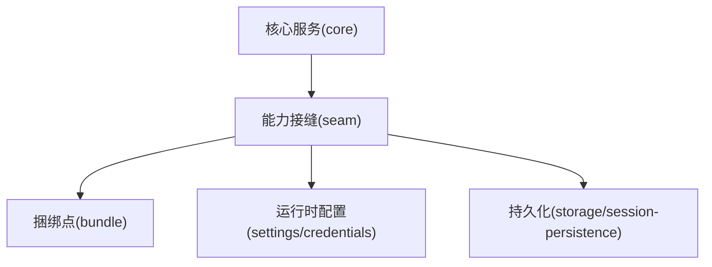

# 能力接缝

<cite>
**本文引用的文件**
- [docs/capability-seams.md](file://docs/capability-seams.md)
- [docs/capability-seams.zh.md](file://docs/capability-seams.zh.md)
- [docs/subsystems/core.md](file://docs/subsystems/core.md)
- [docs/cordis-primer.md](file://docs/cordis-primer.md)
- [packages/skill/skill/src/index.ts](file://packages/skill/skill/src/index.ts)
- [packages/extensions/cordis-host-runner/tests/composition.spec.ts](file://packages/extensions/cordis-host-runner/tests/composition.spec.ts)
- [packages/preset/agent-presets/tests/fixtures/plugins/global-service.js](file://packages/preset/agent-presets/tests/fixtures/plugins/global-service.js)
- [packages/preset/agent-presets/tests/mount.spec.ts](file://packages/preset/agent-presets/tests/mount.spec.ts)
</cite>

## 目录
1. [引言](#引言)
2. [项目结构](#项目结构)
3. [核心组件](#核心组件)
4. [架构总览](#架构总览)
5. [详细组件分析](#详细组件分析)
6. [依赖关系分析](#依赖关系分析)
7. [性能考量](#性能考量)
8. [故障排查指南](#故障排查指南)
9. [结论](#结论)
10. [附录](#附录)

## 引言
本文件系统化阐述 DeepSeek Harness 的“能力接缝”（Capability Seams）设计理念与实践：通过定义清晰的接口边界，将可替换的实现与稳定的消费方解耦，从而实现系统的可插拔性与可扩展性。文档覆盖三类角色——核心服务（core）、能力接缝（seam）、捆绑点/组合点（bundle），并重点解析 LLM 适配器、文件系统提供商、存储后端等关键接缝的职责与实现方式；同时说明如何通过运行时配置与动态替换完成能力装配，提供新增能力接缝与实现的开发指南，以及版本管理与向后兼容策略。

## 项目结构
DeepSeek Harness 以 Cordis 插件框架为基础，采用“服务即上下文键”的模式组织能力。每个能力由“服务定义 + 一个或多个提供者 + 消费者”构成，并通过 ctx.<key> 暴露稳定键名。下图展示了能力接缝的整体视图：包拥有服务声明、已知实现包，以及直接消费该服务的包。



图表来源
- [docs/capability-seams.md:10-196](file://docs/capability-seams.md#L10-L196)
- [docs/capability-seams.zh.md:10-196](file://docs/capability-seams.zh.md#L10-L196)

章节来源
- [docs/capability-seams.md:10-196](file://docs/capability-seams.md#L10-L196)
- [docs/capability-seams.zh.md:10-196](file://docs/capability-seams.zh.md#L10-L196)

## 核心组件
- 核心服务（core）：系统主干能力，通常不对外暴露为可替换实现，而是作为其他能力的基石。例如会话日志、工具注册表、系统提示组装、Agent 生命周期管理等。
- 能力接缝（seam）：可替换的能力边界，包含服务定义、提供者与消费者。典型如 LLM 适配器、文件系统提供商、存储后端、Shell 执行器等。
- 捆绑点/组合点（bundle）：具体驱动或装配点，如 agent-loop 作为默认循环驱动，将各能力装配成可运行的 Agent。

这些角色在 Cordis 上下文中通过 ctx 键进行发现与注入，依赖声明替代手工启动顺序，事件用于跨服务通信与拦截。

章节来源
- [docs/capability-seams.md:412-471](file://docs/capability-seams.md#L412-L471)
- [docs/capability-seams.zh.md:414-471](file://docs/capability-seams.zh.md#L414-L471)
- [docs/cordis-primer.md:7-14](file://docs/cordis-primer.md#L7-L14)

## 架构总览
下图展示从 Agent 创建到模型调用、工具执行与结果落盘的端到端流程，体现 core/seam/bundle 的协作关系。

```mermaid
sequenceDiagram
participant Host as "宿主/应用"
participant Loop as "AgentLoop(捆绑点)"
participant Agent as "Agent(核心服务)"
participant Session as "Session(核心服务)"
participant LLM as "LLM 接缝(ctx.llm)"
participant Tools as "工具注册表(核心服务)"
participant FS as "文件系统接缝(ctx.fs)"
participant Store as "存储后端(ctx.storage)"
Host->>Loop : 创建/恢复 Agent
Loop->>Agent : 初始化并进入驱动循环
Agent->>Session : 打开轮次/步骤
Agent->>LLM : 发送请求并流式接收响应
LLM-->>Agent : 流式内容块
Agent->>Tools : 调度工具调用
Tools->>FS : 读取/写入文件
FS-->>Tools : 结果
Tools-->>Agent : 工具结果
Agent->>Session : 追加会话事件
Agent->>Store : 持久化检查点
Session-->>Host : 事件/状态更新
```

图表来源
- [docs/subsystems/core.md:9-20](file://docs/subsystems/core.md#L9-L20)
- [docs/capability-seams.md:412-471](file://docs/capability-seams.md#L412-L471)

章节来源
- [docs/subsystems/core.md:9-20](file://docs/subsystems/core.md#L9-L20)
- [docs/capability-seams.md:412-471](file://docs/capability-seams.md#L412-L471)

## 详细组件分析

### LLM 适配器（ctx.llm）
- 职责：注册不同 LLM 提供方适配器；Agent 循环与压缩功能通过提供方无关的流式服务调用。
- 实现要点：适配器在启动时向 ctx.llm 注册；消费方仅依赖抽象键，不感知具体实现。
- 运行时替换：通过 settings 分层与 credentials 管理密钥与路由，可在组合阶段选择不同适配器。



图表来源
- [docs/capability-seams.md:412-417](file://docs/capability-seams.md#L412-L417)
- [docs/capability-seams.zh.md:414-417](file://docs/capability-seams.zh.md#L414-L417)

章节来源
- [docs/capability-seams.md:412-417](file://docs/capability-seams.md#L412-L417)
- [docs/capability-seams.zh.md:414-417](file://docs/capability-seams.zh.md#L414-L417)

### 文件系统提供商（ctx.fs）
- 职责：tool-fs 通过 ctx.fs 执行读/写/编辑；fs-sandbox 按共享沙箱模式限制变更；fs-observation-policy 通过 fs/* 事件门禁贡献观测状态检查。
- 实现要点：本地、沙箱、E2B 等多后端并列注册；工具层不关心底层介质。
- 运行时替换：通过部署配置选择 fs-local / fs-sandbox / fs-e2b。



图表来源
- [docs/capability-seams.md:456-458](file://docs/capability-seams.md#L456-L458)
- [docs/capability-seams.zh.md:458-460](file://docs/capability-seams.zh.md#L458-L460)

章节来源
- [docs/capability-seams.md:456-458](file://docs/capability-seams.md#L456-L458)
- [docs/capability-seams.zh.md:458-460](file://docs/capability-seams.zh.md#L458-L460)

### 存储后端（ctx.storage）
- 职责：非会话存储枢纽，支持 JSON/SQLite 等后端；数据形态（领域优先）挂载到枢纽上，将类型化操作转换为 KV 单元原语。
- 实现要点：多个后端以名称并列注册；storage-domain 等待所有后端就绪后发布领域服务。
- 运行时替换：通过组合配置选择后端，并在 domain 层统一使用。



图表来源
- [docs/capability-seams.md:426-429](file://docs/capability-seams.md#L426-L429)
- [docs/capability-seams.zh.md:428-431](file://docs/capability-seams.zh.md#L428-L431)

章节来源
- [docs/capability-seams.md:426-429](file://docs/capability-seams.md#L426-L429)
- [docs/capability-seams.zh.md:428-431](file://docs/capability-seams.zh.md#L428-L431)

### Shell 执行器（ctx.shell）
- 职责：面向模型的 shell 工具与钩子桥接消费此 seam；可替换为 bash-local、bash-sandbox、pwsh-local 等。
- 实现要点：执行器通过 ctx.subprocess 管理进程坐标与生命周期；工具层不感知具体实现。
- 运行时替换：根据部署策略选择本地或沙箱执行器。



图表来源
- [docs/capability-seams.md:447-450](file://docs/capability-seams.md#L447-L450)
- [docs/capability-seams.zh.md:449-452](file://docs/capability-seams.zh.md#L449-L452)

章节来源
- [docs/capability-seams.md:447-450](file://docs/capability-seams.md#L447-L450)
- [docs/capability-seams.zh.md:449-452](file://docs/capability-seams.zh.md#L449-L452)

### 会话持久化（ctx.sessionPersistence）
- 职责：持久化同一套 SessionEvent 词汇；应用在组合时选择后端（JSONL/SQLite）。
- 实现要点：消费方只依赖抽象键；后端负责具体存储格式与恢复逻辑。
- 运行时替换：通过组合配置切换后端。



图表来源
- [docs/capability-seams.md:422-424](file://docs/capability-seams.md#L422-L424)
- [docs/capability-seams.zh.md:424-426](file://docs/capability-seams.zh.md#L424-L426)

章节来源
- [docs/capability-seams.md:422-424](file://docs/capability-seams.md#L422-L424)
- [docs/capability-seams.zh.md:424-426](file://docs/capability-seams.zh.md#L424-L426)

### 技能提供商注册表（ctx.skills）
- 职责：合并提供方的技能目录；tool-skill 渲染会话前缀目录并加载完整正文。
- 实现要点：通过 registerProvider 同步注册，作用域内去重与保留顺序；失效时清理缓存。
- 运行时替换：多 provider 并存，按名称与层级决定优先级。



图表来源
- [packages/skill/skill/src/index.ts:310-429](file://packages/skill/skill/src/index.ts#L310-L429)

章节来源
- [packages/skill/skill/src/index.ts:310-429](file://packages/skill/skill/src/index.ts#L310-L429)

### 动态 Cordis 运行器（ctx.dynamicCordisRunner）
- 职责：内存定义注册表、Host 半的 VM 沙箱、request-run 往返流程；浏览器页面通过 Remote 命名空间在线访问。
- 实现要点：测试中验证 primitive/null 值透传与隔离 realm 行为。
- 运行时替换：通过 tool-cordis 与 host runner 组合启用。



图表来源
- [packages/extensions/cordis-host-runner/tests/composition.spec.ts:91-129](file://packages/extensions/cordis-host-runner/tests/composition.spec.ts#L91-L129)

章节来源
- [packages/extensions/cordis-host-runner/tests/composition.spec.ts:91-129](file://packages/extensions/cordis-host-runner/tests/composition.spec.ts#L91-L129)

### 预设与组合（ctx.agentPresets）
- 职责：发现 preset 目录并在创建期挂载到 agent 作用域；支持 re-compose 与 standing key 读取。
- 实现要点：隔离 realm 下服务不可被根层直接访问；同 realm 实例可跨 agent 共享。
- 运行时替换：通过 preset 组合文本与 overlay 选择能力集合。



图表来源
- [packages/preset/agent-presets/tests/mount.spec.ts:260-277](file://packages/preset/agent-presets/tests/mount.spec.ts#L260-L277)
- [packages/preset/agent-presets/tests/fixtures/plugins/global-service.js:1-5](file://packages/preset/agent-presets/tests/fixtures/plugins/global-service.js#L1-L5)

章节来源
- [packages/preset/agent-presets/tests/mount.spec.ts:260-277](file://packages/preset/agent-presets/tests/mount.spec.ts#L260-L277)
- [packages/preset/agent-presets/tests/fixtures/plugins/global-service.js:1-5](file://packages/preset/agent-presets/tests/fixtures/plugins/global-service.js#L1-L5)

## 依赖关系分析
- 耦合与内聚：核心服务高内聚（如 session、tools、system-prompt），能力接缝低耦合（通过 ctx 键解耦实现与消费方）。
- 直接/间接依赖：消费方仅依赖抽象键；实现通过注册机制加入系统。
- 外部集成：settings、credentials、storage 等提供运行时配置与持久化支撑。
- 接口契约：Cordis 事件与 inject 声明形成稳定契约，避免硬编码启动顺序。



图表来源
- [docs/capability-seams.md:412-471](file://docs/capability-seams.md#L412-L471)
- [docs/cordis-primer.md:7-14](file://docs/cordis-primer.md#L7-L14)

章节来源
- [docs/capability-seams.md:412-471](file://docs/capability-seams.md#L412-L471)
- [docs/cordis-primer.md:7-14](file://docs/cordis-primer.md#L7-L14)

## 性能考量
- 流式处理：LLM 流式响应减少首字节延迟，提升交互体验。
- 压缩与裁剪：compaction-basic 与 tool-result pruner 降低上下文大小，提高吞吐。
- 存储选择：JSONL/SQLite 后端按场景权衡读写性能与查询能力。
- 事件分发：Cordis 事件模式（emit/waterfall/parallel/serial）影响并发与顺序，需按语义选择。

[本节为通用指导，无需特定文件引用]

## 故障排查指南
- 事件与生命周期：确认 Cordis 事件的 dispatch 模式与监听器顺序；确保 effect 有 disposer，避免泄漏。
- 作用域与隔离：preset 隔离 realm 下的服务仅在 agent 作用域可见；跨层访问需通过正确 API。
- 凭据轮换：credentials 按操作解析，轮换后立即生效；检查 Web 网关是否提供脱敏视图与只写存储。
- 后端就绪：storage-domain 等待所有后端就绪；若某后端失败，领域服务不会发布。

章节来源
- [docs/cordis-primer.md:15-45](file://docs/cordis-primer.md#L15-L45)
- [docs/capability-seams.md:426-429](file://docs/capability-seams.md#L426-L429)
- [docs/capability-seams.md:424-427](file://docs/capability-seams.md#L424-L427)

## 结论
DeepSeek Harness 通过能力接缝将系统拆分为稳定核心与可替换能力，借助 Cordis 的上下文与服务发现机制，实现了高度的可插拔性与可扩展性。开发者可通过定义新的 ctx 键、注册提供者、并在组合阶段选择实现，灵活扩展系统能力。配合 settings/credentials/storage 等运行时配置与持久化能力，可实现动态替换与可靠运行。遵循版本管理与向后兼容策略，可确保演进过程中的稳定性。

[本节为总结，无需特定文件引用]

## 附录

### 开发指南：如何定义新的能力接缝与实现
- 定义服务键：在合适的子系统内声明 ctx.<key> 及其类型（服务定义）。
- 注册提供者：在提供者包中实现服务，并在启动时向 ctx 注册。
- 消费方接入：消费方通过 inject 声明依赖，使用 ctx.<key> 调用。
- 组合装配：通过 preset 或 overlay 选择具体实现。
- 测试验证：编写单元测试与集成测试，覆盖正常路径与异常路径。

章节来源
- [docs/cordis-primer.md:7-14](file://docs/cordis-primer.md#L7-L14)
- [docs/capability-seams.md:412-471](file://docs/capability-seams.md#L412-L471)

### 版本管理与向后兼容策略
- 保持抽象稳定：服务定义（ctx 键与类型）应保持稳定，避免破坏消费方。
- 渐进式演进：新增能力以新键或可选字段形式引入，旧路径继续工作。
- 废弃标记：对即将移除的能力提供弃用警告与迁移指引。
- 测试保障：契约测试覆盖关键路径，确保实现与消费方兼容性。

[本节为通用指导，无需特定文件引用]