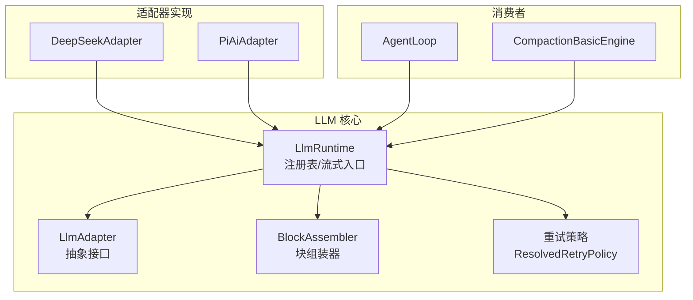
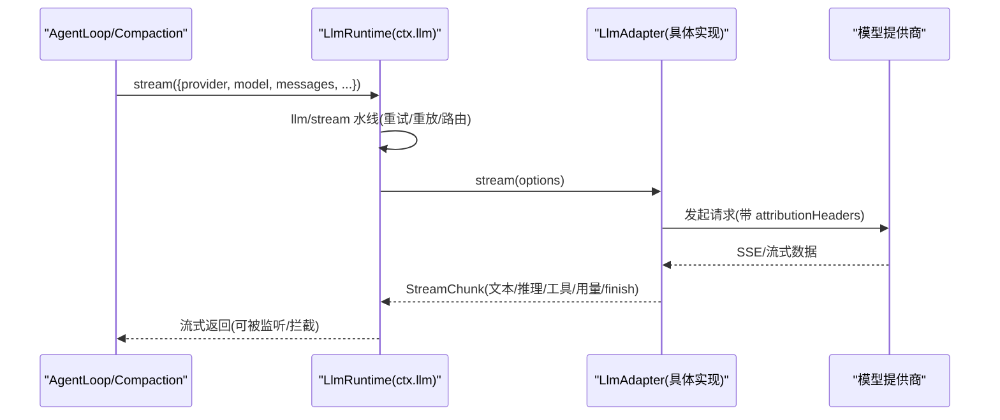
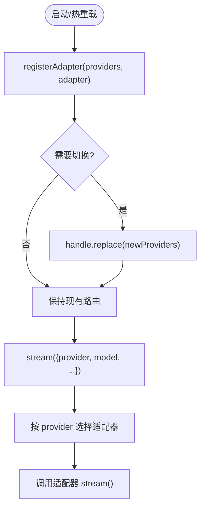
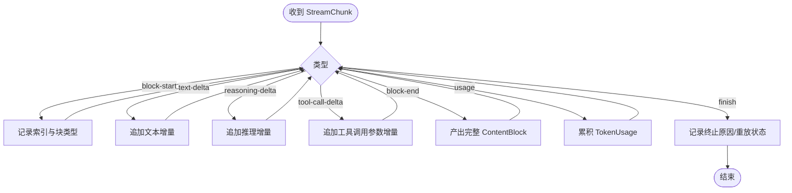
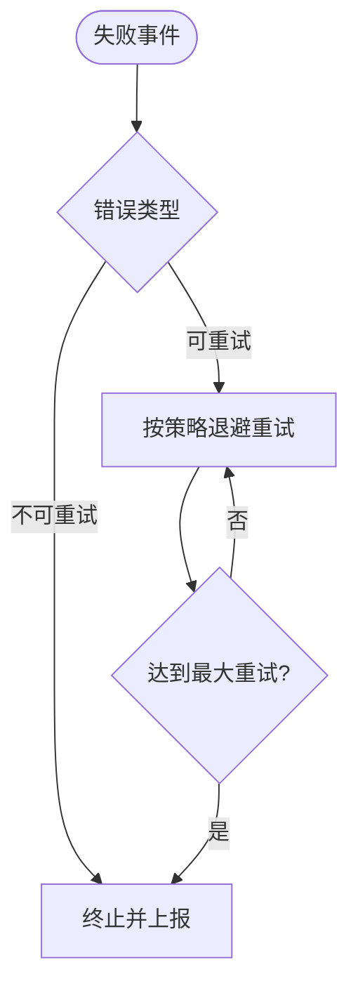
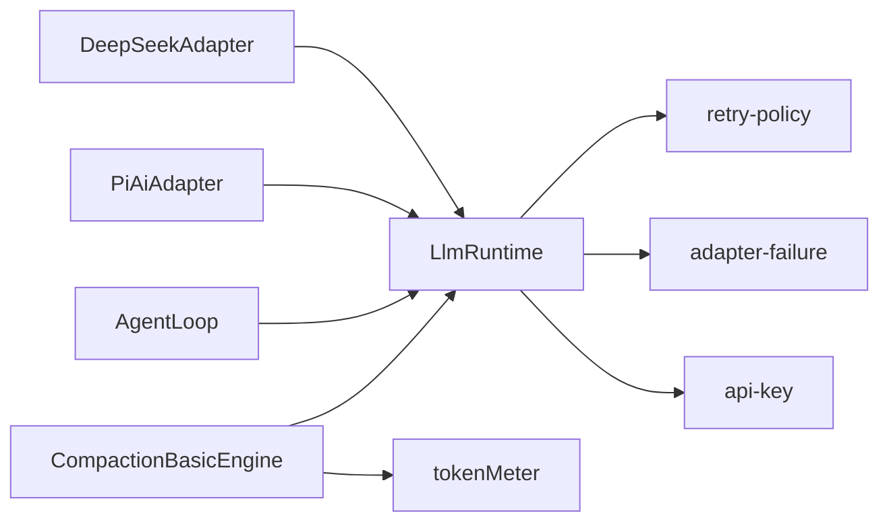

# LLM 适配器接缝

<cite>
**本文引用的文件**
- [packages/llm/llm/src/index.ts](file://packages/llm/llm/src/index.ts)
- [packages/llm/llm/src/types.ts](file://packages/llm/llm/src/types.ts)
- [packages/llm/llm/src/retry-policy.ts](file://packages/llm/llm/src/retry-policy.ts)
- [packages/llm/llm/src/assembler.ts](file://packages/llm/llm/src/assembler.ts)
- [packages/llm/llm-deepseek/src/adapter.ts](file://packages/llm/llm-deepseek/src/adapter.ts)
- [packages/llm/llm-pi-ai/src/adapter.ts](file://packages/llm/llm-pi-ai/src/adapter.ts)
- [packages/llm/llm-pi-ai/src/config.ts](file://packages/llm/llm-pi-ai/src/config.ts)
- [packages/compaction/compaction-basic/src/index.ts](file://packages/compaction/compaction-basic/src/index.ts)
- [docs/subsystems/llm-streaming.md](file://docs/subsystems/llm-streaming.md)
- [docs/cookbook/adding-an-llm-adapter.md](file://docs/cookbook/adding-an-llm-adapter.md)
</cite>

## 目录
1. [简介](#简介)
2. [项目结构](#项目结构)
3. [核心组件](#核心组件)
4. [架构总览](#架构总览)
5. [详细组件分析](#详细组件分析)
6. [依赖关系分析](#依赖关系分析)
7. [性能考量](#性能考量)
8. [故障排除指南](#故障排除指南)
9. [结论](#结论)
10. [附录](#附录)

## 简介
本文件系统化说明 LLM 适配器接缝：以 `ctx.llm` 为核心的模型无关流式服务接口，如何为 agent-loop、compaction-basic 等组件提供统一的模型调用与流式输出能力。文档涵盖适配器实现模式（提供商注册、流式响应处理、错误重试策略、令牌计量集成）、运行时模型切换与动态配置方法，并提供开发新适配器的步骤与示例路径。同时总结 DeepSeek、PI AI、Replay 等提供商的特性与配置要点，并给出调试与排错建议。

## 项目结构
围绕 LLM 适配器接缝的关键代码分布在以下位置：
- 抽象与运行时：`packages/llm/llm/src/index.ts`、`types.ts`、`assembler.ts`、`retry-policy.ts`
- 具体适配器：`packages/llm/llm-deepseek/src/adapter.ts`、`packages/llm/llm-pi-ai/src/adapter.ts`、`packages/llm/llm-pi-ai/src/config.ts`
- 使用方：`packages/compaction/compaction-basic/src/index.ts`（通过 `ctx.llm` 进行摘要生成）
- 规范与指南：`docs/subsystems/llm-streaming.md`、`docs/cookbook/adding-an-llm-adapter.md`

图表来源
- [packages/llm/llm/src/index.ts:174-200](file://packages/llm/llm/src/index.ts#L174-L200)
- [packages/llm/llm-deepseek/src/adapter.ts:151-200](file://packages/llm/llm-deepseek/src/adapter.ts#L151-L200)
- [packages/llm/llm-pi-ai/src/adapter.ts:171-215](file://packages/llm/llm-pi-ai/src/adapter.ts#L171-L215)
- [packages/compaction/compaction-basic/src/index.ts:95-130](file://packages/compaction/compaction-basic/src/index.ts#L95-L130)

章节来源
- [packages/llm/llm/src/index.ts:1-120](file://packages/llm/llm/src/index.ts#L1-L120)
- [docs/subsystems/llm-streaming.md:627-702](file://docs/subsystems/llm-streaming.md#L627-L702)

## 核心组件
- `ctx.llm`（LlmRuntime）：适配器注册表与流式调用入口，暴露 `registerAdapter`、`listProviders`、`resolveModelInfo`、`stream` 等能力，并通过 `llm/stream` 水线拦截重试、重放、路由等横切逻辑。
- `LlmAdapter`：抽象适配器基类，要求实现 `stream()`，可选实现 `providerInfo`、`providerRetryPolicy`、`listModels`、`resolveModel`。
- `StreamChunk`：原始流协议，包含文本/推理/工具调用增量、块起止、用量、终止原因及可重放状态。
- `BlockAssembler`：将 `StreamChunk` 流折叠为完整的 `ContentBlock`、用量、终止原因与重放状态。
- 重试策略：`ResolvedRetryPolicy` 定义正常/始终两种模式，含退避参数与可重试错误码集合。

章节来源
- [packages/llm/llm/src/index.ts:174-200](file://packages/llm/llm/src/index.ts#L174-L200)
- [packages/llm/llm/src/types.ts:154-182](file://packages/llm/llm/src/types.ts#L154-L182)
- [packages/llm/llm/src/assembler.ts:266-308](file://packages/llm/llm/src/assembler.ts#L266-L308)
- [packages/llm/llm/src/retry-policy.ts:14-80](file://packages/llm/llm/src/retry-policy.ts#L14-L80)

## 架构总览
`ctx.llm` 作为统一接入点，屏蔽不同提供商差异，向上游组件提供一致的流式接口。下游组件（如 agent-loop、compaction-basic）仅依赖 `ctx.llm.stream(options)`，无需关心底层 HTTP/SSE 或 SDK 细节。

图表来源
- [packages/llm/llm/src/index.ts:902-928](file://packages/llm/llm/src/index.ts#L902-L928)
- [docs/subsystems/llm-streaming.md:627-702](file://docs/subsystems/llm-streaming.md#L627-L702)

## 详细组件分析

### 适配器注册与运行时模型切换
- 注册：通过 `ctx.llm.registerAdapter(['provider-id'], adapter)` 将适配器绑定到 provider 路由；支持原子替换（`replace`），便于运行时切换。
- 选择：调用时通过 `GenerateOptions.provider` 选择已注册的适配器实例；`model` 由该适配器解析与接受。
- 动态配置：适配器可通过“可配置提供商目录”声明潜在 provider，UI/设置层可在未注册前展示；运行时更新配置后，下一次请求即生效（例如 pi-ai 的 profiles 快照）。

图表来源
- [packages/llm/llm/src/index.ts:330-353](file://packages/llm/llm/src/index.ts#L330-L353)
- [docs/subsystems/llm-streaming.md:714-751](file://docs/subsystems/llm-streaming.md#L714-L751)

章节来源
- [packages/llm/llm/src/index.ts:330-353](file://packages/llm/llm/src/index.ts#L330-L353)
- [docs/subsystems/llm-streaming.md:714-751](file://docs/subsystems/llm-streaming.md#L714-L751)

### 流式响应处理与块组装
- 适配器必须遵循 `StreamChunk` 协议：在 `finish` 之前发送 `usage`，结束后不再发送任何块；工具调用参数始终以原始 JSON 字符串传递；通过 `index` 关联同一块的增量。
- 消费者可使用 `BlockAssembler` 将流式块组装为完整内容、用量、终止原因与重放状态。

图表来源
- [packages/llm/llm/src/types.ts:154-182](file://packages/llm/llm/src/types.ts#L154-L182)
- [packages/llm/llm/src/assembler.ts:266-308](file://packages/llm/llm/src/assembler.ts#L266-L308)

章节来源
- [packages/llm/llm/src/types.ts:154-182](file://packages/llm/llm/src/types.ts#L154-L182)
- [packages/llm/llm/src/assembler.ts:266-308](file://packages/llm/llm/src/assembler.ts#L266-L308)

### 错误与重试策略
- 错误路径：适配器可选择抛出 `LlmError`（传输/协议错误），或在流末尾以 `finish {kind:'error'|'aborted', failure}` 上报（提供方内联错误）。
- 重试策略：每个 provider 路由可附带 `ResolvedRetryPolicy`，支持“normal”（有限次重试，基于错误码）和“always”（无限重试直到成功/取消/释放）。默认包含空响应、限流、服务端错误、超时、传输错误等可重试码。
- 空闲超时：适配器需对长连接设置正数 `streamIdleTimeoutMs`（默认 5 分钟），在迭代等待期间触发则映射为 `TIMEOUT`。

图表来源
- [packages/llm/llm/src/retry-policy.ts:14-80](file://packages/llm/llm/src/retry-policy.ts#L14-L80)
- [packages/llm/llm/src/retry-policy.ts:145-192](file://packages/llm/llm/src/retry-policy.ts#L145-L192)
- [docs/subsystems/llm-streaming.md:184-220](file://docs/subsystems/llm-streaming.md#L184-L220)

章节来源
- [packages/llm/llm/src/retry-policy.ts:14-80](file://packages/llm/llm/src/retry-policy.ts#L14-L80)
- [packages/llm/llm/src/retry-policy.ts:145-192](file://packages/llm/llm/src/retry-policy.ts#L145-L192)
- [docs/subsystems/llm-streaming.md:184-220](file://docs/subsystems/llm-streaming.md#L184-L220)

### 令牌计量集成
- 每次成功调用会产出 `TokenUsage`（输入、输出、缓存读/写、推理 token 等），适配器需在 `finish` 前发送 `usage`。
- 消费侧（如 compaction-basic）通过 `ctx.tokenMeter` 获取压力与用量信息，驱动压缩决策与定价。
- 投影与持久化：token-meter 维护会话级用量投影，支持最新样本替换与去重统计。

章节来源
- [packages/llm/llm/src/types.ts:244-264](file://packages/llm/llm/src/types.ts#L244-L264)
- [packages/compaction/compaction-basic/src/index.ts:95-130](file://packages/compaction/compaction-basic/src/index.ts#L95-L130)

### 提供商特性与配置

#### DeepSeek（直接 HTTP + SSE）
- 特点：直接 fetch 调用 OpenAI 兼容 chat-completions 端点，SSE 帧解析，支持思考模式与推理强度。
- 配置要点：baseURL、apiKeyEnv、defaults（thinking/reasoningEffort）、maxTokens、contextWindow、models 目录、streamIdleTimeoutMs、retryPolicy。
- 重试：根据 HTTP 状态与错误体映射稳定错误码（AUTH、RATE_LIMIT、CONTEXT_WINDOW_EXCEEDED、SERVER 等）。

章节来源
- [packages/llm/llm-deepseek/src/adapter.ts:151-200](file://packages/llm/llm-deepseek/src/adapter.ts#L151-L200)
- [packages/llm/llm-deepseek/src/adapter.ts:117-149](file://packages/llm/llm-deepseek/src/adapter.ts#L117-L149)

#### PI AI（库封装 + 多提供商）
- 特点：基于 pi-ai 库封装，支持多提供商 profile；每次操作读取当前 profiles 快照，配置变更即时生效。
- 配置要点：providers 字典（键为 provider 路由），thinkingFormat、supportsReasoningEffort、reasoningEfforts 映射等。
- 头部合并：自动注入 attributionHeaders，避免冲突。

章节来源
- [packages/llm/llm-pi-ai/src/adapter.ts:171-215](file://packages/llm/llm-pi-ai/src/adapter.ts#L171-L215)
- [packages/llm/llm-pi-ai/src/config.ts:171-206](file://packages/llm/llm-pi-ai/src/config.ts#L171-L206)

#### Replay（重放）
- 概念：适配器在成功 finish 时可携带 lossless-JSON 的 replayState，用于后续请求重建原生提供商消息；仅在历史 provider 与目标 provider 同属一个适配器实例时才传递。
- 用途：跨模型/跨 provider 恢复上下文，保证历史一致性。

章节来源
- [docs/subsystems/llm-streaming.md:154-182](file://docs/subsystems/llm-streaming.md#L154-L182)
- [packages/llm/llm-pi-ai/tests/convert.spec.ts:444-484](file://packages/llm/llm-pi-ai/tests/convert.spec.ts#L444-L484)

### 开发新 LLM 适配器（步骤与示例）
- 步骤概览：
  1) 继承 `LlmAdapter`，实现 `stream(options)` 并严格遵循 `StreamChunk` 协议。
  2) 可选实现 `providerInfo`、`providerRetryPolicy`、`listModels`、`resolveModel`。
  3) 在插件中通过 `ctx.llm.registerAdapter(['your-provider'], new YourAdapter(...))` 注册。
  4) 若需动态配置，声明可配置提供商目录并在设置层启用。
- 参考实现：
  - 直接 HTTP 示例：`packages/llm/llm-deepseek/src/adapter.ts`
  - 库封装示例：`packages/llm/llm-pi-ai/src/adapter.ts`
- 协议义务与验证：
  - 在 `finish` 前发送 `usage`，结束后不发送任何块。
  - 工具调用参数全程为原始 JSON 字符串。
  - 错误仅两条路径：抛错或 finish 中上报。
  - 尊重 `options.signal`，不支持字段应抛 `UNSUPPORTED`。
  - 如需重放，输出最小化的 lossless-JSON replayState。

章节来源
- [docs/cookbook/adding-an-llm-adapter.md:1-44](file://docs/cookbook/adding-an-llm-adapter.md#L1-L44)
- [packages/llm/llm-deepseek/src/adapter.ts:151-200](file://packages/llm/llm-deepseek/src/adapter.ts#L151-L200)
- [packages/llm/llm-pi-ai/src/adapter.ts:171-215](file://packages/llm/llm-pi-ai/src/adapter.ts#L171-L215)

## 依赖关系分析
- `LlmRuntime` 依赖重试策略模块、错误归一化、API Key 校验等基础能力。
- 具体适配器依赖网络/SDK 与超时看门狗，确保空闲超时与取消语义。
- 消费者（agent-loop、compaction-basic）仅依赖 `ctx.llm` 与 `ctx.tokenMeter`，解耦具体提供商。

图表来源
- [packages/llm/llm/src/index.ts:1-45](file://packages/llm/llm/src/index.ts#L1-L45)
- [packages/compaction/compaction-basic/src/index.ts:95-130](file://packages/compaction/compaction-basic/src/index.ts#L95-L130)

章节来源
- [packages/llm/llm/src/index.ts:1-45](file://packages/llm/llm/src/index.ts#L1-L45)
- [packages/compaction/compaction-basic/src/index.ts:95-130](file://packages/compaction/compaction-basic/src/index.ts#L95-L130)

## 性能考量
- 流式处理：适配器应避免阻塞，及时产出增量；使用 `BlockAssembler` 降低重复组装成本。
- 空闲超时：合理设置 `streamIdleTimeoutMs`，防止长连接挂起。
- 重试退避：使用指数退避与抖动，避免雪崩；限制最大重试次数或采用 always 模式配合外部取消。
- 令牌计量：尽量精确上报用量，减少估算误差；避免重复计数。

[本节为通用指导，不直接分析具体文件]

## 故障排除指南
- 认证失败：检查 API Key 是否可用且无非法字符；使用 `assertUsableApiKey` 提前诊断。
- 上下文溢出：识别 `CONTEXT_WINDOW_EXCEEDED_CODE`，调整消息长度或系统提示。
- 空响应：适配器应将无内容的完成视为可重试错误（EMPTY_RESPONSE）。
- 超时/空闲：确认 `streamIdleTimeoutMs` 与网络状况；查看是否因长时间无数据触发 TIMEOUT。
- 重试行为：核对 `ResolvedRetryPolicy` 的可重试码与退避参数是否符合预期。
- 重放不一致：确保 replayState 与持久内容一致；跨 provider 恢复需同一适配器实例。

章节来源
- [packages/llm/llm/src/index.ts:119-152](file://packages/llm/llm/src/index.ts#L119-L152)
- [packages/llm/llm-deepseek/src/adapter.ts:117-149](file://packages/llm/llm-deepseek/src/adapter.ts#L117-L149)
- [docs/subsystems/llm-streaming.md:184-220](file://docs/subsystems/llm-streaming.md#L184-L220)

## 结论
`ctx.llm` 通过统一的适配器注册与流式接口，屏蔽了不同模型提供商的差异，使 agent-loop 与 compaction-basic 等组件能够以模型无关的方式工作。借助标准化的 `StreamChunk`、重试策略与令牌计量，系统在可靠性、可观测性与扩展性方面具备良好基础。新增适配器只需遵循协议契约并正确注册，即可无缝融入整体生态。

[本节为总结，不直接分析具体文件]

## 附录
- 关键类型与接口：
  - `LlmAdapter`：抽象适配器基类
  - `StreamChunk`：原始流协议
  - `ResolvedRetryPolicy`：重试策略
  - `GenerateOptions`：模型请求选项
  - `LlmCallConfig`：会话级调用配置
- 参考文档：
  - LLM Streaming 子系统文档
  - 添加 LLM 适配器 CookBook

章节来源
- [docs/subsystems/llm-streaming.md:627-702](file://docs/subsystems/llm-streaming.md#L627-L702)
- [docs/cookbook/adding-an-llm-adapter.md:1-44](file://docs/cookbook/adding-an-llm-adapter.md#L1-L44)