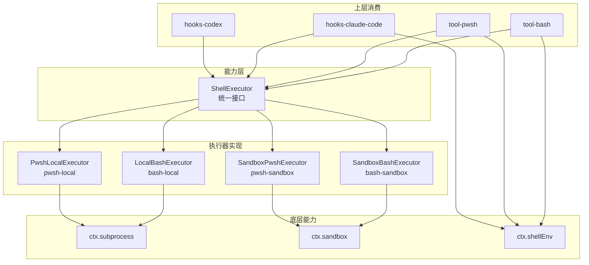
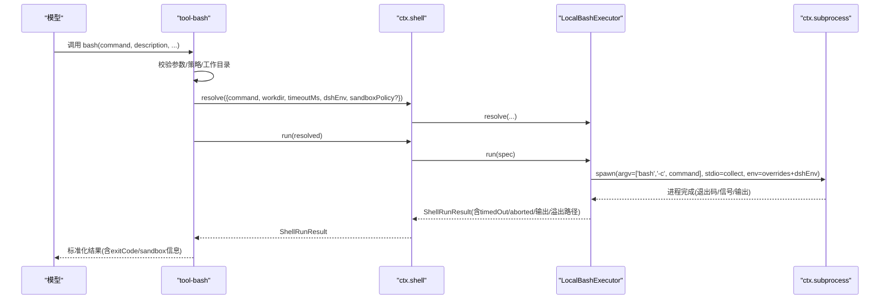
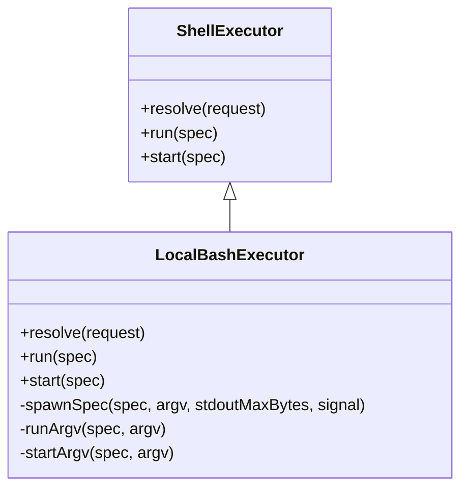
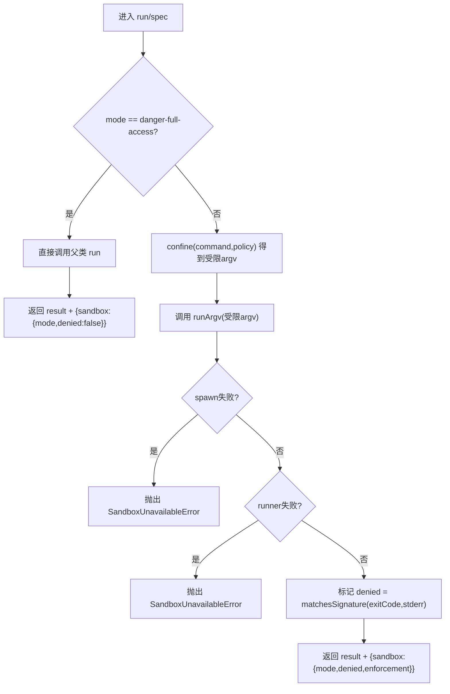
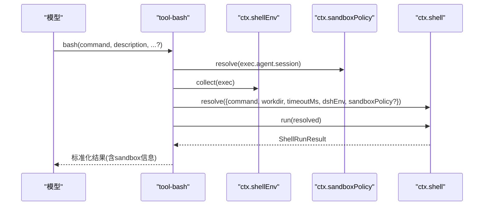
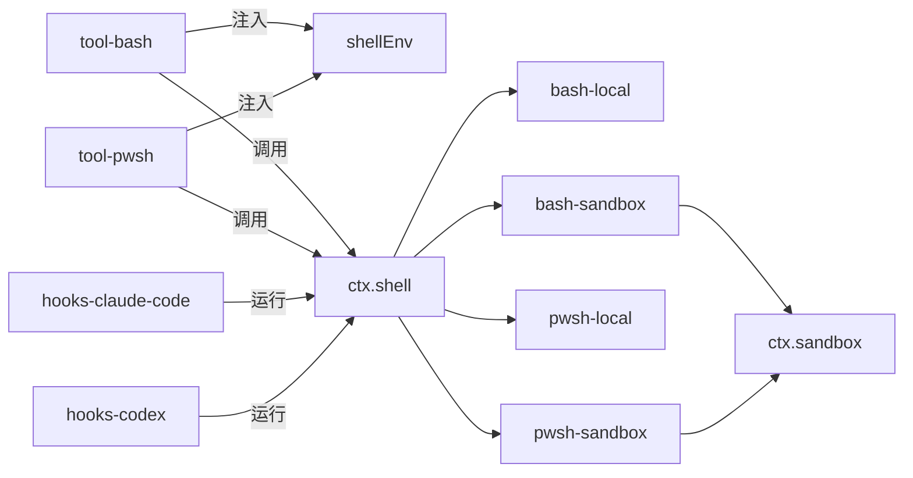

# Shell 执行器接缝

<cite>
**本文引用的文件**
- [packages/shell/shell/src/index.ts](file://packages/shell/shell/src/index.ts)
- [packages/shell/bash-local/src/index.ts](file://packages/shell/bash-local/src/index.ts)
- [packages/shell/bash-sandbox/src/index.ts](file://packages/shell/bash-sandbox/src/index.ts)
- [packages/shell/pwsh-local/src/index.ts](file://packages/shell/pwsh-local/src/index.ts)
- [packages/shell/pwsh-sandbox/src/index.ts](file://packages/shell/pwsh-sandbox/src/index.ts)
- [packages/shell/tool-bash/src/index.ts](file://packages/shell/tool-bash/src/index.ts)
- [packages/shell/tool-pwsh/src/index.ts](file://packages/shell/tool-pwsh/src/index.ts)
- [packages/hooks/hooks-claude-code/src/index.ts](file://packages/hooks/hooks-claude-code/src/index.ts)
- [packages/shell/shell-env/tests/shell-env.spec.ts](file://packages/shell/shell-env/tests/shell-env.spec.ts)
</cite>

## 目录
1. [简介](#简介)
2. [项目结构](#项目结构)
3. [核心组件](#核心组件)
4. [架构总览](#架构总览)
5. [详细组件分析](#详细组件分析)
6. [依赖关系分析](#依赖关系分析)
7. [性能与安全建议](#性能与安全建议)
8. [故障排查指南](#故障排查指南)
9. [结论](#结论)
10. [附录：配置示例与选型](#附录配置示例与选型)

## 简介
本文件系统化说明“Shell 执行器接缝”的设计与实现，聚焦 ctx.shell 作为 Bash/PowerShell 执行器的统一能力边界。它向上为模型侧工具（tool-bash、tool-pwsh）和钩子桥（hooks-claude-code、hooks-codex）提供一致的 run/start/resolve 接口；向下通过 ctx.subprocess 或沙箱提供者驱动具体进程。通过可插拔的执行器（bash-local、bash-sandbox、pwsh-local、pwsh-sandbox），可在不改动上层工具的前提下切换本地、沙箱化或远程 PowerShell 等执行环境。

## 项目结构
围绕 shell 能力，仓库以“能力定义 + 多种实现 + 上层消费”的方式组织：
- 能力定义：shell 包暴露 ShellExecutor 抽象与统一请求/结果类型
- 执行器实现：bash-local、bash-sandbox、pwsh-local、pwsh-sandbox
- 上层消费：tool-bash、tool-pwsh 将模型调用映射到 ctx.shell；hooks-claude-code/hook-codex 通过同一执行器运行外部命令型钩子
- 环境变量注册：shell-env 提供受信任的 DSH_* 变量注入

图表来源
- [packages/shell/shell/src/index.ts](file://packages/shell/shell/src/index.ts)
- [packages/shell/bash-local/src/index.ts](file://packages/shell/bash-local/src/index.ts)
- [packages/shell/bash-sandbox/src/index.ts](file://packages/shell/bash-sandbox/src/index.ts)
- [packages/shell/pwsh-local/src/index.ts](file://packages/shell/pwsh-local/src/index.ts)
- [packages/shell/pwsh-sandbox/src/index.ts](file://packages/shell/pwsh-sandbox/src/index.ts)
- [packages/shell/tool-bash/src/index.ts](file://packages/shell/tool-bash/src/index.ts)
- [packages/shell/tool-pwsh/src/index.ts](file://packages/shell/tool-pwsh/src/index.ts)
- [packages/hooks/hooks-claude-code/src/index.ts](file://packages/hooks/hooks-claude-code/src/index.ts)

章节来源
- [packages/shell/shell/src/index.ts](file://packages/shell/shell/src/index.ts)
- [packages/shell/bash-local/src/index.ts](file://packages/shell/bash-local/src/index.ts)
- [packages/shell/bash-sandbox/src/index.ts](file://packages/shell/bash-sandbox/src/index.ts)
- [packages/shell/pwsh-local/src/index.ts](file://packages/shell/pwsh-local/src/index.ts)
- [packages/shell/pwsh-sandbox/src/index.ts](file://packages/shell/pwsh-sandbox/src/index.ts)
- [packages/shell/tool-bash/src/index.ts](file://packages/shell/tool-bash/src/index.ts)
- [packages/shell/tool-pwsh/src/index.ts](file://packages/shell/tool-pwsh/src/index.ts)
- [packages/hooks/hooks-claude-code/src/index.ts](file://packages/hooks/hooks-claude-code/src/index.ts)

## 核心组件
- ShellExecutor（能力定义）
  - 统一入口：run(request)、start(spec)、resolve(request)
  - 约定：非零退出、超时、中止均返回结构化结果而非抛错；背景进程通过 done/readOutput/kill 管理
- LocalBashExecutor（bash-local）
  - 基于 ctx.subprocess 执行 bash -c
  - 输出限制、溢出转储、SIGTERM→SIGKILL 宽限期、工作目录与超时默认值
- SandboxBashExecutor（bash-sandbox）
  - 在 LocalBashExecutor 之上通过 ctx.sandbox.confine 包裹命令
  - 报告 mode/enforcement/denied/runnerFailed，并在不可用时抛出不可用错误
- PwshLocalExecutor（pwsh-local）
  - 基于 ctx.subprocess 执行 pwsh -Command，附带 UTF-8 前缀与环境覆盖
  - 同样提供输出限制、溢出转储、超时与后台进程管理
- SandboxPwshExecutor（pwsh-sandbox）
  - 对 PwshLocalExecutor 做同样的沙箱化封装，行为镜像 bash-sandbox
- tool-bash / tool-pwsh（模型侧工具）
  - 将模型调用转换为 ctx.shell.run/start，并注入 shellEnv、sandboxPolicy、系统提示与 UI 呈现
- hooks-claude-code / hooks-codex（钩子桥）
  - 读取外部 hooks.json，按事件构造 stdin 负载并通过 ctx.shell 运行命令型钩子

章节来源
- [packages/shell/shell/src/index.ts](file://packages/shell/shell/src/index.ts)
- [packages/shell/bash-local/src/index.ts](file://packages/shell/bash-local/src/index.ts)
- [packages/shell/bash-sandbox/src/index.ts](file://packages/shell/bash-sandbox/src/index.ts)
- [packages/shell/pwsh-local/src/index.ts](file://packages/shell/pwsh-local/src/index.ts)
- [packages/shell/pwsh-sandbox/src/index.ts](file://packages/shell/pwsh-sandbox/src/index.ts)
- [packages/shell/tool-bash/src/index.ts](file://packages/shell/tool-bash/src/index.ts)
- [packages/shell/tool-pwsh/src/index.ts](file://packages/shell/tool-pwsh/src/index.ts)
- [packages/hooks/hooks-claude-code/src/index.ts](file://packages/hooks/hooks-claude-code/src/index.ts)

## 架构总览
下图展示一次前台 bash 调用的端到端流程：工具层校验参数 → 解析策略与工作目录 → 注入 DSH_* 环境变量 → 调用 ctx.shell.resolve/run → 执行器通过 subprocess 启动进程 → 收集输出并返回结构化结果。

图表来源
- [packages/shell/tool-bash/src/index.ts](file://packages/shell/tool-bash/src/index.ts)
- [packages/shell/bash-local/src/index.ts](file://packages/shell/bash-local/src/index.ts)

章节来源
- [packages/shell/tool-bash/src/index.ts](file://packages/shell/tool-bash/src/index.ts)
- [packages/shell/bash-local/src/index.ts](file://packages/shell/bash-local/src/index.ts)

## 详细组件分析

### ShellExecutor 抽象与统一语义
- 统一方法
  - resolve(request): 将高层请求规范化为 exec spec（工作目录、超时、输出上限、dshEnv、sandboxPolicy 透传）
  - run(spec): 前台执行，返回包含退出码、信号、是否超时/中止、stdout/stderr 的结构化结果
  - start(spec): 后台执行，返回 ShellProcess（status/exitCode/signal/done/readOutput/kill）
- 关键约定
  - 非零退出、超时、中止不抛错，而是通过结果字段表达
  - 长输出截断并记录 spillPath
  - 后台进程在组合销毁时会被停止并等待

章节来源
- [packages/shell/shell/src/index.ts](file://packages/shell/shell/src/index.ts)

### LocalBashExecutor（bash-local）
- 特点
  - 以 bash -c 执行命令，设置 NO_COLOR/TERM/PAGER 等终端友好环境变量
  - 支持 per-call 超时、最大输出字节、溢出转储、SIGTERM→SIGKILL 宽限期
  - 通过 installSettingsSection 暴露可热更新的 settings 段
- 使用场景
  - 开发/测试、无需沙箱的本地脚本执行
  - 需要精细控制输出与超时的批处理任务

图表来源
- [packages/shell/bash-local/src/index.ts](file://packages/shell/bash-local/src/index.ts)

章节来源
- [packages/shell/bash-local/src/index.ts](file://packages/shell/bash-local/src/index.ts)

### SandboxBashExecutor（bash-sandbox）
- 特点
  - 继承 LocalBashExecutor，重写 resolve/run/start/onProcessDone
  - 通过 ctx.sandbox.confine 包装 argv，注入 mode/enforcement/denialSignatures/runnerFailureRules
  - 区分 runnerFailed（未执行）与 denied（被沙箱拦截），并在结果中上报
- 使用场景
  - 生产环境强制文件访问受限，需按会话策略动态放宽（配合 tool 层的升级审批）

图表来源
- [packages/shell/bash-sandbox/src/index.ts](file://packages/shell/bash-sandbox/src/index.ts)

章节来源
- [packages/shell/bash-sandbox/src/index.ts](file://packages/shell/bash-sandbox/src/index.ts)

### PwshLocalExecutor（pwsh-local）
- 特点
  - 以 pwsh -Command 执行，附加 UTF-8 编码前缀，避免 Windows 控制台乱码
  - 同样提供输出限制、溢出转储、超时与后台进程管理
  - 支持显式 pwshPath 解析与热更新
- 使用场景
  - Windows 平台原生 PowerShell 脚本执行，或与 Windows 生态交互

章节来源
- [packages/shell/pwsh-local/src/index.ts](file://packages/shell/pwsh-local/src/index.ts)

### SandboxPwshExecutor（pwsh-sandbox）
- 特点
  - 继承 PwshLocalExecutor，行为镜像 bash-sandbox：confine 包装、runnerFailed/denied 分类、不可用错误
- 使用场景
  - Windows 下对 PowerShell 执行进行文件访问限制与策略管控

章节来源
- [packages/shell/pwsh-sandbox/src/index.ts](file://packages/shell/pwsh-sandbox/src/index.ts)

### tool-bash（模型侧 Bash 工具）
- 职责
  - 参数校验、工作目录解析、沙箱策略解析与升级审批
  - 注入 shellEnv（DSH_* 变量）、调用 ctx.shell.run/start
  - 将结果标准化为前端友好的 terminal/generic 卡片
- 关键点
  - 当存在沙箱执行器时，暴露 sandbox_permissions + justification 用于同轮升级
  - 后台模式通过 ctx.jobs 管理，返回 jobId

图表来源
- [packages/shell/tool-bash/src/index.ts](file://packages/shell/tool-bash/src/index.ts)
- [packages/shell/shell-env/tests/shell-env.spec.ts](file://packages/shell/shell-env/tests/shell-env.spec.ts)

章节来源
- [packages/shell/tool-bash/src/index.ts](file://packages/shell/tool-bash/src/index.ts)
- [packages/shell/shell-env/tests/shell-env.spec.ts](file://packages/shell/shell-env/tests/shell-env.spec.ts)

### tool-pwsh（模型侧 PowerShell 工具）
- 职责
  - 与 tool-bash 对称：参数校验、策略解析、shellEnv 注入、调用 ctx.shell
  - 针对 Windows 的 ConstrainedLanguage 与命名管道限制给出明确提示
- 关键点
  - 前台/后台、超时、输出截断、沙箱升级审批与渲染与 bash 保持一致

章节来源
- [packages/shell/tool-pwsh/src/index.ts](file://packages/shell/tool-pwsh/src/index.ts)

### hooks-claude-code（Claude Code 钩子桥）
- 职责
  - 读取 hooks.json，按事件（SessionStart/UserPromptSubmit/PreToolUse/PostToolUse/Stop/SubagentStart/SubagentStop）构造 stdin 负载
  - 通过 ctx.shell 运行命令型钩子，合并输出并映射为扩展点决策
- 关键点
  - 注入 CLAUDE_PROJECT_DIR，支持插件根与项目根替换
  - 仅依赖 shell，其他能力按需获取

章节来源
- [packages/hooks/hooks-claude-code/src/index.ts](file://packages/hooks/hooks-claude-code/src/index.ts)

### hooks-codex（Codex 钩子桥）
- 职责
  - 类似 hooks-claude-code，但采用 Codex 的事件集与 payload 形状（snake_case、无换行结尾等）
  - 始终使用正则匹配器，不注入额外环境变量
- 关键点
  - 仅桥接当前支持的五个事件，其余忽略

章节来源
- [packages/hooks/hooks-claude-code/src/index.ts](file://packages/hooks/hooks-claude-code/src/index.ts)

## 依赖关系分析
- 解耦性
  - 工具层只依赖 ctx.shell 抽象，不关心具体执行器实现
  - 沙箱逻辑集中在 bash-sandbox/pwsh-sandbox，不影响 tool 层
- 耦合点
  - tool-bash/tool-pwsh 依赖 ctx.shellEnv 注入 DSH_* 变量
  - 沙箱执行器依赖 ctx.sandbox 与 ctx.sandboxPolicy
  - 钩子桥依赖 ctx.shell 运行外部命令

图表来源
- [packages/shell/tool-bash/src/index.ts](file://packages/shell/tool-bash/src/index.ts)
- [packages/shell/tool-pwsh/src/index.ts](file://packages/shell/tool-pwsh/src/index.ts)
- [packages/shell/bash-sandbox/src/index.ts](file://packages/shell/bash-sandbox/src/index.ts)
- [packages/shell/pwsh-sandbox/src/index.ts](file://packages/shell/pwsh-sandbox/src/index.ts)
- [packages/hooks/hooks-claude-code/src/index.ts](file://packages/hooks/hooks-claude-code/src/index.ts)

章节来源
- [packages/shell/tool-bash/src/index.ts](file://packages/shell/tool-bash/src/index.ts)
- [packages/shell/tool-pwsh/src/index.ts](file://packages/shell/tool-pwsh/src/index.ts)
- [packages/shell/bash-sandbox/src/index.ts](file://packages/shell/bash-sandbox/src/index.ts)
- [packages/shell/pwsh-sandbox/src/index.ts](file://packages/shell/pwsh-sandbox/src/index.ts)
- [packages/hooks/hooks-claude-code/src/index.ts](file://packages/hooks/hooks-claude-code/src/index.ts)

## 性能与安全建议
- 命令过滤与白名单
  - 在工具层或策略层对高风险命令进行预检（如 rm -rf、格式化磁盘、网络外联）
  - 结合沙箱模式最小权限原则，仅在必要时升级
- 资源限制
  - 合理设置 timeoutMs/maxTimeoutMs 防止长时间占用
  - 设置 maxOutputBytes/maxSpillBytes 控制内存与磁盘占用
  - 利用 graceMs 确保进程树清理
- 执行监控
  - 关注 timedOut/aborted、stderr 溢出与 runnerFailed
  - 对后台任务使用 jobs 管理生命周期，定期采集 readOutput
- 安全加固
  - 优先使用沙箱执行器（bash-sandbox/pwsh-sandbox）
  - 严格审核 hooks.json 中的命令与匹配器
  - 使用 shellEnv 注入可信变量，避免污染宿主环境

[本节为通用指导，不直接分析具体文件]

## 故障排查指南
- 常见错误定位
  - 沙箱不可用：当 runner 无法启动或受限环境缺失时，会抛出不可用错误；检查 ctx.sandbox 提供者与默认模式
  - 超时/中止：timedOut=true 表示达到执行器超时；aborted=true 表示上游取消
  - 输出截断：truncated=true 且存在 spillPath，应查看溢出文件定位完整输出
- 调试步骤
  - 启用更详细的 stderr 摘要与日志
  - 降低并发、增大超时与输出上限进行复现
  - 在 hook 桥中检查 hooks.json 的命令与匹配器是否正确

章节来源
- [packages/shell/bash-sandbox/src/index.ts](file://packages/shell/bash-sandbox/src/index.ts)
- [packages/shell/bash-local/src/index.ts](file://packages/shell/bash-local/src/index.ts)
- [packages/shell/pwsh-local/src/index.ts](file://packages/shell/pwsh-local/src/index.ts)

## 结论
ctx.shell 作为统一的 Shell 执行器接缝，屏蔽了本地与沙箱、Bash 与 PowerShell 的差异，使模型侧工具与钩子桥可以稳定地执行命令。通过可插拔执行器与策略注入，既能满足开发期的灵活性，也能在生产环境实现强约束的安全执行。配合合理的配置与监控，可在性能与安全之间取得良好平衡。

[本节为总结，不直接分析具体文件]

## 附录：配置示例与选型
- 选择执行器
  - 本地快速迭代：bash-local 或 pwsh-local
  - 生产安全：bash-sandbox 或 pwsh-sandbox（配合 ctx.sandboxPolicy）
  - Windows 生态：pwsh-local/pwsh-sandbox
- 关键配置项（节选）
  - 工作目录：cwd（默认进程工作目录）
  - 超时：timeoutMs（默认）、maxTimeoutMs（上限）
  - 输出：maxOutputBytes（内存上限）、maxSpillBytes（溢出上限）
  - 终止：graceMs（SIGTERM→SIGKILL 宽限期）
  - PowerShell：pwshPath（可选，自动探测 PATH/安装位置）
- 环境变量注入
  - 通过 shellEnv 注入 DSH_HOME、DSH_SHELL、DSH_SESSION_ID 等受信任变量
- 工具级开关
  - enableRunInBackground：是否允许后台执行（默认开启）
- 升级审批
  - 当挂载沙箱执行器时，可通过 sandbox_permissions + justification 在同轮申请更宽松模式

章节来源
- [packages/shell/bash-local/src/index.ts](file://packages/shell/bash-local/src/index.ts)
- [packages/shell/pwsh-local/src/index.ts](file://packages/shell/pwsh-local/src/index.ts)
- [packages/shell/tool-bash/src/index.ts](file://packages/shell/tool-bash/src/index.ts)
- [packages/shell/tool-pwsh/src/index.ts](file://packages/shell/tool-pwsh/src/index.ts)
- [packages/shell/shell-env/tests/shell-env.spec.ts](file://packages/shell/shell-env/tests/shell-env.spec.ts)