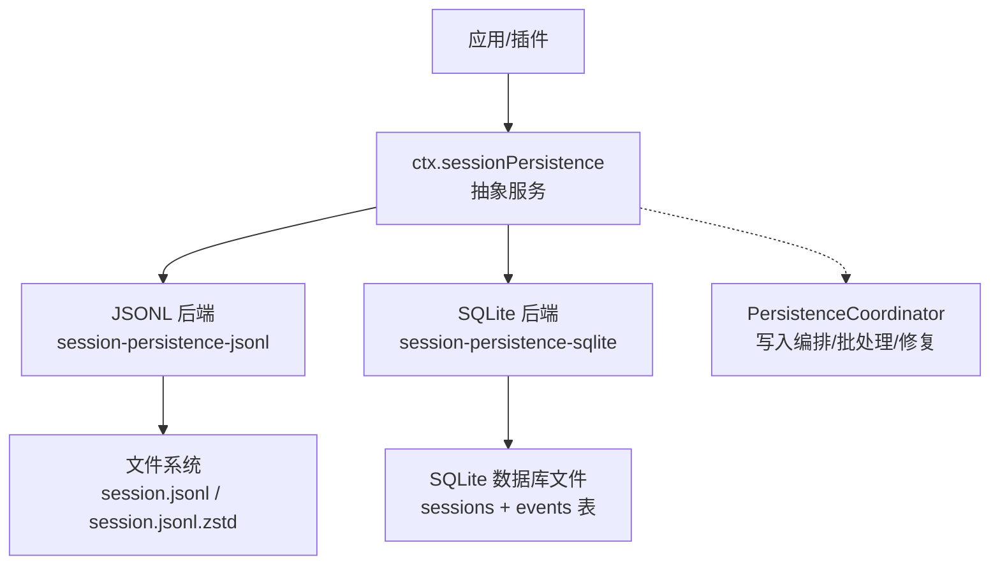
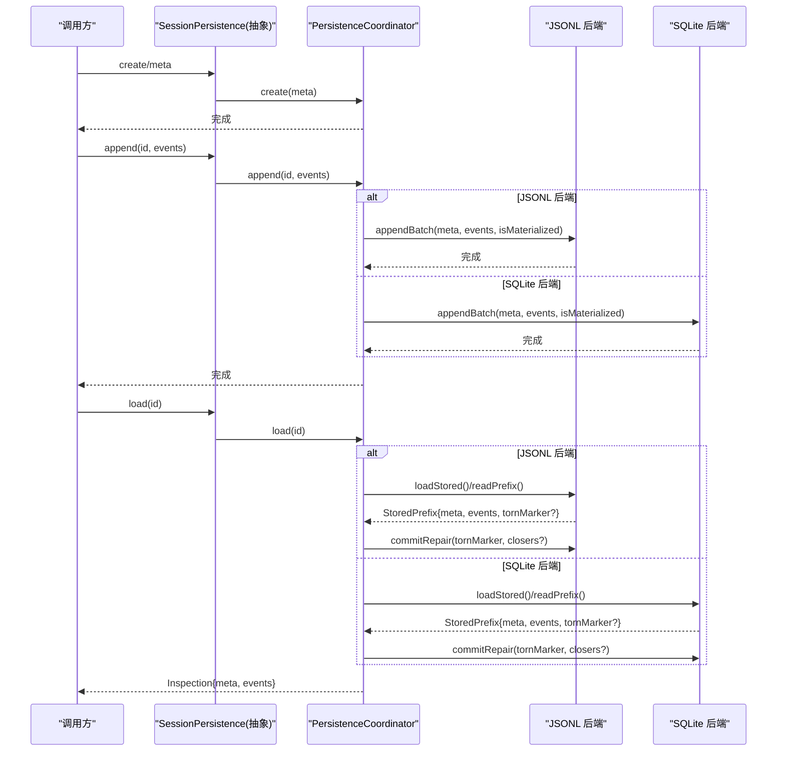
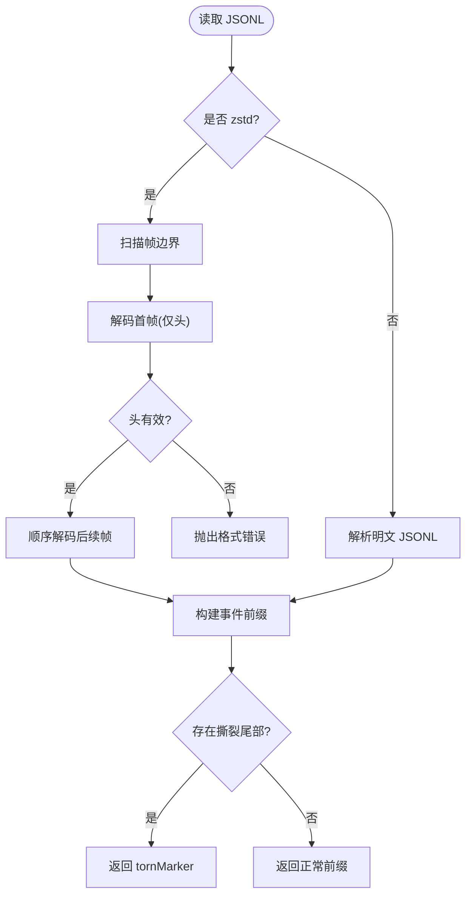
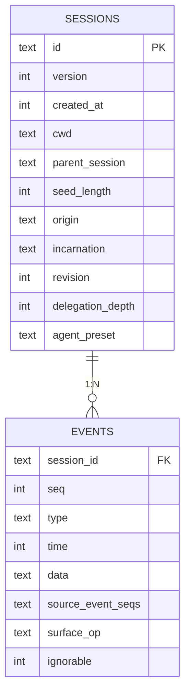
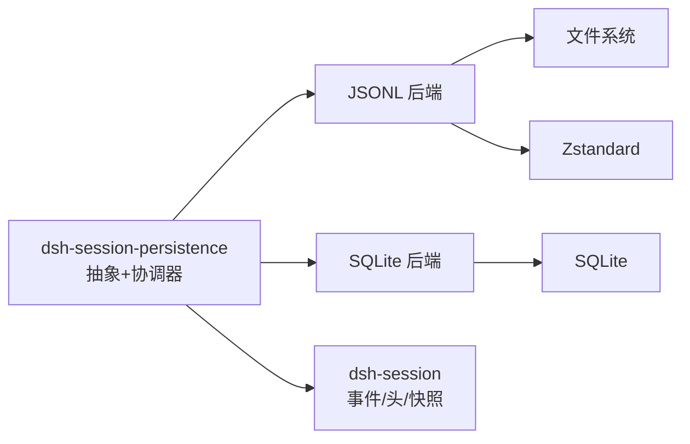

# 会话持久化接缝

<cite>
**本文引用的文件**
- [packages/session/session-persistence/src/index.ts](file://packages/session/session-persistence/src/index.ts)
- [packages/session/session-persistence/src/coordinator.ts](file://packages/session/session-persistence/src/coordinator.ts)
- [packages/session/session-persistence-jsonl/src/index.ts](file://packages/session/session-persistence-jsonl/src/index.ts)
- [packages/session/session-persistence-jsonl/src/format.ts](file://packages/session/session-persistence-jsonl/src/format.ts)
- [packages/session/session-persistence-sqlite/src/index.ts](file://packages/session/session-persistence-sqlite/src/index.ts)
- [packages/session/session-persistence-sqlite/src/schema.ts](file://packages/session/session-persistence-sqlite/src/schema.ts)
- [docs/subsystems/persistence.zh.md](file://docs/subsystems/persistence.zh.md)
- [packages/session/README.zh.md](file://packages/session/README.zh.md)
- [.agents/notes/implemented/architecture/2026-06-14-session-persistence.zh.md](file://.agents/notes/implemented/architecture/2026-06-14-session-persistence.zh.md)
- [.agents/notes/implemented/architecture/2026-06-18-shared-persistence-write-coordinator.zh.md](file://.agents/notes/implemented/architecture/2026-06-18-shared-persistence-write-coordinator.zh.md)
- [.agents/notes/implemented/architecture/2026-07-19-zstandard-jsonl-session-logs.md](file://.agents/notes/implemented/architecture/2026-07-19-zstandard-jsonl-session-logs.md)
- [.agents/notes/implemented/architecture/2026-08-05-large-session-jsonl-restore-pipeline.md](file://.agents/notes/implemented/architecture/2026-08-05-large-session-jsonl-restore-pipeline.md)
- [.agents/notes/implemented/feature/2026-07-10-agent-session-identity-and-log-location.md](file://.agents/notes/implemented/feature/2026-07-10-agent-session-identity-and-log-location.md)
</cite>

## 目录
1. [简介](#简介)
2. [项目结构](#项目结构)
3. [核心组件](#核心组件)
4. [架构总览](#架构总览)
5. [详细组件分析](#详细组件分析)
6. [依赖关系分析](#依赖关系分析)
7. [性能考量](#性能考量)
8. [故障排查指南](#故障排查指南)
9. [结论](#结论)
10. [附录](#附录)

## 简介
本文件围绕“会话持久化接缝”展开，聚焦 ctx.sessionPersistence 作为统一抽象如何屏蔽 JSONL 与 SQLite 两种后端的差异，并说明：
- 事件词汇表（SessionEvent）的持久化格式与兼容性保证
- 不同后端的性能特点、适用场景与大数据量处理策略
- agent-loop、tool-bash、hooks 等组件如何使用该服务
- 配置示例与后端选择建议
- 数据备份与恢复策略
- 会话压缩与优化机制对持久化的影响

## 项目结构
会话持久化能力由一组产品包组成：定义抽象服务与共享写入协调机制、提供 JSONL 与 SQLite 两种实现，并通过统一的 ctx.sessionPersistence 暴露给上层。



图表来源
- [packages/session/session-persistence/src/index.ts:84-241](file://packages/session/session-persistence/src/index.ts#L84-L241)
- [packages/session/session-persistence-jsonl/src/index.ts:121-200](file://packages/session/session-persistence-jsonl/src/index.ts#L121-L200)
- [packages/session/session-persistence-sqlite/src/index.ts:99-200](file://packages/session/session-persistence-sqlite/src/index.ts#L99-L200)
- [packages/session/session-persistence/src/coordinator.ts:575-603](file://packages/session/session-persistence/src/coordinator.ts#L575-L603)

章节来源
- [packages/session/README.zh.md:1-18](file://packages/session/README.zh.md#L1-L18)
- [packages/session/session-persistence/src/index.ts:84-241](file://packages/session/session-persistence/src/index.ts#L84-L241)

## 核心组件
- SessionPersistence（抽象服务）：定义 append/load/inspect/readFrom/list/listSnapshots/prepare/locate/readRaw 等接口，承诺追加式日志、连续 seq、崩溃恢复与不可变视图。
- PersistenceCoordinator（写入协调器）：跨后端共享的写入路径编排，负责按 id 串行化、写后缓冲、冷准备缓存、撕裂尾部修复、dispose 排空等。
- JSONL 后端：以每会话一个追加式文件存储，支持明文或 Zstandard 帧压缩；提供 locate() 返回物理路径。
- SQLite 后端：将元数据与会话事件映射为行，使用事务保证原子性与一致性；不提供 per-session 文件定位。

章节来源
- [packages/session/session-persistence/src/index.ts:84-241](file://packages/session/session-persistence/src/index.ts#L84-L241)
- [packages/session/session-persistence/src/coordinator.ts:575-603](file://packages/session/session-persistence/src/coordinator.ts#L575-L603)
- [packages/session/session-persistence-jsonl/src/index.ts:121-200](file://packages/session/session-persistence-jsonl/src/index.ts#L121-L200)
- [packages/session/session-persistence-sqlite/src/index.ts:99-200](file://packages/session/session-persistence-sqlite/src/index.ts#L99-L200)

## 架构总览
下图展示从调用方到协调器再到具体后端的完整调用链，以及 JSONL 与 SQLite 在读取/写入时的差异。



图表来源
- [packages/session/session-persistence/src/coordinator.ts:575-603](file://packages/session/session-persistence/src/coordinator.ts#L575-L603)
- [packages/session/session-persistence-jsonl/src/index.ts:208-444](file://packages/session/session-persistence-jsonl/src/index.ts#L208-L444)
- [packages/session/session-persistence-sqlite/src/index.ts:206-338](file://packages/session/session-persistence-sqlite/src/index.ts#L206-L338)

## 详细组件分析

### 抽象服务与协调器
- 抽象服务职责：
  - 定义不可变逻辑视图（load/inspect）、后缀读取（readFrom）、轻量清单（list/listSnapshots）、准备与恢复（prepare）。
  - 通过 locate() 暴露后端特定工件位置（JSONL 有，SQLite 无）。
  - readRaw() 允许获取后端原始工件文本（JSONL 支持，SQLite 不支持）。
- 协调器职责：
  - 按会话 id 串行化操作，避免并发写入交错。
  - 管理写后缓冲窗口（writeBatchMaxDelayMs）与冷准备缓存（preparedSessionCacheSize）。
  - 处理撕裂尾部修复：截断不完整尾部并插入合成关闭事件，确保最终 turn/end 平衡。
  - 提供版本拒绝与格式不支持错误语义，区分损坏与未来/旧版本。

```mermaid
classDiagram
class SessionPersistence {
+locate(meta) SessionLocation|undefined
+supportsRawArtifacts bool
+create(meta) void
+append(id, events) void
+prepare(id, signal) SessionPreparation
+load(id) SessionInspection
+inspect(id, signal) SessionInspection
+readFrom(id, fromSeq, signal) {meta, events}
+list(signal) SessionHeader[]
+listSnapshots(signal) SessionPersistenceSnapshot[]
}
class PersistenceCoordinator {
-states Map
-live Map
-retirements Map
-preparations LRU
-chains Map
+create(meta)
+append(id, events)
+prepare(id, signal)
+load(id)
+inspect(id, signal)
+readFrom(id, fromSeq, signal)
}
class JsonlSessionPersistence {
+locate(meta)
+appendBatch(...)
+commitRepair(...)
+list()
+listSnapshots()
}
class SqliteSessionPersistence {
+locate(meta) undefined
+appendBatch(...)
+commitRepair(...)
+list()
+listSnapshots()
}
SessionPersistence <|-- JsonlSessionPersistence
SessionPersistence <|-- SqliteSessionPersistence
JsonlSessionPersistence --> PersistenceCoordinator : "组合"
SqliteSessionPersistence --> PersistenceCoordinator : "组合"
```

图表来源
- [packages/session/session-persistence/src/index.ts:84-241](file://packages/session/session-persistence/src/index.ts#L84-L241)
- [packages/session/session-persistence/src/coordinator.ts:575-603](file://packages/session/session-persistence/src/coordinator.ts#L575-L603)
- [packages/session/session-persistence-jsonl/src/index.ts:121-200](file://packages/session/session-persistence-jsonl/src/index.ts#L121-L200)
- [packages/session/session-persistence-sqlite/src/index.ts:99-200](file://packages/session/session-persistence-sqlite/src/index.ts#L99-L200)

章节来源
- [packages/session/session-persistence/src/index.ts:84-241](file://packages/session/session-persistence/src/index.ts#L84-L241)
- [packages/session/session-persistence/src/coordinator.ts:575-603](file://packages/session/session-persistence/src/coordinator.ts#L575-L603)

### JSONL 后端
- 存储布局：
  - 根目录按项目目录分组，每个会话独立目录，包含 session.jsonl 或 session.jsonl.zstd。
  - 首行为 session 头记录，后续为事件行；Zstandard 模式下按帧组织，便于独立解码与校验。
- 关键特性：
  - locate() 返回绝对路径，便于外部工具直接访问。
  - supportsRawArtifacts = true，可读取原始工件文本（保留键序、换行、分块打包等）。
  - 支持 packChunks 压缩连续 chunk 事件，显著减小体积。
  - 默认启用 zstd 压缩，支持只读头部帧快速列举。
- 崩溃恢复：
  - 读取时识别撕裂尾部，返回 tornMarker；commitRepair 会截断并补全合成关闭事件。
- 大会话恢复优化：
  - 流式解码与扫描，避免整段明文驻留，降低 CPU/内存占用。



图表来源
- [packages/session/session-persistence-jsonl/src/index.ts:310-444](file://packages/session/session-persistence-jsonl/src/index.ts#L310-L444)
- [packages/session/session-persistence-jsonl/src/format.ts:1-200](file://packages/session/session-persistence-jsonl/src/format.ts#L1-L200)
- [.agents/notes/implemented/architecture/2026-08-05-large-session-jsonl-restore-pipeline.md:1-19](file://.agents/notes/implemented/architecture/2026-08-05-large-session-jsonl-restore-pipeline.md#L1-L19)

章节来源
- [packages/session/session-persistence-jsonl/src/index.ts:121-200](file://packages/session/session-persistence-jsonl/src/index.ts#L121-L200)
- [packages/session/session-persistence-jsonl/src/index.ts:208-444](file://packages/session/session-persistence-jsonl/src/index.ts#L208-L444)
- [packages/session/session-persistence-jsonl/src/format.ts:1-200](file://packages/session/session-persistence-jsonl/src/format.ts#L1-L200)
- [.agents/notes/implemented/architecture/2026-07-19-zstandard-jsonl-session-logs.md:51-58](file://.agents/notes/implemented/architecture/2026-07-19-zstandard-jsonl-session-logs.md#L51-L58)

### SQLite 后端
- 存储模型：
  - sessions 表保存会话元数据（version、createdAt、cwd、parentSession、seedLength、origin、delegationDepth、agentPreset、incarnation、revision）。
  - events 表 1:1 映射 SessionEvent，data 为 JSON 文本，source_event_seqs/surface_op/ignorable 可选列。
  - persistence_state 单例表维护 store_id，用于跨进程/重启唯一标识。
- 关键特性：
  - supportsRawArtifacts = false，不提供 per-session 工件。
  - 支持 loadStoredFrom 直接按 seq 范围查询，适合增量重放。
  - 所有写操作在一个事务内完成，保证原子性；UNIQUE(session_id, seq) 防止重复 seq。
  - journal_mode 可配置（wal/delete/truncate/persist），适配网络挂载等环境。
- 崩溃恢复：
  - scanRows 识别撕裂尾部，tornMarker 为需删除的起始 seq；commitRepair 删除尾部并插入合成关闭事件。



图表来源
- [packages/session/session-persistence-sqlite/src/schema.ts:116-147](file://packages/session/session-persistence-sqlite/src/schema.ts#L116-L147)
- [packages/session/session-persistence-sqlite/src/index.ts:284-338](file://packages/session/session-persistence-sqlite/src/index.ts#L284-L338)

章节来源
- [packages/session/session-persistence-sqlite/src/index.ts:99-200](file://packages/session/session-persistence-sqlite/src/index.ts#L99-L200)
- [packages/session/session-persistence-sqlite/src/schema.ts:15-200](file://packages/session/session-persistence-sqlite/src/schema.ts#L15-L200)

### 事件词汇表的持久化格式与兼容性
- 事件数据：
  - 持久化层将 event.data 视为可无损 JSON 序列化的值；仅做 round-trip 校验，不做结构验证。
  - JSONL 后端将事件序列化为行；SQLite 后端将 data 存为 JSON 文本。
- 版本控制：
  - 会话头携带 version；加载时若版本不匹配，协调器会给出明确拒绝信息（升级 harness 或回退）。
  - SQLite 后端另有 schema_version 保护，防止误用无关数据库。
- 兼容策略：
  - 未知类型且非 ignorable 的事件会被拒绝；已知但忽略标记的事件可被跳过。
  - 对于未来版本日志，明确提示“升级 harness”，而非报“损坏”。

章节来源
- [packages/session/session-persistence/src/coordinator.ts:35-81](file://packages/session/session-persistence/src/coordinator.ts#L35-L81)
- [packages/session/session-persistence-jsonl/src/index.ts:240-282](file://packages/session/session-persistence-jsonl/src/index.ts#L240-L282)
- [packages/session/session-persistence-sqlite/src/schema.ts:15-200](file://packages/session/session-persistence-sqlite/src/schema.ts#L15-L200)
- [.agents/notes/proposed/architecture/2026-06-16-typed-event-schemas.md:11-22](file://.agents/notes/proposed/architecture/2026-06-16-typed-event-schemas.md#L11-L22)

### 组件如何使用会话持久化服务
- agent-loop：
  - 通过 ctx.sessions 创建会话，并在首轮触发 tool-bash 与本地 shell 执行；会话身份与日志目标由持久化后端提供。
  - 首次 flush 后，持久化头可见；子进程继承必要环境变量（如 DSH_HOME、DSH_SHELL）以便定位当前会话。
- tool-bash：
  - 依赖 locate() 或会话身份来定位日志目标；避免全局环境变量污染与竞态。
- hooks：
  - 通过注册监听器参与写入路径；协调器确保生命周期与 dispose 排空，避免 HMR 或切换后端导致的状态不一致。

章节来源
- [.agents/notes/implemented/feature/2026-07-10-agent-session-identity-and-log-location.md:65-79](file://.agents/notes/implemented/feature/2026-07-10-agent-session-identity-and-log-location.md#L65-L79)
- [packages/session/session-persistence/src/coordinator.ts:575-603](file://packages/session/session-persistence/src/coordinator.ts#L575-L603)

### 配置示例与后端选择
- JSONL 后端配置要点：
  - root：会话根目录（必须可读/可写）
  - compression：'zstd'（默认）或 'none'
  - packChunks：是否打包连续 chunk 事件（默认开启）
  - preparedSessionCacheSize：冷准备缓存大小
  - writeBatchMaxDelayMs：写后缓冲窗口
- SQLite 后端配置要点：
  - path：数据库文件路径（支持 ':memory:' 用于测试）
  - journalMode：'wal'（默认）或 rollback-journal 模式（网络挂载等场景）
  - preparedSessionCacheSize、writeBatchMaxDelayMs：同上
- 选择建议：
  - JSONL：适合需要可移植、可外部工具直接消费的日志；支持压缩与分块打包，体积更小。
  - SQLite：适合高并发、随机访问与按 seq 范围读取的场景；事务保障更强，适合复杂查询与投影重建。

章节来源
- [packages/session/session-persistence-jsonl/src/index.ts:60-83](file://packages/session/session-persistence-jsonl/src/index.ts#L60-L83)
- [packages/session/session-persistence-sqlite/src/index.ts:70-92](file://packages/session/session-persistence-sqlite/src/index.ts#L70-L92)

### 数据备份与恢复策略
- JSONL：
  - 备份：直接复制 session.jsonl 或 session.jsonl.zstd；注意保持项目目录结构与编码一致。
  - 恢复：将文件放回对应项目/会话目录；加载时会进行完整性校验与撕裂尾部修复。
  - 注意：混合编码（同一根目录下同时存在 .jsonl 与 .jsonl.zstd）会报错，应保持一致。
- SQLite：
  - 备份：复制数据库文件；确保 journal_mode 与权限一致。
  - 恢复：直接打开数据库；schema_version 与应用 ID 校验失败将拒绝。
  - 迁移：不支持原地迁移；遇到 schema 版本不匹配需升级 harness。

章节来源
- [packages/session/session-persistence-jsonl/src/index.ts:472-509](file://packages/session/session-persistence-jsonl/src/index.ts#L472-L509)
- [packages/session/session-persistence-sqlite/src/schema.ts:92-172](file://packages/session/session-persistence-sqlite/src/schema.ts#L92-L172)
- [.agents/notes/implemented/architecture/2026-06-14-session-persistence.zh.md:28-32](file://.agents/notes/implemented/architecture/2026-06-14-session-persistence.zh.md#L28-L32)

### 会话压缩与优化机制对持久化的影响
- JSONL 压缩：
  - Zstandard 帧：每批次独立帧，便于头部列举与修复；外部工具需理解帧拼接。
  - packChunks：将连续 assistant/chunk 等事件打包，显著减少日志体积。
  - 大会话恢复：流式解码与扫描，避免整段明文驻留，降低 CPU/内存成本。
- SQLite 优化：
  - 支持 loadStoredFrom 按 seq 范围读取，适合增量重放与投影缓存折返。
  - 事务内批量 INSERT，提升写入吞吐与一致性。

章节来源
- [.agents/notes/implemented/architecture/2026-07-19-zstandard-jsonl-session-logs.md:51-58](file://.agents/notes/implemented/architecture/2026-07-19-zstandard-jsonl-session-logs.md#L51-L58)
- [.agents/notes/implemented/architecture/2026-08-05-large-session-jsonl-restore-pipeline.md:1-19](file://.agents/notes/implemented/architecture/2026-08-05-large-session-jsonl-restore-pipeline.md#L1-L19)
- [packages/session/session-persistence-sqlite/src/index.ts:220-238](file://packages/session/session-persistence-sqlite/src/index.ts#L220-L238)

## 依赖关系分析
- 抽象服务依赖协调器提供的通用编排能力。
- JSONL 后端依赖文件系统 API、Zstandard 编解码与路径安全编码。
- SQLite 后端依赖 DatabaseSync、SQL 事务与 schema 版本校验。
- 协调器依赖会话库中的事件类型、中断轮次闭合、快照序列化等能力。



图表来源
- [packages/session/session-persistence/src/index.ts:84-241](file://packages/session/session-persistence/src/index.ts#L84-L241)
- [packages/session/session-persistence-jsonl/src/index.ts:121-200](file://packages/session/session-persistence-jsonl/src/index.ts#L121-L200)
- [packages/session/session-persistence-sqlite/src/index.ts:99-200](file://packages/session/session-persistence-sqlite/src/index.ts#L99-L200)

章节来源
- [packages/session/session-persistence/src/coordinator.ts:575-603](file://packages/session/session-persistence/src/coordinator.ts#L575-L603)

## 性能考量
- JSONL：
  - 优点：可移植性强，外部工具可直接消费；压缩后体积小；支持只读头部列举。
  - 缺点：顺序介质，readFrom 需解析整个工件再跳过；大日志恢复需流式处理。
  - 优化：packChunks、zstd 帧、流式解码、只读头部帧。
- SQLite：
  - 优点：支持按 seq 范围读取；事务原子性；适合复杂查询与增量重放。
  - 缺点：不提供 per-session 工件；需要数据库文件管理与权限控制。
  - 优化：journal_mode 选择、loadStoredFrom 范围读取、事务批量写入。

[本节为通用指导，无需引用具体文件]

## 故障排查指南
- 常见错误：
  - 格式版本不支持：升级 harness 或回退到兼容版本。
  - 数据库 schema 不匹配：升级 harness 或使用正确版本的数据库。
  - 编码冲突（JSONL）：根目录下混用 .jsonl 与 .jsonl.zstd 会报错，需统一编码。
  - 重复 seq（SQLite）：UNIQUE 约束触发，检查是否存在并发写入或恢复逻辑问题。
- 诊断步骤：
  - 使用 list/listSnapshots 查看会话清单与修订号。
  - 使用 inspect 获取不可变视图，确认事件连续性。
  - 对 JSONL 使用 readRaw 获取原始工件，检查键序与换行。
  - 对 SQLite 检查 journal_mode 与权限，必要时切换到合适的 rollback-journal 模式。

章节来源
- [packages/session/session-persistence/src/coordinator.ts:35-81](file://packages/session/session-persistence/src/coordinator.ts#L35-L81)
- [packages/session/session-persistence-jsonl/src/index.ts:472-509](file://packages/session/session-persistence-jsonl/src/index.ts#L472-L509)
- [packages/session/session-persistence-sqlite/src/schema.ts:92-172](file://packages/session/session-persistence-sqlite/src/schema.ts#L92-L172)

## 结论
ctx.sessionPersistence 提供了统一的会话持久化接缝，屏蔽了 JSONL 与 SQLite 的差异，并通过协调器保证了写入路径的正确性与一致性。JSONL 适合可移植与外部消费场景，SQLite 适合高并发与范围查询场景。通过合理的配置、备份与恢复策略，以及压缩与优化机制，可以在不同规模与环境下稳定运行。

[本节为总结，无需引用具体文件]

## 附录
- 参考文档：
  - 子系统文档：persistence.zh.md
  - 会话持久化决策与实现笔记

章节来源
- [docs/subsystems/persistence.zh.md:248-386](file://docs/subsystems/persistence.zh.md#L248-L386)
- [.agents/notes/implemented/architecture/2026-06-14-session-persistence.zh.md:28-32](file://.agents/notes/implemented/architecture/2026-06-14-session-persistence.zh.md#L28-L32)
- [.agents/notes/implemented/architecture/2026-06-18-shared-persistence-write-coordinator.zh.md:1-15](file://.agents/notes/implemented/architecture/2026-06-18-shared-persistence-write-coordinator.zh.md#L1-L15)