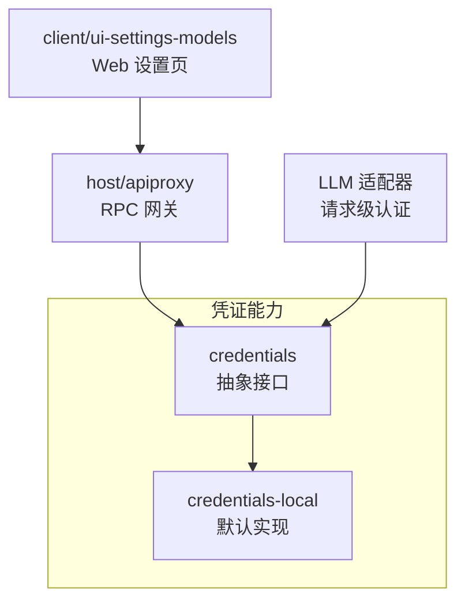
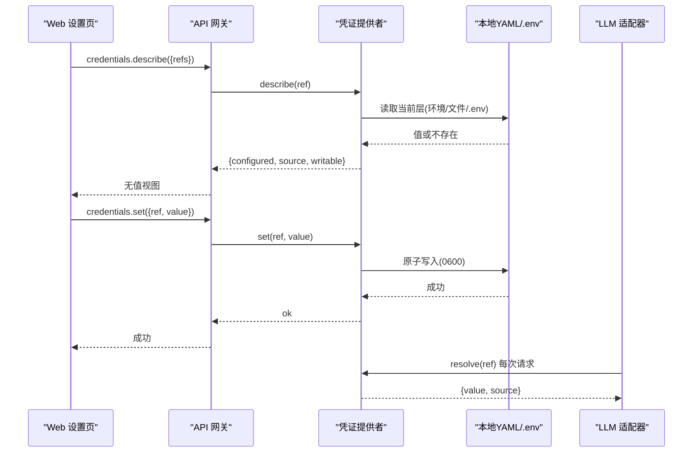
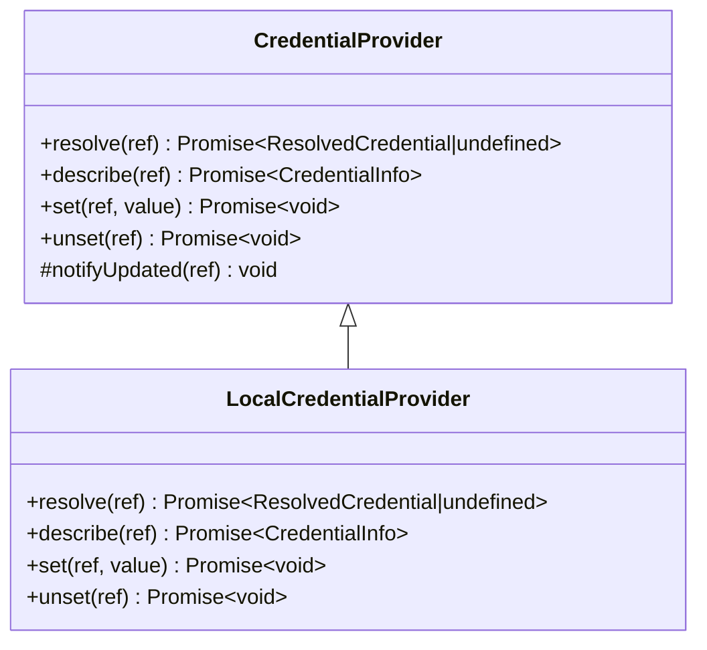
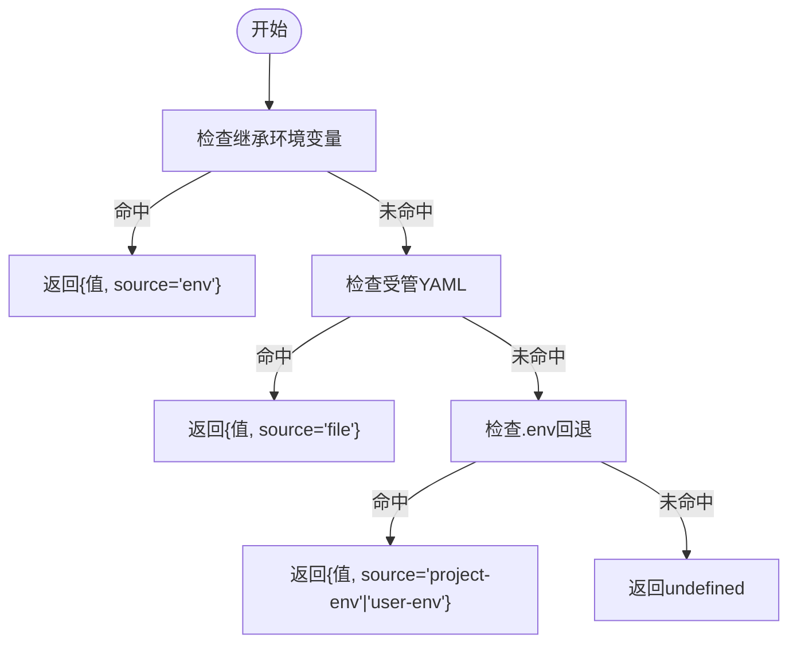
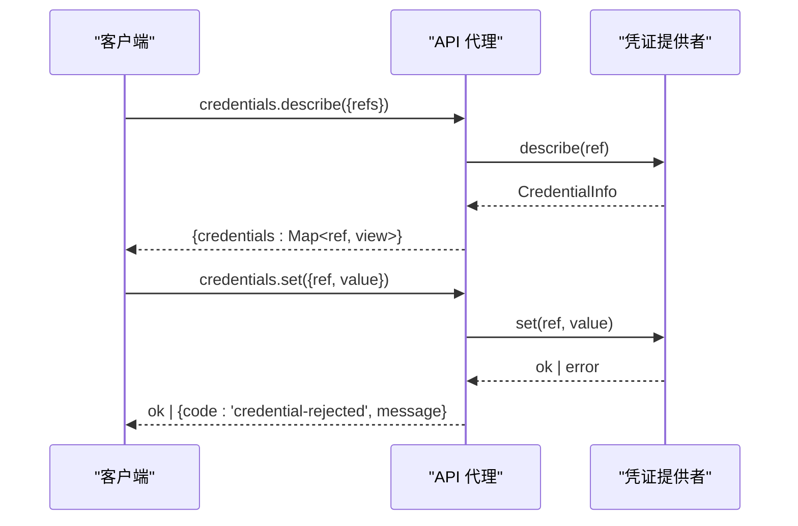
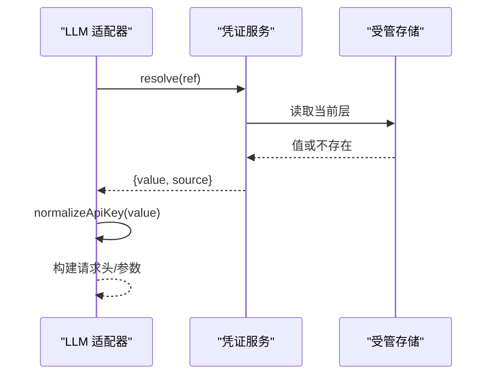
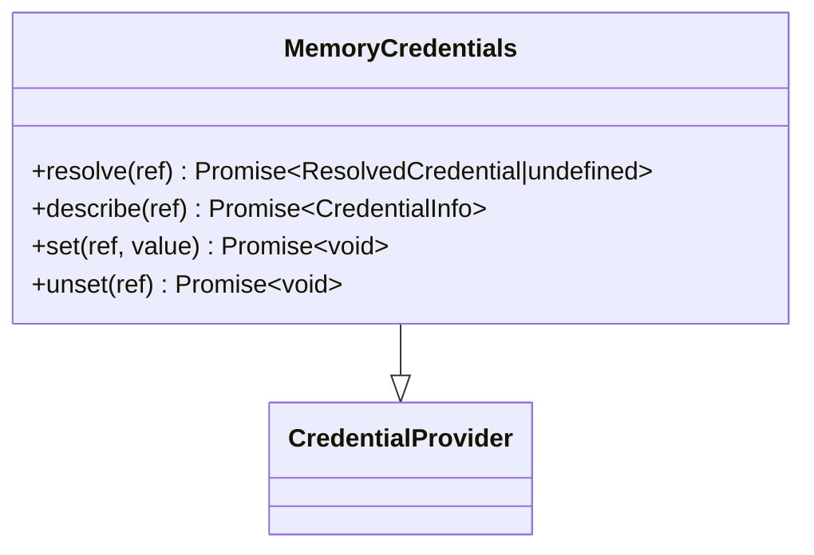
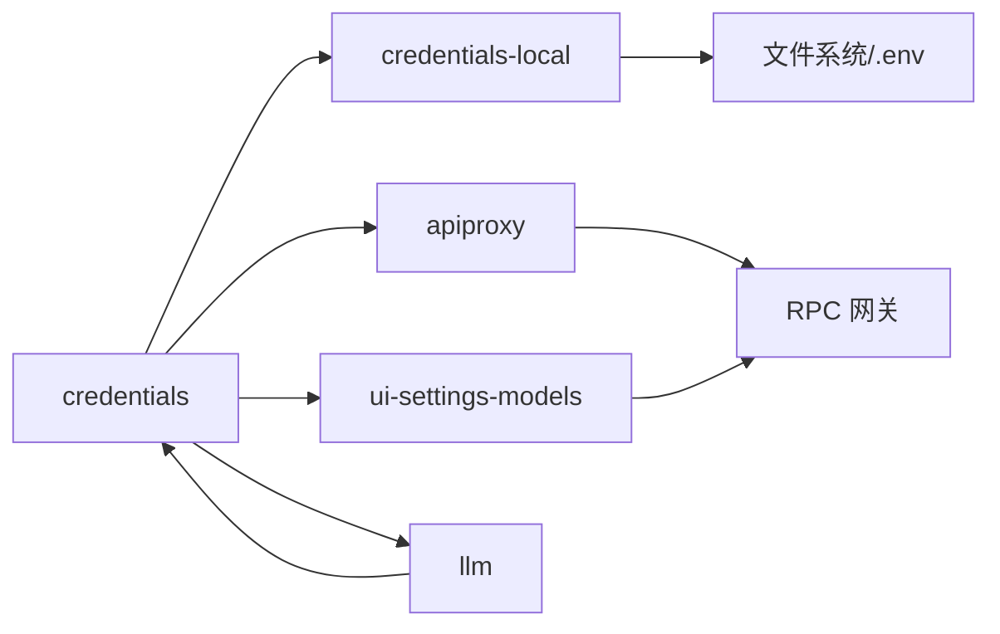

# 凭证提供商接缝

<cite>
**本文引用的文件**
- [packages/credentials/credentials/src/index.ts](file://packages/credentials/credentials/src/index.ts)
- [packages/credentials/credentials/src/types.ts](file://packages/credentials/credentials/src/types.ts)
- [packages/credentials/credentials-local/src/index.ts](file://packages/credentials/credentials-local/src/index.ts)
- [packages/host/apiproxy/src/api-proxy.ts](file://packages/host/apiproxy/src/api-proxy.ts)
- [packages/host/apiproxy/src/api/credentials.ts](file://packages/host/apiproxy/src/api/credentials.ts)
- [packages/client/ui-settings-models/src/client/store.ts](file://packages/client/ui-settings-models/src/client/store.ts)
- [packages/llm/llm/src/api-key.ts](file://packages/llm/llm/src/api-key.ts)
- [packages/credentials/credentials/tests/memory.ts](file://packages/credentials/credentials/tests/memory.ts)
- [docs/subsystems/credentials.md](file://docs/subsystems/credentials.md)
</cite>

## 目录
1. [简介](#简介)
2. [项目结构](#项目结构)
3. [核心组件](#核心组件)
4. [架构总览](#架构总览)
5. [详细组件分析](#详细组件分析)
6. [依赖关系分析](#依赖关系分析)
7. [性能考量](#性能考量)
8. [故障排查指南](#故障排查指南)
9. [结论](#结论)
10. [附录](#附录)

## 简介
本文件系统化说明“凭证提供商接缝”的设计与实现：通过 ctx.credentials 将配置中的密钥引用与实际值解耦，支持每操作解析、热更新与密钥轮换；详细说明 credentials-local 的层级优先级、安全约束与可写性规则；解释 LLM 适配器与 API 代理如何借助凭证服务完成认证；提供自定义凭证提供商的实现范式与安全最佳实践；并说明 Web 网关如何通过无值视图与只写存储暴露能力。

## 项目结构
凭证能力由两个包组成：
- credentials：定义抽象 seam（CredentialProvider）、类型与事件契约，挂载到 ctx.credentials。
- credentials-local：基于进程环境、本地 YAML 文档与 .env 回退的默认实现，提供读写与热重载。
- host/apiproxy：对外暴露 credentials.describe/set/unset RPC，供 Web UI 调用。
- client/ui-settings-models：在模型设置页中查询凭证状态并驱动编辑流程。
- llm：API Key 规范化与校验，配合凭证服务在请求边界获取最新密钥。

图表来源
- [packages/credentials/credentials/src/index.ts:60-101](file://packages/credentials/credentials/src/index.ts#L60-L101)
- [packages/credentials/credentials-local/src/index.ts:207-331](file://packages/credentials/credentials-local/src/index.ts#L207-L331)
- [packages/host/apiproxy/src/api-proxy.ts:3321-3368](file://packages/host/apiproxy/src/api-proxy.ts#L3321-L3368)
- [packages/client/ui-settings-models/src/client/store.ts:141-171](file://packages/client/ui-settings-models/src/client/store.ts#L141-L171)
- [packages/llm/llm/src/api-key.ts:36-41](file://packages/llm/llm/src/api-key.ts#L36-L41)

章节来源
- [packages/credentials/credentials/src/index.ts:1-146](file://packages/credentials/credentials/src/index.ts#L1-L146)
- [packages/credentials/credentials-local/src/index.ts:1-497](file://packages/credentials/credentials-local/src/index.ts#L1-L497)
- [packages/host/apiproxy/src/api-proxy.ts:3321-3368](file://packages/host/apiproxy/src/api-proxy.ts#L3321-L3368)
- [packages/client/ui-settings-models/src/client/store.ts:141-171](file://packages/client/ui-settings-models/src/client/store.ts#L141-L171)
- [packages/llm/llm/src/api-key.ts:1-42](file://packages/llm/llm/src/api-key.ts#L1-L42)

## 核心组件
- CredentialRef：POSIX 风格的环境变量名式标识，用于唯一命名一个凭证引用，构造时进行语法校验。
- ResolvedCredential：一次解析结果，包含非空值与来源层（如 env、file、project-env、user-env）。
- CredentialInfo：面向配置的元信息，描述是否已配置、当前来源层以及是否可写，绝不暴露实际值。
- CredentialProvider：抽象服务，提供 resolve/describe/set/unset 四个操作，统一语义：空值视为未配置；写入前拒绝被只读层遮蔽的情况；变更通过 credentials/updated 事件通知。

章节来源
- [packages/credentials/credentials/src/index.ts:16-101](file://packages/credentials/credentials/src/index.ts#L16-L101)
- [packages/credentials/credentials/src/types.ts:10-31](file://packages/credentials/credentials/src/types.ts#L10-L31)
- [docs/subsystems/credentials.md:18-50](file://docs/subsystems/credentials.md#L18-L50)

## 架构总览
凭证接缝的核心思想是“配置仅持有引用，运行时按操作解析”。LLM 适配器在每次请求前解析引用，从而天然支持密钥轮换；Web 设置页通过 describe 展示“已配置/来源/可写”等无值视图，并通过 set/unset 修改受管存储。

图表来源
- [packages/host/apiproxy/src/api-proxy.ts:3321-3368](file://packages/host/apiproxy/src/api-proxy.ts#L3321-L3368)
- [packages/credentials/credentials-local/src/index.ts:309-331](file://packages/credentials/credentials-local/src/index.ts#L309-L331)
- [packages/credentials/credentials-local/src/index.ts:369-403](file://packages/credentials/credentials-local/src/index.ts#L369-L403)
- [packages/llm/llm/src/api-key.ts:36-41](file://packages/llm/llm/src/api-key.ts#L36-L41)

## 详细组件分析

### 抽象凭证服务（ctx.credentials）
- 设计目标：将“配置中的引用”和“实际值”分离，避免把密钥持久化进配置；消费者在每个操作边界重新解析，确保热更新生效。
- 关键方法：
  - resolve：返回当前值与来源层，未配置返回 undefined。
  - describe：返回 configured/source/writable，不暴露值。
  - set/unset：对受管源进行持久化写入或删除，空值拒绝，且当存在只读层遮蔽时拒绝写入。
- 事件：credentials/updated 在提交变更后发出，用于刷新界面徽章等，监听失败被隔离记录。

图表来源
- [packages/credentials/credentials/src/index.ts:60-143](file://packages/credentials/credentials/src/index.ts#L60-L143)
- [packages/credentials/credentials-local/src/index.ts:207-331](file://packages/credentials/credentials-local/src/index.ts#L207-L331)

章节来源
- [packages/credentials/credentials/src/index.ts:16-143](file://packages/credentials/credentials/src/index.ts#L16-L143)
- [docs/subsystems/credentials.md:62-102](file://docs/subsystems/credentials.md#L62-L102)

### 本地凭证提供商（credentials-local）
- 层级与优先级（从高到低）：
  - 继承进程环境（只读，最高优先级）
  - $DSH_HOME/.credentials.yaml（受管、可写）
  - 调用项目 .env（只读回退）
  - $DSH_HOME/.env（只读回退）
- 解析策略：
  - resolve：先查继承环境，再查受管文件，最后查 .env 回退。
  - describe：若来自继承环境则标记为不可写；否则根据受管文件或回退项判断可写性。
- 写入策略：
  - 使用文件锁与原子写入，权限 0600，目录 0700。
  - 写入前检查是否存在只读层遮蔽，若有则拒绝。
  - 写入后触发 notifyUpdated，发布 credentials/updated。
- 热重载：
  - 使用 chokidar 监听文件变化，去抖合并，替换内存快照并广播变更。
  - 启动时校验文件权限，防止其他用户可读。
- 解析文档：
  - 严格映射 CredentialRef→非空字符串，空值拒绝，键名必须合法。

图表来源
- [packages/credentials/credentials-local/src/index.ts:249-331](file://packages/credentials/credentials-local/src/index.ts#L249-L331)
- [packages/credentials/credentials-local/src/index.ts:424-482](file://packages/credentials/credentials-local/src/index.ts#L424-L482)

章节来源
- [packages/credentials/credentials-local/src/index.ts:1-497](file://packages/credentials/credentials-local/src/index.ts#L1-L497)

### Web 网关（API 代理）的凭证端点
- 暴露三个端点：
  - describe：批量查询多个引用，返回无值视图（configured/source/writable）。
  - set：持久化写入受管源，捕获异常并返回 credential-rejected。
  - unset：删除受管源中的引用，同样处理异常。
- 错误处理：当凭证服务缺失或底层拒绝时，返回结构化错误，便于前端提示。

图表来源
- [packages/host/apiproxy/src/api-proxy.ts:3321-3368](file://packages/host/apiproxy/src/api-proxy.ts#L3321-L3368)
- [packages/host/apiproxy/src/api/credentials.ts:31-44](file://packages/host/apiproxy/src/api/credentials.ts#L31-L44)

章节来源
- [packages/host/apiproxy/src/api-proxy.ts:3321-3368](file://packages/host/apiproxy/src/api-proxy.ts#L3321-L3368)
- [packages/host/apiproxy/src/api/credentials.ts:31-44](file://packages/host/apiproxy/src/api/credentials.ts#L31-L44)

### LLM 适配器与 API 代理的认证集成
- 每操作解析：LLM 适配器在每次请求前通过 ctx.credentials.resolve 获取最新密钥，无需重启即可生效。
- 密钥规范化：使用 normalizeApiKey 对传入的原始 key 进行修剪与合法性校验，非法字符直接拒绝，避免透传到上游产生模糊 401。
- 结合 Web 设置：设置页通过 credentials.describe 显示“已配置/来源/可写”，并在需要时调用 credentials.set 更新受管存储。

图表来源
- [packages/llm/llm/src/api-key.ts:36-41](file://packages/llm/llm/src/api-key.ts#L36-L41)
- [packages/credentials/credentials-local/src/index.ts:309-331](file://packages/credentials/credentials-local/src/index.ts#L309-L331)

章节来源
- [packages/llm/llm/src/api-key.ts:1-42](file://packages/llm/llm/src/api-key.ts#L1-L42)
- [packages/client/ui-settings-models/src/client/store.ts:141-171](file://packages/client/ui-settings-models/src/client/store.ts#L141-L171)

### 自定义凭证提供商实现模式
- 最小实现要点：
  - 继承 CredentialProvider，实现 resolve/describe/set/unset。
  - 遵循“空值即未配置”的统一规则。
  - 在 set/unset 成功后调用 notifyUpdated 发出变更事件。
  - 若存在只读层遮蔽（例如进程环境），describe 应报告 writable=false，set/unset 应拒绝。
- 参考示例：内存实现演示了基本行为与事件发射。

图表来源
- [packages/credentials/credentials/tests/memory.ts:9-49](file://packages/credentials/credentials/tests/memory.ts#L9-L49)
- [packages/credentials/credentials/src/index.ts:60-143](file://packages/credentials/credentials/src/index.ts#L60-L143)

章节来源
- [packages/credentials/credentials/tests/memory.ts:1-49](file://packages/credentials/credentials/tests/memory.ts#L1-L49)
- [packages/credentials/credentials/src/index.ts:60-143](file://packages/credentials/credentials/src/index.ts#L60-L143)

## 依赖关系分析
- credentials 包提供抽象与类型，被 credentials-local、apiproxy、client 与 llm 消费。
- credentials-local 依赖文件系统、chokidar、原子写入与路径工具，实现安全与热重载。
- apiproxy 将凭证能力暴露为 RPC，供 Web UI 调用。
- client 通过 describe 聚合凭证状态，辅助模型页面决策。
- llm 在请求边界解析凭证，保证密钥轮换即时生效。

图表来源
- [packages/credentials/credentials/src/index.ts:1-146](file://packages/credentials/credentials/src/index.ts#L1-L146)
- [packages/credentials/credentials-local/src/index.ts:1-497](file://packages/credentials/credentials-local/src/index.ts#L1-L497)
- [packages/host/apiproxy/src/api-proxy.ts:3321-3368](file://packages/host/apiproxy/src/api-proxy.ts#L3321-L3368)
- [packages/client/ui-settings-models/src/client/store.ts:141-171](file://packages/client/ui-settings-models/src/client/store.ts#L141-L171)
- [packages/llm/llm/src/api-key.ts:36-41](file://packages/llm/llm/src/api-key.ts#L36-L41)

章节来源
- [packages/credentials/credentials/src/index.ts:1-146](file://packages/credentials/credentials/src/index.ts#L1-L146)
- [packages/credentials/credentials-local/src/index.ts:1-497](file://packages/credentials/credentials-local/src/index.ts#L1-L497)
- [packages/host/apiproxy/src/api-proxy.ts:3321-3368](file://packages/host/apiproxy/src/api-proxy.ts#L3321-L3368)
- [packages/client/ui-settings-models/src/client/store.ts:141-171](file://packages/client/ui-settings-models/src/client/store.ts#L141-L171)
- [packages/llm/llm/src/api-key.ts:36-41](file://packages/llm/llm/src/api-key.ts#L36-L41)

## 性能考量
- 每操作解析：避免跨操作缓存，确保热更新立即生效，代价是每次解析需访问存储层；对于本地文件与 .env 回退，开销极低。
- 文件写入：使用原子写入与文件锁，保证并发安全；写入频率低，不影响主路径性能。
- 热重载：chokidar 监听+去抖，减少频繁重读；仅在内容变化时替换内存快照并广播。
- 事件分发：credentials/updated 的监听器失败被隔离记录，不会阻塞或影响已提交的写入。

[本节为通用指导，不直接分析具体文件]

## 故障排查指南
- 写入被拒绝（credential-rejected）：
  - 可能原因：存在只读层遮蔽（如进程环境变量同名键），或凭证服务缺失。
  - 处理：确认环境变量是否覆盖；如需修改，请从启动 dsh 的 shell 中取消该变量。
- 无法解析凭证：
  - 可能原因：引用未配置或值为空；空值被视为未配置。
  - 处理：通过 describe 查看 configured/source/writable；必要时调用 set 写入受管存储。
- 热重载无效：
  - 可能原因：文件权限不正确（非 0600）导致拒绝读取；或监听器报错。
  - 处理：修正文件权限；检查日志中 reload failed 警告。
- 事件监听失败：
  - 现象：credentials/updated 监听器抛出异常。
  - 处理：查看日志；注意 INVARIANT 编码的失败会重抛，需修复监听逻辑。

章节来源
- [packages/host/apiproxy/src/api-proxy.ts:3321-3368](file://packages/host/apiproxy/src/api-proxy.ts#L3321-L3368)
- [packages/credentials/credentials-local/src/index.ts:424-482](file://packages/credentials/credentials-local/src/index.ts#L424-L482)
- [packages/credentials/credentials/src/index.ts:104-143](file://packages/credentials/credentials/src/index.ts#L104-L143)

## 结论
凭证提供商接缝通过“引用与值分离 + 每操作解析”的模式，实现了安全的密钥管理与无缝的热更新。credentials-local 提供了生产可用的默认实现，具备严格的权限控制与并发安全。Web 网关以无值视图暴露状态，并以只写存储管理敏感数据。LLM 适配器在请求边界解析凭证，确保密钥轮换即时生效。遵循本文的最佳实践，可安全扩展自定义凭证提供商并集成到现有生态。

[本节为总结，不直接分析具体文件]

## 附录
- 安全最佳实践
  - 密钥存储：优先使用进程环境变量或受管文件（0600），避免将密钥写入普通配置文件。
  - 访问控制：限制对凭证文件的访问权限；禁止向外部暴露实际值。
  - 审计日志：记录 credentials/updated 事件及失败监听器的诊断信息，但不记录敏感值。
  - 只读层保护：当存在进程环境变量遮蔽时，明确标记为不可写并拒绝 set/unset。
  - 传输安全：对携带凭证的请求禁用自动重定向，防止凭据泄露到未知目的地。
- 开发自定义提供商的步骤
  - 继承 CredentialProvider，实现 resolve/describe/set/unset。
  - 遵循空值即未配置、只读层遮蔽拒绝写入的规则。
  - 在 set/unset 成功后调用 notifyUpdated 发出变更事件。
  - 编写测试用例覆盖解析、写入、热重载与事件分发。

[本节为通用指导，不直接分析具体文件]