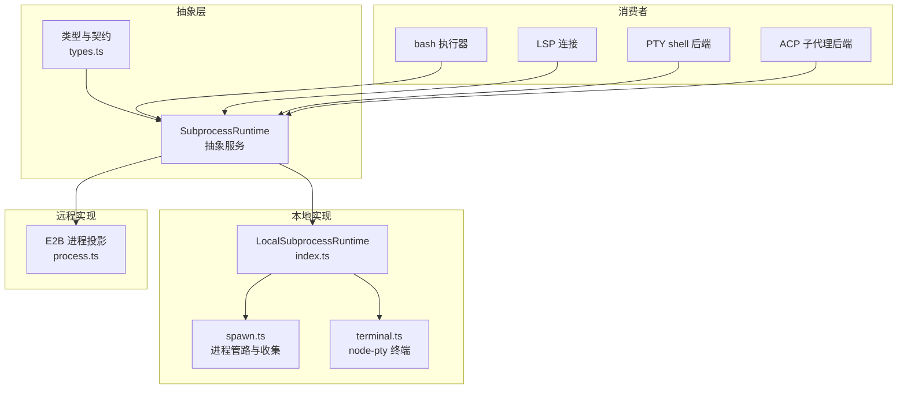
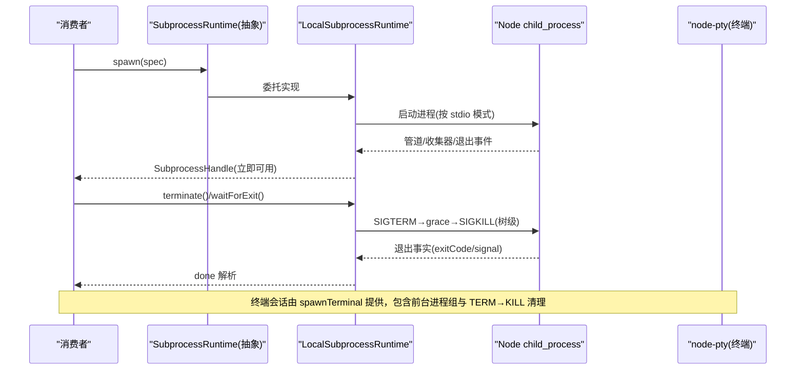
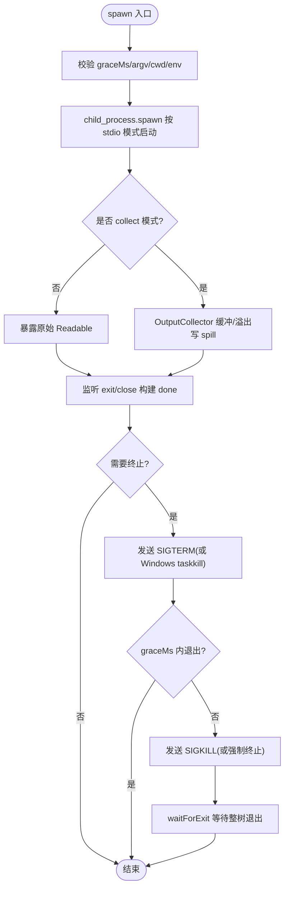
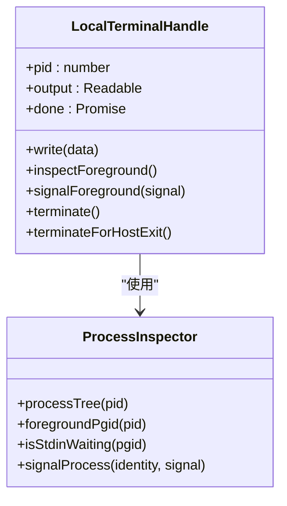
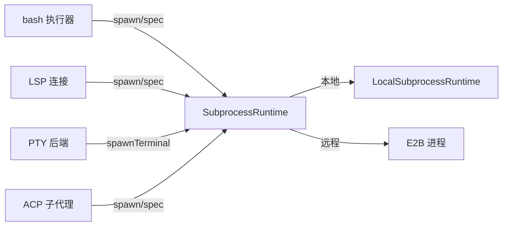

# 子进程执行接缝

<cite>
**本文引用的文件**
- [packages/subprocess/subprocess/src/index.ts](file://packages/subprocess/subprocess/src/index.ts)
- [packages/subprocess/subprocess/src/types.ts](file://packages/subprocess/subprocess/src/types.ts)
- [packages/subprocess/subprocess-local/src/index.ts](file://packages/subprocess/subprocess-local/src/index.ts)
- [packages/subprocess/subprocess-local/src/spawn.ts](file://packages/subprocess/subprocess-local/src/spawn.ts)
- [packages/subprocess/subprocess-local/src/terminal.ts](file://packages/subprocess/subprocess-local/src/terminal.ts)
- [packages/e2b/subprocess-e2b/src/process.ts](file://packages/e2b/subprocess-e2b/src/process.ts)
- [packages/shell/bash-local/src/index.ts](file://packages/shell/bash-local/src/index.ts)
- [packages/lsp/lsp-stdio/src/connection.ts](file://packages/lsp/lsp-stdio/src/connection.ts)
- [packages/terminal/terminal-bash/src/index.ts](file://packages/terminal/terminal-bash/src/index.ts)
- [packages/terminal/terminal-bash/src/session.ts](file://packages/terminal/terminal-bash/src/session.ts)
- [packages/subagent/subagent-acp/src/run.ts](file://packages/subagent/subagent-acp/src/run.ts)
- [packages/subagent/subagent-acp/src/index.ts](file://packages/subagent/subagent-acp/src/index.ts)
- [docs/subsystems/subprocess.md](file://docs/subsystems/subprocess.md)
</cite>

## 目录
1. [简介](#简介)
2. [项目结构](#项目结构)
3. [核心组件](#核心组件)
4. [架构总览](#架构总览)
5. [详细组件分析](#详细组件分析)
6. [依赖关系分析](#依赖关系分析)
7. [性能与资源管理](#性能与资源管理)
8. [故障排查指南](#故障排查指南)
9. [结论](#结论)
10. [附录：使用示例与最佳实践](#附录使用示例与最佳实践)

## 简介
本文件系统化说明“子进程执行接缝”（ctx.subprocess）的设计目标、能力边界与实现差异，解释它如何为 bash 执行器、PTY shell 后端、LSP 主机和外部子代理后端提供统一的进程管理接口。重点覆盖进程坐标管理、树/会话生命周期、stdio 处置、终端机制、终止升级、以及 subprocess-local 与 subprocess-e2b 两种实现的区别与适用场景。同时给出安全执行外部进程的使用范式与监控、内存限制、超时处理、错误恢复等最佳实践。

## 项目结构
- 抽象服务定义与类型契约位于 dsh-subprocess（ctx.subprocess），统一描述可执行解析、spawn、spawnTerminal 及句柄语义。
- 本地实现 dsh-subprocess-local 基于 Node child_process 与 node-pty，提供进程树、stdio 收集、信号升级与终端会话。
- 远程实现 dsh-subprocess-e2b 将命令投影到 E2B 沙箱中运行，通过状态目录与输出流桥接同一接口。
- 消费者包括：
  - bash 执行器：以收集模式获取批输出，结合超时与取消。
  - LSP 主机：以原始管道承载 JSON-RPC 协议。
  - PTY shell 后端：通过 spawnTerminal 获得控制终端与前台进程组能力。
  - 外部 ACP/Codex/Claude Code 子代理后端：以 ndjson/协议通道驱动子进程并负责清理。

图表来源
- [packages/subprocess/subprocess/src/index.ts:102-140](file://packages/subprocess/subprocess/src/index.ts#L102-L140)
- [packages/subprocess/subprocess/src/types.ts:75-194](file://packages/subprocess/subprocess/src/types.ts#L75-L194)
- [packages/subprocess/subprocess-local/src/index.ts:37-184](file://packages/subprocess/subprocess-local/src/index.ts#L37-L184)
- [packages/subprocess/subprocess-local/src/spawn.ts:326-543](file://packages/subprocess/subprocess-local/src/spawn.ts#L326-L543)
- [packages/subprocess/subprocess-local/src/terminal.ts:35-249](file://packages/subprocess/subprocess-local/src/terminal.ts#L35-L249)
- [packages/e2b/subprocess-e2b/src/process.ts:186-350](file://packages/e2b/subprocess-e2b/src/process.ts#L186-L350)

章节来源
- [docs/subsystems/subprocess.md:1-325](file://docs/subsystems/subprocess.md#L1-L325)

## 核心组件
- 抽象服务 SubprocessRuntime：定义 resolveExecutable、spawn、spawnTerminal 的契约；暴露 DSH_ENV_PREFIX 与凭据清洗函数。
- 类型与数据模型：SubprocessSpawnSpec、SubprocessHandle、SubprocessOutcome、SubprocessOutputReader/CollectedOutputs、SubprocessTerminal* 系列。
- 本地实现 LocalSubprocessRuntime：维护 live handles 与 terminals 集合，在宿主退出时强制终止；resolveExecutable 校验绝对路径或 PATH 查找；spawn 返回立即可用的句柄；spawnTerminal 基于 node-pty。
- 远程实现 E2B 进程：将 spec 映射为远端命令，使用状态目录持久化 pid/环境/输出，按 collect/pipe 模式桥接输出与读取。

章节来源
- [packages/subprocess/subprocess/src/index.ts:16-66](file://packages/subprocess/subprocess/src/index.ts#L16-L66)
- [packages/subprocess/subprocess/src/types.ts:12-194](file://packages/subprocess/subprocess/src/types.ts#L12-L194)
- [packages/subprocess/subprocess-local/src/index.ts:37-184](file://packages/subprocess/subprocess-local/src/index.ts#L37-L184)
- [packages/e2b/subprocess-e2b/src/process.ts:186-350](file://packages/e2b/subprocess-e2b/src/process.ts#L186-L350)

## 架构总览
子进程执行接缝将“执行世界坐标”（文件系统 + 进程命名空间）与“进程生命周期管理”解耦为可替换提供者。调用方仅依赖 ctx.subprocess，无需感知底层是本地进程还是远程沙箱。

图表来源
- [packages/subprocess/subprocess/src/index.ts:102-140](file://packages/subprocess/subprocess/src/index.ts#L102-L140)
- [packages/subprocess/subprocess-local/src/index.ts:146-184](file://packages/subprocess/subprocess-local/src/index.ts#L146-L184)
- [packages/subprocess/subprocess-local/src/spawn.ts:326-543](file://packages/subprocess/subprocess-local/src/spawn.ts#L326-L543)
- [packages/subprocess/subprocess-local/src/terminal.ts:35-249](file://packages/subprocess/subprocess-local/src/terminal.ts#L35-L249)

## 详细组件分析

### 抽象服务与类型契约
- 职责：定义执行世界坐标、可执行解析、普通进程与终端原语；不引入默认值，所有行为由 spec 显式声明。
- 关键概念：
  - DSH_* 受管环境变量命名空间，合并前会清洗父环境中的敏感键与 DSH_* 项。
  - stdio 三种模式：ignore/pipe/collect；collect 支持内存尾缓存与 spill 文件恢复。
  - 句柄语义：terminate 唯一终止动词，tree-scoped；done 仅携带退出事实，原因分类由调用方决定。
  - 终端句柄：write/inspectForeground/signalForeground/terminate，保证会话级静默。

章节来源
- [packages/subprocess/subprocess/src/index.ts:16-66](file://packages/subprocess/subprocess/src/index.ts#L16-L66)
- [packages/subprocess/subprocess/src/types.ts:12-194](file://packages/subprocess/subprocess/src/types.ts#L12-L194)
- [docs/subsystems/subprocess.md:39-134](file://docs/subsystems/subprocess.md#L39-L134)

### 本地实现：进程与收集器
- 进程树与信号：POSIX 使用进程组负 pid 发送信号，Windows 使用 taskkill /T；失败容错且幂等。
- 收集器 OutputCollector：内存尾 + 可选 spill 文件；溢出后写入 spill，readFrom 支持整流偏移增量读取，lossy 指示丢失段。
- 终止升级：terminate 触发 SIGTERM→graceMs→SIGKILL；waitForExit 观察整棵树直到退出。
- 宿主退出：同步强制终止所有托管进程与终端，避免孤儿。

图表来源
- [packages/subprocess/subprocess-local/src/spawn.ts:326-543](file://packages/subprocess/subprocess-local/src/spawn.ts#L326-L543)

章节来源
- [packages/subprocess/subprocess-local/src/spawn.ts:30-251](file://packages/subprocess/subprocess-local/src/spawn.ts#L30-L251)
- [packages/subprocess/subprocess-local/src/index.ts:79-102](file://packages/subprocess/subprocess-local/src/index.ts#L79-L102)

### 本地实现：终端句柄（node-pty）
- 会话成员追踪：通过 ProcessInspector 扫描进程树与会话，记录根进程身份，防止 PID 重用污染。
- 前台进程组：inspectForeground 返回 pgid 与输入等待标志；signalForeground 向当前前台组发信号（禁止对顶层 shell 直接 SIGKILL）。
- 终止流程：TERM→KILL 逐级作用于子成员与顶层 shell，直至全部静默；host exit 时同步强杀。

图表来源
- [packages/subprocess/subprocess-local/src/terminal.ts:35-249](file://packages/subprocess/subprocess-local/src/terminal.ts#L35-L249)

章节来源
- [packages/subprocess/subprocess-local/src/terminal.ts:35-249](file://packages/subprocess/subprocess-local/src/terminal.ts#L35-L249)

### 远程实现：E2B 子进程
- 设计要点：异步启动命令，使用状态目录保存 pid/环境/输出；stdout/stderr 通过 base64 帧传输，本地解码并接入 pipe/collect。
- 生命周期：prepareState → sandbox.commands.run(background) → wait()；无效 pid 时回滚并标记静默。
- 与本地差异：无原生进程组，需依赖远端 API 与状态文件；输出延迟与网络抖动需容忍。

章节来源
- [packages/e2b/subprocess-e2b/src/process.ts:186-350](file://packages/e2b/subprocess-e2b/src/process.ts#L186-L350)

### 消费者集成

#### Bash 执行器
- 使用 collect 模式捕获 stdout/stderr，设置 maxBytes 与 spill 容量；通过 deadline 生成 AbortSignal 驱动超时与取消；结果区分 timedOut/aborted。
- 典型调用：runArgv → ctx.subprocess.spawn → handle.done → collected 读取最终输出。

章节来源
- [packages/shell/bash-local/src/index.ts:173-267](file://packages/shell/bash-local/src/index.ts#L173-L267)

#### LSP 主机
- 使用 pipe 模式传递 JSON-RPC；stdin 用于请求，stdout 用于响应；stderr 可继承或收集诊断；关闭时等待 done 并清理 pending 请求。

章节来源
- [packages/lsp/lsp-stdio/src/connection.ts:1-132](file://packages/lsp/lsp-stdio/src/connection.ts#L1-L132)

#### PTY shell 后端
- 通过 ctx.subprocess.spawnTerminal 分配真实终端，传入 rows/cols/graceMs 与环境；后端负责提示符检测、就绪推断与滚动历史。
- 会话封装 LocalPtySession，管理发送操作、滚动缓冲与状态机。

章节来源
- [packages/terminal/terminal-bash/src/index.ts:102-153](file://packages/terminal/terminal-bash/src/index.ts#L102-L153)
- [packages/terminal/terminal-bash/src/session.ts:155-186](file://packages/terminal/terminal-bash/src/session.ts#L155-L186)

#### 外部 ACP/Codex/Claude Code 子代理后端
- 每次 start 启动全新子进程，通过 ACP 协议初始化会话并驱动 prompt；dispose 先关闭 stdin 让子进程 flush，再调用 terminate 并 waitForExit 确保整树退出。
- 环境默认清洗，密钥需显式传入；错误被归并为 stopReason 上报。

章节来源
- [packages/subagent/subagent-acp/src/run.ts:88-204](file://packages/subagent/subagent-acp/src/run.ts#L88-L204)
- [packages/subagent/subagent-acp/src/index.ts:151-171](file://packages/subagent/subagent-acp/src/index.ts#L151-L171)

## 依赖关系分析
- 抽象层对实现层松耦合：消费者仅依赖 ctx.subprocess，屏蔽本地/远程差异。
- 本地实现依赖 Node child_process 与 node-pty；远程实现依赖 E2B SDK。
- 消费者通过 spec 显式配置 stdio、cwd、env、graceMs、signal，避免隐式默认带来的不一致。

图表来源
- [packages/subprocess/subprocess/src/index.ts:102-140](file://packages/subprocess/subprocess/src/index.ts#L102-L140)
- [packages/subprocess/subprocess-local/src/index.ts:37-184](file://packages/subprocess/subprocess-local/src/index.ts#L37-L184)
- [packages/e2b/subprocess-e2b/src/process.ts:186-350](file://packages/e2b/subprocess-e2b/src/process.ts#L186-L350)

章节来源
- [docs/subsystems/subprocess.md:247-325](file://docs/subsystems/subprocess.md#L247-L325)

## 性能与资源管理
- 内存限制：collect 模式的 maxBytes 控制内存占用；spill 文件用于完整流恢复，注意 maxSpillBytes 限制磁盘增长。
- 超时与取消：调用方通过 AbortSignal 驱动超时；seam 仅在 abort 时触发 terminate 升级，不替调用方做原因分类。
- 树级终止：POSIX 进程组 + Windows taskkill /T；graceMs 控制温和到强制的过渡；waitForExit 保证整树静默。
- 终端会话：TERM→KILL 逐级作用于前台组与子成员；host exit 同步强杀，避免孤儿。
- 远程实现：E2B 命令后台运行，输出经 base64 帧传输；需考虑网络延迟与重试。

[本节为通用指导，不直接分析具体文件]

## 故障排查指南
- 可执行未找到：resolveExecutable 拒绝相对路径，PATH 查找失败抛出稳定错误；检查 command 是否为绝对路径或裸名。
- 权限/不可执行：stat/access X_OK 失败；确认文件存在且可执行。
- 管道断开：LSP 子进程 stdin 错误视为致命关闭；pending 请求立即失败。
- 子进程未退出：waitForExit 配合 treeAlive 轮询；必要时检查是否有后代继承了管道导致阻塞。
- 终端无法清理：inspectForeground 失败或前台组不可达；确认平台能力与进程表可用。
- E2B 异常：无效 pid、命令不存在、沙箱缺失；参考 CommandExitError/FileNotFoundError/SandboxNotFoundError。

章节来源
- [packages/subprocess/subprocess-local/src/index.ts:104-135](file://packages/subprocess/subprocess-local/src/index.ts#L104-L135)
- [packages/lsp/lsp-stdio/src/connection.ts:102-132](file://packages/lsp/lsp-stdio/src/connection.ts#L102-L132)
- [packages/subprocess/subprocess-local/src/spawn.ts:380-425](file://packages/subprocess/subprocess-local/src/spawn.ts#L380-L425)
- [packages/e2b/subprocess-e2b/src/process.ts:314-350](file://packages/e2b/subprocess-e2b/src/process.ts#L314-L350)

## 结论
ctx.subprocess 通过抽象服务与统一类型契约，将执行世界坐标与进程生命周期管理从消费者中剥离，使 bash、LSP、PTY 与外部子代理能在本地与远程两种实现间无缝切换。其显式 spec、树级终止、收集/管道/继承三态 stdio、以及终端原语，构成了健壮、可审计、可移植的子进程执行基座。

[本节为总结性内容，不直接分析具体文件]

## 附录：使用示例与最佳实践

### 安全执行外部进程（范式）
- 使用 resolveExecutable 验证命令，避免相对路径与不可执行文件。
- 构造 SubprocessSpawnSpec：
  - argv：精确程序与参数，不经 shell 解释。
  - cwd：工作目录来自策略或用户选择。
  - stdio：协议类用 pipe，诊断用 inherit，批量输出用 collect（设置 maxBytes 与可选 spill）。
  - env：通过 childEnv 合并，显式传入必要密钥或 DSH_* 事实。
  - graceMs：合理设置，兼顾优雅退出与强制回收。
  - signal：绑定超时与上游取消。
- 使用 handle.stdin/stdout/stderr 进行协议通信；或使用 collected 增量读取。
- 使用 handle.terminate 与 handle.waitForExit 完成树级清理。

章节来源
- [packages/subprocess/subprocess/src/types.ts:75-194](file://packages/subprocess/subprocess/src/types.ts#L75-L194)
- [packages/subprocess/subprocess-local/src/spawn.ts:326-543](file://packages/subprocess/subprocess-local/src/spawn.ts#L326-L543)

### 终端会话（PTY）
- 通过 spawnTerminal 创建会话，传入 rows/cols/graceMs 与环境。
- 使用 write 发送文本，inspectForeground 查询前台组，signalForeground 发送信号。
- 使用 terminate 等待会话静默；host exit 时自动强杀。

章节来源
- [packages/subprocess/subprocess-local/src/terminal.ts:35-249](file://packages/subprocess/subprocess-local/src/terminal.ts#L35-L249)
- [packages/terminal/terminal-bash/src/index.ts:102-153](file://packages/terminal/terminal-bash/src/index.ts#L102-L153)

### 外部子代理（ACP/Codex/Claude Code）
- 每次 start 启动新子进程，initialize/newSession/prompt 完成后等待结果。
- dispose 先关闭 stdin 让子进程 flush，再 terminate 并 waitForExit 确保整树退出。
- 错误归并为 stopReason，日志记录便于定位。

章节来源
- [packages/subagent/subagent-acp/src/run.ts:88-204](file://packages/subagent/subagent-acp/src/run.ts#L88-L204)
- [packages/subagent/subagent-acp/src/index.ts:151-171](file://packages/subagent/subagent-acp/src/index.ts#L151-L171)

### 监控与资源管理最佳实践
- 内存：为 collect 设置合理的 maxBytes；启用 spill 以保留完整输出但限制 maxSpillBytes。
- 超时：使用 AbortSignal 驱动超时；seam 不替你做原因分类，调用方自行判断 timedOut/aborted。
- 错误恢复：对 spawn 失败与管道错误分别处理；LSP 中 stdin 错误视为致命关闭。
- 资源释放：始终调用 waitForExit 或 dispose 链，确保整树退出；宿主退出时依赖内置强制终止。

[本节为通用指导，不直接分析具体文件]