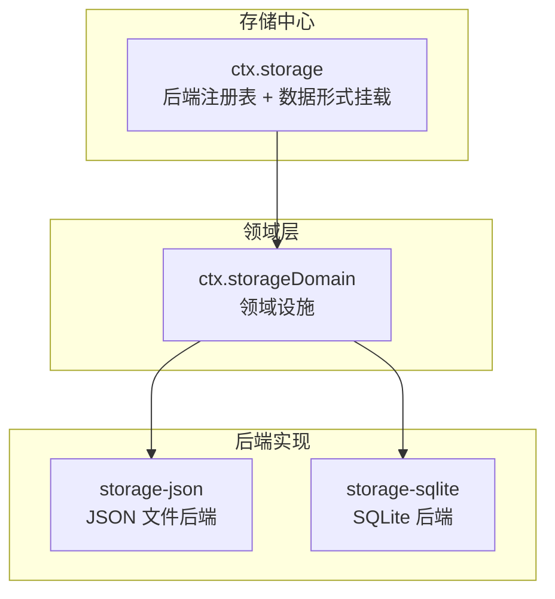
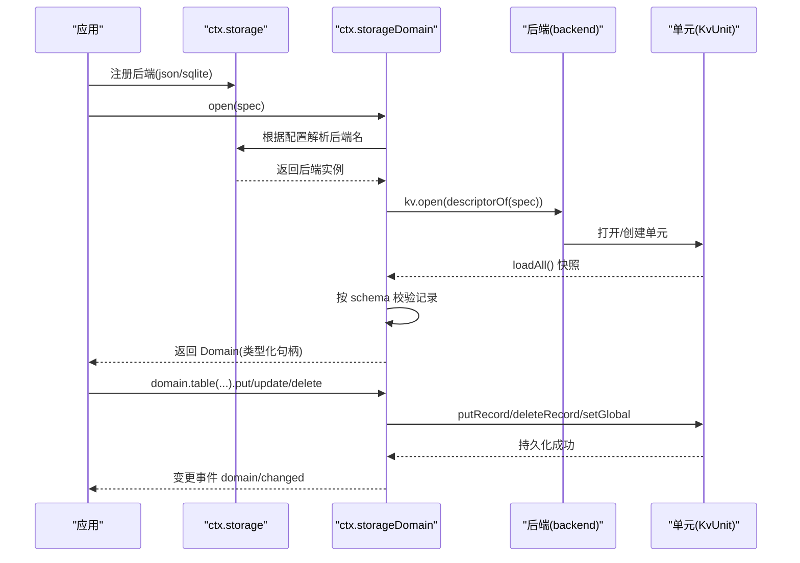
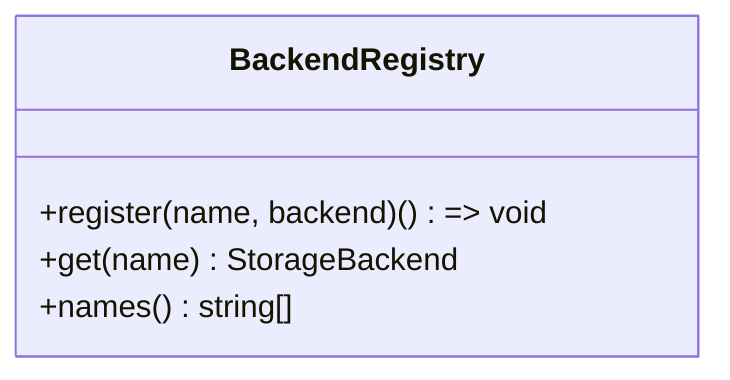
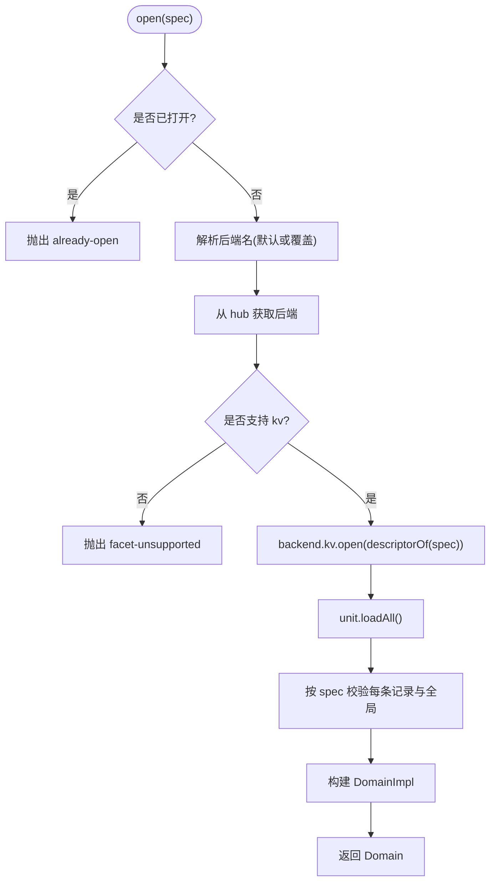
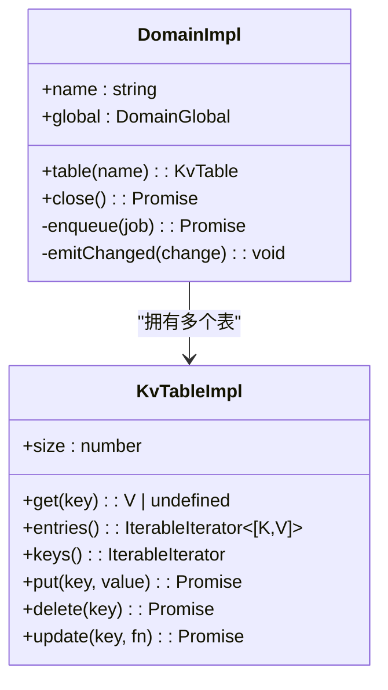
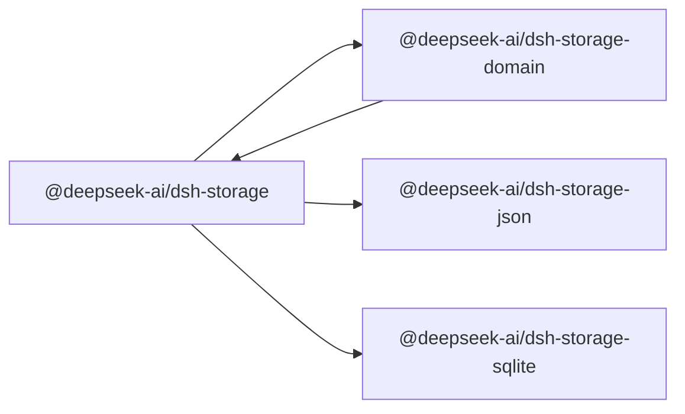

# 存储后端接缝

<cite>
**本文引用的文件**
- [packages/storage/storage/src/backend.ts](file://packages/storage/storage/src/backend.ts)
- [packages/storage/storage/src/registry.ts](file://packages/storage/storage/src/registry.ts)
- [packages/storage/storage/src/index.ts](file://packages/storage/storage/src/index.ts)
- [packages/storage/storage-domain/src/spec.ts](file://packages/storage/storage-domain/src/spec.ts)
- [packages/storage/storage-domain/src/domain.ts](file://packages/storage/storage-domain/src/domain.ts)
- [packages/storage/storage-domain/src/index.ts](file://packages/storage/storage-domain/src/index.ts)
- [packages/storage/storage-domain/src/events.ts](file://packages/storage/storage-domain/src/events.ts)
- [packages/storage/storage-json/src/index.ts](file://packages/storage/storage-json/src/index.ts)
- [packages/storage/storage-json/src/unit.ts](file://packages/storage/storage-json/src/unit.ts)
- [packages/storage/storage-sqlite/src/index.ts](file://packages/storage/storage-sqlite/src/index.ts)
- [packages/storage/storage-sqlite/src/schema.ts](file://packages/storage/storage-sqlite/src/schema.ts)
- [docs/subsystems/storage.md](file://docs/subsystems/storage.md)
</cite>

## 目录
1. [简介](#简介)
2. [项目结构](#项目结构)
3. [核心组件](#核心组件)
4. [架构总览](#架构总览)
5. [详细组件分析](#详细组件分析)
6. [依赖关系分析](#依赖关系分析)
7. [性能考量](#性能考量)
8. [故障排查指南](#故障排查指南)
9. [结论](#结论)
10. [附录：使用示例与最佳实践](#附录使用示例与最佳实践)

## 简介
本文件系统化说明“存储后端接缝”的设计与实现：以 ctx.storage 作为非会话存储中心，支持多种存储后端并存与选择；以 ctx.storageDomain 为类型化、可观察的持久状态服务；对比 storage-json 与 storage-sqlite 两种后端的特性与适用场景；并给出数据迁移与版本管理的最佳实践。

## 项目结构
存储子系统由四个包组成：
- storage：注册中心（hub），提供后端注册表与数据形式挂载点
- storage-domain：领域层，定义 DomainSpec、打开领域、发布变更事件
- storage-json：基于 JSON 文件的键值后端
- storage-sqlite：基于 SQLite 的键值后端

图表来源
- [packages/storage/storage/src/index.ts:135-159](file://packages/storage/storage/src/index.ts#L135-L159)
- [packages/storage/storage-domain/src/index.ts:41-62](file://packages/storage/storage-domain/src/index.ts#L41-L62)
- [packages/storage/storage-json/src/index.ts:16-35](file://packages/storage/storage-json/src/index.ts#L16-L35)
- [packages/storage/storage-sqlite/src/index.ts:18-48](file://packages/storage/storage-sqlite/src/index.ts#L18-L48)

章节来源
- [docs/subsystems/storage.md:9-24](file://docs/subsystems/storage.md#L9-L24)

## 核心组件
- 存储中心（ctx.storage）
  - 后端注册表：name → backend，支持多后端并存；重复注册或未知名称查找会抛出错误
  - 数据形式挂载：mount(form, facility)，form 为扩展型映射键；domain 形式由 storage-domain 挂载
- 领域设施（ctx.storageDomain）
  - 打开已声明的领域（spec），按配置路由到具体后端
  - 维护已打开领域的单例，确保同一领域名仅能打开一次
  - 在关闭时释放所有领域资源
- 后端契约（KvFacet/KvUnit）
  - 统一 KV 操作：open、loadAll、putRecord、deleteRecord、setGlobal、close
  - 每个调用原子且持久化成功后才返回；单位级并发写入顺序由调用方保证

章节来源
- [packages/storage/storage/src/registry.ts:14-62](file://packages/storage/storage/src/registry.ts#L14-L62)
- [packages/storage/storage/src/backend.ts:17-104](file://packages/storage/storage/src/backend.ts#L17-L104)
- [packages/storage/storage-domain/src/index.ts:69-177](file://packages/storage/storage-domain/src/index.ts#L69-L177)

## 架构总览
存储子系统采用“中心注册 + 领域路由 + 后端实现”的分层设计：
- 中心不直接做 IO，只负责注册与分发
- 领域层负责类型安全、校验、变更事件与内存快照
- 后端实现专注介质（文件或数据库）的原子持久化

图表来源
- [packages/storage/storage-json/src/index.ts:104-114](file://packages/storage/storage-json/src/index.ts#L104-L114)
- [packages/storage/storage-sqlite/src/index.ts:158-168](file://packages/storage/storage-sqlite/src/index.ts#L158-L168)
- [packages/storage/storage-domain/src/index.ts:100-156](file://packages/storage/storage-domain/src/index.ts#L100-L156)
- [packages/storage/storage-domain/src/domain.ts:307-346](file://packages/storage/storage-domain/src/domain.ts#L307-L346)

## 详细组件分析

### 存储中心：ctx.storage
- 职责
  - 后端注册表：register(name, backend) 返回解绑器；get(name) 解析后端；names() 诊断
  - 数据形式挂载：mount/form 用于扩展能力（如 domain）
- 关键行为
  - 重复注册同名后端抛错；未知名称查找抛错
  - 解绑仅移除注册项，不关闭后端；后端生命周期由插件 effect 管理

图表来源
- [packages/storage/storage/src/registry.ts:14-62](file://packages/storage/storage/src/registry.ts#L14-L62)

章节来源
- [packages/storage/storage/src/registry.ts:14-62](file://packages/storage/storage/src/registry.ts#L14-L62)
- [docs/subsystems/storage.md:9-24](file://docs/subsystems/storage.md#L9-L24)

### 领域层：ctx.storageDomain
- 职责
  - 打开领域：open(spec) 严格流程（命名冲突检查、后端路由、kv 能力检查、单元打开、快照加载与 schema 校验、构造领域对象）
  - 生命周期：closeAll() 关闭所有已打开领域；领域句柄由调用方持有并 close()
  - 变更事件：每次持久化成功后发出 domain/changed
- 类型安全
  - 通过 defineDomain/domainTable 声明领域结构与字段 schema，消费端获得强类型 API
- 路由策略
  - 默认后端 backend 与 per-domain routes 覆盖

图表来源
- [packages/storage/storage-domain/src/index.ts:100-156](file://packages/storage/storage-domain/src/index.ts#L100-L156)
- [packages/storage/storage-domain/src/spec.ts:79-112](file://packages/storage/storage-domain/src/spec.ts#L79-L112)

章节来源
- [packages/storage/storage-domain/src/index.ts:69-177](file://packages/storage/storage-domain/src/index.ts#L69-L177)
- [packages/storage/storage-domain/src/spec.ts:14-112](file://packages/storage/storage-domain/src/spec.ts#L14-L112)
- [packages/storage/storage-domain/src/domain.ts:96-119](file://packages/storage/storage-domain/src/domain.ts#L96-L119)

### 领域运行时：DomainImpl 与 KvTable
- 内存快照与写链
  - 读操作同步读取内存快照；写操作排队到单条写链，先持久化再更新内存，最后发出变更事件
  - update(key, fn) 在写链槽位内原子执行，避免并发交错
- 关闭语义
  - close() 拒绝新写入，等待队列排空，关闭单元，释放名称以便重新打开
- 事件
  - 每次 put/delete/global.set 成功后发出 domain/changed；监听器异常被捕获并记录警告

图表来源
- [packages/storage/storage-domain/src/domain.ts:140-277](file://packages/storage/storage-domain/src/domain.ts#L140-L277)
- [packages/storage/storage-domain/src/domain.ts:279-358](file://packages/storage/storage-domain/src/domain.ts#L279-L358)

章节来源
- [packages/storage/storage-domain/src/domain.ts:18-119](file://packages/storage/storage-domain/src/domain.ts#L18-L119)
- [packages/storage/storage-domain/src/domain.ts:279-358](file://packages/storage/storage-domain/src/domain.ts#L279-L358)

### 后端契约：KvFacet / KvUnit
- 约定
  - 每个后端拥有单一介质（文件或数据库）
  - 单元级方法：loadAll、putRecord、deleteRecord、setGlobal、close
  - 每个调用原子且持久化成功后才返回；关闭后调用抛错
- 版本与格式
  - 单元描述符携带 name/version/tables/hasGlobal；版本不匹配或无法解析将抛错

章节来源
- [packages/storage/storage/src/backend.ts:17-104](file://packages/storage/storage/src/backend.ts#L17-L104)

### storage-json 后端
- 特点
  - 每单元一个 JSON 文件；原子整文件重写
  - 无共享内存，适合人类可读与调试
- 适用场景
  - 本地开发、小规模数据、需要可观测性与可编辑性
- 关键实现
  - 打开时创建目录与文件；写入时原子替换文件；关闭时等待进行中写入并释放

章节来源
- [packages/storage/storage-json/src/index.ts:16-114](file://packages/storage/storage-json/src/index.ts#L16-L114)
- [packages/storage/storage-json/src/unit.ts:24-142](file://packages/storage/storage-json/src/unit.ts#L24-L142)

### storage-sqlite 后端
- 特点
  - 单库多单元；文档按行存储（key/value JSON）
  - 支持 WAL/rollback journal 模式；用户版本控制
- 适用场景
  - 高频更新、较大体量、需要事务与查询能力的场景
- 关键实现
  - 首次打开创建数据库与元数据表；按单元名与版本建立记录表；关闭时释放所有单元与连接

章节来源
- [packages/storage/storage-sqlite/src/index.ts:18-168](file://packages/storage/storage-sqlite/src/index.ts#L18-L168)
- [packages/storage/storage-sqlite/src/schema.ts:14-121](file://packages/storage/storage-sqlite/src/schema.ts#L14-L121)

### 变更事件：domain/changed
- 触发时机
  - 每次持久化成功后发出，遵循写链顺序
- 内容
  - 包含 domain/table/key/operation(value on put)
- 注意
  - 事件为通知，非事务参与者；监听器同步抛错不会回滚已持久化的写入

章节来源
- [packages/storage/storage-domain/src/events.ts:108-125](file://packages/storage/storage-domain/src/events.ts#L108-L125)
- [packages/storage/storage-domain/src/domain.ts:246-261](file://packages/storage/storage-domain/src/domain.ts#L246-L261)

## 依赖关系分析
- 耦合与内聚
  - storage 与 storage-domain 低耦合：后者通过 hub 的 registry 与 form 机制接入
  - 后端实现仅依赖 storage 契约，不感知领域层
- 外部依赖
  - Cordis 上下文与注入机制用于插件装配与生命周期管理
- 潜在循环
  - 通过“中心注册 + 形式挂载”避免循环依赖

图表来源
- [packages/storage/storage/src/index.ts:135-159](file://packages/storage/storage/src/index.ts#L135-L159)
- [packages/storage/storage-domain/src/index.ts:29-44](file://packages/storage/storage-domain/src/index.ts#L29-L44)
- [packages/storage/storage-json/src/index.ts:16-35](file://packages/storage/storage-json/src/index.ts#L16-L35)
- [packages/storage/storage-sqlite/src/index.ts:18-48](file://packages/storage/storage-sqlite/src/index.ts#L18-L48)

章节来源
- [packages/storage/storage/src/registry.ts:14-62](file://packages/storage/storage/src/registry.ts#L14-L62)
- [packages/storage/storage-domain/src/index.ts:29-62](file://packages/storage/storage-domain/src/index.ts#L29-L62)

## 性能考量
- 写路径
  - 领域层串行化写操作，避免并发竞争；每个调用原子持久化
  - JSON 后端整文件原子替换，适合小文件；大文件可能带来 I/O 压力
  - SQLite 后端按行存储，适合频繁更新与批量写入
- 读路径
  - 读操作同步自内存快照，稳定迭代器不受队列中写入影响
- 事件
  - 事件在持久化成功后发出，监听器异常隔离，不影响写入链路

[本节为通用指导，无需特定文件引用]

## 故障排查指南
- 常见错误
  - duplicate-backend：重复注册同名后端
  - backend-not-found：路由到未注册的后端
  - facet-unsupported：后端缺少 kv 能力
  - version-mismatch：介质版本与描述符不一致
  - malformed-medium：介质无法解析为当前单元
  - invalid-record：存储记录不符合 schema
  - missing-key：update 目标键不存在
  - closed：对已关闭的单元或领域进行操作
- 定位建议
  - 检查后端是否已注册且名称正确
  - 检查领域 spec 的版本与表名是否符合 UNIT_NAME_RE
  - 检查 JSON 文件或 SQLite 数据库是否损坏或被其他进程修改
  - 关注 domain/changed 事件，确认写入是否落地

章节来源
- [packages/storage/storage/src/registry.ts:25-52](file://packages/storage/storage/src/registry.ts#L25-L52)
- [packages/storage/storage-domain/src/index.ts:100-156](file://packages/storage/storage-domain/src/index.ts#L100-L156)
- [packages/storage/storage-domain/src/domain.ts:263-277](file://packages/storage/storage-domain/src/domain.ts#L263-L277)
- [packages/storage/storage-json/src/unit.ts:119-123](file://packages/storage/storage-json/src/unit.ts#L119-L123)
- [packages/storage/storage-sqlite/src/index.ts:75-96](file://packages/storage/storage-sqlite/src/index.ts#L75-L96)

## 结论
存储后端接缝通过“中心注册 + 领域路由 + 后端实现”实现了高内聚、低耦合的可插拔存储体系。领域层提供类型安全与一致性保障，后端实现专注介质持久化。JSON 与 SQLite 后端分别适用于不同规模与访问模式的场景。通过严格的版本与 schema 校验，系统具备良好的向后兼容性与可观测性。

[本节为总结，无需特定文件引用]

## 附录：使用示例与最佳实践

### 在应用中注册并使用存储域
- 步骤概览
  - 注册后端：在插件 apply 中调用 ctx.storage.backend.register('json'/'sqlite', backend)
  - 挂载领域：storage-domain 插件将 DomainFacility 挂载为 ctx.storage.domain，并提供 ctx.storageDomain
  - 打开领域：await ctx.storageDomain.open(spec)
  - 读写数据：domain.table('...').put/update/delete；domain.global.get()/set()
  - 监听变更：订阅 'domain/changed' 事件
  - 关闭资源：在 effect 解绑器中调用 domain.close()，或在插件卸载时由设施 closeAll()

章节来源
- [packages/storage/storage-json/src/index.ts:104-114](file://packages/storage/storage-json/src/index.ts#L104-L114)
- [packages/storage/storage-sqlite/src/index.ts:158-168](file://packages/storage/storage-sqlite/src/index.ts#L158-L168)
- [packages/storage/storage-domain/src/index.ts:200-220](file://packages/storage/storage-domain/src/index.ts#L200-L220)
- [packages/storage/storage-domain/src/domain.ts:96-119](file://packages/storage/storage-domain/src/domain.ts#L96-L119)

### 数据迁移与版本管理最佳实践
- 领域版本
  - 通过 DomainSpec.version 标识领域格式版本；版本不匹配将拒绝打开
  - 升级版本前，确保旧版本数据可被新 schema 解析或通过迁移脚本转换后再升级
- 数据库版本
  - SQLite 后端通过 user_version 管理物理布局版本；非当前版本将拒绝打开
  - 升级时需确保所有单元表结构与元数据一致
- Schema 校验
  - 使用 zod 定义 record 与 global 的 schema；任何不匹配都会抛出 invalid-record 并附带位置信息
- 命名规范
  - 领域名与表名需符合 UNIT_NAME_RE，确保可作为文件名与 SQL 标识符安全使用
- 兼容性策略
  - 保持向后兼容：新增字段允许缺失，删除字段需保留兼容逻辑或标记废弃
  - 谨慎处理 null：全局空值为“从未写入”的哨兵，schema 不应接受 null

章节来源
- [packages/storage/storage-domain/src/spec.ts:34-112](file://packages/storage/storage-domain/src/spec.ts#L34-L112)
- [packages/storage/storage-sqlite/src/schema.ts:14-108](file://packages/storage/storage-sqlite/src/schema.ts#L14-L108)
- [packages/storage/storage/src/backend.ts:9-55](file://packages/storage/storage/src/backend.ts#L9-L55)