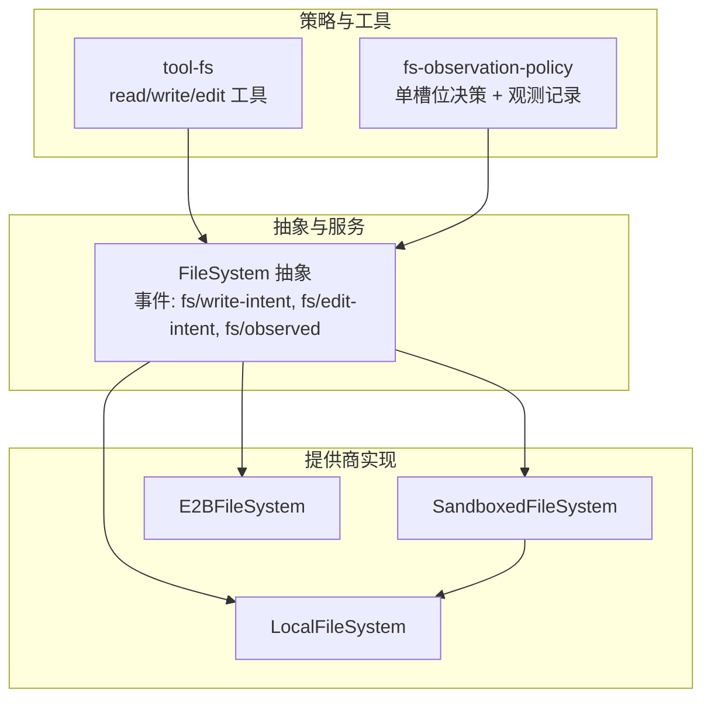
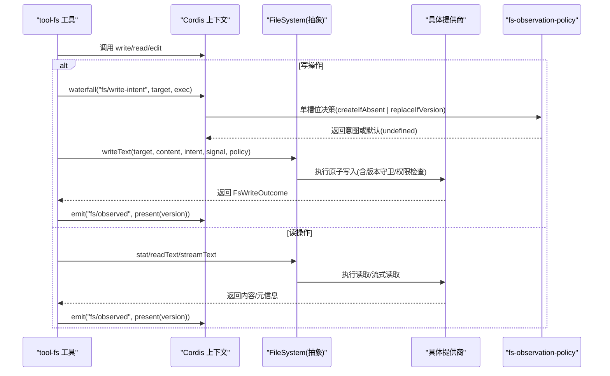
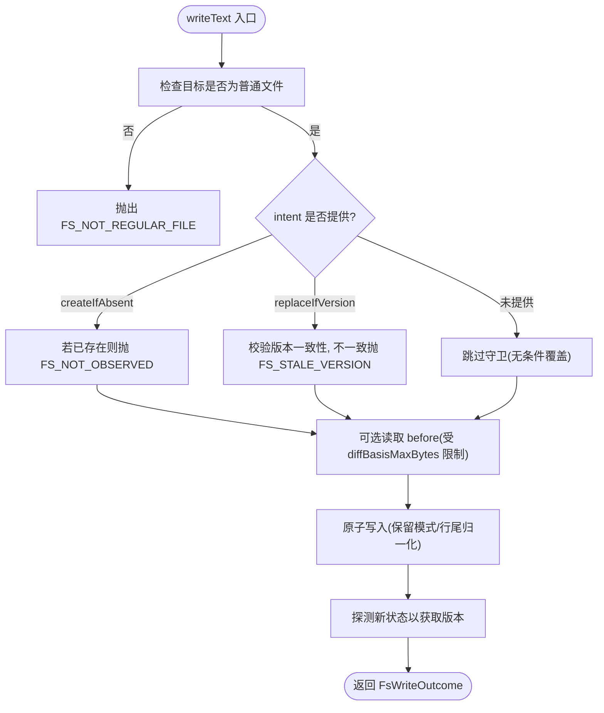
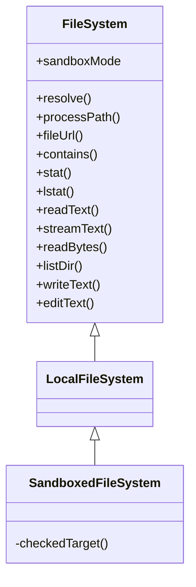
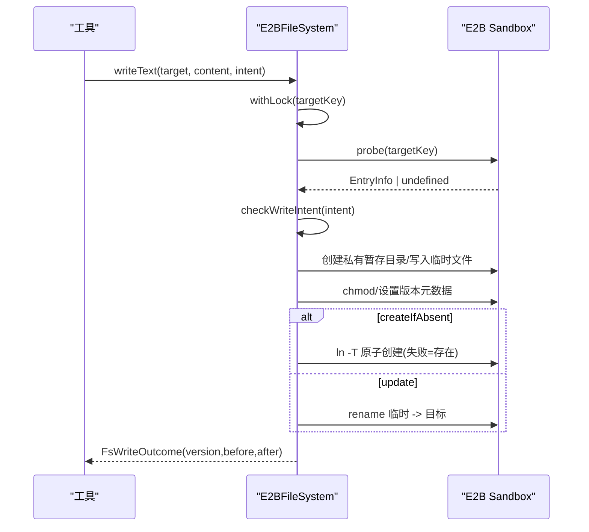
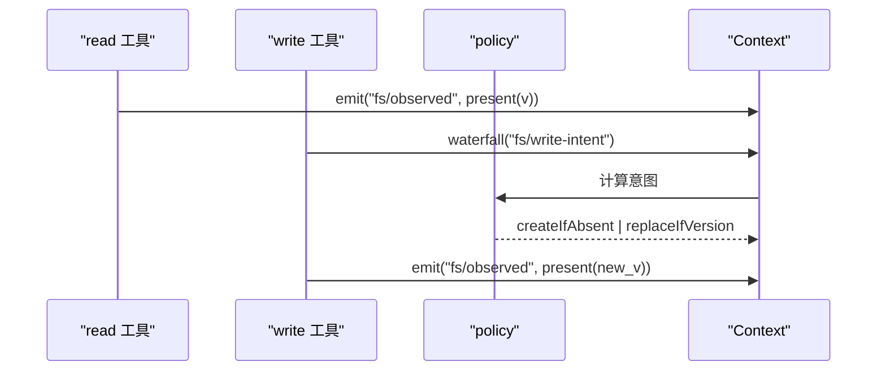
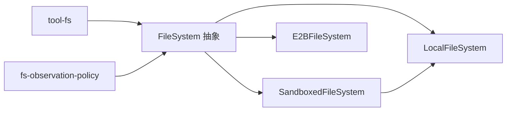

# 文件系统提供商接缝

<cite>
**本文引用的文件**
- [packages/fs/fs/src/index.ts](file://packages/fs/fs/src/index.ts)
- [packages/fs/fs/src/types.ts](file://packages/fs/fs/src/types.ts)
- [packages/fs/fs-local/src/index.ts](file://packages/fs/fs-local/src/index.ts)
- [packages/fs/fs-sandbox/src/index.ts](file://packages/fs/fs-sandbox/src/index.ts)
- [packages/e2b/fs-e2b/src/index.ts](file://packages/e2b/fs-e2b/src/index.ts)
- [packages/fs/fs-observation-policy/src/index.ts](file://packages/fs/fs-observation-policy/src/index.ts)
- [packages/fs/tool-fs/src/read.ts](file://packages/fs/tool-fs/src/read.ts)
- [packages/fs/tool-fs/src/write.ts](file://packages/fs/tool-fs/src/write.ts)
- [packages/fs/tool-fs/src/session-cwd.ts](file://packages/fs/tool-fs/src/session-cwd.ts)
- [docs/subsystems/filesystem.md](file://docs/subsystems/filesystem.md)
- [packages/fs/README.md](file://packages/fs/README.md)
</cite>

## 目录
1. [简介](#简介)
2. [项目结构](#项目结构)
3. [核心组件](#核心组件)
4. [架构总览](#架构总览)
5. [详细组件分析](#详细组件分析)
6. [依赖关系分析](#依赖关系分析)
7. [性能考量](#性能考量)
8. [故障排查指南](#故障排查指南)
9. [结论](#结论)
10. [附录](#附录)

## 简介
本文件系统化说明“文件系统提供商接缝”的设计与实现：以 ctx.fs 作为统一注册表，为 tool-fs 提供一致的文件操作接口；定义 fs-local、fs-sandbox、fs-e2b 三种提供商的职责与适用场景；阐述 fs-observation-policy 事件门控如何与工具层协作，保障读前观察、版本守卫与沙箱隔离；并提供自定义提供商的实现规范、示例路径、性能优化建议与错误恢复策略。

## 项目结构
围绕文件系统能力，仓库采用“抽象服务 + 多后端 + 策略插件 + 工具层”的分层组织：
- 抽象服务与类型：@deepseek-ai/dsh-fs（ctx.fs 契约、事件、错误码）
- 本地后端：@deepseek-ai/dsh-fs-local（进程内真实文件系统）
- 沙箱后端：@deepseek-ai/dsh-fs-sandbox（在本地后端之上增加每调用策略围栏）
- 远程后端：@deepseek-ai/dsh-fs-e2b（E2B 远端沙箱中的文件系统）
- 观察策略：@deepseek-ai/dsh-fs-observation-policy（基于事件的写意图/编辑意图决策与观测记录）
- 工具层：@deepseek-ai/dsh-tool-fs（read/write/edit 等模型可见工具，消费 ctx.fs 并触发事件）

图表来源
- [packages/fs/fs/src/index.ts:86-250](file://packages/fs/fs/src/index.ts#L86-L250)
- [packages/fs/fs-local/src/index.ts:64-266](file://packages/fs/fs-local/src/index.ts#L64-L266)
- [packages/fs/fs-sandbox/src/index.ts:59-152](file://packages/fs/fs-sandbox/src/index.ts#L59-L152)
- [packages/e2b/fs-e2b/src/index.ts:171-583](file://packages/e2b/fs-e2b/src/index.ts#L171-L583)
- [packages/fs/fs-observation-policy/src/index.ts:106-131](file://packages/fs/fs-observation-policy/src/index.ts#L106-L131)
- [packages/fs/tool-fs/src/read.ts:136-163](file://packages/fs/tool-fs/src/read.ts#L136-L163)
- [packages/fs/tool-fs/src/write.ts:102-129](file://packages/fs/tool-fs/src/write.ts#L102-L129)

章节来源
- [docs/subsystems/filesystem.md:290-426](file://docs/subsystems/filesystem.md#L290-L426)
- [packages/fs/README.md:19-24](file://packages/fs/README.md#L19-L24)

## 核心组件
- FileSystem 抽象类：定义 resolve/processPath/fileUrl/contains/stat/lstat/readText/streamText/readBytes/listDir/writeText/editText 等原子能力，以及 sandboxMode 能力声明。通过 Cordis Service 机制以 ctx.fs 暴露给上层。
- 类型与错误：FsTarget/FsVersion/FsObservation/FsWriteIntent/FsEditRequest 等强类型词汇；FsError 携带稳定 FsErrorCode，便于重试/权限/UI 分支。
- 工具层集成：tool-fs 的 read/write/edit 工具消费 ctx.fs，并在适当时机触发 fs/observed 事件；write/edit 通过 waterfall 获取 fs/write-intent 与 fs/edit-intent 的单槽位决策。

章节来源
- [packages/fs/fs/src/index.ts:86-250](file://packages/fs/fs/src/index.ts#L86-L250)
- [packages/fs/fs/src/types.ts:11-204](file://packages/fs/fs/src/types.ts#L11-L204)
- [packages/fs/tool-fs/src/read.ts:136-163](file://packages/fs/tool-fs/src/read.ts#L136-L163)
- [packages/fs/tool-fs/src/write.ts:102-129](file://packages/fs/tool-fs/src/write.ts#L102-L129)

## 架构总览
文件系统能力由“抽象服务 + 多后端 + 策略插件 + 工具层”构成。工具层不关心具体存储位置（本地/远端/沙箱），仅通过 ctx.fs 调用；策略插件通过事件决定写/编辑的意图与观测记录；后端负责原子写入、版本令牌、流式读取与错误映射。

图表来源
- [packages/fs/tool-fs/src/write.ts:102-129](file://packages/fs/tool-fs/src/write.ts#L102-L129)
- [packages/fs/tool-fs/src/read.ts:136-163](file://packages/fs/tool-fs/src/read.ts#L136-L163)
- [packages/fs/fs-observation-policy/src/index.ts:106-131](file://packages/fs/fs-observation-policy/src/index.ts#L106-L131)
- [packages/fs/fs/src/index.ts:44-78](file://packages/fs/fs/src/index.ts#L44-L78)

## 详细组件分析

### 抽象服务与类型（dsh-fs）
- 设计目的：将“目标标识、路径转换、包含性判断、元数据、文本/二进制读取、目录列举、原子写入/编辑”收敛到单一契约，屏蔽不同后端的差异。
- 关键约定：
  - 目标稳定性：resolve 产生的 FsTarget.targetKey 必须对同一文件保持唯一且稳定。
  - 原子性：writeText/editText 必须在后端侧保证原子发布。
  - 版本守卫：editText 支持可选 version 守卫；writeText 支持 FsWriteIntent 守卫。
  - 错误体系：统一使用 FsError 与 FsErrorCode，便于上层按码处理。
  - 取消传播：所有 I/O 方法接受 AbortSignal，用于最佳努力中止。
  - 无超时：文件 IO 不提供 timeoutMs，仅依赖信号取消。

章节来源
- [packages/fs/fs/src/index.ts:86-250](file://packages/fs/fs/src/index.ts#L86-L250)
- [packages/fs/fs/src/types.ts:11-204](file://packages/fs/fs/src/types.ts#L11-L204)
- [docs/subsystems/filesystem.md:290-426](file://docs/subsystems/filesystem.md#L290-L426)
- [packages/fs/README.md:19-24](file://packages/fs/README.md#L19-L24)

### 本地提供商（fs-local）
- 职责：基于宿主文件系统实现全部能力；targetKey 基于 realpath，确保别名共享版本守卫；读写/编辑在同一 per-targetKey 锁中串行化，避免竞态。
- 关键点：
  - 解析与路径：resolve 相对 cwd；processPath 返回可被子进程打开的绝对路径；fileUrl 生成 file:// URI。
  - 元数据：stat/lstat 返回 type/version/size；lstat 不跟随最终符号链接。
  - 读取：readText 返回 UTF-8 文本；streamText 流式读取；readBytes 带 maxBytes 上限防止 OOM。
  - 写入：writeText 支持 createIfAbsent/replaceIfVersion；editText 支持版本守卫；before/after 用于 diff 展示。
  - 并发：per-targetKey 尾链 Promise 锁，保证并发写有序且只有一方成功，其余看到新版本并拒绝为过期。

图表来源
- [packages/fs/fs-local/src/index.ts:166-219](file://packages/fs/fs-local/src/index.ts#L166-L219)
- [packages/fs/fs-local/src/index.ts:221-255](file://packages/fs/fs-local/src/index.ts#L221-L255)

章节来源
- [packages/fs/fs-local/src/index.ts:64-266](file://packages/fs/fs-local/src/index.ts#L64-L266)

### 沙箱提供商（fs-sandbox）
- 职责：继承 LocalFileSystem，仅在写/编辑时叠加 per-call 策略围栏；读操作不受限。
- 策略模式：
  - read-only：拒绝一切写/编辑，抛 FS_SANDBOX_DENIED。
  - workspace-write：重新解析最新路径，要求位于 writableRoots 集合内，否则拒绝。
  - danger-full-access：放行。
- 能力声明：sandboxMode 返回部署默认模式，供工具层提示升级字段。

图表来源
- [packages/fs/fs/src/index.ts:86-250](file://packages/fs/fs/src/index.ts#L86-L250)
- [packages/fs/fs-local/src/index.ts:64-266](file://packages/fs/fs-local/src/index.ts#L64-L266)
- [packages/fs/fs-sandbox/src/index.ts:59-152](file://packages/fs/fs-sandbox/src/index.ts#L59-L152)

章节来源
- [packages/fs/fs-sandbox/src/index.ts:1-152](file://packages/fs/fs-sandbox/src/index.ts#L1-L152)

### 远端提供商（fs-e2b）
- 职责：在 E2B 远端沙箱中管理文件；路径/内容/原子暂存均在远端完成。
- 关键点：
  - 目标解析：通过 realpath 得到稳定 targetKey；支持 lstat 报告 symlink。
  - 读取：readText/streamText 进行 UTF-8 解码与二进制检测；readBytes 带 maxBytes 上限。
  - 写入：writeText/editText 使用私有暂存目录 + rename/ln -T 实现原子发布；createIfAbsent 通过条件创建保护。
  - 错误映射：将远端错误映射为 FsError 及稳定错误码。
  - 并发：per-targetKey 锁串行化写/编辑。

图表来源
- [packages/e2b/fs-e2b/src/index.ts:376-429](file://packages/e2b/fs-e2b/src/index.ts#L376-L429)
- [packages/e2b/fs-e2b/src/index.ts:510-579](file://packages/e2b/fs-e2b/src/index.ts#L510-L579)

章节来源
- [packages/e2b/fs-e2b/src/index.ts:171-583](file://packages/e2b/fs-e2b/src/index.ts#L171-L583)

### 观察策略与事件门控（fs-observation-policy）
- 角色：纯事件插件，不注册服务；维护 WeakMap(owner,targetKey)->observation，驱动两个单槽位决策：
  - fs/write-intent：未观测或确认不存在 => createIfAbsent；已观测存在 => replaceIfVersion(携带 observed version)。
  - fs/edit-intent：未观测 => 抛 FS_NOT_OBSERVED；确认不存在 => 抛 FS_NOT_FOUND；已观测存在 => 返回 {version}。
  - fs/observed：同步记录观测结果（present/absent）。
- 与工具协作：
  - read：stat 后读取/流式读取，成功后 emit present(version)。
  - write：waterfall 获取 intent，再调用 writeText；成功后 emit present(outcome.version)。
  - edit：waterfall 获取 version guard，再调用 editText；成功后 emit present(outcome.version)。

图表来源
- [packages/fs/fs-observation-policy/src/index.ts:21-95](file://packages/fs/fs-observation-policy/src/index.ts#L21-L95)
- [packages/fs/fs-observation-policy/src/index.ts:106-131](file://packages/fs/fs-observation-policy/src/index.ts#L106-L131)
- [packages/fs/tool-fs/src/read.ts:136-163](file://packages/fs/tool-fs/src/read.ts#L136-L163)
- [packages/fs/tool-fs/src/write.ts:102-129](file://packages/fs/tool-fs/src/write.ts#L102-L129)

章节来源
- [packages/fs/fs-observation-policy/src/index.ts:1-131](file://packages/fs/fs-observation-policy/src/index.ts#L1-L131)
- [packages/fs/tool-fs/src/read.ts:136-163](file://packages/fs/tool-fs/src/read.ts#L136-L163)
- [packages/fs/tool-fs/src/write.ts:102-129](file://packages/fs/tool-fs/src/write.ts#L102-L129)

### 工具层集成（tool-fs）
- read：一次 stat 路由（类型/大小/版本），大文件或未知大小走 streamText；构建窗口输出；emit present(version)。
- write：先解析 per-call 沙箱策略，resolve 路径，waterfall 获取 write-intent，调用 writeText；捕获并修复错误；emit present(version)。
- sessionResolveOptions：合并会话 cwd 与策略工作区根，作为 provider 解析选项。

章节来源
- [packages/fs/tool-fs/src/read.ts:136-163](file://packages/fs/tool-fs/src/read.ts#L136-L163)
- [packages/fs/tool-fs/src/write.ts:102-129](file://packages/fs/tool-fs/src/write.ts#L102-L129)
- [packages/fs/tool-fs/src/session-cwd.ts:29-46](file://packages/fs/tool-fs/src/session-cwd.ts#L29-L46)

### 自定义提供商开发指南
- 步骤：
  1) 继承 FileSystem，实现 resolve/processPath/fileUrl/contains/stat/lstat/readText/streamText/readBytes/listDir/writeText/editText。
  2) 保证 targetKey 稳定、write/edit 原子、版本令牌正确、错误使用 FsError/FsErrorCode。
  3) 如需沙箱行为，参考 SandboxedFileSystem 在写/编辑前做 per-call 策略围栏。
  4) 在 Context 中以插件形式注册，自动成为 ctx.fs。
- 参考实现路径：
  - 最小实现与测试：[packages/fs/fs/tests/service.spec.ts](file://packages/fs/fs/tests/service.spec.ts)
  - 本地实现：[packages/fs/fs-local/src/index.ts](file://packages/fs/fs-local/src/index.ts)
  - 沙箱封装：[packages/fs/fs-sandbox/src/index.ts](file://packages/fs/fs-sandbox/src/index.ts)
  - 远端实现：[packages/e2b/fs-e2b/src/index.ts](file://packages/e2b/fs-e2b/src/index.ts)

章节来源
- [packages/fs/fs/src/index.ts:86-250](file://packages/fs/fs/src/index.ts#L86-L250)
- [packages/fs/fs/tests/service.spec.ts:22-120](file://packages/fs/fs/tests/service.spec.ts#L22-L120)

## 依赖关系分析
- 工具层依赖抽象服务（ctx.fs），不直接依赖具体后端。
- 策略插件通过事件与工具层解耦，仅依赖 dsh-fs 的类型与错误。
- 沙箱后端依赖本地后端复用读写逻辑，仅增强写/编辑围栏。
- 远端后端独立实现，但遵循相同契约。

图表来源
- [packages/fs/fs/src/index.ts:86-250](file://packages/fs/fs/src/index.ts#L86-L250)
- [packages/fs/fs-local/src/index.ts:64-266](file://packages/fs/fs-local/src/index.ts#L64-L266)
- [packages/fs/fs-sandbox/src/index.ts:59-152](file://packages/fs/fs-sandbox/src/index.ts#L59-L152)
- [packages/e2b/fs-e2b/src/index.ts:171-583](file://packages/e2b/fs-e2b/src/index.ts#L171-L583)
- [packages/fs/fs-observation-policy/src/index.ts:106-131](file://packages/fs/fs-observation-policy/src/index.ts#L106-L131)

## 性能考量
- 大文件处理：
  - 优先使用 streamText 读取，避免整文件内存占用；readBytes 提供 maxBytes 上限，防止超大文件导致 OOM。
  - 本地后端 diff 基线读取受 diffBasisMaxBytes 限制，超出则 before=null，回退全量 diff。
- 并发访问：
  - 各后端对同一 targetKey 使用尾链 Promise 锁串行化写/编辑，保证 CAS 语义与确定性顺序。
- 错误恢复：
  - 工具层对沙箱拒绝/过期/未观测等错误进行修复与提示；provider 统一抛出 FsError 以便上层按码处理。
- 取消传播：
  - 所有 I/O 接受 AbortSignal，在 syscall 边界尽力中止，避免悬挂任务。

章节来源
- [packages/fs/fs-local/src/index.ts:74-104](file://packages/fs/fs-local/src/index.ts#L74-L104)
- [packages/e2b/fs-e2b/src/index.ts:248-293](file://packages/e2b/fs-e2b/src/index.ts#L248-L293)
- [packages/e2b/fs-e2b/src/index.ts:431-441](file://packages/e2b/fs-e2b/src/index.ts#L431-L441)
- [packages/fs/tool-fs/src/read.ts:136-163](file://packages/fs/tool-fs/src/read.ts#L136-L163)
- [packages/fs/tool-fs/src/write.ts:102-129](file://packages/fs/tool-fs/src/write.ts#L102-L129)

## 故障排查指南
- 常见错误码与含义：
  - FS_NOT_FOUND：目标不存在。
  - FS_NOT_DIRECTORY / FS_NOT_REGULAR_FILE：类型不符。
  - FS_NOT_TEXT：二进制或非 UTF-8。
  - FS_TOO_LARGE：超过 readBytes 上限。
  - FS_PERMISSION_DENIED：权限不足。
  - FS_SANDBOX_DENIED：沙箱策略拒绝写/编辑。
  - FS_IO_ERROR：底层 I/O 异常。
  - FS_STALE_VERSION：版本守卫失败（文件已被修改）。
  - FS_NOT_OBSERVED：未读先写/覆盖未观测目标。
  - FS_AMBIGUOUS_EDIT / FS_EDIT_NOT_FOUND：编辑匹配问题。
  - FS_ABORTED：操作被取消。
- 定位要点：
  - 检查是否启用了 fs-observation-policy；未启用时 write/edit 可能绕过“先读后写”约束。
  - 沙箱模式下，确认 per-call 策略与工作区根是否允许目标路径。
  - 远端后端关注网络/命令执行错误映射是否正确转换为 FsError。
  - 并发冲突通常表现为 FS_STALE_VERSION，需重读并重试。

章节来源
- [packages/fs/fs/src/types.ts:170-204](file://packages/fs/fs/src/types.ts#L170-L204)
- [packages/fs/fs-sandbox/src/index.ts:126-148](file://packages/fs/fs-sandbox/src/index.ts#L126-L148)
- [packages/e2b/fs-e2b/src/index.ts:135-147](file://packages/e2b/fs-e2b/src/index.ts#L135-L147)

## 结论
ctx.fs 作为统一的文件系统提供商注册表，将工具层与多种后端解耦，并通过事件驱动的 fs-observation-policy 实现“先读后写/编辑”的安全策略。fs-local、fs-sandbox、fs-e2b 分别满足本地、受限与远端场景；三者均遵循一致的原子写入、版本守卫与错误体系。结合流式读取、并发锁与取消传播，可在大规模与高并发环境下保持稳定与高效。

## 附录
- 配置与能力：
  - 本地后端 diffBasisMaxBytes 控制 diff 基线大小上限。
  - 沙箱后端 sandboxMode 声明默认限制级别，工具层据此提示升级字段。
- 最佳实践：
  - 始终通过 ctx.fs 访问文件，不要绕过策略。
  - 对大文件优先使用 streamText；必要时用 readBytes 限制字节数。
  - 遇到 FS_STALE_VERSION 时，重读后重试；遇到 FS_SANDBOX_DENIED 时调整策略或申请升级。
  - 自定义提供商务必实现稳定的 targetKey、原子写/编辑与正确的错误映射。