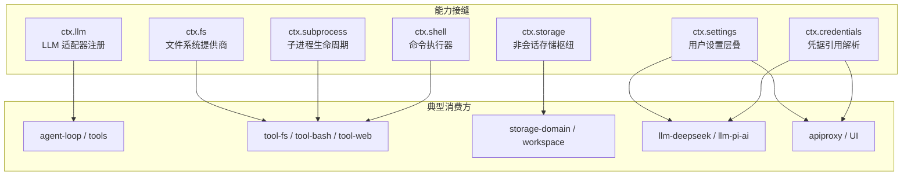
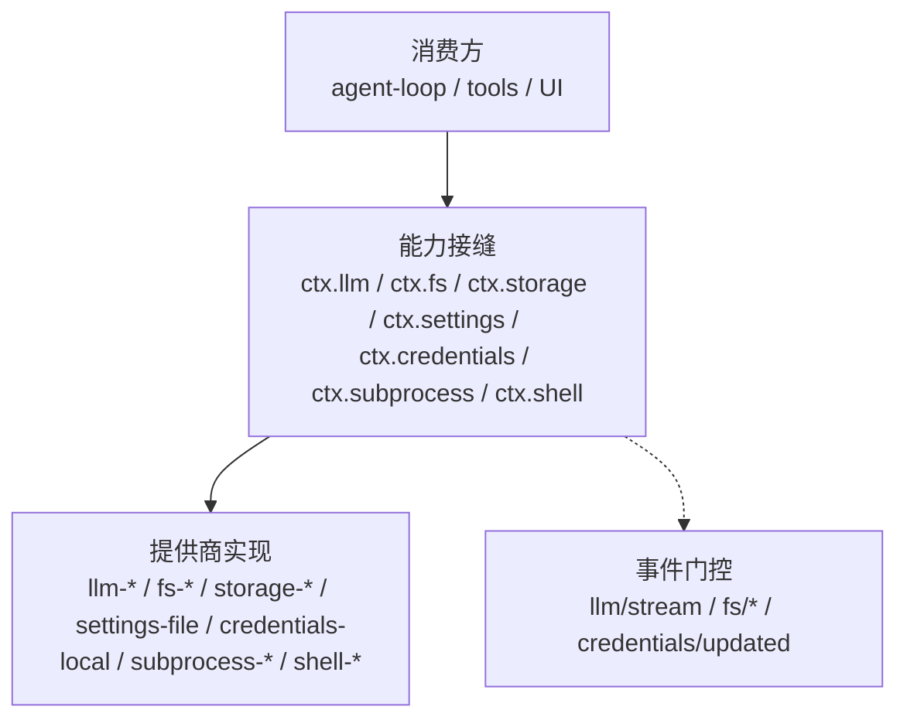
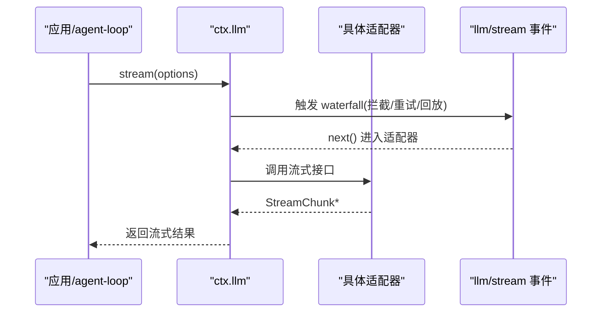
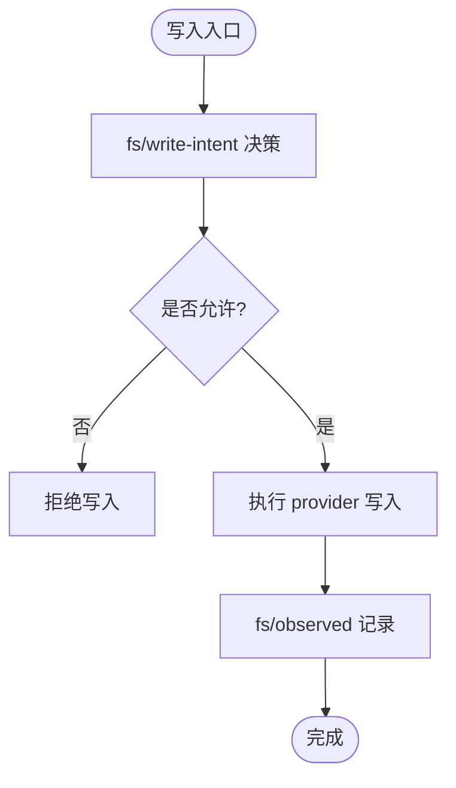

# 能力接缝

<cite>
**本文引用的文件**
- [docs/capability-seams.md](file://docs/capability-seams.md)
- [docs/capability-seams.zh.md](file://docs/capability-seams.zh.md)
- [packages/llm/llm/src/index.ts](file://packages/llm/llm/src/index.ts)
- [packages/fs/fs/src/index.ts](file://packages/fs/fs/src/index.ts)
- [packages/storage/storage/src/index.ts](file://packages/storage/storage/src/index.ts)
- [packages/settings/settings/src/index.ts](file://packages/settings/settings/src/index.ts)
- [packages/credentials/credentials/src/index.ts](file://packages/credentials/credentials/src/index.ts)
- [packages/subprocess/subprocess/src/index.ts](file://packages/subprocess/subprocess/src/index.ts)
- [packages/shell/shell/src/index.ts](file://packages/shell/shell/src/index.ts)
</cite>

## 目录
1. [简介](#简介)
2. [项目结构](#项目结构)
3. [核心组件](#核心组件)
4. [架构总览](#架构总览)
5. [关键能力接缝详解](#关键能力接缝详解)
6. [依赖关系分析](#依赖关系分析)
7. [性能与可观测性](#性能与可观测性)
8. [故障排查指南](#故障排查指南)
9. [版本管理与向后兼容](#版本管理与向后兼容)
10. [开发指南：如何定义新能力接缝与实现提供商](#开发指南如何定义新能力接缝与实现提供商)
11. [结论](#结论)

## 简介
本文件系统化阐述 DeepSeek Harness 的“能力接缝”设计与实践。能力接缝通过清晰的接口边界，将系统拆分为“服务定义（Service Definition）—服务提供商（Service Provider）—消费者（Consumer）”三层角色，从而实现运行时可插拔、可扩展与可替换。文档覆盖 LLM 适配器、文件系统提供商、存储后端、设置管理、凭据、子进程、Shell 执行器等关键接缝，解释其职责、接口契约、事件门控、以及如何在运行时动态替换实现。同时提供版本管理与兼容性策略，并给出面向开发者的实操指南。

## 项目结构
能力接缝在仓库中以“包级”组织：每个能力通常由一个“服务定义包”暴露抽象类或注册表，多个“提供商包”实现具体能力，而“消费方包”仅依赖抽象类型，不感知具体实现。下图展示了能力接缝的整体拓扑与主要上下文键（ctx.*）的关系。

图表来源
- [docs/capability-seams.md:10-410](file://docs/capability-seams.md#L10-L410)
- [docs/capability-seams.zh.md:10-412](file://docs/capability-seams.zh.md#L10-L412)

章节来源
- [docs/capability-seams.md:10-410](file://docs/capability-seams.md#L10-L410)
- [docs/capability-seams.zh.md:10-412](file://docs/capability-seams.zh.md#L10-L412)

## 核心组件
- 能力接缝三要素
  - 服务定义：暴露抽象类或注册表，声明 ctx 键与事件门控，约束行为语义。
  - 服务提供商：实现抽象类或向注册表注册具体能力，拥有资源与副作用。
  - 消费者：仅依赖抽象类型，通过 ctx 键调用能力，不感知具体实现。
- 运行期装配
  - 通过 Cordis 插件机制加载服务定义与提供商；组合时选择具体实现。
  - 多数能力支持“按调用解析”，保证配置变更即时生效（如凭据）。
- 事件门控与守卫
  - 写操作前可通过事件门控拦截决策（如 fs/write-intent、fs/edit-intent）。
  - 观察型事件用于审计与策略评估（如 fs/observed）。

章节来源
- [packages/llm/llm/src/index.ts:46-67](file://packages/llm/llm/src/index.ts#L46-L67)
- [packages/fs/fs/src/index.ts:44-78](file://packages/fs/fs/src/index.ts#L44-L78)
- [packages/credentials/credentials/src/index.ts:48-52](file://packages/credentials/credentials/src/index.ts#L48-L52)

## 架构总览
下图展示能力接缝在系统中的位置与交互：消费方通过 ctx 键访问能力；服务定义提供抽象；提供商注入具体实现；部分能力通过事件门控进行安全与策略控制。

图表来源
- [docs/capability-seams.md:10-410](file://docs/capability-seams.md#L10-L410)
- [packages/llm/llm/src/index.ts:46-67](file://packages/llm/llm/src/index.ts#L46-L67)
- [packages/fs/fs/src/index.ts:44-78](file://packages/fs/fs/src/index.ts#L44-L78)
- [packages/credentials/credentials/src/index.ts:101-142](file://packages/credentials/credentials/src/index.ts#L101-L142)

## 关键能力接缝详解

### ctx.llm：LLM 适配器注册与流式调用
- 职责
  - 注册多提供商适配器，统一模型发现、重试策略、流式输出。
  - 暴露 waterfall 事件 llm/stream，允许重试、回放、路由等横切逻辑。
- 接口要点
  - 抽象适配器基类：providerInfo、listModels、resolveModelInfo、stream 等。
  - 错误体系：结构化 LlmError，携带 code/status/requestId 等。
- 运行时特性
  - 适配器以路由名注册，支持未列出模型的默认回退。
  - 请求配置冻结与不可变，确保可重放与一致性。
- 使用示例路径
  - 注册适配器与列举模型：[packages/llm/llm/src/index.ts:174-200](file://packages/llm/llm/src/index.ts#L174-L200)
  - 流式调用与事件门控：[packages/llm/llm/src/index.ts:46-67](file://packages/llm/llm/src/index.ts#L46-L67)
  - 错误与校验：[packages/llm/llm/src/index.ts:69-117](file://packages/llm/llm/src/index.ts#L69-L117)

图表来源
- [packages/llm/llm/src/index.ts:46-67](file://packages/llm/llm/src/index.ts#L46-L67)
- [packages/llm/llm/src/index.ts:174-200](file://packages/llm/llm/src/index.ts#L174-L200)

章节来源
- [packages/llm/llm/src/index.ts:46-67](file://packages/llm/llm/src/index.ts#L46-L67)
- [packages/llm/llm/src/index.ts:69-117](file://packages/llm/llm/src/index.ts#L69-L117)
- [packages/llm/llm/src/index.ts:174-200](file://packages/llm/llm/src/index.ts#L174-L200)

### ctx.fs：文件系统提供商
- 职责
  - 抽象文件系统能力：目标解析、路径/URI 转换、包含关系判断、元数据查询、文本/二进制读取、原子写入与编辑。
  - 通过事件门控对写意图与编辑意图进行一次性决策，并记录观察结果。
- 接口要点
  - resolve/processPath/fileUrl/contains/stat/lstat/readText/streamText/readBytes 等。
  - 事件：fs/write-intent、fs/edit-intent、fs/observed。
- 运行时特性
  - 沙箱模式信息对外暴露，便于工具层正确提示权限升级。
  - 读窗口与观测策略位于消费者与策略插件中，保持提供者契约稳定。
- 使用示例路径
  - 抽象类与事件门控：[packages/fs/fs/src/index.ts:44-78](file://packages/fs/fs/src/index.ts#L44-L78)
  - 核心方法签名：[packages/fs/fs/src/index.ts:86-200](file://packages/fs/fs/src/index.ts#L86-L200)

图表来源
- [packages/fs/fs/src/index.ts:44-78](file://packages/fs/fs/src/index.ts#L44-L78)
- [packages/fs/fs/src/index.ts:86-200](file://packages/fs/fs/src/index.ts#L86-L200)

章节来源
- [packages/fs/fs/src/index.ts:44-78](file://packages/fs/fs/src/index.ts#L44-L78)
- [packages/fs/fs/src/index.ts:86-200](file://packages/fs/fs/src/index.ts#L86-L200)

### ctx.storage：非会话存储枢纽
- 职责
  - 命名后端注册表 + 数据形式挂载点；自身不做 IO，后端负责介质，领域层优先。
  - 提供 form(domain) 访问已挂载的数据形式，供 workspace 等消费。
- 接口要点
  - mount/form/domain 访问；后端以名称并列注册。
- 使用示例路径
  - 服务定义与挂载：[packages/storage/storage/src/index.ts:18-99](file://packages/storage/storage/src/index.ts#L18-L99)

章节来源
- [packages/storage/storage/src/index.ts:18-99](file://packages/storage/storage/src/index.ts#L18-L99)

### ctx.settings：用户设置层叠
- 职责
  - 按命名空间注册 schema，合并 schema 默认值、composition base、用户层，提供 get/watch/update/replace。
  - 支持 live/restart 生效时机，跨字段校验，敏感字段脱敏。
- 接口要点
  - SettingsScope 与 SettingsProvider；描述符包含 revision 用于并发写冲突检测。
- 使用示例路径
  - 命名空间注册与描述符：[packages/settings/settings/src/index.ts:21-100](file://packages/settings/settings/src/index.ts#L21-L100)
  - 变更监听与冲突处理：[packages/settings/settings/src/index.ts:102-183](file://packages/settings/settings/src/index.ts#L102-L183)

章节来源
- [packages/settings/settings/src/index.ts:21-100](file://packages/settings/settings/src/index.ts#L21-L100)
- [packages/settings/settings/src/index.ts:102-183](file://packages/settings/settings/src/index.ts#L102-L183)

### ctx.credentials：凭据引用解析
- 职责
  - 以“引用”形式承载机密，提供商持有实际值；每次操作重新解析，保证轮换即时生效。
  - describe/set/unset 提供只读视图与受控写入。
- 接口要点
  - ResolvedCredential/CredentialInfo；notifyUpdated 广播更新。
- 使用示例路径
  - 抽象服务与事件通知：[packages/credentials/credentials/src/index.ts:30-146](file://packages/credentials/credentials/src/index.ts#L30-L146)

章节来源
- [packages/credentials/credentials/src/index.ts:30-146](file://packages/credentials/credentials/src/index.ts#L30-L146)

### ctx.subprocess：子进程生命周期
- 职责
  - 统一的执行世界可执行查找、受管进程树、stdio 处置、终端分配与清理。
  - 屏蔽平台差异，提供 terminate/waitForExit 等一致语义。
- 接口要点
  - resolveExecutable/spawn/spawnTerminal；环境清洗避免凭据泄露。
- 使用示例路径
  - 抽象服务与环境清洗：[packages/subprocess/subprocess/src/index.ts:37-143](file://packages/subprocess/subprocess/src/index.ts#L37-L143)

章节来源
- [packages/subprocess/subprocess/src/index.ts:37-143](file://packages/subprocess/subprocess/src/index.ts#L37-L143)

### ctx.shell：命令执行器
- 职责
  - 前台 run 与后台 start 的统一抽象；默认沙箱模式与请求规范化。
  - 与 jobs 解耦，关注执行本身。
- 接口要点
  - resolve/run/start；sandboxMode 暴露默认限制。
- 使用示例路径
  - 抽象执行器与服务键：[packages/shell/shell/src/index.ts:13-104](file://packages/shell/shell/src/index.ts#L13-L104)

章节来源
- [packages/shell/shell/src/index.ts:13-104](file://packages/shell/shell/src/index.ts#L13-L104)

## 依赖关系分析
- 耦合与内聚
  - 消费方仅依赖抽象类型，降低与实现的耦合；提供商与消费者可独立演进。
  - 事件门控将横切关注点（策略、审计、重试）从业务逻辑中剥离。
- 直接/间接依赖
  - agent-loop/tools 依赖 ctx.llm、ctx.tools、ctx.systemPrompt 等。
  - tool-fs/tool-bash 依赖 ctx.fs、ctx.shell、ctx.subprocess。
  - storage-domain 依赖 ctx.storage 并等待所有后端就绪。
- 循环依赖
  - 通过事件与分层设计避免循环；服务定义不依赖提供商。
- 外部集成点
  - 凭据提供商、存储后端、LLM 适配器均为可替换的外部集成点。

章节来源
- [docs/capability-seams.md:10-410](file://docs/capability-seams.md#L10-L410)
- [docs/capability-seams.zh.md:10-412](file://docs/capability-seams.zh.md#L10-L412)

## 性能与可观测性
- 流式与增量
  - LLM 流式输出减少内存峰值；fs/streamText 分块读取大文件。
- 缓存与投影
  - 存储域等待后端就绪后发布服务，避免冷启动抖动；session projection 提供持久化缓存。
- 事件与遥测
  - llm/stream 事件可用于重试与回放；fs/observed 用于观测审计；credentials/updated 用于配置热更新。
- 资源隔离
  - subprocess 提供进程树与终止升级；shell 与 fs 的沙箱模式限制执行范围。

章节来源
- [packages/llm/llm/src/index.ts:46-67](file://packages/llm/llm/src/index.ts#L46-L67)
- [packages/fs/fs/src/index.ts:44-78](file://packages/fs/fs/src/index.ts#L44-L78)
- [packages/credentials/credentials/src/index.ts:101-142](file://packages/credentials/credentials/src/index.ts#L101-L142)

## 故障排查指南
- LLM 相关
  - 检查适配器是否注册、模型是否存在、重试策略是否合理。
  - 参考错误码与结构化失败信息定位问题（如 NO_ADAPTER、INVALID_MODEL_CONTEXT）。
- 文件系统
  - 写意图被拒绝时，检查 fs/write-intent 决策者；编辑冲突时核对版本。
  - 大文件读取注意 maxBytes 限制与溢出保护。
- 设置与凭据
  - 设置冲突（SETTINGS_CONFLICT）需检查 revision；凭据为空或未配置会导致认证失败。
- 子进程与 Shell
  - 执行失败时区分基础设施错误与业务退出码；确认环境变量清洗与 PATH 解析。

章节来源
- [packages/llm/llm/src/index.ts:69-117](file://packages/llm/llm/src/index.ts#L69-L117)
- [packages/fs/fs/src/index.ts:44-78](file://packages/fs/fs/src/index.ts#L44-L78)
- [packages/settings/settings/src/index.ts:160-183](file://packages/settings/settings/src/index.ts#L160-L183)
- [packages/credentials/credentials/src/index.ts:60-99](file://packages/credentials/credentials/src/index.ts#L60-L99)
- [packages/subprocess/subprocess/src/index.ts:74-143](file://packages/subprocess/subprocess/src/index.ts#L74-L143)
- [packages/shell/shell/src/index.ts:65-104](file://packages/shell/shell/src/index.ts#L65-L104)

## 版本管理与向后兼容
- 服务定义稳定性
  - 抽象类与事件契约保持稳定；新增能力通过扩展点（如新的表单、新的事件）引入，避免破坏现有消费者。
- 配置与数据形态
  - 设置采用 schema + 层叠，新增字段默认值向后兼容；存储 domain 优先于后端细节。
- 提供商替换
  - 同一能力允许多实现并存（如存储后端），通过名称选择；运行时按调用解析（如凭据）保证热更新。
- 事件门控
  - 写意图/编辑意图为单槽决策，新增策略不影响既有流程；观察事件为 emit 模式，不阻塞主流程。

章节来源
- [packages/storage/storage/src/index.ts:18-99](file://packages/storage/storage/src/index.ts#L18-L99)
- [packages/settings/settings/src/index.ts:21-100](file://packages/settings/settings/src/index.ts#L21-L100)
- [packages/credentials/credentials/src/index.ts:60-99](file://packages/credentials/credentials/src/index.ts#L60-L99)
- [packages/fs/fs/src/index.ts:44-78](file://packages/fs/fs/src/index.ts#L44-L78)

## 开发指南：如何定义新能力接缝与实现提供商
- 步骤概览
  1. 定义服务键与抽象类（或注册表），明确 ctx 键、方法、事件与错误码。
  2. 编写最小可用提供商，实现抽象方法，遵守生命周期与资源管理约定。
  3. 在消费方仅依赖抽象类型，通过 ctx 键调用；避免导入提供商类型。
  4. 如需策略控制，增加事件门控（write-intit/edit-intent/observed 等）。
  5. 提供配置项（settings）与凭据（credentials）接入，支持热更新。
  6. 编写测试用例覆盖正常路径、异常路径与并发场景。
- 示例参考
  - LLM 适配器：注册适配器、列举模型、流式调用与错误处理。
    - 参考路径：[packages/llm/llm/src/index.ts:174-200](file://packages/llm/llm/src/index.ts#L174-L200)
  - 文件系统提供商：实现 resolve/stat/readText/streamText/editText 等，并处理事件门控。
    - 参考路径：[packages/fs/fs/src/index.ts:86-200](file://packages/fs/fs/src/index.ts#L86-L200)
  - 存储后端：注册后端名称，挂载 domain 表单。
    - 参考路径：[packages/storage/storage/src/index.ts:18-99](file://packages/storage/storage/src/index.ts#L18-L99)
  - 设置与凭据：注册命名空间 schema，实现 resolve/describe/set/unset。
    - 参考路径：[packages/settings/settings/src/index.ts:21-100](file://packages/settings/settings/src/index.ts#L21-L100)
    - 参考路径：[packages/credentials/credentials/src/index.ts:60-99](file://packages/credentials/credentials/src/index.ts#L60-L99)
  - 子进程与 Shell：实现 resolveExecutable/spawn/spawnTerminal 与 resolve/run/start。
    - 参考路径：[packages/subprocess/subprocess/src/index.ts:74-143](file://packages/subprocess/subprocess/src/index.ts#L74-L143)
    - 参考路径：[packages/shell/shell/src/index.ts:65-104](file://packages/shell/shell/src/index.ts#L65-L104)

章节来源
- [packages/llm/llm/src/index.ts:174-200](file://packages/llm/llm/src/index.ts#L174-L200)
- [packages/fs/fs/src/index.ts:86-200](file://packages/fs/fs/src/index.ts#L86-L200)
- [packages/storage/storage/src/index.ts:18-99](file://packages/storage/storage/src/index.ts#L18-L99)
- [packages/settings/settings/src/index.ts:21-100](file://packages/settings/settings/src/index.ts#L21-L100)
- [packages/credentials/credentials/src/index.ts:60-99](file://packages/credentials/credentials/src/index.ts#L60-L99)
- [packages/subprocess/subprocess/src/index.ts:74-143](file://packages/subprocess/subprocess/src/index.ts#L74-L143)
- [packages/shell/shell/src/index.ts:65-104](file://packages/shell/shell/src/index.ts#L65-L104)

## 结论
DeepSeek Harness 的能力接缝通过清晰的服务定义、可替换的提供商与稳定的消费者契约，实现了系统的可插拔性与可扩展性。借助事件门控、层叠配置与凭据引用解析，系统在运行时具备灵活的动态替换能力。遵循本文档的设计原则与实践指南，开发者可以高效地扩展新能力、维护向后兼容，并在复杂场景中保障可靠性与可观测性。