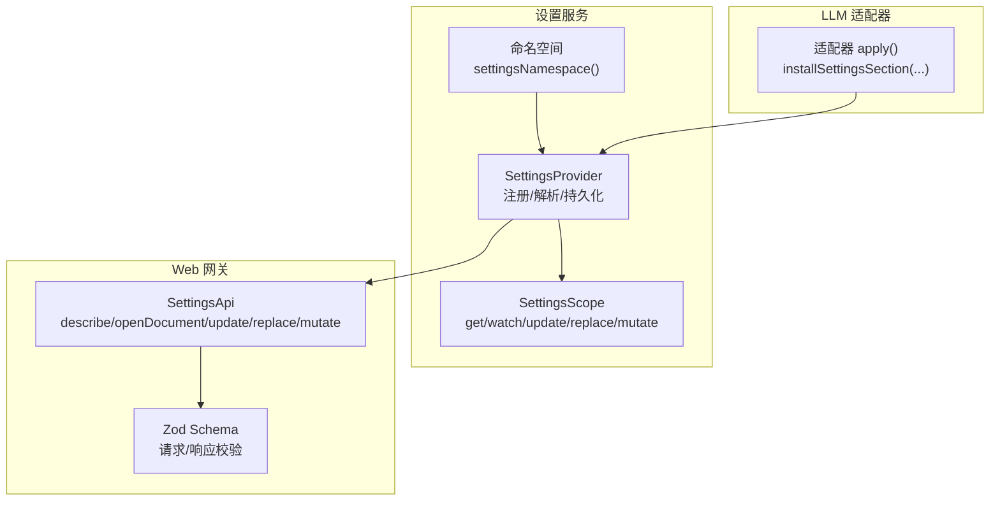
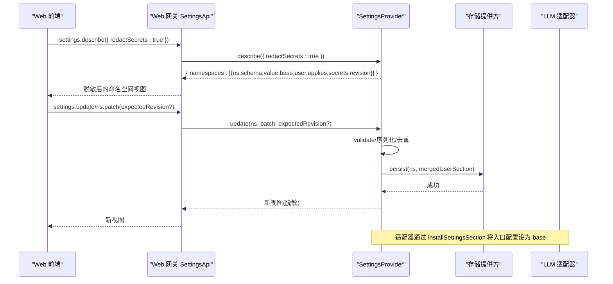
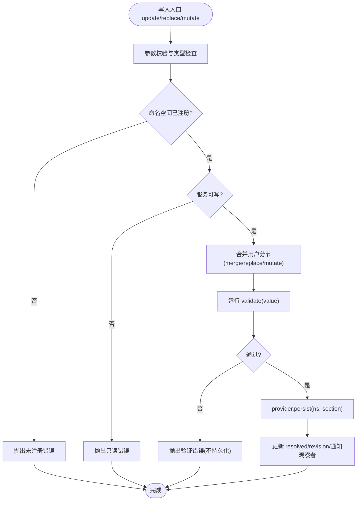
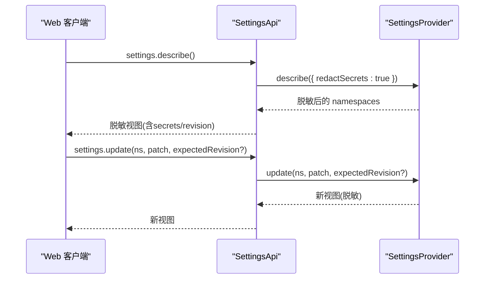
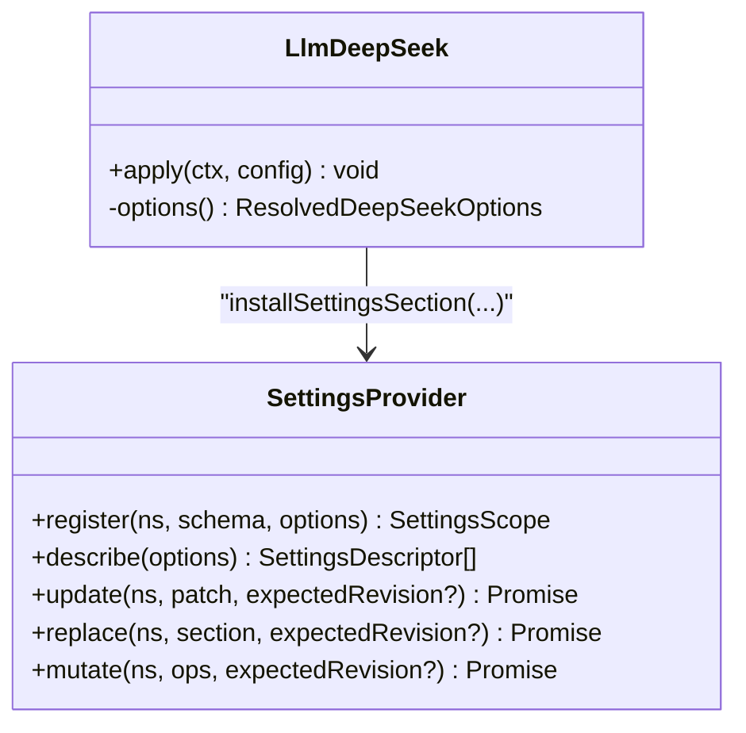
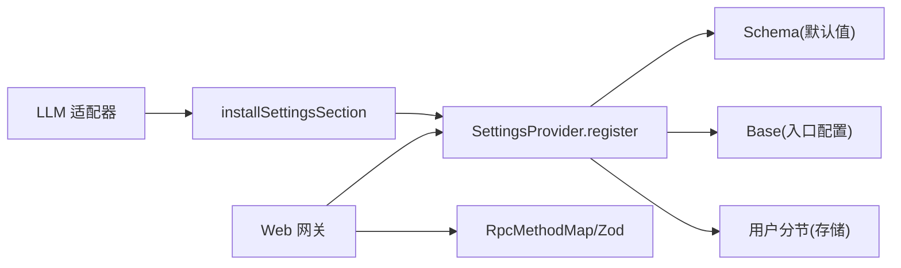

# 设置管理接缝

<cite>
**本文引用的文件**
- [packages/settings/settings/src/index.ts](file://packages/settings/settings/src/index.ts)
- [docs/subsystems/settings.md](file://docs/subsystems/settings.md)
- [docs/subsystems/settings.zh.md](file://docs/subsystems/settings.zh.md)
- [packages/host/apiproxy/src/api/settings.ts](file://packages/host/apiproxy/src/api/settings.ts)
- [packages/host/apiproxy/src/api/settings.schema.ts](file://packages/host/apiproxy/src/api/settings.schema.ts)
- [packages/llm/llm-deepseek/src/index.ts](file://packages/llm/llm-deepseek/src/index.ts)
- [packages/settings/settings/tests/redact.spec.ts](file://packages/settings/settings/tests/redact.spec.ts)
- [packages/settings/settings/tests/settings.spec.ts](file://packages/settings/settings/tests/settings.spec.ts)
- [.agents/notes/implemented/architecture/2026-07-30-web-config-plane.md](file://.agents/notes/implemented/architecture/2026-07-30-web-config-plane.md)
- [.agents/notes/implemented/architecture/2026-07-30-web-config-plane.zh.md](file://.agents/notes/implemented/architecture/2026-07-30-web-config-plane.zh.md)
- [.agents/notes/implemented/architecture/2026-07-30-config-plane-boundaries.md](file://.agents/notes/implemented/architecture/2026-07-30-config-plane-boundaries.md)
- [.agents/notes/implemented/architecture/2026-07-28-user-settings-seam.md](file://.agents/notes/implemented/architecture/2026-07-28-user-settings-seam.md)
</cite>

## 目录
1. [简介](#简介)
2. [项目结构](#项目结构)
3. [核心组件](#核心组件)
4. [架构总览](#架构总览)
5. [详细组件分析](#详细组件分析)
6. [依赖关系分析](#依赖关系分析)
7. [性能考量](#性能考量)
8. [故障排查指南](#故障排查指南)
9. [结论](#结论)
10. [附录：配置示例与最佳实践](#附录配置示例与最佳实践)

## 简介
本文件系统化说明“设置管理接缝”（ctx.settings）如何作为用户设置的统一接入点，支撑插件注册命名空间模式、分层值解析（schema 默认值 → 组合 base → 用户分节）、以及 Web 网关提供的脱敏描述与服务写入能力。同时给出 LLM 适配器如何将入口配置注册为“用户部分”的组合基础，并提供验证与错误处理指导，确保配置的可靠性与可维护性。

## 项目结构
- 设置服务核心：packages/settings/settings/src/index.ts
- 子系统文档：docs/subsystems/settings.md / settings.zh.md
- Web 网关 API 契约：packages/host/apiproxy/src/api/settings.ts / settings.schema.ts
- LLM 适配器集成示例：packages/llm/llm-deepseek/src/index.ts
- 行为与边界设计备忘：.agents/notes/... 系列文档
- 测试用例：packages/settings/settings/tests/*.ts

图表来源
- [packages/settings/settings/src/index.ts:26-31](file://packages/settings/settings/src/index.ts#L26-L31)
- [packages/settings/settings/src/index.ts:435-470](file://packages/settings/settings/src/index.ts#L435-L470)
- [packages/host/apiproxy/src/api/settings.ts:52-106](file://packages/host/apiproxy/src/api/settings.ts#L52-L106)
- [packages/host/apiproxy/src/api/settings.schema.ts:17-82](file://packages/host/apiproxy/src/api/settings.schema.ts#L17-L82)
- [packages/llm/llm-deepseek/src/index.ts:200-223](file://packages/llm/llm-deepseek/src/index.ts#L200-L223)

章节来源
- [packages/settings/settings/src/index.ts:1-200](file://packages/settings/settings/src/index.ts#L1-L200)
- [docs/subsystems/settings.md:1-311](file://docs/subsystems/settings.md#L1-L311)
- [docs/subsystems/settings.zh.md:1-311](file://docs/subsystems/settings.zh.md#L1-L311)

## 核心组件
- 命名空间标识：通过 settingsNamespace(value) 创建并校验小写 kebab-case，避免与其他 id 混用。
- 注册与解析：register(ns, schema, options) 将 schema、可选 base、applies、validate 绑定到调用方 fiber；解析顺序为 schema 默认值 → base → 用户分节。
- Owner Scope：返回 get()/watch()/update()/replace() 句柄；mutate() 支持路径级编辑，适合仅持有脱敏视图的客户端。
- 描述符 describe()：输出每个已注册 namespace 的 schema、value、base、user、applies、revision，并支持 redactSecrets=true 的结构化脱敏。
- 变更事件：settings/updated（值变化时发出），settings/document-updated（原始用户分节变化，即使值未变也通知 UI）。

章节来源
- [packages/settings/settings/src/index.ts:26-31](file://packages/settings/settings/src/index.ts#L26-L31)
- [packages/settings/settings/src/index.ts:435-512](file://packages/settings/settings/src/index.ts#L435-L512)
- [docs/subsystems/settings.md:18-162](file://docs/subsystems/settings.md#L18-L162)
- [docs/subsystems/settings.zh.md:18-162](file://docs/subsystems/settings.zh.md#L18-L162)

## 架构总览
设置服务以“命名空间 + 分层解析”为核心，提供统一的读写与观察接口；Web 网关在编译期 RPC 映射下暴露 describe/openDocument/update/replace/mutate，所有跨进程数据均经结构化脱敏；LLM 适配器通过 installSettingsSection 将入口配置作为 base 层注入，实现“用户覆盖组合基”的模式。

图表来源
- [packages/host/apiproxy/src/api/settings.ts:52-106](file://packages/host/apiproxy/src/api/settings.ts#L52-L106)
- [packages/settings/settings/src/index.ts:479-512](file://packages/settings/settings/src/index.ts#L479-L512)
- [packages/settings/settings/src/index.ts:534-575](file://packages/settings/settings/src/index.ts#L534-L575)
- [packages/llm/llm-deepseek/src/index.ts:200-223](file://packages/llm/llm-deepseek/src/index.ts#L200-L223)

## 详细组件分析

### 设置服务（SettingsProvider）
- 注册 register(ns, schema, options)：
  - 重复注册抛错；注册是 effect，随 fiber 释放而移除命名空间与观察者。
  - 解析 resolved = resolve(schema, base, section, validate)，并深冻结快照。
- 描述 describe(options)：
  - 输出 schema.toJSON()、value、base、user、applies、revision；redactSecrets=true 时剥离 role('secret') 子树并枚举 secrets 槽位。
- 写入 update/replace/mutate：
  - 同一命名空间的写入串行执行；validate 失败拒绝写入；支持 expectedRevision 冲突检测。
- 事件：
  - settings/updated：值变化时发出；settings/document-updated：原始用户分节变化时发出（用于 UI 感知“从继承变为覆盖”等语义变化）。

图表来源
- [packages/settings/settings/src/index.ts:534-575](file://packages/settings/settings/src/index.ts#L534-L575)
- [packages/settings/settings/src/index.ts:435-470](file://packages/settings/settings/src/index.ts#L435-L470)

章节来源
- [packages/settings/settings/src/index.ts:435-575](file://packages/settings/settings/src/index.ts#L435-L575)
- [docs/subsystems/settings.md:18-162](file://docs/subsystems/settings.md#L18-L162)
- [docs/subsystems/settings.zh.md:18-162](file://docs/subsystems/settings.zh.md#L18-L162)

### Web 网关（SettingsApi）
- 暴露方法：describe/openDocument/update/replace/mutate，全部走编译期 RPC 映射，保证 schema、处理器与客户端一致。
- 脱敏策略：所有响应值经 seam 脱敏（role('secret') 字段不出网），secrets 列表告知表单哪些字段可写且是否已配置。
- 安全边界：读取/写入进入连接守卫特权集合（回环+同源），否则 403；LAN 暴露场景下禁止远程配置访问。
- 冲突控制：write 携带 expectedRevision，过期则拒绝，避免覆盖并发修改。

图表来源
- [packages/host/apiproxy/src/api/settings.ts:52-106](file://packages/host/apiproxy/src/api/settings.ts#L52-L106)
- [packages/host/apiproxy/src/api/settings.schema.ts:17-82](file://packages/host/apiproxy/src/api/settings.schema.ts#L17-L82)
- [packages/settings/settings/src/index.ts:479-512](file://packages/settings/settings/src/index.ts#L479-L512)

章节来源
- [packages/host/apiproxy/src/api/settings.ts:1-107](file://packages/host/apiproxy/src/api/settings.ts#L1-L107)
- [packages/host/apiproxy/src/api/settings.schema.ts:1-82](file://packages/host/apiproxy/src/api/settings.schema.ts#L1-L82)
- [.agents/notes/implemented/architecture/2026-07-30-web-config-plane.md:13-17](file://.agents/notes/implemented/architecture/2026-07-30-web-config-plane.md#L13-L17)
- [.agents/notes/implemented/architecture/2026-07-30-web-config-plane.zh.md:13-17](file://.agents/notes/implemented/architecture/2026-07-30-web-config-plane.zh.md#L13-L17)
- [.agents/notes/implemented/architecture/2026-07-30-config-plane-boundaries.md:39-42](file://.agents/notes/implemented/architecture/2026-07-30-config-plane-boundaries.md#L39-L42)

### LLM 适配器（以 llm-deepseek 为例）
- 入口配置即 base：适配器通过 installSettingsSection 将 cordis.yml 中的 entry 配置作为 base 层，用户设置覆盖该 base。
- 运行时容错：当外部编辑导致 beyond-schema 失效时，保持 last good 并告警，避免热重载拖垮进程。
- 注册时机：注册发生在插件 fiber 上，随 fiber 生命周期管理。

图表来源
- [packages/llm/llm-deepseek/src/index.ts:200-223](file://packages/llm/llm-deepseek/src/index.ts#L200-L223)
- [packages/settings/settings/src/index.ts:863-878](file://packages/settings/settings/src/index.ts#L863-L878)

章节来源
- [packages/llm/llm-deepseek/src/index.ts:200-223](file://packages/llm/llm-deepseek/src/index.ts#L200-L223)
- [packages/settings/settings/src/index.ts:863-878](file://packages/settings/settings/src/index.ts#L863-L878)
- [.agents/notes/implemented/architecture/2026-07-28-user-settings-seam.md:19-23](file://.agents/notes/implemented/architecture/2026-07-28-user-settings-seam.md#L19-L23)

### 设置文件结构与语法
- 命名空间定义：使用 settingsNamespace('xxx') 创建，必须是小写 kebab-case。
- 分层值解析：
  - 第一层：schema 默认值（由 schemastery 提供）
  - 第二层：组合 base（插件入口配置，通常来自 cordis.yml）
  - 第三层：用户分节（用户文档中对应 namespace 的键值）
- 用户覆盖机制：
  - update(patch)：稀疏合并到用户分节
  - replace(section)：整体替换用户分节，缺失键重新继承 base 与 schema 默认
  - mutate(ops)：路径级 set/unset，适合仅持有脱敏视图的客户端
- 描述与脱敏：
  - describe() 输出 value/base/user/applies/revision/schema
  - describe({ redactSecrets:true }) 剥离 role('secret') 子树并列出 secrets 槽位

章节来源
- [packages/settings/settings/src/index.ts:26-31](file://packages/settings/settings/src/index.ts#L26-L31)
- [packages/settings/settings/src/index.ts:435-512](file://packages/settings/settings/src/index.ts#L435-L512)
- [docs/subsystems/settings.md:9-162](file://docs/subsystems/settings.md#L9-L162)
- [docs/subsystems/settings.zh.md:9-162](file://docs/subsystems/settings.zh.md#L9-L162)

### 设置验证与错误处理
- 启动/注册期严格：无效的用户分节在注册时直接失败（最早发现点）。
- 运行期宽容：外部编辑导致的 beyond-schema 失效会保留 last good 并告警，避免进程崩溃。
- 冲突检测：write 携带 expectedRevision，过期则拒绝（SettingsConflictError）。
- 只读保护：read-only provider 拒绝写入。
- 观察者隔离：watcher 回调异步串行，异常被捕获并记录，不影响后续队列。

章节来源
- [packages/settings/settings/src/index.ts:435-470](file://packages/settings/settings/src/index.ts#L435-L470)
- [packages/settings/settings/src/index.ts:534-575](file://packages/settings/settings/src/index.ts#L534-L575)
- [packages/settings/settings/tests/settings.spec.ts:175-202](file://packages/settings/settings/tests/settings.spec.ts#L175-L202)
- [packages/settings/settings/tests/redact.spec.ts:137-168](file://packages/settings/settings/tests/redact.spec.ts#L137-L168)

## 依赖关系分析
- 设置服务依赖：
  - Context/Cordis：fiber/effect/inject 生命周期管理
  - schemastery：schema 定义与 toJSON() 描述
  - 存储提供方：load/persist（如 dsh-settings-file）
- Web 网关依赖：
  - RpcMethodMap：编译期锁定的方法映射
  - Zod Schema：请求/响应校验
- LLM 适配器依赖：
  - installSettingsSection：将入口配置作为 base 层注册
  - 运行时容错：last good 策略

图表来源
- [packages/settings/settings/src/index.ts:863-878](file://packages/settings/settings/src/index.ts#L863-L878)
- [packages/host/apiproxy/src/api/settings.ts:52-106](file://packages/host/apiproxy/src/api/settings.ts#L52-L106)
- [packages/host/apiproxy/src/api/settings.schema.ts:17-82](file://packages/host/apiproxy/src/api/settings.schema.ts#L17-L82)

章节来源
- [packages/settings/settings/src/index.ts:863-878](file://packages/settings/settings/src/index.ts#L863-L878)
- [packages/host/apiproxy/src/api/settings.ts:52-106](file://packages/host/apiproxy/src/api/settings.ts#L52-L106)
- [packages/host/apiproxy/src/api/settings.schema.ts:17-82](file://packages/host/apiproxy/src/api/settings.schema.ts#L17-L82)

## 性能考量
- 解析值深冻结：避免意外修改，提升稳定性。
- 写入串行化：同一命名空间写入按调用顺序串行，避免竞态。
- 观察者异步串行：watcher 回调依次执行，异常隔离。
- 脱敏计算：describe({ redactSecrets:true }) 基于 schema 纯结构遍历，开销可控。

[本节为通用性能建议，无需特定文件引用]

## 故障排查指南
- 命名空间未注册：调用 update/replace/mutate 前需确保已 register。
- 只读 provider：无法进行写入操作，需确认 provider 是否 writable。
- 冲突错误：expectedRevision 不匹配时抛出 SettingsConflictError，应重新 describe 后重试。
- 外部编辑导致失效：保持 last good 并告警，检查用户文档中对应 namespace 的分节是否符合 schema。
- 脱敏视图限制：仅持有脱敏 descriptor 的客户端应使用 mutate 而非 replace 删除字段，避免误删未收到的 secret。

章节来源
- [packages/settings/settings/src/index.ts:534-575](file://packages/settings/settings/src/index.ts#L534-L575)
- [packages/settings/settings/tests/redact.spec.ts:137-168](file://packages/settings/settings/tests/redact.spec.ts#L137-L168)
- [packages/settings/settings/tests/settings.spec.ts:175-202](file://packages/settings/settings/tests/settings.spec.ts#L175-L202)

## 结论
ctx.settings 提供了以命名空间为核心的用户设置接缝，结合 schema 默认值、组合 base 与用户分节的分层解析，既保证了扩展性又确保了安全性。Web 网关通过编译期 RPC 映射与结构化脱敏，提供安全的配置读写面；LLM 适配器通过 installSettingsSection 将入口配置作为 base，实现“用户覆盖组合基”的清晰职责划分。配合严格的启动/注册期校验与宽容的运行期容错，系统具备高可靠与可维护性。

[本节为总结，无需特定文件引用]

## 附录：配置示例与最佳实践
- 定义命名空间：使用 settingsNamespace('my-plugin')，遵循小写 kebab-case。
- 注册命名空间：register(ns, schema, { base, applies, validate })，其中 base 通常为插件入口配置。
- 用户覆盖：
  - 增量更新：scope.update({ key: value })
  - 整体重置：scope.replace({}) 或 scope.replace(newSection)
  - 路径编辑：scope.mutate([{ op:'set'|'unset', path:['a','b'], value? }])
- 描述与脱敏：
  - describe() 获取完整视图（同进程 UI）
  - describe({ redactSecrets:true }) 获取脱敏视图（跨进程/网络）
- 事件监听：
  - settings/updated：值变化时处理业务逻辑
  - settings/document-updated：UI 感知“覆盖状态”变化
- 最佳实践：
  - 将敏感字段标记为 role('secret')，并通过 secrets 列表渲染只写输入框
  - 使用 expectedRevision 防止并发覆盖
  - 对复杂约束使用 validate 钩子在写入处拒绝非法组合
  - 对 restart 生效的配置，UI 应提示待重启应用

章节来源
- [packages/settings/settings/src/index.ts:26-31](file://packages/settings/settings/src/index.ts#L26-L31)
- [packages/settings/settings/src/index.ts:435-512](file://packages/settings/settings/src/index.ts#L435-L512)
- [packages/settings/settings/src/index.ts:534-575](file://packages/settings/settings/src/index.ts#L534-L575)
- [docs/subsystems/settings.md:18-162](file://docs/subsystems/settings.md#L18-L162)
- [docs/subsystems/settings.zh.md:18-162](file://docs/subsystems/settings.zh.md#L18-L162)
- [packages/host/apiproxy/src/api/settings.ts:52-106](file://packages/host/apiproxy/src/api/settings.ts#L52-L106)
- [packages/host/apiproxy/src/api/settings.schema.ts:17-82](file://packages/host/apiproxy/src/api/settings.schema.ts#L17-L82)
- [packages/llm/llm-deepseek/src/index.ts:200-223](file://packages/llm/llm-deepseek/src/index.ts#L200-L223)