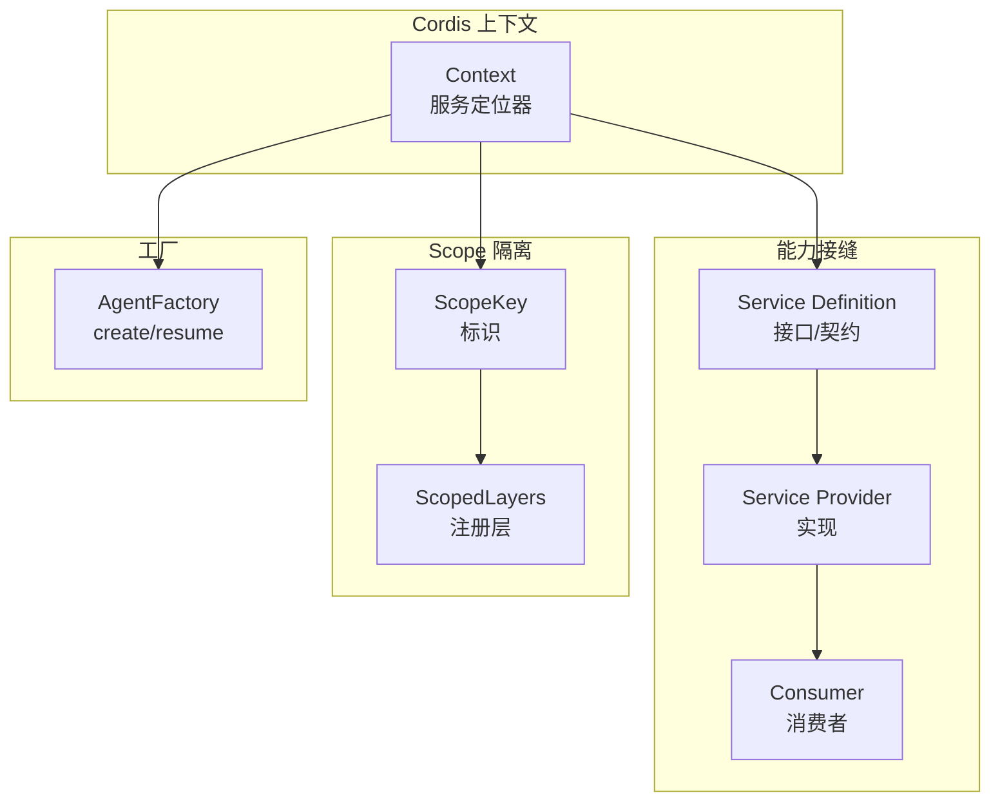
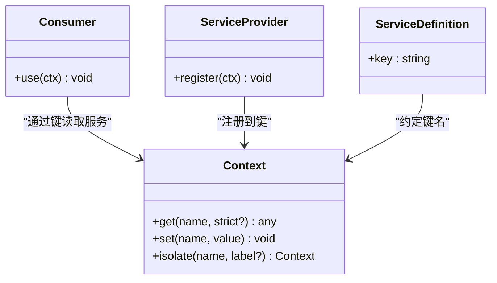
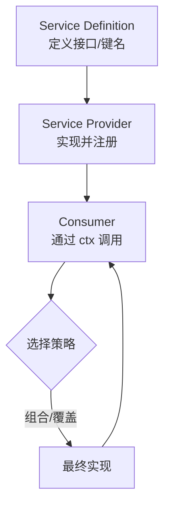
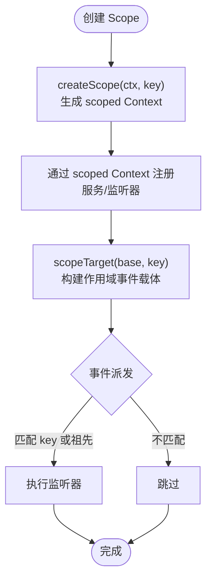
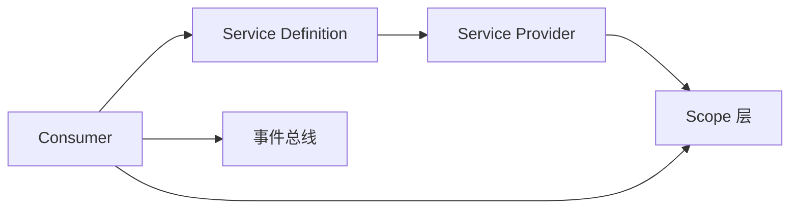

# 设计模式

<cite>
**本文引用的文件**
- [capability-seams.md](file://docs/capability-seams.md)
- [architecture.md](file://docs/architecture.md)
- [cordis-primer.md](file://docs/cordis-primer.md)
- [scope.md](file://docs/subsystems/scope.md)
- [core.md](file://docs/subsystems/core.md)
- [context.md](file://docs/cordis-api/context.md)
- [packages/core/scope/src/index.ts](file://packages/core/scope/src/index.ts)
- [packages/core/agent/src/index.ts](file://packages/core/agent/src/index.ts)
</cite>

## 目录
1. [简介](#简介)
2. [项目结构](#项目结构)
3. [核心组件](#核心组件)
4. [架构总览](#架构总览)
5. [详细组件分析](#详细组件分析)
6. [依赖关系分析](#依赖关系分析)
7. [性能考量](#性能考量)
8. [故障排查指南](#故障排查指南)
9. [结论](#结论)
10. [附录](#附录)

## 简介
本文件系统化阐述 DeepSeek Harness 在 Cordis 框架中应用的设计模式，重点包括：
- 服务定位器模式：通过 ctx 键值注册与注入，解耦 Service Definition、Service Provider、Consumer 三方角色。
- Capability Seams（能力接缝）：以“接口定义 + 可插拔实现 + 消费者”的三元组实现系统可插拔性。
- Scope 机制：基于 ScopeKey 的按 Agent 隔离的注册表与事件路由，确保每个 Agent 拥有独立的能力视图与生命周期。
- 工厂模式：Agent 创建与恢复通过工厂抽象，屏蔽具体驱动实现，支持运行时替换与 HMR。

目标读者既包括需要理解整体架构的工程师，也包括希望快速上手扩展 Harness 能力的插件作者。

## 项目结构
DeepSeek Harness 以 Cordis 为插件框架，所有功能以插件形式贡献到共享 Context。关键文档与源码位置：
- 能力接缝与子系统图：docs/capability-seams.md
- 架构与事件模型：docs/architecture.md
- Cordis 基础概念与事件分发模式：docs/cordis-primer.md
- Scope 机制与注册层：docs/subsystems/scope.md
- 核心子系统（Agent、Session、Tools、Loop）：docs/subsystems/core.md
- 上下文与服务定位 API：docs/cordis-api/context.md
- Scope 实现：packages/core/scope/src/index.ts
- Agent 注册与工厂：packages/core/agent/src/index.ts



图表来源
- [capability-seams.md:9-410](file://docs/capability-seams.md#L9-L410)
- [context.md:235-284](file://docs/cordis-api/context.md#L235-L284)
- [scope.md:45-60](file://docs/subsystems/scope.md#L45-L60)
- [core.md:22-51](file://docs/subsystems/core.md#L22-L51)

章节来源
- [capability-seams.md:1-472](file://docs/capability-seams.md#L1-L472)
- [architecture.md:1-130](file://docs/architecture.md#L1-L130)
- [cordis-primer.md:1-45](file://docs/cordis-primer.md#L1-L45)

## 核心组件
- 服务定位器（Context）：通过 ctx.<key> 暴露稳定键名，插件声明依赖 inject，加载顺序由依赖决定而非手工编排。
- 能力接缝（Seam）：每个能力由 Service Definition（接口）、Service Provider（实现）、Consumer（调用方）组成；同一 key 下可有多个实现，通过组合选择。
- Scope 注册层：提供 per-Agent 的注册视图与事件路由，保证隔离与正确清理。
- Agent 工厂：对外暴露 create/resume，内部委托给具体 loop 实现，支持热替换与所有权追踪。

章节来源
- [cordis-primer.md:7-14](file://docs/cordis-primer.md#L7-L14)
- [architecture.md:99-103](file://docs/architecture.md#L99-L103)
- [scope.md:9-60](file://docs/subsystems/scope.md#L9-L60)
- [core.md:22-51](file://docs/subsystems/core.md#L22-L51)

## 架构总览
Harness 的核心循环由 session、system-prompt、tools、agent、agent-loop、scope 等包协作完成。能力接缝将可替换实现（如 LLM、FS、Subprocess、Shell 等）接入统一接口，消费者仅依赖接口而不关心具体实现。Scope 为每个 Agent 提供独立的注册视图与事件过滤，确保多 Agent 并行时互不干扰。

```mermaid
sequenceDiagram
participant Consumer as "消费者(工具/钩子)"
participant Seam as "能力接缝(ctx.* )"
participant Provider as "Provider 实现"
participant Scope as "Scope 层"
participant Loop as "AgentLoop"
Consumer->>Seam : 调用能力方法
Seam->>Scope : 根据 ScopeKey 选择注册层
Scope-->>Seam : 返回当前 Agent 可见的实现
Seam->>Provider : 执行具体逻辑
Provider-->>Seam : 结果/副作用
Seam-->>Consumer : 返回结果
Note over Loop,Scope : 事件与注册均受 Scope 过滤，保证隔离
```

图表来源
- [capability-seams.md:9-410](file://docs/capability-seams.md#L9-L410)
- [scope.md:29-60](file://docs/subsystems/scope.md#L29-L60)
- [core.md:7-20](file://docs/subsystems/core.md#L7-L20)

## 详细组件分析

### 服务定位器模式在 Cordis 中的应用
- 角色分工
  - Service Definition：通过 ctx 键名声明能力（如 ctx.tools、ctx.llm、ctx.sessions）。
  - Service Provider：插件实现并注册到对应键，提供具体行为。
  - Consumer：通过 ctx.get/inject 获取服务，无需知道实现细节。
- 关键特性
  - 依赖声明式：inject 表达依赖，自动等待服务就绪。
  - 可替换：同一键可存在多个实现，通过组合或覆盖选择。
  - 可撤销：注册为 effect，卸载时自动回滚。



图表来源
- [context.md:235-284](file://docs/cordis-api/context.md#L235-L284)
- [cordis-primer.md:7-14](file://docs/cordis-primer.md#L7-L14)

章节来源
- [cordis-primer.md:7-14](file://docs/cordis-primer.md#L7-L14)
- [context.md:235-284](file://docs/cordis-api/context.md#L235-L284)

### Capability Seams 的可插拔性设计
- 设计理念
  - 一个能力 = 接口定义 + 至少一个实现 + 消费者。
  - 通过 ctx 键聚合能力，不同实现可并列注册，组合时选择其一。
  - 典型接缝：LLM、文件系统、子进程、Shell、存储、查询等。
- 效果
  - 单一 provider 切换即可改变产品行为，且不影响消费者代码。
  - 跨能力协同（如 FS 与 Subprocess 共享执行世界）保持一致性。



图表来源
- [capability-seams.md:9-410](file://docs/capability-seams.md#L9-L410)
- [architecture.md:99-103](file://docs/architecture.md#L99-L103)

章节来源
- [capability-seams.md:1-472](file://docs/capability-seams.md#L1-L472)
- [architecture.md:99-103](file://docs/architecture.md#L99-L103)

### Scope 机制：按 Agent 隔离的注册表与事件路由
- 核心概念
  - ScopeKey：不透明标识，用于区分不同 Agent 的注册层。
  - ScopedLayers：维护全局层与精确作用域层，读操作惰性合并，写操作同步撤销。
  - scopeTarget：构建带作用域的事件接收者，使事件仅投递到匹配或其祖先作用域的监听器。
- 行为规则
  - 注册可见性：通过 agent.ctx 注册的条目仅对当前 Agent 可见。
  - 事件路由：监听器可被标记为某 ScopeKey，事件从子作用域向上匹配祖先监听器。
  - 生命周期：Scope 随 Agent 销毁而清理，避免泄漏。



图表来源
- [scope.md:9-60](file://docs/subsystems/scope.md#L9-L60)
- [packages/core/scope/src/index.ts:129-185](file://packages/core/scope/src/index.ts#L129-L185)

章节来源
- [scope.md:9-60](file://docs/subsystems/scope.md#L9-L60)
- [packages/core/scope/src/index.ts:1-205](file://packages/core/scope/src/index.ts#L1-L205)

### 工厂模式在 Agent 创建中的应用
- 职责分离
  - AgentRegistry：对外暴露 create/resume，隐藏具体驱动。
  - AgentFactory：由具体 loop 实现，负责会话建立、setup 组装、发布与启动。
  - 所有权追踪：create/resume 调用会携带 ownerCtx，确保生命周期归属清晰。
- 优势
  - 可替换：通过 setFactory 动态更换实现，支持 HMR。
  - 安全：未注册工厂时拒绝创建，避免空指针与不一致状态。
  - 可观测：创建/恢复过程有明确的生命周期事件。

```mermaid
sequenceDiagram
participant Caller as "调用方"
participant Registry as "AgentRegistry"
participant Factory as "AgentFactory"
participant Loop as "具体 Loop 实现"
Caller->>Registry : create(options)
Registry->>Factory : createAgent(ownerCtx, options)
Factory->>Loop : 建立会话/运行 setup
Loop-->>Factory : 返回 AgentHandle
Factory-->>Registry : 发布并启动
Registry-->>Caller : 返回 AgentHandle
Note over Registry,Factory : resume 流程类似，先加载持久化再恢复
```

图表来源
- [core.md:22-51](file://docs/subsystems/core.md#L22-L51)
- [packages/core/agent/src/index.ts:158-200](file://packages/core/agent/src/index.ts#L158-L200)

章节来源
- [core.md:22-51](file://docs/subsystems/core.md#L22-L51)
- [packages/core/agent/src/index.ts:158-200](file://packages/core/agent/src/index.ts#L158-L200)

### 最佳实践指导
- 使用能力接缝扩展功能
  - 新增能力时，先定义 Service Definition（键名与接口），再提供 Provider 实现，最后由 Consumer 通过 ctx 调用。
  - 参考现有接缝（如 ctx.fs、ctx.subprocess、ctx.shell）的组织方式。
- 合理使用 Scope
  - 通过 agent.ctx 注册仅对当前 Agent 生效的行为，避免污染全局。
  - 使用 scopeTarget 进行事件路由，确保监听器只收到相关作用域的事件。
- 工厂与生命周期
  - 通过 setFactory 注册 Agent 工厂，避免直接依赖具体 loop。
  - 确保 setup 中的注册全部具备 disposer，保证卸载有序。
- 事件与中间件
  - 优先使用事件进行拦截与策略控制；直接能力调用使用服务方法。
  - 遵循 emit/waterfall/parallel/serial 语义，避免误用导致死锁或数据竞争。

章节来源
- [cordis-primer.md:7-14](file://docs/cordis-primer.md#L7-L14)
- [architecture.md:99-103](file://docs/architecture.md#L99-L103)
- [scope.md:29-60](file://docs/subsystems/scope.md#L29-L60)
- [core.md:22-51](file://docs/subsystems/core.md#L22-L51)

## 依赖关系分析
- 低耦合高内聚
  - 消费者仅依赖 Service Definition（键名与类型），不依赖具体 Provider。
  - Scope 作为底层库，被上层服务消费，避免循环依赖。
- 外部集成点
  - 通过 ctx 暴露的接缝（如 LLM、FS、Subprocess、Storage）允许宿主环境注入实现。
  - 事件总线（session/event、agent/*、tools/*）作为跨模块通信通道。



图表来源
- [capability-seams.md:9-410](file://docs/capability-seams.md#L9-L410)
- [scope.md:45-60](file://docs/subsystems/scope.md#L45-L60)

章节来源
- [capability-seams.md:1-472](file://docs/capability-seams.md#L1-L472)
- [scope.md:45-60](file://docs/subsystems/scope.md#L45-L60)

## 性能考量
- 注册与查找
  - ScopedLayers 惰性合并，读操作不创建多余层，减少内存占用。
  - 作用域事件路由通过父链匹配，复杂度与层级深度线性相关，通常极浅。
- 事件分发
  - 合理选择分发模式（emit/waterfall/parallel/serial），避免不必要的串行阻塞。
- 工厂与创建
  - Agent 创建包含 setup 与发布阶段，应避免在 setup 中进行重 IO；必要时异步化并缓存结果。

[本节为通用指导，不直接分析具体文件]

## 故障排查指南
- 常见问题
  - 未注册工厂：调用 create/resume 时报错，需确保已 setFactory。
  - 重复注册：同一键重复注册会抛错，检查插件是否重复挂载。
  - 作用域错误：事件未触发，检查 scopeTarget 的 key 与监听器的作用域是否匹配。
- 诊断步骤
  - 使用 dump-config 查看实际装配树，确认服务键是否存在。
  - 通过事件日志观察 turn/step/tool 生命周期，定位异常阶段。
  - 检查 Scope 绑定与 rebind 是否形成环，避免非法链接。

章节来源
- [packages/core/agent/src/index.ts:158-200](file://packages/core/agent/src/index.ts#L158-L200)
- [packages/core/scope/src/index.ts:54-82](file://packages/core/scope/src/index.ts#L54-L82)

## 结论
DeepSeek Harness 通过 Cordis 的服务定位器模式、Capability Seams 的可插拔设计、Scope 的按 Agent 隔离机制以及 Agent 工厂模式，实现了高度模块化、可替换、可扩展的系统架构。插件作者只需关注接口定义与实现，即可在不侵入核心逻辑的前提下增强系统能力。遵循本文的最佳实践，可有效提升开发效率与系统稳定性。

[本节为总结，不直接分析具体文件]

## 附录
- 术语
  - Service Definition：能力接口与键名约定。
  - Service Provider：能力的具体实现与注册。
  - Consumer：通过 ctx 调用能力的模块。
  - ScopeKey：作用域标识，用于隔离注册与事件路由。
  - AgentFactory：Agent 创建与恢复的工厂接口。

[本节为补充说明，不直接分析具体文件]