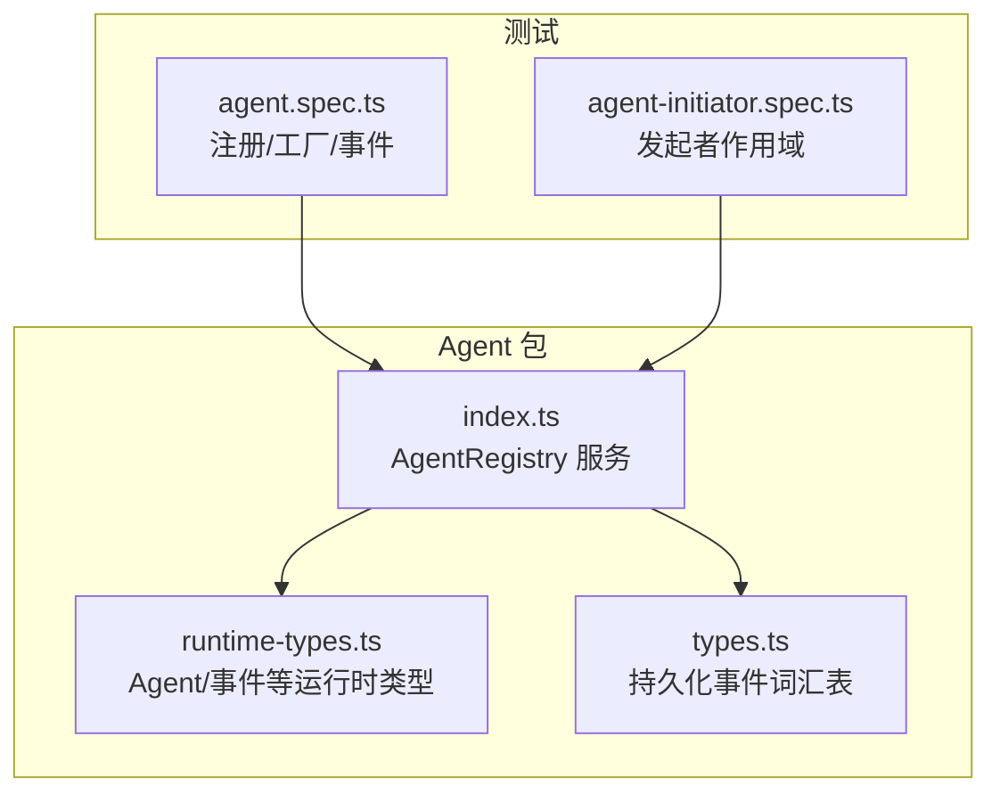
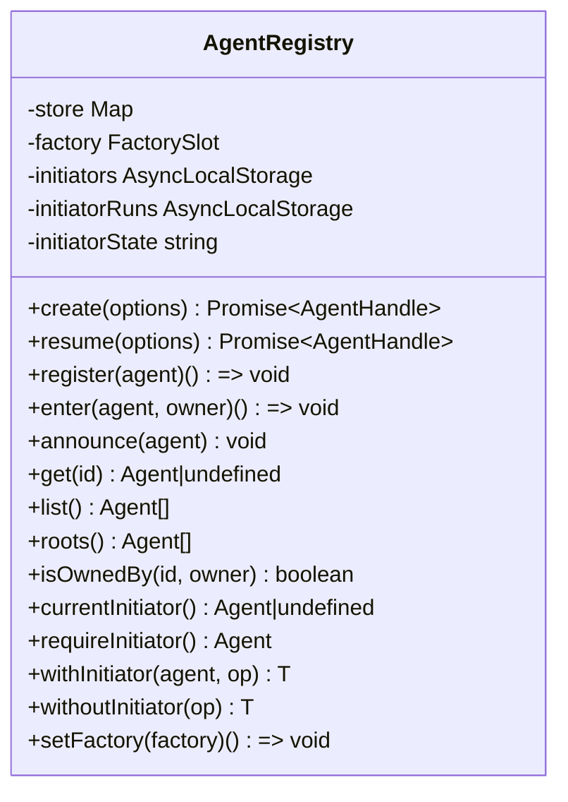
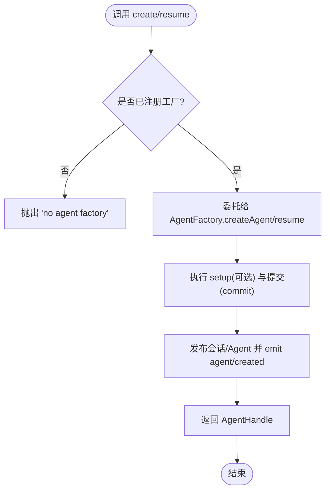
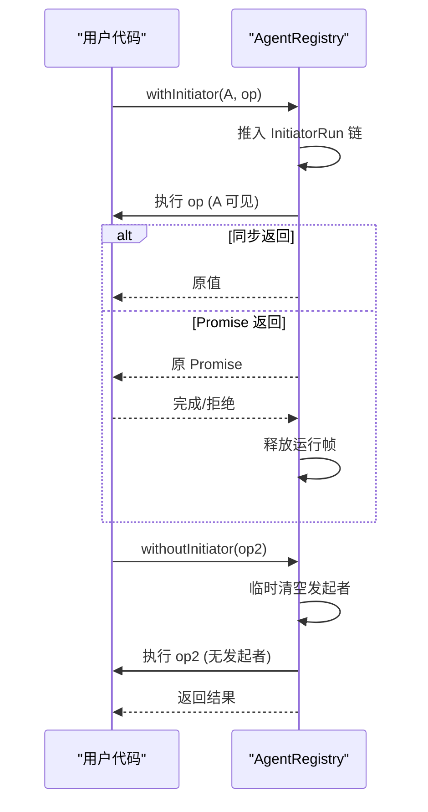
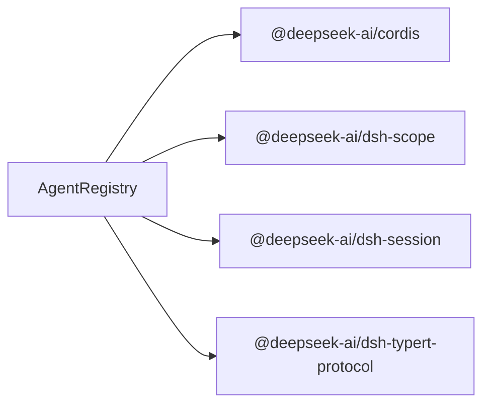

# Agent 管理系统

<cite>
**本文引用的文件**
- [packages/core/agent/src/index.ts](file://packages/core/agent/src/index.ts)
- [packages/core/agent/src/runtime-types.ts](file://packages/core/agent/src/runtime-types.ts)
- [packages/core/agent/src/types.ts](file://packages/core/agent/src/types.ts)
- [packages/core/agent/tests/agent.spec.ts](file://packages/core/agent/tests/agent.spec.ts)
- [packages/core/agent/tests/agent-initiator.spec.ts](file://packages/core/agent/tests/agent-initiator.spec.ts)
</cite>

## 目录
1. [简介](#简介)
2. [项目结构](#项目结构)
3. [核心组件](#核心组件)
4. [架构总览](#架构总览)
5. [详细组件分析](#详细组件分析)
6. [依赖关系分析](#依赖关系分析)
7. [性能考量](#性能考量)
8. [故障排查指南](#故障排查指南)
9. [结论](#结论)
10. [附录](#附录)

## 简介
本文件系统性地梳理 Agent 管理系统的核心设计与实现，重点围绕 AgentRegistry 类的设计模式与实现细节，涵盖 Agent 的创建、注册、生命周期管理与作用域隔离机制；深入解释 create() 与 resume() 的工作原理、AgentHandle 的生命周期控制、withInitiator() 与 withoutInitiator() 的作用域边界管理；并通过测试用例展示父子关系与所有权传递、事件系统的使用方法与最佳实践；最后给出配置选项、参数说明与错误处理策略，帮助不同经验水平的开发者高效使用。

## 项目结构
Agent 管理相关代码集中在 packages/core/agent 包中：
- 核心服务与类型定义位于 src/index.ts、src/runtime-types.ts、src/types.ts
- 行为与边界验证由 tests 下的单元测试覆盖



图表来源
- [packages/core/agent/src/index.ts:256-706](file://packages/core/agent/src/index.ts#L256-L706)
- [packages/core/agent/src/runtime-types.ts:64-293](file://packages/core/agent/src/runtime-types.ts#L64-L293)
- [packages/core/agent/src/types.ts:1-28](file://packages/core/agent/src/types.ts#L1-L28)
- [packages/core/agent/tests/agent.spec.ts:145-439](file://packages/core/agent/tests/agent.spec.ts#L145-L439)
- [packages/core/agent/tests/agent-initiator.spec.ts:1-266](file://packages/core/agent/tests/agent-initiator.spec.ts#L1-L266)

章节来源
- [packages/core/agent/src/index.ts:256-706](file://packages/core/agent/src/index.ts#L256-L706)
- [packages/core/agent/src/runtime-types.ts:64-293](file://packages/core/agent/src/runtime-types.ts#L64-L293)
- [packages/core/agent/src/types.ts:1-28](file://packages/core/agent/src/types.ts#L1-L28)
- [packages/core/agent/tests/agent.spec.ts:145-439](file://packages/core/agent/tests/agent.spec.ts#L145-L439)
- [packages/core/agent/tests/agent-initiator.spec.ts:1-266](file://packages/core/agent/tests/agent-initiator.spec.ts#L1-L266)

## 核心组件
- AgentRegistry（Agent 服务）：维护 Agent 实例的注册表、创建/恢复委托、进程内发起者作用域（initiator scope）。
- AgentFactory：由循环实现提供，负责实际的 Agent 与 Session 构造、设置与启动。
- AgentHandle：拥有 Agent 的句柄，持有 dispose 能力，用于停止/排空、注销、移除会话并回滚作用域。
- Agent：运行时代理接口，包含状态、会话、消息投递、取消、维护任务等。
- 事件系统：agent/created、agent/disposed、agent/status、agent/session-start、agent/pre-step、agent/request、agent/request-error、agent/turn-stopping、agent/error 等。

章节来源
- [packages/core/agent/src/index.ts:172-214](file://packages/core/agent/src/index.ts#L172-L214)
- [packages/core/agent/src/index.ts:256-706](file://packages/core/agent/src/index.ts#L256-L706)
- [packages/core/agent/src/runtime-types.ts:64-293](file://packages/core/agent/src/runtime-types.ts#L64-L293)

## 架构总览
AgentRegistry 作为服务挂载到 Context，对外暴露 agents 访问点。它不直接创建 Agent，而是通过 setFactory 注入 AgentFactory，将 create/resume 委托给具体实现。同时，AgentRegistry 维护一个进程内的“发起者作用域”，用于在异步驱动链中标识因果归属（哪个 Agent 启动了当前操作），并提供 withInitiator/withoutInitiator 来建立或清除该作用域边界。

```mermaid
sequenceDiagram
participant Caller as "调用方"
participant Reg as "AgentRegistry"
participant Fac as "AgentFactory"
participant Loop as "AgentLoop(外部)"
participant Store as "注册表/会话存储"
Caller->>Reg : create(options)
Reg->>Fac : createAgent(ownerCtx, options)
Fac->>Store : 准备会话/Agent(未发布)
Fac-->>Reg : AgentHandle
Reg-->>Caller : AgentHandle
Note over Reg,Store : 发布前可回滚; 发布后 emit agent/created
Caller->>Reg : handle.dispose()
Reg->>Store : 停止/排空/注销/移除会话/回滚作用域
```

图表来源
- [packages/core/agent/src/index.ts:396-430](file://packages/core/agent/src/index.ts#L396-L430)
- [packages/core/agent/src/index.ts:450-576](file://packages/core/agent/src/index.ts#L450-L576)

章节来源
- [packages/core/agent/src/index.ts:396-430](file://packages/core/agent/src/index.ts#L396-L430)
- [packages/core/agent/src/index.ts:450-576](file://packages/core/agent/src/index.ts#L450-L576)

## 详细组件分析

### AgentRegistry：设计模式与实现要点
- 职责分离：注册表只负责生命周期编排与作用域管理，实际创建/恢复由 AgentFactory 完成。
- 原子发布：enter() 插入条目但不公开；announce() 才发布并触发 agent/created；若监听器抛出，会回滚并发布 agent/disposed。
- 所有权追踪：enter(agent, owner) 记录运行时创建者 owner，独立于持久化的会话血缘；isOwnedBy(id, owner) 可查询。
- 作用域隔离：基于 AsyncLocalStorage 维护 InitiatorRun 链，withInitiator/withoutInitiator 支持嵌套、清空、异常恢复与跨 Realm Promise 排空。
- 优雅关闭：closeInitiators()/disposeInitiators() 确保在卸载时拒绝新边界、等待活跃 Promise 边界排空、最终失效引用。



图表来源
- [packages/core/agent/src/index.ts:256-706](file://packages/core/agent/src/index.ts#L256-L706)

章节来源
- [packages/core/agent/src/index.ts:256-706](file://packages/core/agent/src/index.ts#L256-L706)

### create() 与 resume()：工作原理
- create(options)：委托给已注册的 AgentFactory.createAgent(ownerCtx, options)。ownerCtx 携带调用方的 fiber 与 scope，确保所有权与事务绑定到调用者。返回 AgentHandle，由所有者负责 dispose。
- resume(options)：委托给 AgentFactory.resume(ownerCtx, options)，先加载持久化会话，再执行 setup 与发布流程，语义与 create 一致。
- 两者均要求已注册工厂，否则抛出“no agent factory”错误。



图表来源
- [packages/core/agent/src/index.ts:396-430](file://packages/core/agent/src/index.ts#L396-L430)

章节来源
- [packages/core/agent/src/index.ts:396-430](file://packages/core/agent/src/index.ts#L396-L430)

### AgentHandle：生命周期控制
- 拥有 dispose() 能力，用于停止/排空循环、注销 Agent、移除会话、回滚作用域。
- 只有持有句柄的所有者可以销毁对应 Agent，避免并发释放问题。
- 测试覆盖了 dispose 顺序与幂等性、以及被回收后的不可用性。

章节来源
- [packages/core/agent/src/index.ts:158-175](file://packages/core/agent/src/index.ts#L158-L175)
- [packages/core/agent/tests/agent.spec.ts:171-188](file://packages/core/agent/tests/agent.spec.ts#L171-L188)

### withInitiator() 与 withoutInitiator()：作用域边界管理
- withInitiator(agent, operation)：为 operation 建立以指定 Agent 为发起者的进程内作用域，支持同步/异步返回值，保持精确返回身份，并在 Promise 边界上正确跟踪与释放。
- withoutInitiator(operation)：在 operation 期间隐藏任何继承的发起者 Agent，适用于后台任务、定时器、队列泵等不应继承首个初始化 Agent 的场景。
- 支持嵌套、异常恢复、跨 Realm Promise 排空、关闭阶段禁止新建边界并等待活跃边界排空。



图表来源
- [packages/core/agent/src/index.ts:328-358](file://packages/core/agent/src/index.ts#L328-L358)
- [packages/core/agent/src/index.ts:639-670](file://packages/core/agent/src/index.ts#L639-L670)

章节来源
- [packages/core/agent/src/index.ts:328-358](file://packages/core/agent/src/index.ts#L328-L358)
- [packages/core/agent/src/index.ts:619-670](file://packages/core/agent/src/index.ts#L619-L670)
- [packages/core/agent/tests/agent-initiator.spec.ts:37-266](file://packages/core/agent/tests/agent-initiator.spec.ts#L37-L266)

### 父子关系与所有权传递
- 运行时所有权：enter(child, parent) 将 child 标记为 parent 创建；isOwnedBy(child.id, parent) 可在存活期内判断。
- 根 Agent：roots() 返回没有 owner 的 Agent，即顶层 Agent。
- 测试覆盖了创建顺序与所有权分离、以及 detach 后所有权消失。

章节来源
- [packages/core/agent/src/index.ts:474-517](file://packages/core/agent/src/index.ts#L474-L517)
- [packages/core/agent/src/index.ts:587-617](file://packages/core/agent/src/index.ts#L587-L617)
- [packages/core/agent/tests/agent.spec.ts:200-219](file://packages/core/agent/tests/agent.spec.ts#L200-L219)

### 事件系统：使用方法与最佳实践
- 生命周期事件：agent/created、agent/disposed、agent/status、agent/session-start。
- 扩展点（水波/串行）：agent/pre-step、agent/request、agent/request-error、agent/turn-stopping。
- 错误通知：agent/error。
- 最佳实践：
  - 监听器应幂等且健壮，避免抛错影响其他监听器；框架会捕获并记录警告。
  - 对需要严格顺序的回调使用 serial 分发（如 turn-stopping）。
  - 通过 scopeTarget 将事件限定到特定 Agent 的作用域，避免跨 Agent 干扰。

章节来源
- [packages/core/agent/src/runtime-types.ts:146-293](file://packages/core/agent/src/runtime-types.ts#L146-L293)
- [packages/core/agent/src/index.ts:527-576](file://packages/core/agent/src/index.ts#L527-L576)
- [packages/core/agent/tests/agent.spec.ts:301-350](file://packages/core/agent/tests/agent.spec.ts#L301-L350)

### 配置选项与参数说明
- CreateAgentOptions：sessionId、meta（cwd、parentSession、seedLength、origin、delegationDepth、agentPreset）、seed（初始回放历史）、agentOptions（provider/model/maxTokens）、signal（取消信号）、setup（构建期组合与提交）。
- ResumeAgentOptions：resumeSessionId、agentOptions、signal、setup（恢复时的组合与提交）。
- AgentOptions：provider、model、maxTokens。
- CancelOptions：keepInbox（保留待处理消息）。

章节来源
- [packages/core/agent/src/index.ts:73-156](file://packages/core/agent/src/index.ts#L73-L156)
- [packages/core/agent/src/runtime-types.ts:23-41](file://packages/core/agent/src/runtime-types.ts#L23-L41)

### 错误处理策略
- 未注册工厂：create/resume 抛出“no agent factory”。
- ID 不一致：enter 时校验 agent.id 与 session.id，不一致则抛出。
- 重复注册：同一 id 重复进入会抛出。
- 监听器异常：agent/created 同步失败会回滚并发布 agent/disposed；异步拒绝与 disposed 监听器异常会被捕获并记录警告，不影响主流程。
- 作用域关闭：在关闭/已处置状态下调用 withInitiator/withoutInitiator/currentInitiator/requireInitiator 抛出“agent initiator scope is disposed”。

章节来源
- [packages/core/agent/src/index.ts:216-219](file://packages/core/agent/src/index.ts#L216-L219)
- [packages/core/agent/src/index.ts:391-394](file://packages/core/agent/src/index.ts#L391-L394)
- [packages/core/agent/src/index.ts:474-483](file://packages/core/agent/src/index.ts#L474-L483)
- [packages/core/agent/src/index.ts:527-576](file://packages/core/agent/src/index.ts#L527-L576)
- [packages/core/agent/src/index.ts:683-685](file://packages/core/agent/src/index.ts#L683-L685)
- [packages/core/agent/tests/agent.spec.ts:190-232](file://packages/core/agent/tests/agent.spec.ts#L190-L232)
- [packages/core/agent/tests/agent-initiator.spec.ts:165-186](file://packages/core/agent/tests/agent-initiator.spec.ts#L165-L186)

## 依赖关系分析
- AgentRegistry 依赖 Cordis 上下文与服务机制进行插件化装配与效果式生命周期管理。
- 依赖 dsh-scope 进行作用域过滤的事件分发。
- 依赖 dsh-session 的 Session/SessionId 作为唯一标识与会话日志。
- 依赖 dsh-typert-protocol 进行 Agent 查找与上下文宿主注册。



图表来源
- [packages/core/agent/src/index.ts:8-18](file://packages/core/agent/src/index.ts#L8-L18)

章节来源
- [packages/core/agent/src/index.ts:8-18](file://packages/core/agent/src/index.ts#L8-L18)

## 性能考量
- 事件分发采用作用域过滤，减少无关监听器的开销。
- 作用域边界使用 AsyncLocalStorage，轻量且线程安全；Promise 边界跟踪避免泄漏。
- 注册表使用 Map，O(1) 查找；列表与根集合按需生成，避免额外分配。
- 工厂委托避免在注册表中实现复杂创建逻辑，降低耦合与热路径成本。

[本节为通用指导，无需特定文件引用]

## 故障排查指南
- “no agent factory registered”：确认已加载并注册 AgentFactory（通常由 agent-loop 插件完成）。
- “agent already registered”：检查是否存在重复 id 的 Agent 注册；确保上一个生命周期完全结束后再注册。
- “agent/created listener threw/rejected”：检查自定义监听器中的异常与异步拒绝；必要时添加 try/catch 或日志。
- “agent initiator scope is disposed”：在作用域关闭后仍尝试访问发起者；确保在有效作用域内调用。
- 事件丢失或顺序问题：确认使用正确的分发模式（emit/waterfall/serial），并对关键步骤使用 serial 保证顺序。

章节来源
- [packages/core/agent/src/index.ts:216-219](file://packages/core/agent/src/index.ts#L216-L219)
- [packages/core/agent/src/index.ts:527-576](file://packages/core/agent/src/index.ts#L527-L576)
- [packages/core/agent/src/index.ts:683-685](file://packages/core/agent/src/index.ts#L683-L685)
- [packages/core/agent/tests/agent.spec.ts:221-256](file://packages/core/agent/tests/agent.spec.ts#L221-L256)
- [packages/core/agent/tests/agent-initiator.spec.ts:165-186](file://packages/core/agent/tests/agent-initiator.spec.ts#L165-L186)

## 结论
AgentRegistry 通过清晰的职责分离、严格的发布边界与进程内作用域管理，提供了健壮的 Agent 生命周期管理能力。配合 AgentFactory 的抽象，系统实现了创建/恢复的统一入口与可扩展的实现；通过事件系统与所有权追踪，上层业务可以安全地观察与干预 Agent 行为。遵循本文的最佳实践与错误处理策略，可以在不同复杂度场景下稳定地使用 Agent 管理系统。

[本节为总结，无需特定文件引用]

## 附录

### 典型用法示例（以路径引用代替代码片段）
- 创建 Agent 并获取句柄：参考 [packages/core/agent/tests/agent.spec.ts:377-392](file://packages/core/agent/tests/agent.spec.ts#L377-L392)
- 恢复持久化 Agent：参考 [packages/core/agent/tests/agent.spec.ts:377-392](file://packages/core/agent/tests/agent.spec.ts#L377-L392)
- 注册已有 Agent 并监听生命周期：参考 [packages/core/agent/tests/agent.spec.ts:171-188](file://packages/core/agent/tests/agent.spec.ts#L171-L188)
- 使用 withInitiator/withoutInitiator 管理作用域：参考 [packages/core/agent/tests/agent-initiator.spec.ts:45-144](file://packages/core/agent/tests/agent-initiator.spec.ts#L45-L144)
- 父子关系与所有权查询：参考 [packages/core/agent/tests/agent.spec.ts:200-219](file://packages/core/agent/tests/agent.spec.ts#L200-L219)
- 事件分发与串行回调：参考 [packages/core/agent/tests/agent.spec.ts:301-350](file://packages/core/agent/tests/agent.spec.ts#L301-L350)

章节来源
- [packages/core/agent/tests/agent.spec.ts:171-188](file://packages/core/agent/tests/agent.spec.ts#L171-L188)
- [packages/core/agent/tests/agent.spec.ts:200-219](file://packages/core/agent/tests/agent.spec.ts#L200-L219)
- [packages/core/agent/tests/agent.spec.ts:301-350](file://packages/core/agent/tests/agent.spec.ts#L301-L350)
- [packages/core/agent/tests/agent.spec.ts:377-392](file://packages/core/agent/tests/agent.spec.ts#L377-L392)
- [packages/core/agent/tests/agent-initiator.spec.ts:45-144](file://packages/core/agent/tests/agent-initiator.spec.ts#L45-L144)