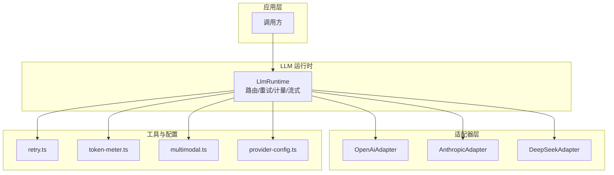
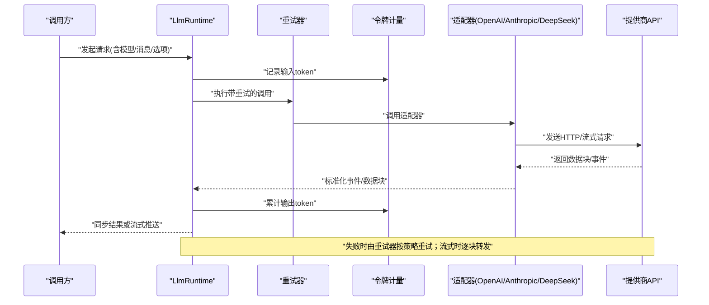
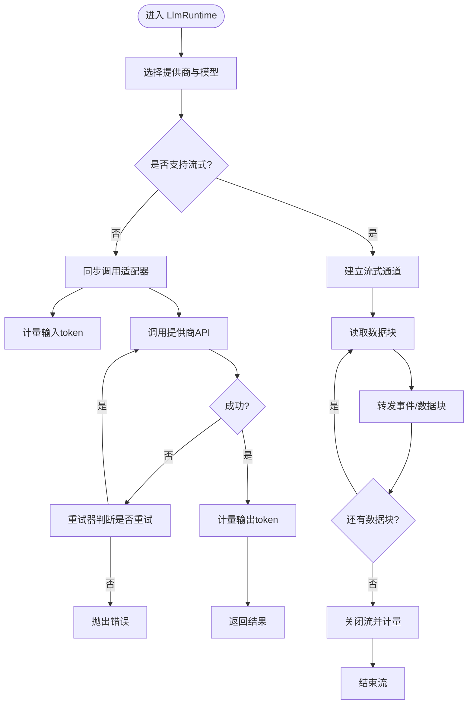
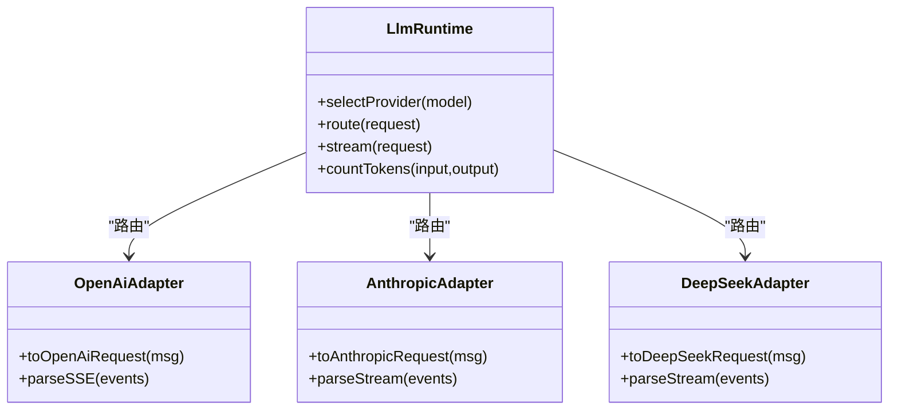
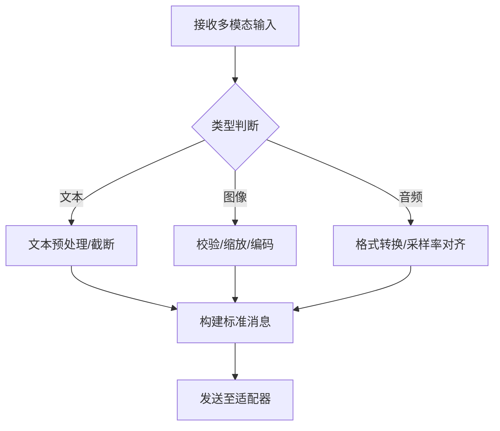
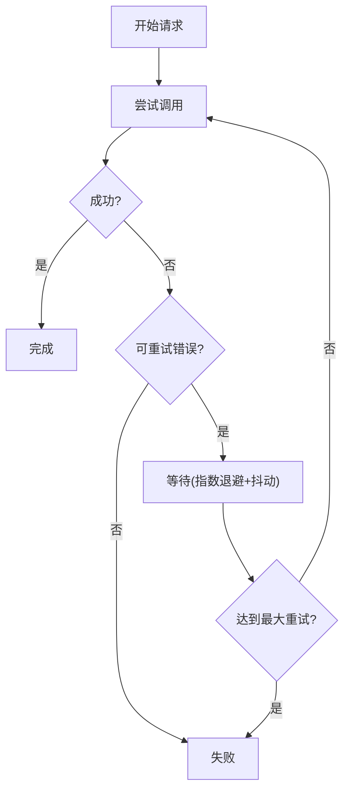
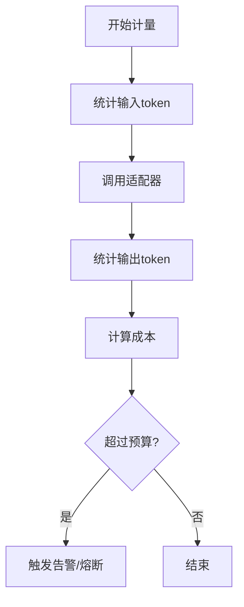
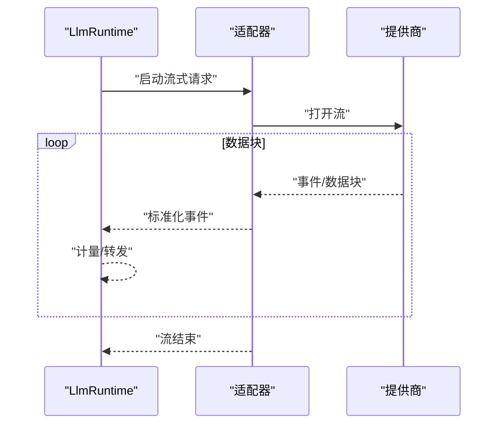
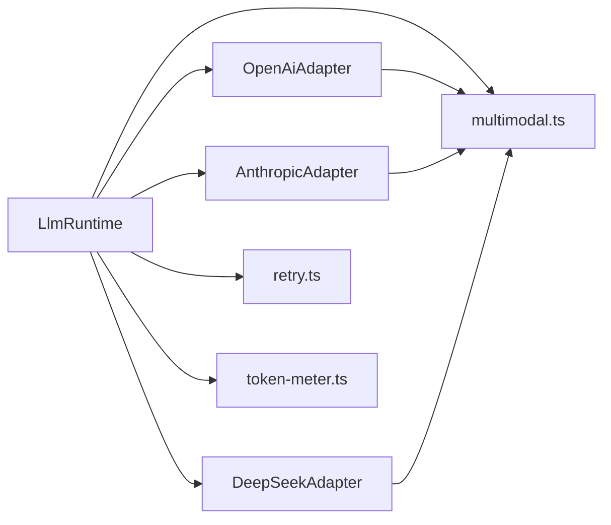

# LLM 集成

<cite>
**本文引用的文件**
- [packages/llm/src/index.ts](file://packages/llm/src/index.ts)
- [packages/llm/src/runtime/LlmRuntime.ts](file://packages/llm/src/runtime/LlmRuntime.ts)
- [packages/llm/src/adapters/openai/OpenAiAdapter.ts](file://packages/llm/src/adapters/openai/OpenAiAdapter.ts)
- [packages/llm/src/adapters/anthropic/AnthropicAdapter.ts](file://packages/llm/src/adapters/anthropic/AnthropicAdapter.ts)
- [packages/llm/src/adapters/deepseek/DeepSeekAdapter.ts](file://packages/llm/src/adapters/deepseek/DeepSeekAdapter.ts)
- [packages/llm/src/types.ts](file://packages/llm/src/types.ts)
- [packages/llm/src/utils/retry.ts](file://packages/llm/src/utils/retry.ts)
- [packages/llm/src/utils/token-meter.ts](file://packages/llm/src/utils/token-meter.ts)
- [packages/llm/src/utils/multimodal.ts](file://packages/llm/src/utils/multimodal.ts)
- [packages/llm/src/config/provider-config.ts](file://packages/llm/src/config/provider-config.ts)
- [docs/subsystems/llm-streaming.md](file://docs/subsystems/llm-streaming.md)
- [docs/subsystems/token-meter.md](file://docs/subsystems/token-meter.md)
- [docs/cookbook/adding-an-llm-adapter.md](file://docs/cookbook/adding-an-llm-adapter.md)
</cite>

## 目录
1. [简介](#简介)
2. [项目结构](#项目结构)
3. [核心组件](#核心组件)
4. [架构总览](#架构总览)
5. [详细组件分析](#详细组件分析)
6. [依赖关系分析](#依赖关系分析)
7. [性能考量](#性能考量)
8. [故障排查指南](#故障排查指南)
9. [结论](#结论)
10. [附录](#附录)

## 简介
本文件面向希望在本仓库中集成与扩展大语言模型（LLM）能力的开发者，系统性阐述 LlmRuntime 的设计与实现，包括：
- 模型适配器管理、请求路由与流式响应处理
- 多模态输入输出（文本、图像、音频等）的处理原理
- 不同提供商（OpenAI、Anthropic、DeepSeek 等）的适配层实现与配置方法
- 新增提供商接入、流式响应处理、模型选择与重试机制的实践
- 令牌计量、成本控制与性能监控
- 错误处理、超时管理与降级策略
- 安全考虑与最佳实践

## 项目结构
围绕 LLM 的核心代码位于 packages/llm 包内，采用“运行时 + 适配器 + 工具”的分层组织方式：
- 运行时：LlmRuntime 负责统一入口、路由、会话上下文、重试、计量与流式转发
- 适配器：按提供商划分（OpenAI、Anthropic、DeepSeek），屏蔽差异并标准化接口
- 工具：重试、令牌计量、多模态编解码等通用能力
- 配置：提供商凭据、模型选择、功能开关等
- 文档：子系统说明、食谱与用户指南

图表来源
- [packages/llm/src/runtime/LlmRuntime.ts:1-200](file://packages/llm/src/runtime/LlmRuntime.ts#L1-L200)
- [packages/llm/src/adapters/openai/OpenAiAdapter.ts:1-200](file://packages/llm/src/adapters/openai/OpenAiAdapter.ts#L1-L200)
- [packages/llm/src/adapters/anthropic/AnthropicAdapter.ts:1-200](file://packages/llm/src/adapters/anthropic/AnthropicAdapter.ts#L1-L200)
- [packages/llm/src/adapters/deepseek/DeepSeekAdapter.ts:1-200](file://packages/llm/src/adapters/deepseek/DeepSeekAdapter.ts#L1-L200)
- [packages/llm/src/utils/retry.ts:1-200](file://packages/llm/src/utils/retry.ts#L1-L200)
- [packages/llm/src/utils/token-meter.ts:1-200](file://packages/llm/src/utils/token-meter.ts#L1-L200)
- [packages/llm/src/utils/multimodal.ts:1-200](file://packages/llm/src/utils/multimodal.ts#L1-L200)
- [packages/llm/src/config/provider-config.ts:1-200](file://packages/llm/src/config/provider-config.ts#L1-L200)

章节来源
- [packages/llm/src/index.ts:1-200](file://packages/llm/src/index.ts#L1-L200)
- [packages/llm/src/runtime/LlmRuntime.ts:1-200](file://packages/llm/src/runtime/LlmRuntime.ts#L1-L200)
- [packages/llm/src/types.ts:1-200](file://packages/llm/src/types.ts#L1-L200)

## 核心组件
- LlmRuntime：统一的 LLM 运行时，提供模型选择、请求路由、重试、令牌计量、流式响应转发与错误处理。对外暴露一致的调用接口，内部根据配置与消息类型路由到具体适配器。
- 适配器（OpenAiAdapter / AnthropicAdapter / DeepSeekAdapter）：将标准请求转换为各提供商 API 的请求格式，并将响应（含流式）转换回标准事件或数据块。
- 工具模块：
  - retry.ts：指数退避、可配置最大重试次数与重试条件
  - token-meter.ts：统计输入/输出 token 数，支持成本估算
  - multimodal.ts：文本、图像、音频等多模态内容的编码与校验
- 配置模块：集中管理提供商凭据、默认模型、功能开关与限额

章节来源
- [packages/llm/src/runtime/LlmRuntime.ts:1-200](file://packages/llm/src/runtime/LlmRuntime.ts#L1-L200)
- [packages/llm/src/adapters/openai/OpenAiAdapter.ts:1-200](file://packages/llm/src/adapters/openai/OpenAiAdapter.ts#L1-L200)
- [packages/llm/src/adapters/anthropic/AnthropicAdapter.ts:1-200](file://packages/llm/src/adapters/anthropic/AnthropicAdapter.ts#L1-L200)
- [packages/llm/src/adapters/deepseek/DeepSeekAdapter.ts:1-200](file://packages/llm/src/adapters/deepseek/DeepSeekAdapter.ts#L1-L200)
- [packages/llm/src/utils/retry.ts:1-200](file://packages/llm/src/utils/retry.ts#L1-L200)
- [packages/llm/src/utils/token-meter.ts:1-200](file://packages/llm/src/utils/token-meter.ts#L1-L200)
- [packages/llm/src/utils/multimodal.ts:1-200](file://packages/llm/src/utils/multimodal.ts#L1-L200)
- [packages/llm/src/config/provider-config.ts:1-200](file://packages/llm/src/config/provider-config.ts#L1-L200)

## 架构总览
下图展示了从调用方到适配器的完整链路，包括重试、计量与流式转发。

图表来源
- [packages/llm/src/runtime/LlmRuntime.ts:1-200](file://packages/llm/src/runtime/LlmRuntime.ts#L1-L200)
- [packages/llm/src/utils/retry.ts:1-200](file://packages/llm/src/utils/retry.ts#L1-L200)
- [packages/llm/src/utils/token-meter.ts:1-200](file://packages/llm/src/utils/token-meter.ts#L1-L200)
- [packages/llm/src/adapters/openai/OpenAiAdapter.ts:1-200](file://packages/llm/src/adapters/openai/OpenAiAdapter.ts#L1-L200)
- [packages/llm/src/adapters/anthropic/AnthropicAdapter.ts:1-200](file://packages/llm/src/adapters/anthropic/AnthropicAdapter.ts#L1-L200)
- [packages/llm/src/adapters/deepseek/DeepSeekAdapter.ts:1-200](file://packages/llm/src/adapters/deepseek/DeepSeekAdapter.ts#L1-L200)

## 详细组件分析

### LlmRuntime：模型适配器管理、请求路由与流式响应
- 模型选择与路由
  - 根据配置与请求参数选择提供商与模型
  - 将标准请求映射到对应适配器的调用方法
- 流式响应处理
  - 对支持流式的适配器，建立流式通道，逐块转发给调用方
  - 在流式过程中持续计量 token 并上报事件
- 重试与超时
  - 基于可配置的重试策略（指数退避、最大重试次数、重试条件）
  - 设置请求与读取超时，避免长时间阻塞
- 令牌计量与成本
  - 输入/输出 token 计数，结合单价估算成本
  - 可选上限控制，防止超支

图表来源
- [packages/llm/src/runtime/LlmRuntime.ts:1-200](file://packages/llm/src/runtime/LlmRuntime.ts#L1-L200)
- [packages/llm/src/utils/retry.ts:1-200](file://packages/llm/src/utils/retry.ts#L1-L200)
- [packages/llm/src/utils/token-meter.ts:1-200](file://packages/llm/src/utils/token-meter.ts#L1-L200)

章节来源
- [packages/llm/src/runtime/LlmRuntime.ts:1-200](file://packages/llm/src/runtime/LlmRuntime.ts#L1-L200)

### 适配器层：OpenAI / Anthropic / DeepSeek
- OpenAiAdapter
  - 将标准消息转换为 OpenAI 兼容格式
  - 处理文本、图像等多模态输入，并解析流式事件
- AnthropicAdapter
  - 适配 Anthropic 的消息结构与流式协议
  - 处理系统提示、工具调用与多轮对话
- DeepSeekAdapter
  - 适配 DeepSeek 的 API 约定与流式格式
  - 支持文本与多模态内容

图表来源
- [packages/llm/src/runtime/LlmRuntime.ts:1-200](file://packages/llm/src/runtime/LlmRuntime.ts#L1-L200)
- [packages/llm/src/adapters/openai/OpenAiAdapter.ts:1-200](file://packages/llm/src/adapters/openai/OpenAiAdapter.ts#L1-L200)
- [packages/llm/src/adapters/anthropic/AnthropicAdapter.ts:1-200](file://packages/llm/src/adapters/anthropic/AnthropicAdapter.ts#L1-L200)
- [packages/llm/src/adapters/deepseek/DeepSeekAdapter.ts:1-200](file://packages/llm/src/adapters/deepseek/DeepSeekAdapter.ts#L1-L200)

章节来源
- [packages/llm/src/adapters/openai/OpenAiAdapter.ts:1-200](file://packages/llm/src/adapters/openai/OpenAiAdapter.ts#L1-L200)
- [packages/llm/src/adapters/anthropic/AnthropicAdapter.ts:1-200](file://packages/llm/src/adapters/anthropic/AnthropicAdapter.ts#L1-L200)
- [packages/llm/src/adapters/deepseek/DeepSeekAdapter.ts:1-200](file://packages/llm/src/adapters/deepseek/DeepSeekAdapter.ts#L1-L200)

### 多模态支持：文本、图像、音频
- 输入处理
  - 文本：直接序列化
  - 图像：base64 或 URL 引用，附带 MIME 类型与尺寸信息
  - 音频：编码为支持的格式（如 wav/mp3），附带采样率与时长
- 输出处理
  - 文本：增量拼接
  - 图像：分块下载与渲染
  - 音频：流式播放或落盘
- 校验与裁剪
  - 大小限制、格式白名单、敏感内容检测（可选）

图表来源
- [packages/llm/src/utils/multimodal.ts:1-200](file://packages/llm/src/utils/multimodal.ts#L1-L200)
- [packages/llm/src/types.ts:1-200](file://packages/llm/src/types.ts#L1-L200)

章节来源
- [packages/llm/src/utils/multimodal.ts:1-200](file://packages/llm/src/utils/multimodal.ts#L1-L200)
- [packages/llm/src/types.ts:1-200](file://packages/llm/src/types.ts#L1-L200)

### 重试机制与超时管理
- 重试策略
  - 指数退避、抖动、最大重试次数
  - 仅对幂等或可恢复错误重试（网络抖动、限流）
- 超时控制
  - 连接超时、读取超时、整体超时
  - 流式场景下对每个数据块设置超时
- 降级策略
  - 当主提供商不可用时，自动切换到备用提供商或降级模型

图表来源
- [packages/llm/src/utils/retry.ts:1-200](file://packages/llm/src/utils/retry.ts#L1-L200)
- [packages/llm/src/runtime/LlmRuntime.ts:1-200](file://packages/llm/src/runtime/LlmRuntime.ts#L1-L200)

章节来源
- [packages/llm/src/utils/retry.ts:1-200](file://packages/llm/src/utils/retry.ts#L1-L200)
- [packages/llm/src/runtime/LlmRuntime.ts:1-200](file://packages/llm/src/runtime/LlmRuntime.ts#L1-L200)

### 令牌计量与成本控制
- 计量维度
  - 输入 token、输出 token、多模态资源占用（可选）
- 成本估算
  - 按提供商定价表计算单次请求成本
  - 会话级累计与预算上限
- 监控与告警
  - 指标上报（QPS、延迟、成本）
  - 超限告警与自动熔断

图表来源
- [packages/llm/src/utils/token-meter.ts:1-200](file://packages/llm/src/utils/token-meter.ts#L1-L200)
- [docs/subsystems/token-meter.md:1-200](file://docs/subsystems/token-meter.md#L1-L200)

章节来源
- [packages/llm/src/utils/token-meter.ts:1-200](file://packages/llm/src/utils/token-meter.ts#L1-L200)
- [docs/subsystems/token-meter.md:1-200](file://docs/subsystems/token-meter.md#L1-L200)

### 流式响应处理
- 事件模型
  - 将提供商流式事件标准化为统一事件（如：content_start、content_delta、content_end）
- 背压与缓冲
  - 控制消费速率，避免内存膨胀
- 错误恢复
  - 流中断后尝试重连或降级为同步模式

图表来源
- [packages/llm/src/runtime/LlmRuntime.ts:1-200](file://packages/llm/src/runtime/LlmRuntime.ts#L1-L200)
- [docs/subsystems/llm-streaming.md:1-200](file://docs/subsystems/llm-streaming.md#L1-L200)

章节来源
- [docs/subsystems/llm-streaming.md:1-200](file://docs/subsystems/llm-streaming.md#L1-L200)
- [packages/llm/src/runtime/LlmRuntime.ts:1-200](file://packages/llm/src/runtime/LlmRuntime.ts#L1-L200)

### 配置与提供商管理
- 提供商配置
  - 凭据、基础 URL、模型列表、功能开关
- 动态切换
  - 运行时根据负载与可用性切换提供商
- 安全存储
  - 密钥加密存储、最小权限原则

章节来源
- [packages/llm/src/config/provider-config.ts:1-200](file://packages/llm/src/config/provider-config.ts#L1-L200)

## 依赖关系分析
- 耦合度
  - LlmRuntime 与适配器松耦合，通过统一接口解耦
  - 工具模块被多处复用，提升内聚性
- 外部依赖
  - HTTP 客户端、流式解析库、加密库等
- 循环依赖
  - 通过分层与接口隔离避免循环引用

图表来源
- [packages/llm/src/runtime/LlmRuntime.ts:1-200](file://packages/llm/src/runtime/LlmRuntime.ts#L1-L200)
- [packages/llm/src/adapters/openai/OpenAiAdapter.ts:1-200](file://packages/llm/src/adapters/openai/OpenAiAdapter.ts#L1-L200)
- [packages/llm/src/adapters/anthropic/AnthropicAdapter.ts:1-200](file://packages/llm/src/adapters/anthropic/AnthropicAdapter.ts#L1-L200)
- [packages/llm/src/adapters/deepseek/DeepSeekAdapter.ts:1-200](file://packages/llm/src/adapters/deepseek/DeepSeekAdapter.ts#L1-L200)
- [packages/llm/src/utils/retry.ts:1-200](file://packages/llm/src/utils/retry.ts#L1-L200)
- [packages/llm/src/utils/token-meter.ts:1-200](file://packages/llm/src/utils/token-meter.ts#L1-L200)
- [packages/llm/src/utils/multimodal.ts:1-200](file://packages/llm/src/utils/multimodal.ts#L1-L200)

章节来源
- [packages/llm/src/runtime/LlmRuntime.ts:1-200](file://packages/llm/src/runtime/LlmRuntime.ts#L1-L200)

## 性能考量
- 流式优先：减少首字节延迟，提升交互体验
- 批量化与缓存：对相似请求进行去重或缓存
- 并发控制：限制并发请求数，避免过载
- 资源限制：图像/音频压缩、分辨率/采样率限制
- 监控指标：P95/P99 延迟、吞吐、错误率、成本

## 故障排查指南
- 常见问题
  - 认证失败：检查凭据与权限
  - 限流：调整重试间隔与并发
  - 流中断：启用重连与降级
  - 成本高：开启预算上限与告警
- 诊断步骤
  - 查看日志与指标
  - 复现最小用例
  - 切换提供商验证
  - 逐步禁用功能定位问题

章节来源
- [packages/llm/src/utils/retry.ts:1-200](file://packages/llm/src/utils/retry.ts#L1-L200)
- [packages/llm/src/utils/token-meter.ts:1-200](file://packages/llm/src/utils/token-meter.ts#L1-L200)

## 结论
本方案通过 LlmRuntime 统一管理多提供商 LLM 能力，借助适配器抽象屏蔽差异，配合重试、计量、流式与多模态支持，形成高可用、可扩展、可观测的 LLM 集成体系。建议在生产环境启用预算控制、监控告警与降级策略，确保稳定性与成本可控。

## 附录

### 如何集成新的 LLM 提供商（示例步骤）
- 新建适配器类，实现标准接口
- 实现请求构造与响应解析（含流式）
- 注册到运行时并提供配置项
- 编写单元测试与端到端测试

章节来源
- [docs/cookbook/adding-an-llm-adapter.md:1-200](file://docs/cookbook/adding-an-llm-adapter.md#L1-L200)

### 流式响应处理示例（概念流程）
- 建立流式连接
- 逐块读取并标准化事件
- 实时计量与转发
- 异常时重连或降级

章节来源
- [docs/subsystems/llm-streaming.md:1-200](file://docs/subsystems/llm-streaming.md#L1-L200)

### 令牌计量与成本控制示例（概念流程）
- 统计输入/输出 token
- 计算成本并累计
- 超过预算时告警/熔断

章节来源
- [docs/subsystems/token-meter.md:1-200](file://docs/subsystems/token-meter.md#L1-L200)

### 安全考虑与最佳实践
- 密钥管理：使用安全存储与最小权限
- 传输安全：强制 HTTPS、证书校验
- 输入校验：白名单、大小限制、敏感内容过滤
- 审计与合规：记录关键操作与访问日志