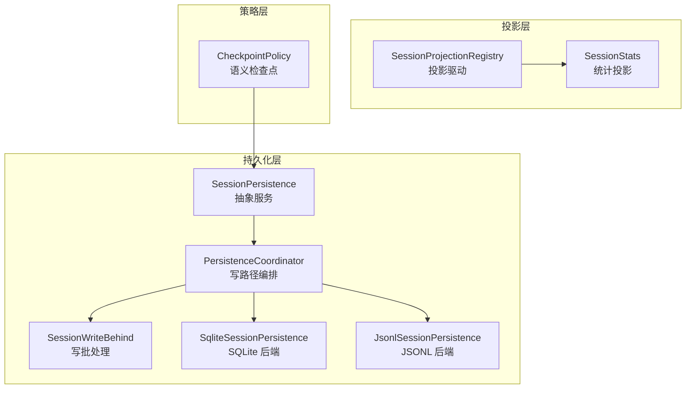
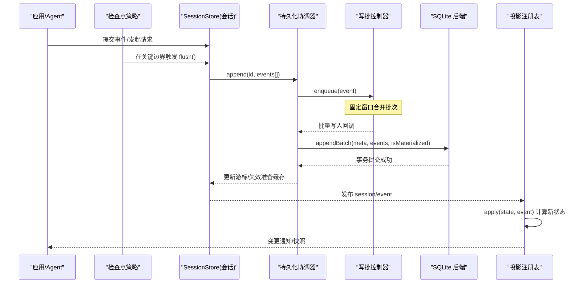
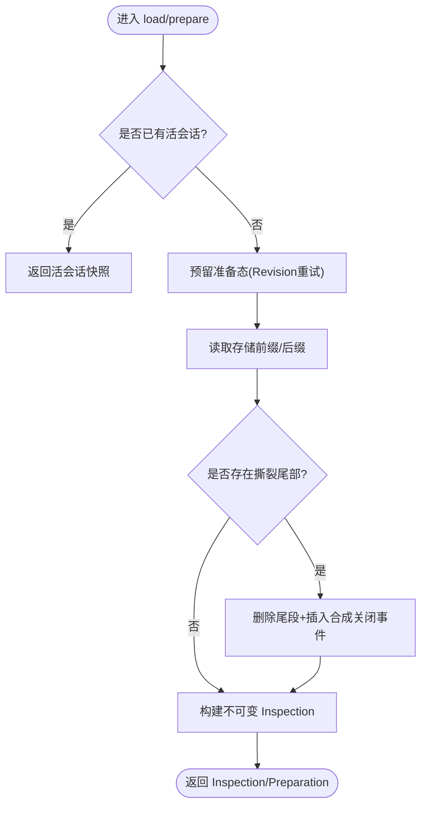
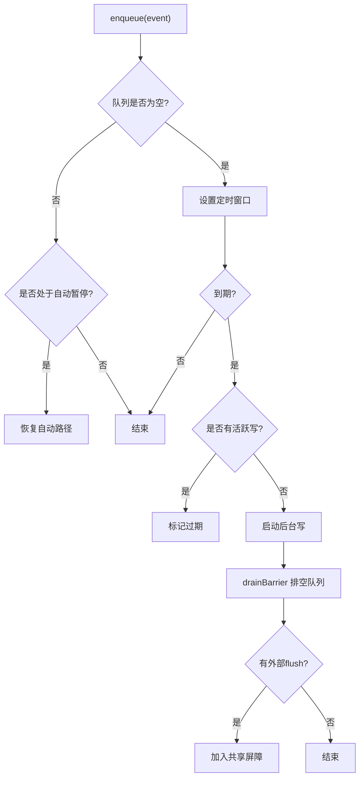
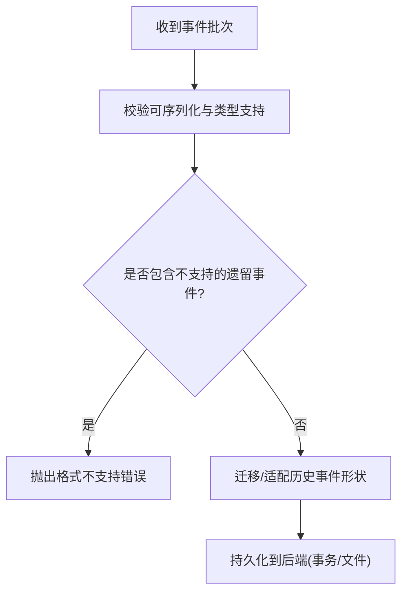
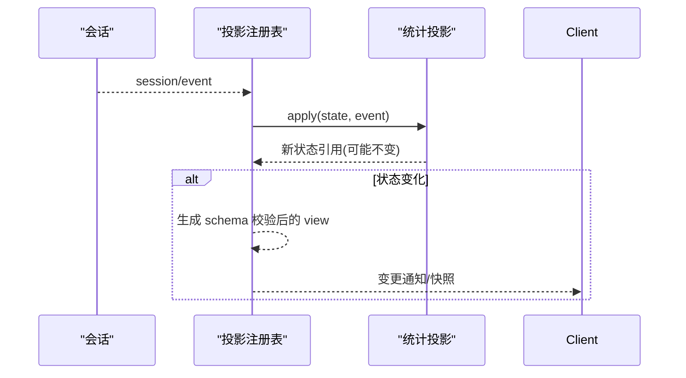
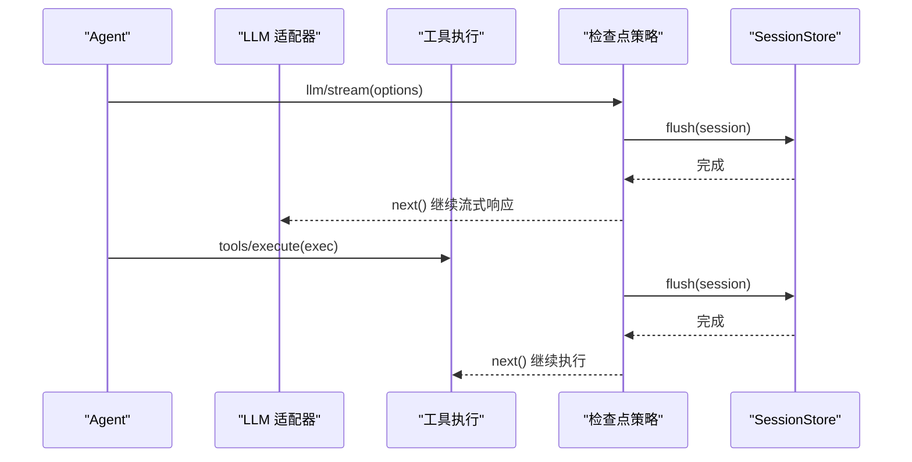
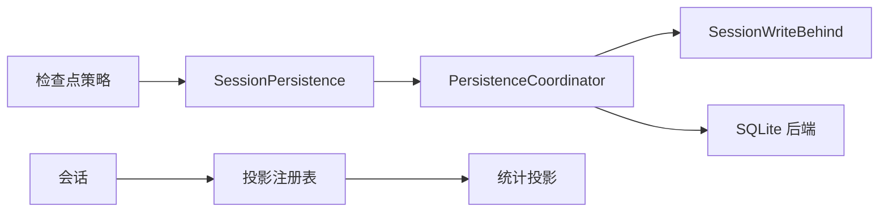

# 会话管理

<cite>
**本文引用的文件**
- [packages/session/README.md](file://packages/session/README.md)
- [packages/session/session-persistence/src/index.ts](file://packages/session/session-persistence/src/index.ts)
- [packages/session/session-persistence/src/coordinator.ts](file://packages/session/session-persistence/src/coordinator.ts)
- [packages/session/session-persistence/src/write-behind.ts](file://packages/session/session-persistence/src/write-behind.ts)
- [packages/session/session-persistence-sqlite/src/index.ts](file://packages/session/session-persistence-sqlite/src/index.ts)
- [packages/session/session-projection/src/index.ts](file://packages/session/session-projection/src/index.ts)
- [packages/session/session-stats/src/index.ts](file://packages/session/session-stats/src/index.ts)
- [packages/session/session-stats/src/projection.ts](file://packages/session/session-stats/src/projection.ts)
- [packages/session/session-checkpoint-policy/src/index.ts](file://packages/session/session-checkpoint-policy/src/index.ts)
</cite>

## 目录
1. [简介](#简介)
2. [项目结构](#项目结构)
3. [核心组件](#核心组件)
4. [架构总览](#架构总览)
5. [详细组件分析](#详细组件分析)
6. [依赖关系分析](#依赖关系分析)
7. [性能考虑](#性能考虑)
8. [故障排查指南](#故障排查指南)
9. [结论](#结论)
10. [附录](#附录)

## 简介
本文件系统性地梳理会话管理子系统，围绕 SessionStore 的持久化协调、事件溯源存储、状态投影与统计、以及语义检查点策略展开。重点说明：
- 会话的创建、恢复、压缩（通过投影缓存与只读后缀读取优化）与清理流程
- 会话事件的类型系统与事件分发机制
- SQLite 持久化的配置与优化策略
- 会话查询、过滤与聚合方法
- 常见问题与性能优化建议

该子系统由多个包组成：持久化抽象与协调器、SQLite 后端、JSONL 后端、投影注册表与缓存、标题派生、遥测等。其中 session-persistence 提供跨后端的统一接口与写路径编排；session-projection 提供基于事件的纯函数式状态投影；session-checkpoint-policy 在关键边界进行语义级持久化；session-stats 提供全量会话统计投影。

**章节来源**
- [packages/session/README.md:1-53](file://packages/session/README.md#L1-L53)

## 项目结构
会话子系统按职责拆分为多个包，形成“持久化层 + 投影层 + 策略层”的分层架构：
- 持久化层：session-persistence（抽象与协调）、session-persistence-sqlite（SQLite 实现）、session-persistence-jsonl（JSONL 实现）
- 投影层：session-projection（驱动与注册表）、session-projection-cache（投影缓存）、session-stats（统计投影）
- 策略层：session-checkpoint-policy（语义检查点）
- 其他：session-title（标题派生）、session-telemetry（遥测）



**图表来源**
- [packages/session/session-persistence/src/index.ts:84-241](file://packages/session/session-persistence/src/index.ts#L84-L241)
- [packages/session/session-persistence/src/coordinator.ts:588-800](file://packages/session/session-persistence/src/coordinator.ts#L588-L800)
- [packages/session/session-persistence/src/write-behind.ts:22-160](file://packages/session/session-persistence/src/write-behind.ts#L22-L160)
- [packages/session/session-persistence-sqlite/src/index.ts:99-200](file://packages/session/session-persistence-sqlite/src/index.ts#L99-L200)
- [packages/session/session-projection/src/index.ts:171-255](file://packages/session/session-projection/src/index.ts#L171-L255)
- [packages/session/session-stats/src/index.ts:17-29](file://packages/session/session-stats/src/index.ts#L17-L29)
- [packages/session/session-checkpoint-policy/src/index.ts:63-83](file://packages/session/session-checkpoint-policy/src/index.ts#L63-L83)

**章节来源**
- [packages/session/README.md:7-53](file://packages/session/README.md#L7-L53)

## 核心组件
- SessionPersistence：定义跨后端的会话持久化服务接口，包括 create、append、load、inspect、readFrom、list、listSnapshots、prepare 等。
- PersistenceCoordinator：协调写路径、冷启动恢复、准备态复用、修订号一致性、崩溃修复序列。
- SessionWriteBehind：单会话写队列与固定窗口批处理，支持 flush 屏障与后台失败上报。
- SqliteSessionPersistence：SQLite 后端，提供 seek-capable 的后缀读取、事务原子写入、崩溃修复删除尾段并插入合成关闭事件。
- SessionProjectionRegistry：订阅 session/event，驱动每个注册的投影单元，提供快照、变更通知、检查点与恢复。
- session-stats：一个具体投影单元，统计轮次、步骤、LLM/工具耗时、首字延迟、解码时长与输出 token。
- CheckpointPolicy：在模型流、顶级工具调用、agent 步骤前进行语义检查点，确保请求/调用的已记录前缀先持久化。

**章节来源**
- [packages/session/session-persistence/src/index.ts:84-241](file://packages/session/session-persistence/src/index.ts#L84-L241)
- [packages/session/session-persistence/src/coordinator.ts:588-800](file://packages/session/session-persistence/src/coordinator.ts#L588-L800)
- [packages/session/session-persistence/src/write-behind.ts:22-160](file://packages/session/session-persistence/src/write-behind.ts#L22-L160)
- [packages/session/session-persistence-sqlite/src/index.ts:99-200](file://packages/session/session-persistence-sqlite/src/index.ts#L99-L200)
- [packages/session/session-projection/src/index.ts:171-255](file://packages/session/session-projection/src/index.ts#L171-L255)
- [packages/session/session-stats/src/index.ts:17-29](file://packages/session/session-stats/src/index.ts#L17-L29)
- [packages/session/session-checkpoint-policy/src/index.ts:63-83](file://packages/session/session-checkpoint-policy/src/index.ts#L63-L83)

## 架构总览
下图展示了从事件产生到持久化、再到投影消费的关键路径，以及语义检查点在关键边界的介入位置。



**图表来源**
- [packages/session/session-checkpoint-policy/src/index.ts:63-83](file://packages/session/session-checkpoint-policy/src/index.ts#L63-L83)
- [packages/session/session-persistence/src/coordinator.ts:669-710](file://packages/session/session-persistence/src/coordinator.ts#L669-L710)
- [packages/session/session-persistence/src/write-behind.ts:45-115](file://packages/session/session-persistence/src/write-behind.ts#L45-L115)
- [packages/session/session-persistence-sqlite/src/index.ts:284-302](file://packages/session/session-persistence-sqlite/src/index.ts#L284-L302)
- [packages/session/session-projection/src/index.ts:171-255](file://packages/session/session-projection/src/index.ts#L171-L255)

## 详细组件分析

### 持久化服务与会话生命周期
- 创建会话：create 仅记录元数据，首次 append 时惰性物化（避免空会话残留）。
- 追加事件：append 校验事件可序列化、连续性（seq），并通过协调器调用后端 appendBatch。
- 恢复会话：prepare/load 会执行崩溃修复（截断撕裂尾部、插入合成关闭事件），返回不可变视图或准备态。
- 检查会话：inspect 不提交修复，可借用正在提交的不可变视图。
- 后缀读取：readFrom 支持从指定 seq 开始读取，SQLite 可直接定位，JSONL 顺序扫描跳过。
- 列出会话：list/listSnapshots 提供轻量元数据与修订号，用于增量同步。



**图表来源**
- [packages/session/session-persistence/src/coordinator.ts:720-800](file://packages/session/session-persistence/src/coordinator.ts#L720-L800)
- [packages/session/session-persistence-sqlite/src/index.ts:245-276](file://packages/session/session-persistence-sqlite/src/index.ts#L245-L276)
- [packages/session/session-persistence-sqlite/src/index.ts:309-338](file://packages/session/session-persistence-sqlite/src/index.ts#L309-L338)

**章节来源**
- [packages/session/session-persistence/src/index.ts:84-241](file://packages/session/session-persistence/src/index.ts#L84-L241)
- [packages/session/session-persistence/src/coordinator.ts:629-800](file://packages/session/session-persistence/src/coordinator.ts#L629-L800)
- [packages/session/session-persistence-sqlite/src/index.ts:177-200](file://packages/session/session-persistence-sqlite/src/index.ts#L177-L200)

### 写路径与批处理
- 写批控制器维护每会话的待写队列、定时器窗口、活跃写任务与屏障。
- 自动路径：空闲时到达最大等待时间即触发后台写入；若后台写仍在进行中，则标记过期并在完成后继续。
- 显式 flush：取消自动等待，建立共享屏障，串行排空队列直至稳定点。
- 失败处理：失败时保留未持久化的事件，暂停自动路径并上报后台失败。



**图表来源**
- [packages/session/session-persistence/src/write-behind.ts:45-115](file://packages/session/session-persistence/src/write-behind.ts#L45-L115)
- [packages/session/session-persistence/src/write-behind.ts:117-159](file://packages/session/session-persistence/src/write-behind.ts#L117-L159)

**章节来源**
- [packages/session/session-persistence/src/write-behind.ts:22-160](file://packages/session/session-persistence/src/write-behind.ts#L22-L160)

### SQLite 持久化实现
- 配置项：path（支持 :memory:）、journalMode（wal/delete/truncate/persist）、preparedSessionCacheSize、writeBatchMaxDelayMs。
- 读写特性：
  - readStoredRevision：无日志读取的轻量修订号。
  - loadStoredFrom：seek-capable 后缀读取，按 seq 直接筛选。
  - appendBatch：单事务内物化 sessions 行（如需要）并插入所有事件，最后递增 revision。
  - commitRepair：单事务删除撕裂尾部并插入合成关闭事件，再递增 revision。
- 安全与权限：数据库文件以 owner-only 模式创建；目录递归创建。

```mermaid
classDiagram
class SqliteSessionPersistence {
+supportsRawArtifacts : false
+locate(meta) SessionLocation?
+create(meta) Promise<void>
+append(id, events) Promise<void>
+prepare(id, signal?) Promise<Preparation>
+load(id) Promise<Inspection>
+inspect(id, signal?) Promise<Inspection>
+readFrom(id, fromSeq, signal?) Promise<{meta,events}>
+list(signal?) Promise<Header[]>
+listSnapshots(signal?) Promise<Snapshot[]>
+close() Promise<void>
-loadStored(id, signal?) Promise<StoredPrefix<number>|undefined>
-readStoredRevision(id, signal?) Promise<Revision|undefined>
-loadStoredFrom(id, fromSeq, signal?) Promise<StoredSuffix|undefined>
-appendBatch(meta, events, isMaterialized) Promise<void>
-commitRepair(meta, tornMarker?, closers) Promise<void>
}
```

**图表来源**
- [packages/session/session-persistence-sqlite/src/index.ts:99-200](file://packages/session/session-persistence-sqlite/src/index.ts#L99-L200)
- [packages/session/session-persistence-sqlite/src/index.ts:206-365](file://packages/session/session-persistence-sqlite/src/index.ts#L206-L365)

**章节来源**
- [packages/session/session-persistence-sqlite/src/index.ts:70-138](file://packages/session/session-persistence-sqlite/src/index.ts#L70-L138)
- [packages/session/session-persistence-sqlite/src/index.ts:206-365](file://packages/session/session-persistence-sqlite/src/index.ts#L206-L365)

### 事件溯源与类型系统
- 事件类型：包含用户消息、助手消息、工具调用/结果、步骤/轮次边界等。协调器对旧版本事件进行迁移与适配，拒绝不支持的遗留事件。
- 不可变性：加载/检查返回不可变视图，避免并发修改；准备态可重用对象图。
- 连续性：append 要求事件 seq 连续；后端保证追加有序。



**图表来源**
- [packages/session/session-persistence/src/coordinator.ts:273-290](file://packages/session/session-persistence/src/coordinator.ts#L273-L290)
- [packages/session/session-persistence/src/coordinator.ts:544-573](file://packages/session/session-persistence/src/coordinator.ts#L544-L573)

**章节来源**
- [packages/session/session-persistence/src/coordinator.ts:273-290](file://packages/session/session-persistence/src/coordinator.ts#L273-L290)
- [packages/session/session-persistence/src/coordinator.ts:544-573](file://packages/session/session-persistence/src/coordinator.ts#L544-L573)

### 投影系统与统计
- 投影定义：每个投影单元提供 init、apply、view 与 stateVersion，框架负责订阅事件、维护水线缓存与变更通知。
- 统计投影：统计轮次、步骤、LLM 耗时、工具耗时、首字延迟、解码时长与输出 token。
- 检查点与恢复：checkpoint 产出键值状态行；restoreFloor 计算最小可用水线；restore 结合持久化后缀重放并刷新检查点。



**图表来源**
- [packages/session/session-projection/src/index.ts:171-255](file://packages/session/session-projection/src/index.ts#L171-L255)
- [packages/session/session-stats/src/projection.ts:88-184](file://packages/session/session-stats/src/projection.ts#L88-L184)

**章节来源**
- [packages/session/session-projection/src/index.ts:171-429](file://packages/session/session-projection/src/index.ts#L171-L429)
- [packages/session/session-stats/src/index.ts:17-29](file://packages/session/session-stats/src/index.ts#L17-L29)
- [packages/session/session-stats/src/projection.ts:88-184](file://packages/session/session-stats/src/projection.ts#L88-L184)

### 语义检查点策略
- 在模型流开始前、顶级工具调用前、agent 步骤前进行 flush，确保请求/调用的已记录前缀先落盘。
- 失败关闭：检查点失败阻止下游适配器或工具体执行，保障一致性。



**图表来源**
- [packages/session/session-checkpoint-policy/src/index.ts:63-83](file://packages/session/session-checkpoint-policy/src/index.ts#L63-L83)

**章节来源**
- [packages/session/session-checkpoint-policy/src/index.ts:63-83](file://packages/session/session-checkpoint-policy/src/index.ts#L63-L83)

## 依赖关系分析
- 持久化层依赖协调器与写批控制器；SQLite 后端实现后端钩子，协调器负责通用逻辑（缓冲、序列化、恢复、修订号）。
- 投影层独立于持久化内部，通过 session/event 事件驱动，提供快照与变更通知。
- 检查点策略依赖会话存储与工具/LLM 边界，确保关键操作前持久化。



**图表来源**
- [packages/session/session-checkpoint-policy/src/index.ts:63-83](file://packages/session/session-checkpoint-policy/src/index.ts#L63-L83)
- [packages/session/session-persistence/src/coordinator.ts:588-800](file://packages/session/session-persistence/src/coordinator.ts#L588-L800)
- [packages/session/session-projection/src/index.ts:171-255](file://packages/session/session-projection/src/index.ts#L171-L255)

**章节来源**
- [packages/session/session-persistence/src/index.ts:84-241](file://packages/session/session-persistence/src/index.ts#L84-L241)
- [packages/session/session-projection/src/index.ts:171-429](file://packages/session/session-projection/src/index.ts#L171-L429)

## 性能考虑
- 写批窗口：通过 writeBatchMaxDelayMs 控制批大小与延迟，平衡吞吐与实时性。
- 后缀读取：SQLite 使用 loadStoredFrom 按 seq 直接筛选，避免全量解析；JSONL 顺序扫描但仅返回所需后缀。
- 准备态缓存：preparedSessionCacheSize 控制冷启动准备态复用，减少重复解析与重建。
- 事务原子：SQLite 将物化与事件插入置于同一事务，失败回滚，避免部分写入。
- 投影缓存：projection checkpoint 减少冷启动重放成本，stateVersion 保证兼容性。

[本节为通用性能讨论，不直接分析具体文件]

## 故障排查指南
- 格式不支持：当会话日志版本高于当前 harness 或包含不支持的遗留事件类型时，会抛出格式不支持错误；可通过 locate 获取原始日志路径以便诊断。
- 数据损坏：后端读取成功后验证失败会抛出数据损坏错误；协调器会在 load 时尝试崩溃修复（截断撕裂尾部并插入合成关闭事件）。
- 冲突创建：若 id 已存在或磁盘上已有同名会话，create 将拒绝，应改为 load/resume。
- 写入失败：写批失败会保留未持久化事件并暂停自动路径，需检查后台失败报告与存储介质状态。
- 投影恢复异常：restore 若发现持久化检查点与当前 unit 版本不匹配或 log 缩短，会要求从 seq 0 重新读取。

**章节来源**
- [packages/session/session-persistence/src/coordinator.ts:35-81](file://packages/session/session-persistence/src/coordinator.ts#L35-L81)
- [packages/session/session-persistence/src/coordinator.ts:645-658](file://packages/session/session-persistence/src/coordinator.ts#L645-L658)
- [packages/session/session-persistence/src/coordinator.ts:756-800](file://packages/session/session-persistence/src/coordinator.ts#L756-L800)
- [packages/session/session-persistence-sqlite/src/index.ts:284-338](file://packages/session/session-persistence-sqlite/src/index.ts#L284-L338)
- [packages/session/session-projection/src/index.ts:355-385](file://packages/session/session-projection/src/index.ts#L355-L385)

## 结论
本会话管理系统通过清晰的职责分层与可扩展的事件驱动设计，实现了高可靠、高性能的会话持久化与状态投影。协调器统一管理写路径与恢复流程，SQLite 后端提供高效的事务与后缀读取能力，投影系统提供纯函数式的状态计算与变更通知，检查点策略在关键边界确保一致性。配合合理的批处理窗口、准备态缓存与投影检查点，可在大规模会话场景下保持良好吞吐与低延迟。

[本节为总结性内容，不直接分析具体文件]

## 附录

### 代码示例路径（不含代码内容）
- 创建会话与追加事件：
  - [packages/session/session-persistence/src/index.ts:126-143](file://packages/session/session-persistence/src/index.ts#L126-L143)
  - [packages/session/session-persistence/src/coordinator.ts:629-710](file://packages/session/session-persistence/src/coordinator.ts#L629-L710)
- 恢复会话与崩溃修复：
  - [packages/session/session-persistence/src/coordinator.ts:720-800](file://packages/session/session-persistence/src/coordinator.ts#L720-L800)
  - [packages/session/session-persistence-sqlite/src/index.ts:245-338](file://packages/session/session-persistence-sqlite/src/index.ts#L245-L338)
- 会话查询与过滤：
  - [packages/session/session-persistence/src/index.ts:202-228](file://packages/session/session-persistence/src/index.ts#L202-L228)
  - [packages/session/session-persistence-sqlite/src/index.ts:220-238](file://packages/session/session-persistence-sqlite/src/index.ts#L220-L238)
- 会话聚合（统计投影）：
  - [packages/session/session-stats/src/projection.ts:88-184](file://packages/session/session-stats/src/projection.ts#L88-L184)
- 会话持久化配置（SQLite）：
  - [packages/session/session-persistence-sqlite/src/index.ts:70-138](file://packages/session/session-persistence-sqlite/src/index.ts#L70-L138)

[本节为索引与导航，不直接分析具体文件]