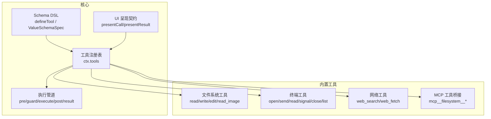
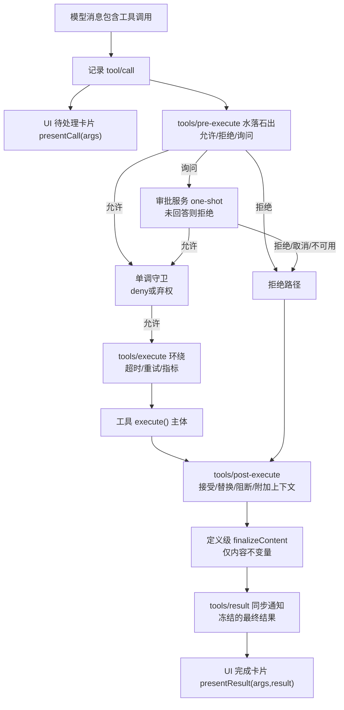
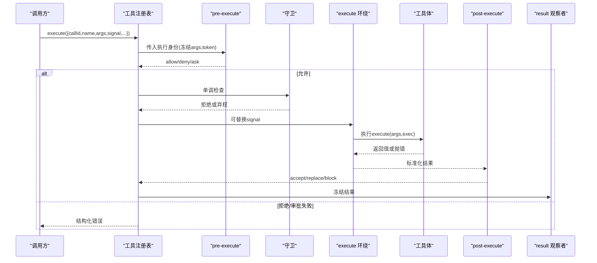
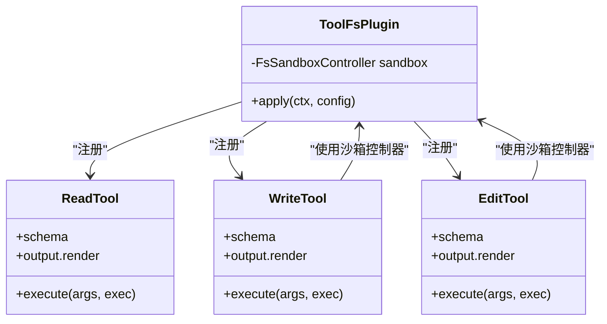
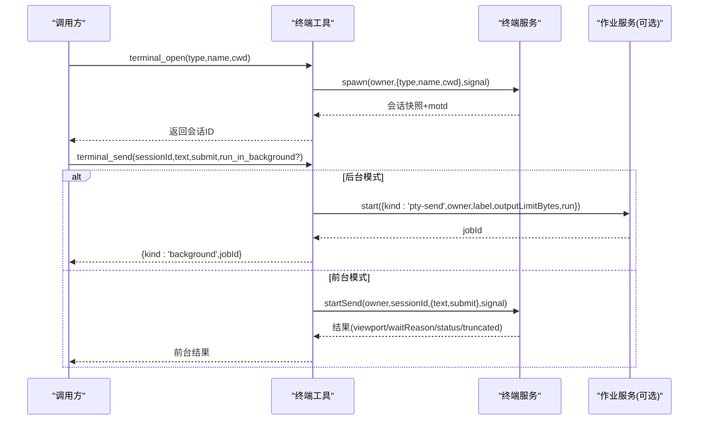
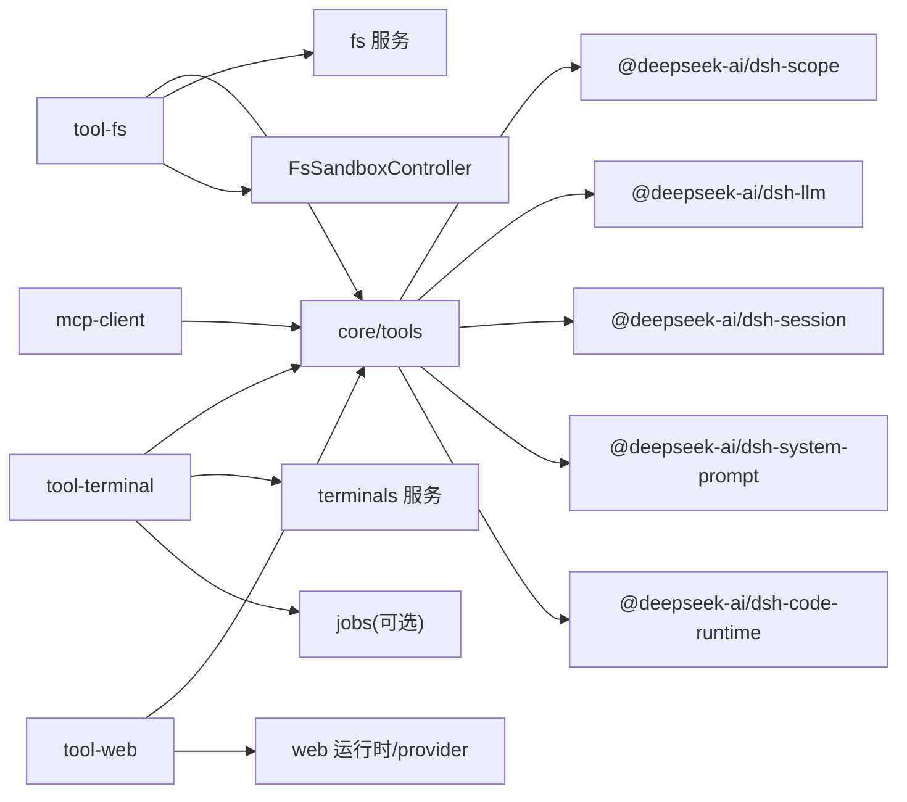
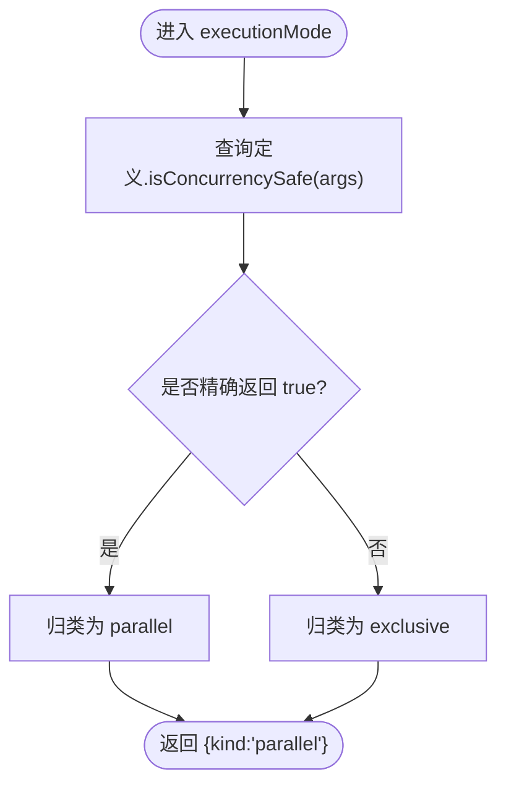

# 工具系统

<cite>
**本文引用的文件**
- [packages/core/tools/src/index.ts](file://packages/core/tools/src/index.ts)
- [packages/core/tools/src/schema.ts](file://packages/core/tools/src/schema.ts)
- [packages/core/tools/src/presentation.ts](file://packages/core/tools/src/presentation.ts)
- [packages/core/tools/src/code-mode.ts](file://packages/core/tools/src/code-mode.ts)
- [docs/subsystems/tools.md](file://docs/subsystems/tools.md)
- [docs/tool-execution-pipeline.md](file://docs/tool-execution-pipeline.md)
- [docs/cookbook/adding-a-tool.md](file://docs/cookbook/adding-a-tool.md)
- [packages/fs/tool-fs/src/index.ts](file://packages/fs/tool-fs/src/index.ts)
- [packages/fs/tool-fs/tests/integration.spec.ts](file://packages/fs/tool-fs/tests/integration.spec.ts)
- [packages/fs/tool-fs/tests/tools.spec.ts](file://packages/fs/tool-fs/tests/tools.spec.ts)
- [packages/terminal/tool-terminal/src/index.ts](file://packages/terminal/tool-terminal/src/index.ts)
- [packages/web/tool-web/tests/tool-web.spec.ts](file://packages/web/tool-web/tests/tool-web.spec.ts)
- [packages/mcp/mcp-client/tests/mcp-client.e2e.ts](file://packages/mcp/mcp-client/tests/mcp-client.e2e.ts)
- [packages/core/tools/tests/code-mode.spec.ts](file://packages/core/tools/tests/code-mode.spec.ts)
- [packages/core/tools/tests/execution-signal-types.spec.ts](file://packages/core/tools/tests/execution-signal-types.spec.ts)
- [packages/extensions/cordis-host-runner/src/guard.ts](file://packages/extensions/cordis-host-runner/src/guard.ts)
- [packages/extensions/cordis-host-runner/tests/sandbox.spec.ts](file://packages/extensions/cordis-host-runner/tests/sandbox.spec.ts)
- [docs/subsystems/filesystem.md](file://docs/subsystems/filesystem.md)
- [docs/subsystems/sandbox.md](file://docs/subsystems/sandbox.md)
</cite>

## 目录
1. [简介](#简介)
2. [项目结构](#项目结构)
3. [核心组件](#核心组件)
4. [架构总览](#架构总览)
5. [详细组件分析](#详细组件分析)
6. [依赖关系分析](#依赖关系分析)
7. [性能与并发](#性能与并发)
8. [故障排查指南](#故障排查指南)
9. [结论](#结论)
10. [附录：自定义工具开发指南](#附录自定义工具开发指南)

## 简介
本文件系统性地梳理并文档化该仓库中的“工具系统”（Tool System），覆盖工具注册机制、执行管道、声明式参数与输出定义、权限控制、执行环境隔离、内置工具实现与使用、自定义工具开发、异步与并发、资源管理以及安全最佳实践。目标是让不同经验水平的开发者都能理解并安全地扩展工具能力。

## 项目结构
工具系统的核心位于 packages/core/tools，提供工具注册表、声明式 Schema DSL、执行管道（pre-execute → guards → execute → post-execute → finalizeContent → result）和 UI 呈现契约。文件系统工具在 packages/fs/tool-fs，终端工具在 packages/terminal/tool-terminal，网络工具在 packages/web/tool-web（通过测试可见其存在与行为）。MCP 客户端将外部 MCP 服务器暴露为工具，见 mcp-client 测试。

图表来源
- [packages/core/tools/src/index.ts:1-200](file://packages/core/tools/src/index.ts#L1-L200)
- [docs/subsystems/tools.md:1-120](file://docs/subsystems/tools.md#L1-L120)

章节来源
- [packages/core/tools/src/index.ts:1-200](file://packages/core/tools/src/index.ts#L1-L200)
- [docs/subsystems/tools.md:1-120](file://docs/subsystems/tools.md#L1-L120)

## 核心组件
- 工具注册表与执行入口：ctx.tools.register、ctx.tools.execute、ctx.tools.schemas、ctx.tools.executionMode、ctx.tools.guard、ctx.tools.presentAs。
- 声明式 Schema：ValueSchemaSpec/ParameterSchemaSpec，统一用于参数与输出；defineTool 将模型可见的 ToolSchema 与执行体、输出投影解耦。
- 执行管道：tools/pre-execute（允许/拒绝/询问）、monotonic guards（最终否决）、tools/execute（超时/重试/指标等 around-dispatch）、tools/post-execute（接受/替换/阻断/附加上下文）、finalizeContent（内容不变量）、tools/result（不可变结果观察）。
- UI 呈现：presentCall/presentResult 返回中性 card 意图（generic/terminal/diff/search/read/web），与模型可见内容分离。
- Code Mode 集成：run_code 作为保留传输名，子调用携带 parent token，支持并发调度与日志重写。

章节来源
- [packages/core/tools/src/index.ts:140-200](file://packages/core/tools/src/index.ts#L140-L200)
- [docs/subsystems/tools.md:9-152](file://docs/subsystems/tools.md#L9-L152)
- [docs/subsystems/tools.md:170-375](file://docs/subsystems/tools.md#L170-L375)
- [docs/subsystems/tools.md:459-468](file://docs/subsystems/tools.md#L459-L468)

## 架构总览
工具执行从模型消息触发，进入会话事件 tool/call，随后经过 UI 待处理卡片、预执行策略、守卫、around-dispatch、工具体、后处理、最终内容固定、结果通知与 UI 完成卡片。

图表来源
- [docs/tool-execution-pipeline.md:8-58](file://docs/tool-execution-pipeline.md#L8-L58)
- [docs/subsystems/tools.md:170-375](file://docs/subsystems/tools.md#L170-L375)

章节来源
- [docs/tool-execution-pipeline.md:1-63](file://docs/tool-execution-pipeline.md#L1-L63)
- [docs/subsystems/tools.md:170-375](file://docs/subsystems/tools.md#L170-L375)

## 详细组件分析

### 工具注册与执行管道
- 注册：ctx.tools.register(defineTool({...}))，defineTool 校验参数 Schema、产出模型可见 ToolSchema，并将执行体与输出投影绑定。
- 执行：ctx.tools.execute({ callId, name, arguments, signal, agent?, parent? }) 进入管道；arguments 在一次递归中快照为无损耗 JSON 并冻结，分配不可变 token。
- 管道阶段：
  - tools/pre-execute：可 deny/ask/allow；缺少审批支持时 ask 转为拒绝。
  - guards：单调守卫，只能拒绝不能放行。
  - tools/execute：around-dispatch，可替换 exec.signal 但不能移除；需恢复信号并达到静默。
  - tools/post-execute：可 accept/replace value/content/block 并附加 additionalContexts。
  - finalizeContent：仅能修改内容，保持 isError/value/meta/contexts 不变。
  - tools/result：观察者收到冻结的最终结果。

图表来源
- [packages/core/tools/src/index.ts:140-200](file://packages/core/tools/src/index.ts#L140-L200)
- [docs/subsystems/tools.md:170-375](file://docs/subsystems/tools.md#L170-L375)

章节来源
- [packages/core/tools/src/index.ts:140-200](file://packages/core/tools/src/index.ts#L140-L200)
- [docs/subsystems/tools.md:170-375](file://docs/subsystems/tools.md#L170-L375)

### 文件系统工具（read/write/edit/read_image）
- 插件入口：tool-fs 注入 ['tools','fs','systemPrompt']，按配置注册 read/write/edit，并在挂载 attachments 时注册 read_image。
- 沙箱控制器：write/edit 通过 FsSandboxController 进行广告门控、每调用策略解析与拒绝标记映射，依据 ctx.fs.sandboxMode 决定行为。
- 行为特性：
  - read 并行安全，write/edit 互斥（exclusive）。
  - 读操作支持窗口化、行/字节限制与流式读取阈值。
  - 无 timeoutMs：文件 IO 不设置 deadline，但会传播取消信号。
- 测试验证：注册名称、执行模式、读写语义、缺失文件错误码 FS_NOT_FOUND 等。

图表来源
- [packages/fs/tool-fs/src/index.ts:1-80](file://packages/fs/tool-fs/src/index.ts#L1-L80)
- [packages/fs/tool-fs/tests/tools.spec.ts:153-167](file://packages/fs/tool-fs/tests/tools.spec.ts#L153-L167)

章节来源
- [packages/fs/tool-fs/src/index.ts:1-80](file://packages/fs/tool-fs/src/index.ts#L1-L80)
- [packages/fs/tool-fs/tests/integration.spec.ts:48-67](file://packages/fs/tool-fs/tests/integration.spec.ts#L48-L67)
- [packages/fs/tool-fs/tests/integration.spec.ts:294-308](file://packages/fs/tool-fs/tests/integration.spec.ts#L294-L308)
- [packages/fs/tool-fs/tests/tools.spec.ts:153-167](file://packages/fs/tool-fs/tests/tools.spec.ts#L153-L167)
- [docs/subsystems/filesystem.md:1-9](file://docs/subsystems/filesystem.md#L1-L9)

### 终端工具（open/send/read/signal/close/list）
- 插件入口：tool-terminal 注入 ['terminals','tools','systemPrompt']，注册六个持久化终端工具。
- 功能要点：
  - terminal_open：创建拥有者隔离的会话。
  - terminal_send：发送文本，支持前台等待或后台任务（jobs.start）。
  - terminal_read：分页读取保留输出。
  - terminal_signal：向当前前台进程组发送信号（禁止 shell-targeted SIGKILL）。
  - terminal_close：关闭会话并等待进程树清理。
  - terminal_list：列出当前 Agent 拥有的会话。
- 结果裁剪：finalizeContent 对完整文本结果进行最大字节裁剪，避免超大响应。

图表来源
- [packages/terminal/tool-terminal/src/index.ts:145-399](file://packages/terminal/tool-terminal/src/index.ts#L145-L399)

章节来源
- [packages/terminal/tool-terminal/src/index.ts:1-400](file://packages/terminal/tool-terminal/src/index.ts#L1-L400)

### 网络工具（web_search/web_fetch）
- web_search：当无可用 provider 时返回 WEB_PROVIDER_UNAVAILABLE。
- web_fetch：将 fetch 摘要写入 meta，并提供 web/fetch 视图；正确转发 exec.signal 给底层 provider。
- 测试覆盖：provider 可用性、结构化错误、meta 投影、信号传递。

章节来源
- [packages/web/tool-web/tests/tool-web.spec.ts:531-627](file://packages/web/tool-web/tests/tool-web.spec.ts#L531-L627)

### MCP 工具桥接
- 通过 stdio 启动外部 MCP 服务器，自动发现并注册 mcp__filesystem__* 工具。
- 端到端验证：写文件后读回一致，工具集合包含预期名称。

章节来源
- [packages/mcp/mcp-client/tests/mcp-client.e2e.ts:353-396](file://packages/mcp/mcp-client/tests/mcp-client.e2e.ts#L353-L396)

### 权限控制与安全
- 预执行策略：tools/pre-execute 可实现允许/拒绝/询问；缺少审批支持时询问转为拒绝。
- 单调守卫：ctx.tools.guard 提供最终否决权，后续监听器无法撤销拒绝。
- 沙箱模式：sandboxPolicy.resolve 基于会话与显式 mode 选择受限执行模式；full/partial 表示强制完整性。
- Web 权限预设与审批：Web 宿主组合沙箱提供方、策略、受限 shell/fs、用户审批与权限预设，默认 workspace-write 与 ask 策略。

章节来源
- [docs/subsystems/tools.md:153-172](file://docs/subsystems/tools.md#L153-L172)
- [docs/subsystems/sandbox.md:23-94](file://docs/subsystems/sandbox.md#L23-L94)
- [.agents/notes/implemented/feature/2026-07-23-web-permission-and-approval.md:1-20](file://.agents/notes/implemented/feature/2026-07-23-web-permission-and-approval.md#L1-L20)

### 执行环境隔离
- 工具执行身份受保护：arguments 冻结、token 不可变、signal 由调用方提供且不可移除。
- Code Mode 子调用：parent token 标识嵌套调用，子调用日志可被 tools/code-dispatch-log 重写，但不影响程序值与模型可见结果。
- 沙箱：confined 模式下通过 ctx.sandbox 运行；danger-full-access 不走 ctx.sandbox。

章节来源
- [docs/subsystems/tools.md:170-312](file://docs/subsystems/tools.md#L170-L312)
- [docs/subsystems/sandbox.md:23-94](file://docs/subsystems/sandbox.md#L23-L94)

## 依赖关系分析
- 核心工具包依赖：@deepseek-ai/cordis（Context/Service）、@deepseek-ai/dsh-scope（作用域）、@deepseek-ai/dsh-llm（类型/错误）、@deepseek-ai/dsh-session（JSON 快照）、@deepseek-ai/dsh-system-prompt（系统提示）、@deepseek-ai/dsh-code-runtime（Code Mode）。
- 文件系统工具依赖：fs 服务、可选 attachments、systemPrompt；通过 FsSandboxController 与策略交互。
- 终端工具依赖：terminals 服务、可选 jobs；通过 finalizeContent 控制输出大小。
- 网络工具依赖：web 运行时与 provider 注册表。
- MCP 工具：stdio 传输、外部进程生命周期管理。

图表来源
- [packages/core/tools/src/index.ts:1-30](file://packages/core/tools/src/index.ts#L1-L30)
- [packages/fs/tool-fs/src/index.ts:1-23](file://packages/fs/tool-fs/src/index.ts#L1-L23)
- [packages/terminal/tool-terminal/src/index.ts:1-28](file://packages/terminal/tool-terminal/src/index.ts#L1-L28)

章节来源
- [packages/core/tools/src/index.ts:1-30](file://packages/core/tools/src/index.ts#L1-L30)
- [packages/fs/tool-fs/src/index.ts:1-23](file://packages/fs/tool-fs/src/index.ts#L1-L23)
- [packages/terminal/tool-terminal/src/index.ts:1-28](file://packages/terminal/tool-terminal/src/index.ts#L1-L28)

## 性能与并发
- 并发分类：isConcurrencySafe 返回 exact true 才视为并行；未知、隐藏、未声明、无效或抛出分类器均视为独占。
- 调度策略：parallel 可与兄弟调用重叠；exclusive 形成排序屏障，先清空池再单独运行，之后等待的调用才会开始。
- 并发上限：maxParallelSubCalls 可限制 Code Mode 下子调用的最大并发窗口。
- 信号与取消：exec.signal 必须被尊重；around-dispatch 可替换信号但需恢复并达到静默；工具体需在取消时尽快到达可中止点。
- 结果规范化：registry 捕获 schema/renderer/projector/lossless-JSON 失败，将其转化为 isError 并继续到 finalizeContent，保证观察者看到一致结果。

图表来源
- [packages/core/tools/src/index.ts:546-554](file://packages/core/tools/src/index.ts#L546-L554)
- [packages/core/tools/tests/code-mode.spec.ts:473-590](file://packages/core/tools/tests/code-mode.spec.ts#L473-L590)

章节来源
- [packages/core/tools/tests/code-mode.spec.ts:473-590](file://packages/core/tools/tests/code-mode.spec.ts#L473-L590)
- [docs/subsystems/tools.md:243-254](file://docs/subsystems/tools.md#L243-L254)

## 故障排查指南
- 参数校验失败：ToolArgsError（INVALID_ARGS），发生在 defineTool 校验阶段，检查 parameters 与 required 字段。
- 输出无效：ToolOutputError（INVALID_TOOL_OUTPUT），发生在 registry 对 execute 返回值与 output.schema 校验阶段。
- 未知工具：UNKNOWN_TOOL，工具不可见或未注册。
- 文件缺失：FS_NOT_FOUND，read 不存在文件时返回。
- 网络不可用：WEB_PROVIDER_UNAVAILABLE，web_search 无可用 provider。
- 审批缺失：ask 但未提供审批通道或超时未回答，转为拒绝。
- 调试建议：
  - 使用 tools/result 观察冻结结果。
  - 在 tools/post-execute 中替换 content/value 以屏蔽敏感信息。
  - 在 tools/execute 中包装超时/重试/指标。
  - 使用 guard 做最终否决。

章节来源
- [docs/subsystems/tools.md:149-152](file://docs/subsystems/tools.md#L149-L152)
- [packages/fs/tool-fs/tests/integration.spec.ts:294-308](file://packages/fs/tool-fs/tests/integration.spec.ts#L294-L308)
- [packages/web/tool-web/tests/tool-web.spec.ts:547-552](file://packages/web/tool-web/tests/tool-web.spec.ts#L547-L552)
- [packages/core/tools/src/index.ts:140-200](file://packages/core/tools/src/index.ts#L140-L200)

## 结论
工具系统通过声明式 Schema、严格的执行管道与可插拔策略，实现了安全、可观测、可扩展的工具生态。内置工具覆盖了文件、终端与网络等常见能力，并通过沙箱、审批与权限预设保障安全边界。Code Mode 无缝接入工具，支持并发与日志重写。遵循本文档的最佳实践，可以高效构建可靠的自定义工具与工具链。

## 附录：自定义工具开发指南

### 最小工具形状
- 使用 defineTool 声明 name、description、parameters、output（schema + render + 可选 presentationMeta）、execute。
- 在 apply(ctx) 中通过 ctx.tools.register 注册；插件 fiber 销毁即注销工具。
- 参考示例路径：[添加工具的 CookBook:7-36](file://docs/cookbook/adding-a-tool.md#L7-L36)

章节来源
- [docs/cookbook/adding-a-tool.md:7-36](file://docs/cookbook/adding-a-tool.md#L7-L36)

### 参数与输出
- 参数：使用 ParameterSchemaSpec，required 标注必填；根对象隐式开放。
- 输出：ValueSchemaSpec 支持标量、数组、对象、json、oneOf；render 生成模型可见内容；presentationMeta 生成可重放 UI 元数据。
- 校验：defineTool 在 execute 前校验参数；输出值在 registry 中再次校验并冻结。

章节来源
- [docs/subsystems/tools.md:98-152](file://docs/subsystems/tools.md#L98-L152)

### 执行上下文与信号
- exec.signal 必须被尊重；around-dispatch 可替换但需恢复。
- exec.agent 可用于异步通知（agent.inject），注意捕获已处置异常。
- 执行身份（callId、name、arguments、token、signal、parent）不可变。

章节来源
- [docs/cookbook/adding-a-tool.md:40-49](file://docs/cookbook/adding-a-tool.md#L40-L49)
- [packages/core/tools/tests/execution-signal-types.spec.ts:79-104](file://packages/core/tools/tests/execution-signal-types.spec.ts#L79-L104)

### 权限与策略
- 使用 tools/pre-execute 实现 allow/deny/ask。
- 使用 ctx.tools.guard 做最终否决。
- 结合 sandboxPolicy 与 permission presets 控制访问范围。

章节来源
- [docs/cookbook/adding-a-tool.md:57-60](file://docs/cookbook/adding-a-tool.md#L57-L60)
- [docs/subsystems/sandbox.md:67-94](file://docs/subsystems/sandbox.md#L67-L94)

### 长耗时与后台任务
- 通过 ctx.jobs.start 注册后台任务，返回 { kind:'background', jobId }。
- 前台工作耦合 exec.signal；后台任务使用任务级取消信号，避免外层取消杀死已发布任务。

章节来源
- [docs/cookbook/adding-a-tool.md:51-56](file://docs/cookbook/adding-a-tool.md#L51-L56)
- [packages/terminal/tool-terminal/src/index.ts:246-281](file://packages/terminal/tool-terminal/src/index.ts#L246-L281)

### UI 呈现
- presentCall 返回 pending 卡片（generic/terminal/diff）。
- presentResult 返回 completed 卡片（generic/terminal/diff/search/read/web）。
- 保持纯函数，避免 I/O 与状态依赖，确保回放一致性。

章节来源
- [docs/cookbook/adding-a-tool.md:67-90](file://docs/cookbook/adding-a-tool.md#L67-L90)
- [docs/subsystems/tools.md:459-468](file://docs/subsystems/tools.md#L459-L468)

### 测试方法
- 单元测试：验证注册名称、执行模式、错误码、并发行为。
- 集成测试：挂载 Context、加载插件、调用工具并断言副作用与结果。
- 端到端：MCP 工具桥接、网络工具 provider 可用性、审批流程。

章节来源
- [packages/fs/tool-fs/tests/integration.spec.ts:48-67](file://packages/fs/tool-fs/tests/integration.spec.ts#L48-L67)
- [packages/fs/tool-fs/tests/tools.spec.ts:153-167](file://packages/fs/tool-fs/tests/tools.spec.ts#L153-L167)
- [packages/mcp/mcp-client/tests/mcp-client.e2e.ts:353-396](file://packages/mcp/mcp-client/tests/mcp-client.e2e.ts#L353-L396)
- [packages/web/tool-web/tests/tool-web.spec.ts:531-627](file://packages/web/tool-web/tests/tool-web.spec.ts#L531-L627)

### 复杂工具链示例
- 组合多个工具：在 execute 中顺序或并发调用其他工具，使用 deferContext 传递嵌套上下文，必要时 concludeTurn 终止当前轮次。
- 使用 isConcurrencySafe 优化并行度，配合 maxParallelSubCalls 控制并发上限。
- 使用 tools/post-execute 替换内容或阻断结果以满足保密性要求。

章节来源
- [docs/subsystems/tools.md:212-241](file://docs/subsystems/tools.md#L212-L241)
- [packages/core/tools/tests/code-mode.spec.ts:473-590](file://packages/core/tools/tests/code-mode.spec.ts#L473-L590)

### 动态工具声明与沙箱边界
- 动态声明需满足严格的结构约束（options、output、execute、presentationMeta 类型），否则在注册前即被拒绝。
- 沙箱内 evaluate 的边界由 host runner 提供，确保全局隔离与 Node-API 陷阱。

章节来源
- [packages/extensions/cordis-host-runner/tests/sandbox.spec.ts:14-27](file://packages/extensions/cordis-host-runner/tests/sandbox.spec.ts#L14-L27)
- [packages/extensions/cordis-host-runner/src/guard.ts:366-384](file://packages/extensions/cordis-host-runner/src/guard.ts#L366-L384)