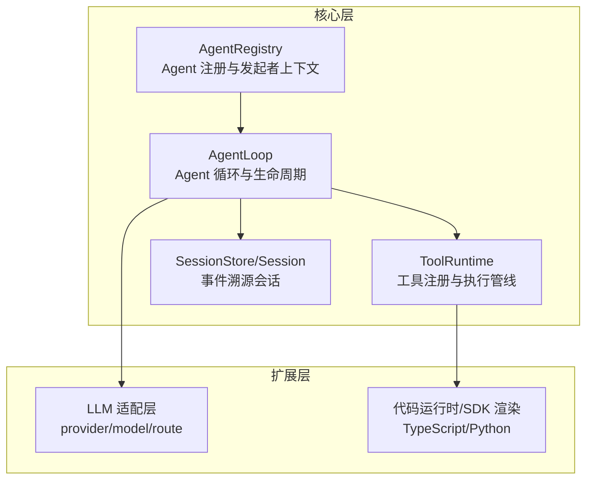
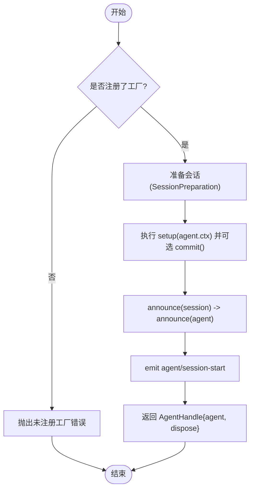
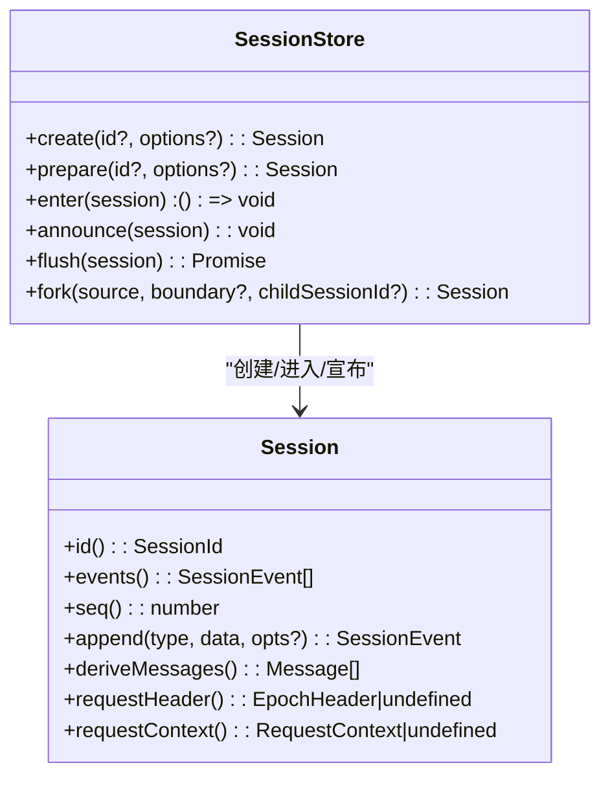
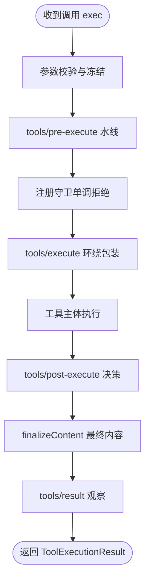
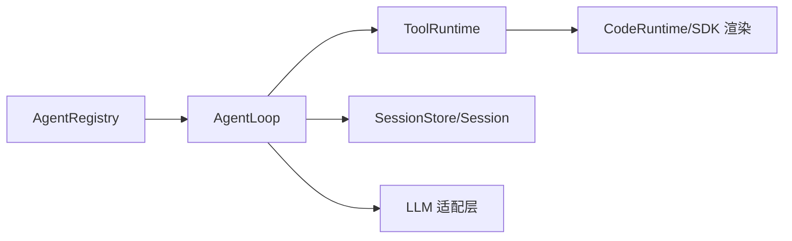

# 核心子系统

<cite>
**本文引用的文件**
- [packages/core/agent/src/index.ts](file://packages/core/agent/src/index.ts)
- [packages/core/agent-loop/src/index.ts](file://packages/core/agent-loop/src/index.ts)
- [packages/core/tools/src/index.ts](file://packages/core/tools/src/index.ts)
- [docs/subsystems/tools.md](file://docs/subsystems/tools.md)
- [docs/subsystems/session.md](file://docs/subsystems/session.md)
- [README.md](file://README.md)
</cite>

## 目录
1. [简介](#简介)
2. [项目结构](#项目结构)
3. [核心组件](#核心组件)
4. [架构总览](#架构总览)
5. [详细组件分析](#详细组件分析)
6. [依赖关系分析](#依赖关系分析)
7. [性能考量](#性能考量)
8. [故障排查指南](#故障排查指南)
9. [结论](#结论)
10. [附录](#附录)

## 简介
本文件面向 DeepSeek Harness（dsh）的核心子系统，聚焦以下能力：
- Agent 管理系统：Agent 注册、生命周期、创建与恢复、发起者上下文传播。
- 会话管理：事件溯源的会话日志、派生消息历史、持久化边界与回滚语义。
- 工具系统：工具注册、可见性限制、执行管线（前置策略、守卫、环绕、后置）、UI 呈现契约。
- LLM 集成：通过 AgentLoop 装配模型调用配置、并行度控制、错误链与重试等。

文档同时提供架构图、时序图、流程图、接口说明、参数与返回值约定、常见问题与优化建议，帮助不同经验水平的开发者快速上手并深入理解。

## 项目结构
仓库采用插件化架构，核心能力分布在 packages/core 下的多个包中：
- dsh-agent：Agent 服务与注册表、发起者上下文、工厂委托。
- dsh-agent-loop：具体 Agent 循环实现、会话准备与发布、配置驱动启动、恢复流程。
- dsh-tools：工具注册与执行管线、模式切换（native/code/both）、UI 呈现契约。
- dsh-session：事件溯源会话、派生历史、请求头快照、表面操作。
- docs/subsystems：子系统文档，包含工具与会话的详细规范。



图表来源
- [packages/core/agent/src/index.ts:256-707](file://packages/core/agent/src/index.ts#L256-L707)
- [packages/core/agent-loop/src/index.ts:296-714](file://packages/core/agent-loop/src/index.ts#L296-L714)
- [packages/core/tools/src/index.ts:787-800](file://packages/core/tools/src/index.ts#L787-L800)
- [docs/subsystems/session.md:359-519](file://docs/subsystems/session.md#L359-L519)

章节来源
- [README.md:1-58](file://README.md#L1-L58)

## 核心组件
- AgentRegistry：维护活体 Agent 集合、注册/注销、创建与恢复入口、发起者上下文传播。
- AgentLoop：实现 AgentFactory，负责会话准备、Agent 构造、setup 事务、发布与停止、配置驱动启动与恢复。
- ToolRuntime：工具注册、可见性过滤、执行流水线（pre-execute → guard → execute → post-execute → finalizeContent → result），以及 UI 呈现契约。
- Session：事件溯源会话，append-only 日志、派生消息历史、请求头快照、表面操作（追加/替换）。

章节来源
- [packages/core/agent/src/index.ts:256-707](file://packages/core/agent/src/index.ts#L256-L707)
- [packages/core/agent-loop/src/index.ts:296-714](file://packages/core/agent-loop/src/index.ts#L296-L714)
- [packages/core/tools/src/index.ts:787-800](file://packages/core/tools/src/index.ts#L787-L800)
- [docs/subsystems/session.md:359-519](file://docs/subsystems/session.md#L359-L519)

## 架构总览
下图展示从创建 Agent 到执行工具、再到 LLM 调用的端到端流程，以及会话日志如何记录关键事件。

```mermaid
sequenceDiagram
participant Caller as "调用方"
participant Agents as "AgentRegistry"
participant Loop as "AgentLoop"
participant Session as "SessionStore/Session"
participant Tools as "ToolRuntime"
participant LLM as "LLM 适配层"
Caller->>Agents : create/resume(options)
Agents->>Loop : createAgent/resume(ownerCtx, options)
Loop->>Session : prepare(id, {seed, meta})
Session-->>Loop : SessionPreparation
Loop->>Loop : setup(agent.ctx) + commit()
Loop->>Session : announce(session)
Loop->>Agents : announce(agent)
Note over Loop,Session : 发布后进入运行期
Loop->>Tools : schemas()/execute(...)
Tools-->>Loop : ToolExecutionResult
Loop->>LLM : 组装请求(含 system/tools/config)
LLM-->>Loop : 流式响应/结果
Loop->>Session : append(user/message, assistant/message, tool/result,...)
Loop-->>Caller : AgentHandle{agent, dispose}
```

图表来源
- [packages/core/agent/src/index.ts:405-430](file://packages/core/agent/src/index.ts#L405-L430)
- [packages/core/agent-loop/src/index.ts:606-710](file://packages/core/agent-loop/src/index.ts#L606-L710)
- [docs/subsystems/session.md:472-519](file://docs/subsystems/session.md#L472-L519)
- [packages/core/tools/src/index.ts:555-570](file://packages/core/tools/src/index.ts#L555-L570)

## 详细组件分析

### Agent 管理系统（AgentRegistry）
- 职责
  - 维护活体 Agent 集合与所有者关系。
  - 提供 create/resume 入口，委托给已注册的 AgentFactory（由 AgentLoop 提供）。
  - 管理发起者上下文（AsyncLocalStorage），支持 withInitiator/withoutInitiator。
  - 注册/注销 Agent，发出 agent/created 与 agent/disposed 事件。
- 关键类型与接口
  - CreateAgentOptions：sessionId、meta（cwd/parentSession/seedLength/origin/delegationDepth/agentPreset）、seed、agentOptions、signal、setup。
  - ResumeAgentOptions：resumeSessionId、agentOptions、signal、setup。
  - AgentHandle：agent 与 dispose。
  - AgentFactory：createAgent/resume。
- 行为要点
  - 创建/恢复前会先准备会话，再执行 setup，最后发布 session/agent 并触发 agent/session-start。
  - 所有注册与发布均受作用域与事件派发约束，确保可回滚与有序销毁。
  - 发起者上下文用于同进程因果归属，不等同于授权或存活证明。



图表来源
- [packages/core/agent/src/index.ts:405-430](file://packages/core/agent/src/index.ts#L405-L430)
- [packages/core/agent-loop/src/index.ts:624-645](file://packages/core/agent-loop/src/index.ts#L624-L645)

章节来源
- [packages/core/agent/src/index.ts:256-707](file://packages/core/agent/src/index.ts#L256-L707)

### 会话管理（Session）
- 设计原则
  - 事件溯源：append-only 日志，所有消息历史由日志派生。
  - 表面操作：仅 user/message、assistant/message、tool/result 参与派生；支持追加与替换。
  - 持久化边界：flush 为持久化检查点；崩溃恢复合成 interrupted 原因。
- 关键概念
  - SessionEventMap：turn/start/end、step/start/end、user/message、assistant/chunk/message、tool/call/result、request/header/context、session/end-seed。
  - SurfaceOp：'append' 或 'replace(start,end)'。
  - EpochHeader：每次请求的完整头部快照（config、adapterDefaults、system、tools）。
- API 要点
  - append(type, data, opts?)：写入事件，强制 JSON 可序列化，校验表面元数据。
  - deriveMessages()：派生模型可见的历史消息（缓存且冻结）。
  - requestHeader()/requestContext()：最新请求头与路由上下文。
  - fork(source, boundary?, childSessionId?)：基于稳定前缀创建子会话。



图表来源
- [docs/subsystems/session.md:359-519](file://docs/subsystems/session.md#L359-L519)
- [docs/subsystems/session.md:617-745](file://docs/subsystems/session.md#L617-L745)

章节来源
- [docs/subsystems/session.md:1-800](file://docs/subsystems/session.md#L1-L800)

### 工具系统（ToolRuntime）
- 设计模式
  - 注册与可见性：全局与按作用域注册，restrict 允许/拒绝继承的工具名。
  - 执行管线：pre-execute（allow/deny/ask）→ guard（单调拒绝）→ execute（around-dispatch）→ post-execute（accept/replace/block）→ finalizeContent → result。
  - 模式切换：native/code/both，code 模式下仅暴露 run_code 并通过 SDK 间接调用工具。
- 关键类型
  - ToolDefinition：name/description/parameters/output/execute/finalizeContent/timeoutMs/isConcurrencySafe/presentCall/presentResult。
  - ToolExecutionInput/ToolExecution/ToolRunContext：调用输入、执行身份、上下文（deferContext/concludeTurn）。
  - ToolExecutionResult：成功/失败联合类型，携带 value/content/meta/additionalContexts/concludesTurn。
  - PreToolDecision/PostToolDecision：策略决策。
- 使用方式
  - register(definition)：注册工具。
  - restrict(filter)：限制可见工具。
  - execute(exec)：执行工具，返回标准化结果。
  - presentAs(mode)：切换当前作用域的呈现模式。



图表来源
- [packages/core/tools/src/index.ts:142-208](file://packages/core/tools/src/index.ts#L142-L208)
- [packages/core/tools/src/index.ts:555-570](file://packages/core/tools/src/index.ts#L555-L570)
- [docs/subsystems/tools.md:170-405](file://docs/subsystems/tools.md#L170-L405)

章节来源
- [packages/core/tools/src/index.ts:1-800](file://packages/core/tools/src/index.ts#L1-L800)
- [docs/subsystems/tools.md:1-721](file://docs/subsystems/tools.md#L1-L721)

### LLM 集成（AgentLoop 装配）
- 装配点
  - AgentLoop 注入 agents/sessions/llm/tools/systemPrompt，并在启动时安装设置项与系统提示变量（provider/model/cwd）。
  - 配置项 maxParallelToolCalls 控制每步工具调用的最大并发；默认值来自常量。
  - 支持声明式 agents 数组：id/provider/model/maxTokens/cwd/resumeSessionId。
- 生命周期
  - 创建：prepare → setup → publish → emit session-start → 启动循环。
  - 恢复：加载持久化会话 → 准备 → setup → publish → resume 源。
  - 停止：cancel → whenIdle → scope.dispose → 注销会话与 Agent。

```mermaid
sequenceDiagram
participant Config as "配置"
participant Loop as "AgentLoop"
participant Sessions as "SessionStore"
participant Agent as "ReactLoopAgent"
participant LLM as "LLM"
Config->>Loop : 读取 agents[] 与 maxParallelToolCalls
Loop->>Sessions : prepare(id, {meta})
Sessions-->>Loop : SessionPreparation
Loop->>Agent : new ReactLoopAgent(ctx,id,options,session)
Loop->>Sessions : announce(session)
Loop->>Loop : announce(agent)
Loop->>LLM : 组装请求(config/system/tools)
LLM-->>Loop : 流式/结果
Loop->>Sessions : append(tool/result, assistant/message,...)
```

图表来源
- [packages/core/agent-loop/src/index.ts:296-354](file://packages/core/agent-loop/src/index.ts#L296-L354)
- [packages/core/agent-loop/src/index.ts:459-578](file://packages/core/agent-loop/src/index.ts#L459-L578)
- [packages/core/agent-loop/src/index.ts:606-710](file://packages/core/agent-loop/src/index.ts#L606-L710)

章节来源
- [packages/core/agent-loop/src/index.ts:1-714](file://packages/core/agent-loop/src/index.ts#L1-L714)

## 依赖关系分析
- AgentRegistry 依赖 Cordis Service、Typert 查找、Scope 与 SessionId 类型。
- AgentLoop 依赖 AgentRegistry、SessionStore、LLM、Tools、SystemPrompt，并实现 AgentFactory。
- ToolRuntime 依赖 Scope、LLM 类型、Session 快照、CodeRuntime（用于 code 模式）。
- Session 独立于存储实现，但被 AgentLoop 在创建/恢复时消费。



图表来源
- [packages/core/agent/src/index.ts:256-707](file://packages/core/agent/src/index.ts#L256-L707)
- [packages/core/agent-loop/src/index.ts:296-354](file://packages/core/agent-loop/src/index.ts#L296-L354)
- [packages/core/tools/src/index.ts:787-800](file://packages/core/tools/src/index.ts#L787-L800)

章节来源
- [packages/core/agent/src/index.ts:256-707](file://packages/core/agent/src/index.ts#L256-L707)
- [packages/core/agent-loop/src/index.ts:296-354](file://packages/core/agent-loop/src/index.ts#L296-L354)
- [packages/core/tools/src/index.ts:787-800](file://packages/core/tools/src/index.ts#L787-L800)

## 性能考量
- 工具并行度
  - AgentLoop 的 maxParallelToolCalls 控制每步工具调用的最大并发；需为正整数，默认值来自常量。
  - ToolRuntime 的 code 模式子调用也有独立的 maxParallelSubCalls 上限。
- 会话派生历史
  - deriveMessages() 对每个表面节点只投影一次，后续调用 O(新节点)，适合高频读取。
- 取消与资源回收
  - 创建/恢复过程支持 AbortSignal；工厂级 teardown 会中止未完成的工作并等待空闲。
- 建议
  - 合理设置 maxParallelToolCalls，避免过度并发导致下游资源争用。
  - 在 code 模式中谨慎使用高并发子调用，必要时降低 maxParallelSubCalls。
  - 利用 flush 控制持久化检查点，平衡吞吐与可靠性。

章节来源
- [packages/core/agent-loop/src/index.ts:236-252](file://packages/core/agent-loop/src/index.ts#L236-L252)
- [packages/core/agent-loop/src/index.ts:254-275](file://packages/core/agent-loop/src/index.ts#L254-L275)
- [packages/core/tools/src/index.ts:650-674](file://packages/core/tools/src/index.ts#L650-L674)
- [docs/subsystems/session.md:521-531](file://docs/subsystems/session.md#L521-L531)

## 故障排查指南
- 未注册 Agent 工厂
  - 现象：调用 create/resume 时报错“未注册工厂”。
  - 处理：确保加载了 agent-loop 插件以注册工厂。
- 重复注册 Agent
  - 现象：同一 id 重复注册或公告。
  - 处理：确保 id 唯一；遵循 prepare/enter/announce 顺序。
- 工具未知或不可见
  - 现象：UNKNOWN_TOOL 或受限工具不可调用。
  - 处理：检查 restrict 过滤与 mode 设置；确认工具已注册且可见。
- 输出无效
  - 现象：INVALID_TOOL_OUTPUT。
  - 处理：校验 output.schema 与实际返回值；确保 JSON 可序列化。
- 会话派生不一致
  - 现象：历史消息与预期不符。
  - 处理：检查 surfaceOp 与 sourceEventSeqs；确认替换范围有效。

章节来源
- [packages/core/agent/src/index.ts:216-220](file://packages/core/agent/src/index.ts#L216-L220)
- [packages/core/agent/src/index.ts:474-509](file://packages/core/agent/src/index.ts#L474-L509)
- [packages/core/tools/src/index.ts:488-522](file://packages/core/tools/src/index.ts#L488-L522)
- [docs/subsystems/session.md:292-319](file://docs/subsystems/session.md#L292-L319)

## 结论
DeepSeek Harness 的核心子系统围绕“插件化”和“事件溯源”展开：
- AgentRegistry 提供统一的 Agent 生命周期管理与发起者上下文。
- AgentLoop 将会话准备、setup 事务、发布与停止整合为可靠流程。
- ToolRuntime 以可扩展的执行管线与 UI 呈现契约，支撑多模式工具调用。
- Session 作为单一事实源，保证历史可重建、可持久化、可回放。
通过合理的配置与最佳实践，可在复杂场景中实现高性能、可观测、可恢复的智能代理系统。

## 附录

### 配置选项与参数说明
- AgentLoop 配置
  - maxParallelToolCalls：每步工具调用最大并发（正整数）。
  - agents[]：声明式 Agent 列表，字段包括 id、provider、model、maxTokens、cwd、resumeSessionId。
- ToolRuntime 配置
  - mode：native/code/both。
  - maxParallelSubCalls：code 模式子调用并发上限（正整数）。
- Session
  - append：必须提供 JSON 可序列化的 data；SurfaceEventType 需提供 surfaceOp 与可选 sourceEventSeqs。
  - fork：boundary 为包含的源事件 seq，不得落在开放 turn 内。

章节来源
- [packages/core/agent-loop/src/index.ts:254-275](file://packages/core/agent-loop/src/index.ts#L254-L275)
- [packages/core/tools/src/index.ts:650-674](file://packages/core/tools/src/index.ts#L650-L674)
- [docs/subsystems/session.md:472-519](file://docs/subsystems/session.md#L472-L519)

### 使用方法示例（路径指引）
- 创建 Agent
  - 参考：[packages/core/agent/src/index.ts:405-430](file://packages/core/agent/src/index.ts#L405-L430)
- 恢复 Agent
  - 参考：[packages/core/agent/src/index.ts:424-430](file://packages/core/agent/src/index.ts#L424-L430)
- 注册工具
  - 参考：[packages/core/tools/src/index.ts:498-504](file://packages/core/tools/src/index.ts#L498-L504)
- 执行工具
  - 参考：[packages/core/tools/src/index.ts:555-570](file://packages/core/tools/src/index.ts#L555-L570)
- 写入会话事件
  - 参考：[docs/subsystems/session.md:472-519](file://docs/subsystems/session.md#L472-L519)
- 派生消息历史
  - 参考：[docs/subsystems/session.md:521-531](file://docs/subsystems/session.md#L521-L531)