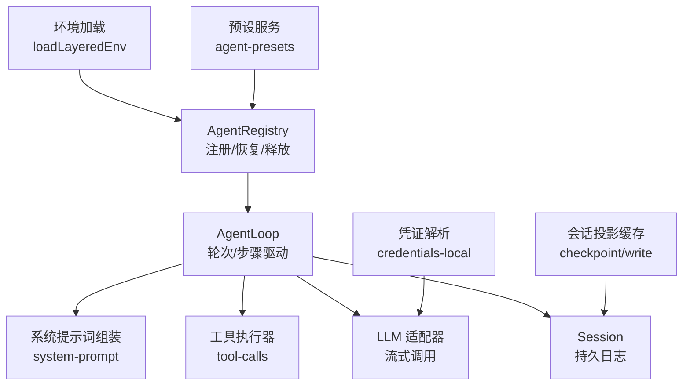
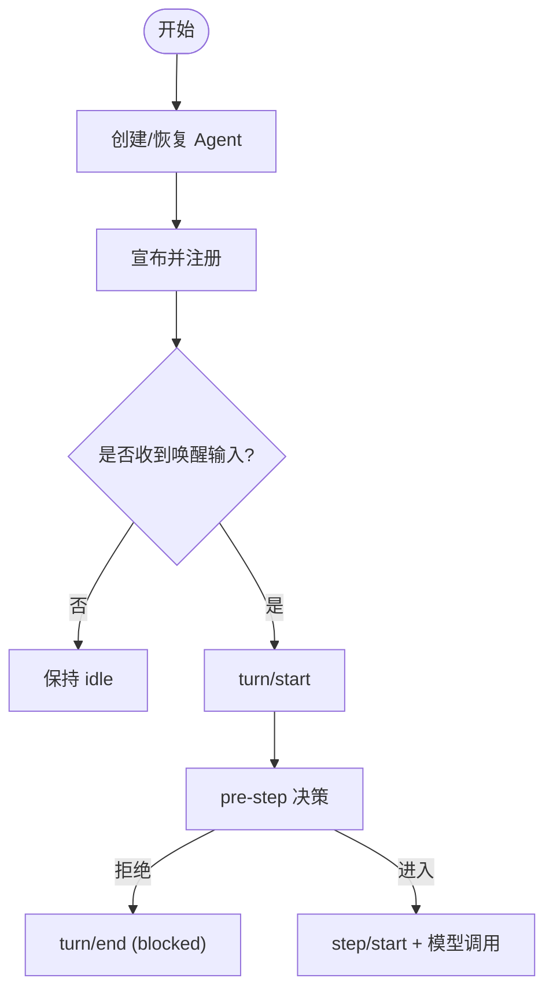
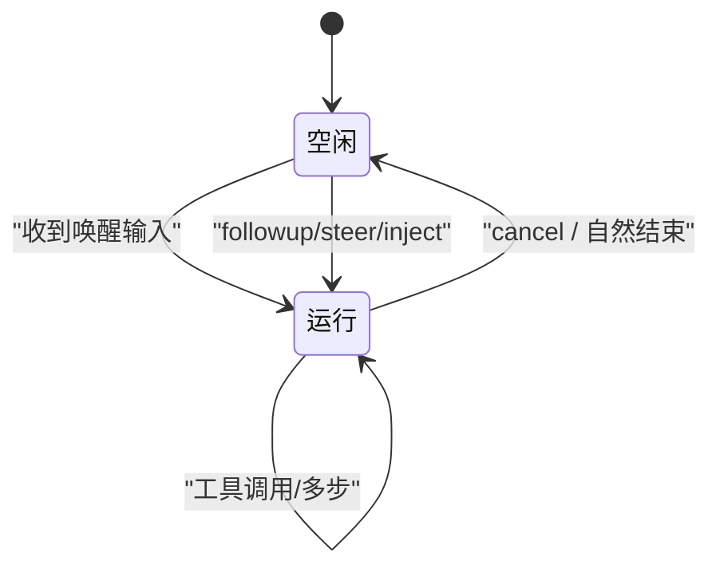
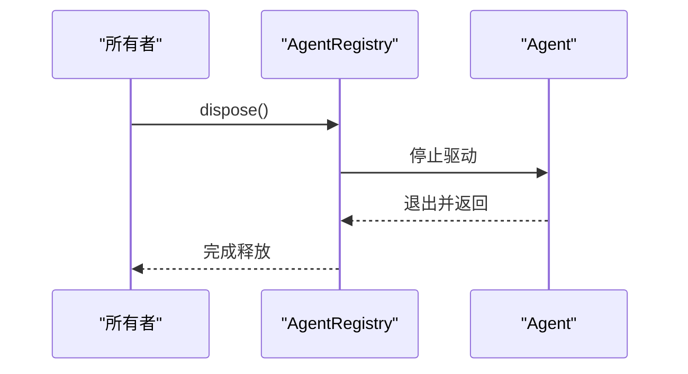
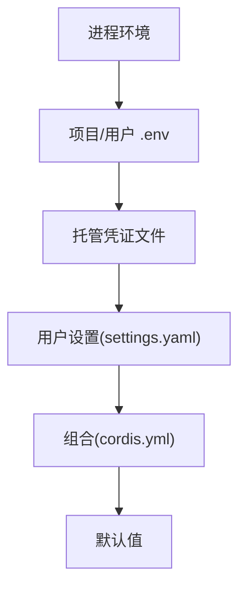
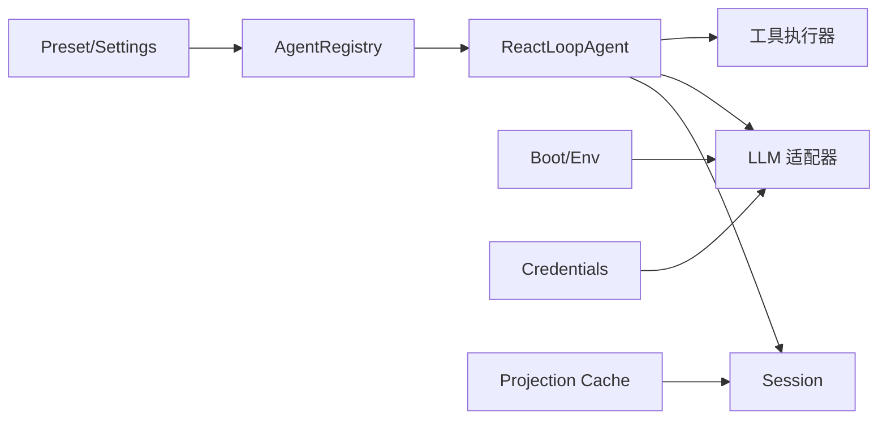

# Agent 生命周期

<cite>
**本文引用的文件**
- [packages/core/agent-loop/src/agent.ts](file://packages/core/agent-loop/src/agent.ts)
- [packages/core/agent/src/runtime-types.ts](file://packages/core/agent/src/runtime-types.ts)
- [packages/core/agent/src/index.ts](file://packages/core/agent/src/index.ts)
- [packages/core/agent/tests/agent.spec.ts](file://packages/core/agent/tests/agent.spec.ts)
- [packages/subagent/subagent/src/continuation.ts](file://packages/subagent/subagent/src/continuation.ts)
- [packages/session/session-projection-cache/src/index.ts](file://packages/session/session-projection-cache/src/index.ts)
- [packages/boot/app-boot/src/index.ts](file://packages/boot/app-boot/src/index.ts)
- [packages/credentials/credentials-local/src/index.ts](file://packages/credentials/credentials-local/src/index.ts)
- [packages/preset/agent-presets/src/preset.ts](file://packages/preset/agent-presets/src/preset.ts)
- [packages/preset/agent-presets/src/index.ts](file://packages/preset/agent-presets/src/index.ts)
- [examples/headless-agent/cordis.yml](file://examples/headless-agent/cordis.yml)
- [docs/agent-lifecycle.md](file://docs/agent-lifecycle.md)
- [docs/agent-lifecycle.zh.md](file://docs/agent-lifecycle.zh.md)
</cite>

## 目录
1. [简介](#简介)
2. [项目结构](#项目结构)
3. [核心组件](#核心组件)
4. [架构总览](#架构总览)
5. [详细组件分析](#详细组件分析)
6. [依赖关系分析](#依赖关系分析)
7. [性能考量](#性能考量)
8. [故障排查指南](#故障排查指南)
9. [结论](#结论)
10. [附录：API 与示例路径](#附录api-与示例路径)

## 简介
本文件系统化阐述 Agent 的完整生命周期，覆盖创建、配置、初始化、运行、暂停、恢复与销毁各阶段；解释状态转换、触发条件与执行逻辑；说明配置管理机制（配置文件格式、环境变量覆盖、动态配置更新）；描述状态跟踪机制（持久化、恢复策略与故障恢复）。同时提供面向初学者的流程图与概念解释，以及面向高级用户的 API 参考与调试技巧。

## 项目结构
围绕 Agent 生命周期的关键代码分布在以下模块：
- 驱动与循环：Agent 驱动、轮次/步骤边界、事件分发与请求构建位于 agent-loop。
- 类型与事件契约：Agent 接口、事件定义、状态与选项在 core/agent。
- 注册与句柄：Agent 注册表、创建/恢复/释放能力在 core/agent 的 index。
- 子代理驻留态：子代理活动状态推导在 subagent continuation。
- 会话投影与检查点：会话投影缓存与写入在 session-projection-cache。
- 启动与环境：环境加载与分层在 boot/app-boot。
- 凭证解析：凭证来源优先级在 credentials-local。
- 预设与默认：预设配置与默认选择在 preset/agent-presets。
- 示例配置：headless-agent 的 cordis.yml 展示典型装配。
- 文档：turn/step 时序图在 docs/agent-lifecycle.*。



图表来源
- [packages/core/agent-loop/src/agent.ts:64-497](file://packages/core/agent-loop/src/agent.ts#L64-L497)
- [packages/core/agent/src/index.ts:158-213](file://packages/core/agent/src/index.ts#L158-L213)
- [packages/session/session-projection-cache/src/index.ts:132-152](file://packages/session/session-projection-cache/src/index.ts#L132-L152)
- [packages/boot/app-boot/src/index.ts:166-191](file://packages/boot/app-boot/src/index.ts#L166-L191)
- [packages/credentials/credentials-local/src/index.ts:249-263](file://packages/credentials/credentials-local/src/index.ts#L249-L263)
- [packages/preset/agent-presets/src/index.ts:120-152](file://packages/preset/agent-presets/src/index.ts#L120-L152)

章节来源
- [packages/core/agent-loop/src/agent.ts:64-497](file://packages/core/agent-loop/src/agent.ts#L64-L497)
- [packages/core/agent/src/index.ts:158-213](file://packages/core/agent/src/index.ts#L158-L213)
- [packages/session/session-projection-cache/src/index.ts:132-152](file://packages/session/session-projection-cache/src/index.ts#L132-L152)
- [packages/boot/app-boot/src/index.ts:166-191](file://packages/boot/app-boot/src/index.ts#L166-L191)
- [packages/credentials/credentials-local/src/index.ts:249-263](file://packages/credentials/credentials-local/src/index.ts#L249-L263)
- [packages/preset/agent-presets/src/index.ts:120-152](file://packages/preset/agent-presets/src/index.ts#L120-L152)

## 核心组件
- ReactLoopAgent：实现 Agent 接口的默认驱动，负责轮次/步骤边界、消息投递、状态机、错误处理、请求构建与工具调用编排。
- Agent 接口与事件：定义 Agent 的能力、状态、取消语义、维护任务、注入/引导/跟进等入口，以及 agent/* 事件契约。
- AgentRegistry：管理 Agent 的进入/宣布/分离/释放，提供 create/resume/dispose 能力，保证创建与销毁成对且可幂等。
- 会话投影缓存：在检查点边界快照并持久化，确保崩溃后不会超前于日志。
- 环境加载与凭证：按优先级合并进程环境、项目与用户 .env、托管凭证文件，保证安全与可覆盖性。
- 预设服务：提供默认预设与用户层覆盖，支持设置项注册与热更新。

章节来源
- [packages/core/agent-loop/src/agent.ts:64-497](file://packages/core/agent-loop/src/agent.ts#L64-L497)
- [packages/core/agent/src/runtime-types.ts:23-144](file://packages/core/agent/src/runtime-types.ts#L23-L144)
- [packages/core/agent/src/runtime-types.ts:146-291](file://packages/core/agent/src/runtime-types.ts#L146-L291)
- [packages/core/agent/src/index.ts:158-213](file://packages/core/agent/src/index.ts#L158-L213)
- [packages/session/session-projection-cache/src/index.ts:132-152](file://packages/session/session-projection-cache/src/index.ts#L132-L152)
- [packages/boot/app-boot/src/index.ts:166-191](file://packages/boot/app-boot/src/index.ts#L166-L191)
- [packages/credentials/credentials-local/src/index.ts:249-263](file://packages/credentials/credentials-local/src/index.ts#L249-L263)
- [packages/preset/agent-presets/src/preset.ts:51-93](file://packages/preset/agent-presets/src/preset.ts#L51-L93)
- [packages/preset/agent-presets/src/index.ts:120-152](file://packages/preset/agent-presets/src/index.ts#L120-L152)

## 架构总览
下图展示了 Agent 从创建到销毁的关键交互：注册表创建/恢复 Agent，驱动进入运行态，通过会话日志记录 turn/step，必要时进行请求构建、工具执行与错误恢复，最终回到空闲或退出。

```mermaid
sequenceDiagram
participant Owner as "所有者上下文"
participant Registry as "AgentRegistry"
participant Loop as "ReactLoopAgent"
participant Session as "Session"
participant LLM as "LLM 适配器"
participant Tools as "工具执行器"
Owner->>Registry : createAgent()/resume()
Registry-->>Owner : AgentHandle{agent, dispose}
Owner->>Loop : followup()/steer()/inject()
Loop->>Session : turn/start -> step/start
Loop->>LLM : stream(request)
LLM-->>Loop : chunk*
Loop->>Session : assistant/chunk*
alt 需要工具调用
Loop->>Tools : execute(tool-calls)
Tools-->>Session : tool/call, tool/result
end
Loop->>Session : assistant/message, step/end, turn/end
Note over Loop : status : idle ⇄ running
Owner->>Registry : dispose()
Registry-->>Owner : 完成清理
```

图表来源
- [packages/core/agent/src/index.ts:158-213](file://packages/core/agent/src/index.ts#L158-L213)
- [packages/core/agent-loop/src/agent.ts:210-330](file://packages/core/agent-loop/src/agent.ts#L210-L330)
- [packages/core/agent-loop/src/agent.ts:332-401](file://packages/core/agent-loop/src/agent.ts#L332-L401)
- [packages/core/agent-loop/src/agent.ts:407-495](file://packages/core/agent-loop/src/agent.ts#L407-L495)

## 详细组件分析

### 创建与初始化
- 创建/恢复：通过 AgentRegistry.createAgent 或 resume 获得拥有者持有的 AgentHandle，内部会准备会话、可选发布前事务、注册 Agent 并启动驱动。
- 首次运行：当收到唤醒输入时，驱动进入 running，打开 turn/start，认领 next-turn/next-step 消息，进入 pre-step 瀑布以决定进入或拒绝。
- 初始化钩子：agent/session-start 在首个 turn 之前通知，可用于注入初始上下文；agent/created 表示已完全配置并发布。



图表来源
- [packages/core/agent/src/index.ts:158-213](file://packages/core/agent/src/index.ts#L158-L213)
- [packages/core/agent-loop/src/agent.ts:210-330](file://packages/core/agent-loop/src/agent.ts#L210-L330)
- [packages/core/agent/src/runtime-types.ts:146-217](file://packages/core/agent/src/runtime-types.ts#L146-L217)

章节来源
- [packages/core/agent/src/index.ts:158-213](file://packages/core/agent/src/index.ts#L158-L213)
- [packages/core/agent/src/runtime-types.ts:146-217](file://packages/core/agent/src/runtime-types.ts#L146-L217)
- [packages/core/agent-loop/src/agent.ts:210-330](file://packages/core/agent-loop/src/agent.ts#L210-L330)

### 运行与步骤
- 轮次与步骤：每个 turn 包含若干 step；每步先 pre-step，再写入 user/message，组装系统提示词，发起模型请求，流式接收 chunk，写入 assistant/chunk，最终生成 assistant/message。
- 工具调用：若存在 tool-call，则顺序预执行、并发执行、顺序后处理，并将结果写回 next-step 以便继续。
- 结束条件：自然停止（无待处理的 next-step）、max-tokens、阻塞或错误。

```mermaid
sequenceDiagram
participant Loop as "ReactLoopAgent"
participant Session as "Session"
participant LLM as "LLM"
participant Tools as "工具"
Loop->>Session : step/start
Loop->>LLM : stream(request)
LLM-->>Loop : chunk*
Loop->>Session : assistant/chunk*
alt 有工具调用
Loop->>Tools : 执行工具
Tools-->>Session : tool/call, tool/result
end
Loop->>Session : assistant/message, step/end
```

图表来源
- [packages/core/agent-loop/src/agent.ts:332-401](file://packages/core/agent-loop/src/agent.ts#L332-L401)

章节来源
- [packages/core/agent-loop/src/agent.ts:332-401](file://packages/core/agent-loop/src/agent.ts#L332-L401)

### 暂停与恢复
- 暂停：通过 cancel 清空队列（可保留 inbox）、中止当前活动；status 转为 idle。
- 恢复：当再次收到唤醒输入或显式 followup/steer/inject 时，驱动重新进入 running；若使用 resume，可从持久会话恢复上下文。
- 子代理驻留态：子代理活动状态由 Agent.status 与已接受但未耗尽的工作集合共同推导，避免仅凭 status 误判。



图表来源
- [packages/core/agent-loop/src/agent.ts:99-140](file://packages/core/agent-loop/src/agent.ts#L99-L140)
- [packages/subagent/subagent/src/continuation.ts:861-874](file://packages/subagent/subagent/src/continuation.ts#L861-L874)

章节来源
- [packages/core/agent-loop/src/agent.ts:99-140](file://packages/core/agent-loop/src/agent.ts#L99-L140)
- [packages/subagent/subagent/src/continuation.ts:861-874](file://packages/subagent/subagent/src/continuation.ts#L861-L874)

### 销毁
- 释放：持有 AgentHandle 的所有者调用 dispose，停止驱动、等待退出、注销 Agent、移除会话、展开作用域。
- 事件：agent/disposed 在驱动静默与作用域展开后发出，但早于会话分离。
- 幂等与替换：进入与宣布分离，重复 detach 无效；被替换的旧实例不会被错误删除。



图表来源
- [packages/core/agent/src/index.ts:158-175](file://packages/core/agent/src/index.ts#L158-L175)
- [packages/core/agent/src/index.ts:482-525](file://packages/core/agent/src/index.ts#L482-L525)

章节来源
- [packages/core/agent/src/index.ts:158-175](file://packages/core/agent/src/index.ts#L158-L175)
- [packages/core/agent/src/index.ts:482-525](file://packages/core/agent/src/index.ts#L482-L525)

### 配置管理机制
- 配置文件：cordis.yml 中声明插件与配置，如 LLM 适配器、工作区、持久化、压缩策略、子代理工具等。
- 环境变量覆盖：非机密值遵循“显式 > 用户设置 > 组合 > 进程环境 > 发现的文件 > 默认”的顺序；凭证采用更严格的顺序，进程环境为只读最高优先级。
- 动态配置更新：设置项通过 settings 注册，支持热更新；预设服务将默认预设写入设置项，UI 可切换。



图表来源
- [examples/headless-agent/cordis.yml:1-166](file://examples/headless-agent/cordis.yml#L1-L166)
- [packages/boot/app-boot/src/index.ts:166-191](file://packages/boot/app-boot/src/index.ts#L166-L191)
- [packages/credentials/credentials-local/src/index.ts:249-263](file://packages/credentials/credentials-local/src/index.ts#L249-L263)
- [packages/preset/agent-presets/src/index.ts:120-152](file://packages/preset/agent-presets/src/index.ts#L120-L152)

章节来源
- [examples/headless-agent/cordis.yml:1-166](file://examples/headless-agent/cordis.yml#L1-L166)
- [packages/boot/app-boot/src/index.ts:166-191](file://packages/boot/app-boot/src/index.ts#L166-L191)
- [packages/credentials/credentials-local/src/index.ts:249-263](file://packages/credentials/credentials-local/src/index.ts#L249-L263)
- [packages/preset/agent-presets/src/preset.ts:51-93](file://packages/preset/agent-presets/src/preset.ts#L51-L93)
- [packages/preset/agent-presets/src/index.ts:120-152](file://packages/preset/agent-presets/src/index.ts#L120-L152)

### 状态跟踪与持久化
- 状态事件：agent/status 在每次状态转换时发出；agent/inbox/* 反映入队、认领与丢弃；agent/error 报告失败。
- 持久化：会话日志作为唯一事实源；检查点在 step/turn 边界写入，确保崩溃后回放一致。
- 恢复策略：resume 从持久会话恢复上下文；投影缓存保证快照与日志一致性。

```mermaid
sequenceDiagram
participant Loop as "驱动"
participant Cache as "投影缓存"
participant Store as "持久化存储"
Loop->>Cache : checkpoint(session)
Cache->>Store : flush(session)
Cache-->>Loop : 写入完成
```

图表来源
- [packages/session/session-projection-cache/src/index.ts:132-152](file://packages/session/session-projection-cache/src/index.ts#L132-L152)
- [packages/core/agent/src/runtime-types.ts:146-291](file://packages/core/agent/src/runtime-types.ts#L146-L291)

章节来源
- [packages/session/session-projection-cache/src/index.ts:132-152](file://packages/session/session-projection-cache/src/index.ts#L132-L152)
- [packages/core/agent/src/runtime-types.ts:146-291](file://packages/core/agent/src/runtime-types.ts#L146-L291)

### 错误处理与恢复
- 请求错误：agent/request-error 允许监听器返回 retry 以重试；否则视为终端错误。
- 步骤/轮次错误：统一封装为结构化错误，记录 provider、failure、retryPolicy 等信息。
- 测试用例：验证创建 veto 与释放配对、替换实例的隔离、重入观察者下的一致性。

章节来源
- [packages/core/agent/src/runtime-types.ts:232-260](file://packages/core/agent/src/runtime-types.ts#L232-L260)
- [packages/core/agent/tests/agent.spec.ts:221-280](file://packages/core/agent/tests/agent.spec.ts#L221-L280)
- [packages/core/agent/tests/agent.spec.ts:331-356](file://packages/core/agent/tests/agent.spec.ts#L331-L356)

## 依赖关系分析
- 低耦合：驱动通过 Session 日志与 LLM 适配器交互，工具执行独立；事件总线解耦扩展点。
- 关键依赖链：
  - AgentRegistry → ReactLoopAgent → Session/LLM/Tools
  - Boot/Credentials → 运行时环境 → LLM 适配器
  - Preset/Settings → 默认与用户覆盖 → 组合装配
  - 投影缓存 → 会话持久化



图表来源
- [packages/core/agent/src/index.ts:158-213](file://packages/core/agent/src/index.ts#L158-L213)
- [packages/core/agent-loop/src/agent.ts:64-497](file://packages/core/agent-loop/src/agent.ts#L64-L497)
- [packages/boot/app-boot/src/index.ts:166-191](file://packages/boot/app-boot/src/index.ts#L166-L191)
- [packages/credentials/credentials-local/src/index.ts:249-263](file://packages/credentials/credentials-local/src/index.ts#L249-L263)
- [packages/preset/agent-presets/src/index.ts:120-152](file://packages/preset/agent-presets/src/index.ts#L120-L152)
- [packages/session/session-projection-cache/src/index.ts:132-152](file://packages/session/session-projection-cache/src/index.ts#L132-L152)

章节来源
- [packages/core/agent/src/index.ts:158-213](file://packages/core/agent/src/index.ts#L158-L213)
- [packages/core/agent-loop/src/agent.ts:64-497](file://packages/core/agent-loop/src/agent.ts#L64-L497)

## 性能考量
- 流式处理：LLM 响应以 chunk 流式写入，减少内存峰值并提升首字延迟。
- 工具并发：工具调用采用有序预执行与并发执行，提高吞吐。
- 最大令牌粘性：一旦某步达到 max-tokens，后续正常完成的步骤不会降级轮次结果，避免误判。
- 检查点时机：在 step/turn 边界写入检查点，降低崩溃恢复成本。

[本节为通用指导，不直接分析具体文件]

## 故障排查指南
- 常见问题定位：
  - 未设置 provider/model：构建请求时会抛出缺失配置错误。
  - 请求错误：通过 agent/request-error 决定是否重试；若无重试则终止步骤。
  - 状态不一致：确认 agent/status 与 Inbox 状态，检查是否有被拒绝的 step 或未认领的消息。
  - 持久化异常：检查会话投影缓存写入与 flush 顺序，确保崩溃后能正确回放。
- 调试建议：
  - 订阅 agent/* 事件观察实时状态与入队行为。
  - 使用 whenIdle 等待活动收敛，便于断言与清理。
  - 在 pre-step 与 request 瀑布中插入诊断输出，追踪消息与配置变化。

章节来源
- [packages/core/agent-loop/src/agent.ts:407-495](file://packages/core/agent-loop/src/agent.ts#L407-L495)
- [packages/core/agent/src/runtime-types.ts:232-291](file://packages/core/agent/src/runtime-types.ts#L232-L291)
- [packages/session/session-projection-cache/src/index.ts:132-152](file://packages/session/session-projection-cache/src/index.ts#L132-L152)

## 结论
Agent 生命周期以 Session 日志为核心事实源，通过驱动的状态机与事件总线协调创建、运行、暂停、恢复与销毁。配置体系支持多层覆盖与热更新，凭证与安全策略严格分层。借助检查点与投影缓存，系统在崩溃后可稳定恢复。开发者可通过标准 API 与事件扩展点定制行为，并在测试与生产环境中可靠地调试与观测。

## 附录：API 与示例路径
- 创建与恢复
  - 创建 Agent：[packages/core/agent/src/index.ts:198-213](file://packages/core/agent/src/index.ts#L198-L213)
  - 恢复 Agent：[packages/core/agent/src/index.ts:203-213](file://packages/core/agent/src/index.ts#L203-L213)
- 运行与控制
  - 跟进/引导/注入：[packages/core/agent/src/runtime-types.ts:117-144](file://packages/core/agent/src/runtime-types.ts#L117-L144)
  - 取消与维护任务：[packages/core/agent/src/runtime-types.ts:33-104](file://packages/core/agent/src/runtime-types.ts#L33-L104)
  - 状态与事件：[packages/core/agent/src/runtime-types.ts:146-291](file://packages/core/agent/src/runtime-types.ts#L146-L291)
- 配置与环境
  - 环境加载：[packages/boot/app-boot/src/index.ts:166-191](file://packages/boot/app-boot/src/index.ts#L166-L191)
  - 凭证解析：[packages/credentials/credentials-local/src/index.ts:249-263](file://packages/credentials/credentials-local/src/index.ts#L249-L263)
  - 预设与默认：[packages/preset/agent-presets/src/preset.ts:51-93](file://packages/preset/agent-presets/src/preset.ts#L51-L93), [packages/preset/agent-presets/src/index.ts:120-152](file://packages/preset/agent-presets/src/index.ts#L120-L152)
  - 示例配置：[examples/headless-agent/cordis.yml:1-166](file://examples/headless-agent/cordis.yml#L1-L166)
- 状态与持久化
  - 检查点写入：[packages/session/session-projection-cache/src/index.ts:132-152](file://packages/session/session-projection-cache/src/index.ts#L132-L152)
  - 轮次/步骤时序：[docs/agent-lifecycle.md:8-82](file://docs/agent-lifecycle.md#L8-L82), [docs/agent-lifecycle.zh.md:10-84](file://docs/agent-lifecycle.zh.md#L10-L84)