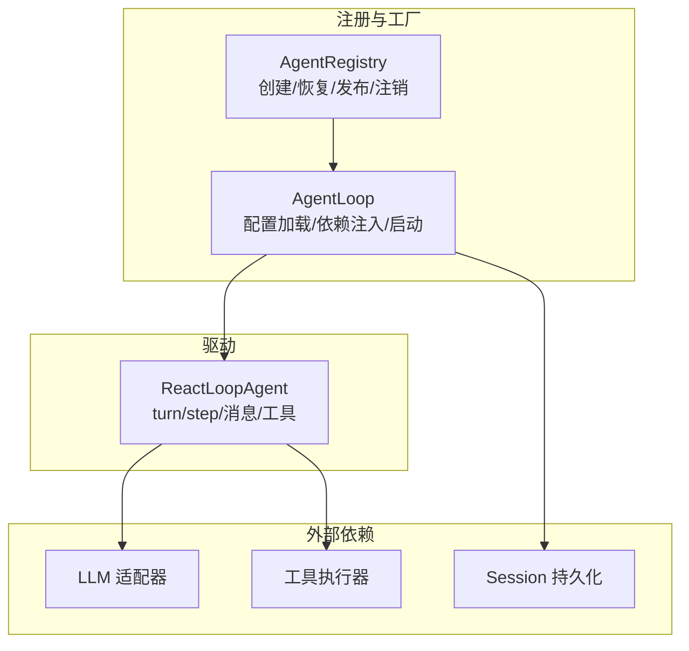
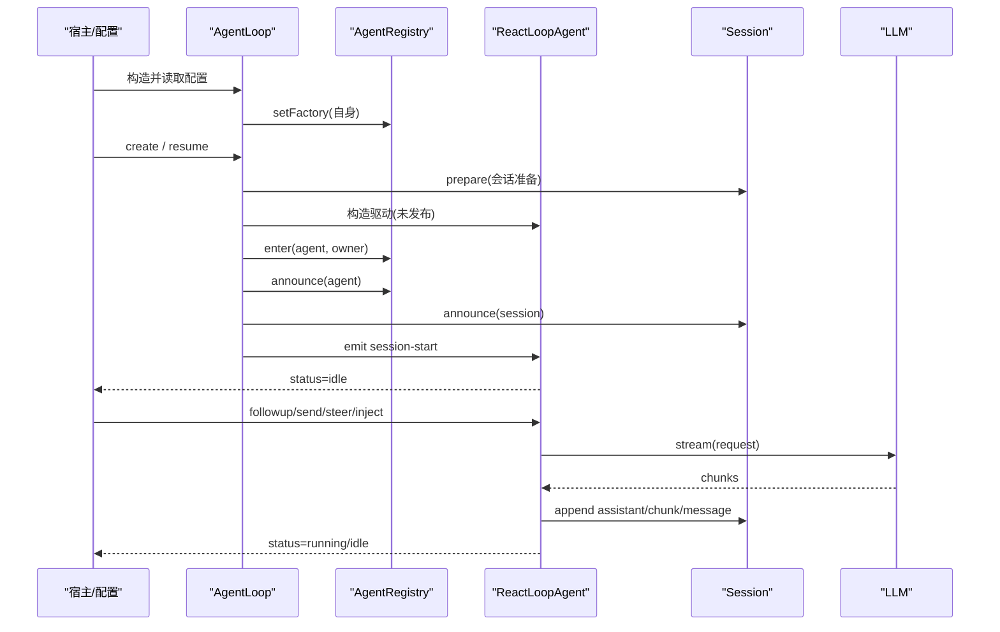
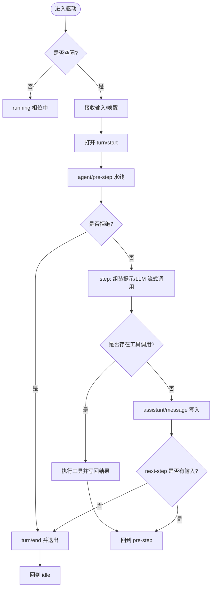
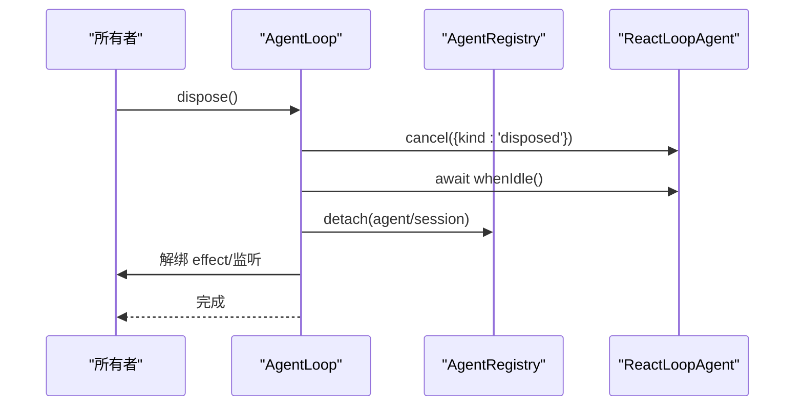
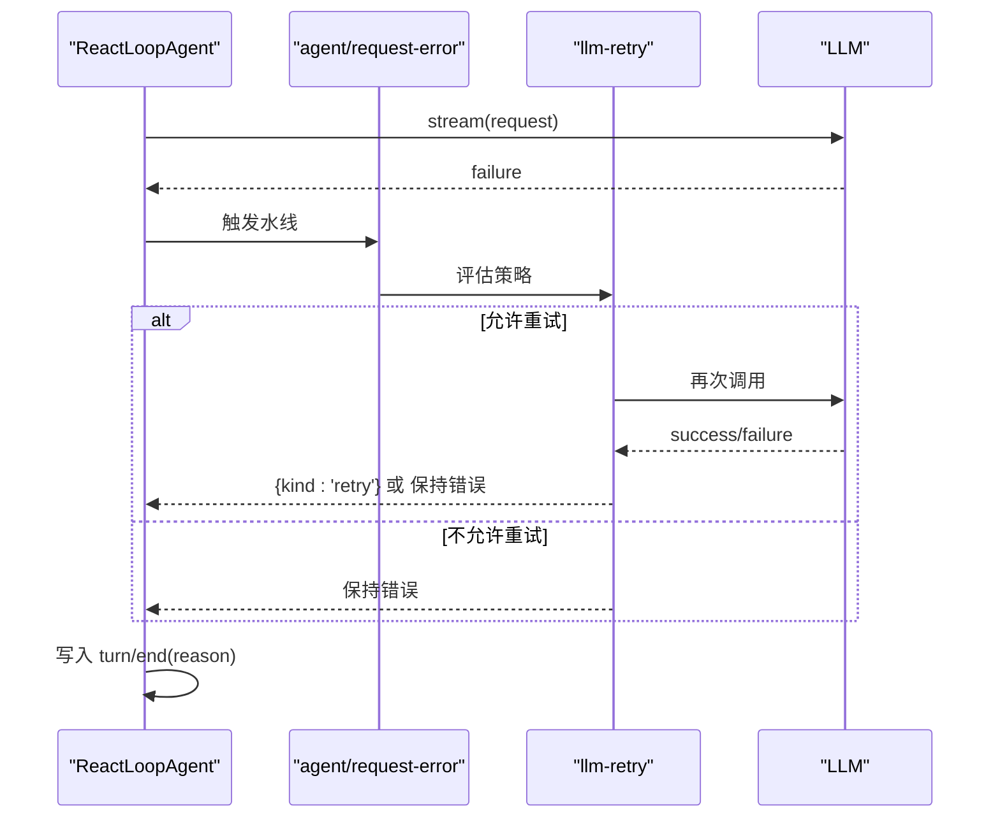
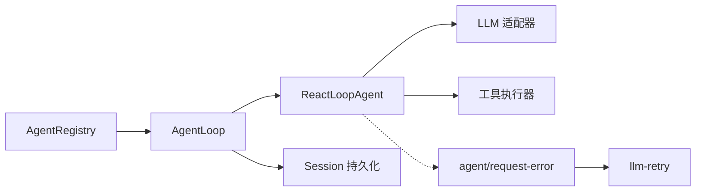

# Agent 生命周期

<cite>
**本文引用的文件**
- [packages/core/agent/src/index.ts](file://packages/core/agent/src/index.ts)
- [packages/core/agent-loop/src/index.ts](file://packages/core/agent-loop/src/index.ts)
- [packages/core/agent-loop/src/agent.ts](file://packages/core/agent-loop/src/agent.ts)
- [packages/llm/llm-retry/src/index.ts](file://packages/llm/llm-retry/src/index.ts)
- [docs/agent-lifecycle.md](file://docs/agent-lifecycle.md)
- [.agents/notes/implemented/architecture/2026-07-08-agent-scope-contexts.md](file://.agents/notes/implemented/architecture/2026-07-08-agent-scope-contexts.md)
- [.agents/notes/implemented/architecture/2026-06-18-agent-lifecycle-and-ownership-contracts.md](file://.agents/notes/implemented/architecture/2026-06-18-agent-lifecycle-and-ownership-contracts.md)
</cite>

## 目录
1. [简介](#简介)
2. [项目结构](#项目结构)
3. [核心组件](#核心组件)
4. [架构总览](#架构总览)
5. [详细组件分析](#详细组件分析)
6. [依赖关系分析](#依赖关系分析)
7. [性能考量](#性能考量)
8. [故障排查指南](#故障排查指南)
9. [结论](#结论)
10. [附录](#附录)

## 简介
本文件系统化梳理 Agent 从创建到销毁的完整生命周期，覆盖初始化、运行与清理三阶段；详细说明启动流程（配置加载、依赖解析、服务注册）、运行状态管理（活跃、暂停、错误等转换）、资源管理（内存、文件句柄、网络连接）以及错误处理与恢复机制（异常捕获、重试策略、降级）。文末提供最佳实践示例路径，指导如何正确管理 Agent 的启动、停止与重启。

## 项目结构
Agent 生命周期由三层协作完成：
- 注册与工厂层：负责 Agent 的创建、恢复、发布与注销，维护进程内 Agent 注册表与所有者语义。
- 驱动层：实现单 Agent 的运行循环，管理轮次/步骤、消息入队、系统提示组装、LLM 调用与工具执行。
- 错误与恢复层：通过事件水线对请求失败进行拦截，支持重试、降级与取消竞态保护。

**图示来源**
- [packages/core/agent/src/index.ts:256-430](file://packages/core/agent/src/index.ts#L256-L430)
- [packages/core/agent-loop/src/index.ts:296-382](file://packages/core/agent-loop/src/index.ts#L296-L382)
- [packages/core/agent-loop/src/agent.ts:64-124](file://packages/core/agent-loop/src/agent.ts#L64-L124)

**章节来源**
- [packages/core/agent/src/index.ts:256-430](file://packages/core/agent/src/index.ts#L256-L430)
- [packages/core/agent-loop/src/index.ts:296-382](file://packages/core/agent-loop/src/index.ts#L296-L382)

## 核心组件
- AgentRegistry：进程内 Agent 注册表，提供 create/resume/register/announce/enter/list/roots 等能力，维护创建者所有权与生命周期边界。
- AgentLoop：具体工厂与服务，负责配置校验、设置项安装、声明式 Agent 启动、会话准备、setup 事务与发布。
- ReactLoopAgent：单 Agent 驱动，维护 idle/maintenance/running 相位，编排 turn/step、系统提示组装、LLM 流式调用与工具执行。
- 错误与恢复：agent/request-error 水线 + llm-retry 插件，统一处理请求失败、重试策略与取消竞态。

**章节来源**
- [packages/core/agent/src/index.ts:158-214](file://packages/core/agent/src/index.ts#L158-L214)
- [packages/core/agent-loop/src/index.ts:296-382](file://packages/core/agent-loop/src/index.ts#L296-L382)
- [packages/core/agent-loop/src/agent.ts:64-124](file://packages/core/agent-loop/src/agent.ts#L64-L124)
- [packages/llm/llm-retry/src/index.ts:156-179](file://packages/llm/llm-retry/src/index.ts#L156-L179)

## 架构总览
下图展示 Agent 从创建到运行的关键时序：配置加载 → 会话准备 → setup 事务 → 注册/公告 → 启动驱动 → 进入 idle/running 循环。

**图示来源**
- [packages/core/agent-loop/src/index.ts:355-382](file://packages/core/agent-loop/src/index.ts#L355-L382)
- [packages/core/agent-loop/src/index.ts:606-645](file://packages/core/agent-loop/src/index.ts#L606-L645)
- [packages/core/agent/src/index.ts:450-576](file://packages/core/agent/src/index.ts#L450-L576)
- [packages/core/agent-loop/src/agent.ts:113-124](file://packages/core/agent-loop/src/agent.ts#L113-L124)
- [packages/core/agent-loop/src/agent.ts:332-400](file://packages/core/agent-loop/src/agent.ts#L332-L400)

## 详细组件分析

### 初始化阶段：配置加载、依赖解析与服务注册
- 配置加载与校验：
  - AgentLoop 在构造时安装设置项命名空间，合并默认值，验证 maxParallelToolCalls 与 agents 数组，应用 launcher 注入的身份映射，确保无冲突。
- 依赖注入与系统提示变量：
  - 注入 agents/sessions/llm/tools/systemPrompt，注册 systemPrompt 变量 provider/model/cwd。
- 声明式 Agent 启动：
  - 遍历配置中的 agents，按 sessionId/resumeSessionId 决定新建或恢复；若存在持久化后端则先尝试恢复，失败且不存在时回退为新建。
  - 所有启动任务被跟踪，工厂卸载时会等待其完成或被中止。
- 工厂注册：
  - 将自身作为 AgentFactory 注册到 AgentRegistry，供上层以 ctx.agents.create/resume 调用。

**章节来源**
- [packages/core/agent-loop/src/index.ts:296-382](file://packages/core/agent-loop/src/index.ts#L296-L382)
- [packages/core/agent-loop/src/index.ts:406-428](file://packages/core/agent-loop/src/index.ts#L406-L428)
- [packages/core/agent/src/index.ts:266-298](file://packages/core/agent/src/index.ts#L266-L298)

### 运行阶段：状态管理与驱动循环
- 状态机：
  - idle：无活动工作；maintenance：受控后台任务；running：正在执行 turn/step。
  - status 对外仅暴露 idle/running；内部 phase 用于控制唤醒、取消与重入。
- 输入与唤醒：
  - send/followup/steer/inject 将消息插入 Inbox，wakeup=true 时可能触发驱动唤醒；当处于 maintenance 或已中止的活动时，唤醒会被 latch，待收敛后回放。
- Turn/Step 循环：
  - turn：记录 turn/start，预取 next-step 消息，经 agent/pre-step 水线决定是否进入 step。
  - step：组装系统提示，构建请求，流式调用 LLM，写入 assistant/chunk，最终生成 assistant/message；若有 tool-call，则执行工具并继续循环。
  - 终止条件：自然结束、max-tokens、阻塞或错误；结束时写入 turn/end 并回到 idle。
- 维护模式：
  - runMaintenance 允许在 idle 时执行受控任务，完成后若仍有待处理消息则自动唤醒驱动。

**图示来源**
- [packages/core/agent-loop/src/agent.ts:113-124](file://packages/core/agent-loop/src/agent.ts#L113-L124)
- [packages/core/agent-loop/src/agent.ts:142-162](file://packages/core/agent-loop/src/agent.ts#L142-L162)
- [packages/core/agent-loop/src/agent.ts:225-330](file://packages/core/agent-loop/src/agent.ts#L225-L330)
- [packages/core/agent-loop/src/agent.ts:332-400](file://packages/core/agent-loop/src/agent.ts#L332-L400)

**章节来源**
- [packages/core/agent-loop/src/agent.ts:64-124](file://packages/core/agent-loop/src/agent.ts#L64-L124)
- [packages/core/agent-loop/src/agent.ts:142-162](file://packages/core/agent-loop/src/agent.ts#L142-L162)
- [packages/core/agent-loop/src/agent.ts:225-330](file://packages/core/agent-loop/src/agent.ts#L225-L330)
- [packages/core/agent-loop/src/agent.ts:332-400](file://packages/core/agent-loop/src/agent.ts#L332-L400)

### 清理阶段：资源释放与反向 teardown
- 反向 teardown 顺序：
  - 中止驱动（cancel），等待 whenIdle 确保真正静默；
  - 注销 Agent 与 Session（detach），移除注册表条目；
  - 解绑所有者 effect，释放 AbortController 监听；
  - 最后解绑 scope，回收作用域内资源。
- 并发安全：
  - 多次 dispose 会 join 同一完成 Promise；
  - 在 announce 期间若收到 detach，会延迟到同步派发结束后再执行。
- 工厂级卸载：
  - FactoryOwnership 在卸载时中止所有创建/恢复任务，等待 liveAgents 与 startupTasks 全部 settle。

**图示来源**
- [packages/core/agent-loop/src/index.ts:459-578](file://packages/core/agent-loop/src/index.ts#L459-L578)
- [packages/core/agent/src/index.ts:474-576](file://packages/core/agent/src/index.ts#L474-L576)

**章节来源**
- [packages/core/agent-loop/src/index.ts:459-578](file://packages/core/agent-loop/src/index.ts#L459-L578)
- [packages/core/agent/src/index.ts:474-576](file://packages/core/agent/src/index.ts#L474-L576)

### 启动流程：配置加载、依赖解析、服务注册
- 配置加载：
  - 读取并校验 maxParallelToolCalls 与 agents 列表；应用 launcher 注入的 identity 覆盖。
- 依赖解析：
  - 注入 sessions/llm/tools/systemPrompt；安装 systemPrompt 变量；注册 typert 上下文与查找。
- 服务注册：
  - 将 AgentLoop 实例作为 AgentFactory 注册到 AgentRegistry；
  - 对每个配置项，选择 create 或 resume，必要时先尝试恢复，失败且不存在则新建。

**章节来源**
- [packages/core/agent-loop/src/index.ts:296-382](file://packages/core/agent-loop/src/index.ts#L296-L382)
- [packages/core/agent/src/index.ts:266-298](file://packages/core/agent/src/index.ts#L266-L298)

### 运行状态管理：活跃、暂停、错误转换
- 状态定义：
  - 对外 status：idle/running；内部 phase：idle/maintenance/running。
- 转换规则：
  - idle → running：收到 wakeup 且非 maintenance/中止活动时开启新 driver；
  - running → idle：turn 结束且无 pending 输入；
  - maintenance 可穿插于 idle，完成后若仍有输入则自动唤醒；
  - 错误：turn/step 中异常被结构化记录，turn/end 标记 error；
  - 取消：abort 信号传播至 step 与工具执行，turn/end 标记 aborted。
- 子代理视角：
  - 子代理活跃度基于父 Agent 的 quiescence 与 owned-children 集合推导，避免仅凭 status 误判。

**章节来源**
- [packages/core/agent-loop/src/agent.ts:99-124](file://packages/core/agent-loop/src/agent.ts#L99-L124)
- [packages/core/agent-loop/src/agent.ts:142-162](file://packages/core/agent-loop/src/agent.ts#L142-L162)
- [packages/core/agent-loop/src/agent.ts:225-330](file://packages/core/agent-loop/src/agent.ts#L225-L330)

### 资源管理机制：内存、文件句柄、网络连接
- 内存与作用域：
  - 每个 Agent 拥有独立 scope，dispose 时按序解绑，释放作用域内对象引用；
  - 注册表使用 Map 存储 entry，detach 后删除，避免泄漏。
- 文件句柄与会话：
  - SessionPreparation 在 finally 中释放；session 的 append/announce 由框架管理；
  - 恢复路径中 persistence.prepare 在 finally 中释放。
- 网络连接：
  - LLM 流式调用通过 AbortSignal 控制；取消时中断流并关闭连接；
  - 工具执行也受 signal 约束，避免悬挂 IO。

**章节来源**
- [packages/core/agent-loop/src/index.ts:661-710](file://packages/core/agent-loop/src/index.ts#L661-L710)
- [packages/core/agent-loop/src/agent.ts:332-400](file://packages/core/agent-loop/src/agent.ts#L332-L400)

### 错误处理与恢复机制：异常捕获、重试策略、降级处理
- 异常捕获：
  - turn/step 中异常被捕获并结构化，写入 turn/end reason；
  - request-error 水线在 step 失败时触发，携带 provider、failure、retryPolicy、signal。
- 重试策略：
  - llm-retry 插件根据 policy.mode 与 retryableCodes 决定是否重试；
  - 支持 always 模式与条件重试；若下游恢复失败或返回非 retry，则保持原错误。
- 降级与取消竞态：
  - 若 recovery 过程中发生 abort，直接放弃重试；
  - 无 action 的恢复会将 turn 置为 terminal error。

**图示来源**
- [packages/core/agent-loop/src/agent.ts:332-400](file://packages/core/agent-loop/src/agent.ts#L332-L400)
- [packages/llm/llm-retry/src/index.ts:156-179](file://packages/llm/llm-retry/src/index.ts#L156-L179)

**章节来源**
- [packages/core/agent-loop/src/agent.ts:332-400](file://packages/core/agent-loop/src/agent.ts#L332-L400)
- [packages/llm/llm-retry/src/index.ts:156-179](file://packages/llm/llm-retry/src/index.ts#L156-L179)

### 最佳实践：启动、停止、重启的代码示例路径
- 创建与发布：
  - 通过 ctx.agents.create 传入 sessionId、agentOptions、setup；setup 中注册工具与系统提示片段；
  - 参考路径：[packages/core/agent/src/index.ts:114-133](file://packages/core/agent/src/index.ts#L114-L133)、[.agents/notes/implemented/architecture/2026-07-08-agent-scope-contexts.md:61-97](file://.agents/notes/implemented/architecture/2026-07-08-agent-scope-contexts.md#L61-L97)
- 恢复与持久化：
  - 使用 ctx.agents.resume 加载历史并重建 Agent；
  - 参考路径：[packages/core/agent/src/index.ts:136-156](file://packages/core/agent/src/index.ts#L136-L156)、[packages/core/agent-loop/src/index.ts:653-710](file://packages/core/agent-loop/src/index.ts#L653-L710)
- 停止与清理：
  - 持有 AgentHandle 并在断开/卸载时调用 dispose；
  - 参考路径：[packages/core/agent/src/index.ts:158-175](file://packages/core/agent/src/index.ts#L158-L175)、[.agents/notes/implemented/architecture/2026-06-18-agent-lifecycle-and-ownership-contracts.md:19-21](file://.agents/notes/implemented/architecture/2026-06-18-agent-lifecycle-and-ownership-contracts.md#L19-L21)
- 重启：
  - 先 await handle.dispose()，再重新 create/resume；
  - 参考路径：[packages/core/agent-loop/src/index.ts:606-645](file://packages/core/agent-loop/src/index.ts#L606-L645)

**章节来源**
- [packages/core/agent/src/index.ts:114-175](file://packages/core/agent/src/index.ts#L114-L175)
- [packages/core/agent-loop/src/index.ts:606-710](file://packages/core/agent-loop/src/index.ts#L606-L710)
- [.agents/notes/implemented/architecture/2026-07-08-agent-scope-contexts.md:61-97](file://.agents/notes/implemented/architecture/2026-07-08-agent-scope-contexts.md#L61-L97)
- [.agents/notes/implemented/architecture/2026-06-18-agent-lifecycle-and-ownership-contracts.md:19-21](file://.agents/notes/implemented/architecture/2026-06-18-agent-lifecycle-and-ownership-contracts.md#L19-L21)

## 依赖关系分析
- AgentRegistry 依赖 Cordis 的 Context/Fiber/Service，提供类型查找与访问器；
- AgentLoop 依赖 sessions/llm/tools/systemPrompt，安装设置项并注册系统提示变量；
- ReactLoopAgent 依赖 Inbox、systemPrompt、llm、tools，驱动 turn/step；
- llm-retry 通过 agent/request-error 水线与 Agent 交互，不侵入主循环。

**图示来源**
- [packages/core/agent/src/index.ts:266-298](file://packages/core/agent/src/index.ts#L266-L298)
- [packages/core/agent-loop/src/index.ts:296-382](file://packages/core/agent-loop/src/index.ts#L296-L382)
- [packages/core/agent-loop/src/agent.ts:64-124](file://packages/core/agent-loop/src/agent.ts#L64-L124)
- [packages/llm/llm-retry/src/index.ts:156-179](file://packages/llm/llm-retry/src/index.ts#L156-L179)

**章节来源**
- [packages/core/agent/src/index.ts:266-298](file://packages/core/agent/src/index.ts#L266-L298)
- [packages/core/agent-loop/src/index.ts:296-382](file://packages/core/agent-loop/src/index.ts#L296-L382)
- [packages/core/agent-loop/src/agent.ts:64-124](file://packages/core/agent-loop/src/agent.ts#L64-L124)
- [packages/llm/llm-retry/src/index.ts:156-179](file://packages/llm/llm-retry/src/index.ts#L156-L179)

## 性能考量
- 并行工具调用上限由 maxParallelToolCalls 控制，运行时可通过设置项动态调整；
- 驱动循环避免重复分配：dispatch 一次性构建，stream 分块追加；
- 唤醒 latch 机制减少无效唤醒，提升吞吐；
- 作用域隔离降低内存泄漏风险，dispose 后几乎完全回收。

**章节来源**
- [packages/core/agent-loop/src/index.ts:236-252](file://packages/core/agent-loop/src/index.ts#L236-L252)
- [packages/core/agent-loop/src/agent.ts:332-400](file://packages/core/agent-loop/src/agent.ts#L332-L400)

## 故障排查指南
- 启动失败：
  - 检查配置冲突（sessionId/resumeSessionId 互斥、重复 exact id）；
  - 确认 sessionPersistence 已加载（resume 必需）；
  - 参考路径：[packages/core/agent-loop/src/index.ts:278-293](file://packages/core/agent-loop/src/index.ts#L278-L293)、[packages/core/agent-loop/src/index.ts:653-659](file://packages/core/agent-loop/src/index.ts#L653-L659)
- 运行错误：
  - 查看 turn/end reason 是否为 error/aborted；
  - 通过 agent/request-error 水线定位失败点；
  - 参考路径：[packages/core/agent-loop/src/agent.ts:302-330](file://packages/core/agent-loop/src/agent.ts#L302-L330)、[packages/core/agent-loop/src/agent.ts:332-400](file://packages/core/agent-loop/src/agent.ts#L332-L400)
- 资源泄漏：
  - 确保持有 AgentHandle 并在合适时机 dispose；
  - 检查作用域是否正确解绑；
  - 参考路径：[packages/core/agent/src/index.ts:158-175](file://packages/core/agent/src/index.ts#L158-L175)

**章节来源**
- [packages/core/agent-loop/src/index.ts:278-293](file://packages/core/agent-loop/src/index.ts#L278-L293)
- [packages/core/agent-loop/src/index.ts:653-659](file://packages/core/agent-loop/src/index.ts#L653-L659)
- [packages/core/agent-loop/src/agent.ts:302-330](file://packages/core/agent-loop/src/agent.ts#L302-L330)
- [packages/core/agent/src/index.ts:158-175](file://packages/core/agent/src/index.ts#L158-L175)

## 结论
Agent 生命周期围绕“创建—运行—清理”三段式展开：
- 初始化阶段通过配置加载、依赖注入与声明式启动，确保 Agent 在一致状态下发布；
- 运行阶段以 turn/step 为核心，结合 Inbox、systemPrompt、LLM 与工具执行，形成稳定高效的驱动循环；
- 清理阶段通过有序 teardown 保证资源释放与状态一致性；
- 错误处理借助水线与重试插件，提供灵活的重试与降级能力，同时严格保护取消竞态。
遵循本文的最佳实践与故障排查建议，可在生产环境中可靠地管理 Agent 的生命周期。

## 附录
- 术语：
  - turn：一次用户意图的完整处理单元；
  - step：turn 内的模型调用与工具执行片段；
  - inbox：Agent 的消息队列，支持 next-turn/next-step 目标；
  - setup：Agent 作用域内的可信组合回调，用于注册工具与提示片段。
- 参考文档：
  - 轮次与步骤生命周期的可视化序列图与说明：[docs/agent-lifecycle.md:1-83](file://docs/agent-lifecycle.md#L1-L83)