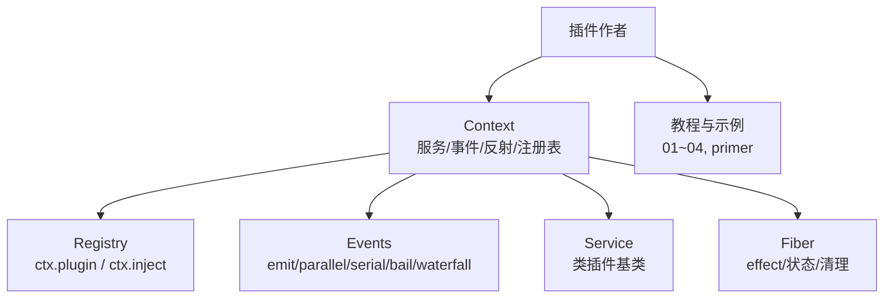
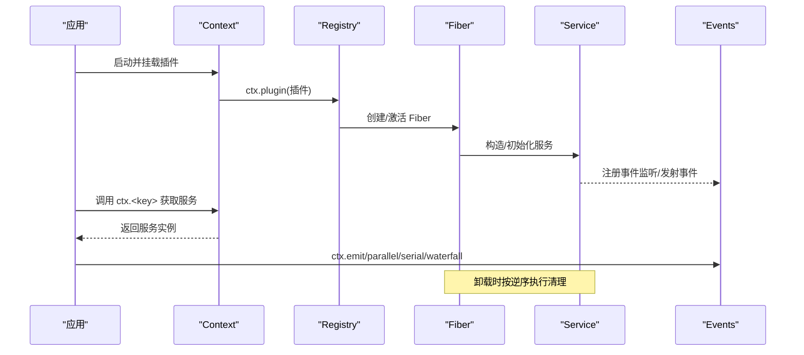
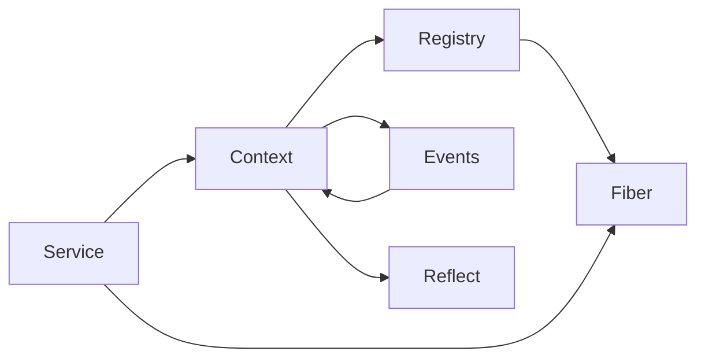

# Cordis 插件框架

<cite>
**本文引用的文件**
- [context.md](file://docs/cordis-api/context.md)
- [events.md](file://docs/cordis-api/events.md)
- [service.md](file://docs/cordis-api/service.md)
- [registry.md](file://docs/cordis-api/registry.md)
- [fiber.md](file://docs/cordis-api/fiber.md)
- [01-first-plugin.md](file://docs/cordis-tutorial/01-first-plugin.md)
- [02-lifecycle-and-effects.md](file://docs/cordis-tutorial/02-lifecycle-and-effects.md)
- [03-services.md](file://docs/cordis-tutorial/03-services.md)
- [04-events.md](file://docs/cordis-tutorial/04-events.md)
- [cordis-primer.md](file://docs/cordis-primer.md)
</cite>

## 目录
1. [简介](#简介)
2. [项目结构](#项目结构)
3. [核心组件](#核心组件)
4. [架构总览](#架构总览)
5. [详细组件分析](#详细组件分析)
6. [依赖关系分析](#依赖关系分析)
7. [性能考量](#性能考量)
8. [故障排查指南](#故障排查指南)
9. [结论](#结论)
10. [附录](#附录)

## 简介
Cordis 是 DeepSeek Harness 内嵌的插件化运行时，围绕“插件、服务、上下文、生命周期”四大概念组织。通过统一的 Context 暴露服务与事件能力；插件以函数、对象或类（Service）三种形态注册；依赖通过 inject 声明，加载顺序由依赖决定而非配置文件顺序；事件系统提供 emit、parallel、serial、bail、waterfall 多种分发模式；所有注册都作为可撤销的 effect 管理，确保热重载与卸载时的确定性清理。

## 项目结构
本仓库将 Cordis 的核心 API 文档与教程分离：
- docs/cordis-api：自动生成并维护的 API 参考（Context、Events、Service、Registry、Fiber）。
- docs/cordis-tutorial：循序渐进的教程（从第一个插件到事件、服务、配置等）。
- docs/cordis-primer：面向插件作者的概念导引与实践规则。

图表来源
- [context.md:1-163](file://docs/cordis-api/context.md#L1-L163)
- [events.md:1-208](file://docs/cordis-api/events.md#L1-L208)
- [service.md:1-103](file://docs/cordis-api/service.md#L1-L103)
- [registry.md:1-153](file://docs/cordis-api/registry.md#L1-L153)
- [fiber.md:1-376](file://docs/cordis-api/fiber.md#L1-L376)

章节来源
- [context.md:1-163](file://docs/cordis-api/context.md#L1-L163)
- [events.md:1-208](file://docs/cordis-api/events.md#L1-L208)
- [service.md:1-103](file://docs/cordis-api/service.md#L1-L103)
- [registry.md:1-153](file://docs/cordis-api/registry.md#L1-L153)
- [fiber.md:1-376](file://docs/cordis-api/fiber.md#L1-L376)

## 核心组件
- 上下文（Context）：插件运行时的根容器，提供 get/set/provide/accessor/mixin、extend/isolate/intercept、以及混入的事件与注册表方法。
- 服务（Service）：以名称注册的类插件基类，实例即服务，自动随 fiber 生命周期管理。
- 事件（Events）：类型安全的发布订阅，支持五种分发模式。
- 注册表（Registry）：加载插件、声明依赖、注入配置。
- 纤维（Fiber）：单个插件实例的生命周期、已验证配置、effects 与清理。

章节来源
- [context.md:1-163](file://docs/cordis-api/context.md#L1-L163)
- [service.md:1-103](file://docs/cordis-api/service.md#L1-L103)
- [events.md:1-208](file://docs/cordis-api/events.md#L1-L208)
- [registry.md:1-153](file://docs/cordis-api/registry.md#L1-L153)
- [fiber.md:1-376](file://docs/cordis-api/fiber.md#L1-L376)

## 架构总览
下图展示了插件在 Context 中通过 Registry 加载，使用 Service 暴露能力，通过 Events 通信，并由 Fiber 管理生命周期与清理。

图表来源
- [registry.md:35-56](file://docs/cordis-api/registry.md#L35-L56)
- [fiber.md:50-111](file://docs/cordis-api/fiber.md#L50-L111)
- [service.md:1-36](file://docs/cordis-api/service.md#L1-L36)
- [events.md:8-123](file://docs/cordis-api/events.md#L8-L123)

## 详细组件分析

### 上下文（Context）
- 作用：服务解析、子作用域扩展、拦截配置合并、反射层访问、事件总线与注册表混入。
- 关键能力：
  - 读取/设置/提供/定义访问器/混入成员：get/set/provide/accessor/mixin。
  - 作用域隔离：extend/isolate/intercept 创建子上下文而不影响父级。
  - 内置服务：events、logger、reflect、registry。
- 典型用法：通过 ctx.<key> 直接访问已注册的服务；通过 ctx.get('name') 安全探测可选依赖。

章节来源
- [context.md:1-163](file://docs/cordis-api/context.md#L1-L163)
- [context.md:237-365](file://docs/cordis-api/context.md#L237-L365)

### 服务（Service）
- 类插件基类：继承 Service 并在构造函数中调用 super(ctx, 'name') 完成注册。
- 静态约定：init/check/config/invoke/extend/tracker/resolveConfig 等符号键用于框架扩展点。
- 生命周期：实例随 fiber 自动注册与移除。

章节来源
- [service.md:1-103](file://docs/cordis-api/service.md#L1-L103)

### 事件（Events）
- 四种常用分发模式：
  - emit：同步广播，忽略返回值。
  - parallel：并发执行所有监听器，统一等待。
  - serial：顺序等待，首个非空返回值短路。
  - waterfall：中间件式组合，最后一个参数为 next，可转换或否决后续链。
- 监听：on/once 注册，属于 effect，卸载时自动移除。

章节来源
- [events.md:8-123](file://docs/cordis-api/events.md#L8-L123)
- [events.md:173-208](file://docs/cordis-api/events.md#L173-L208)

### 注册与依赖（Registry）
- 插件入口形状：函数、对象（含 apply）、类（Service 子类）。
- 依赖注入：inject 数组或对象形式声明所需服务；未满足时保持 PENDING。
- 加载：ctx.plugin 加载插件；ctx.inject 是快捷方式，依赖变化时重新运行回调。

章节来源
- [registry.md:8-56](file://docs/cordis-api/registry.md#L8-L56)
- [registry.md:58-121](file://docs/cordis-api/registry.md#L58-L121)
- [registry.md:123-153](file://docs/cordis-api/registry.md#L123-L153)

### 生命周期与效果（Fiber）
- Fiber 状态机：PENDING → LOADING/ACTIVE → UNLOADING/DISPOSED（失败分支 FAILED）。
- effect：注册带清理的效果体，返回 disposer；卸载时按逆序执行。
- 诊断：getEffects 输出效果树；update/restart 支持热更新与重启。

章节来源
- [fiber.md:1-376](file://docs/cordis-api/fiber.md#L1-L376)

### 插件开发最佳实践（结合教程）
- 函数式插件：最简形式，适合无服务暴露的场景。
- 对象式插件：显式 name/apply，便于调试与元数据。
- 类式插件（Service）：需要对外暴露稳定 API 时使用。
- 依赖声明：使用 inject 声明强依赖，保证加载时机；可选依赖用 ctx.get。
- 事件监听：使用 ctx.on 注册，无需手动移除；必要时使用 once。
- 生命周期钩子：外部资源通过 ctx.effect 包装，确保卸载时释放。

章节来源
- [01-first-plugin.md:1-96](file://docs/cordis-tutorial/01-first-plugin.md#L1-L96)
- [02-lifecycle-and-effects.md:1-99](file://docs/cordis-tutorial/02-lifecycle-and-effects.md#L1-L99)
- [03-services.md:1-99](file://docs/cordis-tutorial/03-services.md#L1-L99)
- [04-events.md:1-145](file://docs/cordis-tutorial/04-events.md#L1-L145)

## 依赖关系分析
- 耦合与内聚：Context 聚合事件、反射、注册表与服务发现；Service/Fiber 分别负责能力与生命周期；Registry 协调加载与依赖。
- 直接依赖：
  - Registry 依赖 Context 与 Fiber。
  - Service 依赖 Context 与 Fiber。
  - Events 混入 Context。
- 间接依赖：插件通过 inject 形成有向依赖图，避免循环；PENDING 态解耦了启动顺序。

图表来源
- [context.md:1-163](file://docs/cordis-api/context.md#L1-L163)
- [registry.md:1-56](file://docs/cordis-api/registry.md#L1-L56)
- [fiber.md:50-111](file://docs/cordis-api/fiber.md#L50-L111)
- [service.md:1-36](file://docs/cordis-api/service.md#L1-L36)

章节来源
- [context.md:1-163](file://docs/cordis-api/context.md#L1-L163)
- [registry.md:1-56](file://docs/cordis-api/registry.md#L1-L56)
- [fiber.md:50-111](file://docs/cordis-api/fiber.md#L50-L111)
- [service.md:1-36](file://docs/cordis-api/service.md#L1-L36)

## 性能考量
- 并发与串行：parallel 适合独立副作用的并行处理；serial/waterfall 适合有序决策与中间件改造。
- 依赖解析：inject 使插件在依赖就绪前保持 PENDING，避免不必要的重算。
- 清理成本：effect 的异步清理并发执行，若需顺序清理应放在同一 disposer 中 await。
- 热更新：update/restart 会触发内部 update 水线，注意在监听器中做幂等处理。

[本节为通用指导，不直接分析具体文件]

## 故障排查指南
- 插件未打印：检查是否处于 PENDING（依赖未满足），或模块解析失败（路径/包名拼写错误）。
- 事件无响应：确认事件模式与调用方法匹配（如 waterfall 必须传入 next）。
- 资源泄漏：未在 ctx.effect 中包装的外部资源不会自动释放。
- 重复提供：同名服务在同一作用域重复 provide 会抛错。
- 无效 effect：在已销毁 fiber 上注册 effect 会抛出 INACTIVE_EFFECT。

章节来源
- [01-first-plugin.md:79-92](file://docs/cordis-tutorial/01-first-plugin.md#L79-L92)
- [02-lifecycle-and-effects.md:68-95](file://docs/cordis-tutorial/02-lifecycle-and-effects.md#L68-L95)
- [04-events.md:80-141](file://docs/cordis-tutorial/04-events.md#L80-L141)
- [fiber.md:331-376](file://docs/cordis-api/fiber.md#L331-L376)

## 结论
Cordis 通过 Context 统一服务与事件，以 Registry 管理插件加载与依赖，以 Fiber 保障生命周期与清理。插件可按函数/对象/类三种形态实现，借助 inject 表达依赖，使用事件进行松耦合通信，并通过 ctx.effect 管理外部资源。遵循这些原则可获得可插拔、可热更新、可观测且易于测试的系统。

[本节为总结性内容，不直接分析具体文件]

## 附录

### 快速对照表
- 插件入口：函数/对象/类（Service）
- 依赖声明：inject（数组或对象）
- 服务访问：ctx.<key> 或 ctx.get('name')
- 事件分发：emit/parallel/serial/bail/waterfall
- 生命周期：ctx.effect 注册清理；Fiber 状态机驱动卸载

章节来源
- [registry.md:58-121](file://docs/cordis-api/registry.md#L58-L121)
- [context.md:237-365](file://docs/cordis-api/context.md#L237-L365)
- [events.md:8-123](file://docs/cordis-api/events.md#L8-L123)
- [fiber.md:68-111](file://docs/cordis-api/fiber.md#L68-L111)

### 事件分发模式速查
- emit：同步广播，不等待。
- parallel：全部并发，统一等待。
- serial：顺序等待，首个非空返回值短路。
- bail：同步版 serial。
- waterfall：中间件式组合，next 控制链路。

章节来源
- [events.md:8-123](file://docs/cordis-api/events.md#L8-L123)
- [events.md:189-208](file://docs/cordis-api/events.md#L189-L208)
- [cordis-primer.md:15-35](file://docs/cordis-primer.md#L15-L35)