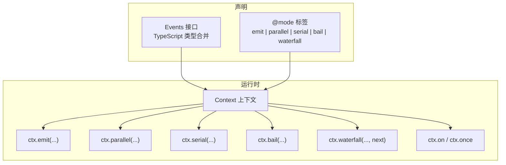
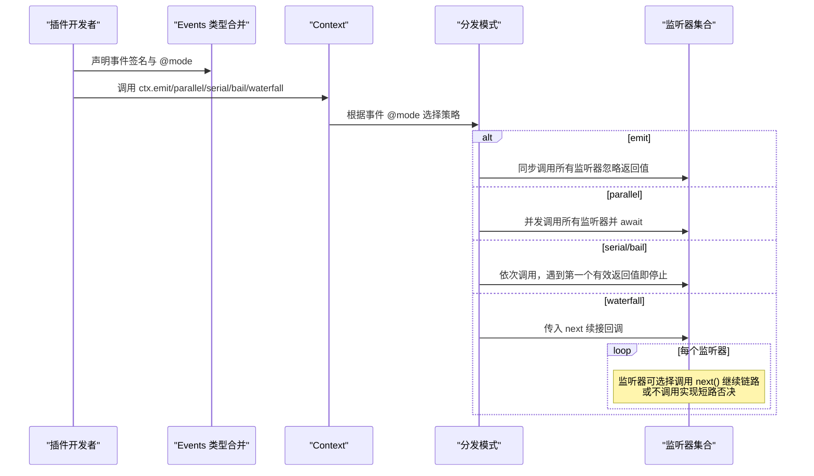
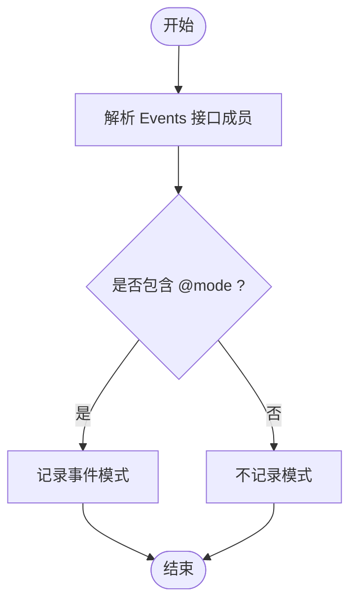
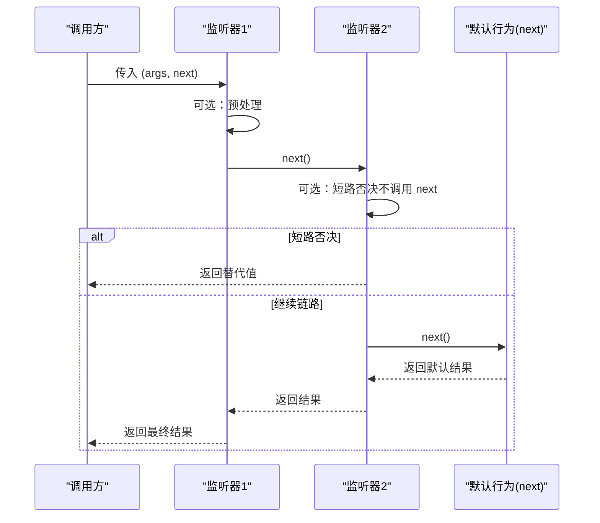
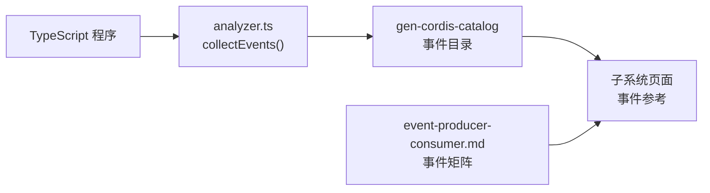

# 事件系统

<cite>
**本文引用的文件**
- [docs/cordis-api/events.md](file://docs/cordis-api/events.md)
- [docs/cordis-api/events.zh.md](file://docs/cordis-api/events.zh.md)
- [docs/cordis-tutorial/04-events.md](file://docs/cordis-tutorial/04-events.md)
- [docs/event-producer-consumer.md](file://docs/event-producer-consumer.md)
- [packages/core/agent/src/runtime-types.ts](file://packages/core/agent/src/runtime-types.ts)
- [packages/core/session/src/index.ts](file://packages/core/session/src/index.ts)
- [scripts/gen-cordis-catalog-partition.spec.ts](file://scripts/gen-cordis-catalog-partition.spec.ts)
- [packages/typert/generator/src/analyzer.ts](file://packages/typert/generator/src/analyzer.ts)
</cite>

## 目录
1. [简介](#简介)
2. [项目结构](#项目结构)
3. [核心组件](#核心组件)
4. [架构总览](#架构总览)
5. [详细组件分析](#详细组件分析)
6. [依赖关系分析](#依赖关系分析)
7. [性能考量](#性能考量)
8. [故障排查指南](#故障排查指南)
9. [结论](#结论)
10. [附录](#附录)

## 简介
本文件系统化梳理 Cordis 事件系统的四种分发模式（emit、waterfall、parallel、serial）与监听器机制，说明事件的声明方式（TypeScript 类型合并与 @mode 标签），并给出水流水文（waterfall）中间件机制的 next() 使用与短路返回规则。文档同时提供具体代码示例路径，覆盖观察者模式、请求包装、并行处理与串行处理等典型场景。

## 项目结构
Cordis 事件系统由“事件声明 + 分发 API + 监听器注册”三部分构成：
- 事件声明：通过模块扩展 interface Events 进行 TypeScript 类型合并，并在 JSDoc 中使用 @mode 标注事件的分发模式。
- 分发 API：ctx.emit、ctx.parallel、ctx.serial、ctx.bail、ctx.waterfall 混入上下文，用于触发事件。
- 监听器：ctx.on / ctx.once 注册监听器，支持 prepend/global 选项，生命周期随 fiber 自动回收。

**图表来源**
- [docs/cordis-api/events.md:1-208](file://docs/cordis-api/events.md#L1-L208)
- [docs/cordis-api/events.zh.md:1-210](file://docs/cordis-api/events.zh.md#L1-L210)
- [packages/core/agent/src/runtime-types.ts:150-293](file://packages/core/agent/src/runtime-types.ts#L150-L293)
- [packages/core/session/src/index.ts:50-86](file://packages/core/session/src/index.ts#L50-L86)

**章节来源**
- [docs/cordis-api/events.md:1-208](file://docs/cordis-api/events.md#L1-L208)
- [docs/cordis-api/events.zh.md:1-210](file://docs/cordis-api/events.zh.md#L1-L210)

## 核心组件
- 事件声明与类型合并：在模块中扩展 interface Events，以字符串字面量或标识符作为键，定义监听器签名；工具链会读取这些成员生成事件目录。
- 分发模式：
  - emit：同步广播，忽略返回值与 Promise。
  - parallel：并发运行所有监听器，统一等待完成。
  - serial：按序等待监听器，首个非 null/false/undefined 返回值即终止后续。
  - bail：serial 的同步版本。
  - waterfall：最后一个参数为 next 续接回调；监听器可调用 next 继续链路，或不调用实现短路否决。
- 监听器注册：ctx.on / ctx.once 支持 prepend 与 global 选项；监听器随 fiber 生命周期自动释放。

**章节来源**
- [docs/cordis-api/events.md:8-123](file://docs/cordis-api/events.md#L8-L123)
- [docs/cordis-api/events.zh.md:10-125](file://docs/cordis-api/events.zh.md#L10-L125)
- [docs/cordis-api/events.md:125-187](file://docs/cordis-api/events.md#L125-L187)
- [docs/cordis-api/events.zh.md:127-187](file://docs/cordis-api/events.zh.md#L127-L187)

## 架构总览
下图展示了事件从声明到分发的整体流程，以及不同模式的执行语义。

**图表来源**
- [docs/cordis-api/events.md:8-123](file://docs/cordis-api/events.md#L8-L123)
- [docs/cordis-api/events.zh.md:10-125](file://docs/cordis-api/events.zh.md#L10-L125)
- [packages/core/agent/src/runtime-types.ts:219-278](file://packages/core/agent/src/runtime-types.ts#L219-L278)

## 详细组件分析

### 事件声明与 @mode 标签
- 通过模块扩展 interface Events 声明事件名与监听器签名，工具链会解析成员名称与类型。
- 在 JSDoc 中添加 @mode 标签指定分发模式（emit/parallel/serial/bail/waterfall）。未标注时，工具链可能不记录模式。
- 工具链对 Events 的解析逻辑会提取方法签名与属性签名，并读取 @mode 注释。

**图表来源**
- [scripts/gen-cordis-catalog-partition.spec.ts:190-211](file://scripts/gen-cordis-catalog-partition.spec.ts#L190-L211)
- [packages/typert/generator/src/analyzer.ts:1844-1871](file://packages/typert/generator/src/analyzer.ts#L1844-L1871)

**章节来源**
- [scripts/gen-cordis-catalog-partition.spec.ts:190-211](file://scripts/gen-cordis-catalog-partition.spec.ts#L190-L211)
- [packages/typert/generator/src/analyzer.ts:1844-1871](file://packages/typert/generator/src/analyzer.ts#L1844-L1871)

### 四种分发模式详解

#### emit（同步广播）
- 行为：同步调用所有监听器，忽略返回值与 Promise。
- 适用：通知型事件，无需收集结果或控制流。
- 示例：会话创建、状态变更、日志追加等。

**章节来源**
- [docs/cordis-api/events.md:31-49](file://docs/cordis-api/events.md#L31-L49)
- [docs/cordis-api/events.zh.md:33-51](file://docs/cordis-api/events.zh.md#L33-L51)
- [packages/core/session/src/index.ts:50-76](file://packages/core/session/src/index.ts#L50-L76)

#### parallel（并发等待）
- 行为：所有监听器并发运行，调用方统一等待全部完成。
- 适用：需要并行执行且无顺序依赖的任务，如持久化写入、遥测上报。
- 示例：session/flush 事件。

**章节来源**
- [docs/cordis-api/events.md:8-29](file://docs/cordis-api/events.md#L8-L29)
- [docs/cordis-api/events.zh.md:10-31](file://docs/cordis-api/events.zh.md#L10-L31)
- [packages/core/session/src/index.ts:77-85](file://packages/core/session/src/index.ts#L77-L85)

#### serial（串行短路）
- 行为：按序等待监听器，首个非 null/false/undefined 返回值即终止后续。
- 适用：决策类事件，多个策略竞争，先决者胜出。
- 示例：turn-stopping 事件。

**章节来源**
- [docs/cordis-api/events.md:51-72](file://docs/cordis-api/events.md#L51-L72)
- [docs/cordis-api/events.zh.md:53-74](file://docs/cordis-api/events.zh.md#L53-L74)
- [packages/core/agent/src/runtime-types.ts:261-278](file://packages/core/agent/src/runtime-types.ts#L261-L278)

#### waterfall（水流水文中间件）
- 行为：最后一个参数为 next 续接回调；监听器可调用 next() 继续链路，或不调用实现短路否决。
- 适用：拦截与转换，如替换模型调用配置、审批策略、工具执行前后钩子。
- 示例：agent/request、tools/pre-execute、fs/write-intent 等。

**图表来源**
- [docs/cordis-api/events.md:97-123](file://docs/cordis-api/events.md#L97-L123)
- [docs/cordis-api/events.zh.md:99-125](file://docs/cordis-api/events.zh.md#L99-L125)
- [packages/core/agent/src/runtime-types.ts:219-260](file://packages/core/agent/src/runtime-types.ts#L219-L260)

**章节来源**
- [docs/cordis-api/events.md:97-123](file://docs/cordis-api/events.md#L97-L123)
- [docs/cordis-api/events.zh.md:99-125](file://docs/cordis-api/events.zh.md#L99-L125)
- [packages/core/agent/src/runtime-types.ts:219-260](file://packages/core/agent/src/runtime-types.ts#L219-L260)

### 监听器实现与回调处理
- ctx.on：注册监听器，返回资源释放函数；支持 prepend（插入到监听器列表前端）与 global（绕过上下文过滤）。
- ctx.once：仅首次调用后自动注销。
- 监听器生命周期：随 fiber 自动回收，无需手动 removeListener。
- 回调类型：根据事件签名决定参数与返回值；waterfall 事件最后参数为 next 续接回调。

**章节来源**
- [docs/cordis-api/events.md:125-187](file://docs/cordis-api/events.md#L125-L187)
- [docs/cordis-api/events.zh.md:127-187](file://docs/cordis-api/events.zh.md#L127-L187)

### 水流水文中间件机制与 next() 使用
- next() 调用：表示将控制权交给下一个监听器或默认行为；不调用即为短路否决。
- 短路返回：直接返回替代值，跳过后续监听器与默认行为。
- 规范：观察型/注解型监听器必须调用 next()，否则下游默认行为会被静默吞掉。

**章节来源**
- [docs/cordis-api/events.md:97-123](file://docs/cordis-api/events.md#L97-L123)
- [docs/cordis-api/events.zh.md:99-125](file://docs/cordis-api/events.zh.md#L99-L125)
- [docs/cordis-tutorial/04-events.md:94-140](file://docs/cordis-tutorial/04-events.md#L94-L140)

### 具体使用示例（含代码路径）
- 观察者模式（emit）：统计服务上报计数变化，监听器打印日志。
  - 参考：[docs/cordis-tutorial/04-events.md:8-78](file://docs/cordis-tutorial/04-events.md#L8-L78)
- 请求包装（waterfall）：替换模型调用配置或审批策略。
  - 参考：[packages/core/agent/src/runtime-types.ts:232-260](file://packages/core/agent/src/runtime-types.ts#L232-L260)
- 并行处理（parallel）：会话刷新持久化与遥测上报。
  - 参考：[packages/core/session/src/index.ts:77-85](file://packages/core/session/src/index.ts#L77-L85)
- 串行处理（serial）：回合关闭前的决策点，首个有效返回值即停止。
  - 参考：[packages/core/agent/src/runtime-types.ts:261-278](file://packages/core/agent/src/runtime-types.ts#L261-L278)

**章节来源**
- [docs/cordis-tutorial/04-events.md:8-78](file://docs/cordis-tutorial/04-events.md#L8-L78)
- [packages/core/agent/src/runtime-types.ts:232-278](file://packages/core/agent/src/runtime-types.ts#L232-L278)
- [packages/core/session/src/index.ts:77-85](file://packages/core/session/src/index.ts#L77-L85)

## 依赖关系分析
- 事件声明与工具链：
  - 工具链从 TypeScript Program 中解析 Events 接口成员与 @mode 标签，生成事件目录与子系统页面。
- 事件矩阵：
  - 文档维护了各事件的模式、声明位置、分发者与监听者，便于理解耦合关系。

**图表来源**
- [packages/typert/generator/src/analyzer.ts:1844-1871](file://packages/typert/generator/src/analyzer.ts#L1844-L1871)
- [docs/event-producer-consumer.md:1-77](file://docs/event-producer-consumer.md#L1-L77)

**章节来源**
- [packages/typert/generator/src/analyzer.ts:1844-1871](file://packages/typert/generator/src/analyzer.ts#L1844-L1871)
- [docs/event-producer-consumer.md:1-77](file://docs/event-producer-consumer.md#L1-L77)

## 性能考量
- emit：最轻量，适合高频通知；注意避免在监听器中进行阻塞操作。
- parallel：并发执行，需考虑资源竞争与错误隔离；适用于 I/O 密集型任务。
- serial：顺序执行且有短路特性，适合优先级决策；避免长耗时监听器影响整体延迟。
- waterfall：中间件链式调用，注意 next() 的正确使用；短路可减少不必要开销。

## 故障排查指南
- 忘记调用 next()：waterfall 监听器若只观察而不调用 next()，会导致下游默认行为被静默吞掉；应确保观察型监听器始终调用 next()。
- 模式误用：将需要串行的决策误用为 emit，可能导致竞态与不可预期结果；应根据事件语义选择合适模式。
- 监听器异常：emit 模式下监听器异常通常被记录但不中断；parallel 模式下需关注 Promise rejection；serial 模式下首个有效返回值会短路后续。
- 上下文过滤：global 选项可绕过上下文过滤，谨慎使用以避免跨作用域副作用。

**章节来源**
- [docs/cordis-api/events.md:97-123](file://docs/cordis-api/events.md#L97-L123)
- [docs/cordis-api/events.zh.md:99-125](file://docs/cordis-api/events.zh.md#L99-L125)
- [docs/cordis-tutorial/04-events.md:94-140](file://docs/cordis-tutorial/04-events.md#L94-L140)

## 结论
Cordis 事件系统通过 TypeScript 类型合并与 @mode 标签，实现了强类型、可组合的事件契约。四种分发模式覆盖了通知、并发、决策与拦截等常见场景；waterfall 中间件机制提供了强大的可扩展性。遵循 next() 使用规范与模式选择原则，可在保证性能的同时构建高内聚、低耦合的插件生态。

## 附录
- 事件矩阵与子系统参考：参见事件矩阵文档与各子系统页面中的事件参考。
- 教程与示例：参见教程中的事件章节，包含完整的使用示例与最佳实践。