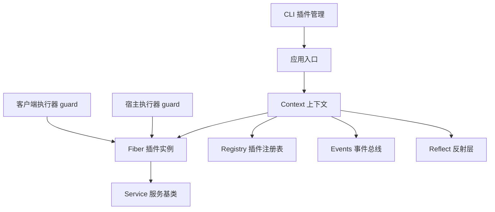
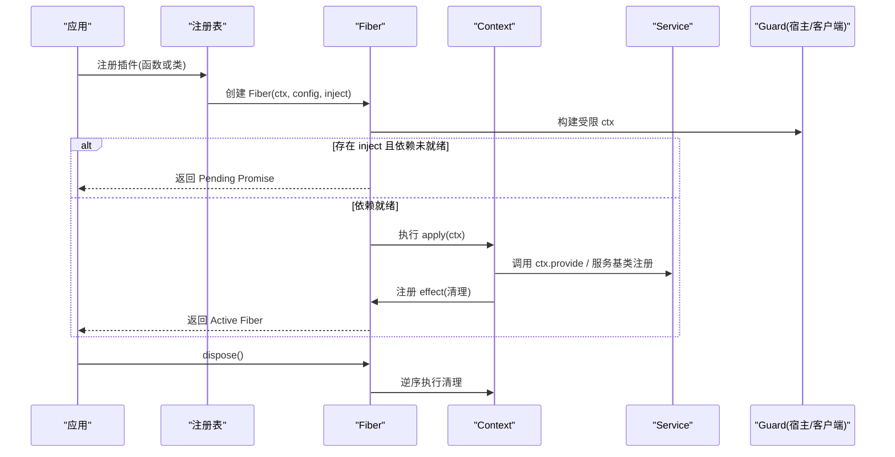
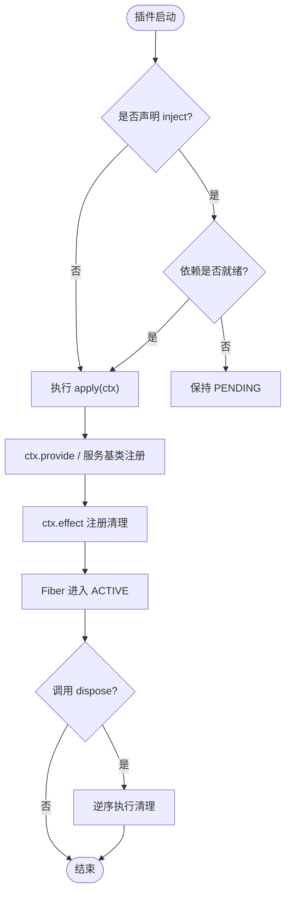
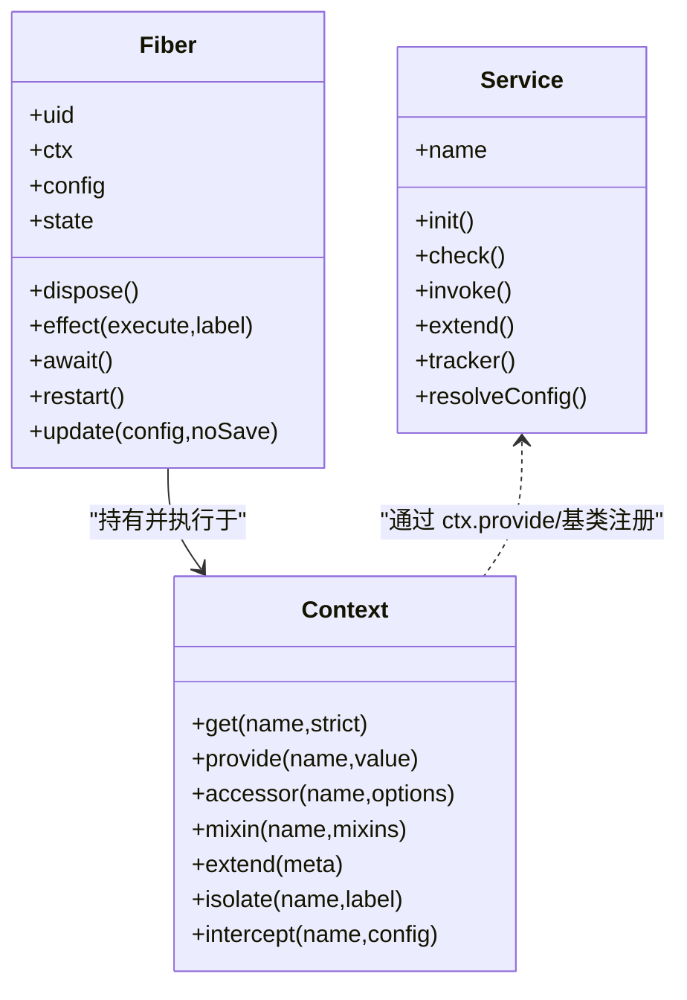

# 插件系统

<cite>
**本文引用的文件**
- [context.md](file://docs/cordis-api/context.md)
- [fiber.md](file://docs/cordis-api/fiber.md)
- [service.md](file://docs/cordis-api/service.md)
- [guard.ts（主机）](file://packages/extensions/cordis-host-runner/src/guard.ts)
- [guard.ts（客户端）](file://packages/extensions/cordis-client-runner/src/client/guard.ts)
- [plugin.ts（CLI）](file://apps/cli/src/plugin.ts)
- [SKILL.md（插件开发技能）](file://apps/cli/config/agent-presets/cordis/skills/cordis-plugin-development/SKILL.md)
</cite>

## 目录
1. [简介](#简介)
2. [项目结构](#项目结构)
3. [核心组件](#核心组件)
4. [架构总览](#架构总览)
5. [详细组件分析](#详细组件分析)
6. [依赖关系与加载顺序](#依赖关系与加载顺序)
7. [性能考虑](#性能考虑)
8. [故障排查指南](#故障排查指南)
9. [结论](#结论)
10. [附录：示例与最佳实践](#附录示例与最佳实践)

## 简介
本文件系统化说明 Cordis 插件体系，覆盖两类插件形态、服务接口要求、生命周期管理、上下文挂载机制，以及通过 inject 声明解决插件间依赖与加载顺序的方法。文档同时给出可操作的步骤指引和图示，帮助读者从零开始编写具备依赖声明、服务注册与清理逻辑的插件。

## 项目结构
Cordis 插件能力由“运行时内核 + 宿主/客户端执行器 + 文档契约”三部分构成：
- 文档契约：定义 Context、Fiber、Service 等核心 API 与约定。
- 宿主/客户端执行器：提供安全沙箱、动态上下文代理、注入校验与守卫。
- CLI 工具：负责以 profile 为单位管理插件包与层叠装配。

图表来源
- [fiber.md:1-120](file://docs/cordis-api/fiber.md#L1-L120)
- [context.md:1-160](file://docs/cordis-api/context.md#L1-L160)
- [service.md:1-103](file://docs/cordis-api/service.md#L1-L103)
- [guard.ts（主机）:680-711](file://packages/extensions/cordis-host-runner/src/guard.ts#L680-L711)
- [guard.ts（客户端）:180-204](file://packages/extensions/cordis-client-runner/src/client/guard.ts#L180-L204)
- [plugin.ts（CLI）:120-159](file://apps/cli/src/plugin.ts#L120-L159)

章节来源
- [fiber.md:1-120](file://docs/cordis-api/fiber.md#L1-L120)
- [context.md:1-160](file://docs/cordis-api/context.md#L1-L160)
- [service.md:1-103](file://docs/cordis-api/service.md#L1-L103)
- [guard.ts（主机）:680-711](file://packages/extensions/cordis-host-runner/src/guard.ts#L680-L711)
- [guard.ts（客户端）:180-204](file://packages/extensions/cordis-client-runner/src/client/guard.ts#L180-L204)
- [plugin.ts（CLI）:120-159](file://apps/cli/src/plugin.ts#L120-L159)

## 核心组件
- 上下文 Context：插件运行时的根容器，提供事件、日志、反射、注册表等能力，并支持扩展、隔离与拦截。
- Fiber：单个插件实例的生命周期载体，持有当前状态、已验证配置、效果集合与清理逻辑。
- Service：面向 ctx 暴露命名 API 的服务基类，构造时即注册，随所属 fiber 自动移除。
- 守卫 Guard：在宿主/客户端侧对动态代码进行限制，强制通过 inject 声明访问服务，未声明则拒绝读取。

章节来源
- [context.md:1-160](file://docs/cordis-api/context.md#L1-L160)
- [fiber.md:1-120](file://docs/cordis-api/fiber.md#L1-L120)
- [service.md:1-103](file://docs/cordis-api/service.md#L1-L103)
- [guard.ts（主机）:680-711](file://packages/extensions/cordis-host-runner/src/guard.ts#L680-L711)
- [guard.ts（客户端）:180-204](file://packages/extensions/cordis-client-runner/src/client/guard.ts#L180-L204)

## 架构总览
下图展示插件从注册到激活的关键路径：插件函数或类被载入后，框架创建 Fiber；若声明了 inject，则在依赖满足前进入等待；依赖就绪后执行 apply；插件通过 ctx.provide 或服务基类注册服务；通过 ctx.effect 注册清理逻辑；卸载时按逆序回收。

图表来源
- [fiber.md:1-120](file://docs/cordis-api/fiber.md#L1-L120)
- [context.md:235-365](file://docs/cordis-api/context.md#L235-L365)
- [service.md:1-103](file://docs/cordis-api/service.md#L1-L103)
- [guard.ts（主机）:680-711](file://packages/extensions/cordis-host-runner/src/guard.ts#L680-L711)
- [guard.ts（客户端）:180-204](file://packages/extensions/cordis-client-runner/src/client/guard.ts#L180-L204)

## 详细组件分析

### 函数式插件与服务类插件
- 函数式插件：导出一个函数，返回对象形式 { name?, inject?, apply(ctx) }。适用于轻量扩展、按需注册能力。
- 服务类插件：继承 Service 基类，构造时即完成注册，适合需要稳定 API 与可组合扩展的服务。

差异要点
- 函数式插件通过 inject 声明强依赖，apply 中通过 ctx.get 或 ctx.<name> 访问服务。
- 服务类插件通过 super(ctx, name) 注册自身，可在子类中实现 init/check/invoke/extend/tracker/resolveConfig 等符号化钩子。

章节来源
- [SKILL.md（插件开发技能）:61-125](file://apps/cli/config/agent-presets/cordis/skills/cordis-plugin-development/SKILL.md#L61-L125)
- [service.md:1-103](file://docs/cordis-api/service.md#L1-L103)

### Service 接口的实现要求
- 名称与注册：子类构造时调用 super(ctx, name)，服务立即注册，随 fiber 卸载自动移除。
- 可选钩子：
  - init：构造后执行的初始化方法。
  - check：作为 ctx.provide 的可用性谓词。
  - invoke：使服务可调用（如 ctx.logger()）。
  - extend：派生新实例的辅助。
  - tracker：用于上下文追踪的元数据键。
  - resolveConfig：解析拦截配置的辅助。
- 使用建议：将复杂逻辑封装为 Service，并通过 ctx.provide 或继承基类暴露给其他插件。

章节来源
- [service.md:1-103](file://docs/cordis-api/service.md#L1-L103)

### 插件生命周期与上下文挂载
- 创建 Fiber：每个插件对应一个 Fiber，持有 ctx、config、state、store 等。
- 依赖等待：若声明 inject 但依赖未就绪，Fiber 处于 PENDING，直到提供者出现。
- 激活执行：依赖满足后执行 apply(ctx)，并在其中注册服务与 effect。
- 清理回收：dispose 时按逆序执行所有 effect 的清理。
- 上下文挂载：apply 接收的 ctx 是受 Guard 保护的代理，仅允许访问已声明的 inject 服务或通过 ctx.get 安全查询。

图表来源
- [fiber.md:1-120](file://docs/cordis-api/fiber.md#L1-L120)
- [context.md:235-365](file://docs/cordis-api/context.md#L235-L365)
- [guard.ts（主机）:680-711](file://packages/extensions/cordis-host-runner/src/guard.ts#L680-L711)
- [guard.ts（客户端）:180-204](file://packages/extensions/cordis-client-runner/src/client/guard.ts#L180-L204)

章节来源
- [fiber.md:1-120](file://docs/cordis-api/fiber.md#L1-L120)
- [context.md:235-365](file://docs/cordis-api/context.md#L235-L365)

### 依赖关系与加载顺序：inject 机制
- 声明方式：在返回的对象上设置 inject 数组，或在类插件中以特定形式声明。
- 语义：只有当所有 inject 中的服务在当前作用域可用时，插件才会从 PENDING 转为 ACTIVE 并执行 apply。
- 守卫校验：宿主/客户端 Guard 会检查 ctx 属性访问，未声明的服务直接拒绝，避免隐式耦合。
- 隔离与拦截：可通过 ctx.isolate 与 ctx.intercept 控制服务作用域与配置合并，进一步解耦依赖。

图表来源
- [fiber.md:1-120](file://docs/cordis-api/fiber.md#L1-L120)
- [context.md:1-160](file://docs/cordis-api/context.md#L1-L160)
- [service.md:1-103](file://docs/cordis-api/service.md#L1-L103)

章节来源
- [guard.ts（主机）:680-711](file://packages/extensions/cordis-host-runner/src/guard.ts#L680-L711)
- [guard.ts（客户端）:180-204](file://packages/extensions/cordis-client-runner/src/client/guard.ts#L180-L204)
- [context.md:235-365](file://docs/cordis-api/context.md#L235-L365)

## 依赖关系与加载顺序
- 声明优先：始终显式声明 inject，不要通过隐式全局或 ctx 未声明属性访问服务。
- 顺序保证：框架根据依赖图确保依赖先于消费者激活；若依赖暂时缺失，消费者保持 PENDING 直至就绪。
- 作用域隔离：使用 ctx.isolate 为同名服务提供独立作用域，避免跨模块污染。
- 配置拦截：使用 ctx.intercept 为下游插件注入服务级配置，便于多环境或多租户定制。

章节来源
- [context.md:1-160](file://docs/cordis-api/context.md#L1-L160)
- [fiber.md:1-120](file://docs/cordis-api/fiber.md#L1-L120)

## 性能考虑
- 延迟加载：仅在必要时声明 inject，避免不必要的等待链。
- 最小副作用：在 apply 中只做必要注册，重计算放入 effect 或惰性获取。
- 资源释放：务必通过 ctx.effect 返回清理函数，防止内存泄漏。
- 批量更新：多个服务变更尽量在一次 fiber 更新中完成，减少多次重启开销。

[本节为通用指导，不直接分析具体文件]

## 故障排查指南
- 访问未声明服务：Guard 会拒绝读取未在 inject 中声明的服务，需补充声明或改用 ctx.get 安全查询。
- 插件长期 PENDING：检查是否存在循环依赖或提供者未注册；确认依赖确实通过 ctx.provide 或服务基类暴露。
- 清理未执行：确认 effect 返回了正确的清理函数，且未被提前调用或忽略。
- CLI 插件安装失败：检查 pnpm 环境与 workspace 配置，必要时允许 git 依赖的 prepare 脚本。

章节来源
- [guard.ts（主机）:680-711](file://packages/extensions/cordis-host-runner/src/guard.ts#L680-L711)
- [guard.ts（客户端）:180-204](file://packages/extensions/cordis-client-runner/src/client/guard.ts#L180-L204)
- [plugin.ts（CLI）:120-159](file://apps/cli/src/plugin.ts#L120-L159)

## 结论
Cordis 插件系统通过 Context/Fiber/Service 三件套，结合 Guard 的安全约束与 inject 的显式依赖声明，实现了高内聚、低耦合的可插拔架构。遵循本文规范，可以编写出易于维护、可测试、可热更新的插件，并以清晰的依赖关系驱动加载顺序与生命周期管理。

[本节为总结性内容，不直接分析具体文件]

## 附录：示例与最佳实践
以下示例以步骤形式呈现，避免直接粘贴代码，请参照对应源码路径查看完整实现。

- 创建一个简单插件（函数式）
  - 声明依赖：在返回对象中设置 inject 数组，列出所需服务名。
  - 注册服务：在 apply(ctx) 中使用 ctx.provide 或服务基类暴露能力。
  - 清理逻辑：使用 ctx.effect 返回清理函数，确保资源释放。
  - 参考路径
    - [SKILL.md（插件开发技能）:61-125](file://apps/cli/config/agent-presets/cordis/skills/cordis-plugin-development/SKILL.md#L61-L125)
    - [context.md:235-365](file://docs/cordis-api/context.md#L235-L365)
    - [fiber.md:1-120](file://docs/cordis-api/fiber.md#L1-L120)

- 创建一个服务类插件
  - 继承 Service 基类，构造时调用 super(ctx, name)。
  - 根据需要实现 init/check/invoke/extend/tracker/resolveConfig 等符号化钩子。
  - 参考路径
    - [service.md:1-103](file://docs/cordis-api/service.md#L1-L103)

- 处理可选依赖
  - 使用 ctx.get('serviceName') 安全查询，若为 undefined 则降级或跳过。
  - 仅在强依赖场景下使用 inject，避免滥用导致不必要的等待。
  - 参考路径
    - [SKILL.md（插件开发技能）:61-125](file://apps/cli/config/agent-presets/cordis/skills/cordis-plugin-development/SKILL.md#L61-L125)
    - [context.md:235-365](file://docs/cordis-api/context.md#L235-L365)

- 管理插件生命周期
  - 在 apply 中注册 effect，返回清理函数。
  - 通过 fiber.dispose 触发逆序清理。
  - 参考路径
    - [fiber.md:1-120](file://docs/cordis-api/fiber.md#L1-L120)

- 通过 CLI 管理插件包
  - 使用 dsh plugin 命令初始化 profile、安装/更新插件包，并自动协调层叠。
  - 参考路径
    - [plugin.ts（CLI）:120-159](file://apps/cli/src/plugin.ts#L120-L159)