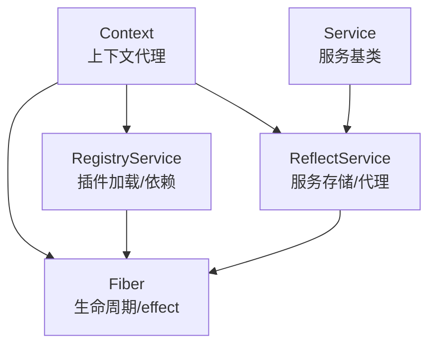
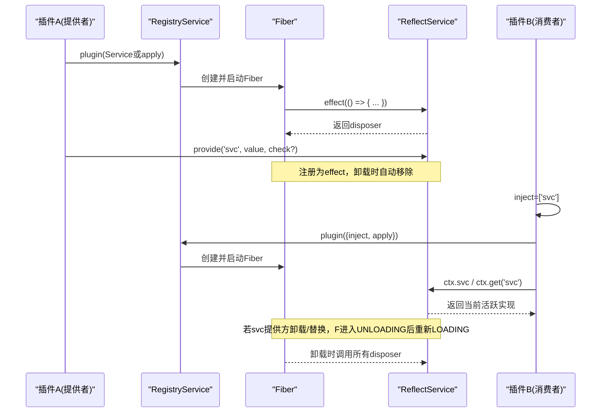
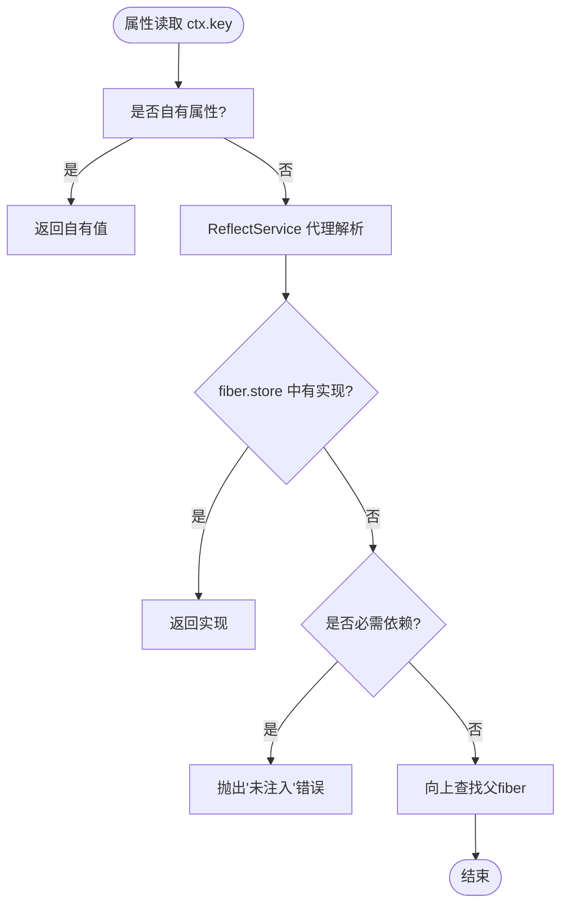
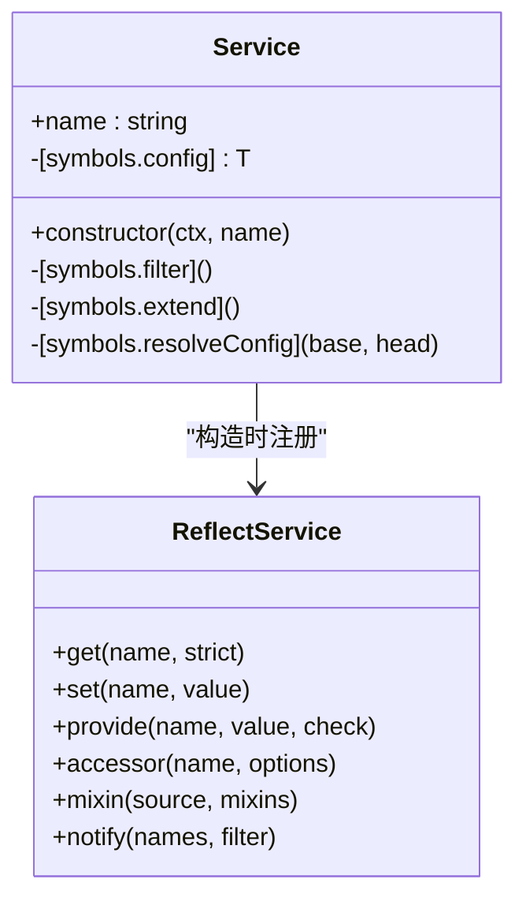
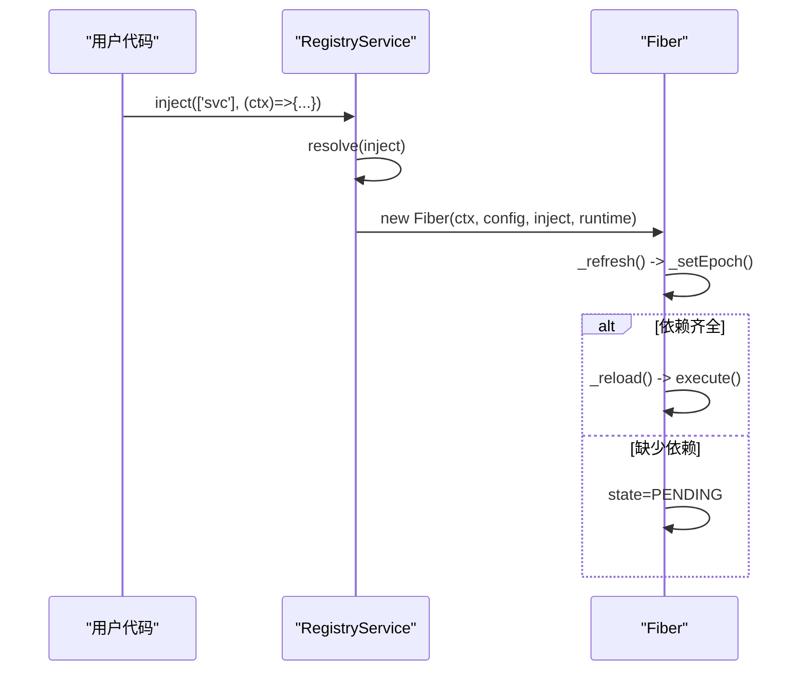
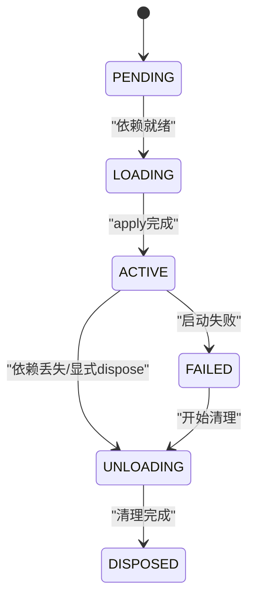
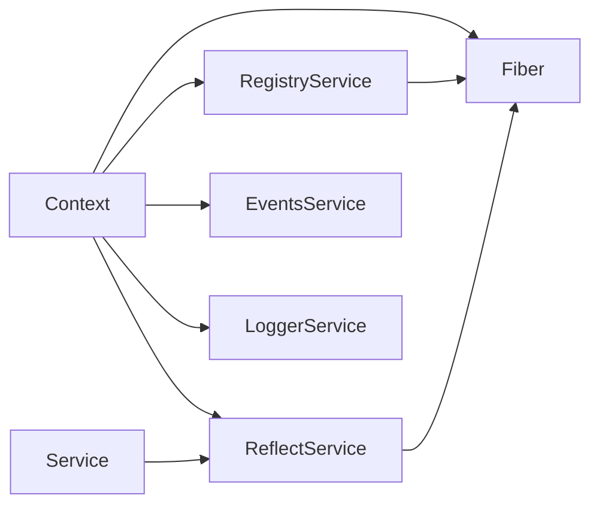

# 服务容器

<cite>
**本文引用的文件**
- [context.ts](file://vendor/cordis/src/context.ts)
- [reflect.ts](file://vendor/cordis/src/reflect.ts)
- [registry.ts](file://vendor/cordis/src/registry.ts)
- [fiber.ts](file://vendor/cordis/src/fiber.ts)
- [service.ts](file://vendor/cordis/src/service.ts)
- [03-services.md](file://docs/cordis-tutorial/03-services.md)
- [02-lifecycle-and-effects.md](file://docs/cordis-tutorial/02-lifecycle-and-effects.md)
- [inherited.md](file://docs/cordis-api/inherited.md)
</cite>

## 目录
1. [简介](#简介)
2. [项目结构](#项目结构)
3. [核心组件](#核心组件)
4. [架构总览](#架构总览)
5. [详细组件分析](#详细组件分析)
6. [依赖关系分析](#依赖关系分析)
7. [性能考量](#性能考量)
8. [故障排查指南](#故障排查指南)
9. [结论](#结论)
10. [附录](#附录)

## 简介
本章节面向 Cordis 的“服务容器”能力，围绕 Context（上下文）作为服务仓库展开：解释如何通过 ctx.<key> 访问服务与依赖注入、服务的注册机制（含可撤销 effect）、服务发现模式（插件通过键名查找而非直接导入），以及最佳实践（命名约定、依赖声明、生命周期管理）。文末提供从注册到发现再到销毁的完整流程示例路径。

## 项目结构
Cordis 的服务容器由以下核心模块协作完成：
- Context：上下文代理与隔离/拦截能力，暴露 events、logger、reflect、registry 等内置服务。
- ReflectService：服务存储、属性代理、mixin/accessor、通知依赖方刷新。
- RegistryService：插件加载、依赖声明与 fiber 启动。
- Fiber：插件实例的生命周期、effect 收集、状态机驱动重载/卸载。
- Service：服务基类，构造时自动注册为 ctx.<name>，并随 fiber 卸载而移除。

图表来源
- [context.ts:42-84](file://vendor/cordis/src/context.ts#L42-L84)
- [reflect.ts:133-223](file://vendor/cordis/src/reflect.ts#L133-L223)
- [registry.ts:195-337](file://vendor/cordis/src/registry.ts#L195-L337)
- [fiber.ts:184-333](file://vendor/cordis/src/fiber.ts#L184-L333)
- [service.ts:11-59](file://vendor/cordis/src/service.ts#L11-L59)

章节来源
- [context.ts:42-84](file://vendor/cordis/src/context.ts#L42-L84)
- [reflect.ts:133-223](file://vendor/cordis/src/reflect.ts#L133-L223)
- [registry.ts:195-337](file://vendor/cordis/src/registry.ts#L195-L337)
- [fiber.ts:184-333](file://vendor/cordis/src/fiber.ts#L184-L333)
- [service.ts:11-59](file://vendor/cordis/src/service.ts#L11-L59)

## 核心组件
- 上下文（Context）
  - 代理对象：普通属性读取走服务解析器；extend/isolate/intercept 创建子上下文而不修改父级。
  - 内置服务：events、logger、reflect、registry；可通过 mixin 将方法混入 ctx 自身（如 ctx.on、ctx.emit）。
- 反射与服务存储（ReflectService）
  - 维护 store（按隔离标签索引 Impl），props（服务或 accessor 声明），并提供 get/set/provide/accessor/mixin。
  - provide 以 effect 形式注册，卸载时自动移除并通知依赖方。
- 插件注册表（RegistryService）
  - 支持函数/类/对象三种插件形态；inject 声明依赖；plugin 启动 fiber。
- 纤维（Fiber）
  - 插件实例的运行期：状态机 PENDING→LOADING→ACTIVE→UNLOADING/DISPOSED；effect 收集与反向清理；依赖变化触发 reload/unload。
- 服务基类（Service）
  - 构造即注册为 ctx.<name>；支持可选 check 谓词、invoke 调用体、config 合并等扩展点。

章节来源
- [context.ts:42-147](file://vendor/cordis/src/context.ts#L42-L147)
- [reflect.ts:133-419](file://vendor/cordis/src/reflect.ts#L133-L419)
- [registry.ts:195-337](file://vendor/cordis/src/registry.ts#L195-L337)
- [fiber.ts:147-755](file://vendor/cordis/src/fiber.ts#L147-L755)
- [service.ts:11-116](file://vendor/cordis/src/service.ts#L11-L116)

## 架构总览
下图展示一次典型“注册—发现—使用—销毁”的调用链：插件通过 Service 或 ctx.provide 注册服务；消费者通过 ctx.<key> 或 ctx.get 获取；Fiber 在依赖变化时重新激活；卸载时 effect 反向清理。

图表来源
- [registry.ts:300-337](file://vendor/cordis/src/registry.ts#L300-L337)
- [fiber.ts:222-333](file://vendor/cordis/src/fiber.ts#L222-L333)
- [reflect.ts:277-305](file://vendor/cordis/src/reflect.ts#L277-L305)
- [reflect.ts:135-171](file://vendor/cordis/src/reflect.ts#L135-L171)

## 详细组件分析

### 上下文（Context）：服务仓库与隔离
- 作用
  - 作为依赖容器的根与子容器，支持 extend（元数据叠加）、isolate（按服务名隔离作用域）、intercept（为下游插件注入配置片段）。
  - 内置事件总线、日志、反射层、插件注册表，并通过 mixin 将常用方法直接挂到 ctx 上。
- 关键点
  - 属性读取走 ReflectService 代理，优先在当前 fiber.store 中查找，否则沿父 fiber 回溯，直到找到实现或抛出“未注入”错误。
  - isolate 通过隔离标签 map 将同名服务在不同子上下文中解耦。
  - intercept 将配置片段按祖先优先顺序合并到目标服务的最终配置中。

图表来源
- [reflect.ts:135-171](file://vendor/cordis/src/reflect.ts#L135-L171)
- [context.ts:99-145](file://vendor/cordis/src/context.ts#L99-L145)

章节来源
- [context.ts:42-147](file://vendor/cordis/src/context.ts#L42-L147)
- [reflect.ts:135-171](file://vendor/cordis/src/reflect.ts#L135-L171)

### 服务注册：Service 与 ctx.provide
- Service 基类
  - 构造时调用 ctx.reflect.provide(name, this, check?)，将实例注册为 ctx.<name>；当拥有该注册的 fiber 卸载时，服务自动移除。
  - 支持 invoke（使服务可被调用）、config 合并、check（可用性谓词）等扩展点。
- ctx.provide
  - 以 effect 形式注册，返回 disposer；仅允许提供该服务的 fiber 覆盖 set；重复注册会报错。
  - 注册成功后立即通知依赖方刷新；卸载时移除并等待依赖方 await。

图表来源
- [service.ts:11-116](file://vendor/cordis/src/service.ts#L11-L116)
- [reflect.ts:277-305](file://vendor/cordis/src/reflect.ts#L277-L305)

章节来源
- [service.ts:11-116](file://vendor/cordis/src/service.ts#L11-L116)
- [reflect.ts:277-305](file://vendor/cordis/src/reflect.ts#L277-L305)

### 依赖注入与插件加载：ctx.inject 与 ctx.plugin
- ctx.inject(deps, callback)
  - 等价于 ctx.plugin({ inject, apply: callback })；只要 deps 全部可用就运行回调；任一依赖变更都会卸载并重载。
- ctx.plugin(plugin, config)
  - 支持函数/类/对象三种形态；内部创建/复用 Runtime，并启动新的 Fiber。
- 依赖声明 Inject
  - 数组形式：无拦截配置；对象形式：可为每个依赖指定拦截配置。
  - 支持装饰器 @Inject 在类或方法上声明依赖。

图表来源
- [registry.ts:300-337](file://vendor/cordis/src/registry.ts#L300-L337)
- [fiber.ts:611-639](file://vendor/cordis/src/fiber.ts#L611-L639)

章节来源
- [registry.ts:195-337](file://vendor/cordis/src/registry.ts#L195-L337)
- [fiber.ts:611-639](file://vendor/cordis/src/fiber.ts#L611-L639)

### 服务发现模式：按键名查找，而非直接导入
- 消费方只关心“能力键名”（如 'tools'、'llm'、'agents'），不耦合具体实现模块。
- 通过 ctx.<key> 或 ctx.get('key') 获取；前者要求已注入或存在，后者可安全探测可选依赖。
- 配置可切换实现：卸载旧 provider，挂载新 provider，所有注入该键的插件会自动重启并使用新实现。

章节来源
- [03-services.md:1-99](file://docs/cordis-tutorial/03-services.md#L1-L99)
- [reflect.ts:135-171](file://vendor/cordis/src/reflect.ts#L135-L171)

### 生命周期与效果：ctx.effect 与可撤销服务
- ctx.effect(fn)
  - 将副作用（定时器、连接、监听器等）纳入 fiber 生命周期；返回 disposer，卸载时按逆序执行。
  - 支持同步/异步、迭代器/生成器等多种产出形式；错误会被捕获并记录。
- 服务注册本身是 effect
  - Service 构造与 ctx.provide 都通过 effect 注册，确保卸载时自动清理。
- Fiber 状态机
  - PENDING → LOADING → ACTIVE → UNLOADING → DISPOSED；依赖变化驱动 reload/unload。

图表来源
- [fiber.ts:147-154](file://vendor/cordis/src/fiber.ts#L147-L154)
- [fiber.ts:415-561](file://vendor/cordis/src/fiber.ts#L415-L561)

章节来源
- [02-lifecycle-and-effects.md:1-99](file://docs/cordis-tutorial/02-lifecycle-and-effects.md#L1-L99)
- [fiber.ts:415-561](file://vendor/cordis/src/fiber.ts#L415-L561)

### 最佳实践
- 服务命名约定
  - 全应用共享扁平命名空间；建议使用前缀或命名空间避免冲突（harness 已占用 tools、llm 等）。
- 依赖声明
  - 必须依赖用 inject；可选依赖用 ctx.get('key') 探测；必要时配合 check 谓词控制可见性。
- 生命周期管理
  - 外部资源一律放入 ctx.effect 并返回 disposer；避免手动持有引用导致泄漏。
  - 利用 isolate 隔离同名服务，便于多实例或多租户场景。
  - 通过 intercept 为特定插件注入差异化配置，避免全局污染。

章节来源
- [03-services.md:92-99](file://docs/cordis-tutorial/03-services.md#L92-L99)
- [context.ts:99-145](file://vendor/cordis/src/context.ts#L99-L145)
- [reflect.ts:277-305](file://vendor/cordis/src/reflect.ts#L277-L305)

## 依赖关系分析
- Context 依赖 ReflectService、RegistryService、EventsService、LoggerService、Fiber。
- ReflectService 依赖 Fiber 状态与 RegistryService 遍历以通知依赖方。
- RegistryService 依赖 Fiber 创建与注入依赖解析。
- Service 依赖 ReflectService 进行注册。
- Fiber 依赖 ReflectService 的通知机制与 RegistryService 的运行时记录。

图表来源
- [context.ts:70-84](file://vendor/cordis/src/context.ts#L70-L84)
- [reflect.ts:213-223](file://vendor/cordis/src/reflect.ts#L213-L223)
- [registry.ts:195-204](file://vendor/cordis/src/registry.ts#L195-L204)
- [service.ts:42-59](file://vendor/cordis/src/service.ts#L42-L59)

章节来源
- [context.ts:70-84](file://vendor/cordis/src/context.ts#L70-L84)
- [reflect.ts:213-223](file://vendor/cordis/src/reflect.ts#L213-L223)
- [registry.ts:195-204](file://vendor/cordis/src/registry.ts#L195-L204)
- [service.ts:42-59](file://vendor/cordis/src/service.ts#L42-L59)

## 性能考量
- 服务解析路径短：优先在 fiber.store 命中，避免跨层级查找。
- 依赖变更批量通知：ReflectService.notify 仅对受影响 fiber 刷新，减少不必要重算。
- 异步清理并发：卸载阶段多个异步 disposer 并行执行，缩短停机时间。
- 严格模式：ctx.get(name, true) 仅在提供 fiber 处于 ACTIVE 时返回，避免读到“即将失效”的实现。

章节来源
- [reflect.ts:237-243](file://vendor/cordis/src/reflect.ts#L237-L243)
- [reflect.ts:314-336](file://vendor/cordis/src/reflect.ts#L314-L336)
- [fiber.ts:675-696](file://vendor/cordis/src/fiber.ts#L675-L696)

## 故障排查指南
- “无法获取属性‘xxx’而未注入”
  - 原因：消费方未声明 inject，或提供方的 fiber 尚未 ACTIVE。
  - 处理：添加 inject 或使用 ctx.get('xxx') 探测可选依赖。
- “无法设置属性‘xxx’而未提供”
  - 原因：未在相同 fiber 中 provide 该服务。
  - 处理：确保同一 fiber 先 provide 再 set。
- “服务已在 <fiber名称> 注册”
  - 原因：同作用域重复注册同名服务。
  - 处理：检查是否有多个插件同时 provide 同名服务，或使用 isolate 隔离。
- 插件保持 PENDING
  - 原因：依赖未满足。
  - 处理：确认依赖提供方已加载且 ACTIVE；查看 fiber 状态与日志。

章节来源
- [reflect.ts:135-171](file://vendor/cordis/src/reflect.ts#L135-L171)
- [reflect.ts:254-265](file://vendor/cordis/src/reflect.ts#L254-L265)
- [reflect.ts:277-293](file://vendor/cordis/src/reflect.ts#L277-L293)
- [fiber.ts:611-639](file://vendor/cordis/src/fiber.ts#L611-L639)

## 结论
Cordis 的服务容器以 Context 为中心，通过 ReflectService 提供高效、可追踪的服务解析与注册；RegistryService 与 Fiber 共同实现基于依赖的插件加载与热重载；Service 基类简化了“注册即 effect”的模式。遵循按键名发现、显式依赖声明、统一 effect 管理的最佳实践，可获得高内聚、低耦合、易替换的系统架构。

## 附录
- 示例参考（注册、发现、销毁）
  - 提供服务与消费：[03-services.md:7-79](file://docs/cordis-tutorial/03-services.md#L7-L79)
  - 生命周期与 effect：[02-lifecycle-and-effects.md:7-93](file://docs/cordis-tutorial/02-lifecycle-and-effects.md#L7-L93)
  - 上下文成员与混合方法：[inherited.md:10-21](file://docs/cordis-api/inherited.md#L10-L21)
- 关键 API 路径
  - 上下文与隔离/拦截：[context.ts:99-145](file://vendor/cordis/src/context.ts#L99-L145)
  - 服务存储与代理：[reflect.ts:135-171](file://vendor/cordis/src/reflect.ts#L135-L171)
  - 服务注册与通知：[reflect.ts:277-336](file://vendor/cordis/src/reflect.ts#L277-L336)
  - 插件加载与依赖：[registry.ts:300-337](file://vendor/cordis/src/registry.ts#L300-L337)
  - 纤维状态与 effect：[fiber.ts:415-561](file://vendor/cordis/src/fiber.ts#L415-L561)
  - 服务基类注册：[service.ts:42-59](file://vendor/cordis/src/service.ts#L42-L59)