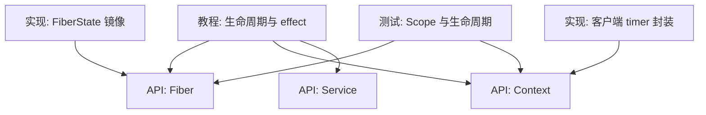
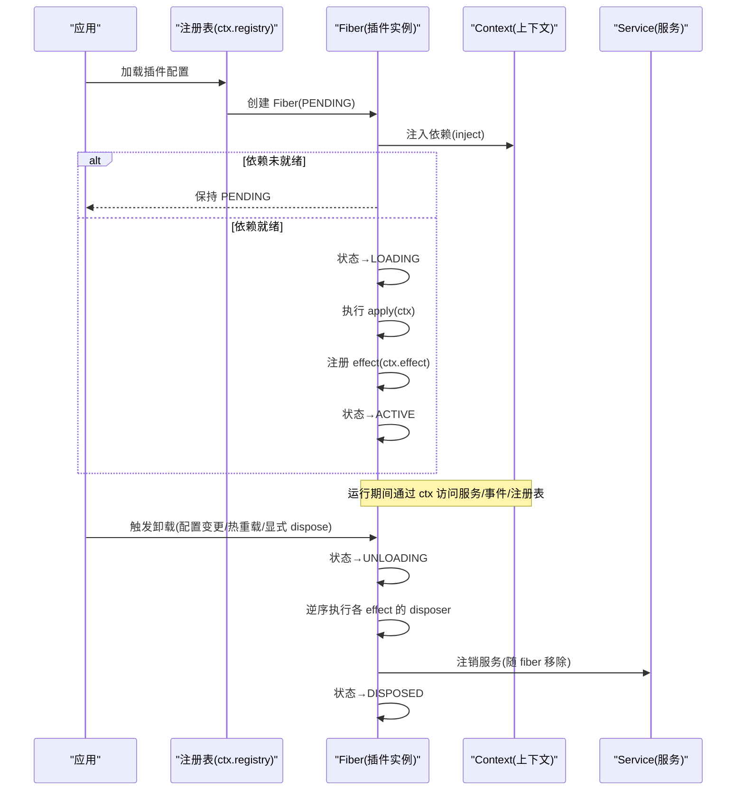
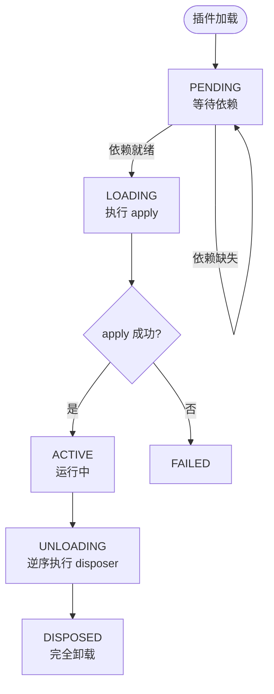
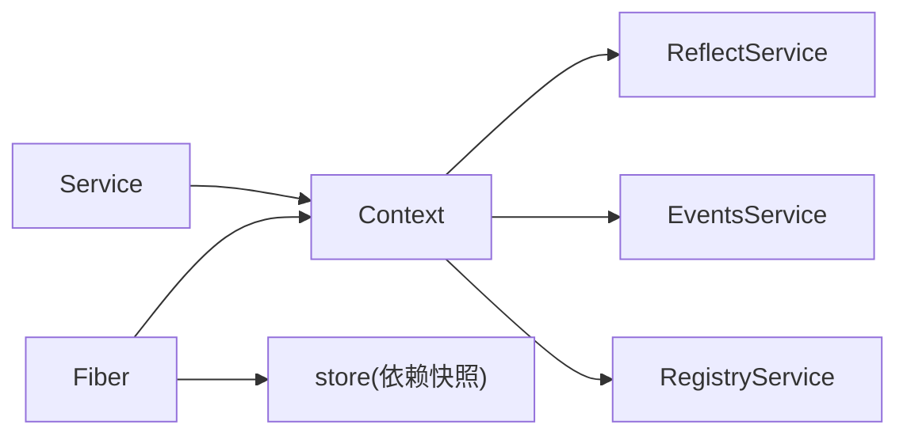

# 生命周期管理

<cite>
**本文引用的文件**
- [docs/cordis-tutorial/02-lifecycle-and-effects.md](file://docs/cordis-tutorial/02-lifecycle-and-effects.md)
- [docs/cordis-tutorial/02-lifecycle-and-effects.zh.md](file://docs/cordis-tutorial/02-lifecycle-and-effects.zh.md)
- [docs/cordis-tutorial/03-services.md](file://docs/cordis-tutorial/03-services.md)
- [docs/cordis-tutorial/04-events.md](file://docs/cordis-tutorial/04-events.md)
- [docs/cordis-api/fiber.md](file://docs/cordis-api/fiber.md)
- [docs/cordis-api/context.md](file://docs/cordis-api/context.md)
- [docs/cordis-api/service.md](file://docs/cordis-api/service.md)
- [packages/extensions/tool-cordis/src/fiber-state.ts](file://packages/extensions/tool-cordis/src/fiber-state.ts)
- [packages/extensions/cordis-client-runner/src/client/timer.ts](file://packages/extensions/cordis-client-runner/src/client/timer.ts)
- [packages/core/scope/tests/scope.spec.ts](file://packages/core/scope/tests/scope.spec.ts)
- [packages/extensions/tool-cordis/tests/cordis-lifecycle.spec.ts](file://packages/extensions/tool-cordis/tests/cordis-lifecycle.spec.ts)
</cite>

## 目录
1. [简介](#简介)
2. [项目结构](#项目结构)
3. [核心组件](#核心组件)
4. [架构总览](#架构总览)
5. [详细组件分析](#详细组件分析)
6. [依赖关系分析](#依赖关系分析)
7. [性能注意事项](#性能注意事项)
8. [故障排查指南](#故障排查指南)
9. [结论](#结论)
10. [附录：示例与最佳实践](#附录示例与最佳实践)

## 简介
本文件系统性说明 Cordis 中插件与服务的全生命周期，包括挂载、激活、卸载等阶段；深入解释 effect 机制与 ctx.effect() 的使用；文档化清理机制，确保在卸载时正确释放资源；并提供服务生命周期的最佳实践（资源管理、错误处理、调试技巧），以及覆盖初始化、运行中、销毁阶段的代码示例路径。

## 项目结构
围绕生命周期管理的知识主要分布在教程、API 参考与部分实现测试中：
- 教程：以“生命周期与 effect”“服务”“事件”为主线，给出从注册到清理的完整流程与示例。
- API 参考：Fiber、Context、Service 三篇文档定义了状态机、上下文能力与服务基类。
- 实现侧：FiberState 常量镜像、客户端定时器封装、Scope 与生命周期测试用例，体现异步清理、并发与顺序约束。

图表来源
- [docs/cordis-tutorial/02-lifecycle-and-effects.md:1-99](file://docs/cordis-tutorial/02-lifecycle-and-effects.md#L1-L99)
- [docs/cordis-api/fiber.md:1-376](file://docs/cordis-api/fiber.md#L1-L376)
- [docs/cordis-api/context.md:1-365](file://docs/cordis-api/context.md#L1-L365)
- [docs/cordis-api/service.md:1-103](file://docs/cordis-api/service.md#L1-L103)
- [packages/extensions/tool-cordis/src/fiber-state.ts:1-32](file://packages/extensions/tool-cordis/src/fiber-state.ts#L1-L32)
- [packages/extensions/cordis-client-runner/src/client/timer.ts:59-95](file://packages/extensions/cordis-client-runner/src/client/timer.ts#L59-L95)
- [packages/core/scope/tests/scope.spec.ts:37-72](file://packages/core/scope/tests/scope.spec.ts#L37-L72)

章节来源
- [docs/cordis-tutorial/02-lifecycle-and-effects.md:1-99](file://docs/cordis-tutorial/02-lifecycle-and-effects.md#L1-L99)
- [docs/cordis-api/fiber.md:1-376](file://docs/cordis-api/fiber.md#L1-L376)
- [docs/cordis-api/context.md:1-365](file://docs/cordis-api/context.md#L1-L365)
- [docs/cordis-api/service.md:1-103](file://docs/cordis-api/service.md#L1-L103)
- [packages/extensions/tool-cordis/src/fiber-state.ts:1-32](file://packages/extensions/tool-cordis/src/fiber-state.ts#L1-L32)
- [packages/extensions/cordis-client-runner/src/client/timer.ts:59-95](file://packages/extensions/cordis-client-runner/src/client/timer.ts#L59-L95)
- [packages/core/scope/tests/scope.spec.ts:37-72](file://packages/core/scope/tests/scope.spec.ts#L37-L72)

## 核心组件
- Fiber：每个加载的插件实例拥有独立的 Fiber，负责生命周期状态、已验证配置、已注册 effect 与清理。ctx.effect() 委托给当前 fiber。
- Context：插件运行的上下文代理，提供事件、反射、注册表、日志等服务访问，并支持扩展、隔离、拦截等子作用域。
- Service：基于名称的服务基类，构造即注册，随所属 fiber 自动移除。

关键要点
- Fiber 状态机：PENDING → LOADING → ACTIVE → UNLOADING → DISPOSED，异常路径可进入 FAILED。
- Effect：effect 体在加载时立即执行，返回的 disposer 会在卸载或显式调用时按逆序执行；多个异步 disposer 并发运行。
- 服务依赖：声明 inject 的插件等待所有必需服务就绪；若依赖消失，插件会被自动卸载并在恢复后重新加载。

章节来源
- [docs/cordis-api/fiber.md:1-376](file://docs/cordis-api/fiber.md#L1-L376)
- [docs/cordis-api/context.md:1-365](file://docs/cordis-api/context.md#L1-L365)
- [docs/cordis-api/service.md:1-103](file://docs/cordis-api/service.md#L1-L103)
- [docs/cordis-tutorial/03-services.md:1-99](file://docs/cordis-tutorial/03-services.md#L1-L99)

## 架构总览
下图展示插件加载、激活、卸载过程中 Fiber、Context、Service 的交互与数据流。

图表来源
- [docs/cordis-api/fiber.md:50-246](file://docs/cordis-api/fiber.md#L50-L246)
- [docs/cordis-api/context.md:14-96](file://docs/cordis-api/context.md#L14-L96)
- [docs/cordis-api/service.md:1-103](file://docs/cordis-api/service.md#L1-L103)
- [docs/cordis-tutorial/02-lifecycle-and-effects.md:68-94](file://docs/cordis-tutorial/02-lifecycle-and-effects.md#L68-L94)

## 详细组件分析

### Fiber 与生命周期状态机
- 状态定义与标签：FiberState 包含 PENDING、LOADING、ACTIVE、FAILED、UNLOADING、DISPOSED，并提供人类可读标签用于诊断。
- 生命周期方法：
  - dispose：卸载插件并等待清理完成。
  - restart：dispose 后立即用当前配置重新加载。
  - update：校验新配置并重启，先运行 internal/update 水线以便钩子/HMR 否决或替换重启。
  - await：等待当前生命周期工作完成并抛出启动错误。
- 效果系统：
  - effect(execute, label?)：注册清理感知 effect；execute 立即执行，返回的 disposer 在卸载或显式调用时按逆序执行；多次调用 disposer 为幂等；无效 shape 抛 TypeError；对已 disposed 的 fiber 注册抛 INACTIVE_EFFECT。
  - getEffects：返回当前注册的 effect 元信息树，便于诊断。

图表来源
- [docs/cordis-api/fiber.md:50-246](file://docs/cordis-api/fiber.md#L50-L246)
- [packages/extensions/tool-cordis/src/fiber-state.ts:1-32](file://packages/extensions/tool-cordis/src/fiber-state.ts#L1-L32)

章节来源
- [docs/cordis-api/fiber.md:50-246](file://docs/cordis-api/fiber.md#L50-L246)
- [packages/extensions/tool-cordis/src/fiber-state.ts:1-32](file://packages/extensions/tool-cordis/src/fiber-state.ts#L1-L32)

### Context 与 effect 注册
- Context 作为代理，将服务、事件、注册表等方法混入自身，简化使用。
- 常用能力：
  - extend/isolate/intercept：创建带元数据或隔离作用域的子上下文。
  - provide/get/set/accessor/mixin：服务注册、读取、重写、计算属性、成员转发。
  - events/logger/registry：事件总线、日志、插件注册表。
- effect 行为：
  - 内置注册（如 ctx.on、ctx.plugin、服务注册）本身即为 effect，卸载时自动撤销。
  - 自定义资源需在 ctx.effect 中获取并返回 disposer，确保卸载时释放。

章节来源
- [docs/cordis-api/context.md:14-96](file://docs/cordis-api/context.md#L14-L96)
- [docs/cordis-api/context.md:235-365](file://docs/cordis-api/context.md#L235-L365)
- [docs/cordis-tutorial/02-lifecycle-and-effects.md:84-94](file://docs/cordis-tutorial/02-lifecycle-and-effects.md#L84-L94)

### Service 与依赖驱动加载
- Service 基类：构造时通过 super(ctx, name) 立即注册，随 fiber 卸载自动移除。
- 依赖注入：
  - 通过 inject 声明硬依赖，Cordis 保证 apply 内依赖可用。
  - 依赖在服务运行时消失会触发依赖方卸载与重加载，避免持有过期引用。
- 可选依赖：使用 ctx.get('name') 探测是否存在，不阻塞加载。

章节来源
- [docs/cordis-api/service.md:1-103](file://docs/cordis-api/service.md#L1-L103)
- [docs/cordis-tutorial/03-services.md:1-99](file://docs/cordis-tutorial/03-services.md#L1-L99)

### 事件与自动清理
- 事件监听 ctx.on 是 effect，卸载时自动移除，无需手动解绑。
- 多种分发模式：emit、parallel、serial、bail、waterfall，适用于不同协作语义。
- Waterfall 可用于拦截与短路，注意观察型监听器必须调用 next()。

章节来源
- [docs/cordis-tutorial/04-events.md:1-145](file://docs/cordis-tutorial/04-events.md#L1-L145)

### 清理机制与异步 disposer 并发
- 清理顺序：disposer 按注册逆序启动；多个异步 disposer 并发运行。
- 如需严格顺序，应将步骤放在同一个 disposer 中依次 await。
- 测试覆盖：
  - 同步 disposer 单次执行与重复调用幂等。
  - 在 child 处于 PENDING/LOADING 时仍可注册 effect，并在卸载时正确清理。
  - 父 fiber 在内部事件回调中触发 dispose，能等待未发布子 fiber 的清理完成。

章节来源
- [docs/cordis-tutorial/02-lifecycle-and-effects.zh.md:84-99](file://docs/cordis-tutorial/02-lifecycle-and-effects.zh.md#L84-L99)
- [packages/core/scope/tests/scope.spec.ts:37-72](file://packages/core/scope/tests/scope.spec.ts#L37-L72)
- [packages/extensions/tool-cordis/tests/cordis-lifecycle.spec.ts:81-161](file://packages/extensions/tool-cordis/tests/cordis-lifecycle.spec.ts#L81-L161)

## 依赖关系分析
- 插件间通过服务名解耦，消费者仅依赖接口名而非具体实现，便于配置切换与热重载。
- Fiber 维护依赖快照 store，在加载期间保存所需服务实现，卸载后清空。
- Context 的 reflect 层支撑 ctx.get/provide/mixin 等能力，配合 isolate/intercept 实现细粒度作用域控制。

图表来源
- [docs/cordis-api/context.md:120-161](file://docs/cordis-api/context.md#L120-L161)
- [docs/cordis-api/fiber.md:113-122](file://docs/cordis-api/fiber.md#L113-L122)

章节来源
- [docs/cordis-api/context.md:120-161](file://docs/cordis-api/context.md#L120-L161)
- [docs/cordis-api/fiber.md:113-122](file://docs/cordis-api/fiber.md#L113-L122)

## 性能注意事项
- 避免在 effect 中创建长生命周期且未清理的资源；所有外部资源都应通过 ctx.effect 包装并返回 disposer。
- 谨慎使用全局定时器/连接/监听器，确保在 disposer 中取消/关闭。
- 大量异步 disposer 并发执行可能增加卸载时间；必要时合并为单一 disposer 串行清理。
- 依赖注入带来的重加载成本：频繁替换服务提供者会导致依赖方反复卸载/加载，应评估配置更新频率。

[本节为通用指导，不直接分析具体文件]

## 故障排查指南
- 插件无输出/无启动：检查是否处于 PENDING（缺少依赖）。可通过 fiber.state 与 fiber.inertia 判断当前过渡。
- 重复调用 disposer：框架保证幂等，不会重复清理；若出现异常，检查 effect 返回值形状是否正确。
- 在已 disposed 的 fiber 上注册 effect：会抛出 INACTIVE_EFFECT；应在 active 阶段注册。
- 卸载卡住：确认异步 disposer 是否 resolve；必要时在单个 disposer 中串行等待。
- 依赖丢失导致崩溃：确保消费方使用 ctx.get 或正确处理 undefined；或通过 inject 强制依赖存在。

章节来源
- [docs/cordis-api/fiber.md:146-193](file://docs/cordis-api/fiber.md#L146-L193)
- [packages/extensions/tool-cordis/tests/cordis-lifecycle.spec.ts:98-115](file://packages/extensions/tool-cordis/tests/cordis-lifecycle.spec.ts#L98-L115)
- [docs/cordis-tutorial/03-services.md:72-90](file://docs/cordis-tutorial/03-services.md#L72-L90)

## 结论
Cordis 的生命周期以 Fiber 为核心，通过 effect 机制统一管理资源与清理；Context 提供统一的上下文能力；Service 以名称化方式解耦插件依赖。遵循“所有外部资源都通过 ctx.effect 管理并返回 disposer”的原则，结合依赖驱动的加载与卸载，可实现稳定、可热重载、易调试的插件体系。

[本节为总结性内容，不直接分析具体文件]

## 附录：示例与最佳实践

### 示例：初始化、运行中、销毁阶段
- 初始化（挂载/激活）
  - 在 apply 中注册 effect，建立资源与监听。
  - 示例路径：[生命周期与 effect 教程:18-42](file://docs/cordis-tutorial/02-lifecycle-and-effects.md#L18-L42)
- 运行中
  - 通过 ctx 访问服务与事件；使用 inject 保证依赖可用。
  - 示例路径：[服务与依赖注入教程:44-78](file://docs/cordis-tutorial/03-services.md#L44-L78)
- 销毁（卸载）
  - 在 effect 的 disposer 中释放资源；确保异步清理完成。
  - 示例路径：[事件监听自动清理:72-79](file://docs/cordis-tutorial/04-events.md#L72-L79)

### 示例：客户端定时器封装
- 使用 ctx.effect 包装 setTimeout，并在卸载时清除定时器；Promise 版本在 finally 中释放。
- 示例路径：[客户端 timer 封装:59-95](file://packages/extensions/cordis-client-runner/src/client/timer.ts#L59-L95)

### 最佳实践清单
- 资源管理
  - 所有外部资源（定时器、连接、watcher）必须在 ctx.effect 中创建并返回 disposer。
  - 将相关清理步骤集中在一个 disposer 中以保证顺序。
- 错误处理
  - 捕获并记录 effect 中的异常；避免在卸载期间再次注册 effect。
  - 对可选依赖使用 ctx.get，避免不必要的失败。
- 调试技巧
  - 使用 fiber.state、fiber.name、fiber.getEffects() 定位问题。
  - 借助 internal/status 与 internal/plugin 事件观察状态变化。
- 服务生命周期
  - 通过 Service 基类提供命名服务，确保随 fiber 自动注销。
  - 使用 inject 声明强依赖，减少运行时空引用风险。

章节来源
- [docs/cordis-tutorial/02-lifecycle-and-effects.md:18-42](file://docs/cordis-tutorial/02-lifecycle-and-effects.md#L18-L42)
- [docs/cordis-tutorial/03-services.md:44-78](file://docs/cordis-tutorial/03-services.md#L44-L78)
- [docs/cordis-tutorial/04-events.md:72-79](file://docs/cordis-tutorial/04-events.md#L72-L79)
- [packages/extensions/cordis-client-runner/src/client/timer.ts:59-95](file://packages/extensions/cordis-client-runner/src/client/timer.ts#L59-L95)
- [docs/cordis-api/fiber.md:195-246](file://docs/cordis-api/fiber.md#L195-L246)