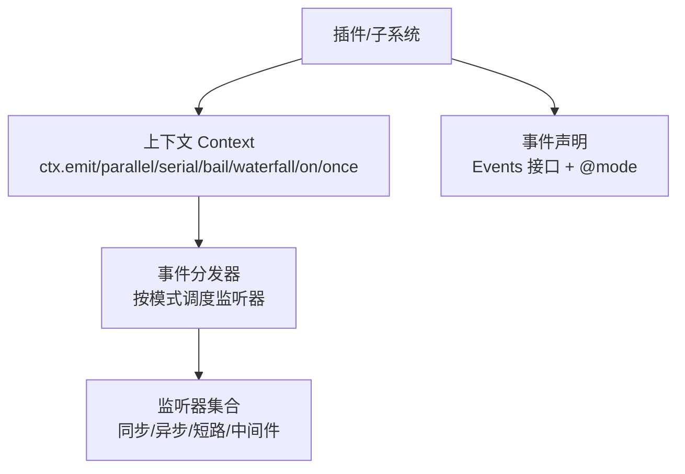
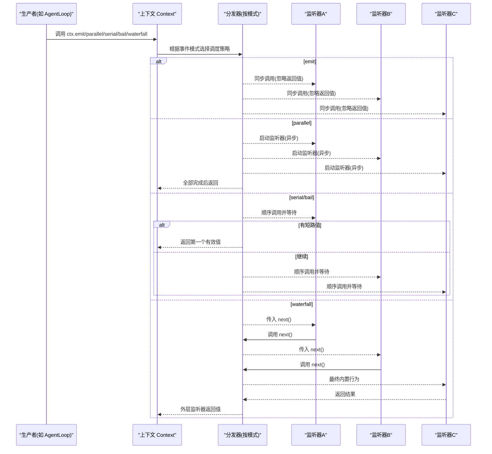
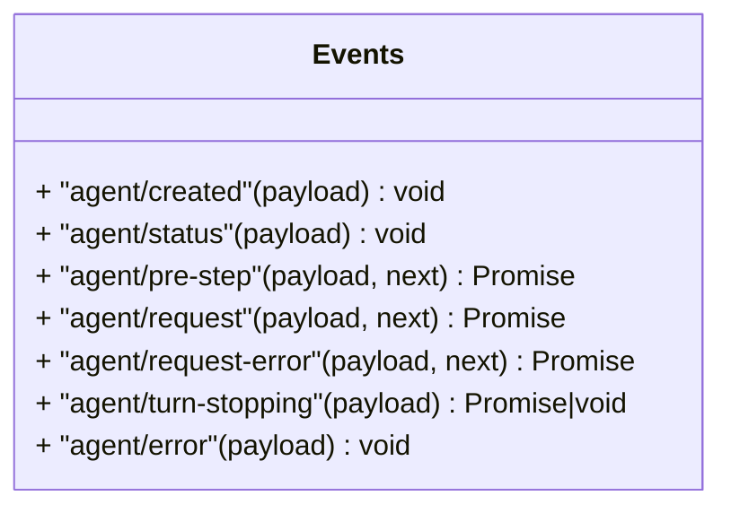
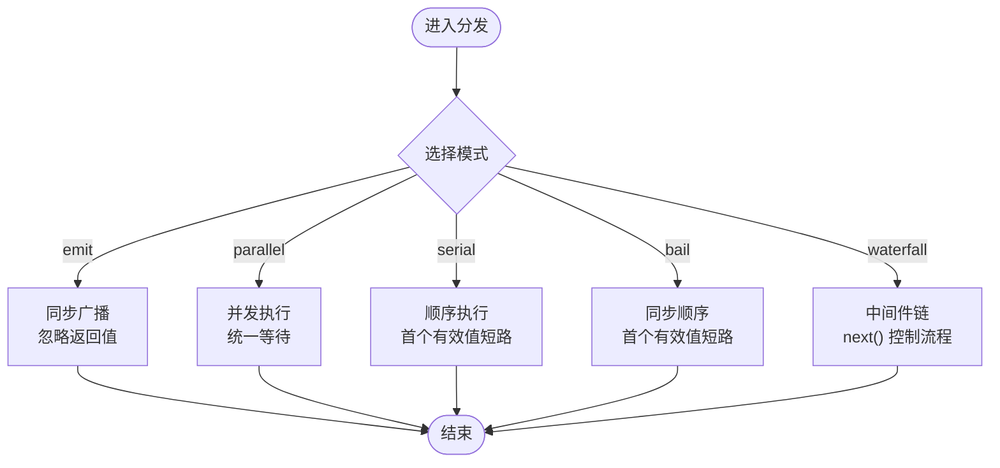
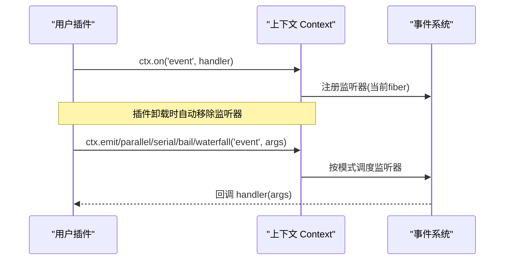
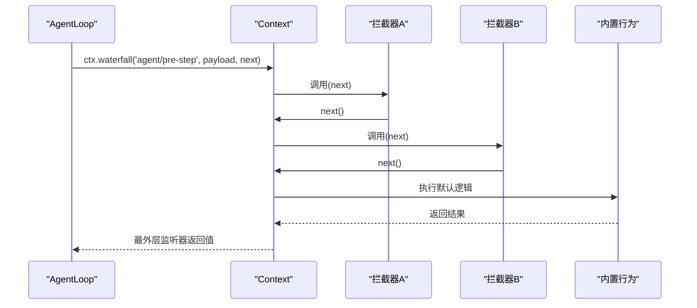
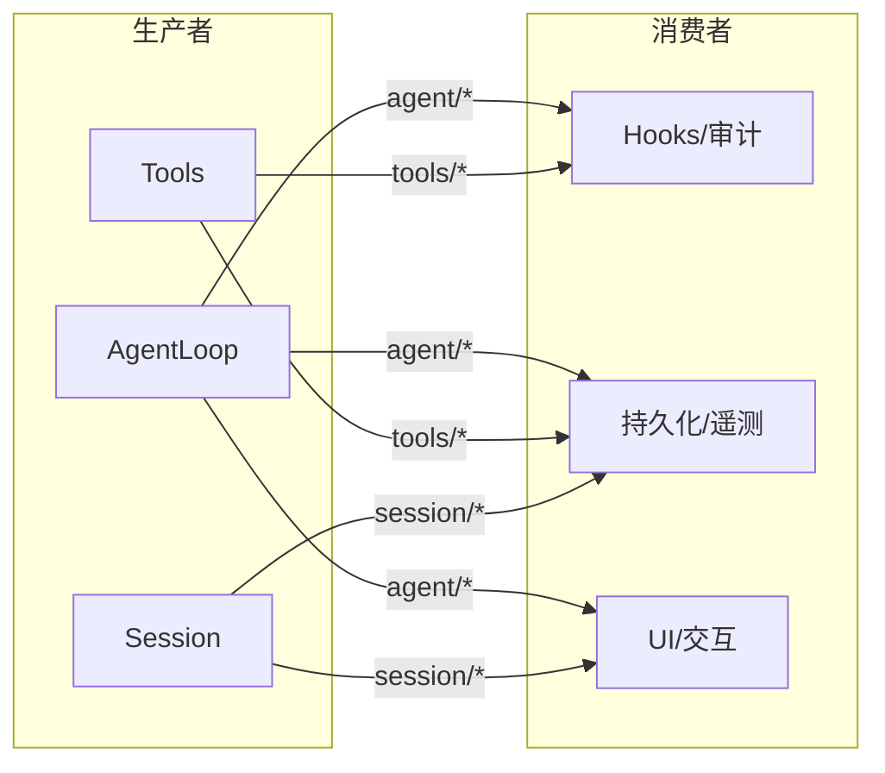
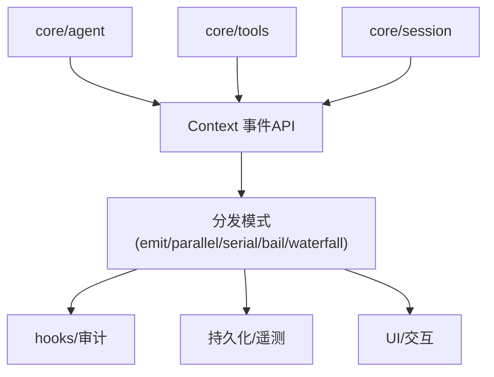

# 事件系统

<cite>
**本文引用的文件**
- [docs/cordis-api/events.md](file://docs/cordis-api/events.md)
- [docs/user/develop/framework/events.md](file://docs/user/develop/framework/events.md)
- [docs/event-producer-consumer.md](file://docs/event-producer-consumer.md)
- [packages/core/agent/src/runtime-types.ts](file://packages/core/agent/src/runtime-types.ts)
- [packages/core/agent/src/dispatch.ts](file://packages/core/agent/src/dispatch.ts)
</cite>

## 目录
1. [简介](#简介)
2. [项目结构](#项目结构)
3. [核心组件](#核心组件)
4. [架构总览](#架构总览)
5. [详细组件分析](#详细组件分析)
6. [依赖关系分析](#依赖关系分析)
7. [性能考量](#性能考量)
8. [故障排查指南](#故障排查指南)
9. [结论](#结论)
10. [附录](#附录)

## 简介
本文件系统性阐述 DeepSeek Harness 中的事件系统与生产者-消费者模式。重点包括：
- 事件的定义与类型安全（TypeScript 声明合并）
- 五种分发模式：emit、parallel、serial、bail、waterfall 的语义与适用场景
- 订阅与发布机制：监听器注册、触发与自动清理
- 事件管道与拦截器模式：预处理与后处理
- 最佳实践：自定义事件、处理器实现、错误处理

## 项目结构
事件系统由“事件声明 + 分发 API + 子系统使用”三部分构成：
- 事件声明：在各子系统的类型文件中通过 TypeScript 模块扩展声明 Events，并标注 @mode
- 分发 API：Context 混入 ctx.emit / ctx.parallel / ctx.serial / ctx.bail / ctx.waterfall / ctx.on / ctx.once
- 子系统使用：AgentLoop、Tools、Session 等子系统作为生产者或消费者参与事件流



图表来源
- [docs/cordis-api/events.md:8-123](file://docs/cordis-api/events.md#L8-L123)
- [docs/user/develop/framework/events.md:23-81](file://docs/user/develop/framework/events.md#L23-L81)

章节来源
- [docs/cordis-api/events.md:8-123](file://docs/cordis-api/events.md#L8-L123)
- [docs/user/develop/framework/events.md:23-81](file://docs/user/develop/framework/events.md#L23-L81)

## 核心组件
- 事件声明与类型安全
  - 通过 declare module '@deepseek-ai/cordis' 扩展 interface Events，为每个事件名绑定函数签名
  - 在 JSDoc 中用 @mode 标注分发模式，供文档生成与静态检查使用
- 上下文分发 API
  - emit：同步广播，忽略返回值
  - parallel：并发执行所有监听器，统一等待
  - serial：顺序执行，首个非空结果短路
  - bail：serial 的同步版本
  - waterfall：中间件式管道，最后一个参数为 next 延续
- 监听器管理
  - on/once：在当前 fiber 作用域内注册，插件卸载时自动移除

章节来源
- [docs/user/develop/framework/events.md:83-117](file://docs/user/develop/framework/events.md#L83-L117)
- [docs/cordis-api/events.md:8-123](file://docs/cordis-api/events.md#L8-L123)

## 架构总览
事件系统围绕“声明即契约、分发即策略”的原则构建。各子系统在类型层声明事件及模式，运行时通过 Context 的分发方法按策略调用监听器。Agent 循环是典型的生产者，将内部状态变化以事件形式广播；其他子系统作为消费者进行观测、拦截或增强。



图表来源
- [docs/cordis-api/events.md:8-123](file://docs/cordis-api/events.md#L8-L123)
- [docs/user/develop/framework/events.md:23-81](file://docs/user/develop/framework/events.md#L23-L81)

## 详细组件分析

### 事件声明与类型安全
- 使用 TypeScript 模块扩展在多处声明 Events，例如 Agent 相关事件在 runtime-types.ts 中集中定义，并通过 @mode 标注分发模式
- 类型安全体现在：
  - 事件名与参数类型由 Events 接口约束
  - 分发 API 的参数与返回值基于 Events 推导
  - 文档与工具链可据此生成参考页面



图表来源
- [packages/core/agent/src/runtime-types.ts:150-293](file://packages/core/agent/src/runtime-types.ts#L150-L293)

章节来源
- [packages/core/agent/src/runtime-types.ts:150-293](file://packages/core/agent/src/runtime-types.ts#L150-L293)
- [docs/user/develop/framework/events.md:83-117](file://docs/user/develop/framework/events.md#L83-L117)

### 分发模式详解
- emit（观察者模式）
  - 同步广播，不等待也不收集返回值
  - 适合通知型事件，如状态变更、日志上报
- parallel（并行模式）
  - 所有监听器并发执行，统一等待完成
  - 适合独立且无副作用的 I/O 操作聚合
- serial（串行模式）
  - 按注册顺序依次执行并等待，首个非空结果短路
  - 适合决策类事件，如审批、权限校验
- bail（同步短路）
  - serial 的同步版本，快速短路
- waterfall（中间件模式）
  - 每个监听器包裹下游，必须调用 next() 才能继续
  - 适合预处理/后处理、拦截与改写



图表来源
- [docs/cordis-api/events.md:8-123](file://docs/cordis-api/events.md#L8-L123)
- [docs/user/develop/framework/events.md:23-81](file://docs/user/develop/framework/events.md#L23-L81)

章节来源
- [docs/cordis-api/events.md:8-123](file://docs/cordis-api/events.md#L8-L123)
- [docs/user/develop/framework/events.md:23-81](file://docs/user/develop/framework/events.md#L23-L81)

### 订阅与发布机制
- 订阅
  - ctx.on(name, listener, options?)：在当前 fiber 下注册监听器，支持 prepend/global 选项
  - ctx.once(name, listener, options?)：仅触发一次后自动移除
- 发布
  - 通过 ctx.emit/parallel/serial/bail/waterfall 触发事件
- 清理
  - 监听器随插件卸载自动移除，无需手动 removeListener



图表来源
- [docs/cordis-api/events.md:125-171](file://docs/cordis-api/events.md#L125-L171)
- [docs/user/develop/framework/events.md:108-117](file://docs/user/develop/framework/events.md#L108-L117)

章节来源
- [docs/cordis-api/events.md:125-171](file://docs/cordis-api/events.md#L125-L171)
- [docs/user/develop/framework/events.md:108-117](file://docs/user/develop/framework/events.md#L108-L117)

### 事件管道与拦截器模式
- waterfall 提供中间件式管道：
  - 每个监听器接收 next()，调用则继续下游，不调用则短路
  - 可用于预处理（如注入上下文）、后处理（如记录指标）、拦截（如拒绝请求）
- Agent 循环大量使用 waterfall 作为扩展点：
  - agent/pre-step：在步骤开始前拦截或替换消息
  - agent/request：在模型请求前替换配置
  - agent/request-error：失败处理与重试策略



图表来源
- [packages/core/agent/src/runtime-types.ts:219-244](file://packages/core/agent/src/runtime-types.ts#L219-L244)
- [docs/cordis-api/events.md:97-123](file://docs/cordis-api/events.md#L97-L123)

章节来源
- [packages/core/agent/src/runtime-types.ts:219-244](file://packages/core/agent/src/runtime-types.ts#L219-L244)
- [docs/cordis-api/events.md:97-123](file://docs/cordis-api/events.md#L97-L123)

### 生产者-消费者矩阵与典型事件
- 事件矩阵展示了哪些包作为生产者（dispatchers）和消费者（listeners），以及事件的模式
- 典型事件示例：
  - agent/created、agent/status、agent/error：emit 通知
  - agent/pre-step、agent/request、agent/request-error：waterfall 拦截/增强
  - agent/turn-stopping：serial 决策
  - session/flush：parallel 批量持久化/遥测



图表来源
- [docs/event-producer-consumer.md:8-65](file://docs/event-producer-consumer.md#L8-L65)

章节来源
- [docs/event-producer-consumer.md:8-65](file://docs/event-producer-consumer.md#L8-L65)

### 代码级调用链：Agent 事件封装
- Agent 循环对事件分发进行了封装，确保过滤后的回调集被安全调用，并对异常进行隔离与日志记录
- 封装了 emit、serial、waterfall 三种调用路径，保证 agent 事件在作用域内的正确传播

```mermaid
sequenceDiagram
participant Loop as "AgentLoop"
participant Wrap as "事件封装"
participant Ctx as "Context.events.dispatch"
participant L as "监听器"
Loop->>Wrap : emit/serial/waterfall(name, payload)
Wrap->>Ctx : 获取过滤后的回调集合
alt emit
Ctx-->>L : 同步调用(捕获异常并记录)
else serial
Ctx-->>L : 顺序调用并等待(短路)
else waterfall
Ctx-->>L : 传入 next() 并组合链
end
```

图表来源
- [packages/core/agent/src/dispatch.ts:117-149](file://packages/core/agent/src/dispatch.ts#L117-L149)

章节来源
- [packages/core/agent/src/dispatch.ts:117-149](file://packages/core/agent/src/dispatch.ts#L117-L149)

## 依赖关系分析
- 耦合与内聚
  - 事件声明集中在子系统类型文件中，内聚度高
  - 分发 API 与模式解耦，便于扩展与维护
- 直接/间接依赖
  - 子系统通过 Context 暴露的事件 API 与事件系统交互
  - AgentLoop 既生产也消费事件，形成闭环
- 外部集成点
  - 通过 apiproxy、server 等对外暴露事件，供上层应用集成
- 循环依赖风险
  - 事件命名空间与模式约定降低了紧耦合，避免循环依赖



图表来源
- [docs/event-producer-consumer.md:8-65](file://docs/event-producer-consumer.md#L8-L65)
- [docs/cordis-api/events.md:8-123](file://docs/cordis-api/events.md#L8-L123)

章节来源
- [docs/event-producer-consumer.md:8-65](file://docs/event-producer-consumer.md#L8-L65)
- [docs/cordis-api/events.md:8-123](file://docs/cordis-api/events.md#L8-L123)

## 性能考量
- emit：同步广播，开销最小，适合高频通知
- parallel：并发执行，注意监听器间的资源竞争与错误聚合
- serial/bail：顺序执行，短路可减少不必要计算，但需关注长耗时监听器阻塞
- waterfall：中间件链可能引入额外调用栈，应谨慎设计 next() 调用路径
- 建议
  - 将重任务放入 parallel 或异步流水线
  - 对关键路径使用 serial/bail 做快速失败
  - 在 waterfall 中尽早短路无效分支

[本节为通用指导，不直接分析具体文件]

## 故障排查指南
- 常见问题
  - 监听器未触发：确认事件名与模式匹配，检查作用域过滤
  - 事件未短路：确认 serial/bail 的返回值是否为非空值
  - waterfall 未继续：确认是否调用了 next()
- 调试技巧
  - 在 waterfall 中打印 next() 调用轨迹
  - 对 emit 的异常进行日志记录（封装已捕获并记录）
  - 使用事件矩阵定位生产者与消费者

章节来源
- [packages/core/agent/src/dispatch.ts:117-149](file://packages/core/agent/src/dispatch.ts#L117-L149)
- [docs/event-producer-consumer.md:8-65](file://docs/event-producer-consumer.md#L8-L65)

## 结论
DeepSeek Harness 的事件系统以 TypeScript 声明合并保障类型安全，以五种分发模式覆盖通知、并发、决策与中间件场景。通过上下文 API 与自动清理机制，插件可以安全地订阅与发布事件。Agent 循环广泛使用 waterfall 作为扩展点，实现强大的预处理与后处理能力。遵循模式约定与最佳实践，可在复杂系统中保持松耦合与高可维护性。

[本节为总结，不直接分析具体文件]

## 附录
- 最佳实践清单
  - 在 Events 中明确声明事件签名与 @mode
  - 选择合适的分发模式：通知用 emit，聚合用 parallel，决策用 serial/bail，管道用 waterfall
  - 在 waterfall 中始终调用 next()，除非有意拦截
  - 对长耗时监听器使用异步与并发策略
  - 利用事件矩阵定位问题与优化路径

[本节为补充信息，不直接分析具体文件]