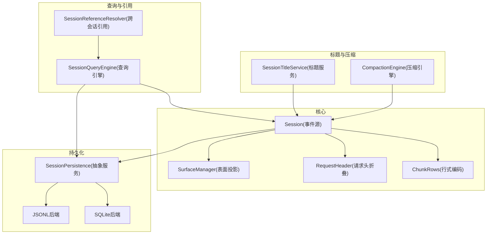
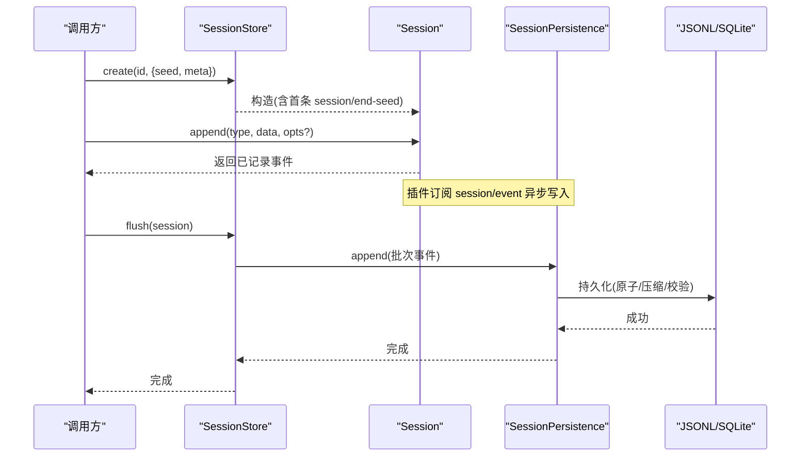
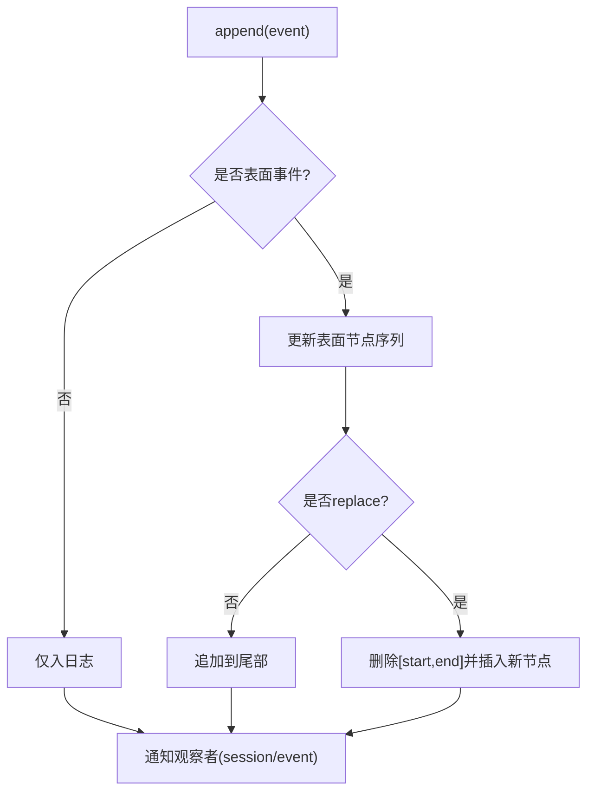
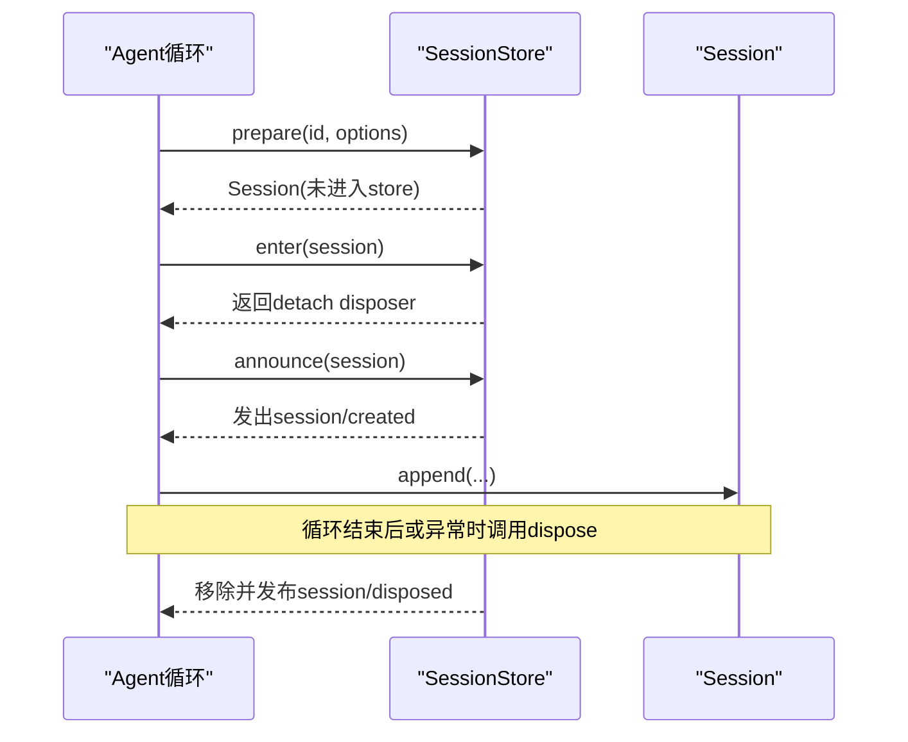
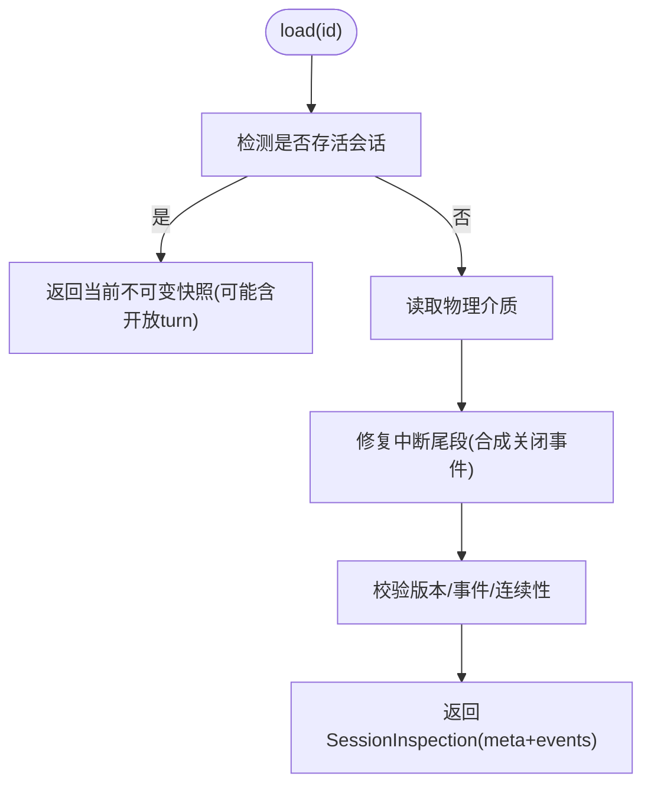
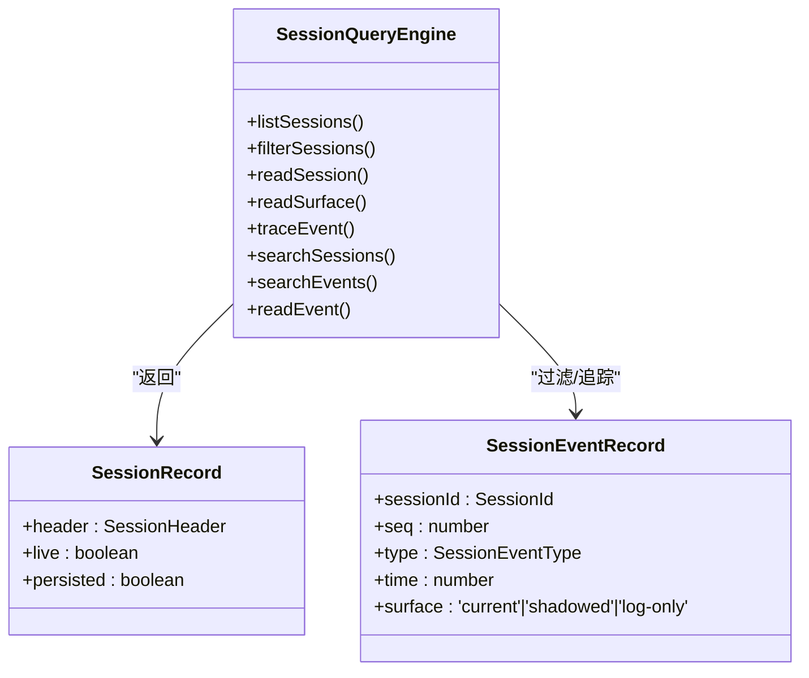
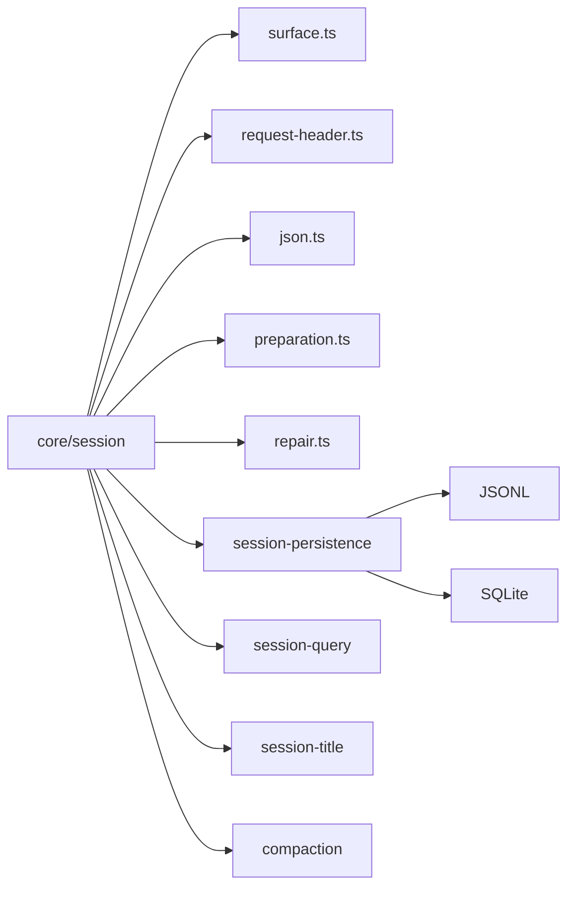

# 会话管理

<cite>
**本文引用的文件**
- [packages/core/session/src/index.ts](file://packages/core/session/src/index.ts)
- [packages/core/session/src/types.ts](file://packages/core/session/src/types.ts)
- [packages/core/session/src/surface.ts](file://packages/core/session/src/surface.ts)
- [packages/core/session/src/request-header.ts](file://packages/core/session/src/request-header.ts)
- [packages/core/session/src/chunk-rows.ts](file://packages/core/session/src/chunk-rows.ts)
- [packages/core/session/src/preparation.ts](file://packages/core/session/src/preparation.ts)
- [packages/core/session/src/repair.ts](file://packages/core/session/src/repair.ts)
- [packages/core/session/src/json.ts](file://packages/core/session/src/json.ts)
- [packages/core/session/src/known-event-types.ts](file://packages/core/session/src/known-event-types.ts)
- [packages/session/session-persistence/src/index.ts](file://packages/session/session-persistence/src/index.ts)
- [packages/session-query/session-query/src/index.ts](file://packages/session-query/session-query/src/index.ts)
- [packages/context/session-reference/src/index.ts](file://packages/context/session-reference/src/index.ts)
- [docs/subsystems/session.md](file://docs/subsystems/session.md)
- [docs/subsystems/persistence.md](file://docs/subsystems/persistence.md)
- [docs/subsystems/session-query.md](file://docs/subsystems/session-query.md)
- [docs/subsystems/session-reference.md](file://docs/subsystems/session-reference.md)
- [docs/subsystems/session-title.md](file://docs/subsystems/session-title.md)
- [docs/subsystems/compaction.md](file://docs/subsystems/compaction.md)
- [docs/subsystems/storage.md](file://docs/subsystems/storage.md)
</cite>

## 目录
1. [简介](#简介)
2. [项目结构](#项目结构)
3. [核心组件](#核心组件)
4. [架构总览](#架构总览)
5. [详细组件分析](#详细组件分析)
6. [依赖关系分析](#依赖关系分析)
7. [性能考量](#性能考量)
8. [故障排查指南](#故障排查指南)
9. [结论](#结论)
10. [附录：最佳实践与示例路径](#附录最佳实践与示例路径)

## 简介
本文件系统化阐述会话（Session）在系统中的概念、职责与实现。会话是以事件为源的追加日志，作为 Agent 交互历史的唯一事实来源；LLM 消息历史由该日志派生，而非单独存储。文档覆盖会话的创建、维护、销毁、持久化与恢复机制；说明会话与 Agent 的关系及多 Agent 实例管理；解释 JSONL 等存储格式、元数据管理与查询接口；并给出生命周期管理（自动清理、超时、资源回收）与操作最佳实践。

## 项目结构
围绕会话的核心代码位于 packages/core/session，配合 persistence、session-query、session-title、compaction 等子系统形成完整能力。

图表来源
- [packages/core/session/src/index.ts:1-200](file://packages/core/session/src/index.ts#L1-L200)
- [packages/core/session/src/surface.ts](file://packages/core/session/src/surface.ts)
- [packages/core/session/src/request-header.ts](file://packages/core/session/src/request-header.ts)
- [packages/core/session/src/chunk-rows.ts](file://packages/core/session/src/chunk-rows.ts)
- [packages/session/session-persistence/src/index.ts:246-380](file://packages/session/session-persistence/src/index.ts#L246-L380)
- [packages/session-query/session-query/src/index.ts:367-490](file://packages/session-query/session-query/src/index.ts#L367-L490)
- [packages/context/session-reference/src/index.ts:77-103](file://packages/context/session-reference/src/index.ts#L77-L103)
- [docs/subsystems/session.md:1-120](file://docs/subsystems/session.md#L1-L120)
- [docs/subsystems/persistence.md:1-45](file://docs/subsystems/persistence.md#L1-L45)

章节来源
- [packages/core/session/src/index.ts:1-200](file://packages/core/session/src/index.ts#L1-L200)
- [docs/subsystems/session.md:1-120](file://docs/subsystems/session.md#L1-L120)
- [docs/subsystems/persistence.md:1-45](file://docs/subsystems/persistence.md#L1-L45)

## 核心组件
- Session：追加型事件日志，提供 append、deriveMessages、surface、requestHeader、requestContext 等能力。
- SurfaceManager：维护“模型可见”的消息序列，支持追加与替换（用于压缩）。
- RequestHeader 折叠：维护 EpochHeader 与 RequestContext，保证每次请求可重建。
- ChunkRows：将流式 chunk 打包为紧凑的行式存储，提升持久化效率。
- SessionStore：内存会话仓库，负责 create/prepare/enter/announce/fork/list/get/flush。
- SessionPersistence：持久化抽象，定义 locate/create/append/prepare/load/inspect/readFrom/list/listSnapshots。
- SessionQueryEngine：跨会话查询、全文检索、事件关系追踪、窗口读取。
- SessionTitleService：会话标题生成与持久化。
- CompactionEngine：会话历史压缩，通过 surface replace 合并旧节点。

章节来源
- [packages/core/session/src/index.ts:1-200](file://packages/core/session/src/index.ts#L1-L200)
- [packages/core/session/src/surface.ts](file://packages/core/session/src/surface.ts)
- [packages/core/session/src/request-header.ts](file://packages/core/session/src/request-header.ts)
- [packages/core/session/src/chunk-rows.ts](file://packages/core/session/src/chunk-rows.ts)
- [packages/session/session-persistence/src/index.ts:246-380](file://packages/session/session-persistence/src/index.ts#L246-L380)
- [packages/session-query/session-query/src/index.ts:367-490](file://packages/session-query/session-query/src/index.ts#L367-L490)
- [docs/subsystems/session.md:359-519](file://docs/subsystems/session.md#L359-L519)
- [docs/subsystems/persistence.md:231-237](file://docs/subsystems/persistence.md#L231-L237)

## 架构总览
会话以事件为核心，所有状态均可从事件重放得到。持久化层对事件进行无损落盘；查询层提供逻辑视图与全文检索；标题与压缩作为可选能力扩展会话能力面。

图表来源
- [packages/core/session/src/index.ts:617-745](file://packages/core/session/src/index.ts#L617-L745)
- [packages/session/session-persistence/src/index.ts:288-323](file://packages/session/session-persistence/src/index.ts#L288-L323)
- [docs/subsystems/persistence.md:9-19](file://docs/subsystems/persistence.md#L9-L19)

章节来源
- [packages/core/session/src/index.ts:617-745](file://packages/core/session/src/index.ts#L617-L745)
- [docs/subsystems/persistence.md:9-19](file://docs/subsystems/persistence.md#L9-L19)

## 详细组件分析

### 会话事件模型与表面投影
- 事件类型：turn/start、turn/end、step/start、step/end、user/message、assistant/chunk、assistant/message、tool/call、tool/result、todo/write、request/header、request/context、session/end-seed 等。
- 表面投影：仅 user/message、assistant/message、tool/result 进入模型可见序列；assistant/chunk 仅用于回放/UI。
- 替换机制：compaction 通过 surfaceOp replace 将一段历史替换为摘要节点。

图表来源
- [docs/subsystems/session.md:251-357](file://docs/subsystems/session.md#L251-L357)
- [docs/subsystems/compaction.md:9-23](file://docs/subsystems/compaction.md#L9-L23)

章节来源
- [docs/subsystems/session.md:9-127](file://docs/subsystems/session.md#L9-L127)
- [docs/subsystems/session.md:251-357](file://docs/subsystems/session.md#L251-L357)
- [docs/subsystems/compaction.md:9-23](file://docs/subsystems/compaction.md#L9-L23)

### 会话创建、维护与销毁
- 创建：SessionStore.create/prepare + enter + announce；首次写入 session/end-seed 标记种子边界。
- 维护：append 同步入内存日志，持久化插件异步批处理；flush 作为有序检查点。
- 销毁：store 移除与会话关联的发布钩子；dispose 触发 session/disposed。
- 分叉：fork(source, boundary?, childId?) 基于稳定前缀创建子会话，保持 lineage。

图表来源
- [packages/core/session/src/index.ts:617-745](file://packages/core/session/src/index.ts#L617-L745)
- [docs/subsystems/session.md:532-539](file://docs/subsystems/session.md#L532-L539)

章节来源
- [packages/core/session/src/index.ts:617-745](file://packages/core/session/src/index.ts#L617-L745)
- [docs/subsystems/session.md:532-539](file://docs/subsystems/session.md#L532-L539)

### 持久化与恢复
- 契约：事件必须无损、seq 连续、data JSON 可序列化；chunk 不可丢弃。
- 崩溃恢复：冷加载发现未闭合 turn 时，合成 turn/end{kind:'interrupted'}，不截断历史。
- 准备与恢复：prepare/inspect/load 提供不可变逻辑视图；readFrom 支持按 seq 增量消费。
- 后端：JSONL（每会话独立文件，压缩帧）、SQLite（单库多行，字段与事件一一对应）。

图表来源
- [docs/subsystems/persistence.md:13-19](file://docs/subsystems/persistence.md#L13-L19)
- [docs/subsystems/persistence.md:231-237](file://docs/subsystems/persistence.md#L231-L237)
- [packages/session/session-persistence/src/index.ts:310-360](file://packages/session/session-persistence/src/index.ts#L310-L360)

章节来源
- [docs/subsystems/persistence.md:13-19](file://docs/subsystems/persistence.md#L13-L19)
- [docs/subsystems/persistence.md:231-237](file://docs/subsystems/persistence.md#L231-L237)
- [packages/session/session-persistence/src/index.ts:310-360](file://packages/session/session-persistence/src/index.ts#L310-L360)

### 会话与 Agent 的关系
- 一个会话承载一次 Agent 执行上下文的历史；Agent 循环在 turn/step 边界内工作。
- 多 Agent 实例可通过 fork 共享父会话的前缀，形成父子 lineage；每个实例拥有独立 Session 对象。
- 标题、压缩、引用等能力以 Session 为中心扩展，不侵入核心循环。

章节来源
- [docs/subsystems/session.md:577-599](file://docs/subsystems/session.md#L577-L599)
- [docs/subsystems/session.md:532-539](file://docs/subsystems/session.md#L532-L539)

### 数据存储结构与查询接口
- 存储结构：事件日志（JSONL/SQLite），元数据（SessionHeader 独立于日志），可选原始工件（readRaw）。
- 查询接口：listSessions、filterSessions、readSession、readSurface、traceEvent、searchSessions/searchEvents、readEvent 窗口读取。
- 语义文本：消息、工具结果、待办、失败/状态详情参与搜索；结构事件与流块不参与。

图表来源
- [docs/subsystems/session-query.md:9-101](file://docs/subsystems/session-query.md#L9-L101)
- [docs/subsystems/session-query.md:103-218](file://docs/subsystems/session-query.md#L103-L218)
- [packages/session-query/session-query/src/index.ts:367-490](file://packages/session-query/session-query/src/index.ts#L367-L490)

章节来源
- [docs/subsystems/session-query.md:9-101](file://docs/subsystems/session-query.md#L9-L101)
- [docs/subsystems/session-query.md:103-218](file://docs/subsystems/session-query.md#L103-L218)
- [packages/session-query/session-query/src/index.ts:367-490](file://packages/session-query/session-query/src/index.ts#L367-L490)

### 会话标题与压缩
- 标题：SessionTitleService 支持用户重命名、自动提供者生成、回退策略；标题事件持久化并可追溯来源。
- 压缩：CompactionEngine 通过 compaction/* 事件与 surface replace 将历史片段替换为摘要，减少上下文占用。

章节来源
- [docs/subsystems/session-title.md:9-63](file://docs/subsystems/session-title.md#L9-L63)
- [docs/subsystems/session-title.md:148-205](file://docs/subsystems/session-title.md#L148-L205)
- [docs/subsystems/compaction.md:9-89](file://docs/subsystems/compaction.md#L9-L89)

## 依赖关系分析
- Session 依赖 SurfaceManager、RequestHeader 折叠、JSON 快照与冻结。
- SessionStore 暴露 create/prepare/enter/announce/fork/list/get/flush，驱动生命周期。
- Persistence 抽象解耦 JSONL/SQLite 后端，提供 load/inspect/readFrom 等能力。
- Query 引擎组合 live-preferred 逻辑视图，屏蔽后端差异。
- Title/Compaction 作为可选能力，通过事件与 surface 协议与 Session 协作。

图表来源
- [packages/core/session/src/index.ts:1-35](file://packages/core/session/src/index.ts#L1-L35)
- [packages/session/session-persistence/src/index.ts:246-380](file://packages/session/session-persistence/src/index.ts#L246-L380)
- [packages/session-query/session-query/src/index.ts:367-490](file://packages/session-query/session-query/src/index.ts#L367-L490)

章节来源
- [packages/core/session/src/index.ts:1-35](file://packages/core/session/src/index.ts#L1-L35)
- [packages/session/session-persistence/src/index.ts:246-380](file://packages/session/session-persistence/src/index.ts#L246-L380)
- [packages/session-query/session-query/src/index.ts:367-490](file://packages/session-query/session-query/src/index.ts#L367-L490)

## 性能考量
- 追加路径零阻塞 I/O：append 同步入内存，持久化插件异步批处理，flush 作为检查点。
- 流式 chunk 行式编码：减少存储体积，提高吞吐。
- 表面投影缓存：deriveMessages 对每个表面节点只投影一次，replace 时重建。
- 查询优化：session-query 使用 provider 无关过滤器与全文索引，分页游标避免全量扫描。
- 压缩：按需压缩历史，降低上下文大小与成本。

章节来源
- [docs/subsystems/persistence.md:9-12](file://docs/subsystems/persistence.md#L9-L12)
- [packages/core/session/src/chunk-rows.ts](file://packages/core/session/src/chunk-rows.ts)
- [docs/subsystems/session.md:521-531](file://docs/subsystems/session.md#L521-L531)
- [docs/subsystems/session-query.md:143-218](file://docs/subsystems/session-query.md#L143-L218)
- [docs/subsystems/compaction.md:60-89](file://docs/subsystems/compaction.md#L60-L89)

## 故障排查指南
- 版本拒绝：后端遇到未知/更高版本会拒绝打开，提示升级方向或无升级路径。
- 损坏与不一致：load 会拒绝损坏前缀；inspection 在内存中平衡 open turn 但不修改物理尾。
- 崩溃恢复：冷加载合成 interrupted 结束事件，确保 turn/step/tool 成对闭合。
- 查询错误：session-query 提供稳定错误码分类（无效配置、缺失目标、索引失败、取消等）。
- 标题/压缩失败：title/compaction 失败会记录日志与事件，不影响正常会话继续。

章节来源
- [docs/subsystems/persistence.md:92-99](file://docs/subsystems/persistence.md#L92-L99)
- [docs/subsystems/persistence.md:13-19](file://docs/subsystems/persistence.md#L13-L19)
- [docs/subsystems/session-query.md:333-357](file://docs/subsystems/session-query.md#L333-L357)
- [docs/subsystems/compaction.md:71-89](file://docs/subsystems/compaction.md#L71-L89)

## 结论
会话以事件为单一事实来源，结合持久化、查询、标题与压缩等能力，构建了可扩展、可恢复、可观测的 Agent 交互基座。通过清晰的 API 与契约，系统实现了高可靠的事件追加、无损恢复、高效查询与灵活扩展。

## 附录：最佳实践与示例路径
- 会话创建
  - 使用 SessionStore.prepare + enter + announce 构建受控生命周期，确保最终释放。
  - 参考路径：[packages/core/session/src/index.ts:617-745](file://packages/core/session/src/index.ts#L617-L745)
- 发送消息
  - 通过 Session.append 追加 user/message、assistant/message、tool/result 等事件，注意 surfaceOp 与 sourceEventSeqs。
  - 参考路径：[docs/subsystems/session.md:359-519](file://docs/subsystems/session.md#L359-L519)
- 状态查询
  - 使用 ctx.sessionQuery.listSessions/filterSessions/readSurface/traceEvent 获取会话与事件信息。
  - 参考路径：[packages/session-query/session-query/src/index.ts:367-490](file://packages/session-query/session-query/src/index.ts#L367-L490)
- 历史回放
  - 通过 readSession 获取完整事件日志，或使用 readEvent 窗口读取局部上下文。
  - 参考路径：[docs/subsystems/session-query.md:259-291](file://docs/subsystems/session-query.md#L259-L291)
- 持久化与恢复
  - 使用 SessionPersistence.load/inspect/prepare 进行冷/热恢复，关注 interrupted 恢复与版本拒绝。
  - 参考路径：[docs/subsystems/persistence.md:13-19](file://docs/subsystems/persistence.md#L13-L19)
- 会话标题
  - 通过 SessionTitleService.rename/refresh 控制标题来源与刷新策略。
  - 参考路径：[docs/subsystems/session-title.md:148-205](file://docs/subsystems/session-title.md#L148-L205)
- 历史压缩
  - 使用 CompactionEngine.compactIfNeeded/compactNow/compactRegion 压缩历史，注意 tool 调用配对约束。
  - 参考路径：[docs/subsystems/compaction.md:60-89](file://docs/subsystems/compaction.md#L60-L89)
- 跨会话引用
  - 使用 SessionReferenceResolver.listCandidates/prepare 安全地聚合被引用会话上下文。
  - 参考路径：[packages/context/session-reference/src/index.ts:77-103](file://packages/context/session-reference/src/index.ts#L77-L103)