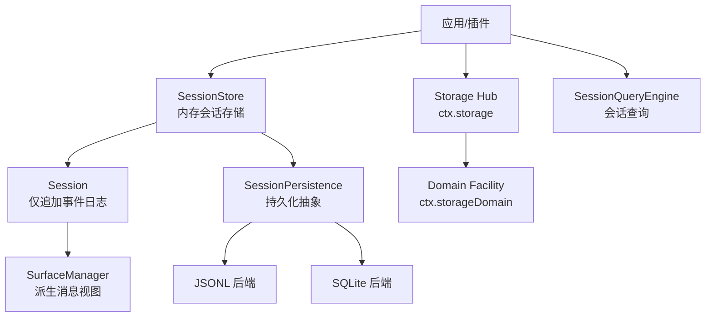
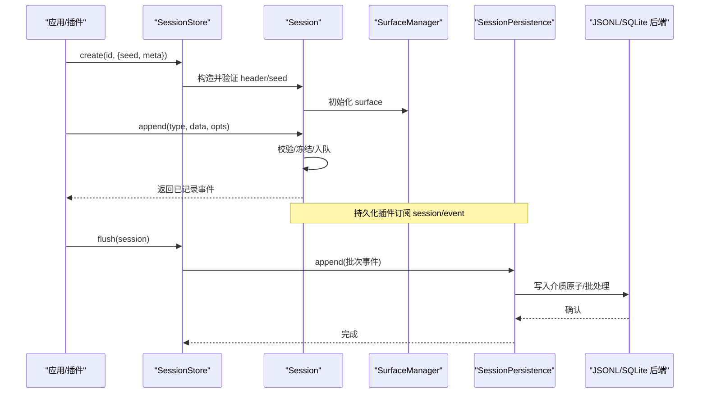
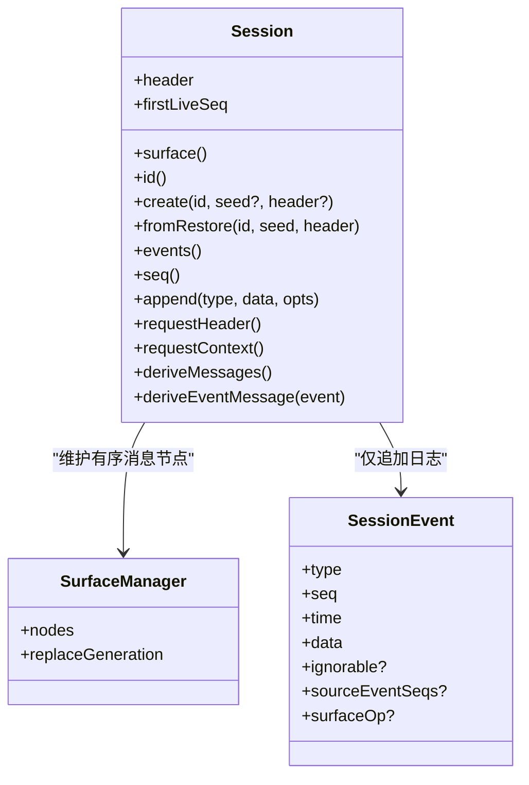
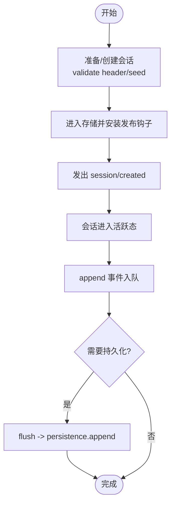
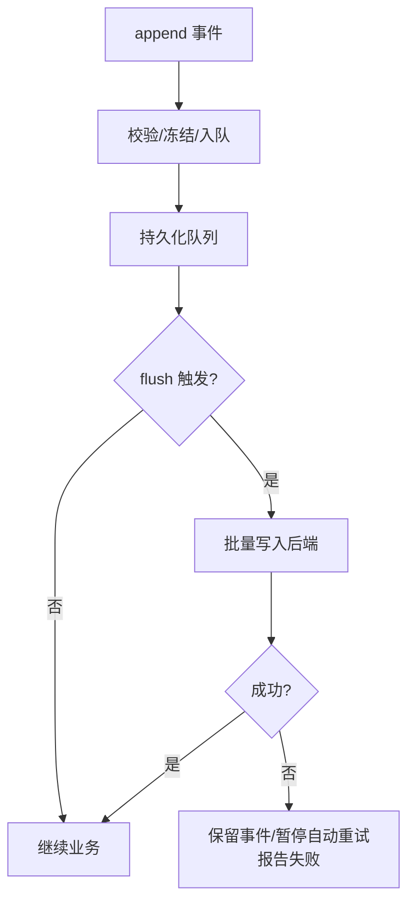
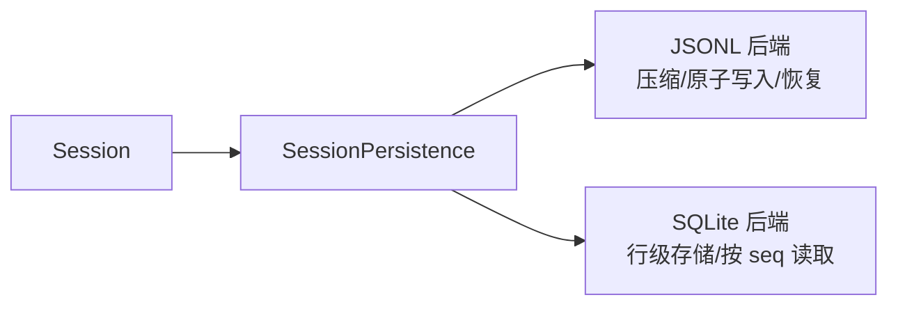
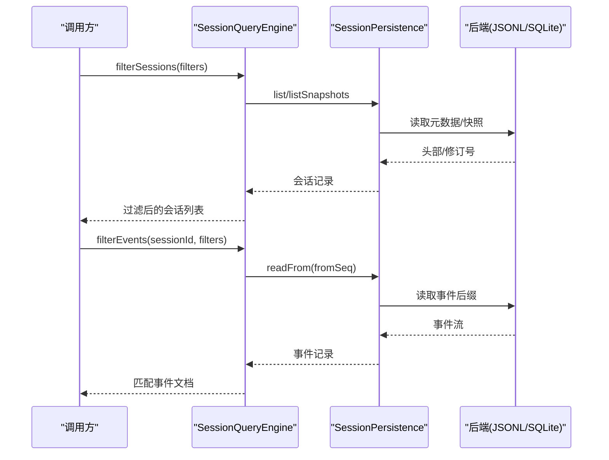
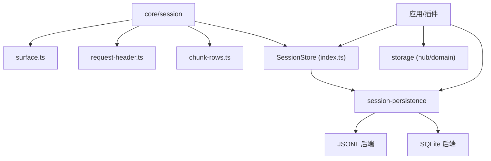

# 会话管理

<cite>
**本文引用的文件**
- [packages/core/session/src/types.ts](file://packages/core/session/src/types.ts)
- [packages/core/session/src/index.ts](file://packages/core/session/src/index.ts)
- [packages/core/session/src/surface.ts](file://packages/core/session/src/surface.ts)
- [packages/core/session/src/request-header.ts](file://packages/core/session/src/request-header.ts)
- [packages/core/session/src/chunk-rows.ts](file://packages/core/session/src/chunk-rows.ts)
- [packages/session/session-persistence/src/index.ts](file://packages/session/session-persistence/src/index.ts)
- [packages/session/session-persistence-jsonl/src/index.ts](file://packages/session/session-persistence-jsonl/src/index.ts)
- [packages/session/session-persistence-sqlite/src/index.ts](file://packages/session/session-persistence-sqlite/src/index.ts)
- [packages/storage/storage/src/backend.ts](file://packages/storage/storage/src/backend.ts)
- [packages/storage/storage-domain/src/spec.ts](file://packages/storage/storage-domain/src/spec.ts)
- [packages/storage/storage-domain/src/events.ts](file://packages/storage/storage-domain/src/events.ts)
- [docs/subsystems/session.md](file://docs/subsystems/session.md)
- [docs/subsystems/persistence.md](file://docs/subsystems/persistence.md)
- [docs/subsystems/session-query.md](file://docs/subsystems/session-query.md)
- [docs/subsystems/storage.md](file://docs/subsystems/storage.md)
</cite>

## 目录
1. [简介](#简介)
2. [项目结构](#项目结构)
3. [核心组件](#核心组件)
4. [架构总览](#架构总览)
5. [详细组件分析](#详细组件分析)
6. [依赖关系分析](#依赖关系分析)
7. [性能考量](#性能考量)
8. [故障排查指南](#故障排查指南)
9. [结论](#结论)
10. [附录](#附录)

## 简介
本文件系统性阐述“会话管理”的概念、作用域与生命周期，覆盖会话的创建、配置与初始化；状态管理与并发控制；持久化策略（含 SQLite 存储结构与数据压缩/备份恢复）；查询与检索能力（历史消息查找、上下文提取、性能优化）。文档同时为初学者提供概念性解释，并为高级用户提供存储引擎选择与性能调优建议。

## 项目结构
围绕会话管理的代码与文档主要分布在以下位置：
- 内存会话模型与事件日志：core/session
- 持久化抽象与后端：session-persistence（JSONL、SQLite）
- 通用存储子系统（KV 领域）：storage
- 会话查询服务：session-query
- 子系统文档：docs/subsystems/*

图表来源
- [packages/core/session/src/index.ts:1-120](file://packages/core/session/src/index.ts#L1-L120)
- [packages/core/session/src/surface.ts](file://packages/core/session/src/surface.ts)
- [packages/session/session-persistence/src/index.ts:248-380](file://packages/session/session-persistence/src/index.ts#L248-L380)
- [packages/storage/storage/src/backend.ts:26-48](file://packages/storage/storage/src/backend.ts#L26-L48)
- [docs/subsystems/session.md:1-120](file://docs/subsystems/session.md#L1-L120)
- [docs/subsystems/persistence.md:1-40](file://docs/subsystems/persistence.md#L1-L40)
- [docs/subsystems/storage.md:1-48](file://docs/subsystems/storage.md#L1-L48)

章节来源
- [packages/core/session/src/index.ts:1-120](file://packages/core/session/src/index.ts#L1-L120)
- [docs/subsystems/session.md:1-120](file://docs/subsystems/session.md#L1-L120)
- [docs/subsystems/persistence.md:1-40](file://docs/subsystems/persistence.md#L1-L40)
- [docs/subsystems/storage.md:1-48](file://docs/subsystems/storage.md#L1-L48)

## 核心组件
- Session（会话）：以仅追加事件日志为核心，所有 LLM 消息历史由日志派生，保证可回放与一致性。
- Surface（表面投影）：维护有序的消息节点序列，支持追加与替换，用于构建模型可见的历史。
- SessionStore（会话存储）：内存中的会话集合，负责创建、进入、列举、fork、flush 等。
- SessionPersistence（持久化抽象）：定义 locate/create/append/prepare/load/inspect/readFrom/list/listSnapshots 等能力，解耦具体介质。
- JSONL/SQLite 后端：两种可互换的持久化实现，分别以文件与数据库形式落盘。
- Storage（通用存储）：面向非会话日志数据的 KV 领域存储，提供 hub 与 domain facility。
- SessionQuery（会话查询）：跨语料库的查询、过滤、全文检索、血缘追踪与窗口读取。

章节来源
- [packages/core/session/src/types.ts:21-194](file://packages/core/session/src/types.ts#L21-L194)
- [packages/core/session/src/index.ts:1-120](file://packages/core/session/src/index.ts#L1-L120)
- [packages/session/session-persistence/src/index.ts:248-380](file://packages/session/session-persistence/src/index.ts#L248-L380)
- [docs/subsystems/session.md:359-519](file://docs/subsystems/session.md#L359-L519)
- [docs/subsystems/persistence.md:231-237](file://docs/subsystems/persistence.md#L231-L237)
- [docs/subsystems/storage.md:9-48](file://docs/subsystems/storage.md#L9-L48)
- [docs/subsystems/session-query.md:1-12](file://docs/subsystems/session-query.md#L1-L12)

## 架构总览
会话从“内存事件日志”到“持久化存储”再到“查询与展示”的完整链路如下：

图表来源
- [packages/core/session/src/index.ts:1-120](file://packages/core/session/src/index.ts#L1-L120)
- [packages/core/session/src/surface.ts](file://packages/core/session/src/surface.ts)
- [packages/session/session-persistence/src/index.ts:248-380](file://packages/session/session-persistence/src/index.ts#L248-L380)
- [docs/subsystems/session.md:359-519](file://docs/subsystems/session.md#L359-L519)
- [docs/subsystems/persistence.md:9-20](file://docs/subsystems/persistence.md#L9-L20)

## 详细组件分析

### 会话与事件模型
- 事件词汇表：SessionEventMap 定义了轮次、步骤、用户消息、助手分片/消息、工具调用/结果、请求头/上下文、种子结束边界等事件类型，支持通过声明合并扩展。
- 事件信封：SessionEvent<T> 包含 seq/time/data，可选 ignorable/sourceEventSeqs/surfaceOp，确保可重建性与向前兼容。
- 表面类型：SurfaceEventType 限定产生消息的事件；SurfaceOp 支持追加与范围替换；SurfaceIntent 约束 append 时的表面行为。
- 派生历史：deriveMessages()/deriveEventMessage() 将事件日志投影为模型可见的 Message[]，缓存且深冻结，避免重复计算与意外修改。

图表来源
- [packages/core/session/src/types.ts:194-357](file://packages/core/session/src/types.ts#L194-L357)
- [packages/core/session/src/index.ts:1-120](file://packages/core/session/src/index.ts#L1-L120)
- [docs/subsystems/session.md:194-357](file://docs/subsystems/session.md#L194-L357)

章节来源
- [packages/core/session/src/types.ts:194-357](file://packages/core/session/src/types.ts#L194-L357)
- [docs/subsystems/session.md:194-357](file://docs/subsystems/session.md#L194-L357)

### 会话创建、配置与初始化流程
- 创建入口：SessionStore.create(id?, options?) 或 prepare+enter+announce 组合，支持 seed（回放/fork）与 meta（cwd/parentSession/createdAt/seedLength/origin/delegationDepth/agentPreset）。
- 元数据头：SessionHeader 携带版本、ID、时间戳、工作目录、谱系、种子长度、子代理标记、委托深度、预设 ID 等，独立于事件日志。
- 种子边界：session/end-seed 标记构造种子的结束，区分“继承历史”和“本轮实时写入”。

图表来源
- [packages/core/session/src/index.ts:1-120](file://packages/core/session/src/index.ts#L1-L120)
- [packages/core/session/src/types.ts:61-122](file://packages/core/session/src/types.ts#L61-L122)
- [docs/subsystems/session.md:617-747](file://docs/subsystems/session.md#L617-L747)
- [docs/subsystems/persistence.md:96-126](file://docs/subsystems/persistence.md#L96-L126)

章节来源
- [packages/core/session/src/index.ts:1-120](file://packages/core/session/src/index.ts#L1-L120)
- [packages/core/session/src/types.ts:61-122](file://packages/core/session/src/types.ts#L61-L122)
- [docs/subsystems/session.md:617-747](file://docs/subsystems/session.md#L617-L747)
- [docs/subsystems/persistence.md:96-126](file://docs/subsystems/persistence.md#L96-L126)

### 状态管理与并发访问控制
- 状态存储：Session 内部维护不可变事件数组与 SurfaceManager 增量状态；每次 append 后生成新快照，避免共享可变状态。
- 并发安全：append 热路径不阻塞 I/O；观察者失败被隔离且不改变返回值；flush 作为顺序与错误观察检查点。
- 崩溃恢复：后端在冷加载时检测未闭合轮次，合成 turn/end{interrupted} 保持平衡；HMR 接管活跃前缀不关闭活动轮次。

图表来源
- [docs/subsystems/persistence.md:9-20](file://docs/subsystems/persistence.md#L9-L20)
- [packages/core/session/src/index.ts:1-120](file://packages/core/session/src/index.ts#L1-L120)

章节来源
- [docs/subsystems/persistence.md:9-20](file://docs/subsystems/persistence.md#L9-L20)
- [packages/core/session/src/index.ts:1-120](file://packages/core/session/src/index.ts#L1-L120)

### 持久化策略：JSONL 与 SQLite
- 抽象接口：SessionPersistence 定义 locate/create/append/prepare/load/inspect/readFrom/list/listSnapshots，统一语义。
- JSONL 后端：每会话一份逻辑 JSONL，默认使用带校验的连续 Zstandard 帧压缩，支持原子写入与中断轮次恢复。
- SQLite 后端：基于 node:sqlite，每个事件一行，字段与事件 1:1 映射，无并行 schema 同步负担。
- 格式拒绝：版本不匹配或未知必需事件会拒绝加载，避免静默降级导致的不一致。

图表来源
- [packages/session/session-persistence/src/index.ts:248-380](file://packages/session/session-persistence/src/index.ts#L248-L380)
- [docs/subsystems/persistence.md:231-237](file://docs/subsystems/persistence.md#L231-L237)
- [docs/subsystems/persistence.md:92-99](file://docs/subsystems/persistence.md#L92-L99)

章节来源
- [packages/session/session-persistence/src/index.ts:248-380](file://packages/session/session-persistence/src/index.ts#L248-L380)
- [docs/subsystems/persistence.md:231-237](file://docs/subsystems/persistence.md#L231-L237)
- [docs/subsystems/persistence.md:92-99](file://docs/subsystems/persistence.md#L92-L99)

### SQLite 存储结构与数据压缩/备份恢复
- 存储结构：SQLite 后端将每个 SessionEvent 存为一行，字段包括 session_id、seq、type、time、data、source_event_seqs、surface_op，与事件完全对应。
- 数据压缩：JSONL 后端默认使用 Zstandard 帧压缩；SQLite 本身不压缩事件文本，但可通过数据库层压缩选项或外部备份策略实现。
- 备份恢复：JSONL 支持原始工件读取（readRaw），便于导出/归档；SQLite 可通过数据库文件拷贝或 WAL 模式进行备份，恢复时由 load/inspect 执行冷恢复与完整性校验。

章节来源
- [docs/subsystems/persistence.md:231-237](file://docs/subsystems/persistence.md#L231-L237)
- [docs/subsystems/persistence.md:127-141](file://docs/subsystems/persistence.md#L127-L141)

### 查询与检索：历史消息、上下文与性能优化
- 逻辑记录：SessionRecord/SessionEventRecord 提供轻量身份与来源可用性；SessionLogSnapshot/SessionSurfaceSnapshot 提供原子观测。
- 过滤器：支持会话级与事件级 AND/OR 过滤，文本过滤基于语义文本的正则扫描，独立于全文索引。
- 全文搜索：searchSessions/searchEvents 提供分页游标；SQLite 提供者负责索引生命周期。
- 血缘与关系：traceSession/traceEvent 提供祖先/后代与事件替换链、源事件引用关系。
- 窗口读取：readEvent 支持目标事件前后 N 条上下文，适合调试与审计。

图表来源
- [docs/subsystems/session-query.md:103-218](file://docs/subsystems/session-query.md#L103-L218)
- [docs/subsystems/session-query.md:367-490](file://docs/subsystems/session-query.md#L367-L490)
- [packages/session/session-persistence/src/index.ts:342-360](file://packages/session/session-persistence/src/index.ts#L342-L360)

章节来源
- [docs/subsystems/session-query.md:103-218](file://docs/subsystems/session-query.md#L103-L218)
- [docs/subsystems/session-query.md:367-490](file://docs/subsystems/session-query.md#L367-L490)

### 代码示例（以路径代替具体代码）
- 创建会话与追加事件
  - [packages/core/session/src/index.ts:617-747](file://packages/core/session/src/index.ts#L617-L747)
  - [packages/core/session/src/types.ts:101-122](file://packages/core/session/src/types.ts#L101-L122)
- 派生消息与表面操作
  - [packages/core/session/src/types.ts:251-357](file://packages/core/session/src/types.ts#L251-L357)
  - [packages/core/session/src/surface.ts](file://packages/core/session/src/surface.ts)
- 持久化与恢复
  - [packages/session/session-persistence/src/index.ts:248-380](file://packages/session/session-persistence/src/index.ts#L248-L380)
  - [docs/subsystems/persistence.md:9-20](file://docs/subsystems/persistence.md#L9-L20)
- 查询与检索
  - [docs/subsystems/session-query.md:367-490](file://docs/subsystems/session-query.md#L367-L490)
  - [docs/subsystems/session-query.md:103-218](file://docs/subsystems/session-query.md#L103-L218)

## 依赖关系分析
- Session 依赖 SurfaceManager 维护消息节点序列，依赖 request-header 折叠请求头，依赖 chunk-rows 对分片进行打包/解码。
- SessionStore 暴露 ctx.sessions，向持久化插件分发 session/event 与 session/flush。
- SessionPersistence 抽象出后端无关的持久化能力，JSONL/SQLite 实现同一契约。
- Storage Hub 与 Domain Facility 提供非会话数据的 KV 存取，与会话日志解耦。

图表来源
- [packages/core/session/src/index.ts:1-120](file://packages/core/session/src/index.ts#L1-L120)
- [packages/core/session/src/surface.ts](file://packages/core/session/src/surface.ts)
- [packages/core/session/src/request-header.ts](file://packages/core/session/src/request-header.ts)
- [packages/core/session/src/chunk-rows.ts](file://packages/core/session/src/chunk-rows.ts)
- [packages/session/session-persistence/src/index.ts:248-380](file://packages/session/session-persistence/src/index.ts#L248-L380)
- [packages/storage/storage/src/backend.ts:26-48](file://packages/storage/storage/src/backend.ts#L26-L48)

章节来源
- [packages/core/session/src/index.ts:1-120](file://packages/core/session/src/index.ts#L1-L120)
- [packages/session/session-persistence/src/index.ts:248-380](file://packages/session/session-persistence/src/index.ts#L248-L380)
- [packages/storage/storage/src/backend.ts:26-48](file://packages/storage/storage/src/backend.ts#L26-L48)

## 性能考量
- 事件追加热路径不阻塞 I/O，持久化采用批处理窗口与截止时间，减少频繁写放大。
- Surface 投影缓存：每个节点首次投影即缓存，replace 触发重建，降低重复计算成本。
- 查询优化：
  - 使用 listSnapshots 获取轻量修订号，避免全量解析。
  - readFrom 支持从指定 seq 起读，适合增量投影与水印恢复。
  - 全文搜索结合 SQLite 全文索引，提升跨会话检索效率。
- 存储选择：
  - JSONL：适合文件级归档、原始工件读取与压缩存储。
  - SQLite：适合随机访问、按 seq 高效读取与复杂查询。

[本节为通用指导，无需特定文件来源]

## 故障排查指南
- 格式不支持：当后端检测到版本不匹配或未知必需事件时，会拒绝加载并提示升级方向或无升级路径。
- 崩溃恢复：冷加载发现未闭合轮次会合成 interrupted 结束事件，保持日志平衡；HMR 场景不关闭活动轮次。
- 持久化失败：后台写入被拒绝时会保留事件并暂停自动重试，显式 flush 立即重试并通过 agent/error 报告失败。
- 查询异常：session-query 提供稳定错误分类（如 SESSION_QUERY_CORRUPT_SESSION、SESSION_QUERY_INDEX_FAILED 等），便于定位问题。

章节来源
- [docs/subsystems/persistence.md:92-99](file://docs/subsystems/persistence.md#L92-L99)
- [docs/subsystems/persistence.md:9-20](file://docs/subsystems/persistence.md#L9-L20)
- [docs/subsystems/session-query.md:333-357](file://docs/subsystems/session-query.md#L333-L357)

## 结论
本系统以“仅追加事件日志”为核心，通过 Surface 投影构建模型可见历史，并以抽象持久化层对接 JSONL/SQLite 两种后端，兼顾可靠性与灵活性。查询层提供跨会话检索、血缘追踪与窗口读取，满足从基础到高级的使用需求。对于初学者，建议从 Session 与 Surface 的基本用法入手；对于高级用户，可根据场景选择 JSONL（归档/压缩）或 SQLite（随机访问/查询），并结合批处理、缓存与索引进行性能调优。

[本节为总结性内容，无需特定文件来源]

## 附录
- 关键类型与 API 参考
  - 会话类型与选项：[packages/core/session/src/types.ts:61-122](file://packages/core/session/src/types.ts#L61-L122)
  - 会话公共 API：[packages/core/session/src/index.ts:617-747](file://packages/core/session/src/index.ts#L617-L747)
  - 持久化抽象 API：[packages/session/session-persistence/src/index.ts:248-380](file://packages/session/session-persistence/src/index.ts#L248-L380)
  - 存储域规范与事件：[packages/storage/storage-domain/src/spec.ts](file://packages/storage/storage-domain/src/spec.ts), [packages/storage/storage-domain/src/events.ts](file://packages/storage/storage-domain/src/events.ts)
  - 子系统文档：[docs/subsystems/session.md](file://docs/subsystems/session.md), [docs/subsystems/persistence.md](file://docs/subsystems/persistence.md), [docs/subsystems/session-query.md](file://docs/subsystems/session-query.md), [docs/subsystems/storage.md](file://docs/subsystems/storage.md)