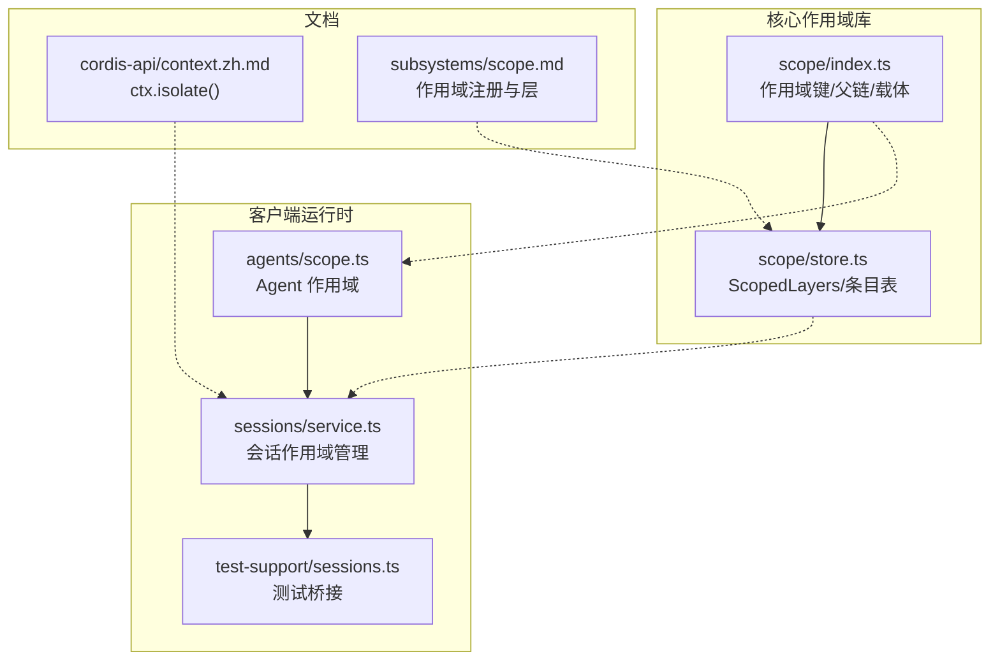
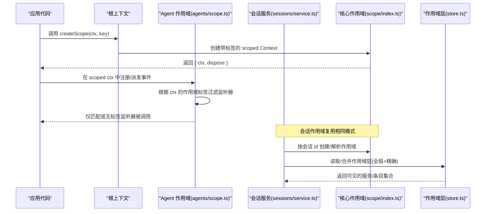
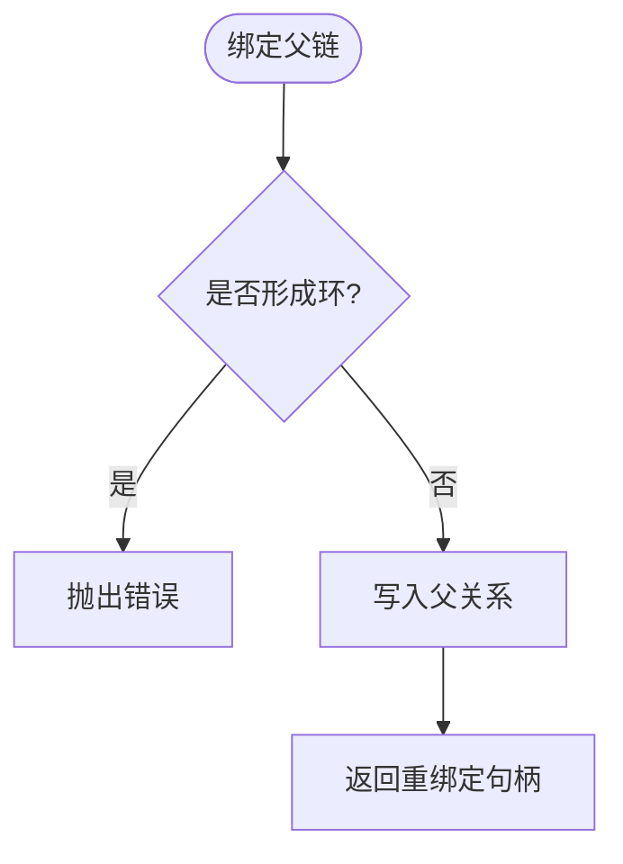
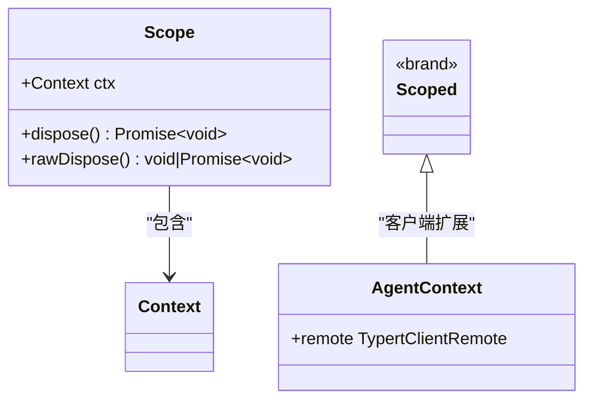
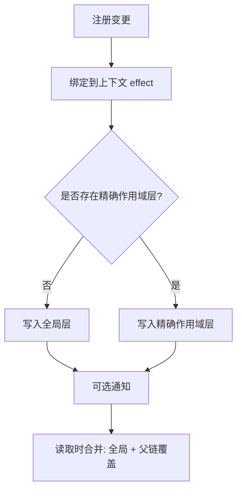
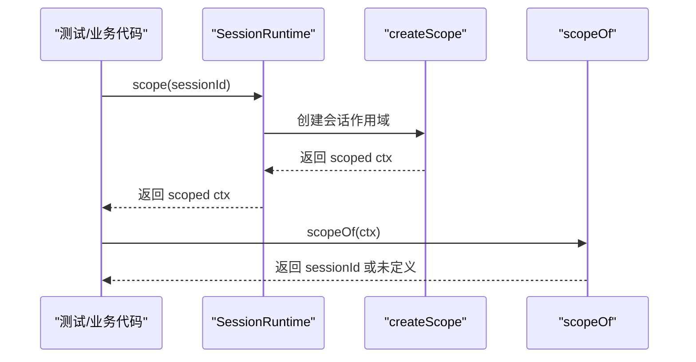
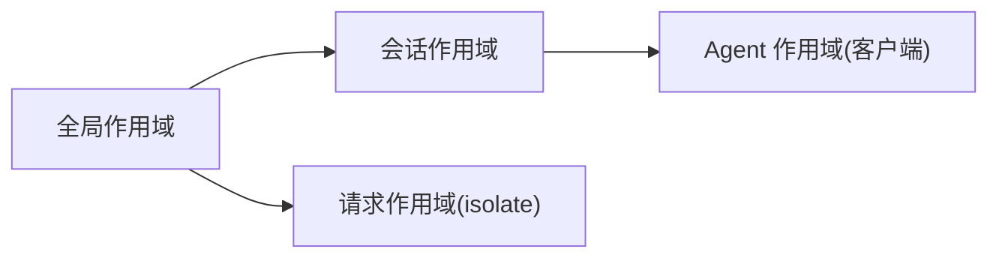
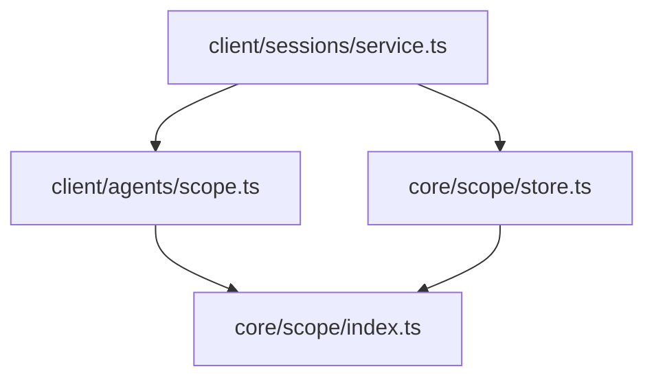

# 作用域隔离

<cite>
**本文引用的文件**
- [packages/core/scope/src/index.ts](file://packages/core/scope/src/index.ts)
- [packages/core/scope/src/store.ts](file://packages/core/scope/src/store.ts)
- [packages/client/runtime/src/client/agents/scope.ts](file://packages/client/runtime/src/client/agents/scope.ts)
- [packages/client/runtime/src/client/sessions/service.ts](file://packages/client/runtime/src/client/sessions/service.ts)
- [packages/test-support/client-runtime/src/sessions.ts](file://packages/test-support/client-runtime/src/sessions.ts)
- [docs/cordis-api/context.zh.md](file://docs/cordis-api/context.zh.md)
- [docs/subsystems/scope.md](file://docs/subsystems/scope.md)
</cite>

## 目录
1. [简介](#简介)
2. [项目结构](#项目结构)
3. [核心组件](#核心组件)
4. [架构总览](#架构总览)
5. [详细组件分析](#详细组件分析)
6. [依赖关系分析](#依赖关系分析)
7. [性能考量](#性能考量)
8. [故障排查指南](#故障排查指南)
9. [结论](#结论)
10. [附录](#附录)

## 简介
本文件系统性阐述 DeepSeek Harness 中的作用域隔离机制，覆盖概念、层次结构与继承、不同作用域类型（全局、会话、Agent、请求）、隔离维度（变量、服务、状态）、继承规则、切换与管理（作用域栈、上下文传递、边界检查），并提供实践示例与排错建议。面向初学者提供清晰的概念解释，面向高级用户提供安全隔离与性能优化实践。

## 项目结构
仓库中与“作用域”相关的核心实现分布在以下位置：
- 通用作用域原语（键、父链、事件路由载体、作用域层存储）：packages/core/scope
- 客户端 Agent 作用域（基于 Cordis Context 的标签化与过滤）：packages/client/runtime/src/client/agents/scope.ts
- 会话作用域管理（会话级作用域创建、解析、清理）：packages/client/runtime/src/client/sessions/service.ts
- 测试运行时对会话作用域的桥接：packages/test-support/client-runtime/src/sessions.ts
- Cordis 服务作用域隔离 API 文档：docs/cordis-api/context.zh.md
- 子系统文档说明作用域注册与层模型：docs/subsystems/scope.md

图表来源
- [packages/core/scope/src/index.ts:1-205](file://packages/core/scope/src/index.ts#L1-L205)
- [packages/core/scope/src/store.ts:1-268](file://packages/core/scope/src/store.ts#L1-L268)
- [packages/client/runtime/src/client/agents/scope.ts:1-78](file://packages/client/runtime/src/client/agents/scope.ts#L1-L78)
- [packages/client/runtime/src/client/sessions/service.ts:534-568](file://packages/client/runtime/src/client/sessions/service.ts#L534-L568)
- [packages/test-support/client-runtime/src/sessions.ts:351-387](file://packages/test-support/client-runtime/src/sessions.ts#L351-L387)
- [docs/cordis-api/context.zh.md:41-68](file://docs/cordis-api/context.zh.md#L41-L68)
- [docs/subsystems/scope.md:1-60](file://docs/subsystems/scope.md#L1-L60)

章节来源
- [packages/core/scope/src/index.ts:1-205](file://packages/core/scope/src/index.ts#L1-L205)
- [packages/core/scope/src/store.ts:1-268](file://packages/core/scope/src/store.ts#L1-L268)
- [packages/client/runtime/src/client/agents/scope.ts:1-78](file://packages/client/runtime/src/client/agents/scope.ts#L1-L78)
- [packages/client/runtime/src/client/sessions/service.ts:534-568](file://packages/client/runtime/src/client/sessions/service.ts#L534-L568)
- [packages/test-support/client-runtime/src/sessions.ts:351-387](file://packages/test-support/client-runtime/src/sessions.ts#L351-L387)
- [docs/cordis-api/context.zh.md:41-68](file://docs/cordis-api/context.zh.md#L41-L68)
- [docs/subsystems/scope.md:1-60](file://docs/subsystems/scope.md#L1-L60)

## 核心组件
- 作用域键与作用域链：通过 ScopeKey 标识一个作用域，使用 WeakMap 维护父子关系，支持链式遍历与环检测。
- 作用域上下文与事件路由：createScope 在 Cordis Fiber 下扩展 Context，写入作用域标签；scopeTarget 为事件分发提供按作用域准入的过滤器。
- 作用域层存储：ScopedLayers 维护全局层与精确作用域层，合并时遵循“最近作用域优先”的覆盖语义；NamedEntries/AnonymousEntries 提供插入有序、可撤销的条目表。
- Agent 作用域：客户端侧以 SessionId 作为作用域键，通过 Context.filter 将事件路由到匹配 Agent 的监听器，并允许无标签监听器全局接收。
- 会话作用域：SessionRuntime 负责按会话 id 创建/解析/回收作用域上下文，暴露 scopeOf/sessionOf 等边界方法。

章节来源
- [packages/core/scope/src/index.ts:32-156](file://packages/core/scope/src/index.ts#L32-L156)
- [packages/core/scope/src/store.ts:152-268](file://packages/core/scope/src/store.ts#L152-L268)
- [packages/client/runtime/src/client/agents/scope.ts:1-78](file://packages/client/runtime/src/client/agents/scope.ts#L1-L78)
- [packages/client/runtime/src/client/sessions/service.ts:534-568](file://packages/client/runtime/src/client/sessions/service.ts#L534-L568)

## 架构总览
下图展示了从“创建作用域”到“事件路由”的关键路径，以及会话作用域如何桥接到 Agent 作用域。

图表来源
- [packages/client/runtime/src/client/agents/scope.ts:46-68](file://packages/client/runtime/src/client/agents/scope.ts#L46-L68)
- [packages/core/scope/src/index.ts:129-156](file://packages/core/scope/src/index.ts#L129-L156)
- [packages/core/scope/src/store.ts:201-217](file://packages/core/scope/src/store.ts#L201-L217)
- [packages/client/runtime/src/client/sessions/service.ts:534-568](file://packages/client/runtime/src/client/sessions/service.ts#L534-L568)

## 详细组件分析

### 作用域键与作用域链（ScopeKey、父链、环检测）
- ScopeKey 是对象身份标识，用于区分不同作用域。
- 通过 WeakMap 保存每个 Key 的父 Key，支持 chain 遍历与 rebind。
- 绑定父链时进行环检测，防止循环引用导致无限遍历。

图表来源
- [packages/core/scope/src/index.ts:53-82](file://packages/core/scope/src/index.ts#L53-L82)
- [packages/core/scope/src/index.ts:89-102](file://packages/core/scope/src/index.ts#L89-L102)

章节来源
- [packages/core/scope/src/index.ts:32-102](file://packages/core/scope/src/index.ts#L32-L102)

### 作用域上下文与事件路由（createScope、scopeTarget、filter）
- createScope 在 Cordis Fiber 下扩展 Context，写入作用域标签，并返回可独立销毁的作用域句柄。
- scopeTarget 包装目标对象，注入 filter：无标签监听器全局可达；有标签监听器需匹配当前作用域或其祖先作用域。
- 该设计使“注册视图向下继承”和“事件准入向上扩展”同时成立。

图表来源
- [packages/core/scope/src/index.ts:104-156](file://packages/core/scope/src/index.ts#L104-L156)
- [packages/client/runtime/src/client/agents/scope.ts:23-68](file://packages/client/runtime/src/client/agents/scope.ts#L23-L68)

章节来源
- [packages/core/scope/src/index.ts:129-185](file://packages/core/scope/src/index.ts#L129-L185)
- [packages/client/runtime/src/client/agents/scope.ts:46-78](file://packages/client/runtime/src/client/agents/scope.ts#L46-L78)

### 作用域层存储（ScopedLayers、NamedEntries、AnonymousEntries）
- ScopedLayers 维护全局层与精确作用域层，读取不创建层，变更通过 effect 绑定到上下文生命周期。
- merge 将全局命名条目与父链上的覆盖层合并，遵循“最近作用域优先”。
- NamedEntries/AnonymousEntries 提供插入有序、可撤销的条目表，迭代期间保持“活表”语义。

图表来源
- [packages/core/scope/src/store.ts:152-268](file://packages/core/scope/src/store.ts#L152-L268)

章节来源
- [packages/core/scope/src/store.ts:152-268](file://packages/core/scope/src/store.ts#L152-L268)

### 会话作用域（Session 作用域）
- SessionRuntime 提供 scope(id)、sessionOf(ctx)、scopeOf(ctx) 等方法，按会话 id 创建/解析作用域上下文。
- 测试运行时通过 createScope 桥接到生产作用域，确保真实 scopeOf/scope-addressed 服务能正确解析。

图表来源
- [packages/client/runtime/src/client/sessions/service.ts:534-568](file://packages/client/runtime/src/client/sessions/service.ts#L534-L568)
- [packages/test-support/client-runtime/src/sessions.ts:351-387](file://packages/test-support/client-runtime/src/sessions.ts#L351-L387)

章节来源
- [packages/client/runtime/src/client/sessions/service.ts:534-568](file://packages/client/runtime/src/client/sessions/service.ts#L534-L568)
- [packages/test-support/client-runtime/src/sessions.ts:351-387](file://packages/test-support/client-runtime/src/sessions.ts#L351-L387)

### 服务作用域隔离（ctx.isolate）
- 通过 ctx.isolate(name, label?) 创建子上下文，使指定服务的读写在当前作用域内解析，互不影响父作用域。
- 同一 label 可使多个 isolate 加入同一作用域，便于共享隔离实例。

章节来源
- [docs/cordis-api/context.zh.md:41-68](file://docs/cordis-api/context.zh.md#L41-L68)

### 作用域类型与层次结构
- 全局作用域：未标记上下文或 global 层，所有无标签监听器均可访问。
- 会话作用域：以会话 id 为键，隔离会话内的服务与事件。
- Agent 作用域：客户端侧以 SessionId 为键，通过 Context.filter 限制事件路由。
- 请求作用域：可通过 ctx.isolate 在服务层面构造细粒度隔离，适合短生命周期请求。

[此图为概念示意，不对应具体源码映射]

### 继承规则
- 注册视图向下继承：子作用域能看到父作用域的层（ScopedLayers.chainLayers）。
- 事件准入向上扩展：祖先作用域的监听器可以接收后代作用域的事件（scopeTarget 的 filter 沿父链上溯匹配）。
- 覆盖顺序：最近作用域优先，即子作用域可覆盖父作用域的同名条目。

章节来源
- [packages/core/scope/src/index.ts:32-39](file://packages/core/scope/src/index.ts#L32-L39)
- [packages/core/scope/src/index.ts:158-185](file://packages/core/scope/src/index.ts#L158-L185)
- [packages/core/scope/src/store.ts:185-217](file://packages/core/scope/src/store.ts#L185-L217)

### 切换与管理（作用域栈、上下文传递、边界检查）
- 作用域栈：通过 Context 的 extend 与 Cordis Fiber 的组合，隐式维护作用域栈；scopeOf 读取最近标签。
- 上下文传递：scoped ctx 作为参数在调用链上传递，保证作用域不被泄露到无关分支。
- 边界检查：scopeTarget 的 filter 严格判定标签匹配或祖先匹配；父链绑定存在环检测；作用域层 effect 绑定到上下文生命周期，自动清理。

章节来源
- [packages/core/scope/src/index.ts:129-156](file://packages/core/scope/src/index.ts#L129-L156)
- [packages/core/scope/src/index.ts:158-185](file://packages/core/scope/src/index.ts#L158-L185)
- [packages/core/scope/src/store.ts:226-268](file://packages/core/scope/src/store.ts#L226-L268)

## 依赖关系分析
- 客户端 Agent 作用域依赖核心作用域的原语（Context、Fiber、scopeOf）。
- 会话作用域管理依赖 Agent 作用域与核心作用域，提供会话维度的创建/解析/清理。
- 作用域层存储依赖作用域链工具函数，提供合并与通知能力。

图表来源
- [packages/client/runtime/src/client/agents/scope.ts:1-78](file://packages/client/runtime/src/client/agents/scope.ts#L1-L78)
- [packages/client/runtime/src/client/sessions/service.ts:534-568](file://packages/client/runtime/src/client/sessions/service.ts#L534-L568)
- [packages/core/scope/src/index.ts:1-205](file://packages/core/scope/src/index.ts#L1-L205)
- [packages/core/scope/src/store.ts:1-268](file://packages/core/scope/src/store.ts#L1-L268)

章节来源
- [packages/client/runtime/src/client/agents/scope.ts:1-78](file://packages/client/runtime/src/client/agents/scope.ts#L1-L78)
- [packages/client/runtime/src/client/sessions/service.ts:534-568](file://packages/client/runtime/src/client/sessions/service.ts#L534-L568)
- [packages/core/scope/src/index.ts:1-205](file://packages/core/scope/src/index.ts#L1-L205)
- [packages/core/scope/src/store.ts:1-268](file://packages/core/scope/src/store.ts#L1-L268)

## 性能考量
- 作用域链遍历：父链长度影响事件准入判断与层合并成本，应避免过深的嵌套。
- 层合并策略：merge 仅在读取时构建有效映射，避免重复计算；尽量复用作用域键以减少层膨胀。
- 作用域生命周期：通过 Cordis Fiber 的 exact disposer 精确释放，避免泄漏；批量操作后统一触发 onChange 减少通知开销。
- 服务隔离粒度：ctx.isolate 的 label 复用可降低实例数量，但需注意共享状态带来的耦合风险。

[本节为通用指导，不直接分析具体文件]

## 故障排查指南
- 事件未到达预期监听器：
  - 检查作用域标签是否正确设置（scopeOf 返回值）。
  - 确认事件是否通过 scopeTarget 包装，且 key 与监听器所在作用域匹配或为其祖先。
  - 参考：[packages/core/scope/src/index.ts:158-185](file://packages/core/scope/src/index.ts#L158-L185)
- 作用域父链异常：
  - 若出现环检测错误，检查 bindScopeParent/rebind 的使用是否形成环路。
  - 参考：[packages/core/scope/src/index.ts:53-82](file://packages/core/scope/src/index.ts#L53-L82)
- 服务隔离未生效：
  - 确认 isolate 的 name 与 label 一致，且在该作用域内提供了新实现。
  - 参考：[docs/cordis-api/context.zh.md:41-68](file://docs/cordis-api/context.zh.md#L41-L68)
- 会话作用域无法解析：
  - 检查 sessionOf/scopeOf 的调用是否在正确的上下文中，且会话未被回收。
  - 参考：[packages/client/runtime/src/client/sessions/service.ts:534-568](file://packages/client/runtime/src/client/sessions/service.ts#L534-L568)

章节来源
- [packages/core/scope/src/index.ts:53-82](file://packages/core/scope/src/index.ts#L53-L82)
- [packages/core/scope/src/index.ts:158-185](file://packages/core/scope/src/index.ts#L158-L185)
- [docs/cordis-api/context.zh.md:41-68](file://docs/cordis-api/context.zh.md#L41-L68)
- [packages/client/runtime/src/client/sessions/service.ts:534-568](file://packages/client/runtime/src/client/sessions/service.ts#L534-L568)

## 结论
DeepSeek Harness 的作用域体系以“键+父链+上下文标签+过滤器”为核心，结合“作用域层存储”实现了灵活的隔离与继承。通过会话作用域与 Agent 作用域的配合，既保证了跨进程/跨模块的安全边界，又保留了高效的组合与复用能力。实践中应关注作用域深度、层合并成本与生命周期管理，以获得最佳的性能与可维护性。

## 附录
- 快速实践清单
  - 创建作用域：使用 createScope 生成带标签的上下文，并在其内注册服务与监听器。
  - 设置隔离规则：使用 ctx.isolate 针对特定服务建立隔离，并通过 label 共享实例。
  - 访问跨作用域服务：通过 scopeTarget 包装事件目标，确保祖先作用域可订阅后代事件。
  - 调试作用域问题：使用 scopeOf 检查当前上下文的作用域标签；用 scopeChainOf 打印父链；用 ScopedLayers.merge 验证合并结果。
- 参考路径
  - 作用域原语与层存储：[packages/core/scope/src/index.ts](file://packages/core/scope/src/index.ts), [packages/core/scope/src/store.ts](file://packages/core/scope/src/store.ts)
  - 客户端 Agent 作用域：[packages/client/runtime/src/client/agents/scope.ts](file://packages/client/runtime/src/client/agents/scope.ts)
  - 会话作用域管理：[packages/client/runtime/src/client/sessions/service.ts](file://packages/client/runtime/src/client/sessions/service.ts)
  - 服务隔离 API：[docs/cordis-api/context.zh.md](file://docs/cordis-api/context.zh.md)
  - 子系统文档：[docs/subsystems/scope.md](file://docs/subsystems/scope.md)