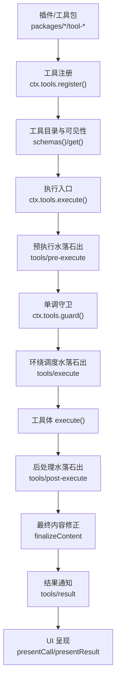
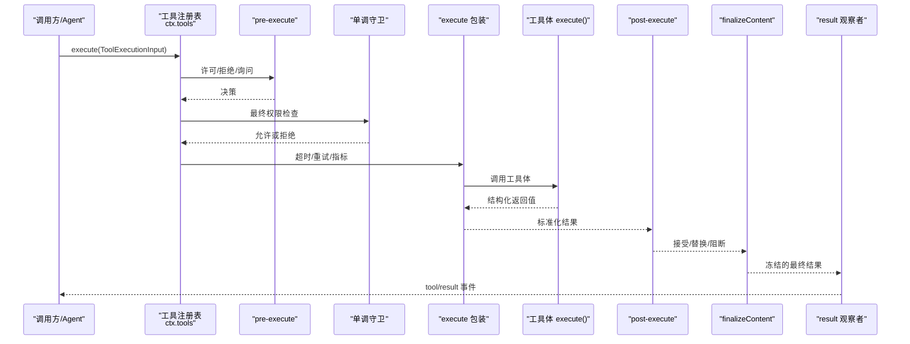
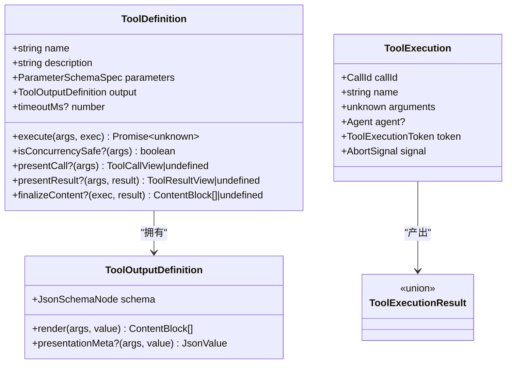
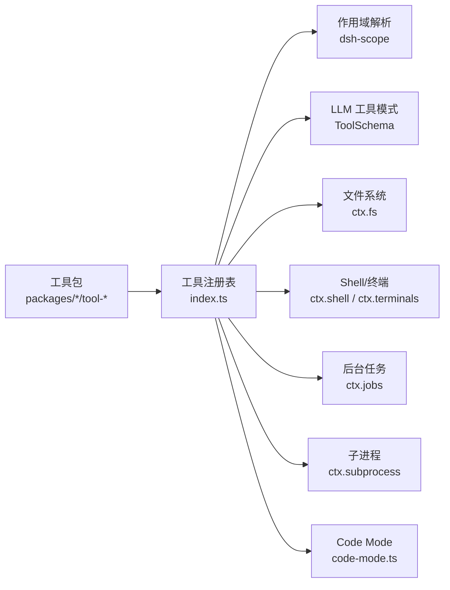

# 工具系统

<cite>
**本文引用的文件**
- [packages/core/tools/src/index.ts](file://packages/core/tools/src/index.ts)
- [packages/core/tools/src/schema.ts](file://packages/core/tools/src/schema.ts)
- [packages/core/tools/src/presentation.ts](file://packages/core/tools/src/presentation.ts)
- [packages/core/tools/src/code-mode.ts](file://packages/core/tools/src/code-mode.ts)
- [docs/subsystems/tools.md](file://docs/subsystems/tools.md)
- [docs/tool-execution-pipeline.md](file://docs/tool-execution-pipeline.md)
- [docs/tool-catalog.md](file://docs/tool-catalog.md)
- [docs/cordis-api/context.md](file://docs/cordis-api/context.md)
- [docs/cordis-api/registry.md](file://docs/cordis-api/registry.md)
- [docs/cookbook/adding-a-tool.md](file://docs/cookbook/adding-a-tool.md)
</cite>

## 目录
1. [简介](#简介)
2. [项目结构](#项目结构)
3. [核心组件](#核心组件)
4. [架构总览](#架构总览)
5. [详细组件分析](#详细组件分析)
6. [依赖关系分析](#依赖关系分析)
7. [性能与并发特性](#性能与并发特性)
8. [故障排查指南](#故障排查指南)
9. [结论](#结论)
10. [附录：开发流程与最佳实践](#附录开发流程与最佳实践)

## 简介
本文件系统性地文档化工具（Tool）的概念、注册与发现机制、执行管道、参数与返回值规范、错误处理、权限与沙箱隔离、结果缓存与呈现，以及内置/自定义/第三方工具的集成方式。同时提供元数据管理说明与完整开发流程示例路径，帮助开发者从零到一构建高质量工具。

## 项目结构
工具系统的核心位于 packages/core/tools，围绕“定义—注册—发现—调度—执行—观察”的闭环展开；配套文档在 docs 中提供了执行流水线图、工具目录与 Cordis API 参考。

图表来源
- [packages/core/tools/src/index.ts:142-200](file://packages/core/tools/src/index.ts#L142-L200)
- [docs/tool-execution-pipeline.md:8-58](file://docs/tool-execution-pipeline.md#L8-L58)

章节来源
- [docs/subsystems/tools.md:1-12](file://docs/subsystems/tools.md#L1-L12)
- [docs/tool-execution-pipeline.md:1-63](file://docs/tool-execution-pipeline.md#L1-L63)

## 核心组件
- 工具定义与 DSL
  - 统一的 JSON 值类型 DSL，支持 string/number/integer/boolean/null/array/object/json/oneOf，并自动推导 TypeScript 类型与运行时校验。
  - defineTool 将参数 schema、输出 schema、渲染器、可选展示元数据与 execute 绑定，确保模型侧只暴露白名单字段。
- 工具注册与发现
  - ctx.tools.register 注册工具；ctx.tools.schemas 生成模型可见的工具描述；ctx.tools.get 按作用域解析可见工具；ctx.tools.restrict 限制全局工具可见性。
- 执行管道
  - tools/pre-execute（允许/拒绝/询问）、单调守卫、tools/execute（超时/重试/指标）、工具体、tools/post-execute（接受/替换/阻断/附加上下文）、finalizeContent、tools/result。
- UI 呈现
  - presentCall/presentResult 返回中性卡片意图（generic/terminal/diff/search/read/web），由宿主/客户端映射为具体视图。

章节来源
- [packages/core/tools/src/schema.ts:1-200](file://packages/core/tools/src/schema.ts#L1-L200)
- [packages/core/tools/src/index.ts:142-200](file://packages/core/tools/src/index.ts#L142-L200)
- [docs/subsystems/tools.md:9-152](file://docs/subsystems/tools.md#L9-L152)
- [docs/subsystems/tools.md:459-468](file://docs/subsystems/tools.md#L459-L468)

## 架构总览
工具系统以“可插拔的水落石出式管道”为核心，所有策略（权限、沙箱、超时、审计、结果改写）通过事件钩子注入，不侵入工具实现。

图表来源
- [packages/core/tools/src/index.ts:142-200](file://packages/core/tools/src/index.ts#L142-L200)
- [docs/tool-execution-pipeline.md:8-58](file://docs/tool-execution-pipeline.md#L8-L58)

## 详细组件分析

### 工具定义与参数验证
- 参数 schema 使用 ValueSchemaSpec 声明，自动编译为 JSON Schema 并在运行时严格校验；required 属性决定必填键。
- 输出 schema 同样受约束，execute 仅返回该 schema 对应的 JSON 值；render 负责将值转为模型可见的内容块。
- 类型推断：InferArgs/InferValue 保证 IDE 提示与运行期一致，最多递归 16 层容器深度，超出回退为 JsonValue。

章节来源
- [packages/core/tools/src/schema.ts:1-200](file://packages/core/tools/src/schema.ts#L1-L200)
- [docs/subsystems/tools.md:98-152](file://docs/subsystems/tools.md#L98-L152)

### 工具注册与发现
- register：在同一进程内注册工具，作用域内可覆盖全局工具；重复名称或保留名失败。
- schemas：仅暴露 name/description/parameters 等白名单字段，避免泄露执行与展示回调。
- get/restrict：按作用域解析可见工具；allow/deny 交集过滤全局工具，不影响本地注册。
- executionMode：根据 isConcurrencySafe 判定并行或独占执行模式。

章节来源
- [packages/core/tools/src/index.ts:478-574](file://packages/core/tools/src/index.ts#L478-L574)
- [docs/subsystems/tools.md:153-172](file://docs/subsystems/tools.md#L153-L172)

### 执行管道与扩展点
- pre-execute：允许/拒绝/询问（审批）。异步监听需关注 exec.signal。
- 单调守卫：最终权限检查，只能拒绝或放行，不能反转后续拒绝。
- execute：用于超时、重试、指标采集等“环绕”逻辑；可替换信号但不可移除。
- post-execute：接受/替换 content 或 value、阻断并转为错误、附加上下文。
- finalizeContent：工具定义级最后一次内容修正，必须幂等且无副作用。
- result：最终冻结结果的同步通知，供审计与观测。

章节来源
- [packages/core/tools/src/index.ts:142-200](file://packages/core/tools/src/index.ts#L142-L200)
- [docs/subsystems/tools.md:170-405](file://docs/subsystems/tools.md#L170-L405)
- [docs/tool-execution-pipeline.md:8-58](file://docs/tool-execution-pipeline.md#L8-L58)

### 权限检查与沙箱隔离
- 权限：通过 pre-execute 与 guard 组合实现细粒度控制；ask 走审批服务，未获授权即拒绝。
- 沙箱：文件访问在 fs/* 事件门控处拦截（如 read-before-edit），工具体内部的文件操作受策略约束；shell/终端工具在独立进程中运行，具备进程级隔离。
- Code Mode：run_code 作为保留传输，其子调用通过 code-dispatch-log 记录日志并可替换持久化副本中的内容。

章节来源
- [docs/tool-execution-pipeline.md:8-58](file://docs/tool-execution-pipeline.md#L8-L58)
- [docs/tool-catalog.md:17-41](file://docs/tool-catalog.md#L17-L41)

### 结果缓存与幂等性
- 当前执行管道未内置通用结果缓存；如需缓存，应在 post-execute 或工具体内部基于输入指纹实现，并确保对并发安全与失效策略。
- 建议：对读多写少、计算昂贵且纯函数性质的工具实现缓存；注意缓存键包含必要上下文（工作区、用户、时间窗口等）。

[本节为通用指导，无需特定文件引用]

### 工具分类与组织
- 内置工具：由 shipped 插件提供，如 bash、pwsh、fs、search、terminal、web、goal、schedule、lsp、subagent 等。
- 自定义工具：通过 defineTool + register 在插件中注册，遵循统一 schema 与执行契约。
- 第三方工具：可通过 Cordis 动态包（cordis_define/run/inspect）在会话内动态加载与运行，具备 VM 沙箱与生命周期管理。

章节来源
- [docs/tool-catalog.md:12-41](file://docs/tool-catalog.md#L12-L41)
- [docs/tool-catalog.md:264-500](file://docs/tool-catalog.md#L264-L500)

### 元数据管理
- 工具描述：name/description/parameters 由 schemas 暴露给模型。
- 版本信息：Cordis 动态包支持版本指针与更新；工具本身通过插件 fiber 生命周期管理。
- 依赖关系：通过 inject 声明所需服务；executionMode/isConcurrencySafe 表达并发语义。
- 展示元数据：output.presentationMeta 提供可重放的 UI 元数据（如 diff 片段、搜索统计）。

章节来源
- [docs/cordis-api/registry.md:8-121](file://docs/cordis-api/registry.md#L8-L121)
- [docs/subsystems/tools.md:15-94](file://docs/subsystems/tools.md#L15-L94)

### 代码级类图（核心类型）

图表来源
- [packages/core/tools/src/index.ts:142-200](file://packages/core/tools/src/index.ts#L142-L200)
- [docs/subsystems/tools.md:15-94](file://docs/subsystems/tools.md#L15-L94)

## 依赖关系分析
- 工具包依赖 Cordis 上下文与服务（ctx.tools、ctx.shell、ctx.fs、ctx.subprocess、ctx.jobs 等）。
- 工具注册表依赖作用域解析（@deepseek-ai/dsh-scope）与 LLM 工具模式（ToolSchema）。
- Code Mode 通过 run_code 将程序调用重新进入工具管道，并以 code-dispatch-log 记录子调用。

图表来源
- [packages/core/tools/src/index.ts:1-30](file://packages/core/tools/src/index.ts#L1-L30)
- [packages/core/tools/src/code-mode.ts:1-40](file://packages/core/tools/src/code-mode.ts#L1-L40)

章节来源
- [packages/core/tools/src/index.ts:1-30](file://packages/core/tools/src/index.ts#L1-L30)
- [docs/tool-catalog.md:17-41](file://docs/tool-catalog.md#L17-L41)

## 性能与并发特性
- 并发模式：isConcurrencySafe 为 true 时允许与兄弟调用并行；否则独占执行形成顺序屏障。
- 超时控制：timeoutMs 声明协作式超时预算，配合 tools/execute 包装实现。
- 资源隔离：shell/终端/子进程工具在独立进程中运行，降低相互干扰。
- 结果冻结：最终结果深冻结，避免下游观察者意外修改。

章节来源
- [docs/subsystems/tools.md:53-74](file://docs/subsystems/tools.md#L53-L74)
- [docs/subsystems/tools.md:243-253](file://docs/subsystems/tools.md#L243-L253)

## 故障排查指南
- 参数错误：ToolArgsError（INVALID_ARGS）——检查参数 schema 与 required。
- 输出错误：ToolOutputError（INVALID_TOOL_OUTPUT）——检查 execute 返回值是否符合 output.schema。
- 未知工具：UNKNOWN_TOOL——确认工具已注册且在当前作用域可见。
- 权限拒绝：pre-execute/guard 拒绝或审批未通过——检查策略与审批配置。
- 超时/中断：ABORTED_BEFORE_DISPATCH 或 ABORTED——检查 exec.signal 与超时设置。
- 内容渲染异常：finalizeContent/render 抛出——确保纯函数且无副作用。

章节来源
- [docs/subsystems/tools.md:149-152](file://docs/subsystems/tools.md#L149-L152)
- [docs/subsystems/tools.md:376-405](file://docs/subsystems/tools.md#L376-L405)

## 结论
工具系统通过统一的 schema DSL、严格的执行管道与可扩展的钩子系统，实现了高内聚、低耦合的工具生态。借助作用域与可见性控制、权限与沙箱隔离、以及丰富的 UI 呈现能力，既能满足内置工具的稳定交付，也便于自定义与第三方工具的安全集成。

## 附录：开发流程与最佳实践
- 最小工具形状
  - 使用 defineTool 声明 name/description/parameters/output/execute，并通过 ctx.tools.register 注册。
  - 参考示例路径：[添加一个工具（Cookbook）:7-36](file://docs/cookbook/adding-a-tool.md#L7-L36)
- 参数与返回值
  - 用 ValueSchemaSpec 精确描述参数与输出；execute 仅返回 JSON 值，render 负责模型可见内容。
  - 参考类型与校验：[schema.ts:1-200](file://packages/core/tools/src/schema.ts#L1-L200)
- 错误处理
  - 基础设施错误抛异常；业务成功但非理想状态应体现在结构化 value 中。
  - 参考错误路径：[tools.md:149-152](file://docs/subsystems/tools.md#L149-L152)
- 长耗时与后台任务
  - 使用 ctx.jobs.start 注册后台任务，返回句柄；前台工作关注 exec.signal。
  - 参考最佳实践：[Cookbook:51-56](file://docs/cookbook/adding-a-tool.md#L51-L56)
- 权限与沙箱
  - 使用 pre-execute 与 guard 组合策略；文件访问通过 fs/* 事件门控。
  - 参考执行流水线：[tool-execution-pipeline.md:8-58](file://docs/tool-execution-pipeline.md#L8-L58)
- UI 呈现
  - 使用 presentCall/presentResult 返回中性卡片意图；presentationMeta 提供可重放元数据。
  - 参考呈现词汇：[tools.md:459-468](file://docs/subsystems/tools.md#L459-L468)
- 测试与验证
  - 遵循仓库测试策略；对模型/UI 可见变更需满足覆盖率要求。
  - 参考：[Cookbook:92-95](file://docs/cookbook/adding-a-tool.md#L92-L95)

章节来源
- [docs/cookbook/adding-a-tool.md:7-66](file://docs/cookbook/adding-a-tool.md#L7-L66)
- [docs/subsystems/tools.md:459-468](file://docs/subsystems/tools.md#L459-L468)
- [docs/tool-execution-pipeline.md:8-58](file://docs/tool-execution-pipeline.md#L8-L58)