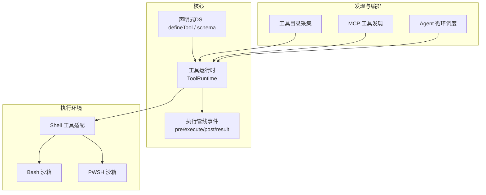
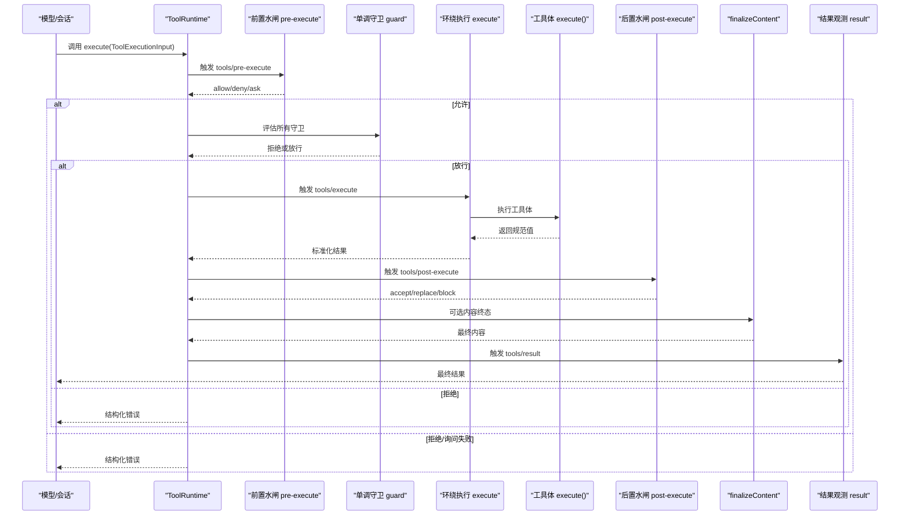
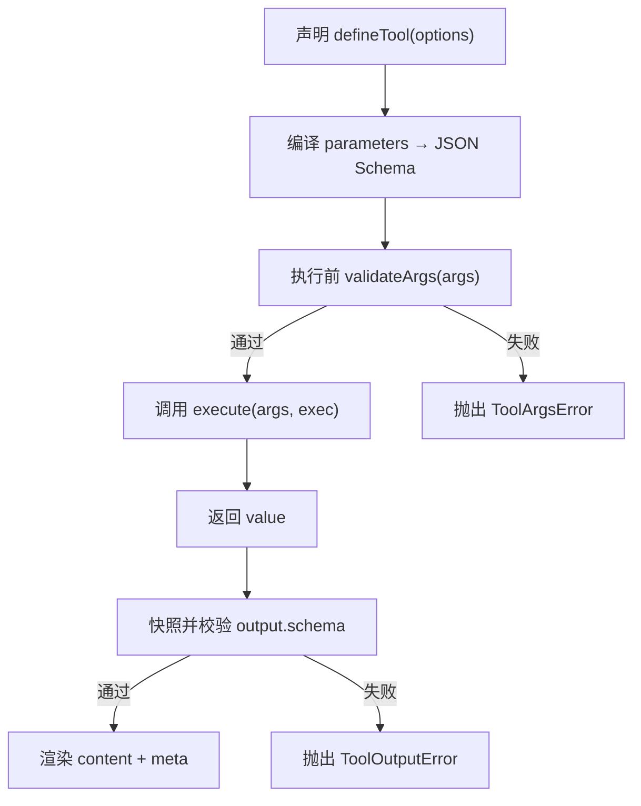
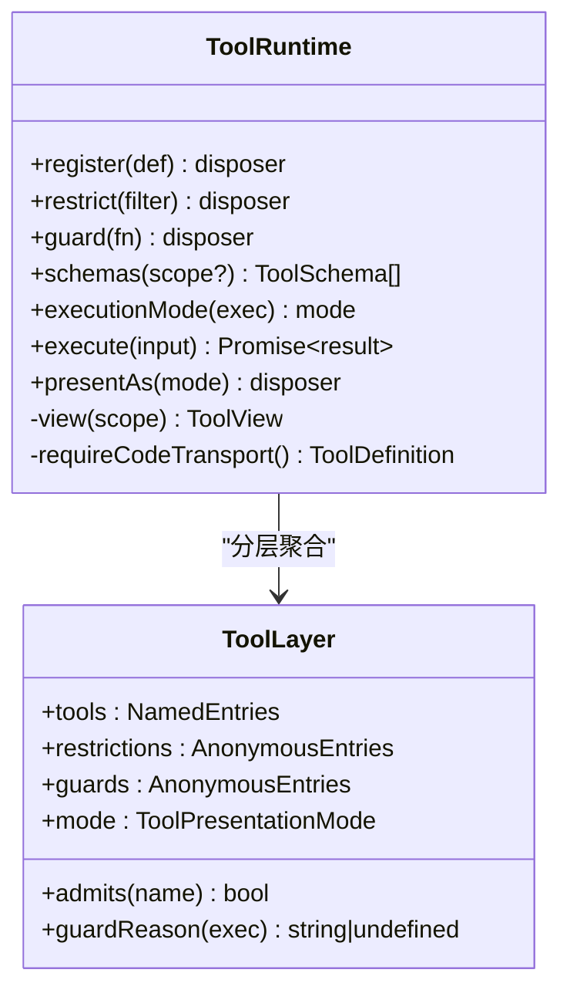
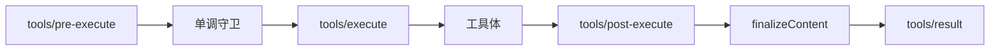
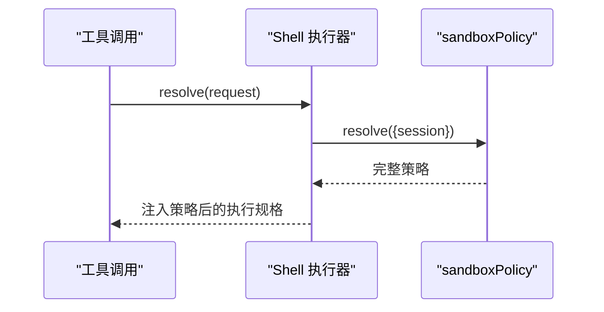
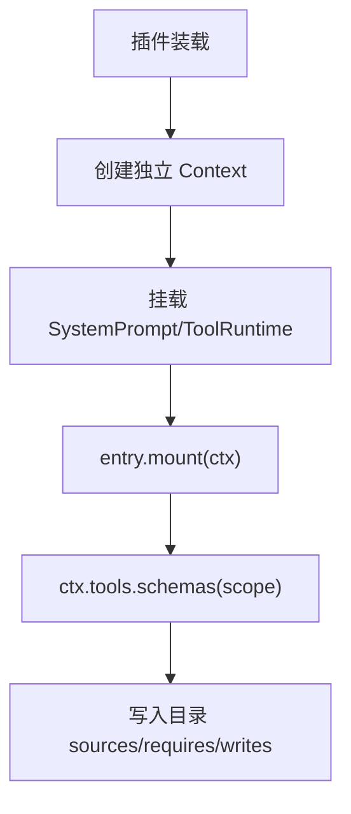
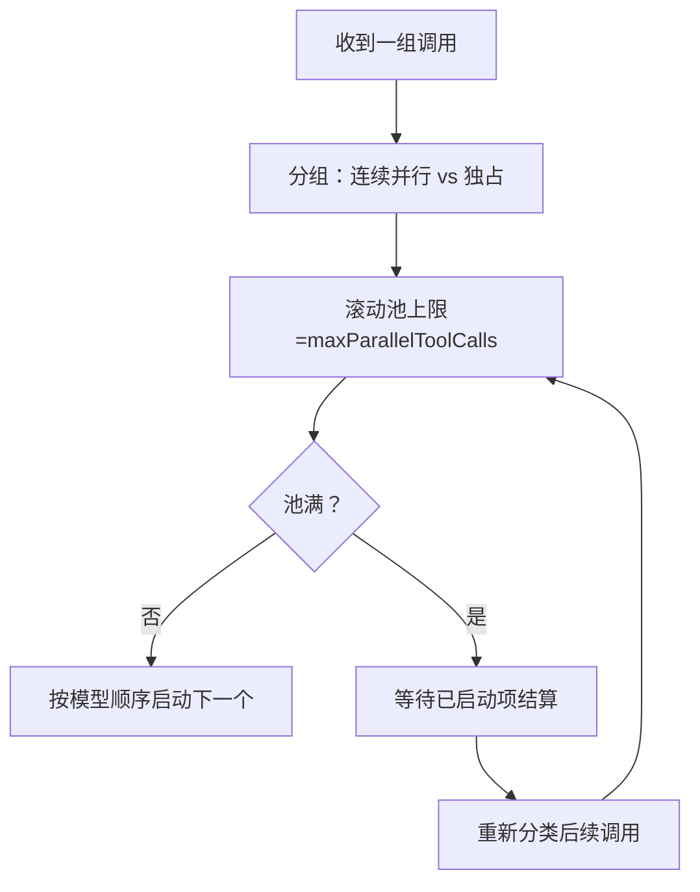
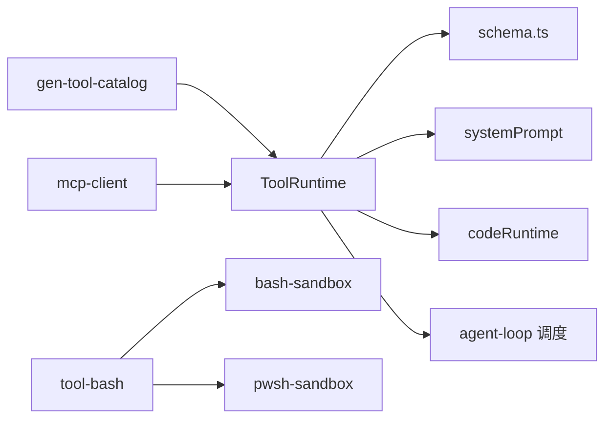

# 工具系统

<cite>
**本文引用的文件**
- [packages/core/tools/src/index.ts](file://packages/core/tools/src/index.ts)
- [packages/core/tools/src/schema.ts](file://packages/core/tools/src/schema.ts)
- [docs/subsystems/tools.md](file://docs/subsystems/tools.md)
- [docs/tool-execution-pipeline.md](file://docs/tool-execution-pipeline.md)
- [packages/shell/tool-bash/src/index.ts](file://packages/shell/tool-bash/src/index.ts)
- [packages/shell/bash-sandbox/src/index.ts](file://packages/shell/bash-sandbox/src/index.ts)
- [packages/shell/pwsh-sandbox/src/index.ts](file://packages/shell/pwsh-sandbox/src/index.ts)
- [scripts/gen-tool-catalog.ts](file://scripts/gen-tool-catalog.ts)
- [packages/mcp/mcp-client/tests/mcp-client.e2e.ts](file://packages/mcp/mcp-client/tests/mcp-client.e2e.ts)
- [packages/core/agent-loop/src/tool-calls.ts](file://packages/core/agent-loop/src/tool-calls.ts)
</cite>

## 目录
1. [简介](#简介)
2. [项目结构](#项目结构)
3. [核心组件](#核心组件)
4. [架构总览](#架构总览)
5. [详细组件分析](#详细组件分析)
6. [依赖关系分析](#依赖关系分析)
7. [性能考量](#性能考量)
8. [故障排查指南](#故障排查指南)
9. [结论](#结论)
10. [附录](#附录)

## 简介
本文件系统性地梳理并文档化工具系统的注册机制、执行管道、权限控制、声明式定义（参数验证、返回值类型与错误处理）、执行环境（沙箱隔离、资源限制与安全）、发现机制（静态注册、动态加载、版本管理）以及调用方式（同步/异步/流式）。面向初学者提供开发入门，面向高级用户提供自定义工具链与性能优化建议。

## 项目结构
工具系统以 packages/core/tools 为核心，提供工具注册表、执行管线、参数与输出 JSON Schema DSL、UI 呈现契约等；shell 子系统提供沙箱化的 Bash/PWSH 执行器；脚本层提供工具目录采集；MCP 客户端演示了远程工具的命名与发现；Agent Loop 负责并行调度与顺序屏障。

图表来源
- [packages/core/tools/src/index.ts:787-1200](file://packages/core/tools/src/index.ts#L787-L1200)
- [packages/core/tools/src/schema.ts:432-618](file://packages/core/tools/src/schema.ts#L432-L618)
- [packages/shell/tool-bash/src/index.ts:190-200](file://packages/shell/tool-bash/src/index.ts#L190-L200)
- [packages/shell/bash-sandbox/src/index.ts:51-86](file://packages/shell/bash-sandbox/src/index.ts#L51-L86)
- [packages/shell/pwsh-sandbox/src/index.ts:59-94](file://packages/shell/pwsh-sandbox/src/index.ts#L59-L94)
- [scripts/gen-tool-catalog.ts:616-653](file://scripts/gen-tool-catalog.ts#L616-L653)
- [packages/mcp/mcp-client/tests/mcp-client.e2e.ts:81-115](file://packages/mcp/mcp-client/tests/mcp-client.e2e.ts#L81-L115)
- [packages/core/agent-loop/src/tool-calls.ts:112-143](file://packages/core/agent-loop/src/tool-calls.ts#L112-L143)

章节来源
- [docs/subsystems/tools.md:1-721](file://docs/subsystems/tools.md#L1-L721)
- [docs/tool-execution-pipeline.md:1-63](file://docs/tool-execution-pipeline.md#L1-L63)

## 核心组件
- 工具运行时 ToolRuntime：维护作用域分层、可见性解析、注册/限制/守卫、执行入口 execute、模式切换 presentAs、Code Mode 传输 run_code 注入。
- 声明式 DSL defineTool：统一参数与输出的 JSON Schema DSL，编译为受控子集，提供类型推断与严格校验。
- 执行管线水闸：tools/pre-execute（允许/拒绝/询问）、monotonic guards（单调守卫）、tools/execute（超时/重试/指标）、tools/post-execute（接受/替换/阻断）、finalizeContent（内容最后防线）、tools/result（最终观测）。
- 沙箱与策略：Shell 执行器暴露 sandboxMode，结合 sandboxPolicy 在每次调用时注入完整策略；工具侧可读取默认模式并在必要时升级目标。
- 发现与目录：通过 Context 插件挂载工具，脚本批量启动 Context 收集 schemas 生成目录；MCP 工具按命名空间与哈希规范化后注册。
- 调度与并发：Agent Loop 根据 isConcurrencySafe 将连续并行调用分组，独占调用形成顺序屏障，滚动池上限由配置控制。

章节来源
- [packages/core/tools/src/index.ts:787-1200](file://packages/core/tools/src/index.ts#L787-L1200)
- [packages/core/tools/src/schema.ts:432-618](file://packages/core/tools/src/schema.ts#L432-L618)
- [docs/subsystems/tools.md:153-404](file://docs/subsystems/tools.md#L153-L404)
- [packages/shell/tool-bash/src/index.ts:190-200](file://packages/shell/tool-bash/src/index.ts#L190-L200)
- [packages/shell/bash-sandbox/src/index.ts:51-86](file://packages/shell/bash-sandbox/src/index.ts#L51-L86)
- [packages/shell/pwsh-sandbox/src/index.ts:59-94](file://packages/shell/pwsh-sandbox/src/index.ts#L59-L94)
- [scripts/gen-tool-catalog.ts:616-653](file://scripts/gen-tool-catalog.ts#L616-L653)
- [packages/mcp/mcp-client/tests/mcp-client.e2e.ts:81-115](file://packages/mcp/mcp-client/tests/mcp-client.e2e.ts#L81-L115)
- [packages/core/agent-loop/src/tool-calls.ts:112-143](file://packages/core/agent-loop/src/tool-calls.ts#L112-L143)

## 架构总览
工具系统围绕“声明—注册—可见性—执行—结果”的闭环构建。模型请求经会话事件进入工具管线，依次经过前置策略、守卫、环绕执行、后置策略、内容终态与结果观测；同时 UI 通过 presentCall/presentResult 渲染卡片。沙箱策略在 Shell 工具中注入到每次执行，确保资源受限与最小权限。

图表来源
- [docs/tool-execution-pipeline.md:8-58](file://docs/tool-execution-pipeline.md#L8-L58)
- [packages/core/tools/src/index.ts:142-208](file://packages/core/tools/src/index.ts#L142-L208)
- [packages/core/tools/src/index.ts:1118-1128](file://packages/core/tools/src/index.ts#L1118-L1128)

## 详细组件分析

### 工具声明与参数/返回值验证
- 使用 defineTool 声明工具：name、description、parameters（隐式开放对象根，属性级 required）、output.schema（受控 JSON Schema 子集）、output.render/presentationMeta、可选 finalizeContent、timeoutMs、isConcurrencySafe、presentCall/presentResult。
- 参数编译与校验：parameterSchemaSpecToJsonSchema 将 DSL 编译为受控 JSON Schema；validateArgs 对传入参数进行路径化违规报告；非法参数抛出 ToolArgsError（INVALID_ARGS）。
- 返回值校验：工具体返回的值会被快照并校验 output.schema，不合法则抛出 ToolOutputError（INVALID_TOOL_OUTPUT）。
- 类型推断：InferValue/InferArgs 提供深度至 16 层的精确类型推断，超出回退到 JsonValue。

图表来源
- [packages/core/tools/src/schema.ts:432-618](file://packages/core/tools/src/schema.ts#L432-L618)
- [packages/core/tools/src/index.ts:555-580](file://packages/core/tools/src/index.ts#L555-L580)

章节来源
- [packages/core/tools/src/schema.ts:11-106](file://packages/core/tools/src/schema.ts#L11-L106)
- [packages/core/tools/src/schema.ts:432-618](file://packages/core/tools/src/schema.ts#L432-L618)
- [docs/subsystems/tools.md:98-151](file://docs/subsystems/tools.md#L98-L151)

### 注册机制与作用域可见性
- 注册：ctx.tools.register(definition) 支持全局或 agent 作用域注册；重复名在同一层报错；保留名称 run_code 不可覆盖。
- 限制：ctx.tools.restrict({ allow?, deny? }) 仅作用于继承的工具集合，多个限制取交集；本地注册不受影响；禁止命名保留工具。
- 可见性：view() 合并全局与祖先层，应用限制，再叠加本地注册与 Code Mode 传输；schemas() 仅暴露模型可见字段。
- 模式切换：presentAs(mode) 可在作用域内切换 native/code/both，并注入 SDK 提示与 collapse 规则。

图表来源
- [packages/core/tools/src/index.ts:714-754](file://packages/core/tools/src/index.ts#L714-L754)
- [packages/core/tools/src/index.ts:1031-1193](file://packages/core/tools/src/index.ts#L1031-L1193)

章节来源
- [packages/core/tools/src/index.ts:1031-1193](file://packages/core/tools/src/index.ts#L1031-L1193)
- [docs/subsystems/tools.md:478-574](file://docs/subsystems/tools.md#L478-L574)

### 执行管道与权限控制
- 前置水闸 tools/pre-execute：允许/拒绝/询问（审批服务），异步需监听信号；未实现审批则询问转为拒绝。
- 单调守卫：注册于作用域链，任一守卫返回非空即拒绝；无法被后续守卫恢复为允许。
- 环绕执行 tools/execute：用于超时、重试、指标；可替换信号但不可移除；注册表会在调用前融合原始 caller 信号。
- 后置水闸 tools/post-execute：接受/替换 content/value/附加上下文/阻断；阻断会转为 isError 并携带反馈。
- 内容终态 finalizeContent：工具定义提供的纯函数，对所有归一化结果（含管线失败）生效，必须无副作用且不抛错。
- 结果观测 tools/result：接收冻结的执行与结果，观察者失败被隔离。

图表来源
- [docs/tool-execution-pipeline.md:8-58](file://docs/tool-execution-pipeline.md#L8-L58)
- [packages/core/tools/src/index.ts:142-208](file://packages/core/tools/src/index.ts#L142-L208)
- [packages/core/tools/src/index.ts:1118-1128](file://packages/core/tools/src/index.ts#L1118-L1128)

章节来源
- [docs/tool-execution-pipeline.md:1-63](file://docs/tool-execution-pipeline.md#L1-L63)
- [docs/subsystems/tools.md:170-404](file://docs/subsystems/tools.md#L170-L404)

### 执行环境与沙箱隔离
- Shell 执行器暴露 sandboxMode，作为能力事实供工具层读取；每次执行 resolve(request) 时会注入完整的 sandboxPolicy（包含模式、工作目录、拒绝签名、失败规则等）。
- tool-bash 在 apply 时检查是否存在沙箱策略，缺失则抛错；并提供 resolveSandboxPolicy 基于 agent/session 解析每调用策略。
- bash-sandbox 与 pwsh-sandbox 均记录 per-process 的事实映射，直到结算；避免共享最新包装导致的误判。

图表来源
- [packages/shell/tool-bash/src/index.ts:190-200](file://packages/shell/tool-bash/src/index.ts#L190-L200)
- [packages/shell/bash-sandbox/src/index.ts:51-86](file://packages/shell/bash-sandbox/src/index.ts#L51-L86)
- [packages/shell/pwsh-sandbox/src/index.ts:59-94](file://packages/shell/pwsh-sandbox/src/index.ts#L59-L94)

章节来源
- [packages/shell/tool-bash/src/index.ts:190-200](file://packages/shell/tool-bash/src/index.ts#L190-L200)
- [packages/shell/bash-sandbox/src/index.ts:51-86](file://packages/shell/bash-sandbox/src/index.ts#L51-L86)
- [packages/shell/pwsh-sandbox/src/index.ts:59-94](file://packages/shell/pwsh-sandbox/src/index.ts#L59-L94)

### 工具发现机制
- 静态注册：通过 ctx.plugin 挂载工具包，每个包独立 Context 启动并收集 schemas，保证归属清晰且失败隔离。
- 动态加载：MCP 客户端将远程工具按命名空间与确定性哈希后缀规范化后注册，对外暴露唯一公共名。
- 版本管理：通过 schemas() 暴露的 ToolSchema 列表与 source 元数据，配合目录生成脚本，便于追踪来源与依赖。

图表来源
- [scripts/gen-tool-catalog.ts:616-653](file://scripts/gen-tool-catalog.ts#L616-L653)
- [packages/mcp/mcp-client/tests/mcp-client.e2e.ts:81-115](file://packages/mcp/mcp-client/tests/mcp-client.e2e.ts#L81-L115)

章节来源
- [scripts/gen-tool-catalog.ts:616-653](file://scripts/gen-tool-catalog.ts#L616-L653)
- [packages/mcp/mcp-client/tests/mcp-client.e2e.ts:81-115](file://packages/mcp/mcp-client/tests/mcp-client.e2e.ts#L81-L115)

### 调用方式：同步/异步/流式
- 同步/异步：ToolRuntime.execute 返回 Promise<ToolExecutionResult>，内部通过水闸与守卫协调；工具体需遵循协作取消（exec.signal）。
- 流式响应：工具本身不直接返回流；可通过工具体产生会话事件（如 todo/write、fs/observed、hook/invoked、tool/code-dispatch）实现增量反馈；UI 通过 pending/完成卡片呈现。
- Code Mode：run_code 作为保留传输，程序内通过 SDK 发起子调用，子调用走同一管线并记录 tool/code-dispatch。

章节来源
- [docs/tool-execution-pipeline.md:8-58](file://docs/tool-execution-pipeline.md#L8-L58)
- [docs/subsystems/tools.md:255-281](file://docs/subsystems/tools.md#L255-L281)

### 并发与调度
- Agent Loop 将连续并行调用分组，独占调用构成顺序屏障；滚动池上限 maxParallelToolCalls 控制并发度。
- 分类惰性：每次屏障后重新分类后续调用，若注册变更导致某调用变为独占，当前池先排空再作为新屏障启动。

图表来源
- [packages/core/agent-loop/src/tool-calls.ts:112-143](file://packages/core/agent-loop/src/tool-calls.ts#L112-L143)

章节来源
- [packages/core/agent-loop/src/tool-calls.ts:112-143](file://packages/core/agent-loop/src/tool-calls.ts#L112-L143)

## 依赖关系分析
- 工具运行时依赖作用域分层、系统提示、JSON Schema 校验、Code Runtime（code 模式）、Agent 循环（调度）。
- Shell 工具依赖沙箱策略服务，缺失时报错；bash/pwsh 沙箱各自维护进程事实。
- MCP 客户端依赖命名规范化与哈希后缀，确保外部工具名稳定可路由。
- 目录生成脚本依赖各包的 mount 与 schemas 暴露，保证来源可追溯。

图表来源
- [packages/core/tools/src/index.ts:787-1200](file://packages/core/tools/src/index.ts#L787-L1200)
- [packages/core/tools/src/schema.ts:432-618](file://packages/core/tools/src/schema.ts#L432-L618)
- [packages/shell/tool-bash/src/index.ts:190-200](file://packages/shell/tool-bash/src/index.ts#L190-L200)
- [packages/shell/bash-sandbox/src/index.ts:51-86](file://packages/shell/bash-sandbox/src/index.ts#L51-L86)
- [packages/shell/pwsh-sandbox/src/index.ts:59-94](file://packages/shell/pwsh-sandbox/src/index.ts#L59-L94)
- [scripts/gen-tool-catalog.ts:616-653](file://scripts/gen-tool-catalog.ts#L616-L653)
- [packages/mcp/mcp-client/tests/mcp-client.e2e.ts:81-115](file://packages/mcp/mcp-client/tests/mcp-client.e2e.ts#L81-L115)

## 性能考量
- 参数与输出校验在注册与执行边界进行，避免运行时扩散；无效输入尽早失败。
- 并发调度采用滚动池与惰性分类，减少不必要的阻塞；独占调用形成屏障保障顺序。
- Code Mode 子调用最大并发由 maxParallelSubCalls 控制，避免过载。
- 沙箱策略逐调用注入，避免共享状态污染；进程事实保持到结算，防止误判。
- 工具 finalizeContent 为纯函数，适合快速裁剪大结果或补充元信息。

[本节为通用指导，无需特定文件引用]

## 故障排查指南
- 未知工具：UNKNOWN_TOOL，通常因不在可见集合或被 restrict 过滤；检查 schemas() 与 restrict 配置。
- 参数非法：INVALID_ARGS，查看 ToolArgsError.violations 定位具体字段。
- 输出非法：INVALID_TOOL_OUTPUT，检查 output.schema 与 render/presentationMeta 是否返回可序列化 JSON。
- 超时/取消：ABORTED_BEFORE_DISPATCH 或 ABORTED，确认工具体是否正确消费 exec.signal 并尽快归零。
- 沙箱策略缺失：当启用 confining executor 但未挂载 sandboxPolicy 时会抛错；请确保部署包含策略服务。
- 审批通道不可用：ask 转为 deny；检查审批服务可用性或在 pre-execute 中降级策略。

章节来源
- [packages/core/tools/src/index.ts:468-522](file://packages/core/tools/src/index.ts#L468-L522)
- [packages/core/tools/src/schema.ts:460-480](file://packages/core/tools/src/schema.ts#L460-L480)
- [packages/shell/tool-bash/src/index.ts:190-200](file://packages/shell/tool-bash/src/index.ts#L190-L200)

## 结论
工具系统通过声明式 DSL、严格校验、分层作用域与可扩展水闸，提供了安全、可观测、可组合的工具执行框架。沙箱策略与调度机制确保执行环境可控与吞吐高效。借助目录生成与 MCP 集成，工具生态具备良好发现性与扩展性。开发者应优先使用 defineTool 与标准事件，合理设置 timeoutMs 与 isConcurrencySafe，并通过 restrict/guard 精细化权限控制。

[本节为总结，无需特定文件引用]

## 附录
- 快速上手
  - 定义工具：使用 defineTool 声明 name、description、parameters、output.schema/render，并在插件中 register。
  - 注册工具：ctx.tools.register(...)，必要时 ctx.tools.restrict(...) 限制可见范围。
  - 调用工具：ctx.tools.execute({ callId, name, arguments, signal })，处理 ToolExecutionResult。
  - 扩展系统：通过 tools/pre-execute、tools/execute、tools/post-execute 接入审批、指标、重试等横切逻辑；通过 guard 做最终权限拦截。
- 最佳实践
  - 始终声明 output.schema 并保证 render/presentationMeta 返回可序列化 JSON。
  - 工具体遵守协作取消，及时释放资源并达到静默点。
  - 谨慎使用 restrict 与 guard，避免过度限制导致功能不可达。
  - 在沙箱环境中明确工作目录与资源限制，避免越权访问。
- 性能优化
  - 合理设置 maxParallelToolCalls 与 maxParallelSubCalls。
  - 将昂贵计算放入 Code Mode 程序，利用 run_code 子调用的并行能力。
  - 使用 finalizeContent 裁剪大结果，降低持久化与 UI 渲染成本。

[本节为通用指导，无需特定文件引用]