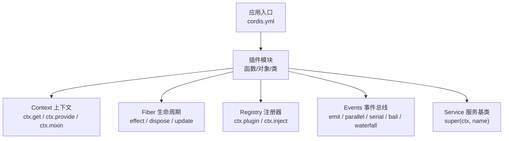
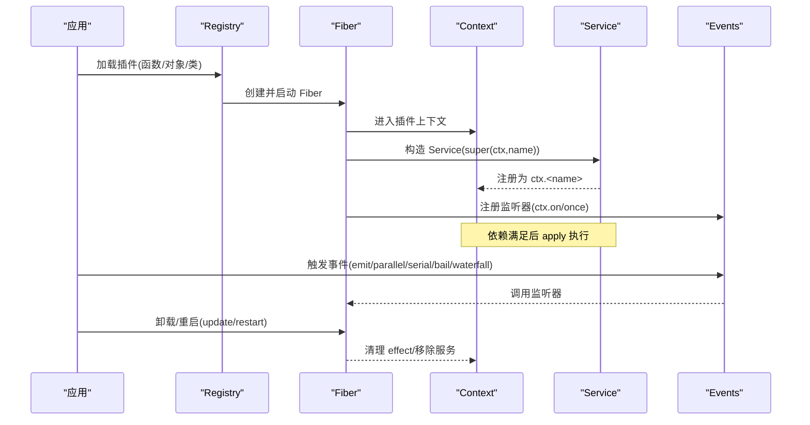
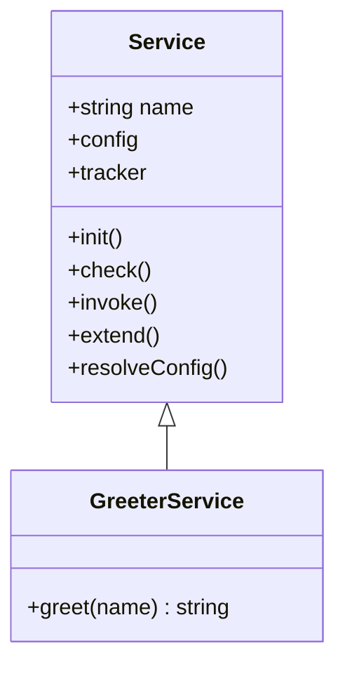
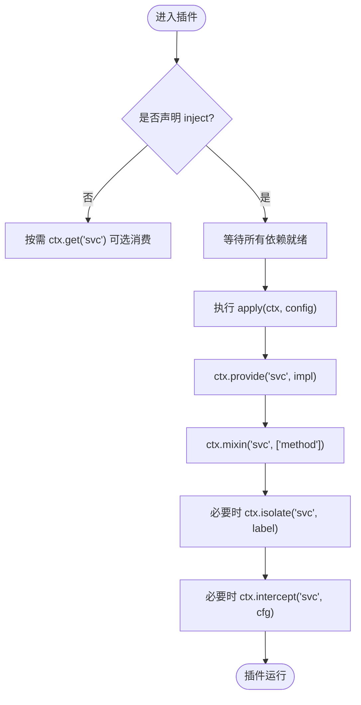
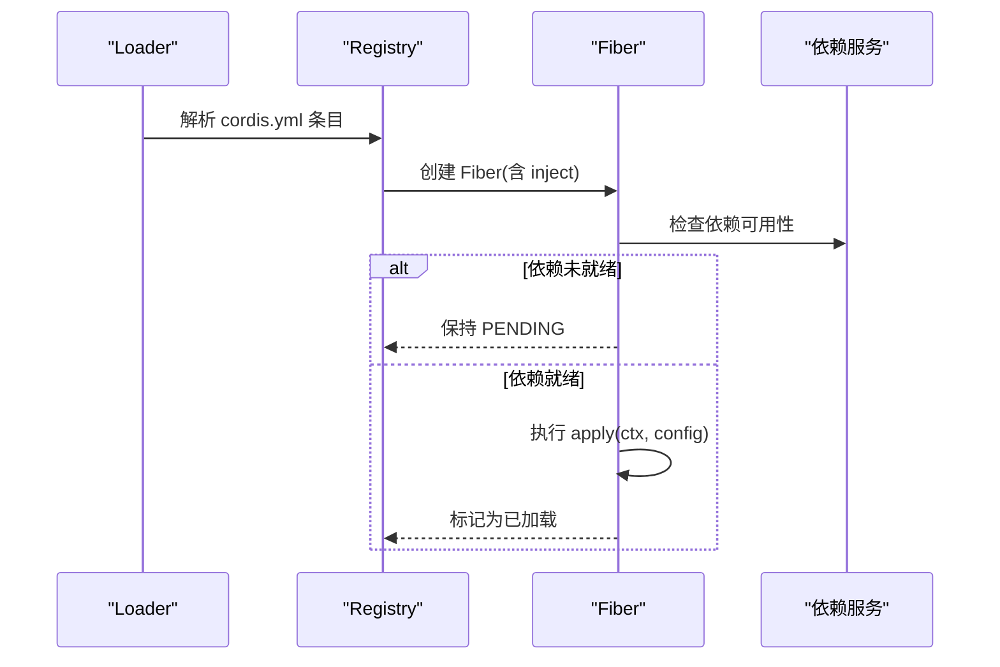
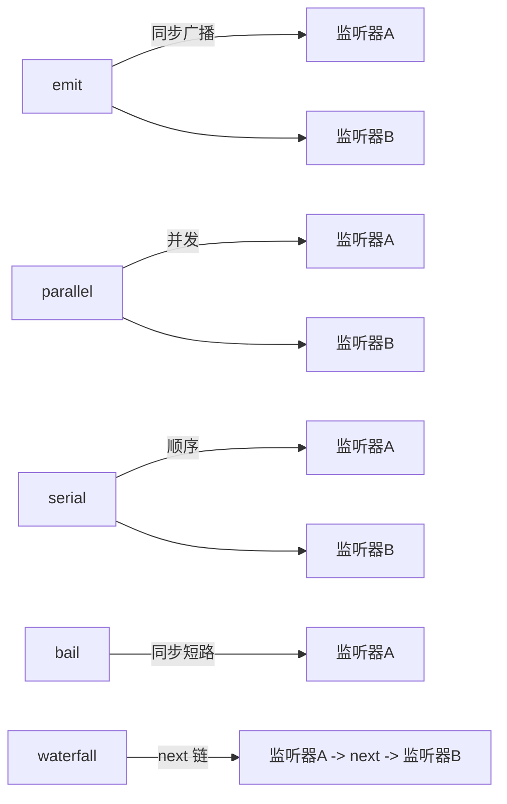
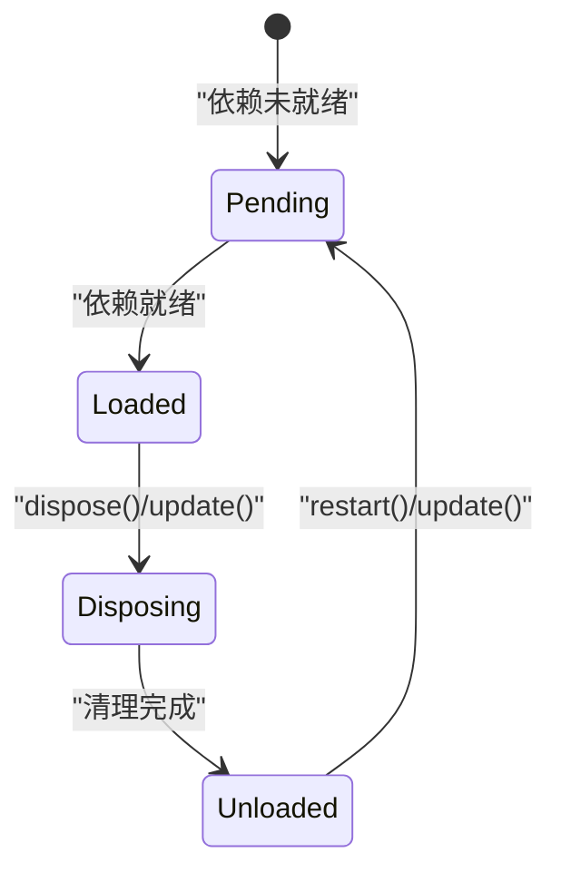
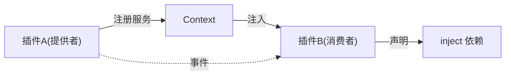

# 插件架构

<cite>
**本文引用的文件**
- [服务接口文档](file://docs/cordis-api/service.md)
- [上下文与依赖注入文档](file://docs/cordis-api/context.md)
- [事件系统文档](file://docs/cordis-api/events.md)
- [插件注册与加载文档](file://docs/cordis-api/registry.md)
- [生命周期与效果文档](file://docs/cordis-api/fiber.md)
- [Cordis 入门指南](file://docs/cordis-primer.md)
- [教程：第一个插件](file://docs/cordis-tutorial/01-first-plugin.md)
- [教程：服务与依赖](file://docs/cordis-tutorial/03-services.md)
- [教程：事件与分发模式](file://docs/cordis-tutorial/04-events.md)
- [教程：配置校验](file://docs/cordis-tutorial/05-config.md)
- [示例：Web Cordis 组合](file://examples/web-cordis/cordis.yml)
- [示例：无头代理组合](file://examples/headless-agent/cordis.yml)
</cite>

## 目录
1. [简介](#简介)
2. [项目结构](#项目结构)
3. [核心组件](#核心组件)
4. [架构总览](#架构总览)
5. [详细组件分析](#详细组件分析)
6. [依赖关系分析](#依赖关系分析)
7. [性能考量](#性能考量)
8. [故障排查指南](#故障排查指南)
9. [结论](#结论)
10. [附录](#附录)

## 简介
本文件面向 DeepSeek Harness 的插件作者，系统性讲解基于 Cordis 的插件架构。内容覆盖以下关键主题：
- Service 接口与命名服务注册
- Context 依赖注入、隔离与作用域
- 事件系统与四种分发模式（emit、waterfall、parallel、serial）
- 插件注册机制、依赖声明 inject、加载顺序控制
- ctx.inject 的工作原理与使用方式
- 生命周期管理与 effect 清理
- 初学者友好的概念解释与高级实现细节、最佳实践

## 项目结构
仓库将 Cordis 的核心 API 以“生成式文档”形式沉淀在 docs/cordis-api 下，并通过 cordis-tutorial 提供循序渐进的实践示例；examples 提供真实组合配置文件，展示插件如何被装配到应用中。

图表来源
- [插件注册与加载文档:1-153](file://docs/cordis-api/registry.md#L1-L153)
- [上下文与依赖注入文档:1-365](file://docs/cordis-api/context.md#L1-L365)
- [生命周期与效果文档:1-376](file://docs/cordis-api/fiber.md#L1-L376)
- [事件系统文档:1-208](file://docs/cordis-api/events.md#L1-L208)
- [服务接口文档:1-103](file://docs/cordis-api/service.md#L1-L103)

章节来源
- [插件注册与加载文档:1-153](file://docs/cordis-api/registry.md#L1-L153)
- [上下文与依赖注入文档:1-365](file://docs/cordis-api/context.md#L1-L365)
- [生命周期与效果文档:1-376](file://docs/cordis-api/fiber.md#L1-L376)
- [事件系统文档:1-208](file://docs/cordis-api/events.md#L1-L208)
- [服务接口文档:1-103](file://docs/cordis-api/service.md#L1-L103)

## 核心组件
- Context：依赖容器与能力访问入口，支持 extend/isolate/intercept 创建子作用域，并提供 get/provide/accessor/mixin 等反射能力。
- Fiber：插件运行实例，管理已验证配置、依赖快照、生命周期 effect 和清理。
- Registry：插件加载与依赖注入，支持函数/对象/类三种插件形态，以及 inject 依赖声明。
- Events：事件总线，提供 emit/parallel/serial/bail/waterfall 五种分发模式。
- Service：命名服务基类，通过 super(ctx, name) 自动注册为 ctx.<name>，并随 fiber 卸载而移除。

章节来源
- [上下文与依赖注入文档:1-365](file://docs/cordis-api/context.md#L1-L365)
- [生命周期与效果文档:1-376](file://docs/cordis-api/fiber.md#L1-L376)
- [插件注册与加载文档:1-153](file://docs/cordis-api/registry.md#L1-L153)
- [事件系统文档:1-208](file://docs/cordis-api/events.md#L1-L208)
- [服务接口文档:1-103](file://docs/cordis-api/service.md#L1-L103)

## 架构总览
下图展示了插件从注册到运行、再到清理的整体流程，以及各组件之间的交互关系。

图表来源
- [插件注册与加载文档:1-153](file://docs/cordis-api/registry.md#L1-L153)
- [生命周期与效果文档:1-376](file://docs/cordis-api/fiber.md#L1-L376)
- [上下文与依赖注入文档:1-365](file://docs/cordis-api/context.md#L1-L365)
- [事件系统文档:1-208](file://docs/cordis-api/events.md#L1-L208)
- [服务接口文档:1-103](file://docs/cordis-api/service.md#L1-L103)

## 详细组件分析

### Service 接口与服务注册
- 通过继承 Service 并在构造函数中调用 super(ctx, name)，即可将实例注册为 ctx.<name>。
- 服务是“可命名的能力”，消费者通过名称获取，而不直接耦合具体实现。
- 服务随所属 fiber 的生命周期自动移除，避免悬挂引用。

图表来源
- [服务接口文档:1-103](file://docs/cordis-api/service.md#L1-L103)

章节来源
- [服务接口文档:1-103](file://docs/cordis-api/service.md#L1-L103)
- [教程：服务与依赖:1-99](file://docs/cordis-tutorial/03-services.md#L1-L99)

### Context 依赖注入与作用域
- ctx.get(name)：可选读取服务，未提供时返回 undefined。
- ctx.provide(name, value)：在当前 fiber 提供实现，fiber 卸载时自动移除。
- ctx.accessor(name, hooks)：定义计算属性，受 fiber 生命周期管理。
- ctx.mixin(name, keys)：将服务的成员直接暴露到 ctx，便于短名访问。
- ctx.extend/meta：创建携带额外元数据的子上下文。
- ctx.isolate(name, label)：对指定服务建立独立作用域，便于替换实现。
- ctx.intercept(name, config)：为下游插件注入拦截配置，合并到服务解析配置中。

图表来源
- [上下文与依赖注入文档:1-365](file://docs/cordis-api/context.md#L1-L365)
- [插件注册与加载文档:1-153](file://docs/cordis-api/registry.md#L1-L153)

章节来源
- [上下文与依赖注入文档:1-365](file://docs/cordis-api/context.md#L1-L365)
- [插件注册与加载文档:1-153](file://docs/cordis-api/registry.md#L1-L153)

### 插件注册机制、依赖声明与加载顺序
- 插件形态：函数、对象（含 apply）、类（Service 子类）。
- 依赖声明：inject 可为数组或对象映射，表示硬依赖；未满足时插件保持 PENDING。
- 加载顺序：由依赖图决定，而非 cordis.yml 中的位置；当依赖变化时，受影响插件会卸载并重新加载。
- ctx.inject(deps, callback)：便捷方法，等价于创建一个需要 deps 的插件体，并在依赖变化时重跑。

图表来源
- [插件注册与加载文档:1-153](file://docs/cordis-api/registry.md#L1-L153)
- [教程：服务与依赖:1-99](file://docs/cordis-tutorial/03-services.md#L1-L99)

章节来源
- [插件注册与加载文档:1-153](file://docs/cordis-api/registry.md#L1-L153)
- [教程：服务与依赖:1-99](file://docs/cordis-tutorial/03-services.md#L1-L99)

### 事件系统与四种分发模式
- emit：同步广播，不收集返回值与 Promise。
- parallel：并发执行所有监听器，全部完成后 resolve。
- serial：按序 await，首个非空/非 false/非 undefined 返回值即停止后续。
- bail：同步版本的 serial，遇到首个“bail”值立即停止。
- waterfall：中间件风格，最后一个参数为 next；不调用 next 即为否决（veto），可用于拦截与改写。

图表来源
- [事件系统文档:1-208](file://docs/cordis-api/events.md#L1-L208)
- [教程：事件与分发模式:1-145](file://docs/cordis-tutorial/04-events.md#L1-L145)

章节来源
- [事件系统文档:1-208](file://docs/cordis-api/events.md#L1-L208)
- [教程：事件与分发模式:1-145](file://docs/cordis-tutorial/04-events.md#L1-L145)

### 生命周期管理与 effect
- ctx.effect(execute)：注册带清理的效果；返回的 disposer 会在 fiber 卸载或显式调用时按逆序执行。
- fiber.dispose：卸载插件并等待清理完成。
- fiber.update(config)：校验新配置并重启插件，先触发 internal/update 瀑布流，允许钩子否决或替换重启。
- fiber.restart：立即卸载并以当前配置重新加载。
- 错误类型：CordisError（如 INACTIVE_EFFECT）、ValidationError（配置校验失败）。

图表来源
- [生命周期与效果文档:1-376](file://docs/cordis-api/fiber.md#L1-L376)

章节来源
- [生命周期与效果文档:1-376](file://docs/cordis-api/fiber.md#L1-L376)

### 实战示例与最佳实践
- 创建插件：函数/对象/类三种形态，推荐先用函数，需要暴露服务时使用类。
- 声明依赖：使用 inject 声明硬依赖；可选依赖使用 ctx.get。
- 处理事件：根据语义选择分发模式；waterfall 用于拦截/改写，注意必须调用 next 才能传递默认行为。
- 管理生命周期：所有资源注册通过 ctx.effect 或 ctx.on，确保卸载时自动清理。
- 配置校验：导出 Config schema，保证启动前配置正确且类型安全。

章节来源
- [教程：第一个插件:1-96](file://docs/cordis-tutorial/01-first-plugin.md#L1-L96)
- [教程：服务与依赖:1-99](file://docs/cordis-tutorial/03-services.md#L1-L99)
- [教程：事件与分发模式:1-145](file://docs/cordis-tutorial/04-events.md#L1-L145)
- [教程：配置校验:1-66](file://docs/cordis-tutorial/05-config.md#L1-L66)

## 依赖关系分析
- 插件通过 inject 声明依赖，Cordis 维护依赖图，动态决定加载顺序与重加载时机。
- 服务提供者在 fiber 内注册，消费者通过 ctx 访问；若提供者卸载，依赖该服务的插件也会卸载并重载。
- 事件作为松耦合通信机制，不同子系统通过事件协作，降低耦合度。

图表来源
- [插件注册与加载文档:1-153](file://docs/cordis-api/registry.md#L1-L153)
- [上下文与依赖注入文档:1-365](file://docs/cordis-api/context.md#L1-L365)
- [事件系统文档:1-208](file://docs/cordis-api/events.md#L1-L208)

章节来源
- [插件注册与加载文档:1-153](file://docs/cordis-api/registry.md#L1-L153)
- [上下文与依赖注入文档:1-365](file://docs/cordis-api/context.md#L1-L365)
- [事件系统文档:1-208](file://docs/cordis-api/events.md#L1-L208)

## 性能考量
- 并发与串行：parallel 适合独立任务并行加速；serial 适合有顺序约束的处理链。
- 事件风暴：高频事件应谨慎使用 parallel，避免阻塞主循环；必要时节流或批处理。
- 依赖变更重加载：频繁的服务替换会导致插件卸载/重载，应尽量减少热更新频率或合并更新。
- 作用域隔离：使用 isolate 隔离同名服务，避免全局状态污染，提高可测试性与稳定性。

[本节为通用指导，不直接分析具体文件]

## 故障排查指南
- 插件未运行：检查 inject 是否满足；PENDING 状态表示依赖缺失。
- 运行时崩溃：查看 ValidationError（配置校验失败）与 CordisError（如 INACTIVE_EFFECT）。
- 事件无响应：确认事件类型与分发模式匹配；waterfall 需确保 next 被调用。
- 服务不可用：优先使用 ctx.get 做可选消费；硬依赖请放入 inject。
- 热更新异常：使用 fiber.update 或 fiber.restart 进行受控重启；关注 internal/update 钩子。

章节来源
- [生命周期与效果文档:1-376](file://docs/cordis-api/fiber.md#L1-L376)
- [事件系统文档:1-208](file://docs/cordis-api/events.md#L1-L208)
- [教程：服务与依赖:1-99](file://docs/cordis-tutorial/03-services.md#L1-L99)

## 结论
DeepSeek Harness 基于 Cordis 提供了强类型、可组合、可观测的插件体系。通过 Service、Context、Fiber、Registry 与 Events 的协同，插件可以声明式地表达依赖、优雅地管理生命周期，并以事件驱动的方式解耦协作。遵循本文的最佳实践，可以在保证稳定性的同时获得良好的扩展性与可维护性。

[本节为总结，不直接分析具体文件]

## 附录
- 快速参考
  - 插件形态：函数/对象/类
  - 依赖声明：inject 数组或对象映射
  - 事件模式：emit/parallel/serial/bail/waterfall
  - 生命周期：effect/on 注册，fiber.dispose/update/restart 管理
- 实际组合示例
  - Web 场景：通过 cordis.yml 插入宿主运行器与工具插件
  - 无头代理：组装 LLM、工作区、子代理、工具等能力

章节来源
- [示例：Web Cordis 组合:1-20](file://examples/web-cordis/cordis.yml#L1-L20)
- [示例：无头代理组合:1-166](file://examples/headless-agent/cordis.yml#L1-L166)
- [Cordis 入门指南:1-13](file://docs/cordis-primer.md#L1-L13)