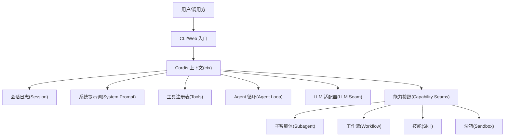
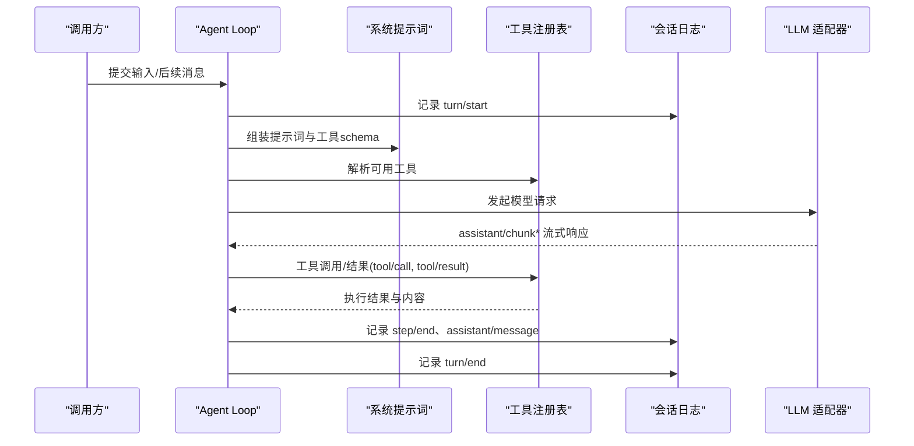
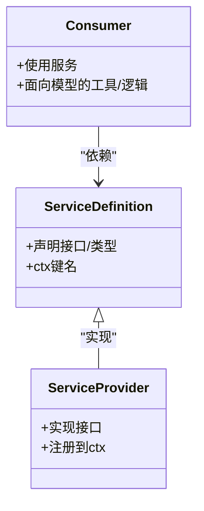
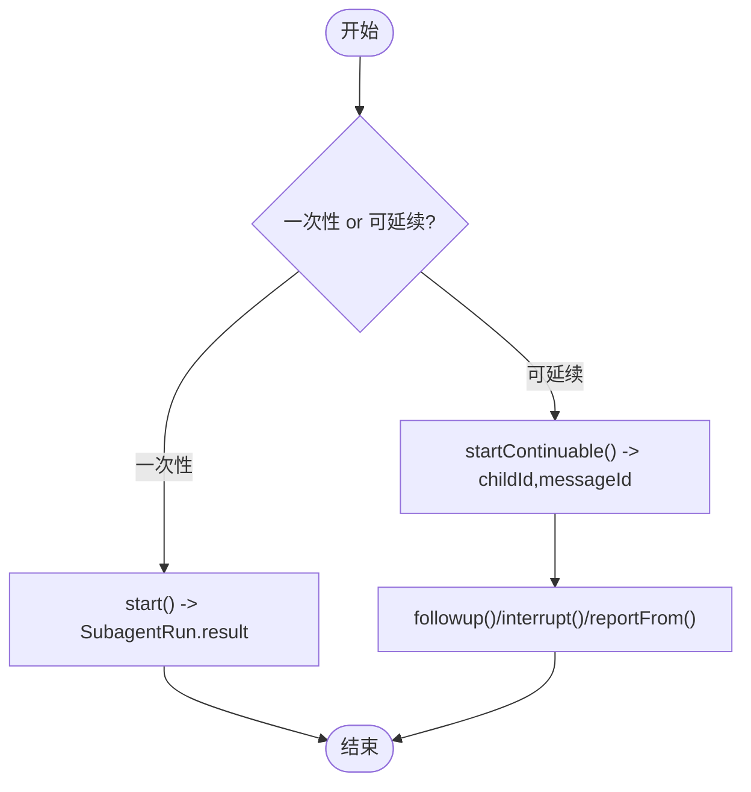
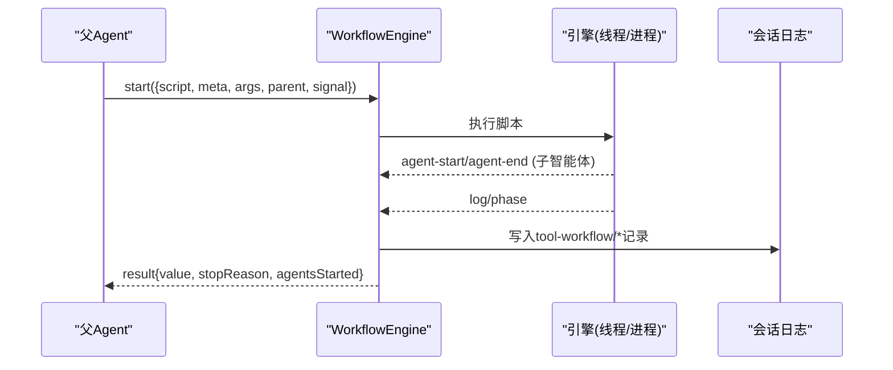
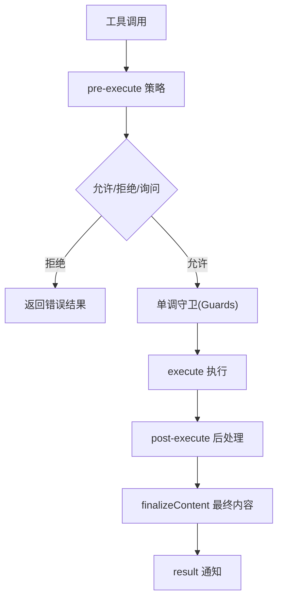
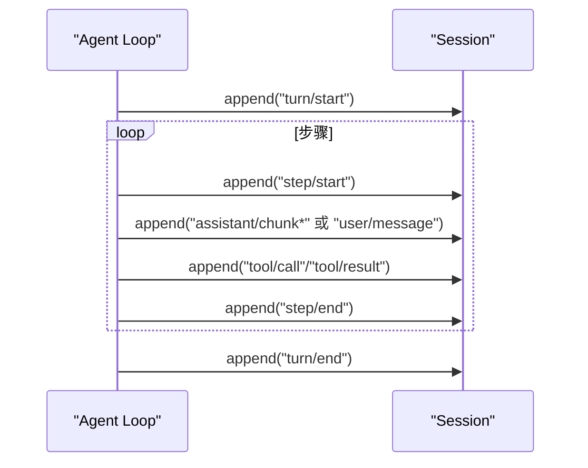
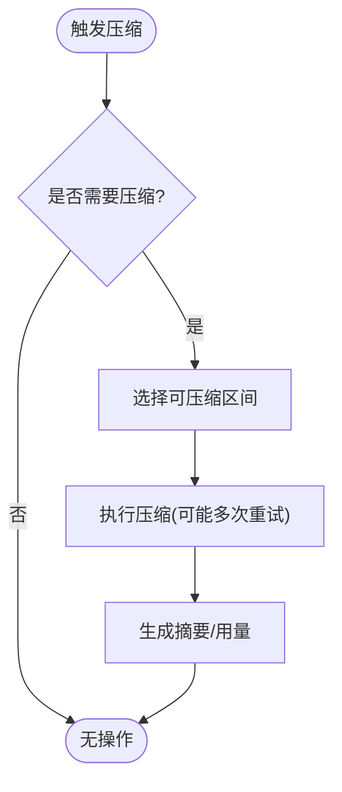
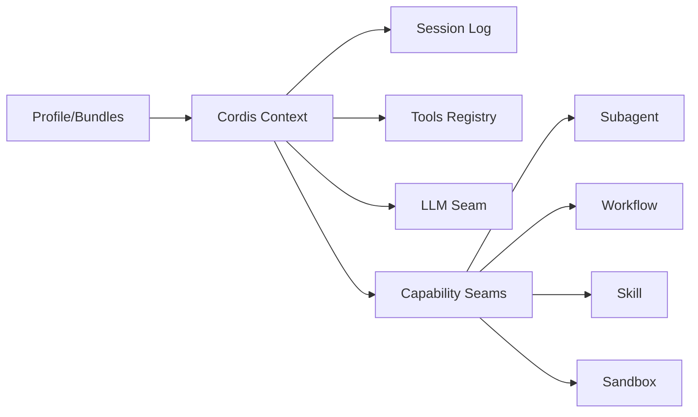

# 术语表

<cite>
**本文引用的文件**
- [README.md](file://README.md)
- [架构文档](file://docs/architecture.md)
- [术语约定](file://docs/i18n/terminology.md)
- [领域术语表（英文）](file://docs/glossary.md)
- [领域术语表（中文）](file://docs/glossary.zh.md)
- [核心子系统](file://docs/subsystems/core.md)
- [工具子系统](file://docs/subsystems/tools.md)
- [子智能体子系统](file://docs/subsystems/subagent.md)
- [工作流子系统](file://docs/subsystems/workflow.md)
- [技能子系统](file://docs/subsystems/skills.md)
- [沙箱子系统](file://docs/subsystems/sandbox.md)
- [会话日志与循环流程](file://packages/core/agent-loop/src/agent.ts)
- [压缩子系统（基础实现）](file://packages/compaction/compaction-basic/src/index.ts)
- [压缩契约（抽象）](file://packages/compaction/compaction/src/index.ts)
</cite>

## 目录
1. [简介](#简介)
2. [项目结构](#项目结构)
3. [核心组件](#核心组件)
4. [架构总览](#架构总览)
5. [详细组件分析](#详细组件分析)
6. [依赖关系分析](#依赖关系分析)
7. [性能考量](#性能考量)
8. [故障排查指南](#故障排查指南)
9. [结论](#结论)
10. [附录：常用缩写与中英对照](#附录：常用缩写与中英对照)

## 简介
本术语表面向 DeepSeek Harness（简称 dsh）开发者与维护者，系统化整理并解释项目中的技术、业务与架构术语，提供中英文对照、使用场景、相关概念与层次关系，帮助读者快速建立对项目的完整认知。内容基于仓库现有文档与源码说明提炼而成，确保术语定义与实现一致。

## 项目结构
DeepSeek Harness 采用“一切皆插件”的架构，基于 Cordis 框架将模型适配、工具注册、会话日志、Agent 循环等全部以插件形式组合。运行期由 profile 与 bundle 分层装配，支持通过 patch 覆盖或扩展任意行配置。

图表来源
- [架构文档:9-27](file://docs/architecture.md#L9-L27)
- [核心子系统:9-18](file://docs/subsystems/core.md#L9-L18)

章节来源
- [README.md:5-11](file://README.md#L5-L11)
- [架构文档:9-37](file://docs/architecture.md#L9-L37)

## 核心组件
- Agent 与 Agent Loop：Agent 是对外暴露的控制句柄；Agent Loop 是默认驱动，负责轮次与步骤调度、消息注入、工具执行与会话事件追加。
- Session（会话日志）：append-only 的事件源，所有模型可见输入均落盘，保证可回放、可恢复、可投影。
- Tools（工具）：注册表 + 执行流水线，包含参数 schema、输出 schema、UI 呈现、策略拦截与并发控制。
- LLM Seam（大模型适配）：消息与流式协议词汇 + 适配器注册，屏蔽不同模型提供方差异。
- Capability Seams（能力接缝）：Service Definition / Service Provider / Consumer 三角色组成的可替换能力，如 Subagent、Workflow、Skill、Sandbox 等。

章节来源
- [核心子系统:9-18](file://docs/subsystems/core.md#L9-L18)
- [工具子系统:9-12](file://docs/subsystems/tools.md#L9-L12)
- [架构文档:99-103](file://docs/architecture.md#L99-L103)

## 架构总览
下图展示一次典型“轮次—步骤”的执行序列，体现会话日志、系统提示词、工具执行与 LLM 流的协作。

图表来源
- [架构文档:63-89](file://docs/architecture.md#L63-L89)
- [核心子系统:244-249](file://docs/subsystems/core.md#L244-L249)

章节来源
- [架构文档:63-90](file://docs/architecture.md#L63-L90)

## 详细组件分析

### 能力接缝（Capability Seam）
- 定义：一个可替换能力的整体，包含三种角色——Service Definition（服务定义）、Service Provider（提供方）、Consumer（消费方）。单一角色不是 seam。
- 作用：通过统一接口替换具体实现，如 Shell、LLM、Subagent、Workflow、Skill、Sandbox 等。
- 示例：`packages/shell` 中 `dsh-shell` 为 Service Definition，`dsh-bash-local`/`dsh-bash-sandbox` 为提供方，`dsh-tool-bash` 为消费方。

图表来源
- [领域术语表（英文）:7-9](file://docs/glossary.md#L7-L9)
- [领域术语表（中文）:7-9](file://docs/glossary.zh.md#L7-L9)
- [架构文档:99-103](file://docs/architecture.md#L99-L103)

章节来源
- [领域术语表（英文）:7-9](file://docs/glossary.md#L7-L9)
- [领域术语表（中文）:7-9](file://docs/glossary.zh.md#L7-L9)
- [架构文档:99-103](file://docs/architecture.md#L99-L103)

### 子智能体（Subagent）
- 职责：允许 Agent 委派工作给子 Agent，支持一次性启动与可延续（continuable）两种模式。
- 关键概念：
  - 一次性启动（One-shot）：返回 `SubagentRun`，等待 `result` 并 dispose。
  - 可延续子智能体（Continuable）：持久化子会话，有 Activation 生命周期，支持 followup/interrupt/report。
  - 能力发现：start-time capabilities 与可选 `prepareContinuable` 方法作为能力门控。
  - 枚举与身份：`listChildren`/`listDescendants` 基于会话存储与投影，提供冷/热路径读取。
- 事件：`subagent/start`、`subagent/end` 等观察型事件。

图表来源
- [子智能体子系统:11-16](file://docs/subsystems/subagent.md#L11-L16)
- [子智能体子系统:114-144](file://docs/subsystems/subagent.md#L114-L144)
- [子智能体子系统:287-291](file://docs/subsystems/subagent.md#L287-L291)

章节来源
- [子智能体子系统:11-16](file://docs/subsystems/subagent.md#L11-L16)
- [子智能体子系统:114-144](file://docs/subsystems/subagent.md#L114-L144)
- [子智能体子系统:287-291](file://docs/subsystems/subagent.md#L287-L291)

### 工作流（Workflow）
- 职责：让 Agent 运行由模型编写的编排脚本，启动多个子智能体，并以结构化方式产出结果。
- 关键概念：
  - 启动请求：`WorkflowStartRequest`（script/meta/args/parent/signal 等）。
  - 元数据：`WorkflowMeta`（name/description/phases 等）。
  - 结果：`WorkflowResult`（value/stopReason/error/agentsStarted）。
  - 运行句柄：`WorkflowRun`（id/meta/result/cancel/dispose）。
  - 事件：`workflow/start`、`workflow/phase`、`workflow/log`、`workflow/agent-start`、`workflow/agent-end`、`workflow/end`。
- 安全与失败：`WorkflowError.fatal` 用于钩子误用等致命错误，组合器会重抛而非吞掉。

图表来源
- [工作流子系统:11-37](file://docs/subsystems/workflow.md#L11-L37)
- [工作流子系统:63-91](file://docs/subsystems/workflow.md#L63-L91)
- [工作流子系统:93-128](file://docs/subsystems/workflow.md#L93-L128)

章节来源
- [工作流子系统:11-37](file://docs/subsystems/workflow.md#L11-L37)
- [工作流子系统:63-91](file://docs/subsystems/workflow.md#L63-L91)
- [工作流子系统:93-128](file://docs/subsystems/workflow.md#L93-L128)

### 技能（Skills）
- 职责：提供可选指令集合，通过 `ctx.skills` 注册表合并本地/随包/远程提供方目录，消费方暴露 `skill` 工具。
- 关键点：注册同步，远程初始化在 `list()` 中 await；候选项只读借用，语义字段校验。

章节来源
- [技能子系统:1-11](file://docs/subsystems/skills.md#L1-L11)

### 沙箱（Sandbox）
- 职责：为受限执行提供边界策略，决定文件/内核访问范围，避免共享世界带来的风险。
- 关键点：`ctx.sandboxPolicy.resolve()` 接受当前会话与显式模式覆盖；策略按调用携带，不固定于提供方状态。

章节来源
- [沙箱子系统:67-94](file://docs/subsystems/sandbox.md#L67-L94)

### 工具（Tools）
- 职责：注册表 + 执行流水线，提供参数/输出 schema、UI 呈现、策略拦截、并发控制与结果规范化。
- 关键点：
  - `ToolDefinition`：包含 schema、execute、output、UI presenters 等。
  - 执行管线：`tools/pre-execute` → guards → `tools/execute` → `tools/post-execute` → finalizeContent → `tools/result`。
  - 并发模式：parallel/exclusive，由 `isConcurrencySafe` 分类。
  - UI 呈现：`presentCall`/`presentResult` 返回中性视图意图，供客户端渲染。

图表来源
- [工具子系统:9-12](file://docs/subsystems/tools.md#L9-L12)
- [工具子系统:170-173](file://docs/subsystems/tools.md#L170-L173)
- [工具子系统:459-468](file://docs/subsystems/tools.md#L459-L468)

章节来源
- [工具子系统:9-12](file://docs/subsystems/tools.md#L9-L12)
- [工具子系统:170-173](file://docs/subsystems/tools.md#L170-L173)
- [工具子系统:459-468](file://docs/subsystems/tools.md#L459-L468)

### 会话与循环层级（Turn/Step/Round）
- 轮次（Turn）：会话中对已接纳输入的排空过程，在模型及其工具停止或终止策略介入后结束。
- 步骤（Step）：一次模型请求及由其引发的工具执行；一个轮次包含零或多个步骤。
- Round：外层策略迭代（如 Goal Round、Ralph Round），计数器归该策略所有。

图表来源
- [架构文档:63-89](file://docs/architecture.md#L63-L89)
- [核心子系统:244-249](file://docs/subsystems/core.md#L244-L249)
- [会话循环代码片段:245-281](file://packages/core/agent-loop/src/agent.ts#L245-L281)

章节来源
- [架构文档:63-89](file://docs/architecture.md#L63-L89)
- [核心子系统:244-249](file://docs/subsystems/core.md#L244-L249)
- [会话循环代码片段:245-281](file://packages/core/agent-loop/src/agent.ts#L245-L281)

### 压缩（Compaction）
- 职责：在上下文压力或溢出时，对会话表面区域进行压缩，减少 token 占用并保持可回放性。
- 关键点：
  - 抽象契约：`compactIfNeeded` 触发自动压缩，支持压力/溢出策略。
  - 基础实现：`BasicCompactionEngine`，支持阈值、保留比例、重试、模型策略等。
  - 事件：`compaction/start`、`compaction/summary`、`compaction/end`。

图表来源
- [压缩契约（抽象）:101-117](file://packages/compaction/compaction/src/index.ts#L101-L117)
- [压缩子系统（基础实现）:106-129](file://packages/compaction/compaction-basic/src/index.ts#L106-L129)
- [压缩子系统（基础实现）:360-394](file://packages/compaction/compaction-basic/src/index.ts#L360-L394)

章节来源
- [压缩契约（抽象）:101-117](file://packages/compaction/compaction/src/index.ts#L101-L117)
- [压缩子系统（基础实现）:106-129](file://packages/compaction/compaction-basic/src/index.ts#L106-L129)
- [压缩子系统（基础实现）:360-394](file://packages/compaction/compaction-basic/src/index.ts#L360-L394)

## 依赖关系分析
- 插件树：profile/bundle 分层装配，patch 可覆盖任意行。
- 能力接缝：每个能力以 Service Definition/Provider/Consumer 解耦，便于替换与演进。
- 事件驱动：session/agent/tool 三类事件构成扩展点，避免直接耦合。
- 会话日志：所有模型可见事实必须可重建，保证回放与恢复一致性。

图表来源
- [架构文档:15-27](file://docs/architecture.md#L15-L27)
- [架构文档:53-61](file://docs/architecture.md#L53-L61)
- [架构文档:99-103](file://docs/architecture.md#L99-L103)

章节来源
- [架构文档:15-27](file://docs/architecture.md#L15-L27)
- [架构文档:53-61](file://docs/architecture.md#L53-L61)
- [架构文档:99-103](file://docs/architecture.md#L99-L103)

## 性能考量
- 工具并发：通过 `isConcurrencySafe` 将可并行工具分组执行，提升吞吐。
- 压缩策略：根据阈值与保留比例选择压缩区间，降低上下文压力。
- 事件与日志：仅追加的会话日志利于回放与恢复，但需关注写入与压缩成本。
- 取消信号：贯穿执行链路的 `AbortSignal` 保障及时释放资源。

[本节为通用指导，无需特定文件引用]

## 故障排查指南
- 工具失败：未知工具或非法参数会映射为结构化错误（如 `UNKNOWN_TOOL`、`INVALID_ARGS`），不会中断整个轮次。
- 压缩冲突：并发手动/自动压缩会被互斥，避免损坏会话一致性。
- 子智能体授权：中断与报告需要精确的父级授权，否则拒绝。
- 工作流致命错误：钩子误用等致命错误会立即终止脚本，避免静默降级。

章节来源
- [工具子系统:406-408](file://docs/subsystems/tools.md#L406-L408)
- [压缩测试用例（并发互斥）:846-851](file://packages/compaction/compaction-basic/tests/manual-compaction.spec.ts#L846-L851)
- [子智能体子系统:140-144](file://docs/subsystems/subagent.md#L140-L144)
- [工作流子系统:114-117](file://docs/subsystems/workflow.md#L114-L117)

## 结论
本术语表围绕 DeepSeek Harness 的核心概念（Agent/Loop、Session、Tools、LLM Seam、Capability Seams）展开，结合子智能体、工作流、技能、沙箱等能力，构建了统一的术语体系。通过中英文对照与图示，帮助开发者快速理解各组件的职责、交互与约束，并在实际开发中正确选用与扩展能力。

[本节为总结，无需特定文件引用]

## 附录：常用缩写与中英对照
以下缩写在仓库中保持英文书写，首次出现时可附中文注释。

- ACP：Agent Client Protocol
- AI：人工智能
- API：应用程序编程接口
- CI：持续集成
- CLI：命令行界面
- e2e：端到端测试
- HMR：热模块替换
- JSON Schema：JSON 模式
- JSONL：JSON Lines
- LLM：大语言模型
- MCP：Model Context Protocol
- PR：Pull Request
- RAG：检索增强生成
- SDK：软件开发工具包（指受支持的 Python 与 TypeScript SDK 所使用的 JSON-RPC 客户端/服务器协议；项目本身不是 SDK）
- SSE：Server-Sent Events

章节来源
- [术语约定:11-30](file://docs/i18n/terminology.md#L11-L30)