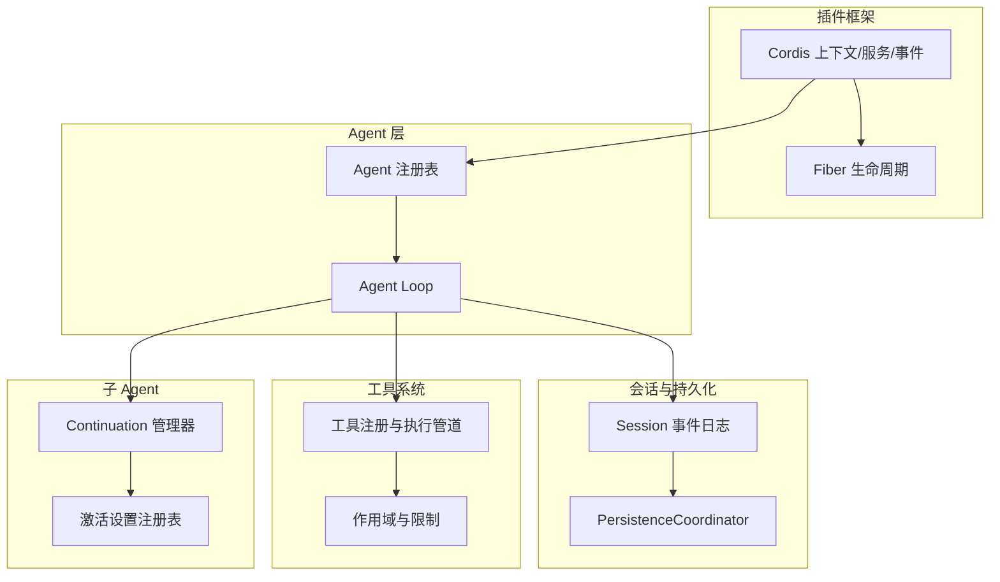
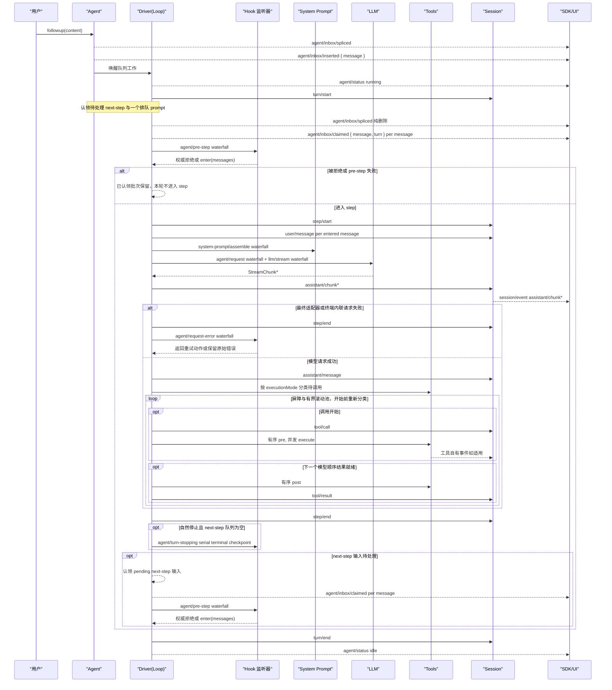
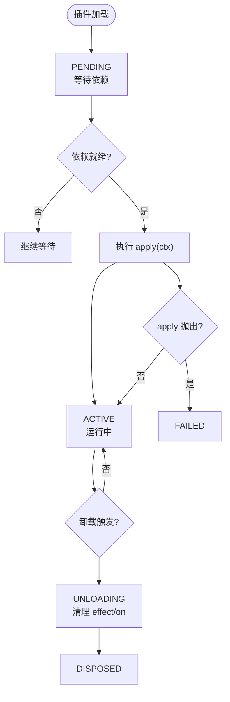
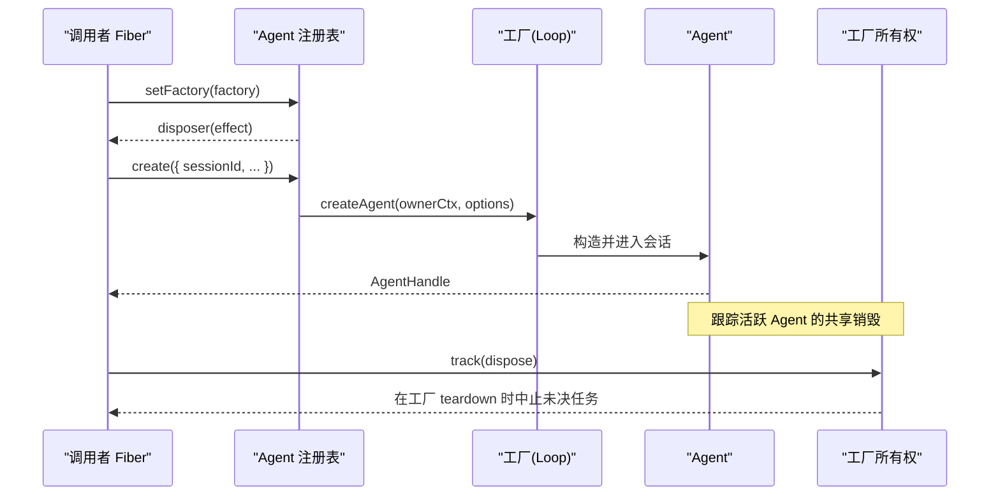
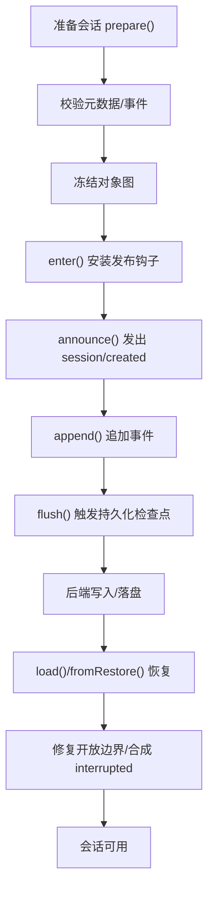
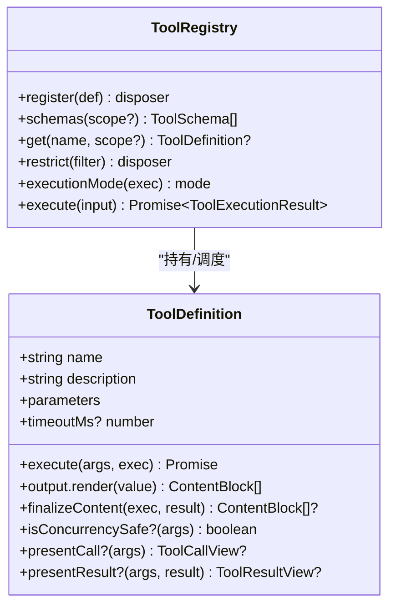
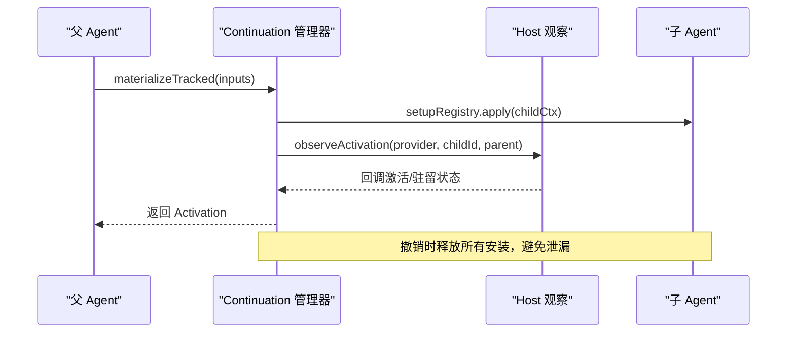
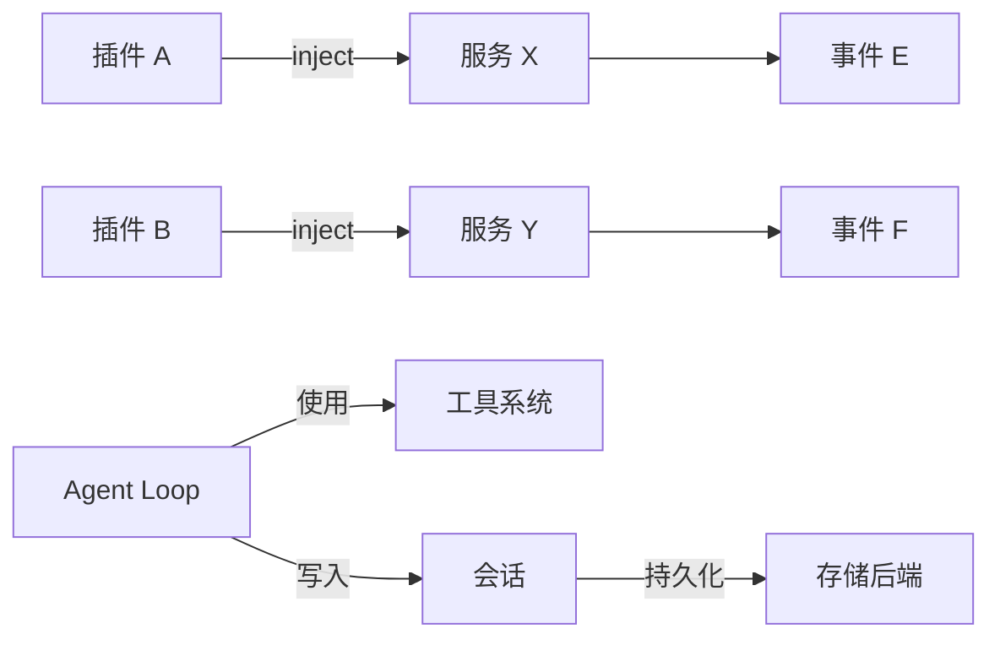

# 核心概念

<cite>
**本文引用的文件**
- [cordis-primer.md](file://docs/cordis-primer.md)
- [01-first-plugin.md](file://docs/cordis-tutorial/01-first-plugin.md)
- [02-lifecycle-and-effects.md](file://docs/cordis-tutorial/02-lifecycle-and-effects.md)
- [03-services.md](file://docs/cordis-tutorial/03-services.md)
- [fiber.zh.md](file://docs/cordis-api/fiber.zh.md)
- [agent-lifecycle.md](file://docs/agent-lifecycle.md)
- [tools.md](file://docs/subsystems/tools.md)
- [session.md](file://docs/subsystems/session.md)
- [persistence.zh.md](file://docs/subsystems/persistence.zh.md)
- [index.ts（Agent 注册表）](file://packages/core/agent/src/index.ts)
- [index.ts（Agent Loop）](file://packages/core/agent-loop/src/index.ts)
- [index.ts（工具系统）](file://packages/core/tools/src/index.ts)
- [guard.ts（沙箱工具门面）](file://packages/extensions/cordis-host-runner/src/guard.ts)
- [continuation.ts（子 Agent 延续）](file://packages/subagent/subagent/src/continuation.ts)
- [activation-setup-registry.ts（激活设置注册表）](file://packages/subagent/subagent/src/activation-setup-registry.ts)
</cite>

## 目录
1. [简介](#简介)
2. [项目结构](#项目结构)
3. [核心组件](#核心组件)
4. [架构总览](#架构总览)
5. [详细组件分析](#详细组件分析)
6. [依赖关系分析](#依赖关系分析)
7. [性能考量](#性能考量)
8. [故障排查指南](#故障排查指南)
9. [结论](#结论)
10. [附录](#附录)

## 简介
本文件面向初学者与高级用户，系统化阐述 DeepSeek Harness 的核心概念：插件架构、Agent 生命周期、会话管理与持久化恢复、工具系统与范围隔离机制，以及 Cordis 框架的插件注册、生命周期钩子和依赖注入。文档以仓库中的源码与官方文档为依据，提供可追溯的代码级引用与图示，帮助读者从“是什么”到“怎么做”再到“为什么这样设计”。

## 项目结构
DeepSeek Harness 采用多包协作的模块化架构：
- Cordis 插件框架：负责插件加载、上下文、服务发现、事件分发与生命周期管理。
- Agent 与 Agent Loop：负责 Agent 创建、运行循环、步骤调度与状态推进。
- Session：事件溯源的会话模型，承载消息历史、请求头、路由上下文等。
- Tools：工具注册、执行管道、范围限制与 UI 呈现契约。
- Persistence：会话持久化协调器与后端抽象，支持冷启动恢复与热插拔。
- Subagent：子 Agent 的延续、驻留与能力装配。

图表来源
- [cordis-primer.md:7-13](file://docs/cordis-primer.md#L7-L13)
- [fiber.zh.md:82-146](file://docs/cordis-api/fiber.zh.md#L82-L146)
- [index.ts（Agent 注册表）:360-415](file://packages/core/agent/src/index.ts#L360-L415)
- [index.ts（Agent Loop）:39-73](file://packages/core/agent-loop/src/index.ts#L39-L73)
- [session.md:1-12](file://docs/subsystems/session.md#L1-L12)
- [persistence.zh.md:143-175](file://docs/subsystems/persistence.zh.md#L143-L175)
- [tools.md:9-152](file://docs/subsystems/tools.md#L9-L152)
- [continuation.ts:981-1007](file://packages/subagent/subagent/src/continuation.ts#L981-L1007)
- [activation-setup-registry.ts:1-33](file://packages/subagent/subagent/src/activation-setup-registry.ts#L1-L33)

章节来源
- [cordis-primer.md:7-13](file://docs/cordis-primer.md#L7-L13)
- [01-first-plugin.md:23-51](file://docs/cordis-tutorial/01-first-plugin.md#L23-L51)

## 核心组件
- Cordis 插件与上下文：插件通过 `apply(ctx)` 贡献能力；`ctx` 是服务容器，支持 `inject` 声明依赖、`effect` 管理副作用、`on/waterfall/parallel/serial` 事件分发。
- Fiber 生命周期：每个插件拥有 Fiber，状态机为 PENDING → LOADING → ACTIVE → UNLOADING → DISPOSED，失败路径为 FAILED。
- Agent 注册表与工厂：通过 `setFactory` 注册创建/恢复代理，统一入口 `create/resume`，绑定调用者上下文与所有权。
- Agent Loop：驱动 turn/step 推进、工具调用、LLM 流式输出与会话事件写入。
- Session：事件溯源的不可变日志，提供表面投影、请求头折叠、路由上下文、fork 与 flush。
- Tools：注册、执行管道、前置/后置策略、守卫、作用域限制与 UI 呈现契约。
- 持久化：协调器统一编排写路径、恢复、HMR 安全与 dispose 排空。
- 子 Agent：延续管理器负责驻留/冷恢复、能力装配与权限委派。

章节来源
- [02-lifecycle-and-effects.md:1-60](file://docs/cordis-tutorial/02-lifecycle-and-effects.md#L1-L60)
- [fiber.zh.md:82-146](file://docs/cordis-api/fiber.zh.md#L82-L146)
- [index.ts（Agent 注册表）:360-415](file://packages/core/agent/src/index.ts#L360-L415)
- [agent-lifecycle.md:4-83](file://docs/agent-lifecycle.md#L4-L83)
- [session.md:1-12](file://docs/subsystems/session.md#L1-L12)
- [tools.md:9-152](file://docs/subsystems/tools.md#L9-L152)
- [persistence.zh.md:143-175](file://docs/subsystems/persistence.zh.md#L143-L175)
- [continuation.ts:981-1007](file://packages/subagent/subagent/src/continuation.ts#L981-L1007)

## 架构总览
下图展示从用户输入到 Agent 执行、工具调用、会话持久化的端到端流程，并标注关键事件与阶段。

图表来源
- [agent-lifecycle.md:8-83](file://docs/agent-lifecycle.md#L8-L83)

章节来源
- [agent-lifecycle.md:4-83](file://docs/agent-lifecycle.md#L4-L83)

## 详细组件分析

### Cordis 插件架构与生命周期
- 插件形态：函数、对象、类（Service 子类）。
- 依赖注入：通过 `inject` 声明所需服务，等待依赖就绪再加载。
- 副作用管理：通过 `ctx.effect()` 注册清理器，卸载时自动回滚。
- 事件分发：emit、waterfall、parallel、serial 四种模式，用于观察、包装、扇出与顺序执行。
- Fiber 状态机：PENDING → LOADING → ACTIVE → UNLOADING → DISPOSED，异常路径为 FAILED。

图表来源
- [02-lifecycle-and-effects.md:1-60](file://docs/cordis-tutorial/02-lifecycle-and-effects.md#L1-L60)
- [fiber.zh.md:82-146](file://docs/cordis-api/fiber.zh.md#L82-L146)
- [03-services.md:44-79](file://docs/cordis-tutorial/03-services.md#L44-L79)

章节来源
- [01-first-plugin.md:23-51](file://docs/cordis-tutorial/01-first-plugin.md#L23-L51)
- [02-lifecycle-and-effects.md:1-60](file://docs/cordis-tutorial/02-lifecycle-and-effects.md#L1-L60)
- [03-services.md:44-79](file://docs/cordis-tutorial/03-services.md#L44-L79)
- [cordis-primer.md:7-13](file://docs/cordis-primer.md#L7-L13)

### Agent 创建、配置、运行与销毁
- 工厂注册：通过 `agents.setFactory(factory)` 注册创建/恢复代理，受 Effect 管理，HMR 安全。
- 创建/恢复：`agents.create(options)` / `agents.resume(options)` 在调用者上下文中追踪所有权。
- 运行循环：Agent Loop 驱动 turn/step，组装提示词、调用 LLM、执行工具、写入会话事件。
- 销毁：当所属 Fiber 卸载或工厂 teardown 时，通过 AbortController 取消未完成的工作，确保资源释放。

图表来源
- [index.ts（Agent 注册表）:360-415](file://packages/core/agent/src/index.ts#L360-L415)
- [index.ts（Agent Loop）:39-73](file://packages/core/agent-loop/src/index.ts#L39-L73)

章节来源
- [index.ts（Agent 注册表）:360-415](file://packages/core/agent/src/index.ts#L360-L415)
- [index.ts（Agent Loop）:39-73](file://packages/core/agent-loop/src/index.ts#L39-L73)
- [agent-lifecycle.md:4-83](file://docs/agent-lifecycle.md#L4-L83)

### 会话状态管理、持久化与恢复
- 会话模型：事件溯源的 append-only 日志，包含 turn/step、消息、工具调用、请求头等。
- 表面投影：仅消息型事件参与派生历史，支持 replace 操作实现压缩与覆盖。
- 持久化协调器：统一编排 write-behind、按 id 串行、HMR 种子注入与 dispose 排空。
- 恢复机制：prepare/fromRestore 接收新鲜 detached 数据，验证冻结后发布；冷恢复时合成 interrupted 原因关闭孤儿 turn。

图表来源
- [session.md:359-519](file://docs/subsystems/session.md#L359-L519)
- [persistence.zh.md:143-175](file://docs/subsystems/persistence.zh.md#L143-L175)

章节来源
- [session.md:1-12](file://docs/subsystems/session.md#L1-L12)
- [session.md:359-519](file://docs/subsystems/session.md#L359-L519)
- [persistence.zh.md:143-175](file://docs/subsystems/persistence.zh.md#L143-L175)

### 工具系统与作用域隔离
- 工具定义：ToolDefinition 包含 schema、execute、output 渲染、可选 finalizeContent、超时与并发安全标记。
- 执行管道：pre-execute → guards → execute → post-execute → finalizeContent → result，支持 around-dispatch 包装。
- 作用域与限制：scope 链继承全局工具，可通过 restrict 允许/拒绝列表过滤；本地注册不受限制影响。
- 沙箱门面：只暴露 schemas/get 等只读视图，防止绕过 ToolRuntime.execute 直接调用执行函数。

图表来源
- [tools.md:9-152](file://docs/subsystems/tools.md#L9-L152)
- [tools.md:153-172](file://docs/subsystems/tools.md#L153-L172)
- [guard.ts:639-655](file://packages/extensions/cordis-host-runner/src/guard.ts#L639-L655)

章节来源
- [tools.md:9-152](file://docs/subsystems/tools.md#L9-L152)
- [tools.md:153-172](file://docs/subsystems/tools.md#L153-L172)
- [guard.ts:639-655](file://packages/extensions/cordis-host-runner/src/guard.ts#L639-L655)

### 子 Agent 的延续与能力装配
- 延续管理器：对常驻子 Agent 进行材料化，维护父链路、委托策略与宿主观察。
- 能力装配：通过 Activation Setup Registry 将部署能力组合进子 Agent 的未发布上下文，并在撤销时正确释放。
- 冷恢复：缺失的子 Agent 通过持久化 Session 冷恢复，保证消息顺序与一致性。

图表来源
- [continuation.ts:981-1007](file://packages/subagent/subagent/src/continuation.ts#L981-L1007)
- [activation-setup-registry.ts:1-33](file://packages/subagent/subagent/src/activation-setup-registry.ts#L1-L33)

章节来源
- [continuation.ts:981-1007](file://packages/subagent/subagent/src/continuation.ts#L981-L1007)
- [activation-setup-registry.ts:1-33](file://packages/subagent/subagent/src/activation-setup-registry.ts#L1-L33)

## 依赖关系分析
- 插件间耦合：通过服务名解耦，消费者仅依赖接口键（如 tools、llm、sessions），便于替换实现。
- 生命周期耦合：Effect 与 Fiber 卸载保证资源回收；Agent Loop 与 Session 通过事件解耦。
- 外部依赖：LLM 适配器、存储后端、UI 桥接均通过服务/事件接入，保持核心稳定。

图表来源
- [03-services.md:44-79](file://docs/cordis-tutorial/03-services.md#L44-L79)
- [tools.md:9-152](file://docs/subsystems/tools.md#L9-L152)
- [session.md:1-12](file://docs/subsystems/session.md#L1-L12)

章节来源
- [03-services.md:44-79](file://docs/cordis-tutorial/03-services.md#L44-L79)
- [tools.md:9-152](file://docs/subsystems/tools.md#L9-L152)
- [session.md:1-12](file://docs/subsystems/session.md#L1-L12)

## 性能考量
- 事件溯源：会话以 append-only 日志记录，避免复杂状态同步成本；派生历史按需计算并缓存。
- 工具并行：通过 `isConcurrencySafe` 与执行模式（parallel/exclusive）形成屏障与滚动池，提升吞吐。
- 持久化协调：write-behind 与按 id 串行减少竞争；HMR 安全确保热更新不影响运行态。
- 流式输出：LLM 流式 chunk 即时写入会话，降低延迟。

[本节为通用指导，无需特定文件引用]

## 故障排查指南
- 插件加载失败：检查模块解析拼写与依赖是否就绪；应用抛错会终止进程，需查看日志。
- 服务缺失：若 inject 的服务消失，依赖插件会自动卸载并等待恢复；确认提供者是否正确挂载。
- 工具调用失败：检查 pre-execute 策略、守卫与可见性限制；未知工具会返回 UNKNOWN_TOOL。
- 会话恢复异常：确认事件连续性、JSON 可序列化与 surface 约束；崩溃恢复会合成 interrupted 原因。
- 子 Agent 冷恢复：确保宿主观察与委托策略正确装配；消息顺序由唯一收件箱保证。

章节来源
- [01-first-plugin.md:79-93](file://docs/cordis-tutorial/01-first-plugin.md#L79-L93)
- [03-services.md:74-79](file://docs/cordis-tutorial/03-services.md#L74-L79)
- [tools.md:170-172](file://docs/subsystems/tools.md#L170-L172)
- [session.md:540-589](file://docs/subsystems/session.md#L540-L589)
- [continuation.ts:981-1007](file://packages/subagent/subagent/src/continuation.ts#L981-L1007)

## 结论
DeepSeek Harness 以 Cordis 插件框架为基础，通过服务化与事件驱动构建可扩展的 Agent 运行时。Agent Loop 统一管理 turn/step 推进，Session 作为单一事实源保障可回放与恢复，Tools 提供安全的执行管道与范围隔离，Persistence 协调器确保一致性与健壮性。理解这些核心概念有助于快速上手扩展与定制。

[本节为总结，无需特定文件引用]

## 附录
- 初学者建议：从第一个插件开始，逐步掌握 effect、inject、事件与工具注册。
- 高级实践：利用 waterfalls 做策略拦截，结合 persist 与 fork 实现复杂工作流。
- 参考路径：
  - 插件入门与生命周期：[01-first-plugin.md](file://docs/cordis-tutorial/01-first-plugin.md)、[02-lifecycle-and-effects.md](file://docs/cordis-tutorial/02-lifecycle-and-effects.md)
  - 服务与依赖注入：[03-services.md](file://docs/cordis-tutorial/03-services.md)
  - Agent 生命周期：[agent-lifecycle.md](file://docs/agent-lifecycle.md)
  - 工具系统：[tools.md](file://docs/subsystems/tools.md)
  - 会话与持久化：[session.md](file://docs/subsystems/session.md)、[persistence.zh.md](file://docs/subsystems/persistence.zh.md)
  - 子 Agent 延续：[continuation.ts](file://packages/subagent/subagent/src/continuation.ts)、[activation-setup-registry.ts](file://packages/subagent/subagent/src/activation-setup-registry.ts)

[本节为指引，无需特定文件引用]