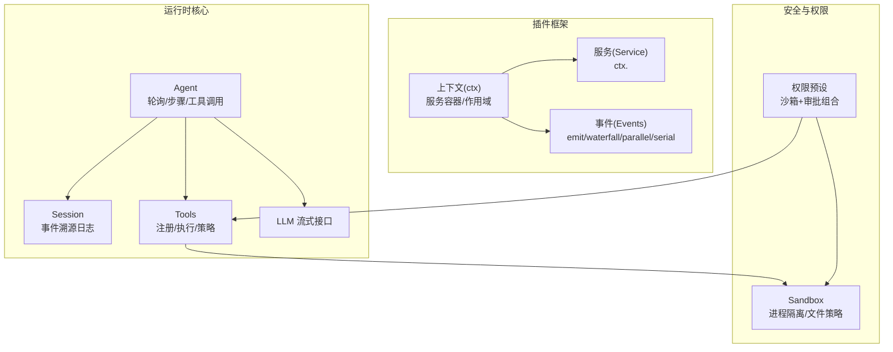
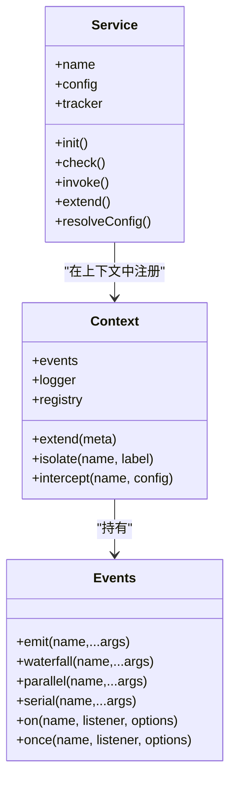
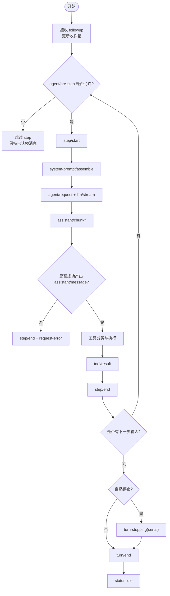
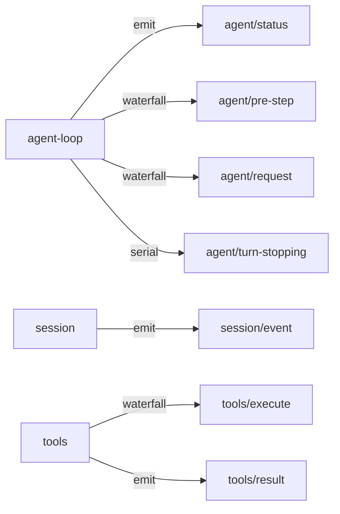
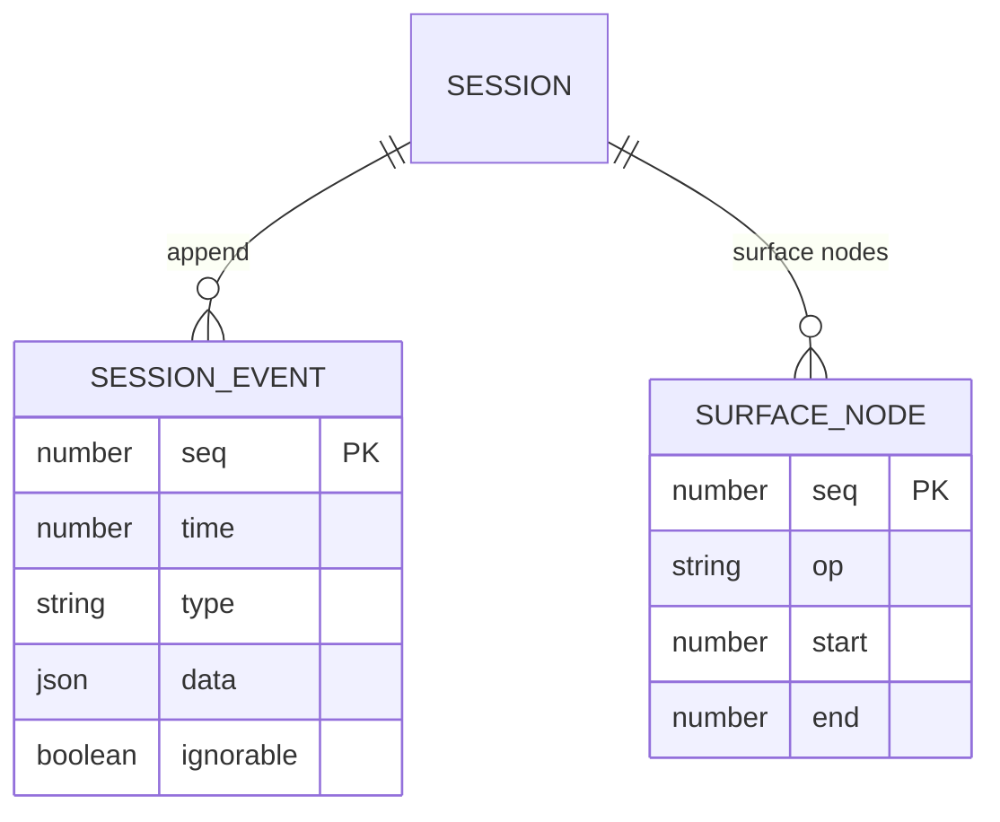
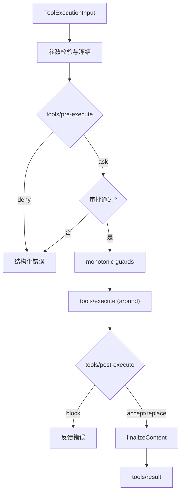
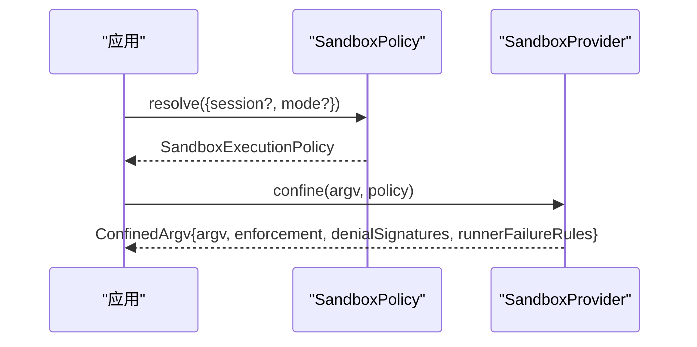
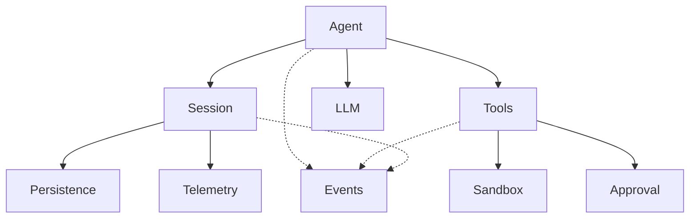

# 核心概念

<cite>
**本文引用的文件**
- [Cordis 入门](file://docs/cordis-primer.md)
- [Agent 生命周期](file://docs/agent-lifecycle.md)
- [事件生产者-消费者矩阵](file://docs/event-producer-consumer.md)
- [会话（Session）子系统文档](file://docs/subsystems/session.md)
- [工具（Tools）子系统文档](file://docs/subsystems/tools.md)
- [进程沙箱（Sandbox）子系统文档](file://docs/subsystems/sandbox.md)
- [权限预设（Permission Presets）子系统文档](file://docs/subsystems/permission-presets.md)
- [上下文（Context）API 文档](file://docs/cordis-api/context.md)
- [服务（Service）API 文档](file://docs/cordis-api/service.md)
- [事件（Events）API 文档](file://docs/cordis-api/events.md)
</cite>

## 目录
1. [简介](#简介)
2. [项目结构](#项目结构)
3. [核心组件](#核心组件)
4. [架构总览](#架构总览)
5. [详细组件分析](#详细组件分析)
6. [依赖关系分析](#依赖关系分析)
7. [性能考虑](#性能考虑)
8. [故障排查指南](#故障排查指南)
9. [结论](#结论)
10. [附录](#附录)

## 简介
本文件系统化阐述 DeepSeek Harness 的核心概念，围绕 Cordis 插件框架、Agent 生命周期、事件生产者-消费者模式、会话（Session）、工具（Tool）系统、配置与权限控制、以及沙箱机制展开。目标是帮助开发者快速理解并正确应用这些概念进行扩展与集成。

## 项目结构
DeepSeek Harness 采用“插件化 + 事件驱动”的架构：
- Cordis 提供插件加载、服务注册、上下文与作用域、事件总线等基础能力。
- Agent 作为编排核心，驱动会话、工具调用、LLM 请求与结果处理。
- Session 是事件溯源的不可变日志，承载对话历史与派生模型消息。
- Tools 提供可插拔的能力执行管道，支持预/后策略、并行/独占调度、超时与呈现。
- Sandbox 提供进程级隔离与文件系统访问策略。
- Permission Presets 将沙箱模式与审批策略打包为可选的用户界面开关。



图表来源
- [上下文（Context）API 文档:1-160](file://docs/cordis-api/context.md#L1-L160)
- [服务（Service）API 文档:1-103](file://docs/cordis-api/service.md#L1-L103)
- [事件（Events）API 文档:1-208](file://docs/cordis-api/events.md#L1-L208)
- [Agent 生命周期:1-83](file://docs/agent-lifecycle.md#L1-L83)
- [会话（Session）子系统文档:1-800](file://docs/subsystems/session.md#L1-L800)
- [工具（Tools）子系统文档:1-721](file://docs/subsystems/tools.md#L1-L721)
- [进程沙箱（Sandbox）子系统文档:1-219](file://docs/subsystems/sandbox.md#L1-L219)
- [权限预设（Permission Presets）子系统文档:1-132](file://docs/subsystems/permission-presets.md#L1-L132)

章节来源
- [Cordis 入门:7-44](file://docs/cordis-primer.md#L7-L44)
- [上下文（Context）API 文档:1-160](file://docs/cordis-api/context.md#L1-L160)
- [服务（Service）API 文档:1-103](file://docs/cordis-api/service.md#L1-L103)
- [事件（Events）API 文档:1-208](file://docs/cordis-api/events.md#L1-L208)

## 核心组件
- 插件与服务：插件通过 Service 或函数形式声明依赖 inject，并在 apply(ctx) 中注册 effect/on 监听；服务以稳定键暴露于 ctx，如 ctx.tools、ctx.llm、ctx.sessions。
- 上下文与作用域：ctx.extend/isolate/intercept 创建子上下文与作用域，实现服务覆盖、配置拦截与隔离。
- 事件总线：emit（同步观察）、waterfall（中间件式包裹）、parallel（并发）、serial（顺序直到短路）。
- Agent：驱动 turn/step 循环，协调 prompt、LLM、工具与 Session 持久化。
- Session：事件溯源的不可变日志，维护 surface 投影用于派生模型消息，支持 fork/flush 与边界标记。
- Tools：注册 ToolDefinition，执行管道包含 pre-execute → guards → execute → post-execute → finalizeContent → result，支持并行/独占、超时、呈现。
- Sandbox：按调用粒度解析策略，返回受限 argv 与执行完整性报告。
- 权限预设：将 sandbox/mode 与 approval/policy 打包为可切换选项，记录用户意图事件。

章节来源
- [Cordis 入门:7-44](file://docs/cordis-primer.md#L7-L44)
- [上下文（Context）API 文档:14-96](file://docs/cordis-api/context.md#L14-L96)
- [事件（Events）API 文档:8-123](file://docs/cordis-api/events.md#L8-L123)
- [Agent 生命周期:8-83](file://docs/agent-lifecycle.md#L8-L83)
- [会话（Session）子系统文档:1-800](file://docs/subsystems/session.md#L1-L800)
- [工具（Tools）子系统文档:9-470](file://docs/subsystems/tools.md#L9-L470)
- [进程沙箱（Sandbox）子系统文档:9-157](file://docs/subsystems/sandbox.md#L9-L157)
- [权限预设（Permission Presets）子系统文档:9-132](file://docs/subsystems/permission-presets.md#L9-L132)

## 架构总览
下图展示从用户输入到模型响应与工具调用的端到端流程，强调 Agent、Session、Tools、LLM 与事件的协作。

```mermaid
sequenceDiagram
participant U as "用户"
participant A as "Agent"
participant D as "Driver"
participant H as "Hook 监听器"
participant P as "系统提示组装"
participant L as "LLM"
participant T as "Tools"
participant S as "Session"
U->>A : followup(content)
A-->>U : agent/inbox/spliced / inserted
A->>D : 唤醒队列工作
D->>S : turn/start
D->>H : agent/pre-step (waterfall)
alt 被拒绝或失败
D-->>D : 保留已认领消息，本轮不进入 step
else 进入 step
D->>S : step/start
D->>S : user/message
D->>P : system-prompt/assemble (waterfall)
D->>L : agent/request (waterfall) + llm/stream (waterfall)
L-->>D : StreamChunk*
D->>S : assistant/chunk*
opt 最终适配器或终端请求失败
D->>S : step/end
D->>H : agent/request-error (waterfall)
else 成功
D->>S : assistant/message
D->>T : 分类待执行工具
loop 屏障与滚动池
D->>S : tool/call
D->>T : 有序 pre, 并发执行
T-->>S : tool-owned events
opt 下一个模型顺序结果就绪
D->>T : 有序 post
D->>S : tool/result
end
end
end
D->>S : step/end
end
opt 自然停止且无下一步输入
D->>H : agent/turn-stopping (serial)
end
D->>S : turn/end
D-->>U : agent/status idle
```

图表来源
- [Agent 生命周期:8-83](file://docs/agent-lifecycle.md#L8-L83)
- [事件生产者-消费者矩阵:8-66](file://docs/event-producer-consumer.md#L8-L66)

## 详细组件分析

### Cordis 插件框架：插件、服务、上下文与生命周期
- 插件即实现 Service 的对象，可通过 inject 声明依赖，apply(ctx) 中安装 effect/on 监听。
- 上下文是服务仓库，支持 extend/isolate/intercept 创建子作用域与配置拦截。
- 事件总线提供 emit/waterfall/parallel/serial 四种分发模式，契约由 @mode 标注。
- 所有注册必须是可逆 effect，确保重载与销毁时能按序回滚。



图表来源
- [上下文（Context）API 文档:14-160](file://docs/cordis-api/context.md#L14-L160)
- [服务（Service）API 文档:14-103](file://docs/cordis-api/service.md#L14-L103)
- [事件（Events）API 文档:8-123](file://docs/cordis-api/events.md#L8-L123)

章节来源
- [Cordis 入门:7-44](file://docs/cordis-primer.md#L7-L44)
- [上下文（Context）API 文档:14-160](file://docs/cordis-api/context.md#L14-L160)
- [服务（Service）API 文档:14-103](file://docs/cordis-api/service.md#L14-L103)
- [事件（Events）API 文档:8-123](file://docs/cordis-api/events.md#L8-L123)

### Agent 生命周期：创建、初始化、运行到销毁
- 入口：用户 followup 触发 inbox 变更，驱动 Driver 唤醒。
- Turn/Step：turn/start → pre-step waterfall → step/start → user/message → system-prompt/assemble → agent/request → llm/stream → assistant/chunk → assistant/message。
- 工具调用：tool/call → 有序 pre → 并发执行 → 有序 post → tool/result。
- 错误与重试：agent/request-error waterfall，支持压缩/重试策略。
- 结束：step/end → 可能触发 turn-stopping serial → turn/end → status idle。



图表来源
- [Agent 生命周期:8-83](file://docs/agent-lifecycle.md#L8-L83)
- [事件生产者-消费者矩阵:8-66](file://docs/event-producer-consumer.md#L8-L66)

章节来源
- [Agent 生命周期:8-83](file://docs/agent-lifecycle.md#L8-L83)
- [事件生产者-消费者矩阵:8-66](file://docs/event-producer-consumer.md#L8-L66)

### 事件生产者-消费者模式
- 事件类型与分发模式在子系统文档中声明，并通过矩阵明确各包的分发与监听关系。
- 常见事件包括 agent/*、session/*、tools/*、llm/*、fs/*、workflow/* 等。
- 使用建议：
  - 观察型：emit
  - 中间件式包装：waterfall
  - 并发广播：parallel
  - 顺序决策：serial/bail



图表来源
- [事件生产者-消费者矩阵:8-66](file://docs/event-producer-consumer.md#L8-L66)

章节来源
- [事件生产者-消费者矩阵:8-66](file://docs/event-producer-consumer.md#L8-L66)

### 会话（Session）：概念、作用与与 Agent 的关系
- Session 是事件溯源的不可变日志，唯一事实源；模型消息由日志派生，而非单独存储。
- 关键事件：turn/start/end、step/start/end、user/message、assistant/chunk、assistant/message、tool/call、tool/result、request/header、request/context、session/end-seed。
- Surface 投影：仅 message-producing 事件参与有序表面，支持 append 与 replace。
- API：append、deriveMessages、requestHeader、requestContext、create/fork/flush。
- 与 Agent：Agent 驱动 turn/step 并将事件写入 Session；Session 提供派生历史供 UI/SDK 消费。



图表来源
- [会话（Session）子系统文档:9-357](file://docs/subsystems/session.md#L9-L357)
- [会话（Session）子系统文档:359-519](file://docs/subsystems/session.md#L359-L519)

章节来源
- [会话（Session）子系统文档:9-357](file://docs/subsystems/session.md#L9-L357)
- [会话（Session）子系统文档:359-519](file://docs/subsystems/session.md#L359-L519)

### 工具（Tool）系统：工作原理与注册机制
- ToolDefinition：包含 schema、output、execute、finalizeContent、timeoutMs、isConcurrencySafe、presentCall/presentResult。
- 执行管道：pre-execute（allow/deny/ask）→ monotonic guards → execute（around-dispatch）→ post-execute（accept/replace/block）→ finalizeContent → result。
- 调度模式：parallel 与 exclusive，基于 isConcurrencySafe 判定。
- 呈现：card-tagged 视图（generic/terminal/diff/search/read/web），跨客户端一致。
- 注册：ctx.tools.register/restrict/guard/schemas/executionMode/execute。



图表来源
- [工具（Tools）子系统文档:170-470](file://docs/subsystems/tools.md#L170-L470)

章节来源
- [工具（Tools）子系统文档:9-470](file://docs/subsystems/tools.md#L9-L470)

### 配置系统、权限控制与沙箱机制
- 配置：通过 Cordis 的 intercept 与 Service.config 注入，结合 loader 的 include/disabled 选择。
- 权限控制：Permission Presets 将 sandbox/mode 与 approval/policy 打包为可切换项，记录 permission/preset 事件。
- 沙箱：ctx.sandbox.confine(argv, policy) 返回受限 argv 与 enforcement 完整度；policy 由 ctx.sandboxPolicy.resolve(session?, mode?) 解析。



图表来源
- [进程沙箱（Sandbox）子系统文档:41-157](file://docs/subsystems/sandbox.md#L41-L157)
- [权限预设（Permission Presets）子系统文档:46-132](file://docs/subsystems/permission-presets.md#L46-L132)

章节来源
- [进程沙箱（Sandbox）子系统文档:9-157](file://docs/subsystems/sandbox.md#L9-L157)
- [权限预设（Permission Presets）子系统文档:9-132](file://docs/subsystems/permission-presets.md#L9-L132)

## 依赖关系分析
- Agent 依赖 Session、Tools、LLM 与 Hook 事件。
- Tools 依赖 Sandbox（执行环境）与 Approval（审批策略，通过权限预设组合）。
- Session 依赖持久化后端（persistence）与 Telemetry（遥测）。
- 事件总线贯穿各子系统，形成松耦合通信。



图表来源
- [Agent 生命周期:8-83](file://docs/agent-lifecycle.md#L8-L83)
- [事件生产者-消费者矩阵:8-66](file://docs/event-producer-consumer.md#L8-L66)
- [会话（Session）子系统文档:601-605](file://docs/subsystems/session.md#L601-L605)

章节来源
- [Agent 生命周期:8-83](file://docs/agent-lifecycle.md#L8-L83)
- [事件生产者-消费者矩阵:8-66](file://docs/event-producer-consumer.md#L8-L66)
- [会话（Session）子系统文档:601-605](file://docs/subsystems/session.md#L601-L605)

## 性能考虑
- 事件派发：优先使用 emit 做轻量观察；需要聚合或替换时使用 waterfall；高并发场景用 parallel；需要顺序决策用 serial。
- 工具执行：合理设置 isConcurrencySafe 以启用并行；对耗时操作使用 timeoutMs 与信号中止；避免在 post-execute 中进行阻塞 I/O。
- Session 派生：deriveMessages 缓存节点投影，避免重复计算；replace 会重建表面，注意频率。
- 沙箱：confine 返回的 enforcement 为 partial 时需降级策略或提示风险。

[本节为通用指导，无需特定文件引用]

## 故障排查指南
- Agent 卡住：检查 agent/pre-step 是否被拒绝；查看 agent/request-error 的压缩/重试策略；确认 session 的 flush 是否完成。
- 工具失败：定位 tools/pre-execute 是否 deny/ask；检查 monotonic guards；查看 tools/post-execute 是否 block；确认 finalizeContent 是否抛出。
- 权限问题：确认当前权限预设与 effective sandbox/approval；检查 sandbox 的 enforcement 是否为 full。
- 事件丢失：核对事件模式与监听器注册；scope-filtered 事件需匹配 agent scope。

章节来源
- [Agent 生命周期:74-83](file://docs/agent-lifecycle.md#L74-L83)
- [工具（Tools）子系统文档:370-470](file://docs/subsystems/tools.md#L370-L470)
- [进程沙箱（Sandbox）子系统文档:152-157](file://docs/subsystems/sandbox.md#L152-L157)
- [权限预设（Permission Presets）子系统文档:46-132](file://docs/subsystems/permission-presets.md#L46-L132)

## 结论
DeepSeek Harness 通过 Cordis 插件框架实现了高度可扩展的运行时；Agent 作为编排核心，驱动 Session 的事件溯源日志与 Tools 的执行管道；事件总线解耦了子系统间的通信；权限与沙箱提供了安全的执行边界。掌握这些核心概念有助于高效开发与集成。

[本节为总结性内容，无需特定文件引用]

## 附录
- 实践建议：
  - 将行为封装为插件，优先使用事件进行拦截与策略，方法调用用于直接能力。
  - 每个注册必须提供 disposer，保证卸载顺序可控。
  - 使用 ctx.effect()/ctx.on() 管理副作用，便于热重载与清理。
  - 工具输出使用 JSON Schema 约束，UI 呈现遵循 card-tagged 规范。
  - 沙箱策略按调用粒度解析，必要时显式指定 mode。

[本节为补充说明，无需特定文件引用]