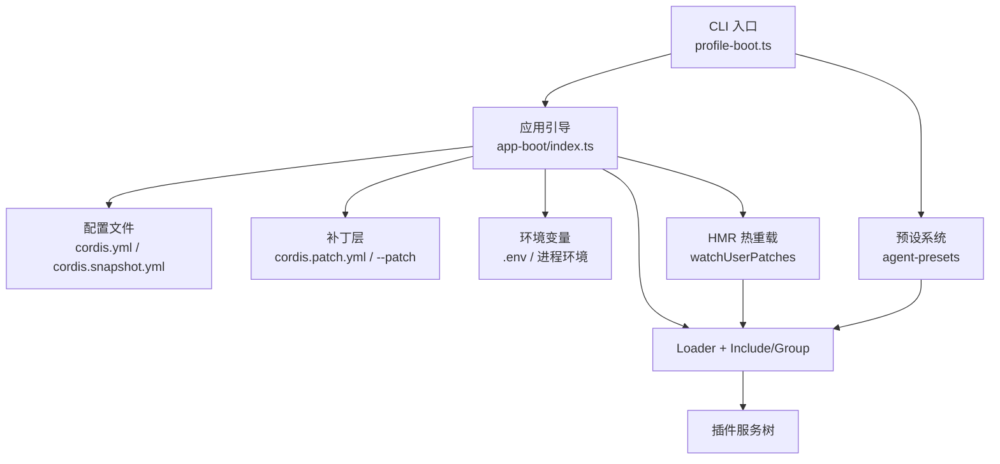
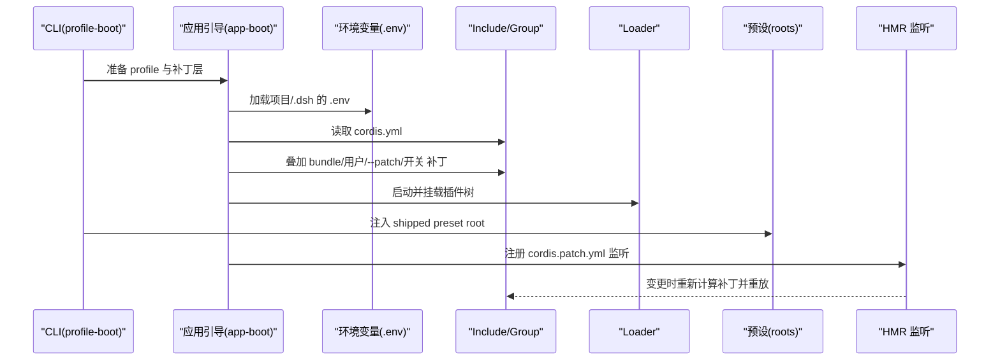
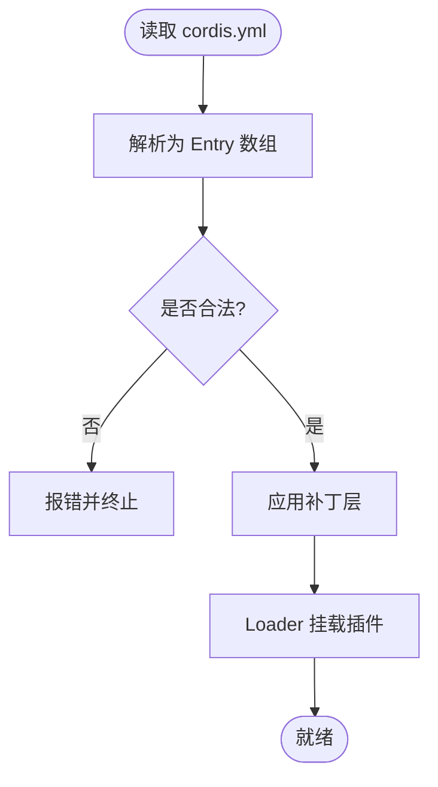
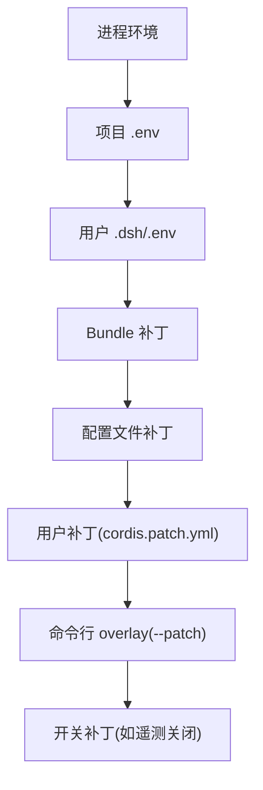
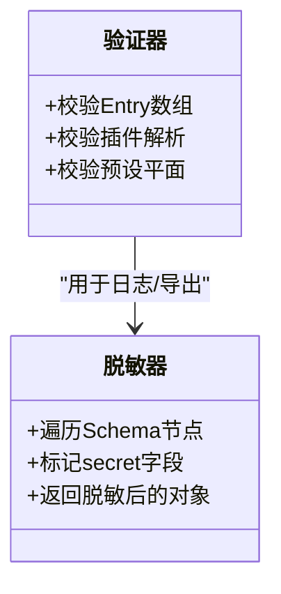
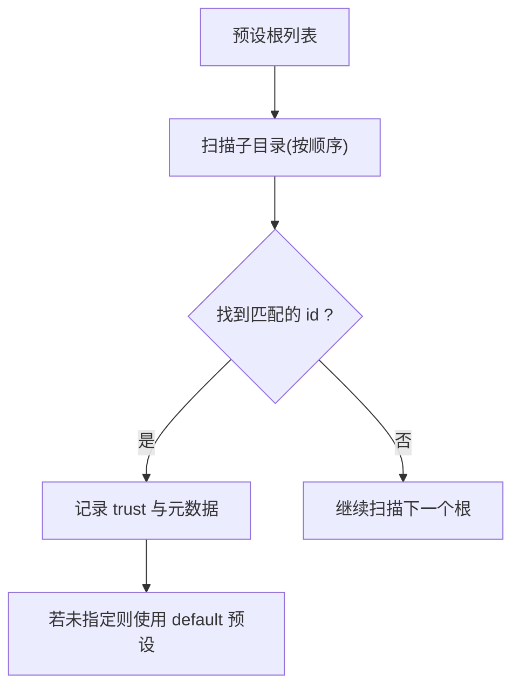
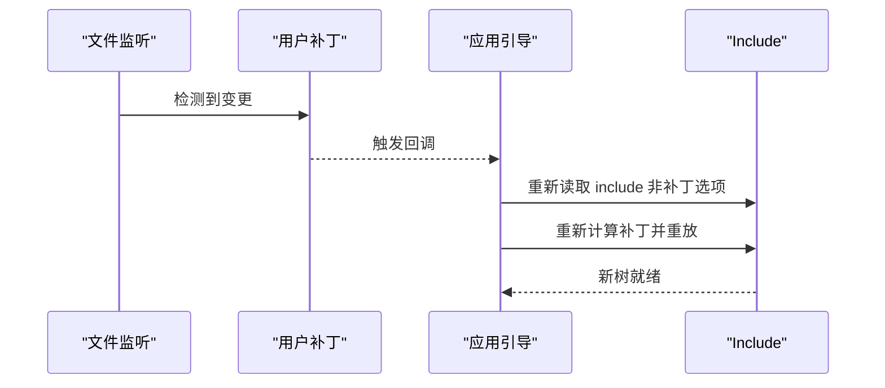
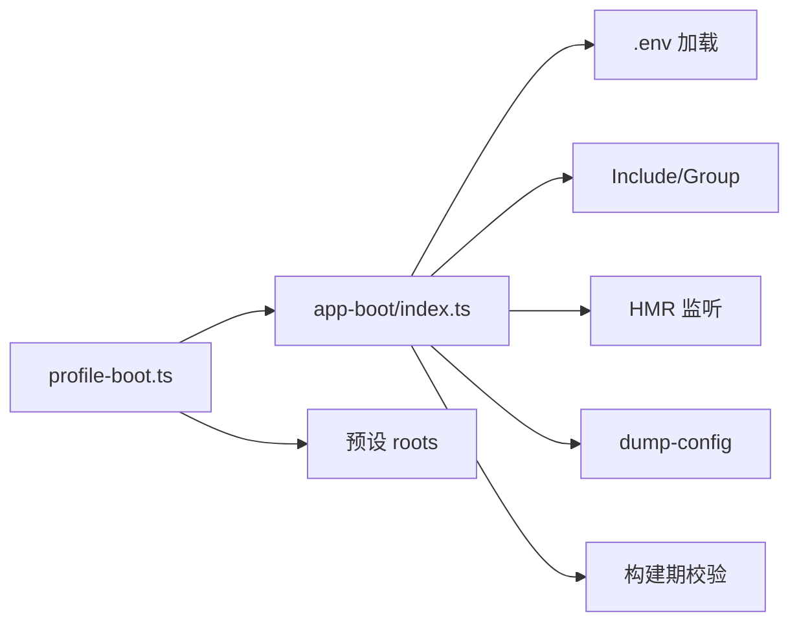

# 配置系统

<cite>
**本文引用的文件**
- [packages/boot/app-boot/src/index.ts](file://packages/boot/app-boot/src/index.ts)
- [apps/cli/src/profile-boot.ts](file://apps/cli/src/profile-boot.ts)
- [packages/boot/app-boot/src/profile.ts](file://packages/boot/app-boot/src/profile.ts)
- [apps/cli/src/dump-config.ts](file://apps/cli/src/dump-config.ts)
- [scripts/verify-cordis-config.ts](file://scripts/verify-cordis-config.ts)
- [docs/config-catalog.md](file://docs/config-catalog.md)
- [examples/headless-agent/cordis.yml](file://examples/headless-agent/cordis.yml)
- [apps/cli/config/agent-presets/code/preset.yml](file://apps/cli/config/agent-presets/code/preset.yml)
- [apps/cli/config/agent-presets/minimal/preset.yml](file://apps/cli/config/agent-presets/minimal/preset.yml)
- [apps/cli/config/agent-presets/code/agent.cordis.yml](file://apps/cli/config/agent-presets/code/agent.cordis.yml)
- [packages/settings/settings/src/redact.ts](file://packages/settings/settings/src/redact.ts)
</cite>

## 目录
1. [简介](#简介)
2. [项目结构](#项目结构)
3. [核心组件](#核心组件)
4. [架构总览](#架构总览)
5. [详细组件分析](#详细组件分析)
6. [依赖关系分析](#依赖关系分析)
7. [性能考虑](#性能考虑)
8. [故障排查指南](#故障排查指南)
9. [结论](#结论)
10. [附录](#附录)

## 简介
本文件系统化说明 DeepSeek Harness 的配置体系，覆盖配置文件结构与语法、继承与优先级、验证机制、预设模板、动态更新（热重载）以及最佳实践。目标是帮助读者在不深入源码的情况下，也能正确编写、调试和扩展配置。

## 项目结构
配置系统围绕“引导层”“配置文件”“补丁层”“预设”“验证与诊断”五个层面组织：
- 引导层：负责加载环境变量、解析配置路径、组合补丁层、驱动 Loader 启动并支持热重载。
- 配置文件：以 YAML 数组形式声明插件条目（id/name/config），并通过 include/group 等能力进行组合。
- 补丁层：通过 cordis.patch.yml 与 --patch 叠加，实现无侵入式覆盖与插入。
- 预设：按根目录扫描发现，提供可复用的 Agent 组合模板。
- 验证与诊断：构建期校验配置合法性，运行期输出可追溯的合并结果。

图表来源
- [apps/cli/src/profile-boot.ts:142-171](file://apps/cli/src/profile-boot.ts#L142-L171)
- [packages/boot/app-boot/src/index.ts:61-69](file://packages/boot/app-boot/src/index.ts#L61-L69)
- [packages/boot/app-boot/src/index.ts:225-246](file://packages/boot/app-boot/src/index.ts#L225-L246)

章节来源
- [apps/cli/src/profile-boot.ts:1-171](file://apps/cli/src/profile-boot.ts#L1-L171)
- [packages/boot/app-boot/src/index.ts:1-200](file://packages/boot/app-boot/src/index.ts#L1-L200)

## 核心组件
- 配置解析与加载
  - 解析 cordis.yml（或 replay 模式下的 cordis.snapshot.yml）。
  - 加载 .env（项目级与用户级分层），拒绝危险变量名。
- 补丁层组合
  - 按顺序叠加：包内 bundle 补丁 → 配置文件自身补丁 → 用户补丁 → 命令行 overlay → 开关补丁。
- 动态更新
  - 基于 HMR 监听 cordis.patch.yml 与用户补丁，事务性重放补丁，保持服务稳定。
- 预设系统
  - 扫描 preset roots，发现 agent 预设；支持 system/user 信任等级与默认预设选择。
- 验证与诊断
  - 构建期校验 Loader 元数据与插件解析；运行期 dump 最终配置，标注来源层。

章节来源
- [packages/boot/app-boot/src/index.ts:71-198](file://packages/boot/app-boot/src/index.ts#L71-L198)
- [apps/cli/src/profile-boot.ts:142-171](file://apps/cli/src/profile-boot.ts#L142-L171)
- [packages/boot/app-boot/src/index.ts:225-246](file://packages/boot/app-boot/src/index.ts#L225-L246)
- [docs/config-catalog.md:1-11](file://docs/config-catalog.md#L1-L11)

## 架构总览
下图展示从 CLI 到 Loader 的配置装配流程，包括环境变量注入、补丁层叠加、HMR 热重载与预设挂载。

图表来源
- [apps/cli/src/profile-boot.ts:207-300](file://apps/cli/src/profile-boot.ts#L207-L300)
- [packages/boot/app-boot/src/index.ts:61-69](file://packages/boot/app-boot/src/index.ts#L61-L69)
- [packages/boot/app-boot/src/index.ts:225-246](file://packages/boot/app-boot/src/index.ts#L225-L246)

## 详细组件分析

### 配置文件结构与语法
- 顶层为 YAML 数组，每个元素是一个 Loader Entry：包含 id、name、config 等字段。
- 支持 !!js 表达式在 config 中引用运行时上下文（如 process.cwd()、process.env.*）。
- 可通过 include/group 等内置能力进行模块化组合与隔离。
- 示例参考 headless-agent 的完整编排。

图表来源
- [examples/headless-agent/cordis.yml:1-166](file://examples/headless-agent/cordis.yml#L1-L166)
- [scripts/verify-cordis-config.ts:72-99](file://scripts/verify-cordis-config.ts#L72-L99)

章节来源
- [examples/headless-agent/cordis.yml:1-166](file://examples/headless-agent/cordis.yml#L1-L166)
- [scripts/verify-cordis-config.ts:72-99](file://scripts/verify-cordis-config.ts#L72-L99)

### 继承与优先级（全局/项目/用户/命令行）
- 环境变量优先级：进程环境 > 项目 .env > 用户 .dsh/.env（不覆盖已有值）。
- 补丁层优先级（后者优先）：bundle 补丁 < 配置文件补丁 < 用户补丁(cordis.patch.yml) < 命令行 overlay(--patch) < 开关补丁。
- 预设根优先级：先配置的 root 优先；用户 preset 根可选择追加。

图表来源
- [packages/boot/app-boot/src/index.ts:177-198](file://packages/boot/app-boot/src/index.ts#L177-L198)
- [apps/cli/src/profile-boot.ts:142-171](file://apps/cli/src/profile-boot.ts#L142-L171)

章节来源
- [packages/boot/app-boot/src/index.ts:177-198](file://packages/boot/app-boot/src/index.ts#L177-L198)
- [apps/cli/src/profile-boot.ts:142-171](file://apps/cli/src/profile-boot.ts#L142-L171)

### 配置验证机制
- 构建期校验：校验 Loader 元数据、插件解析、预设平面分离等。
- 类型与默认值：由各插件的 schema 与 JSDoc 声明共同约束；缺失可选字段时使用默认值。
- 敏感信息脱敏：对标记为 secret 的字段在日志/导出中进行脱敏处理。
- 运行时诊断：dump-config 输出带来源注释的最终配置，便于定位覆盖来源。

图表来源
- [scripts/verify-cordis-config.ts:72-99](file://scripts/verify-cordis-config.ts#L72-L99)
- [packages/settings/settings/src/redact.ts:50-83](file://packages/settings/settings/src/redact.ts#L50-L83)
- [apps/cli/src/dump-config.ts:30-52](file://apps/cli/src/dump-config.ts#L30-L52)

章节来源
- [scripts/verify-cordis-config.ts:72-99](file://scripts/verify-cordis-config.ts#L72-L99)
- [packages/settings/settings/src/redact.ts:50-83](file://packages/settings/settings/src/redact.ts#L50-L83)
- [apps/cli/src/dump-config.ts:30-52](file://apps/cli/src/dump-config.ts#L30-L52)

### 预设配置系统
- 预设根（roots）：按顺序扫描，首个匹配 id 生效；支持 system/user 信任等级。
- 默认预设：未显式指定时，必须存在 default 预设，否则失败。
- 内置 shipped 预设：CLI 自动注入 shipped preset root，使内置模板可用。
- 预设元数据：preset.yml 可定义 name、description、order 等显示信息。

图表来源
- [docs/config-catalog.md:167-203](file://docs/config-catalog.md#L167-L203)
- [apps/cli/config/agent-presets/code/preset.yml:1-4](file://apps/cli/config/agent-presets/code/preset.yml#L1-L4)
- [apps/cli/config/agent-presets/minimal/preset.yml:1-4](file://apps/cli/config/agent-presets/minimal/preset.yml#L1-L4)
- [apps/cli/src/profile-boot.ts:155-167](file://apps/cli/src/profile-boot.ts#L155-L167)

章节来源
- [docs/config-catalog.md:167-203](file://docs/config-catalog.md#L167-L203)
- [apps/cli/config/agent-presets/code/preset.yml:1-4](file://apps/cli/config/agent-presets/code/preset.yml#L1-L4)
- [apps/cli/config/agent-presets/minimal/preset.yml:1-4](file://apps/cli/config/agent-presets/minimal/preset.yml#L1-L4)
- [apps/cli/src/profile-boot.ts:155-167](file://apps/cli/src/profile-boot.ts#L155-L167)

### 动态配置更新（热重载）
- 监听 cordis.patch.yml 与用户补丁文件，变更时重新计算补丁并事务性重放。
- 为保证一致性，每次重放都会重新读取 include 的非补丁选项，避免被覆盖。
- 当宿主未提供 HMR 时，会按需挂载最小化的 HMR 实例以维持热重载能力。

图表来源
- [packages/boot/app-boot/src/index.ts:225-246](file://packages/boot/app-boot/src/index.ts#L225-L246)
- [apps/cli/src/profile-boot.ts:268-298](file://apps/cli/src/profile-boot.ts#L268-L298)

章节来源
- [packages/boot/app-boot/src/index.ts:225-246](file://packages/boot/app-boot/src/index.ts#L225-L246)
- [apps/cli/src/profile-boot.ts:268-298](file://apps/cli/src/profile-boot.ts#L268-L298)

### 代码示例与最佳实践
- 编写配置文件
  - 使用 YAML 数组声明插件条目，尽量将可变项放入补丁层，保持基础配置稳定。
  - 在 config 中使用 !!js 表达式引用运行时上下文（如 process.cwd()、process.env.*）。
  - 参考示例：headless-agent 的完整编排。
- 使用环境变量
  - 将密钥放在 .credentials.yaml 或通过进程环境注入，避免硬编码。
  - 利用分层 .env 管理不同环境的差异，注意禁止的危险变量名。
- 配置验证
  - 使用构建期校验脚本提前发现问题。
  - 使用 dump-config 查看最终合并结果与来源层，快速定位覆盖冲突。

章节来源
- [examples/headless-agent/cordis.yml:1-166](file://examples/headless-agent/cordis.yml#L1-L166)
- [packages/boot/app-boot/src/index.ts:71-198](file://packages/boot/app-boot/src/index.ts#L71-L198)
- [apps/cli/src/dump-config.ts:30-52](file://apps/cli/src/dump-config.ts#L30-L52)

## 依赖关系分析
- 引导层依赖：
  - 环境变量加载与快照（loadLayeredEnv）。
  - 配置路径解析（resolveConfigPath）。
  - 补丁层组合（composeEntries、loadOptionalPatches、loadOverlayPatches）。
  - HMR 热重载（watchUserPatches）。
- 预设依赖：
  - 预设根扫描与信任策略。
  - CLI 注入 shipped preset root。
- 验证与诊断：
  - 构建期校验脚本。
  - 运行期 dump-config 输出。

图表来源
- [apps/cli/src/profile-boot.ts:142-171](file://apps/cli/src/profile-boot.ts#L142-L171)
- [packages/boot/app-boot/src/index.ts:61-69](file://packages/boot/app-boot/src/index.ts#L61-L69)
- [apps/cli/src/dump-config.ts:30-52](file://apps/cli/src/dump-config.ts#L30-L52)
- [scripts/verify-cordis-config.ts:72-99](file://scripts/verify-cordis-config.ts#L72-L99)

章节来源
- [apps/cli/src/profile-boot.ts:142-171](file://apps/cli/src/profile-boot.ts#L142-L171)
- [packages/boot/app-boot/src/index.ts:61-69](file://packages/boot/app-boot/src/index.ts#L61-L69)
- [apps/cli/src/dump-config.ts:30-52](file://apps/cli/src/dump-config.ts#L30-L52)
- [scripts/verify-cordis-config.ts:72-99](file://scripts/verify-cordis-config.ts#L72-L99)

## 性能考虑
- 补丁层数量与复杂度会影响初始组装与热重载开销；建议将稳定部分下沉至 bundle 补丁，频繁调整项放入用户补丁。
- 大文件 .env 或大量插件会增加内存占用；合理拆分模块与按需启用功能。
- 压缩与持久化策略（如 JSONL 压缩）影响磁盘 IO；根据场景权衡。

[本节为通用指导，无需特定文件来源]

## 故障排查指南
- 常见问题
  - 环境变量冲突：检查 .env 是否尝试设置受保护的变量名。
  - 补丁未生效：确认补丁层顺序与 id 目标是否正确；使用 dump-config 查看来源。
  - 预设未找到：检查 default 预设是否存在，roots 顺序与权限。
- 诊断工具
  - dump-config：打印最终配置及来源层，便于定位覆盖。
  - 构建期校验：提前发现配置与解析问题。
  - 日志脱敏：确保敏感字段不被泄露。

章节来源
- [packages/boot/app-boot/src/index.ts:71-198](file://packages/boot/app-boot/src/index.ts#L71-L198)
- [apps/cli/src/dump-config.ts:30-52](file://apps/cli/src/dump-config.ts#L30-L52)
- [scripts/verify-cordis-config.ts:72-99](file://scripts/verify-cordis-config.ts#L72-L99)
- [packages/settings/settings/src/redact.ts:50-83](file://packages/settings/settings/src/redact.ts#L50-L83)

## 结论
该配置系统通过分层的环境变量、补丁层与预设机制，提供了灵活且安全的配置能力。结合构建期校验与运行期诊断，既能保证稳定性，又便于迭代与排障。推荐将稳定配置下沉至 bundle，变动项放入用户补丁，并使用预设快速启动项目。

[本节为总结，无需特定文件来源]

## 附录
- 常用命令
  - dsh --profile <name> --dump-config：输出最终配置与来源层。
  - 编辑 cordis.patch.yml：实现热重载覆盖。
- 参考示例
  - headless-agent/cordis.yml：完整编排示例。
  - agent-presets：预设模板与元数据。

章节来源
- [apps/cli/src/dump-config.ts:30-52](file://apps/cli/src/dump-config.ts#L30-L52)
- [examples/headless-agent/cordis.yml:1-166](file://examples/headless-agent/cordis.yml#L1-L166)
- [apps/cli/config/agent-presets/code/preset.yml:1-4](file://apps/cli/config/agent-presets/code/preset.yml#L1-L4)
- [apps/cli/config/agent-presets/minimal/preset.yml:1-4](file://apps/cli/config/agent-presets/minimal/preset.yml#L1-L4)
- [apps/cli/config/agent-presets/code/agent.cordis.yml:1-263](file://apps/cli/config/agent-presets/code/agent.cordis.yml#L1-L263)