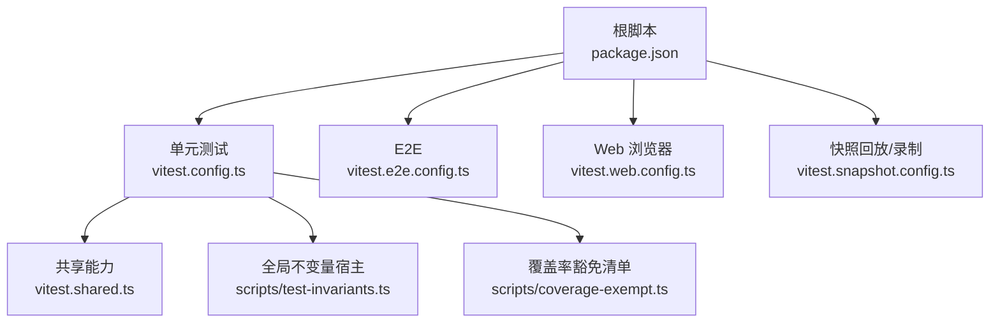
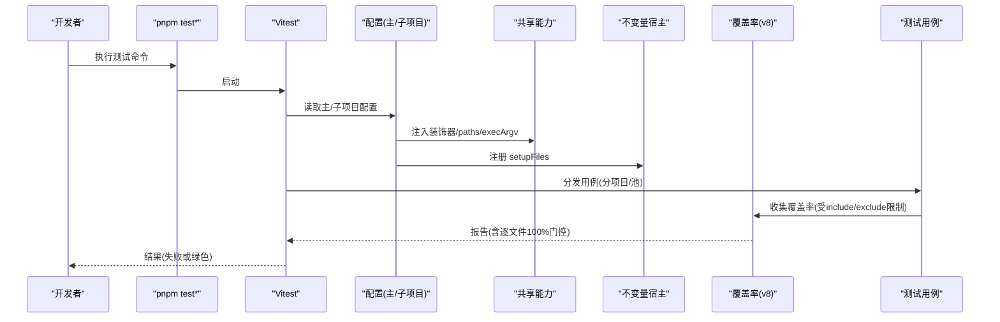
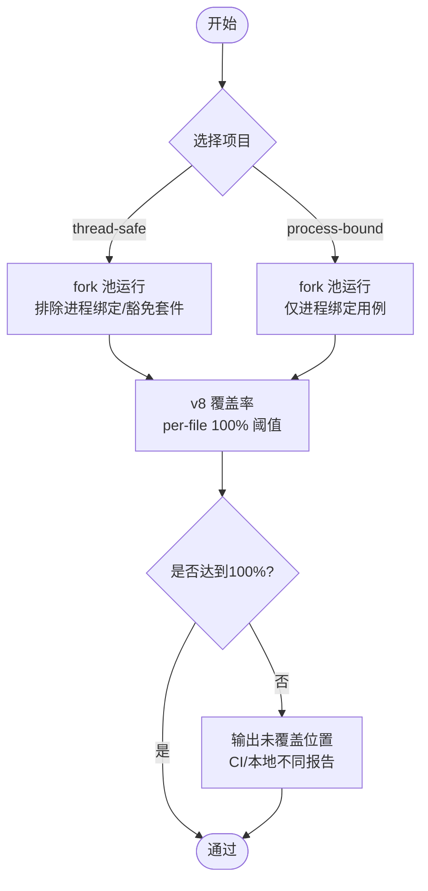
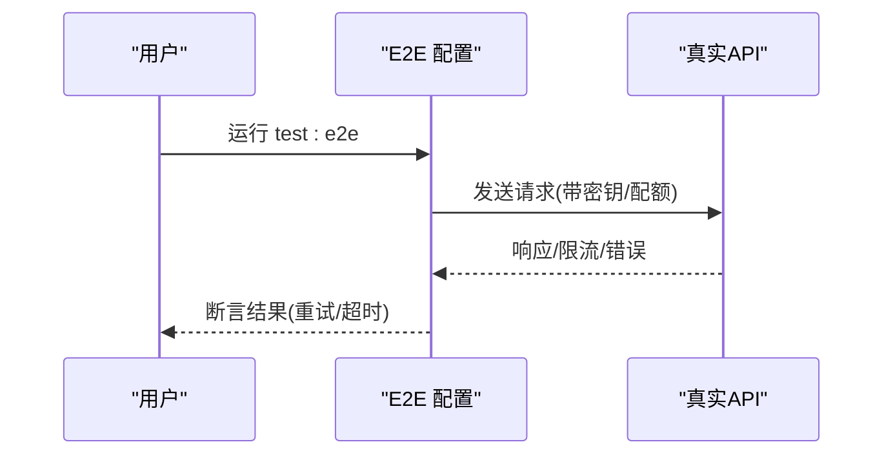
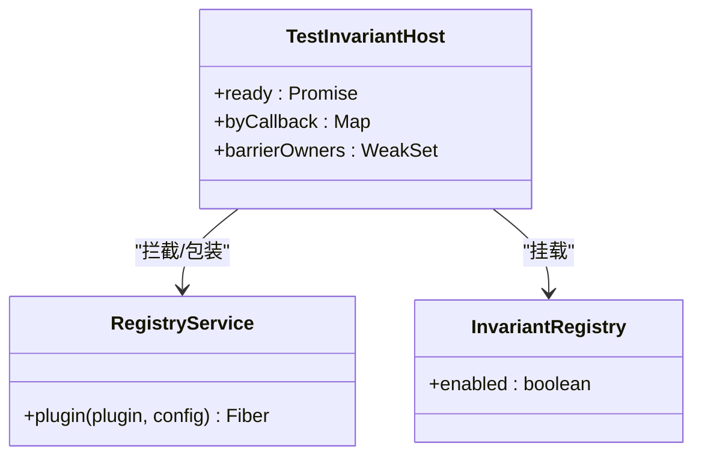
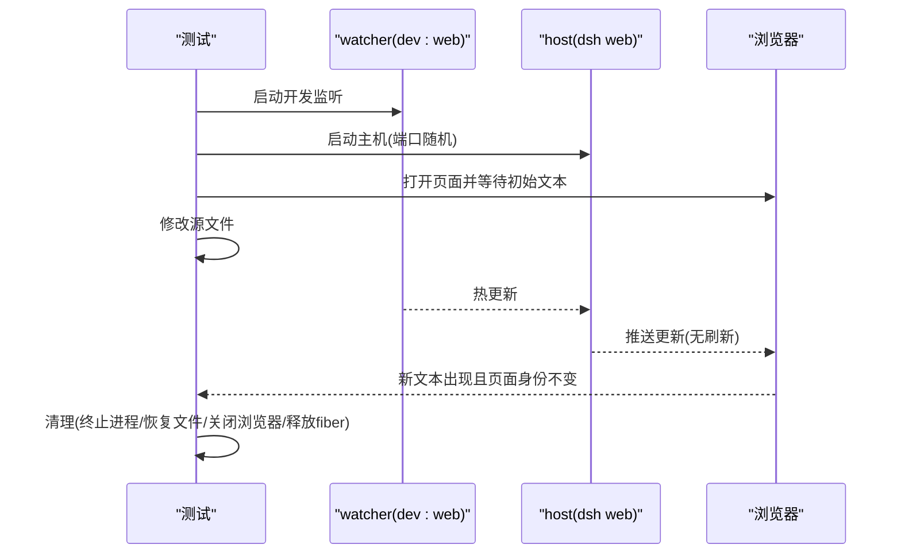
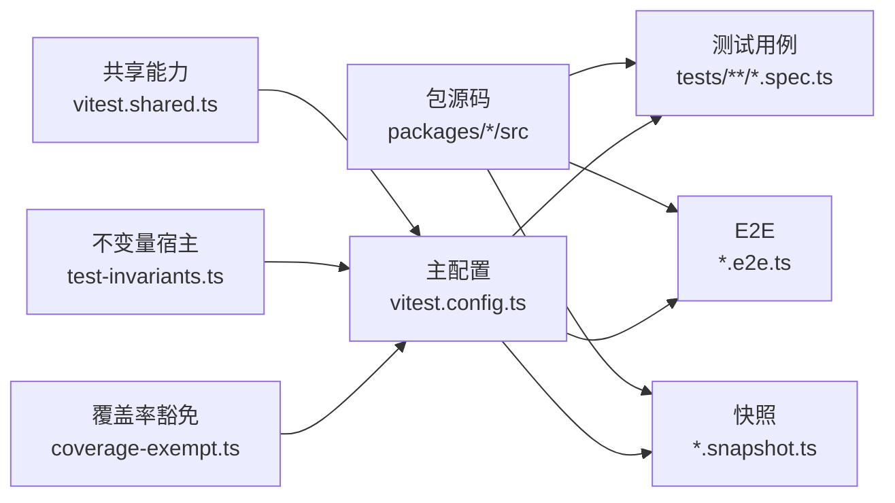

# 单元测试

<cite>
**本文引用的文件**
- [vitest.config.ts](file://vitest.config.ts)
- [vitest.shared.ts](file://vitest.shared.ts)
- [vitest.e2e.config.ts](file://vitest.e2e.config.ts)
- [vitest.web.config.ts](file://vitest.web.config.ts)
- [vitest.snapshot.config.ts](file://vitest.snapshot.config.ts)
- [package.json](file://package.json)
- [docs/testing.md](file://docs/testing.md)
- [scripts/test-invariants.ts](file://scripts/test-invariants.ts)
- [scripts/coverage-exempt.ts](file://scripts/coverage-exempt.ts)
- [apps/cli/tests/args.spec.ts](file://apps/cli/tests/args.spec.ts)
- [packages/acp/acp/tests/dispose.spec.ts](file://packages/acp/acp/tests/dispose.spec.ts)
- [apps/web/tests/hmr-live.e2e.ts](file://apps/web/tests/hmr-live.e2e.ts)
</cite>

## 目录
1. [简介](#简介)
2. [项目结构](#项目结构)
3. [核心组件](#核心组件)
4. [架构总览](#架构总览)
5. [详细组件分析](#详细组件分析)
6. [依赖关系分析](#依赖关系分析)
7. [性能与并发](#性能与并发)
8. [故障排查指南](#故障排查指南)
9. [结论](#结论)
10. [附录](#附录)

## 简介
本文件面向贡献者，系统化说明仓库的单元测试策略、Vitest 配置与使用方式、高质量测试编写规范（边缘情况、错误路径、事件顺序、并发竞态）、HMR 安全测试与 fiber 清理保障、覆盖率要求与最佳实践（每行 100% 覆盖）、测试数据管理、模拟策略与断言模式，以及包内测试组织与源码对应关系。目标是让读者在不深入源码细节的情况下也能正确编写与维护测试。

## 项目结构
仓库采用多配置、多通道的测试体系：
- 单元测试：默认 vitest 配置，按“线程安全”和“进程绑定”两个项目并行执行，严格覆盖率门控。
- E2E：独立配置，针对真实 API 调用，具备超时、重试与并发控制。
- Web 浏览器通道：基于 Chromium 的快照与交互测试，串行运行以共享浏览器实例。
- 快照通道：回放/录制/刷新外部行为（协议、传输、持久化日志），支持并发回放但写入串行。
- 共享能力：装饰器预转换、tsconfig paths 解析、全局不变量宿主、覆盖率豁免清单等。

**图表来源**
- [package.json:19-47](file://package.json#L19-L47)
- [vitest.config.ts:117-159](file://vitest.config.ts#L117-L159)
- [vitest.shared.ts:1-43](file://vitest.shared.ts#L1-L43)
- [scripts/test-invariants.ts:1-274](file://scripts/test-invariants.ts#L1-L274)
- [scripts/coverage-exempt.ts:1-42](file://scripts/coverage-exempt.ts#L1-L42)

**章节来源**
- [package.json:19-47](file://package.json#L19-L47)
- [vitest.config.ts:117-159](file://vitest.config.ts#L117-L159)
- [vitest.e2e.config.ts:31-57](file://vitest.e2e.config.ts#L31-L57)
- [vitest.web.config.ts:16-35](file://vitest.web.config.ts#L16-L35)
- [vitest.snapshot.config.ts:39-67](file://vitest.snapshot.config.ts#L39-L67)

## 核心组件
- Vitest 入口与通道
  - 单元测试：双项目（thread-safe/process-bound）+ v8 覆盖率 + per-file 100% 阈值。
  - E2E：真实 API 调用，可配置并发，自带重试与较长超时。
  - Web：Chromium 快照与交互，串行文件级执行，共享浏览器。
  - 快照：回放/录制/刷新三种模式；回放并行、写入串行。
- 共享能力
  - 装饰器预转换：在 Vite 解析前将 TS 装饰器转译为 ES 代码并处理 v8 忽略注释。
  - tsconfig paths：统一通过 base 项目解析，避免加载构建产物导致单例重复。
  - 全局不变量宿主：自动发现并挂载各包的 invariant 插件，保证服务拓扑与生命周期一致性。
- 覆盖率与豁免
  - 仅统计 packages/*/src/** 下的可执行代码，排除类型/入口/worker/客户端债务区域等。
  - 重型套件可在未插桩通道中运行，保持正确性信号但不影响覆盖率耗时。

**章节来源**
- [vitest.config.ts:117-283](file://vitest.config.ts#L117-L283)
- [vitest.shared.ts:1-43](file://vitest.shared.ts#L1-L43)
- [scripts/test-invariants.ts:1-274](file://scripts/test-invariants.ts#L1-L274)
- [scripts/coverage-exempt.ts:1-42](file://scripts/coverage-exempt.ts#L1-L42)

## 架构总览
下图展示测试运行时如何串联配置、共享能力与测试用例，并体现覆盖率门控与平台差异处理。

**图表来源**
- [vitest.config.ts:117-283](file://vitest.config.ts#L117-L283)
- [vitest.shared.ts:1-43](file://vitest.shared.ts#L1-L43)
- [scripts/test-invariants.ts:1-274](file://scripts/test-invariants.ts#L1-L274)

## 详细组件分析

### 单元测试配置与执行模型
- 双项目隔离
  - thread-safe：通用用例，fork 池，避免 Node worker 线程问题。
  - process-bound：进程相关用例单独运行，避免全局状态污染。
- 包含/排除策略
  - include：packages/apps/examples/scripts 下的 spec 文件。
  - exclude：Windows 不支持的包/测试、进程绑定测试、覆盖率豁免套件。
- 覆盖率门控
  - provider: v8，thresholds 全部 100%，perFile 开启。
  - include 限定到 packages/*/src/**，排除类型/入口/worker/客户端债务区域等。
  - CI 下输出精确位置报告，便于定位未覆盖语句/分支/函数。

**图表来源**
- [vitest.config.ts:117-283](file://vitest.config.ts#L117-L283)

**章节来源**
- [vitest.config.ts:117-283](file://vitest.config.ts#L117-L283)

### E2E 通道（真实 API）
- 目标：对真实提供商 API 进行冒烟与回归，无密钥时自跳过。
- 并发与超时：可配置最大工作进程，默认 4；测试/钩子超时更长；支持重试。
- 环境变量：优先从 .env 加载，缺失则回退到环境已存在变量。

**图表来源**
- [vitest.e2e.config.ts:31-57](file://vitest.e2e.config.ts#L31-L57)

**章节来源**
- [vitest.e2e.config.ts:1-59](file://vitest.e2e.config.ts#L1-L59)

### Web 浏览器通道（快照与交互）
- 目标：基于 Chromium 的浏览器快照与交互场景，串行文件级执行以共享浏览器。
- 构建依赖：先构建前端资源，再运行测试；CI 强制 replay 模式，禁止写回黄金文件。
- 环境变量：可选加载 .env，用于 keyless 回放或本地录制。

**章节来源**
- [vitest.web.config.ts:1-36](file://vitest.web.config.ts#L1-L36)

### 快照通道（回放/录制/刷新）
- 模式
  - replay：默认，回放已记录的外部行为，不写盘。
  - record：读取密钥，生成/更新黄金文件。
  - refresh：回放已记录输入，更新当前期望输出。
- 并发：回放可并行（受环境变量控制），record/refresh 串行以避免竞争写。

**章节来源**
- [vitest.snapshot.config.ts:1-69](file://vitest.snapshot.config.ts#L1-L69)

### 共享能力：装饰器与路径解析
- 装饰器预转换：在 Vite 解析前将 TS 装饰器转译为目标 ES 版本，并移除 source map 尾注，同时为编译器合成访问器添加 v8 ignore 注释，避免干扰覆盖率。
- tsconfig paths：所有配置指向 base 项目，确保 workspace 裸名导入解析到 src，避免加载 lib 产物造成模块单例重复。

**章节来源**
- [vitest.shared.ts:1-43](file://vitest.shared.ts#L1-L43)
- [vitest.config.ts:15-20](file://vitest.config.ts#L15-L20)

### 全局不变量宿主与 Fiber 生命周期
- 作用：在每个测试根自动发现并挂载对应包的 invariant 插件，确保服务拓扑一致性与生命周期约束。
- 机制：拦截 RegistryService.plugin，延迟启动直到 invariant 就绪；提供 TEST_INVARIANT_READY_SERVICE 注入点；支持手动拓扑例外。
- 与 HMR/fiber 的关系：fiber 卸载会按逆序调用处置器，测试需验证旧 fiber 的所有注册被清理，新 fiber 重新生效。

**图表来源**
- [scripts/test-invariants.ts:63-98](file://scripts/test-invariants.ts#L63-L98)
- [scripts/test-invariants.ts:158-209](file://scripts/test-invariants.ts#L158-L209)

**章节来源**
- [scripts/test-invariants.ts:1-274](file://scripts/test-invariants.ts#L1-L274)

### 覆盖率门控与豁免
- 范围：仅统计 packages/*/src/** 的可执行代码；排除类型、bin、worker、客户端债务区域等。
- 阈值：statements/branches/functions/lines 均为 100%，且 perFile 开启，防止大文件补贴小文件。
- 豁免：重型套件（如 typert generator、脚本契约测试）在未插桩通道运行，不影响覆盖率门控。

**章节来源**
- [vitest.config.ts:160-283](file://vitest.config.ts#L160-L283)
- [scripts/coverage-exempt.ts:1-42](file://scripts/coverage-exempt.ts#L1-L42)

### 高质量测试编写指南
- 边缘情况与错误路径
  - 覆盖参数校验、非法输入、缺失配置、异常退出码等。
  - 示例参考：命令行参数解析的正反用例与退出码断言。
- 事件顺序与并发竞态
  - 使用等待与断言确认事件时序（如 vi.waitFor）。
  - 对异步清理、并发 dispose、嵌套失败聚合等进行显式验证。
- 模拟策略
  - 仅对昂贵或非确定性边界进行模拟（LLM 适配器、网络、时钟），其余保持真实实现。
  - 使用 vi.spyOn/vi.mock 替换副作用，并在 afterEach 恢复。
- 断言模式
  - 对外部世界进行断言（文件字节一致、外部命令输出、持久化日志），而非仅检查自身报告。
  - 对快照类测试，区分 replay/record/refresh 的职责与权限。

**章节来源**
- [apps/cli/tests/args.spec.ts:1-107](file://apps/cli/tests/args.spec.ts#L1-L107)
- [docs/testing.md:17-35](file://docs/testing.md#L17-L35)

### HMR 安全测试与 Fiber 清理
- 目标：确保每次热替换后，旧 fiber 的所有注册被清理，新 fiber 能正确接管，且不残留副作用。
- 方法
  - 在测试中创建上下文与 fiber，修改源文件触发 HMR，断言 UI/状态变化且页面身份未丢失。
  - 在 finally 中终止子进程树、关闭浏览器、恢复源文件、释放 fiber。
- 关键断言
  - 旧 fiber 的 service/listener/tool/systemPrompt 等注册被移除。
  - 新 fiber 的注册可用，行为符合预期。
  - 浏览器侧无错误，页面未刷新。

**图表来源**
- [apps/web/tests/hmr-live.e2e.ts:70-132](file://apps/web/tests/hmr-live.e2e.ts#L70-L132)

**章节来源**
- [apps/web/tests/hmr-live.e2e.ts:1-133](file://apps/web/tests/hmr-live.e2e.ts#L1-L133)

### 测试数据管理与夹具
- 夹具组织
  - 与源码同级的 tests 目录，按功能域划分；快照与 fixture 放在各自包或 apps 下。
  - 大型/重型夹具放入豁免清单，避免插桩带来的性能损耗。
- 数据策略
  - 键less 回放优先，keyed 录制仅在 record 模式下进行。
  - 外部行为（协议、传输、UI）使用快照；内部逻辑使用单元断言。
- 清理策略
  - 每个测试拥有自己的资源创建与销毁；afterEach 中释放，即使失败/重试/超时也要清理。
  - 共享夹具避免重复注册 describe 导致的副作用。

**章节来源**
- [docs/testing.md:17-35](file://docs/testing.md#L17-L35)
- [scripts/coverage-exempt.ts:1-42](file://scripts/coverage-exempt.ts#L1-L42)

### 包内测试组织与源码对应关系
- 规则
  - 测试与源码同属一个包，tests 目录与 src 并列。
  - 通过 vitest.include 匹配 patterns 自动发现。
  - 通过 vite-tsconfig-paths 解析 bare imports 到 src，避免加载 lib。
- 示例
  - apps/cli/tests 对应 apps/cli/src。
  - packages/*/tests 对应 packages/*/src。
  - scripts/*.spec.ts 对应脚本工具。

**章节来源**
- [vitest.config.ts:85-90](file://vitest.config.ts#L85-L90)
- [vitest.config.ts:15-20](file://vitest.config.ts#L15-L20)

## 依赖关系分析
- 配置层
  - 主配置定义双项目、覆盖率阈值、包含/排除、平台差异处理。
  - E2E/Web/Snapshot 配置分别定义超时、并发、包含范围与环境加载。
- 共享层
  - 装饰器预转换、execArgv 控制、tsconfig paths。
- 基础设施层
  - 不变量宿主、覆盖率豁免、脚本工具。
- 测试层
  - 单元/E2E/Web/快照用例，遵循文档策略与最佳实践。

**图表来源**
- [vitest.config.ts:85-90](file://vitest.config.ts#L85-L90)
- [vitest.shared.ts:1-43](file://vitest.shared.ts#L1-L43)
- [scripts/test-invariants.ts:1-274](file://scripts/test-invariants.ts#L1-L274)
- [scripts/coverage-exempt.ts:1-42](file://scripts/coverage-exempt.ts#L1-L42)

**章节来源**
- [vitest.config.ts:85-90](file://vitest.config.ts#L85-L90)
- [vitest.shared.ts:1-43](file://vitest.shared.ts#L1-L43)
- [scripts/test-invariants.ts:1-274](file://scripts/test-invariants.ts#L1-L274)
- [scripts/coverage-exempt.ts:1-42](file://scripts/coverage-exempt.ts#L1-L42)

## 性能与并发
- 单元测试
  - fork 池避免 worker 线程问题；进程绑定用例单独项目隔离。
  - 覆盖率 v8 插桩开销大，重型套件豁免至未插桩通道。
- E2E
  - 可配置并发（DSH_E2E_MAX_WORKERS），默认 4；重试提升稳定性。
- Web
  - 串行文件级执行，共享浏览器实例，降低启动成本。
- 快照
  - 回放并行（受 DSH_SNAPSHOT_MAX_CONCURRENCY 控制），record/refresh 串行避免竞争写。

**章节来源**
- [vitest.config.ts:124-159](file://vitest.config.ts#L124-L159)
- [vitest.e2e.config.ts:16-57](file://vitest.e2e.config.ts#L16-L57)
- [vitest.web.config.ts:24-35](file://vitest.web.config.ts#L24-L35)
- [vitest.snapshot.config.ts:19-67](file://vitest.snapshot.config.ts#L19-L67)

## 故障排查指南
- 覆盖率失败
  - 查看未覆盖位置报告（CI 输出精确 path:line:col）。
  - 检查 include/exclude 是否误排除了被测文件。
  - 确认重型套件是否在豁免清单中且不影响覆盖率门控。
- 进程/平台问题
  - Windows 上排除 bash/sandbox 等 POSIX 依赖套件。
  - pwsh 缺失时豁免相应文件，CI 仍强制执行完整覆盖率。
- HMR 测试失败
  - 确认已构建产物存在；检查 watcher/host 输出；确保 finally 中清理子进程树与浏览器。
- 不变量宿主
  - 若自定义拓扑，需在例外列表或通过手动装配；否则自动发现 companion 必须 inject invariants。

**章节来源**
- [vitest.config.ts:21-83](file://vitest.config.ts#L21-L83)
- [vitest.config.ts:160-283](file://vitest.config.ts#L160-L283)
- [apps/web/tests/hmr-live.e2e.ts:70-132](file://apps/web/tests/hmr-live.e2e.ts#L70-L132)
- [scripts/test-invariants.ts:48-53](file://scripts/test-invariants.ts#L48-L53)

## 结论
本仓库通过多通道 Vitest 配置、严格的 per-file 100% 覆盖率门控、完善的共享能力与不变量宿主，构建了稳定且高保真的测试体系。贡献者在编写测试时应遵循“真实入口优先、外部世界断言、最小化模拟、关注边缘与并发”的原则，并通过快照与 E2E 保障端到端行为。HMR 安全测试确保热替换不会遗留副作用，fiber 清理得到显式验证。遵循本文档的组织与策略，可显著提升代码质量与交付信心。

## 附录
- 常用命令
  - 单元测试：pnpm run test
  - 覆盖率：pnpm run test:coverage
  - E2E：pnpm run test:e2e
  - Web：pnpm run test:web / test:web:refresh
  - 快照：pnpm run test:snapshot / test:snapshot:record / test:snapshot:refresh

**章节来源**
- [package.json:19-47](file://package.json#L19-L47)