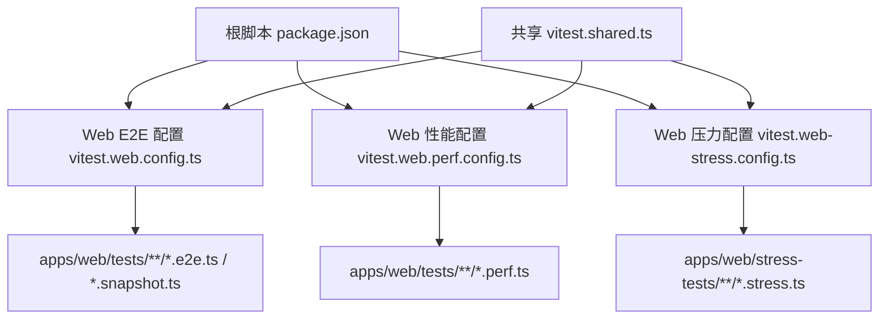
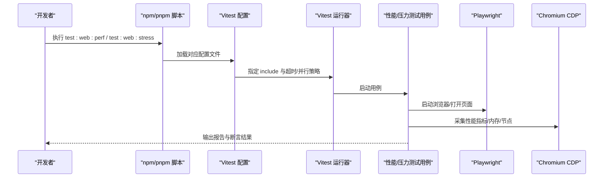
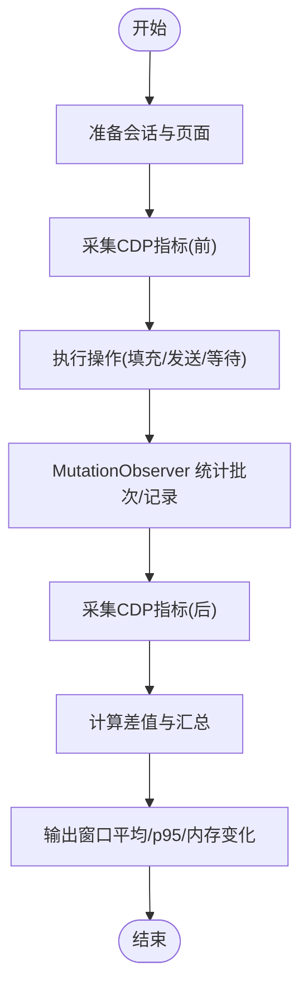
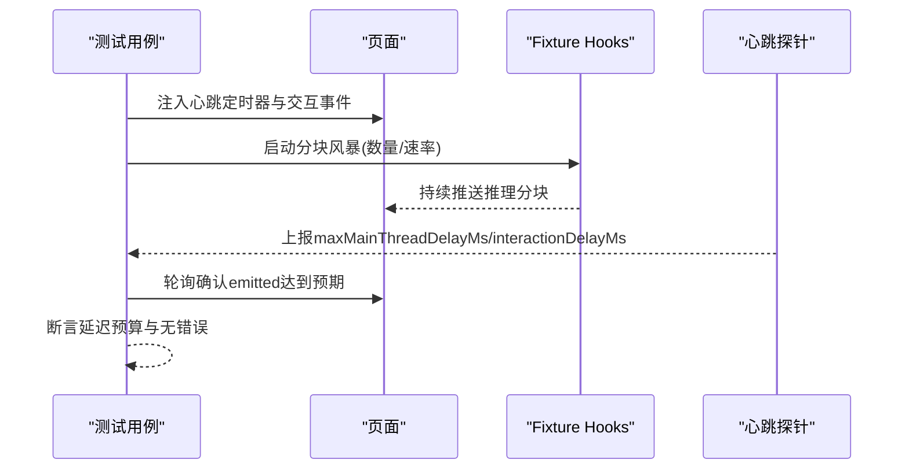
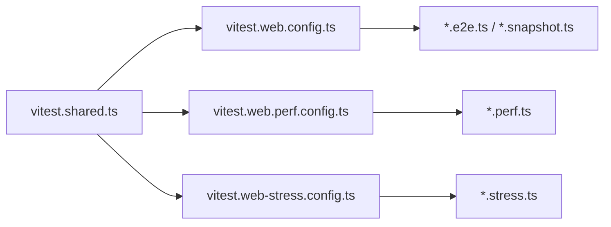
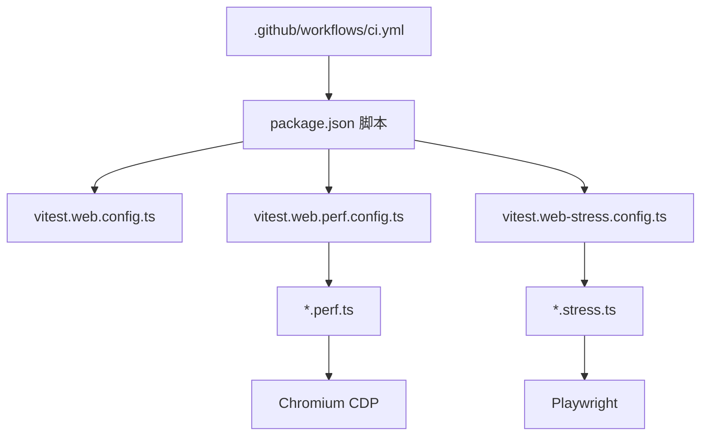

# 性能测试

<cite>
**本文引用的文件**
- [BENCHMARK.md](file://BENCHMARK.md)
- [vitest.web.config.ts](file://vitest.web.config.ts)
- [vitest.web.perf.config.ts](file://vitest.web.perf.config.ts)
- [vitest.web-stress.config.ts](file://vitest.web-stress.config.ts)
- [vitest.shared.ts](file://vitest.shared.ts)
- [apps/web/stress-tests/reasoning-chunks.stress.ts](file://apps/web/stress-tests/reasoning-chunks.stress.ts)
- [apps/web/tests/complex-history.perf.ts](file://apps/web/tests/complex-history.perf.ts)
- [package.json](file://package.json)
- [.github/workflows/ci.yml](file://.github/workflows/ci.yml)
</cite>

## 目录
1. [简介](#简介)
2. [项目结构](#项目结构)
3. [核心组件](#核心组件)
4. [架构总览](#架构总览)
5. [详细组件分析](#详细组件分析)
6. [依赖关系分析](#依赖关系分析)
7. [性能考量](#性能考量)
8. [故障排查指南](#故障排查指南)
9. [结论](#结论)
10. [附录](#附录)

## 简介
本文件面向性能测试的落地实践，覆盖基准测试、压力测试、内存与CPU监控、Web前端性能工具链、数据库查询与API响应时间策略、结果分析与问题定位，以及持续集成中的流程与阈值设置。仓库已提供浏览器端的高基数渲染与流式输出压测用例、基于CDP的指标采集、Vitest多配置分层（常规E2E、性能、压力）以及CI中可触发的大规模并发基准任务。

## 项目结构
- 性能相关测试按“用途+环境”分层组织：
  - 常规Web E2E与快照：由 web 配置管理，串行执行以保证稳定性。
  - 性能基准：独立配置文件包含 *.perf.ts，启用长超时与禁用控制台拦截，便于采集稳定指标。
  - 压力测试：独立配置文件包含 *.stress.ts，关闭文件并行，避免资源竞争干扰。
- 共享能力：
  - 装饰器预处理与环境参数统一注入，确保不同测试通道行为一致。
- 入口脚本：
  - 根脚本提供 test:web、test:web:perf、test:web:stress 等命令，串联构建与运行。

**图表来源**
- [package.json:19-47](file://package.json#L19-L47)
- [vitest.web.config.ts:1-36](file://vitest.web.config.ts#L1-L36)
- [vitest.web.perf.config.ts:1-16](file://vitest.web.perf.config.ts#L1-L16)
- [vitest.web-stress.config.ts:1-15](file://vitest.web-stress.config.ts#L1-L15)
- [vitest.shared.ts:1-43](file://vitest.shared.ts#L1-L43)

**章节来源**
- [package.json:19-47](file://package.json#L19-L47)
- [vitest.web.config.ts:1-36](file://vitest.web.config.ts#L1-L36)
- [vitest.web.perf.config.ts:1-16](file://vitest.web.perf.config.ts#L1-L16)
- [vitest.web-stress.config.ts:1-15](file://vitest.web-stress.config.ts#L1-L15)
- [vitest.shared.ts:1-43](file://vitest.shared.ts#L1-L43)

## 核心组件
- Web 性能基准套件
  - 通过 Playwright + Chromium CDP 采集任务时长、脚本执行、布局、样式重算、节点数、事件监听器数量、堆使用量等指标。
  - 构造高基数的历史会话与侧边栏条目，验证长列表与大量消息的渲染性能与内存保留。
  - 使用 MutationObserver 统计增量渲染批次与记录数，评估流式更新对主线程的影响。
- Web 压力测试套件
  - 模拟海量推理分块（如10万级）以检验渲染管线是否阻塞主线程。
  - 在页面内埋点测量心跳间隔抖动与交互延迟，断言主线程延迟预算。
- 共享测试基础设施
  - 装饰器预编译、环境变量加载、Worker 参数统一，保证各通道一致性。
- 基准运行指引
  - 文档说明如何安装SDK并运行最小化变体进行基准对比。

**章节来源**
- [apps/web/tests/complex-history.perf.ts:1-170](file://apps/web/tests/complex-history.perf.ts#L1-L170)
- [apps/web/tests/complex-history.perf.ts:519-568](file://apps/web/tests/complex-history.perf.ts#L519-L568)
- [apps/web/tests/complex-history.perf.ts:582-617](file://apps/web/tests/complex-history.perf.ts#L582-L617)
- [apps/web/tests/complex-history.perf.ts:619-779](file://apps/web/tests/complex-history.perf.ts#L619-L779)
- [apps/web/stress-tests/reasoning-chunks.stress.ts:1-154](file://apps/web/stress-tests/reasoning-chunks.stress.ts#L1-L154)
- [vitest.shared.ts:1-43](file://vitest.shared.ts#L1-L43)
- [BENCHMARK.md:1-4](file://BENCHMARK.md#L1-L4)

## 架构总览
下图展示从脚本到具体测试执行的调用链，以及关键配置的作用范围。

**图表来源**
- [package.json:19-47](file://package.json#L19-L47)
- [vitest.web.config.ts:1-36](file://vitest.web.config.ts#L1-L36)
- [vitest.web.perf.config.ts:1-16](file://vitest.web.perf.config.ts#L1-L16)
- [vitest.web-stress.config.ts:1-15](file://vitest.web-stress.config.ts#L1-L15)
- [apps/web/tests/complex-history.perf.ts:519-568](file://apps/web/tests/complex-history.perf.ts#L519-L568)

## 详细组件分析

### 组件A：Web 性能基准（复杂历史与流式渲染）
- 目标
  - 在高基数工作区与长会话场景下，验证渲染性能、内存保留与用户交互响应。
- 关键实现
  - 通过 Session API 生成大量历史条目与工具调用，构造真实负载。
  - 使用 CDP 的 Performance.getMetrics 获取任务、脚本、布局、样式重算等耗时；HeapProfiler.collectGarbage 后读取堆使用量。
  - 使用 MutationObserver 统计流式更新的批次数与记录数，衡量增量渲染开销。
  - 定义测量封装 measure(before, after) 计算差值，并以窗口聚合输出平均与p95。
- 指标定义
  - wallMs/taskMs/scriptMs/layoutMs/recalcStyleMs：总体与细分阶段耗时。
  - nodesDelta/listenersDelta/heapDeltaMb：DOM与JS对象增长情况。
  - mutationBatches/records：增量渲染频率与数据量。
  - clickToUserEchoMs/clickToFirstChunkMs：用户输入到首帧可见与首个数据块的时延。
- 回归检测
  - 当前用例不直接断言绝对阈值（主机差异），但通过结构性断言保证数据规模不被缩减；建议结合CI基线趋势与p95阈值做回归判定。

**图表来源**
- [apps/web/tests/complex-history.perf.ts:519-568](file://apps/web/tests/complex-history.perf.ts#L519-L568)
- [apps/web/tests/complex-history.perf.ts:582-617](file://apps/web/tests/complex-history.perf.ts#L582-L617)
- [apps/web/tests/complex-history.perf.ts:619-779](file://apps/web/tests/complex-history.perf.ts#L619-L779)
- [apps/web/tests/complex-history.perf.ts:1139-1170](file://apps/web/tests/complex-history.perf.ts#L1139-L1170)

**章节来源**
- [apps/web/tests/complex-history.perf.ts:1-170](file://apps/web/tests/complex-history.perf.ts#L1-L170)
- [apps/web/tests/complex-history.perf.ts:519-568](file://apps/web/tests/complex-history.perf.ts#L519-L568)
- [apps/web/tests/complex-history.perf.ts:582-617](file://apps/web/tests/complex-history.perf.ts#L582-L617)
- [apps/web/tests/complex-history.perf.ts:619-779](file://apps/web/tests/complex-history.perf.ts#L619-L779)
- [apps/web/tests/complex-history.perf.ts:1139-1170](file://apps/web/tests/complex-history.perf.ts#L1139-L1170)

### 组件B：Web 压力测试（推理分块风暴）
- 目标
  - 在保持UI处于活跃状态的前提下，向渲染管线注入海量推理分块，验证主线程是否被阻塞。
- 关键实现
  - 通过页面注入心跳定时器测量tick抖动，并在固定时间点派发交互事件，测量交互处理延迟。
  - 使用 fixture hooks 启动分块风暴，轮询确认已发射数量与UI标记可见性。
  - 断言最大主线程延迟与交互延迟不超过预算，且无页面错误与警告。
- 指标定义
  - maxMainThreadDelayMs：心跳间隔抖动最大值。
  - interactionDelayMs：交互事件调度到处理的延迟。
  - heartbeatSamples：心跳采样次数。
  - emitted/chunkCount：分块发射数量与总量。

**图表来源**
- [apps/web/stress-tests/reasoning-chunks.stress.ts:46-154](file://apps/web/stress-tests/reasoning-chunks.stress.ts#L46-L154)

**章节来源**
- [apps/web/stress-tests/reasoning-chunks.stress.ts:1-154](file://apps/web/stress-tests/reasoning-chunks.stress.ts#L1-L154)

### 组件C：Vitest 配置分层与执行策略
- Web E2E 配置
  - 包含 e2e/snapshot 文件，串行执行，较长超时，适合真实模型场景。
- Web 性能配置
  - 仅包含 perf 文件，禁用控制台拦截，更长超时，便于稳定采集指标。
- Web 压力配置
  - 仅包含 stress 文件，关闭文件并行，避免资源竞争。
- 共享插件
  - 装饰器预编译与环境参数统一，确保跨通道一致性。

**图表来源**
- [vitest.shared.ts:1-43](file://vitest.shared.ts#L1-L43)
- [vitest.web.config.ts:1-36](file://vitest.web.config.ts#L1-L36)
- [vitest.web.perf.config.ts:1-16](file://vitest.web.perf.config.ts#L1-L16)
- [vitest.web-stress.config.ts:1-15](file://vitest.web-stress.config.ts#L1-L15)

**章节来源**
- [vitest.web.config.ts:1-36](file://vitest.web.config.ts#L1-L36)
- [vitest.web.perf.config.ts:1-16](file://vitest.web.perf.config.ts#L1-L16)
- [vitest.web-stress.config.ts:1-15](file://vitest.web-stress.config.ts#L1-L15)
- [vitest.shared.ts:1-43](file://vitest.shared.ts#L1-L43)

### 组件D：基准运行与SDK指引
- 通过文档指引安装Python SDK并运行最小化变体，用于独立基准任务对比。
- 建议在独立工作空间与会话ID下运行，避免相互干扰。

**章节来源**
- [BENCHMARK.md:1-4](file://BENCHMARK.md#L1-L4)

## 依赖关系分析
- 测试与配置
  - 根脚本通过不同配置文件选择不同测试集合并控制执行策略。
  - 性能与压力用例依赖 Playwright 与 Chromium CDP 采集底层指标。
- CI 集成
  - 提供手动触发的更大规模基准任务，支持多核矩阵与并发度调节，用于评估缓存机制与整体吞吐。

**图表来源**
- [package.json:19-47](file://package.json#L19-L47)
- [vitest.web.config.ts:1-36](file://vitest.web.config.ts#L1-L36)
- [vitest.web.perf.config.ts:1-16](file://vitest.web.perf.config.ts#L1-L16)
- [vitest.web-stress.config.ts:1-15](file://vitest.web-stress.config.ts#L1-L15)
- [.github/workflows/ci.yml:700-899](file://.github/workflows/ci.yml#L700-L899)

**章节来源**
- [package.json:19-47](file://package.json#L19-L47)
- [.github/workflows/ci.yml:700-899](file://.github/workflows/ci.yml#L700-L899)

## 性能考量
- 指标采集
  - 使用 CDP 的 Performance.getMetrics 获取任务、脚本、布局、样式重算等耗时；HeapProfiler.collectGarbage 后进行堆使用量采样，减少GC噪声。
  - 通过 MutationObserver 统计增量渲染批次与记录数，识别过度批处理或频繁更新。
- 内存泄漏检测
  - 在关键阶段前后采集 JSHeapUsedSize、Nodes、JSEventListeners，计算差值；若持续增长且不回落，需排查未释放引用或监听器。
- CPU使用率监控
  - 关注 TaskDuration、ScriptDuration、LayoutDuration、RecalcStyleDuration 的变化；结合 p95 指标观察尾部延迟。
- 前端性能工具链
  - Playwright + Chromium CDP：无需额外扩展即可采集底层指标。
  - Vitest 多配置：将性能与压力测试隔离，避免影响常规E2E稳定性。
- 数据库查询与API响应时间策略
  - 在当前仓库中未发现专门的DB/API压测用例；建议采用相同思路：构造请求负载、采集端到端耗时与后端指标、设定p95/p99阈值并纳入CI基线。
- 结果分析与问题定位
  - 优先检查突变热点（布局/样式重算）、监听器增长、堆使用增长；结合窗口平均与p95定位退化区间。
  - 对于流式渲染，关注首包到达时间与后续增量批次是否平稳。

[本节为通用指导，不直接分析具体文件]

## 故障排查指南
- 常见失败原因
  - 页面元素不可用或选择器变更导致等待超时。
  - CDP指标缺失或不可用（例如某些指标名称不存在）。
  - 压力测试中交互未按时处理（心跳或事件未触发）。
- 诊断步骤
  - 确认页面结构与选择器，必要时增加更稳定的定位策略。
  - 打印并比对CDP指标集合，确认所需指标存在。
  - 在压力测试中捕获失败截图与日志，定位卡顿阶段。
- 参考实现
  - 性能测试中提供了失败清理与聚合异常抛出逻辑，便于快速定位 teardown 阶段的错误。

**章节来源**
- [apps/web/tests/complex-history.perf.ts:894-904](file://apps/web/tests/complex-history.perf.ts#L894-L904)
- [apps/web/tests/complex-history.perf.ts:538-542](file://apps/web/tests/complex-history.perf.ts#L538-L542)
- [apps/web/stress-tests/reasoning-chunks.stress.ts:113-148](file://apps/web/stress-tests/reasoning-chunks.stress.ts#L113-L148)

## 结论
该仓库已具备完善的Web前端性能测试能力：通过Vitest分层配置隔离不同测试类型，借助Playwright与Chromium CDP采集底层指标，覆盖高基数渲染与流式输出的压力场景。建议在此基础上引入基线阈值与趋势分析，逐步将性能回归纳入CI门禁，并结合数据库与API层的压测策略形成端到端的性能保障体系。

[本节为总结，不直接分析具体文件]

## 附录
- 常用命令
  - 构建并运行Web性能测试：test:web:perf
  - 构建并运行Web压力测试：test:web:stress
  - 运行常规Web E2E：test:web
- 关键配置要点
  - 性能配置：禁用控制台拦截、延长超时、仅包含 perf 文件。
  - 压力配置：关闭文件并行、延长超时、仅包含 stress 文件。
  - 共享配置：装饰器预处理与环境参数统一。
- CI基准任务
  - 可通过工作流手动触发大规模基准任务，调整并发度与平台矩阵，评估缓存与吞吐表现。

**章节来源**
- [package.json:19-47](file://package.json#L19-L47)
- [vitest.web.perf.config.ts:1-16](file://vitest.web.perf.config.ts#L1-L16)
- [vitest.web-stress.config.ts:1-15](file://vitest.web-stress.config.ts#L1-L15)
- [.github/workflows/ci.yml:700-899](file://.github/workflows/ci.yml#L700-L899)