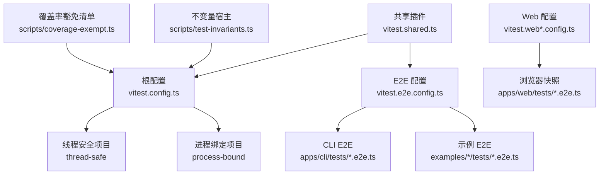
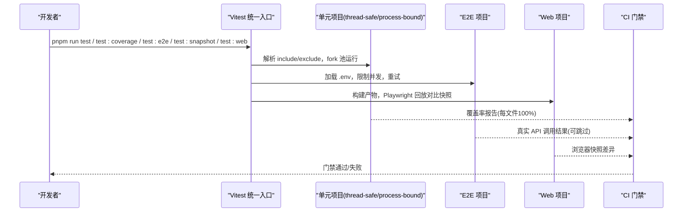
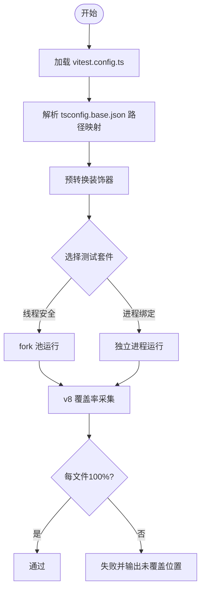
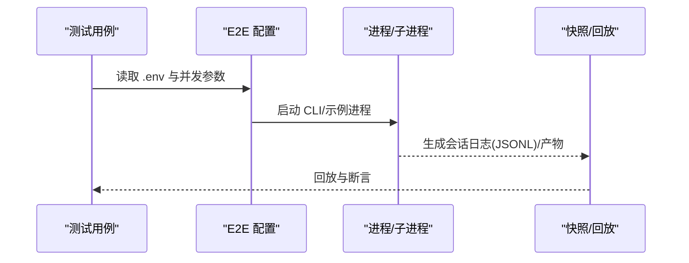
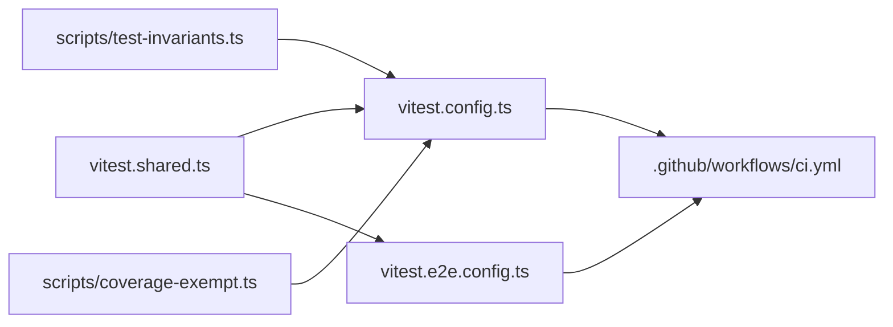

# 测试策略

<cite>
**本文引用的文件**
- [vitest.config.ts](file://vitest.config.ts)
- [vitest.e2e.config.ts](file://vitest.e2e.config.ts)
- [vitest.shared.ts](file://vitest.shared.ts)
- [docs/testing.md](file://docs/testing.md)
- [scripts/test-invariants.ts](file://scripts/test-invariants.ts)
- [scripts/coverage-exempt.ts](file://scripts/coverage-exempt.ts)
- [.github/workflows/ci.yml](file://.github/workflows/ci.yml)
- [package.json](file://package.json)
- [apps/cli/tests/args.spec.ts](file://apps/cli/tests/args.spec.ts)
- [apps/web/tests/support.ts](file://apps/web/tests/support.ts)
</cite>

## 目录
1. [简介](#简介)
2. [项目结构](#项目结构)
3. [核心组件](#核心组件)
4. [架构总览](#架构总览)
5. [详细组件分析](#详细组件分析)
6. [依赖关系分析](#依赖关系分析)
7. [性能考虑](#性能考虑)
8. [故障排查指南](#故障排查指南)
9. [结论](#结论)
10. [附录](#附录)

## 简介
本测试策略文档面向 deepseek-harness 仓库，系统化阐述分层测试体系、测试框架选型与配置、单元测试与集成测试的编写规范、端到端测试方案与数据管理、性能与负载测试指导、覆盖率门禁与报告、持续集成中的质量门禁，以及调试与问题排查方法。目标是让不同背景的读者都能理解并落地执行一致的测试实践。

## 项目结构
仓库采用多包 monorepo 组织，测试代码按层级分布在：
- 单元测试：各包的 tests 目录下的 *.spec.ts（或 .tsx），由根 vitest 配置统一收集与运行
- 端到端测试：apps/cli 与 apps/web 下的 *.e2e.ts，使用独立 e2e 配置
- 快照测试：基于 keyless 场景与回放机制，覆盖外部行为与产物
- Web 浏览器测试：基于 Playwright 的 web 配置，构建产物后比对快照
- 覆盖率：v8 提供者，严格到每个源文件的 100% 阈值

图表来源
- [vitest.config.ts:117-159](file://vitest.config.ts#L117-L159)
- [vitest.e2e.config.ts:31-57](file://vitest.e2e.config.ts#L31-L57)
- [vitest.shared.ts:15-42](file://vitest.shared.ts#L15-L42)
- [scripts/test-invariants.ts:1-47](file://scripts/test-invariants.ts#L1-L47)
- [scripts/coverage-exempt.ts:1-42](file://scripts/coverage-exempt.ts#L1-L42)

章节来源
- [vitest.config.ts:85-159](file://vitest.config.ts#L85-L159)
- [vitest.e2e.config.ts:5-57](file://vitest.e2e.config.ts#L5-L57)
- [docs/testing.md:7-15](file://docs/testing.md#L7-L15)

## 核心组件
- 测试框架与运行时
  - Vitest 作为统一测试框架，支持多线程与分进程模式
  - v8 覆盖率提供者，强制每文件 100% 阈值
  - TypeScript 装饰器预转换插件，确保测试环境一致性
- 测试分层
  - 单元：packages/*/*/tests/**/*.spec.{ts,tsx}
  - E2E：apps/cli/tests/*.e2e.ts、examples/*/tests/*.e2e.ts
  - Web：apps/web/tests/*.e2e.ts（Playwright + 快照）
  - 快照：keyless 回放与 JSONL 持久化
- 质量门禁
  - 覆盖率门禁：每文件语句、分支、函数、行 100%
  - CI 门禁：静态检查、兼容性、快照、制品、Windows 原生等
- 测试基础设施
  - 不变量宿主：自动挂载各包 invariant 伴生，保证服务启动顺序与可用性
  - 覆盖率豁免：对重型套件进行无插桩并行运行，避免影响主覆盖率门限

章节来源
- [vitest.config.ts:160-283](file://vitest.config.ts#L160-L283)
- [vitest.shared.ts:1-42](file://vitest.shared.ts#L1-L42)
- [scripts/test-invariants.ts:1-47](file://scripts/test-invariants.ts#L1-L47)
- [scripts/coverage-exempt.ts:1-42](file://scripts/coverage-exempt.ts#L1-L42)
- [docs/testing.md:7-15](file://docs/testing.md#L7-L15)

## 架构总览
下图展示测试配置、运行环境与 CI 门禁之间的关系：

图表来源
- [vitest.config.ts:117-159](file://vitest.config.ts#L117-L159)
- [vitest.e2e.config.ts:31-57](file://vitest.e2e.config.ts#L31-L57)
- [.github/workflows/ci.yml:115-177](file://.github/workflows/ci.yml#L115-L177)

## 详细组件分析

### 单元测试：编写方法与最佳实践
- 位置与命名
  - 与源码同级的 tests 目录下，以 *.spec.ts/.tsx 结尾
  - 遵循“就近原则”，测试与模块在同一包内
- 隔离与稳定性
  - 默认使用 fork 池，避免 worker 线程在特定 Node 版本下的不稳定
  - 进程绑定测试单独成项目，避免全局状态污染
- 断言与模拟
  - 使用 Vitest 内置 expect/vi 进行断言与模拟
  - 优先使用真实实现，仅对昂贵或不确定边界进行模拟
- 装饰器与路径解析
  - 通过标准装饰器插件预处理，确保 tsx/jsx 正确编译
  - 所有 vitest 配置指向 tsconfig.base.json，保证源码平面解析一致

图表来源
- [vitest.config.ts:117-159](file://vitest.config.ts#L117-L159)
- [vitest.config.ts:160-283](file://vitest.config.ts#L160-L283)
- [vitest.shared.ts:15-42](file://vitest.shared.ts#L15-L42)

章节来源
- [vitest.config.ts:85-159](file://vitest.config.ts#L85-L159)
- [vitest.config.ts:160-283](file://vitest.config.ts#L160-L283)
- [vitest.shared.ts:1-42](file://vitest.shared.ts#L1-L42)
- [apps/cli/tests/args.spec.ts:1-107](file://apps/cli/tests/args.spec.ts#L1-L107)

### 集成测试：设计模式与模拟策略
- 设计模式
  - 优先真实组合：通过 Loader 与 app 启动最小可用组合，仅对外部服务或非确定性输入做模拟
  - 桥接工具测试：脚本化 mock 模型 + 真实工具与执行器，验证字节流转与副作用
- 模拟策略
  - 模拟 LLM 适配器、网络、时钟等昂贵或不稳定边界
  - 下游保持真实，避免“假绿”
- 恢复与异常
  - 覆盖失败分块、取消、耗尽、策略组合、持久化、状态、传输关闭超时等场景

章节来源
- [docs/testing.md:21-29](file://docs/testing.md#L21-L29)

### 端到端测试：实现方案与测试数据管理
- 范围
  - CLI 端到端：apps/cli/tests/*.e2e.ts
  - 示例端到端：examples/*/tests/*.e2e.ts
- 配置要点
  - 独立配置文件，加载 .env 环境变量
  - 较长超时与重试，控制并发工作进程数
- 测试数据管理
  - 关键场景使用 keyless 快照与 JSONL 回放，确保外部行为稳定
  - 浏览器测试使用 Playwright 截图与 DOM 快照，固定视口与语言环境

图表来源
- [vitest.e2e.config.ts:5-57](file://vitest.e2e.config.ts#L5-L57)
- [docs/testing.md:11-15](file://docs/testing.md#L11-L15)

章节来源
- [vitest.e2e.config.ts:5-57](file://vitest.e2e.config.ts#L5-L57)
- [docs/testing.md:11-15](file://docs/testing.md#L11-L15)

### Web 浏览器测试：快照与回放
- 构建产物先行：test:web 先构建前端产物，再运行 Playwright 测试
- 固定环境：设置视口宽度、语言环境，确保定位器稳定
- 失败证据：保存截图到 .artifacts，便于定位 UI 回归

章节来源
- [apps/web/tests/support.ts:1-136](file://apps/web/tests/support.ts#L1-L136)
- [package.json:42-47](file://package.json#L42-L47)

### 快照测试：设计与维护
- 关键变更必须新增或更新 keyless 场景，覆盖模型、协议、人类可见输出
- 记录与刷新：
  - 记录：DSH_SNAPSHOT=record 更新期望输出
  - 刷新：DSH_SNAPSHOT=refresh 在输入有效时刷新
- 审查：每次快照差异需人工审查，确保语义正确

章节来源
- [docs/testing.md:11-15](file://docs/testing.md#L11-L15)
- [package.json:38-40](file://package.json#L38-L40)

### 性能测试与负载测试
- Web 压力测试：提供 web-stress 配置，用于评估长时间交互与渲染压力
- 指标建议：
  - 首屏时间、交互响应延迟、内存占用、CPU 峰值
  - 并发用户数与吞吐量的平衡点
- 基线对比：将关键场景纳入基准集，定期回归

章节来源
- [package.json:45-47](file://package.json#L45-L47)

### 覆盖率要求与报告生成
- 覆盖率提供者：v8
- 阈值：每文件语句、分支、函数、行 100%
- 报告：
  - CI 环境输出文本与自定义未覆盖位置报告
  - 本地额外生成 HTML 报告
- 豁免：重型套件在无插桩模式下并行运行，不影响主覆盖率门限

章节来源
- [vitest.config.ts:160-283](file://vitest.config.ts#L160-L283)
- [scripts/coverage-exempt.ts:1-42](file://scripts/coverage-exempt.ts#L1-L42)

### 持续集成中的测试流程与质量门禁
- 门禁矩阵：
  - 静态检查、覆盖率、快照与制品、消费者兼容、Windows 原生
- 并发与缓存：
  - 合理设置 DSH_GATE_CONCURRENCY、DSH_COVERAGE_MAX_WORKERS、DSH_E2E_MAX_WORKERS
  - 缓存 pnpm store 与 Playwright 浏览器
- 回退与备用：
  - 支持自托管 Linux/Windows 回退池，保障 CI 韧性

章节来源
- [.github/workflows/ci.yml:115-177](file://.github/workflows/ci.yml#L115-L177)
- [.github/workflows/ci.yml:260-327](file://.github/workflows/ci.yml#L260-L327)
- [.github/workflows/ci.yml:447-490](file://.github/workflows/ci.yml#L447-L490)

### 测试调试与问题排查
- 常见症状
  - 覆盖率不达标：查看未覆盖位置报告，确认是否死代码或需要补充测试
  - E2E 不稳定：调整并发与工作进程数，增加重试与超时
  - Web 快照不一致：检查视口、语言、构建产物是否最新
- 工具与技巧
  - 使用 DSH_SNAPSHOT=record/refresh 管理快照
  - 利用不变量宿主快速定位服务启动顺序问题
  - 通过 process-bound 项目隔离进程级副作用

章节来源
- [vitest.config.ts:160-283](file://vitest.config.ts#L160-L283)
- [vitest.e2e.config.ts:45-57](file://vitest.e2e.config.ts#L45-L57)
- [scripts/test-invariants.ts:1-47](file://scripts/test-invariants.ts#L1-L47)

### 测试用例的维护与更新策略
- 就近原则：测试与源码同包，便于发现与更新
- 契约回归：为关键契约添加永久测试，防止退化
- 快照更新：仅在输入有效且语义正确时刷新，逐条审查差异
- 生命周期：随功能迭代同步更新测试，删除过时用例，合并重复逻辑

章节来源
- [docs/testing.md:7-15](file://docs/testing.md#L7-L15)
- [docs/testing.md:47-50](file://docs/testing.md#L47-L50)

## 依赖关系分析
- 配置层依赖
  - vitest.config.ts 依赖 vitest.shared.ts 提供的装饰器插件与 execArgv
  - vitest.e2e.config.ts 同样复用共享插件，并加载 .env
- 运行时依赖
  - 不变量宿主注入各包 invariant 伴生，确保服务就绪
  - 覆盖率豁免清单控制重型套件运行方式
- CI 依赖
  - 工作流定义门禁任务，驱动测试与报告产出

图表来源
- [vitest.shared.ts:15-42](file://vitest.shared.ts#L15-L42)
- [vitest.config.ts:117-159](file://vitest.config.ts#L117-L159)
- [vitest.e2e.config.ts:31-57](file://vitest.e2e.config.ts#L31-L57)
- [scripts/test-invariants.ts:1-47](file://scripts/test-invariants.ts#L1-L47)
- [scripts/coverage-exempt.ts:1-42](file://scripts/coverage-exempt.ts#L1-L42)
- [.github/workflows/ci.yml:115-177](file://.github/workflows/ci.yml#L115-L177)

章节来源
- [vitest.config.ts:117-159](file://vitest.config.ts#L117-L159)
- [vitest.e2e.config.ts:31-57](file://vitest.e2e.config.ts#L31-L57)
- [scripts/test-invariants.ts:1-47](file://scripts/test-invariants.ts#L1-L47)
- [scripts/coverage-exempt.ts:1-42](file://scripts/coverage-exempt.ts#L1-L42)
- [.github/workflows/ci.yml:115-177](file://.github/workflows/ci.yml#L115-L177)

## 性能考虑
- 并发控制
  - 单元：fork 池提升稳定性；进程绑定测试隔离副作用
  - E2E：通过 DSH_E2E_MAX_WORKERS 控制并发，避免配额冲突
- 覆盖率开销
  - 重型套件豁免，减少插桩成本，同时保持正确性信号
- 浏览器测试
  - 固定视口与语言，减少抖动；必要时降低并发

[本节为通用指导，无需具体文件引用]

## 故障排查指南
- 覆盖率失败
  - 检查未覆盖位置报告，确认是否为死代码或需补充测试
  - 核对豁免清单是否准确匹配套件
- E2E 失败
  - 检查 .env 是否存在必要密钥；若无则应自跳过
  - 调整超时与重试，观察是否瞬态错误
- Web 快照不一致
  - 确认已构建产物；检查视口与语言设置
  - 使用 DSH_SNAPSHOT=refresh 刷新并审查差异
- 服务启动问题
  - 借助不变量宿主定位服务就绪顺序；检查伴生是否注入

章节来源
- [vitest.config.ts:160-283](file://vitest.config.ts#L160-L283)
- [vitest.e2e.config.ts:5-57](file://vitest.e2e.config.ts#L5-L57)
- [scripts/test-invariants.ts:1-47](file://scripts/test-invariants.ts#L1-L47)
- [apps/web/tests/support.ts:1-136](file://apps/web/tests/support.ts#L1-L136)

## 结论
本项目建立了严谨的分层测试体系：以 Vitest 为核心，结合 v8 覆盖率与严格的每文件 100% 门槛；通过 E2E 与快照测试保障外部行为稳定；以 CI 门禁确保质量底线。配合不变量宿主与覆盖率豁免机制，既保证了稳定性又兼顾了性能。遵循本策略，可在复杂系统中持续交付高质量代码。

[本节为总结，无需具体文件引用]

## 附录
- 常用命令
  - 单元测试：pnpm run test
  - 覆盖率：pnpm run test:coverage
  - E2E：pnpm run test:e2e
  - 快照：pnpm run test:snapshot / record / refresh
  - Web：pnpm run test:web / refresh / perf / stress
- 环境变量
  - DSH_E2E_MAX_WORKERS：控制 E2E 并发
  - DSN_SNAPSHOT：控制快照模式（record/refresh/replay）
  - DSH_TELEMETRY_DISABLED：CI 中禁用遥测

章节来源
- [package.json:34-47](file://package.json#L34-L47)
- [vitest.e2e.config.ts:5-57](file://vitest.e2e.config.ts#L5-L57)