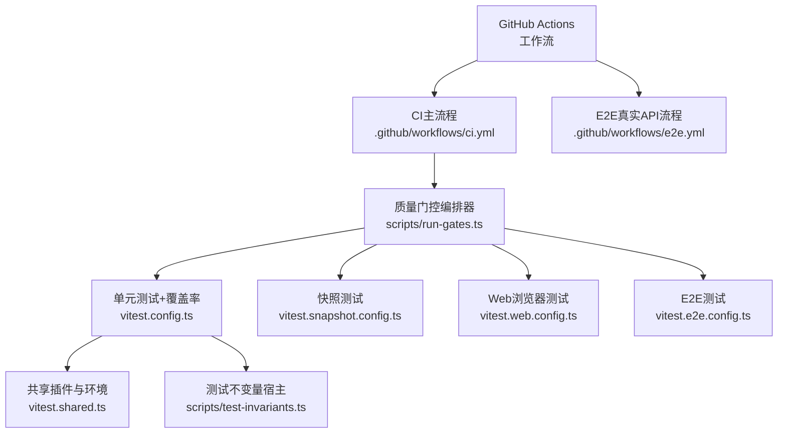
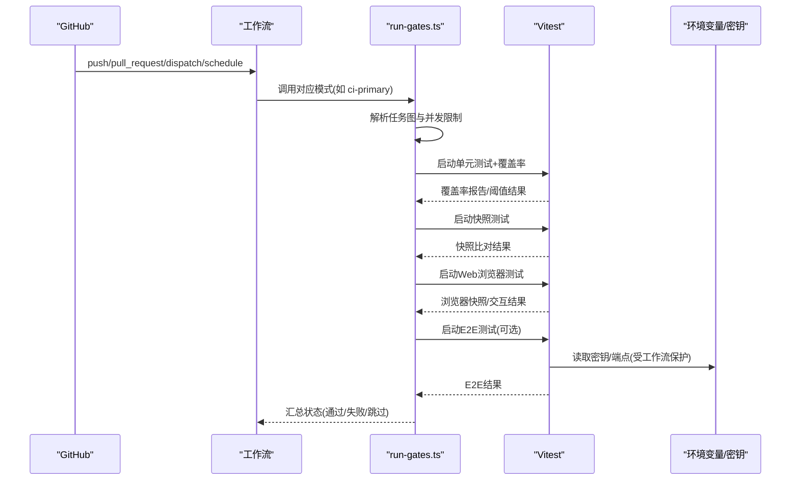
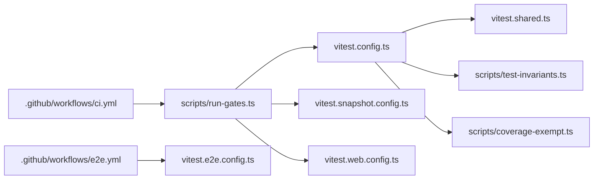

# 测试自动化

<cite>
**本文引用的文件**
- [ci.yml](file://.github/workflows/ci.yml)
- [e2e.yml](file://.github/workflows/e2e.yml)
- [package.json](file://package.json)
- [vitest.config.ts](file://vitest.config.ts)
- [vitest.e2e.config.ts](file://vitest.e2e.config.ts)
- [vitest.web.config.ts](file://vitest.web.config.ts)
- [vitest.snapshot.config.ts](file://vitest.snapshot.config.ts)
- [vitest.shared.ts](file://vitest.shared.ts)
- [run-gates.ts](file://scripts/run-gates.ts)
- [test-invariants.ts](file://scripts/test-invariants.ts)
- [coverage-exempt.ts](file://scripts/coverage-exempt.ts)
</cite>

## 目录
1. [简介](#简介)
2. [项目结构](#项目结构)
3. [核心组件](#核心组件)
4. [架构总览](#架构总览)
5. [详细组件分析](#详细组件分析)
6. [依赖关系分析](#依赖关系分析)
7. [性能考虑](#性能考虑)
8. [故障排查指南](#故障排查指南)
9. [结论](#结论)
10. [附录](#附录)

## 简介
本文件系统化文档化该仓库的测试自动化体系，覆盖持续集成流水线设计、GitHub Actions工作流与触发条件、测试套件选择与执行策略、测试结果收集与报告生成、缓存与并行优化、测试环境准备与清理、密钥管理与敏感信息保护，以及失败告警与通知机制。目标是让读者在不深入代码的前提下也能理解并维护整个测试与CI系统。

## 项目结构
仓库采用多包（monorepo）结构，测试配置集中在根目录的多个Vitest配置文件与脚本中，CI编排位于.github/workflows目录，质量门控由统一入口脚本聚合调度。

**图表来源**
- [ci.yml:1-120](file://.github/workflows/ci.yml#L1-L120)
- [e2e.yml:1-124](file://.github/workflows/e2e.yml#L1-L124)
- [run-gates.ts:180-243](file://scripts/run-gates.ts#L180-L243)
- [vitest.config.ts:117-159](file://vitest.config.ts#L117-L159)
- [vitest.snapshot.config.ts:39-68](file://vitest.snapshot.config.ts#L39-L68)
- [vitest.web.config.ts:16-35](file://vitest.web.config.ts#L16-L35)
- [vitest.e2e.config.ts:31-58](file://vitest.e2e.config.ts#L31-L58)
- [vitest.shared.ts:1-43](file://vitest.shared.ts#L1-L43)
- [test-invariants.ts:1-109](file://scripts/test-invariants.ts#L1-L109)

**章节来源**
- [ci.yml:1-120](file://.github/workflows/ci.yml#L1-L120)
- [e2e.yml:1-124](file://.github/workflows/e2e.yml#L1-L124)
- [package.json:19-143](file://package.json#L19-L143)

## 核心组件
- 质量门控编排器：集中定义CI各模式下的任务图、依赖关系与并发控制，确保类型检查、静态检查、构建、快照、覆盖率等步骤有序执行。
- Vitest多配置：按场景拆分单元测试、E2E、Web浏览器、快照测试，分别控制包含范围、超时、重试、并行度与覆盖率阈值。
- CI工作流：将编排器与具体运行环境（Node版本、平台、缓存、密钥）组合，形成可重复、可回退、可扩展的流水线。
- 测试不变量宿主：在测试启动时自动挂载每个包的“不变量”插件，保证服务拓扑与约束在测试期间生效。
- 覆盖率豁免清单：将重型套件从v8插桩路径中剔除，避免对覆盖率门槛产生干扰的同时仍保持正确性信号。

**章节来源**
- [run-gates.ts:180-243](file://scripts/run-gates.ts#L180-L243)
- [vitest.config.ts:117-159](file://vitest.config.ts#L117-L159)
- [vitest.e2e.config.ts:31-58](file://vitest.e2e.config.ts#L31-L58)
- [vitest.web.config.ts:16-35](file://vitest.web.config.ts#L16-L35)
- [vitest.snapshot.config.ts:39-68](file://vitest.snapshot.config.ts#L39-L68)
- [test-invariants.ts:1-109](file://scripts/test-invariants.ts#L1-L109)
- [coverage-exempt.ts:1-26](file://scripts/coverage-exempt.ts#L1-L26)

## 架构总览
下图展示了从事件触发到测试执行的端到端流程，包括关键分支与并行策略。

**图表来源**
- [ci.yml:1-120](file://.github/workflows/ci.yml#L1-L120)
- [run-gates.ts:180-243](file://scripts/run-gates.ts#L180-L243)
- [vitest.config.ts:117-159](file://vitest.config.ts#L117-L159)
- [vitest.snapshot.config.ts:39-68](file://vitest.snapshot.config.ts#L39-L68)
- [vitest.web.config.ts:16-35](file://vitest.web.config.ts#L16-L35)
- [vitest.e2e.config.ts:31-58](file://vitest.e2e.config.ts#L31-L58)
- [e2e.yml:54-124](file://.github/workflows/e2e.yml#L54-L124)

## 详细组件分析

### 持续集成流水线设计与触发
- 触发条件
  - 主分支push、PR、手动触发、定时任务（E2E真实API）。
  - 并发控制：同一工作流在同一ref上取消旧运行（push除外），避免阻塞关键路径。
- 作业划分
  - 静态检查、覆盖率、消费者验证、兼容性、Windows Wine与原生Windows、Python SDK与运行时、串行参考作业与自托管备用。
- 关键环境变量
  - PRIMARY_NODE_VERSION、DSH_TELEMETRY_DISABLED、DSH_GATE_CONCURRENCY、DSH_COVERAGE_MAX_WORKERS、DSH_SNAPSHOT_MAX_CONCURRENCY等。
- 失败回退
  - 通过仓库变量切换至自托管池（Linux/Windows），无需合并即可切换执行目标。

**章节来源**
- [ci.yml:1-120](file://.github/workflows/ci.yml#L1-L120)
- [ci.yml:115-258](file://.github/workflows/ci.yml#L115-L258)
- [ci.yml:260-490](file://.github/workflows/ci.yml#L260-L490)
- [ci.yml:495-697](file://.github/workflows/ci.yml#L495-L697)

### GitHub Actions工作流设置与触发条件
- CI主流程（ci.yml）
  - 多作业并行：静态、覆盖率、消费者、兼容性、Windows、Python等。
  - 缓存：pnpm store与Playwright浏览器缓存；仅在非自托管或特定条件下恢复以避免付费路径延迟。
  - 并发：按作业维度控制并发，串行参考作业用于全量回归与基准。
- E2E真实API流程（e2e.yml）
  - 仅对可信事件运行（排除fork与Dependabot PR），预检必需密钥，否则失败而非静默跳过。
  - 使用DEEPSEEK_BASE_URL固定外部端点，密钥仅暴露给必要步骤。
  - 超时与重试：单用例超时120s，最多重试2次，文件级并行可控。

**章节来源**
- [ci.yml:1-120](file://.github/workflows/ci.yml#L1-L120)
- [ci.yml:96-177](file://.github/workflows/ci.yml#L96-L177)
- [ci.yml:223-258](file://.github/workflows/ci.yml#L223-L258)
- [e2e.yml:1-124](file://.github/workflows/e2e.yml#L1-L124)

### 测试套件的选择与执行策略
- 单元测试（vitest.config.ts）
  - 包含：packages/*/tests、apps/*/tests、examples/*/tests、scripts/**/*.spec.ts。
  - 双项目隔离：thread-safe与process-bound，后者针对进程全局/时序敏感用例单独运行。
  - 覆盖率：v8提供者，严格每文件100%阈值；排除类型-only、bin/worker、部分客户端UI等。
  - 报告：CI下输出文本与自定义未覆盖位置报告；本地额外HTML报告。
- E2E（vitest.e2e.config.ts）
  - 包含：packages/*/tests/*.e2e.ts、apps/cli/tests/*.e2e.ts、examples/*/tests/*.e2e.ts。
  - 超时与重试：长超时与重试以应对网络抖动；文件级并行默认开启，可通过DSH_E2E_MAX_WORKERS调节。
- Web浏览器（vitest.web.config.ts）
  - 包含：apps/web/tests/*.e2e.ts与*.snapshot.ts；单浏览器串行执行，适合重资源场景。
- 快照（vitest.snapshot.config.ts）
  - 支持replay/record/refresh三种模式；replay默认并行且只读，record/refresh串行写盘。
  - 并发通过DSH_SNAPSHOT_MAX_CONCURRENCY控制。

**章节来源**
- [vitest.config.ts:85-159](file://vitest.config.ts#L85-L159)
- [vitest.config.ts:160-283](file://vitest.config.ts#L160-L283)
- [vitest.e2e.config.ts:31-58](file://vitest.e2e.config.ts#L31-L58)
- [vitest.web.config.ts:16-35](file://vitest.web.config.ts#L16-L35)
- [vitest.snapshot.config.ts:39-68](file://vitest.snapshot.config.ts#L39-L68)

### 测试结果收集与报告生成
- 覆盖率
  - v8提供者，严格阈值（语句/分支/函数/行均为100%，逐文件）。
  - 自定义报告：CI下输出未覆盖位置明细；本地生成HTML便于定位。
  - 重型套件豁免：通过环境变量与清单将重型套件移出插桩路径，避免影响阈值但保留正确性信号。
- 快照
  - replay模式对比已提交黄金文件；record/refresh更新记录或当前期望输出。
  - 浏览器快照与CLI/示例快照分别在不同配置中管理。
- 日志与输出
  - run-gates.ts聚合各门控的输出与耗时，便于定位瓶颈与失败原因。

**章节来源**
- [vitest.config.ts:160-283](file://vitest.config.ts#L160-L283)
- [vitest.snapshot.config.ts:24-68](file://vitest.snapshot.config.ts#L24-L68)
- [coverage-exempt.ts:1-26](file://scripts/coverage-exempt.ts#L1-L26)
- [run-gates.ts:788-800](file://scripts/run-gates.ts#L788-L800)

### 测试缓存与并行执行优化
- 缓存
  - pnpm store缓存键基于操作系统、Node版本与锁文件哈希；PR仅恢复不保存，减少付费路径延迟。
  - Playwright Chromium缓存：master生产缓存，PR恢复；自托管VM直接安装以复用镜像。
  - Wine apt缓存：master预下载deb包，PR快速恢复。
- 并行
  - 单元：分thread-safe与process-bound两个项目，均使用fork隔离；覆盖率门控将重型套件剥离并在独立进程中运行。
  - E2E：文件级并行，maxWorkers可调；真实API配额敏感场景建议降低并发。
  - 快照：replay并行，record/refresh串行；并发上限由环境变量控制。
  - 门控：run-gates.ts根据模式计算默认并发，支持DSH_GATE_CONCURRENCY覆盖。

**章节来源**
- [ci.yml:88-177](file://.github/workflows/ci.yml#L88-L177)
- [ci.yml:206-258](file://.github/workflows/ci.yml#L206-L258)
- [ci.yml:356-436](file://.github/workflows/ci.yml#L356-L436)
- [vitest.config.ts:103-159](file://vitest.config.ts#L103-L159)
- [vitest.e2e.config.ts:16-58](file://vitest.e2e.config.ts#L16-L58)
- [vitest.snapshot.config.ts:6-22](file://vitest.snapshot.config.ts#L6-L22)
- [run-gates.ts:123-156](file://scripts/run-gates.ts#L123-L156)

### 测试环境的准备与清理
- Node与工具链
  - 固定PRIMARY_NODE_VERSION；通过actions/setup-node与pnpm/action-setup安装依赖。
- 沙箱与容器
  - bubblewrap准备：在CI中安装并调整内核参数（apparmor userns），使受限环境可用。
- 浏览器与系统依赖
  - Playwright Chromium：hosted runner通过with-deps安装；自托管VM直接安装二进制。
- 清理
  - 工作流结束时关闭wineserver；测试自身负责临时目录隔离（快照与E2E用例）。

**章节来源**
- [ci.yml:162-177](file://.github/workflows/ci.yml#L162-L177)
- [ci.yml:246-258](file://.github/workflows/ci.yml#L246-L258)
- [ci.yml:389-407](file://.github/workflows/ci.yml#L389-L407)
- [e2e.yml:79-88](file://.github/workflows/e2e.yml#L79-L88)

### 密钥管理与敏感信息保护
- 最小权限
  - e2e.yml仅授予contents:read；密钥仅在需要步骤注入。
- 安全边界
  - 禁止使用pull_request_target；fork与Dependabot PR不会获得密钥，避免泄露。
- 预检与硬失败
  - 缺失密钥时显式报错，防止“全部跳过=绿色”的假阳性。
- 端点固定
  - DEEPSEEK_BASE_URL固定为外部API地址，避免本地.env误导向生产。

**章节来源**
- [e2e.yml:1-27](file://.github/workflows/e2e.yml#L1-L27)
- [e2e.yml:45-124](file://.github/workflows/e2e.yml#L45-L124)

### 测试失败的告警与通知机制
- 工作流级别
  - 通过GitHub Checks与Actions UI展示失败；可在组织/仓库级别配置Required checks与通知规则。
- 门控聚合
  - run-gates.ts汇总各门控结果，任一失败即返回非零退出码，驱动整体失败。
- 可观测性
  - 自定义覆盖率报告输出未覆盖位置；日志中包含每个门控的执行时间与输出片段，便于定位。

**章节来源**
- [run-gates.ts:788-800](file://scripts/run-gates.ts#L788-L800)
- [vitest.config.ts:280-283](file://vitest.config.ts#L280-L283)

## 依赖关系分析

**图表来源**
- [ci.yml:1-120](file://.github/workflows/ci.yml#L1-L120)
- [e2e.yml:1-124](file://.github/workflows/e2e.yml#L1-L124)
- [run-gates.ts:180-243](file://scripts/run-gates.ts#L180-L243)
- [vitest.config.ts:117-159](file://vitest.config.ts#L117-L159)
- [vitest.e2e.config.ts:31-58](file://vitest.e2e.config.ts#L31-L58)
- [vitest.web.config.ts:16-35](file://vitest.web.config.ts#L16-L35)
- [vitest.snapshot.config.ts:39-68](file://vitest.snapshot.config.ts#L39-L68)
- [vitest.shared.ts:1-43](file://vitest.shared.ts#L1-L43)
- [test-invariants.ts:1-109](file://scripts/test-invariants.ts#L1-L109)
- [coverage-exempt.ts:1-26](file://scripts/coverage-exempt.ts#L1-L26)

**章节来源**
- [run-gates.ts:180-243](file://scripts/run-gates.ts#L180-L243)
- [vitest.config.ts:117-159](file://vitest.config.ts#L117-L159)

## 性能考虑
- 并发预算
  - 覆盖率门控将重型套件剥离，并按DSH_COVERAGE_MAX_WORKERS分配线程预算，避免v8插桩放大开销。
  - 快照replay并行，record/refresh串行，避免写入竞争。
- 缓存命中
  - pnpm store与Playwright缓存显著缩短冷启动时间；自托管VM利用持久存储减少重复安装。
- 超时与重试
  - E2E与Web测试设置较长超时与重试，平衡稳定性与吞吐。
- 资源隔离
  - process-bound测试单独项目运行，避免进程全局状态污染导致的不稳定。

[本节提供通用指导，不直接分析具体文件]

## 故障排查指南
- 覆盖率失败
  - 查看未覆盖位置报告（CI文本与本地HTML），确认是否属于豁免范围或需补充测试。
  - 检查覆盖率豁免清单是否与实际执行匹配。
- 快照不一致
  - 确认DSH_SNAPSHOT模式：replay只读比对；record/refresh更新记录或期望输出。
  - 浏览器快照需在构建产物模式下运行。
- E2E失败
  - 检查密钥是否存在且有效；确认DEEPSEEK_BASE_URL指向预期端点。
  - 降低并发（DSH_E2E_MAX_WORKERS）以规避配额限制。
- 平台相关
  - Windows Wine：确保apt缓存可用；必要时重新下载依赖。
  - Linux沙箱：确认bubblewrap安装与内核参数调整成功。

**章节来源**
- [vitest.config.ts:280-283](file://vitest.config.ts#L280-L283)
- [coverage-exempt.ts:1-26](file://scripts/coverage-exempt.ts#L1-L26)
- [vitest.snapshot.config.ts:24-68](file://vitest.snapshot.config.ts#L24-L68)
- [e2e.yml:89-124](file://.github/workflows/e2e.yml#L89-L124)
- [ci.yml:389-407](file://.github/workflows/ci.yml#L389-L407)

## 结论
该仓库的测试自动化体系以“统一编排、分层配置、严格阈值、安全边界”为核心原则：通过run-gates.ts集中管理质量门控，Vitest按场景拆分配置，CI工作流提供跨平台与可回退的执行环境，并以严格的覆盖率与快照保障质量。密钥最小暴露、缓存与并行优化提升效率，失败可观测性与回退策略增强可靠性。

[本节总结性内容，不直接分析具体文件]

## 附录
- 常用命令
  - 单元测试：pnpm test
  - 覆盖率：pnpm test:coverage
  - E2E：pnpm test:e2e
  - Web测试：pnpm test:web
  - 快照回放：pnpm test:snapshot
  - 快照录制：DSH_SNAPSHOT=record pnpm test:snapshot:record
- 关键环境变量
  - DSH_GATE_CONCURRENCY：门控并发
  - DSH_COVERAGE_MAX_WORKERS：覆盖率并发
  - DSH_E2E_MAX_WORKERS：E2E并发
  - DSH_SNAPSHOT_MAX_CONCURRENCY：快照并发
  - DSH_EXAMPLE_MODE：示例运行模式（lib/source）
  - DSH_TELEMETRY_DISABLED：禁用遥测

**章节来源**
- [package.json:19-143](file://package.json#L19-L143)
- [vitest.e2e.config.ts:16-58](file://vitest.e2e.config.ts#L16-L58)
- [vitest.snapshot.config.ts:6-22](file://vitest.snapshot.config.ts#L6-L22)
- [ci.yml:37-42](file://.github/workflows/ci.yml#L37-L42)