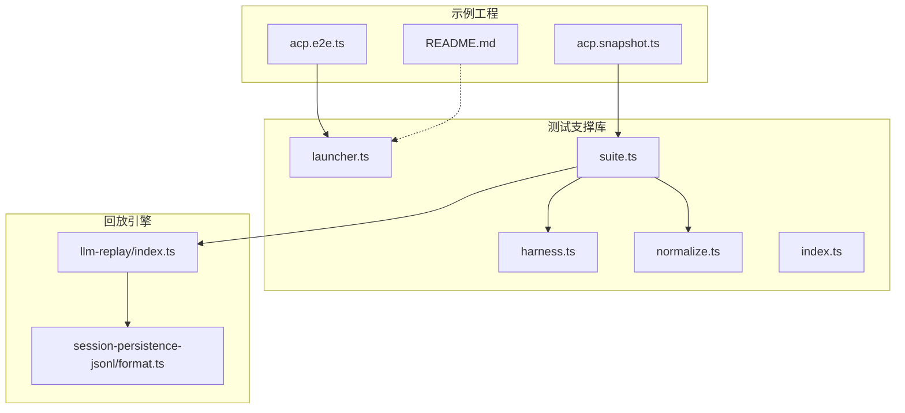
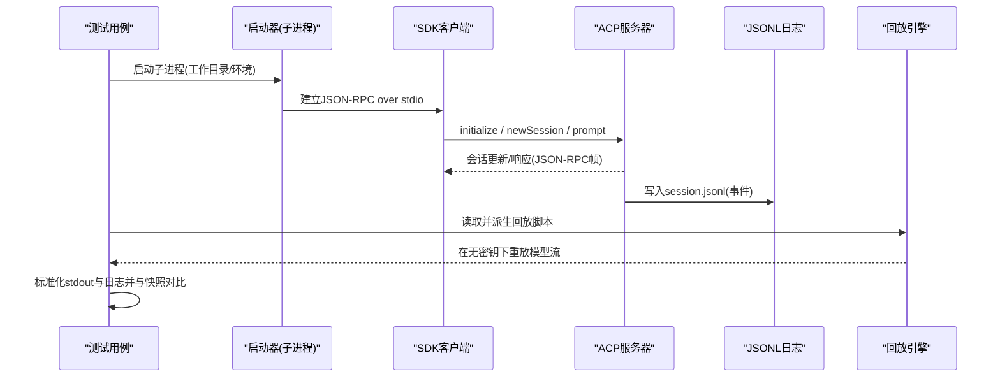
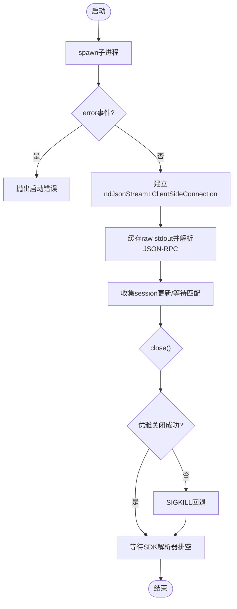
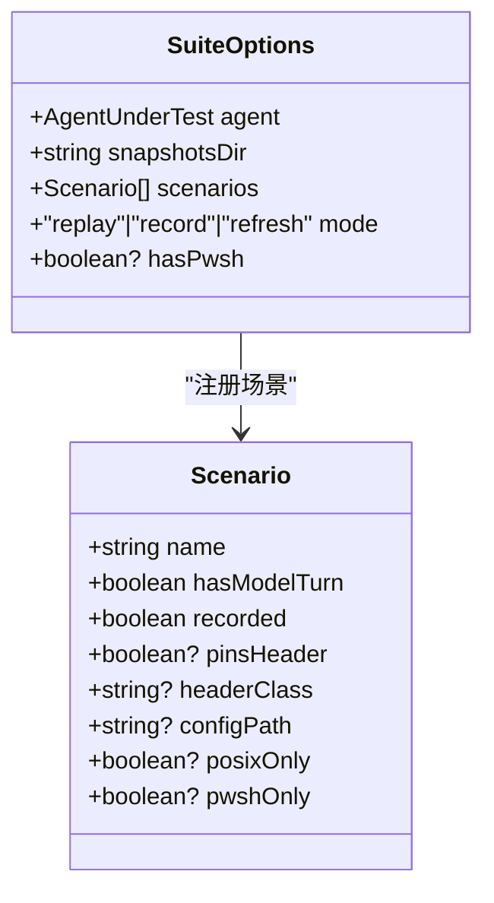
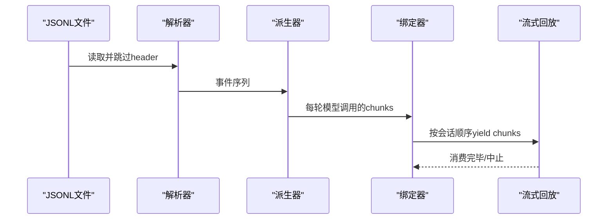

# ACP快照测试

<cite>
**本文引用的文件**
- [examples/acp-agent/tests/acp.e2e.ts](file://examples/acp-agent/tests/acp.e2e.ts)
- [examples/acp-agent/tests/acp.snapshot.ts](file://examples/acp-agent/tests/acp.snapshot.ts)
- [packages/test-support/acp-snapshot/src/index.ts](file://packages/test-support/acp-snapshot/src/index.ts)
- [packages/test-support/acp-snapshot/src/launcher.ts](file://packages/test-support/acp-snapshot/src/launcher.ts)
- [packages/test-support/acp-snapshot/src/suite.ts](file://packages/test-support/acp-snapshot/src/suite.ts)
- [packages/test-support/acp-snapshot/src/harness.ts](file://packages/test-support/acp-snapshot/src/harness.ts)
- [packages/test-support/acp-snapshot/src/normalize.ts](file://packages/test-support/acp-snapshot/src/normalize.ts)
- [packages/test-support/llm-replay/src/index.ts](file://packages/test-support/llm-replay/src/index.ts)
- [packages/session/session-persistence-jsonl/src/format.ts](file://packages/session/session-persistence-jsonl/src/format.ts)
- [examples/acp-agent/README.md](file://examples/acp-agent/README.md)
</cite>

## 目录
1. [简介](#简介)
2. [项目结构](#项目结构)
3. [核心组件](#核心组件)
4. [架构总览](#架构总览)
5. [详细组件分析](#详细组件分析)
6. [依赖关系分析](#依赖关系分析)
7. [性能考量](#性能考量)
8. [故障排查指南](#故障排查指南)
9. [结论](#结论)
10. [附录](#附录)

## 简介
本文件系统化说明 ACP（Agent Client Protocol）快照测试的完整实现与使用方式，覆盖以下主题：
- ACP 自动化服务器的启动与配置：进程管理、端口无关的 stdio JSON-RPC 通信、会话创建与服务发现。
- 会话回放机制：JSONL 事件解析、事件重放、时间同步与并发子代理绑定。
- JSON-RPC 输出验证：消息结构检查、字段值比较、错误处理验证。
- 系统提示与工具模式的固定策略：模板替换、环境变量注入、动态内容屏蔽。
- 多轮对话与复杂工具调用场景设计：异步操作处理、状态一致性验证。
- 模型转录的 tokenization 技术与变更影响分析：如何识别和评估 LLM 输出变化。
- 测试失败调试流程与修复策略：日志分析、断点调试、回归测试。

## 项目结构
ACP 快照测试由“示例工程 + 测试支撑库 + 回放引擎”三层构成：
- 示例工程：提供可被真实子进程启动的 ACP 服务器（基于 stdio JSON-RPC），并定义大量场景表与快照夹具。
- 测试支撑库：封装子进程启动、客户端连接、更新收集、标准化与对比、套件工厂等能力。
- 回放引擎：从 JSONL 会话日志派生每轮模型调用的流式片段，并在无密钥环境下进行确定性回放。

图表来源
- [examples/acp-agent/tests/acp.e2e.ts:1-127](file://examples/acp-agent/tests/acp.e2e.ts#L1-L127)
- [examples/acp-agent/tests/acp.snapshot.ts:1-662](file://examples/acp-agent/tests/acp.snapshot.ts#L1-L662)
- [packages/test-support/acp-snapshot/src/index.ts:1-54](file://packages/test-support/acp-snapshot/src/index.ts#L1-L54)
- [packages/test-support/acp-snapshot/src/launcher.ts:1-301](file://packages/test-support/acp-snapshot/src/launcher.ts#L1-L301)
- [packages/test-support/acp-snapshot/src/suite.ts:1-800](file://packages/test-support/acp-snapshot/src/suite.ts#L1-L800)
- [packages/test-support/llm-replay/src/index.ts:158-191](file://packages/test-support/llm-replay/src/index.ts#L158-L191)
- [packages/session/session-persistence-jsonl/src/format.ts:249-281](file://packages/session/session-persistence-jsonl/src/format.ts#L249-L281)

章节来源
- [examples/acp-agent/README.md:1-25](file://examples/acp-agent/README.md#L1-L25)
- [packages/test-support/acp-snapshot/src/index.ts:1-54](file://packages/test-support/acp-snapshot/src/index.ts#L1-L54)

## 核心组件
- 子进程启动器（launcher）：负责解析源码/构建入口、设置工作目录与环境变量、建立 stdio JSON-RPC 通道、捕获 stdout/stderr、维护 SDK 客户端与会话更新队列、安全关闭与回退终止。
- 套件工厂（suite）：将场景表注册为 describe/it 树，驱动真实子进程，执行标准化与对比，支持 replay/record/refresh 三种模式，并维护头信息固定与侧边文件校验。
- 运行器（harness）：编排单次场景的执行步骤，包括输入脚本、权限应答、持久化日志采集与结果汇总。
- 标准化器（normalize）：对 stdout 与 session.jsonl 进行去噪、路径归一、请求头脱敏、系统提示与工具模式清洗、tokenization 辅助等。
- 回放引擎（llm-replay）：从 JSONL 派生每轮模型调用的流式片段，按会话顺序绑定到真实会话，支持覆盖脚本、占位符替换、速率控制与消费断言。

章节来源
- [packages/test-support/acp-snapshot/src/launcher.ts:1-301](file://packages/test-support/acp-snapshot/src/launcher.ts#L1-L301)
- [packages/test-support/acp-snapshot/src/suite.ts:1-800](file://packages/test-support/acp-snapshot/src/suite.ts#L1-L800)
- [packages/test-support/acp-snapshot/src/harness.ts](file://packages/test-support/acp-snapshot/src/harness.ts)
- [packages/test-support/acp-snapshot/src/normalize.ts](file://packages/test-support/acp-snapshot/src/normalize.ts)
- [packages/test-support/llm-replay/src/index.ts:158-191](file://packages/test-support/llm-replay/src/index.ts#L158-L191)

## 架构总览
ACP 快照测试的整体流程如下：
- 测试用例通过套件工厂声明场景；每个场景指定是否包含模型轮次、是否记录、是否固定头部、平台限制等。
- 运行时启动 ACP 子进程，建立 JSON-RPC over stdio 通道，发送 initialize/newSession/prompt 等 RPC。
- 子进程输出仅包含帧化的 JSON-RPC 消息；stdout 被 tee 并交由 SDK 解析，同时保留原始字节用于纯度校验。
- 会话日志以 JSONL 格式持久化；回放引擎读取并派生每轮模型调用的流式片段，在 keyless 模式下重放。
- 套件层对 stdout 与 session.jsonl 进行标准化后与期望快照对比；必要时重写或刷新期望输出。

图表来源
- [packages/test-support/acp-snapshot/src/launcher.ts:78-179](file://packages/test-support/acp-snapshot/src/launcher.ts#L78-L179)
- [packages/test-support/llm-replay/src/index.ts:158-191](file://packages/test-support/llm-replay/src/index.ts#L158-L191)
- [packages/session/session-persistence-jsonl/src/format.ts:249-281](file://packages/session/session-persistence-jsonl/src/format.ts#L249-L281)

## 详细组件分析

### 子进程启动器（launcher）
- 进程管理：通过 spawn 启动目标 bin，设置 DSH_HOME/DSH_AGENTS_HOME 隔离工作区；监听 error/spawn/close 事件，确保启动失败与退出边界清晰。
- 通道与协议：使用 ndJsonStream 包装 stdin/stdout，构造 ClientSideConnection；所有 stdout 数据先缓冲再透传，便于 rawStdout() 做纯协议校验。
- 会话更新与等待：维护 updates 数组与 waitForUpdate 匹配器；当流关闭时拒绝未决等待，避免悬挂。
- 关闭与回退终止：优先优雅关闭（结束 stdin），若进程未退出则尝试 SIGKILL；Windows 上提供宽限期等待退出标记；最终等待 SDK 解析器排空与回调完成。

图表来源
- [packages/test-support/acp-snapshot/src/launcher.ts:78-179](file://packages/test-support/acp-snapshot/src/launcher.ts#L78-L179)
- [packages/test-support/acp-snapshot/src/launcher.ts:210-277](file://packages/test-support/acp-snapshot/src/launcher.ts#L210-L277)

章节来源
- [packages/test-support/acp-snapshot/src/launcher.ts:1-301](file://packages/test-support/acp-snapshot/src/launcher.ts#L1-L301)

### 套件工厂（suite）与场景表
- 场景表：每个场景声明 name、hasModelTurn、recorded、pinsHeader、headerClass、configPath、prepareWorkspace、posixOnly、pwshOnly 等，精确控制行为与平台限制。
- 模式切换：mode=replay/record/refresh；replay 默认 keyless，record 从真实 API 重新录制 recorded 场景，refresh 用 replay 重写期望输出与可比快照。
- 头部固定：每个 headerClass 必须有一个 pinsHeader 场景，其 system-prompt.expected.md 与 tool-schemas.expected.json 作为基准；其他成员与之比对。
- 侧边文件：system-prompt、tool-schemas、windows-native stdout 等侧边文件受严格守卫，防止意外漂移。
- 会话夹具：session.jsonl 为主，子会话按 session.N.jsonl 连续编号；校验文件名与顺序。

图表来源
- [packages/test-support/acp-snapshot/src/suite.ts:66-187](file://packages/test-support/acp-snapshot/src/suite.ts#L66-L187)
- [packages/test-support/acp-snapshot/src/suite.ts:235-256](file://packages/test-support/acp-snapshot/src/suite.ts#L235-L256)

章节来源
- [examples/acp-agent/tests/acp.snapshot.ts:133-621](file://examples/acp-agent/tests/acp.snapshot.ts#L133-L621)
- [packages/test-support/acp-snapshot/src/suite.ts:1-800](file://packages/test-support/acp-snapshot/src/suite.ts#L1-L800)

### 运行器（harness）与输入脚本
- 输入脚本：描述一次或多轮交互步骤，包括用户消息、工具调用、权限应答等。
- 权限处理：支持 requestPermission 回调，未提供时默认取消，保证失败关闭。
- 结果聚合：返回 RunResult，包含 stdout、session 日志、更新列表等，供 suite 层标准化与断言。

章节来源
- [packages/test-support/acp-snapshot/src/harness.ts]

### 标准化器（normalize）
- stdout 标准化：去除非 JSON-RPC 行、规范化路径、屏蔽敏感头。
- 会话日志标准化：跳过 header 行，解码 packed 行，剥离易变字段（id、cwd、时间戳等），保持逻辑等价。
- 系统提示与工具模式清洗：移除动态内容，保留稳定结构以便跨运行比对。
- Tokenization 辅助：提供 tokenizeSessionFixtureCwd 等工具，帮助在不同环境中稳定路径。

章节来源
- [packages/test-support/acp-snapshot/src/normalize.ts]

### 回放引擎（llm-replay）
- JSONL 解析：parseSessionLog 跳过 header，decodeStorageRecord 展开 packed 行；parseSessionHeader 提取 id/createdAt/seedLength。
- 脚本派生：deriveReplayScript 将 assistant/chunk 与标记的 compaction/summary 转换为每轮模型的 StreamChunk 序列。
- 会话绑定：loadSessionScripts 按 createdAt 排序主/子会话脚本，installLlmReplay 将 live session 映射到下一个未绑定脚本，逐条消费。
- 覆盖与占位符：支持 overrideFile 整体替换或 patches 局部替换；fromRequest 占位符可从当前请求中抽取值注入。
- 速率控制：可选 paceMs 模拟增量交付，便于浏览器 SSE 等下游观察。

图表来源
- [packages/test-support/llm-replay/src/index.ts:158-191](file://packages/test-support/llm-replay/src/index.ts#L158-L191)
- [packages/test-support/llm-replay/src/index.ts:206-263](file://packages/test-support/llm-replay/src/index.ts#L206-L263)
- [packages/test-support/llm-replay/src/index.ts:516-548](file://packages/test-support/llm-replay/src/index.ts#L516-L548)
- [packages/test-support/llm-replay/src/index.ts:697-770](file://packages/test-support/llm-replay/src/index.ts#L697-L770)

章节来源
- [packages/test-support/llm-replay/src/index.ts:1-800](file://packages/test-support/llm-replay/src/index.ts#L1-L800)

### JSON-RPC 输出验证
- 通道纯度：stdout 每行必须是合法 JSON-RPC 帧；任何非 JSON 行视为污染。
- 消息结构：suite 层对 stdout.expected.jsonl 与 session.jsonl 进行标准化后对比；工具模式与系统提示分别以独立侧边文件固定。
- 错误处理：未知工具调用、权限拒绝、子代理失败等路径通过 fixture 与断言覆盖；回放引擎对未记录会话与耗尽脚本给出明确诊断。

章节来源
- [examples/acp-agent/tests/acp.e2e.ts:42-97](file://examples/acp-agent/tests/acp.e2e.ts#L42-L97)
- [packages/test-support/acp-snapshot/src/suite.ts:323-358](file://packages/test-support/acp-snapshot/src/suite.ts#L323-L358)

### 系统提示与工具模式的固定策略
- 模板替换：工具模式使用占位符 {{tools}} 在 pinned header 中占位，运行时恢复为完整 schema 集合。
- 环境变量注入：通过 AgentUnderTest 与 launchAcpTestAgent 传入 DSH_* 环境变量，控制沙箱模式、工作区根等。
- 动态内容屏蔽：标准化器剥离 id、cwd、时间戳等易变字段；系统提示中的动态上下文被清洗，只保留稳定文本。

章节来源
- [packages/test-support/acp-snapshot/src/suite.ts:468-483](file://packages/test-support/acp-snapshot/src/suite.ts#L468-L483)
- [packages/test-support/acp-snapshot/src/launcher.ts:78-99](file://packages/test-support/acp-snapshot/src/launcher.ts#L78-L99)
- [packages/test-support/acp-snapshot/src/normalize.ts]

### 多轮对话与复杂工具调用场景
- 多轮对话：通过 InputStep 编排多轮 prompt/tool/result，suite 层会对比每轮的 stdout 与 session 日志。
- 复杂工具调用：并行工具调用、子代理、工作流等场景均有对应 scenario；通过 pinsChildToolSchemas/pinsChildSystemPrompts 固定子代理上下文。
- 异步与一致性：waitForUpdate 与 updates 队列保障事件顺序；回放引擎按首次调用顺序绑定父子会话，保证并发子代理的确定性与一致性。

章节来源
- [examples/acp-agent/tests/acp.snapshot.ts:167-493](file://examples/acp-agent/tests/acp.snapshot.ts#L167-L493)
- [packages/test-support/acp-snapshot/src/launcher.ts:153-179](file://packages/test-support/acp-snapshot/src/launcher.ts#L153-L179)
- [packages/test-support/llm-replay/src/index.ts:516-548](file://packages/test-support/llm-replay/src/index.ts#L516-L548)

### 模型转录的 tokenization 技术与变更影响分析
- Tokenization 辅助：normalize 提供 tokenizeSessionFixtureCwd，使不同环境的 cwd 在快照中稳定。
- 变更检测：suite 层计算 normalizedHeaders、normalizedSystemPrompts、normalizedToolSchemas，并与 pinned 基准比对；headerChangeCount 统计变更次数。
- 影响评估：当 header 变更超出 expectedHeaderChanges 时，需新增或调整 pinsHeader 场景，确保覆盖度与稳定性平衡。

章节来源
- [packages/test-support/acp-snapshot/src/suite.ts:388-429](file://packages/test-support/acp-snapshot/src/suite.ts#L388-L429)
- [packages/test-support/acp-snapshot/src/suite.ts:524-538](file://packages/test-support/acp-snapshot/src/suite.ts#L524-L538)

## 依赖关系分析
- 示例工程依赖测试支撑库：通过 defineAcpSnapshotSuite 注册场景，使用 launchAcpTestAgent 启动子进程。
- 测试支撑库依赖回放引擎：在 record/refresh 模式下，从 JSONL 派生回放脚本；在 replay 模式下 keyless 运行。
- 回放引擎依赖 JSONL 解析：session-persistence-jsonl 提供严格的 header 与事件解析，确保 fixture 完整性。

图表来源
- [examples/acp-agent/tests/acp.snapshot.ts:1-662](file://examples/acp-agent/tests/acp.snapshot.ts#L1-L662)
- [packages/test-support/acp-snapshot/src/suite.ts:1-800](file://packages/test-support/acp-snapshot/src/suite.ts#L1-L800)
- [packages/test-support/llm-replay/src/index.ts:158-191](file://packages/test-support/llm-replay/src/index.ts#L158-L191)
- [packages/session/session-persistence-jsonl/src/format.ts:249-281](file://packages/session/session-persistence-jsonl/src/format.ts#L249-L281)

章节来源
- [packages/test-support/acp-snapshot/src/index.ts:1-54](file://packages/test-support/acp-snapshot/src/index.ts#L1-L54)

## 性能考量
- 并发回放：replay 模式下各场景子进程独立 temp 工作区与持久化根，可并发执行；record/refresh 写操作串行以避免竞争。
- 流式回放：llm-replay 支持 paceMs 控制 chunk 间隔，便于下游传输（如 SSE）观察增量；正确性不依赖该参数。
- 日志解析：JSONL 解析采用行扫描与 packed 行展开，避免全量内存膨胀；异常行快速失败，便于定位问题。

[本节为通用指导，无需特定文件引用]

## 故障排查指南
- 通道污染：若 stdout 出现非 JSON 行，检查子进程是否误用 stdout 打印日志；应使用 stderr 输出诊断。
- 启动失败：关注 child.error 与 spawned 失败；确认 cwd、环境变量与入口路径正确。
- 会话未绑定：回放引擎在 unrecorded session 或脚本耗尽时报错；需重新录制或调整场景。
- 头部漂移：若 normalizedHeaders 与 pinned 不一致，检查系统提示与工具模式是否引入动态内容；必要时新增 pinsHeader 场景。
- 权限拒绝：requestPermission 未提供时默认取消；如需允许，提供回调并记录决策。

章节来源
- [examples/acp-agent/tests/acp.e2e.ts:42-97](file://examples/acp-agent/tests/acp.e2e.ts#L42-L97)
- [packages/test-support/acp-snapshot/src/launcher.ts:100-114](file://packages/test-support/acp-snapshot/src/launcher.ts#L100-L114)
- [packages/test-support/llm-replay/src/index.ts:716-743](file://packages/test-support/llm-replay/src/index.ts#L716-L743)

## 结论
ACP 快照测试通过“真实子进程 + keyless 回放 + 严格标准化”的组合，实现了高保真、可复现、可扩展的端到端验证。它既能在真实模型调用下录制稳定基线，也能在无密钥环境下回放关键路径，确保系统提示、工具模式、会话日志与 JSON-RPC 输出的长期一致性。配合完善的故障排查与性能优化策略，可在大规模场景中持续保障质量。

[本节为总结，无需特定文件引用]

## 附录
- 快速开始：参考示例工程 README 了解 demo:acp 与 demo:code-mode 的运行方式。
- 模式选择：DSH_SNAPSHOT=replay/record/refresh；根据需求选择录制、回放或刷新期望输出。
- 场景扩展：在 acp.snapshot.ts 的 SCENARIOS 中添加新场景，遵循 pinsHeader 与 headerClass 约定。

章节来源
- [examples/acp-agent/README.md:1-25](file://examples/acp-agent/README.md#L1-L25)
- [examples/acp-agent/tests/acp.snapshot.ts:615-621](file://examples/acp-agent/tests/acp.snapshot.ts#L615-L621)